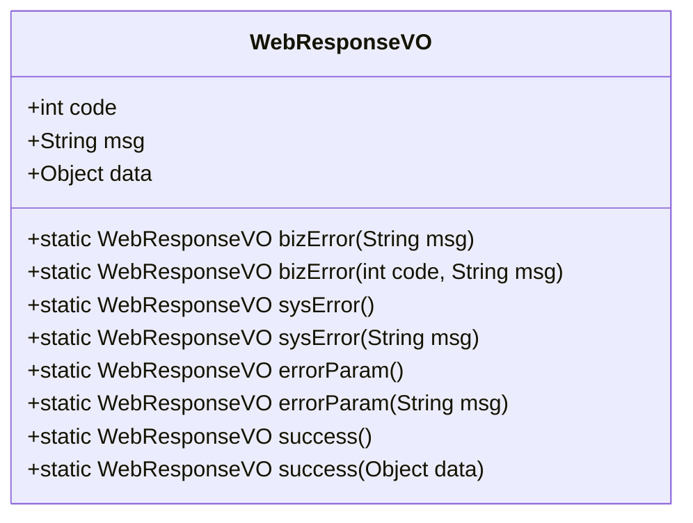
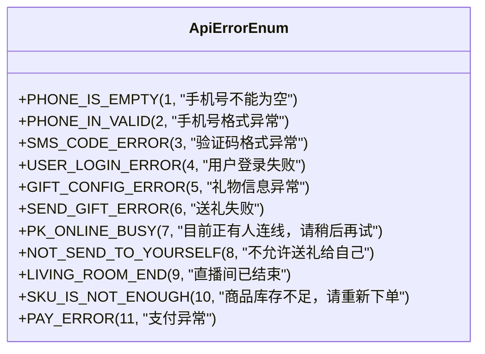
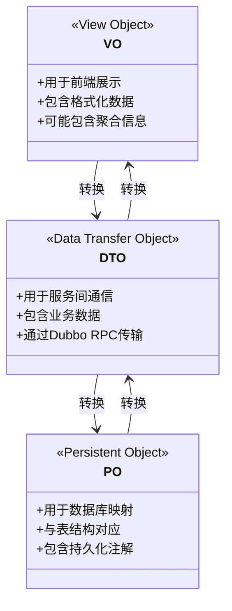
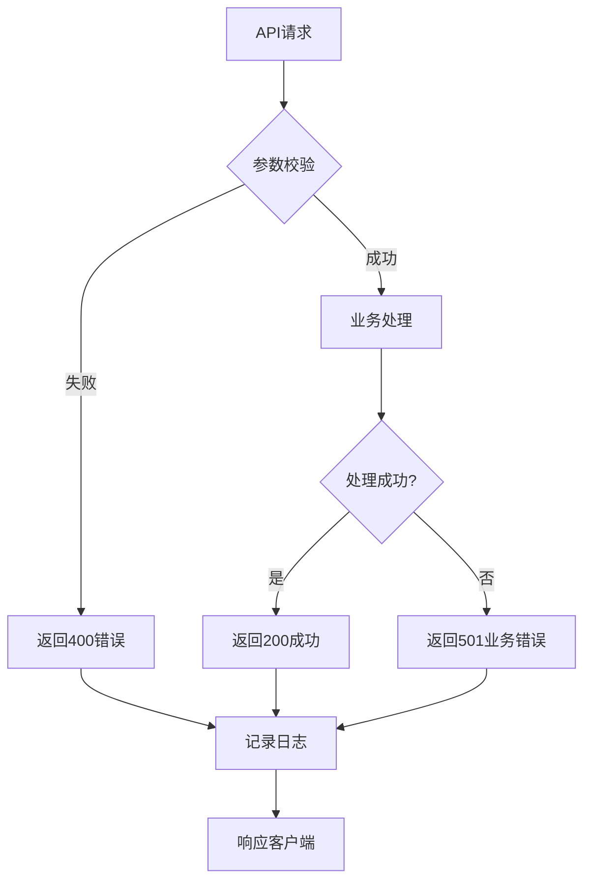

# API接口参考

<cite>
**本文档引用的文件**   
- [UserLoginController.java](file://live-api/src/main/java/com/logilong/live/api/controller/UserLoginController.java)
- [LivingRoomController.java](file://live-api/src/main/java/com/logilong/live/api/controller/LivingRoomController.java)
- [GiftController.java](file://live-api/src/main/java/com/logilong/live/api/controller/GiftController.java)
- [HomePageController.java](file://live-api/src/main/java/com/logilong/live/api/controller/HomePageController.java)
- [BankController.java](file://live-api/src/main/java/com/logilong/live/api/controller/BankController.java)
- [ShopInfoController.java](file://live-api/src/main/java/com/logilong/live/api/controller/ShopInfoController.java)
- [ImController.java](file://live-api/src/main/java/com/logilong/live/api/controller/ImController.java)
- [ApiErrorEnum.java](file://live-api/src/main/java/com/logilong/live/api/error/ApiErrorEnum.java)
- [WebResponseVO.java](file://live-common-interface/src/main/java/com/logilong/live/common/interfaces/vo/WebResponseVO.java)
- [LivingRoomReqVO.java](file://live-api/src/main/java/com/logilong/live/api/vo/req/LivingRoomReqVO.java)
- [ILivingRoomRPC.java](file://live-living-interface/src/main/java/com/logilong/live/living/interfaces/rpc/ILivingRoomRPC.java)
- [IGiftConfigRPC.java](file://live-gift-interface/src/main/java/com/logilong/live/gift/interfaces/IGiftConfigRPC.java)
- [IPayProductRPC.java](file://live-bank-interface/src/main/java/com/logilong/live/bank/interfaces/IPayProductRPC.java)
- [ISkuInfoRPC.java](file://live-sku-interface/src/main/java/com/logilong/live/sku/interfaces/ISkuInfoRPC.java)
- [IUserRPC.java](file://live-user-interface/src/main/java/com/logilong/live/user/interfaces/IUserRPC.java)
</cite>

## 目录
1. [简介](#简介)
2. [RESTful API接口](#restful-api接口)
3. [Dubbo RPC接口](#dubbo-rpc接口)
4. [调用示例](#调用示例)
5. [VO/DTO/PO转换逻辑](#vodtopo转换逻辑)
6. [接口版本管理与兼容性](#接口版本管理与兼容性)
7. [安全防护措施](#安全防护措施)

## 简介
本接口文档旨在全面描述直播平台的API接口体系，涵盖RESTful API和Dubbo RPC两类接口。文档详细说明了各接口的端点、参数、响应格式、错误码及认证方式，并提供了调用示例和数据转换逻辑，确保开发者能够正确使用平台提供的各项服务。

## RESTful API接口

### 用户登录接口
提供用户登录和验证码发送功能。

**端点**:
- `POST /userLogin/sendLoginCode` - 发送登录验证码
- `POST /userLogin/login` - 用户登录

**请求参数**:
- `phone`: 手机号 (字符串)
- `code`: 验证码 (整数)
- `response`: HTTP响应对象

**认证方式**: 无特定认证，通过手机号和验证码进行身份验证。

**Section sources**
- [UserLoginController.java](file://live-api/src/main/java/com/logilong/live/api/controller/UserLoginController.java#L19-L31)

### 直播间接口
管理直播间相关操作，包括开播、关播、连麦等。

**端点**:
- `POST /living/list` - 获取直播间列表
- `POST /living/startingLiving` - 开始直播
- `POST /living/closeLiving` - 关闭直播
- `POST /living/onlinePk` - 连麦请求
- `POST /living/anchorConfig` - 获取主播配置
- `POST /living/prepareRedPacket` - 准备红包雨
- `POST /living/startRedPacket` - 开始红包雨
- `POST /living/receiveRedPacket` - 领取红包

**请求体结构 (LivingRoomReqVO)**:
- `type`: 直播类型 (整数)
- `page`: 页码 (整数)
- `pageSize`: 每页大小 (整数)
- `roomId`: 房间ID (整数)
- `redPacketConfigCode`: 红包配置码 (字符串)

**认证方式**: 使用`LiveRequestContext`上下文进行用户身份验证。

**Section sources**
- [LivingRoomController.java](file://live-api/src/main/java/com/logilong/live/api/controller/LivingRoomController.java#L25-L95)
- [LivingRoomReqVO.java](file://live-api/src/main/java/com/logilong/live/api/vo/req/LivingRoomReqVO.java#L1-L14)

### 礼物接口
处理礼物相关的操作，包括获取礼物列表和发送礼物。

**端点**:
- `POST /gift/listGift` - 获取礼物列表
- `POST /gift/send` - 发送礼物

**请求体结构 (GiftReqVO)**:
- 包含礼物ID、数量等信息（具体结构未在代码中显示）

**认证方式**: 通过上下文获取用户身份。

**Section sources**
- [GiftController.java](file://live-api/src/main/java/com/logilong/live/api/controller/GiftController.java#L25-L40)

### 首页接口
提供首页初始化数据。

**端点**:
- `POST /home/initPage` - 初始化首页

**认证方式**: 使用`LiveRequestContext.getUserId()`获取用户ID。

**Section sources**
- [HomePageController.java](file://live-api/src/main/java/com/logilong/live/api/controller/HomePageController.java#L20-L31)

### 支付接口
处理商品支付相关操作。

**端点**:
- `POST /bank/products` - 获取商品列表
- `POST /bank/payProduct` - 支付商品

**请求体结构 (PayProductReqVO)**:
- 包含商品ID、支付类型等信息（具体结构未在代码中显示）

**认证方式**: 无特定认证。

**Section sources**
- [BankController.java](file://live-api/src/main/java/com/logilong/live/api/controller/BankController.java#L21-L38)

### 商城接口
管理购物车和商品订单。

**端点**:
- `POST /shop/listSkuInfo` - 获取商品列表
- `POST /shop/detail` - 商品详情
- `POST /shop/addCar` - 添加到购物车
- `POST /shop/removeFromCar` - 从购物车移除
- `POST /shop/getCarInfo` - 获取购物车信息
- `POST /shop/clearCar` - 清空购物车
- `POST /shop/prepareOrder` - 预下单
- `POST /shop/prepareStock` - 准备库存
- `POST /shop/payNow` - 立即支付

**认证方式**: 无特定认证。

**Section sources**
- [ShopInfoController.java](file://live-api/src/main/java/com/logilong/live/api/controller/ShopInfoController.java#L20-L75)

### 即时通讯接口
获取即时通讯配置。

**端点**:
- `POST /im/getImConfig` - 获取IM配置

**认证方式**: 无特定认证。

**Section sources**
- [ImController.java](file://live-api/src/main/java/com/logilong/live/api/controller/ImController.java#L18-L22)

### 响应格式
所有RESTful API接口均返回`WebResponseVO`格式的响应。



**Diagram sources**
- [WebResponseVO.java](file://live-common-interface/src/main/java/com/logilong/live/common/interfaces/vo/WebResponseVO.java#L1-L72)

### 错误码
定义了系统级和业务级错误码。



**Diagram sources**
- [ApiErrorEnum.java](file://live-api/src/main/java/com/logilong/live/api/error/ApiErrorEnum.java#L12-L22)

## Dubbo RPC接口

### 直播间RPC接口
提供直播间相关的远程服务。

**接口**: `ILivingRoomRPC`

**方法**:
- `list(LivingRoomReqDTO reqDTO)`: 获取直播间列表
- `startingLiving(Integer type)`: 开始直播
- `closeLiving(Integer roomId)`: 关闭直播
- `onlinePk(OnlinePKReqDTO reqDTO)`: 连麦请求
- `anchorConfig(Long userId, Integer roomId)`: 获取主播配置
- `prepareRedPacket(Long userId, Integer roomId)`: 准备红包雨
- `startRedPacket(Long userId, String code)`: 开始红包雨
- `receiveRedPacket(Long userId, String code)`: 领取红包

**调用场景**: 由`live-api`模块调用，用于处理直播间相关业务。

**超时配置**: 默认超时时间为10秒。

**Section sources**
- [ILivingRoomRPC.java](file://live-living-interface/src/main/java/com/logilong/live/living/interfaces/rpc/ILivingRoomRPC.java)

### 礼物配置RPC接口
提供礼物配置的远程服务。

**接口**: `IGiftConfigRPC`

**方法**:
- `getByGiftId(Integer giftId)`: 根据礼物ID查询
- `queryGiftList()`: 查询所有礼物
- `insertOne(GiftConfigDTO giftConfigDTO)`: 插入礼物
- `updateOne(GiftConfigDTO giftConfigDTO)`: 更新礼物

**调用场景**: 由`live-api`模块调用，用于获取礼物列表和管理礼物配置。

**超时配置**: 默认超时时间为5秒。

**Section sources**
- [IGiftConfigRPC.java](file://live-gift-interface/src/main/java/com/logilong/live/gift/interfaces/IGiftConfigRPC.java#L12-L28)

### 支付产品RPC接口
提供支付产品相关的远程服务。

**接口**: `IPayProductRPC`

**方法**:
- `products(Integer type)`: 获取商品列表
- `getByProductId(Long productId)`: 根据产品ID查询

**调用场景**: 由`live-api`模块调用，用于获取可支付商品列表。

**超时配置**: 默认超时时间为8秒。

**Section sources**
- [IPayProductRPC.java](file://live-bank-interface/src/main/java/com/logilong/live/bank/interfaces/IPayProductRPC.java#L14-L21)

### 商品信息RPC接口
提供商品信息相关的远程服务。

**接口**: `ISkuInfoRPC`

**方法**:
- `queryByAnchorId(Long anchorId)`: 根据主播ID查询商品
- `queryBySkuId(Long skuId)`: 根据SKU ID查询商品详情

**调用场景**: 由`live-api`模块调用，用于获取直播间商品信息。

**超时配置**: 默认超时时间为6秒。

**Section sources**
- [ISkuInfoRPC.java](file://live-sku-interface/src/main/java/com/logilong/live/sku/interfaces/ISkuInfoRPC.java#L15-L21)

### 用户RPC接口
提供用户信息相关的远程服务。

**接口**: `IUserRPC`

**方法**:
- `getByUserId(Long userId)`: 根据用户ID查询
- `updateUserInfo(UserDTO userDTO)`: 更新用户信息
- `insertOne(UserDTO userDTO)`: 插入用户
- `batchQueryUserInfo(List<Long> userIdList)`: 批量查询用户

**调用场景**: 由其他服务模块调用，用于获取和更新用户信息。

**超时配置**: 默认超时时间为10秒。

**Section sources**
- [IUserRPC.java](file://live-user-interface/src/main/java/com/logilong/live/user/interfaces/IUserRPC.java#L16-L42)

## 调用示例

### RESTful API调用示例
使用RestTemplate调用用户登录接口：

```java
// 创建RestTemplate实例（通常通过配置类管理）
RestTemplate restTemplate = new RestTemplate();

// 准备请求参数
MultiValueMap<String, String> params = new LinkedMultiValueMap<>();
params.add("phone", "13800138000");
params.add("code", "123456");

// 发送POST请求
WebResponseVO response = restTemplate.postForObject(
    "http://api-server/userLogin/login", 
    params, 
    WebResponseVO.class
);
```

### Dubbo RPC调用示例
使用Dubbo ReferenceConfig调用礼物配置接口：

```java
// 创建ReferenceConfig
ReferenceConfig<IGiftConfigRPC> reference = new ReferenceConfig<>();
reference.setInterface(IGiftConfigRPC.class);
reference.setUrl("dubbo://127.0.0.1:20880");
reference.setTimeout(5000);

// 获取代理实例
IGiftConfigRPC giftConfigRPC = reference.get();

// 调用远程方法
List<GiftConfigDTO> gifts = giftConfigRPC.queryGiftList();
```

**Section sources**
- [RestTemplateConfig.java](file://live-api/src/main/java/com/logilong/live/api/config/RestTemplateConfig.java)
- Dubbo配置在`application.properties`或`bootstrap.yml`中定义

## VO/DTO/PO转换逻辑

### 数据对象层次结构
系统采用典型的三层数据对象模式：VO（View Object）、DTO（Data Transfer Object）和PO（Persistent Object）。



**Diagram sources**
- [ConvertBeanUtils.java](file://live-common-interface/src/main/java/com/logilong/live/common/interfaces/utils/ConvertBeanUtils.java)

### 转换工具
系统使用`ConvertBeanUtils`工具类进行对象转换。

**转换规则**:
1. 字段名相同且类型兼容的属性自动转换
2. 日期类型自动处理格式化
3. 枚举类型通过code/value进行转换
4. 嵌套对象递归转换

**性能考虑**: 使用缓存机制避免重复反射操作。

**Section sources**
- [ConvertBeanUtils.java](file://live-common-interface/src/main/java/com/logilong/live/common/interfaces/utils/ConvertBeanUtils.java)

## 接口版本管理与兼容性

### 版本管理策略
采用语义化版本控制（Semantic Versioning）：

- 主版本号：不兼容的API修改
- 次版本号：向下兼容的功能新增
- 修订号：向下兼容的问题修正

### 兼容性保证
1. **向后兼容**: 新版本保证兼容旧版本客户端
2. **废弃策略**: 旧接口标记为@Deprecated并提供迁移指南
3. **双版本共存**: 过渡期间同时支持新旧版本
4. **版本头信息**: 通过HTTP头`X-API-Version`指定版本

### 接口演进原则
1. 不删除已有字段
2. 新增字段为可选
3. 不改变字段语义
4. 枚举值只增不减

**Section sources**
- 版本管理策略在`bootstrap.yml`和Dubbo配置中体现

## 安全防护措施

### 认证机制
1. **用户认证**: 基于Token的认证体系
2. **服务间认证**: Dubbo服务调用使用应用级认证
3. **API网关**: `live-gateway`模块统一处理认证

### 限流策略
使用`@RequestLimit`注解实现接口限流：

```java
@RequestLimit(limit = 1, second = 10, msg = "开播请求过于频繁，请稍后再试")
@PostMapping("/startingLiving")
public WebResponseVO startingLiving(Integer type) {
    // 开播逻辑
}
```

**限流参数**:
- `limit`: 限制次数
- `second`: 时间窗口（秒）
- `msg`: 限流提示信息

**Section sources**
- [RequestLimit.java](file://live-framework-web-starter/src/main/java/com/logilong/live/web/starter/config/RequestLimit.java)
- [RequestLimitInterceptor.java](file://live-framework-web-starter/src/main/java/com/logilong/live/web/starter/context/RequestLimitInterceptor.java)

### 数据安全
1. **敏感数据加密**: 手机号等敏感信息使用DES加密
2. **传输安全**: HTTPS协议传输
3. **输入验证**: 统一参数校验框架

### 错误处理
统一的错误处理机制，避免泄露系统信息：



**Diagram sources**
- [GlobalExceptionHandler.java](file://live-framework-web-starter/src/main/java/com/logilong/live/web/starter/error/GlobalExceptionHandler.java)
- [ErrorAssert.java](file://live-framework-web-starter/src/main/java/com/logilong/live/web/starter/error/ErrorAssert.java)