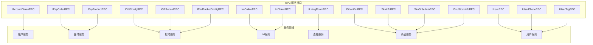
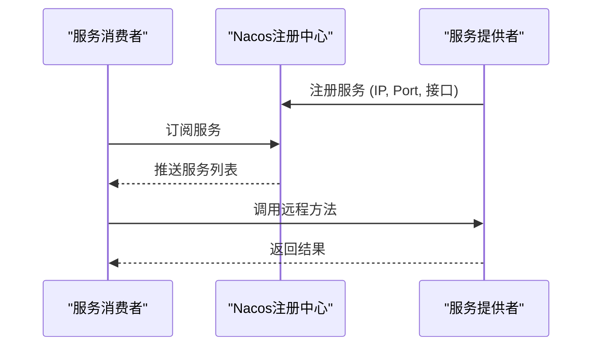

# Dubbo RPC 接口

<cite>
**本文档引用文件**   
- [IAccountTokenRPC.java](file://live-account-interface/src/main/java/com/logilong/live/account/interfaces/IAccountTokenRPC.java)
- [IPayOrderRPC.java](file://live-bank-interface/src/main/java/com/logilong/live/bank/interfaces/IPayOrderRPC.java)
- [IPayProductRPC.java](file://live-bank-interface/src/main/java/com/logilong/live/bank/interfaces/IPayProductRPC.java)
- [IGiftConfigRPC.java](file://live-gift-interface/src/main/java/com/logilong/live/gift/interfaces/IGiftConfigRPC.java)
- [IGiftRecordRPC.java](file://live-gift-interface/src/main/java/com/logilong/live/gift/interfaces/IGiftRecordRPC.java)
- [IRedPacketConfigRPC.java](file://live-gift-interface/src/main/java/com/logilong/live/gift/interfaces/IRedPacketConfigRPC.java)
- [ImOnlineRPC.java](file://live-im-interface/src/main/java/com/logilong/live/im/interfaces/ImOnlineRPC.java)
- [ImTokenRPC.java](file://live-im-interface/src/main/java/com/logilong/live/im/interfaces/ImTokenRPC.java)
- [ILivingRoomRPC.java](file://live-living-interface/src/main/java/com/logilong/live/living/interfaces/rpc/ILivingRoomRPC.java)
- [IShopCarRPC.java](file://live-sku-interface/src/main/java/com/logilong/live/sku/interfaces/IShopCarRPC.java)
- [ISkuInfoRPC.java](file://live-sku-interface/src/main/java/com/logilong/live/sku/interfaces/ISkuInfoRPC.java)
- [ISkuOrderInfoRPC.java](file://live-sku-interface/src/main/java/com/logilong/live/sku/interfaces/ISkuOrderInfoRPC.java)
- [ISkuStockInfoRPC.java](file://live-sku-interface/src/main/java/com/logilong/live/sku/interfaces/ISkuStockInfoRPC.java)
- [IUserRPC.java](file://live-user-interface/src/main/java/com/logilong/live/user/interfaces/IUserRPC.java)
- [IUserPhoneRPC.java](file://live-user-interface/src/main/java/com/logilong/live/user/interfaces/IUserPhoneRPC.java)
- [IUserTagRPC.java](file://live-user-interface/src/main/java/com/logilong/live/user/interfaces/IUserTagRPC.java)
</cite>

## 目录
1. [简介](#简介)
2. [核心RPC接口概览](#核心rpc接口概览)
3. [账户Token服务](#账户token服务)
4. [支付订单与产品服务](#支付订单与产品服务)
5. [礼物与红包服务](#礼物与红包服务)
6. [IM在线状态与Token服务](#im在线状态与token服务)
7. [直播间管理服务](#直播间管理服务)
8. [商品与购物车服务](#商品与购物车服务)
9. [用户信息服务](#用户信息服务)
10. [Dubbo调用示例](#dubbo调用示例)
11. [RPC接口管理策略](#rpc接口管理策略)

## 简介
本文档详细描述了直播平台中所有基于Dubbo的远程过程调用（RPC）接口。这些接口分布在各个*-interface模块中，为系统各微服务之间的通信提供标准化的契约。文档覆盖了接口方法的输入输出数据传输对象（DTO）、调用场景、超时配置以及业务职责，并提供了Dubbo调用示例和接口管理策略。

## 核心RPC接口概览
平台中的RPC接口按业务领域划分，主要服务于账户、支付、礼物、IM、直播、商品和用户等核心功能模块。每个接口定义了清晰的服务契约，通过Dubbo框架实现服务的注册、发现与调用。



**图示来源**
- [IAccountTokenRPC.java](file://live-account-interface/src/main/java/com/logilong/live/account/interfaces/IAccountTokenRPC.java)
- [IPayOrderRPC.java](file://live-bank-interface/src/main/java/com/logilong/live/bank/interfaces/IPayOrderRPC.java)
- [IPayProductRPC.java](file://live-bank-interface/src/main/java/com/logilong/live/bank/interfaces/IPayProductRPC.java)
- [IGiftConfigRPC.java](file://live-gift-interface/src/main/java/com/logilong/live/gift/interfaces/IGiftConfigRPC.java)
- [IGiftRecordRPC.java](file://live-gift-interface/src/main/java/com/logilong/live/gift/interfaces/IGiftRecordRPC.java)
- [IRedPacketConfigRPC.java](file://live-gift-interface/src/main/java/com/logilong/live/gift/interfaces/IRedPacketConfigRPC.java)
- [ImOnlineRPC.java](file://live-im-interface/src/main/java/com/logilong/live/im/interfaces/ImOnlineRPC.java)
- [ImTokenRPC.java](file://live-im-interface/src/main/java/com/logilong/live/im/interfaces/ImTokenRPC.java)
- [ILivingRoomRPC.java](file://live-living-interface/src/main/java/com/logilong/live/living/interfaces/rpc/ILivingRoomRPC.java)
- [IShopCarRPC.java](file://live-sku-interface/src/main/java/com/logilong/live/sku/interfaces/IShopCarRPC.java)
- [ISkuInfoRPC.java](file://live-sku-interface/src/main/java/com/logilong/live/sku/interfaces/ISkuInfoRPC.java)
- [ISkuOrderInfoRPC.java](file://live-sku-interface/src/main/java/com/logilong/live/sku/interfaces/ISkuOrderInfoRPC.java)
- [ISkuStockInfoRPC.java](file://live-sku-interface/src/main/java/com/logilong/live/sku/interfaces/ISkuStockInfoRPC.java)
- [IUserRPC.java](file://live-user-interface/src/main/java/com/logilong/live/user/interfaces/IUserRPC.java)
- [IUserPhoneRPC.java](file://live-user-interface/src/main/java/com/logilong/live/user/interfaces/IUserPhoneRPC.java)
- [IUserTagRPC.java](file://live-user-interface/src/main/java/com/logilong/live/user/interfaces/IUserTagRPC.java)

## 账户Token服务
`IAccountTokenRPC` 接口负责处理与用户账户登录Token相关的操作，是用户身份认证的核心服务。

### 接口方法
| 方法名 | 输入DTO | 输出DTO | 调用场景 | 超时配置 |
| :--- | :--- | :--- | :--- | :--- |
| `createAndSaveLoginToken` | `Long userId` | `String` | 用户登录成功后创建并保存Token | 默认超时 |
| `getUserIdByToken` | `String tokenKey` | `Long` | 校验用户Token的有效性并获取用户ID | 默认超时 |

**接口职责**：管理用户登录会话的Token，实现无状态的用户身份验证。

**接口来源**
- [IAccountTokenRPC.java](file://live-account-interface/src/main/java/com/logilong/live/account/interfaces/IAccountTokenRPC.java)

## 支付订单与产品服务
`IPayOrderRPC` 和 `IPayProductRPC` 接口共同支撑平台的支付功能，分别处理订单生命周期和产品信息查询。

### IPayOrderRPC 接口
| 方法名 | 输入DTO | 输出DTO | 调用场景 | 超时配置 |
| :--- | :--- | :--- | :--- | :--- |
| `insertOne` | `PayOrderDTO` | `String` | 创建新的支付订单 | 默认超时 |
| `updateOrderStatus` | `Long id, Integer status` | `boolean` | 根据订单ID更新订单状态 | 默认超时 |
| `updateOrderStatus` | `String orderId, Integer status` | `boolean` | 根据订单号更新订单状态 | 默认超时 |
| `payNotify` | `PayOrderDTO` | `boolean` | 处理第三方支付平台的回调通知 | 较长超时 |

**接口来源**
- [IPayOrderRPC.java](file://live-bank-interface/src/main/java/com/logilong/live/bank/interfaces/IPayOrderRPC.java)

### IPayProductRPC 接口
| 方法名 | 输入DTO | 输出DTO | 调用场景 | 超时配置 |
| :--- | :--- | :--- | :--- | :--- |
| `products` | `Integer type` | `List<PayProductDTO>` | 查询特定业务场景下的商品列表 | 默认超时 |
| `getByProductId` | `Long productId` | `PayProductDTO` | 根据商品ID查询商品详情 | 默认超时 |

**接口来源**
- [IPayProductRPC.java](file://live-bank-interface/src/main/java/com/logilong/live/bank/interfaces/IPayProductRPC.java)

## 礼物与红包服务
`IGiftConfigRPC`、`IGiftRecordRPC` 和 `IRedPacketConfigRPC` 接口负责管理直播间的礼物和红包功能。

### IGiftConfigRPC 接口
| 方法名 | 输入DTO | 输出DTO | 调用场景 | 超时配置 |
| :--- | :--- | :--- | :--- | :--- |
| `getByGiftId` | `Integer giftId` | `GiftConfigDTO` | 查询特定礼物的配置信息 | 默认超时 |
| `queryGiftList` | 无 | `List<GiftConfigDTO>` | 查询所有可用的礼物列表 | 默认超时 |
| `insertOne` | `GiftConfigDTO` | `void` | 新增一个礼物配置 | 默认超时 |
| `updateOne` | `GiftConfigDTO` | `void` | 更新现有礼物配置 | 默认超时 |

**接口来源**
- [IGiftConfigRPC.java](file://live-gift-interface/src/main/java/com/logilong/live/gift/interfaces/IGiftConfigRPC.java)

### IGiftRecordRPC 接口
| 方法名 | 输入DTO | 输出DTO | 调用场景 | 超时配置 |
| :--- | :--- | :--- | :--- | :--- |
| `insertOne` | `GiftRecordDTO` | `void` | 记录一次用户送礼行为 | 默认超时 |

**接口来源**
- [IGiftRecordRPC.java](file://live-gift-interface/src/main/java/com/logilong/live/gift/interfaces/IGiftRecordRPC.java)

### IRedPacketConfigRPC 接口
| 方法名 | 输入DTO | 输出DTO | 调用场景 | 超时配置 |
| :--- | :--- | :--- | :--- | :--- |
| `queryByAnchorId` | `Long anchorId` | `RedPacketConfigRespDTO` | 查询主播的红包雨配置 | 默认超时 |
| `updateById` | `RedPacketConfigRespDTO` | `boolean` | 更新红包雨配置 | 默认超时 |
| `addOne` | `RedPacketConfigReqDTO` | `boolean` | 新增红包雨配置 | 默认超时 |
| `prepareRedPacket` | `Long anchorId` | `boolean` | 准备生成红包金额列表 | 默认超时 |
| `receiveRedPacket` | `RedPacketConfigReqDTO` | `RedPacketReceiveDTO` | 用户领取红包 | 默认超时 |
| `startRedPacket` | `RedPacketConfigReqDTO` | `Boolean` | 开始红包雨活动 | 默认超时 |

**接口来源**
- [IRedPacketConfigRPC.java](file://live-gift-interface/src/main/java/com/logilong/live/gift/interfaces/IRedPacketConfigRPC.java)

## IM在线状态与Token服务
`ImOnlineRPC` 和 `ImTokenRPC` 接口为即时通讯（IM）系统提供支持，管理用户在线状态和连接Token。

### ImOnlineRPC 接口
| 方法名 | 输入DTO | 输出DTO | 调用场景 | 超时配置 |
| :--- | :--- | :--- | :--- | :--- |
| `isOnline` | `long userId, int appId` | `boolean` | 查询指定用户在指定应用下的在线状态 | 快速超时 |

**接口来源**
- [ImOnlineRPC.java](file://live-im-interface/src/main/java/com/logilong/live/im/interfaces/ImOnlineRPC.java)

### ImTokenRPC 接口
| 方法名 | 输入DTO | 输出DTO | 调用场景 | 超时配置 |
| :--- | :--- | :--- | :--- | :--- |
| `createImLoginToken` | `long userId, int appId` | `String` | 为用户创建连接IM服务的Token | 默认超时 |
| `getUserIdByToken` | `String token` | `Long` | 根据Token解析出用户ID | 默认超时 |

**接口来源**
- [ImTokenRPC.java](file://live-im-interface/src/main/java/com/logilong/live/im/interfaces/ImTokenRPC.java)

## 直播间管理服务
`ILivingRoomRPC` 接口负责直播间的核心管理功能，包括开播、关播、查询和PK互动。

### 接口方法
| 方法名 | 输入DTO | 输出DTO | 调用场景 | 超时配置 |
| :--- | :--- | :--- | :--- | :--- |
| `queryByRoomId` | `LivingRoomReqDTO` | `LivingRoomRespDTO` | 根据房间ID查询直播间信息 | 默认超时 |
| `queryByAnchorId` | `Long anchorId` | `LivingRoomRespDTO` | 根据主播ID查询其直播间 | 默认超时 |
| `startLivingRoom` | `LivingRoomReqDTO` | `Integer` | 主播开启直播间 | 默认超时 |
| `closeLiving` | `LivingRoomReqDTO` | `boolean` | 主播关闭直播间 | 默认超时 |
| `list` | `LivingRoomReqDTO` | `PageWrapper<LivingRoomRespDTO>` | 分页查询直播间列表 | 默认超时 |
| `queryUserIdsByRoomId` | `LivingRoomReqDTO` | `List<Long>` | 查询指定房间内的所有用户ID | 较长超时 |
| `onlinePK` | `LivingRoomReqDTO` | `LivingPkRespDTO` | PK直播间连线上准备PK | 默认超时 |
| `offlinePk` | `LivingRoomReqDTO` | `boolean` | PK直播间用户下线 | 默认超时 |
| `queryOnlinePkUserId` | `Integer roomId` | `Long` | 查询指定房间当前的PK用户ID | 默认超时 |

**接口来源**
- [ILivingRoomRPC.java](file://live-living-interface/src/main/java/com/logilong/live/living/interfaces/rpc/ILivingRoomRPC.java)

## 商品与购物车服务
`IShopCarRPC`、`ISkuInfoRPC`、`ISkuOrderInfoRPC` 和 `ISkuStockInfoRPC` 接口共同构成了商品与购物车的完整业务链路。

### IShopCarRPC 接口
| 方法名 | 输入DTO | 输出DTO | 调用场景 | 超时配置 |
| :--- | :--- | :--- | :--- | :--- |
| `getShopCarInfo` | `ShopCarReqDTO` | `ShopCarRespDTO` | 获取用户的购物车信息 | 默认超时 |
| `addShopCar` | `ShopCarReqDTO` | `boolean` | 将商品添加到购物车 | 默认超时 |
| `removeFromShopCar` | `ShopCarReqDTO` | `boolean` | 从购物车移除商品 | 默认超时 |
| `clearShopCar` | `ShopCarReqDTO` | `boolean` | 清空购物车 | 默认超时 |
| `addShopCarItemNum` | `ShopCarReqDTO` | `boolean` | 修改购物车中商品的数量 | 默认超时 |

**接口来源**
- [IShopCarRPC.java](file://live-sku-interface/src/main/java/com/logilong/live/sku/interfaces/IShopCarRPC.java)

### ISkuInfoRPC 接口
| 方法名 | 输入DTO | 输出DTO | 调用场景 | 超时配置 |
| :--- | :--- | :--- | :--- | :--- |
| `queryByAnchorId` | `Long anchorId` | `List<SkuInfoDTO>` | 查询主播名下的所有商品 | 默认超时 |
| `queryBySkuId` | `Long skuId` | `SkuDetailInfoDTO` | 根据商品ID查询商品详情 | 默认超时 |

**接口来源**
- [ISkuInfoRPC.java](file://live-sku-interface/src/main/java/com/logilong/live/sku/interfaces/ISkuInfoRPC.java)

### ISkuOrderInfoRPC 接口
| 方法名 | 输入DTO | 输出DTO | 调用场景 | 超时配置 |
| :--- | :--- | :--- | :--- | :--- |
| `queryByUserIdAndRoomId` | `Long userId, Integer roomId` | `SkuOrderInfoRespDTO` | 查询用户在指定房间的订单信息 | 默认超时 |
| `insertOne` | `SkuOrderInfoReqDTO` | `boolean` | 创建新的商品订单 | 默认超时 |
| `updateOrderStatus` | `SkuOrderInfoReqDTO` | `boolean` | 更新订单状态 | 默认超时 |
| `prepareOrder` | `PrepareOrderReqDTO` | `SkuPrepareOrderInfoDTO` | 预下单，准备订单信息 | 默认超时 |
| `payNow` | `PayNowReqDTO` | `boolean` | 立即支付订单 | 默认超时 |

**接口来源**
- [ISkuOrderInfoRPC.java](file://live-sku-interface/src/main/java/com/logilong/live/sku/interfaces/ISkuOrderInfoRPC.java)

### ISkuStockInfoRPC 接口
| 方法名 | 输入DTO | 输出DTO | 调用场景 | 超时配置 |
| :--- | :--- | :--- | :--- | :--- |
| `queryBySkuId` | `Long skuId` | `SkuStockInfoDTO` | 查询商品的库存信息 | 默认超时 |
| `prepareStockInfo` | `Long anchorId` | `boolean` | 预热主播商品的库存到缓存 | 默认超时 |
| `queryStockNum` | `Long skuId` | `Integer` | 查询商品的库存数量（缓存） | 快速超时 |
| `syncStockNumToMySql` | `Long anchorId` | `boolean` | 同步Redis库存到MySQL | 定时任务，无超时 |
| `updateStockNumBySkuId` | `Long skuId, Integer num` | `boolean` | 更新商品库存 | 默认超时 |
| `decrStockNumBySkuIdCache` | `Long skuId, Integer num` | `boolean` | 原子性地扣减商品库存（使用Lua脚本） | 默认超时 |

**接口来源**
- [ISkuStockInfoRPC.java](file://live-sku-interface/src/main/java/com/logilong/live/sku/interfaces/ISkuStockInfoRPC.java)

## 用户信息服务
`IUserRPC`、`IUserPhoneRPC` 和 `IUserTagRPC` 接口负责管理用户的核心信息、手机号和标签。

### IUserRPC 接口
| 方法名 | 输入DTO | 输出DTO | 调用场景 | 超时配置 |
| :--- | :--- | :--- | :--- | :--- |
| `getByUserId` | `Long userId` | `UserDTO` | 根据用户ID查询用户信息 | 默认超时 |
| `updateUserInfo` | `UserDTO` | `boolean` | 更新用户信息 | 默认超时 |
| `insertOne` | `UserDTO` | `boolean` | 插入新用户信息 | 默认超时 |
| `batchQueryUserInfo` | `List<Long>` | `Map<Long,UserDTO>` | 批量查询多个用户信息 | 默认超时 |

**接口来源**
- [IUserRPC.java](file://live-user-interface/src/main/java/com/logilong/live/user/interfaces/IUserRPC.java)

### IUserPhoneRPC 接口
| 方法名 | 输入DTO | 输出DTO | 调用场景 | 超时配置 |
| :--- | :--- | :--- | :--- | :--- |
| `login` | `String phone` | `UserLoginDTO` | 用户通过手机号登录（自动注册） | 默认超时 |
| `queryByPhone` | `String phone` | `UserPhoneDTO` | 根据手机号查询用户信息 | 默认超时 |
| `queryByUserId` | `Long userId` | `List<UserPhoneDTO>` | 根据用户ID查询其绑定的手机号 | 默认超时 |
| `insertUserPhone` | `String phone` | `boolean` | 插入用户手机号记录 | 默认超时 |

**接口来源**
- [IUserPhoneRPC.java](file://live-user-interface/src/main/java/com/logilong/live/user/interfaces/IUserPhoneRPC.java)

### IUserTagRPC 接口
| 方法名 | 输入DTO | 输出DTO | 调用场景 | 超时配置 |
| :--- | :--- | :--- | :--- | :--- |
| `setTag` | `Long userId, UserTagsEnum` | `boolean` | 为用户设置标签 | 默认超时 |
| `cancelTag` | `Long userId, UserTagsEnum` | `boolean` | 取消用户的标签 | 默认超时 |
| `containTag` | `Long userId, UserTagsEnum` | `boolean` | 检查用户是否包含指定标签 | 默认超时 |

**接口来源**
- [IUserTagRPC.java](file://live-user-interface/src/main/java/com/logilong/live/user/interfaces/IUserTagRPC.java)

## Dubbo调用示例
以下为使用`ReferenceConfig`调用Dubbo服务的Java代码示例：

```java
// 创建ReferenceConfig实例
ReferenceConfig<IUserRPC> reference = new ReferenceConfig<>();
reference.setApplication(new ApplicationConfig("consumer-app"));
reference.setRegistry(new RegistryConfig("nacos://127.0.0.1:8848"));
reference.setInterface(IUserRPC.class);
reference.setGroup("live-user");
reference.setVersion("1.0.0");

// 获取服务代理
IUserRPC userRPC = reference.get();

// 调用远程方法
UserDTO user = userRPC.getByUserId(123L);
```

**DTO序列化要求**：所有DTO对象必须实现`Serializable`接口，以确保能够在网络中正确序列化和反序列化。

## RPC接口管理策略
### 版本管理
所有RPC接口均采用语义化版本控制（Semantic Versioning），通过`@DubboService(version = "1.0.0")`和`@DubboReference(version = "1.0.0")`进行版本声明。当接口发生不兼容变更时，需升级主版本号。

### 分组策略
使用Dubbo的`group`参数对服务进行逻辑分组，例如：
- `live-user`：用户服务组
- `live-bank`：支付服务组
- `live-sku`：商品服务组
这有助于在多环境或灰度发布时进行服务隔离。

### Nacos注册与发现
所有Dubbo服务提供者（Provider）启动时会自动向Nacos注册中心注册其服务实例。服务消费者（Consumer）通过Nacos订阅服务列表，实现服务的动态发现和负载均衡。Nacos作为配置中心，也管理着服务的元数据和路由规则。



**图示来源**
- [IUserRPC.java](file://live-user-interface/src/main/java/com/logilong/live/user/interfaces/IUserRPC.java)
- [IAccountTokenRPC.java](file://live-account-interface/src/main/java/com/logilong/live/account/interfaces/IAccountTokenRPC.java)
- [bootstrap.yml](file://live-user-provider/src/main/resources/bootstrap.yml)
- [bootstrap.yml](file://live-account-provider/src/main/resources/bootstrap.yml)