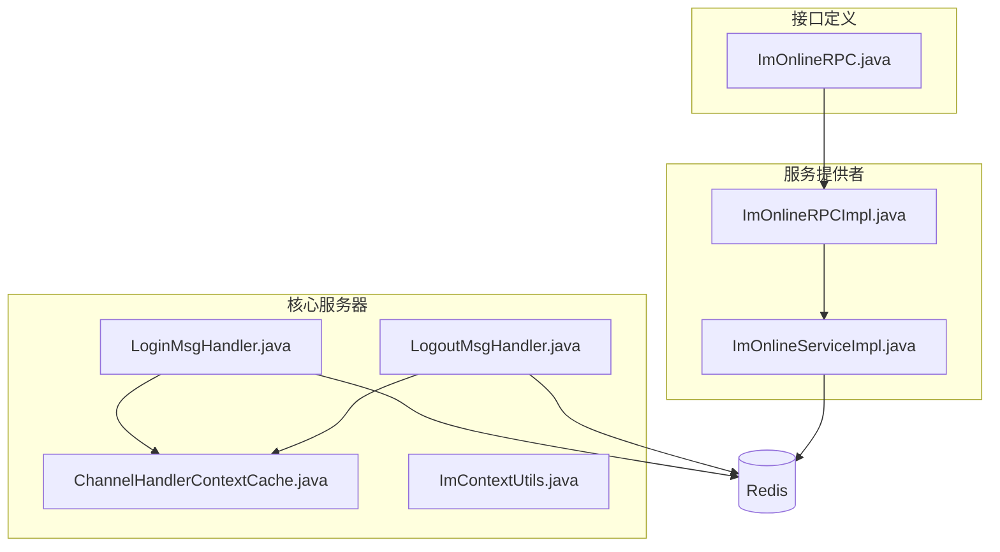
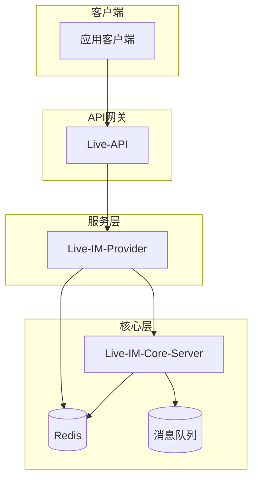
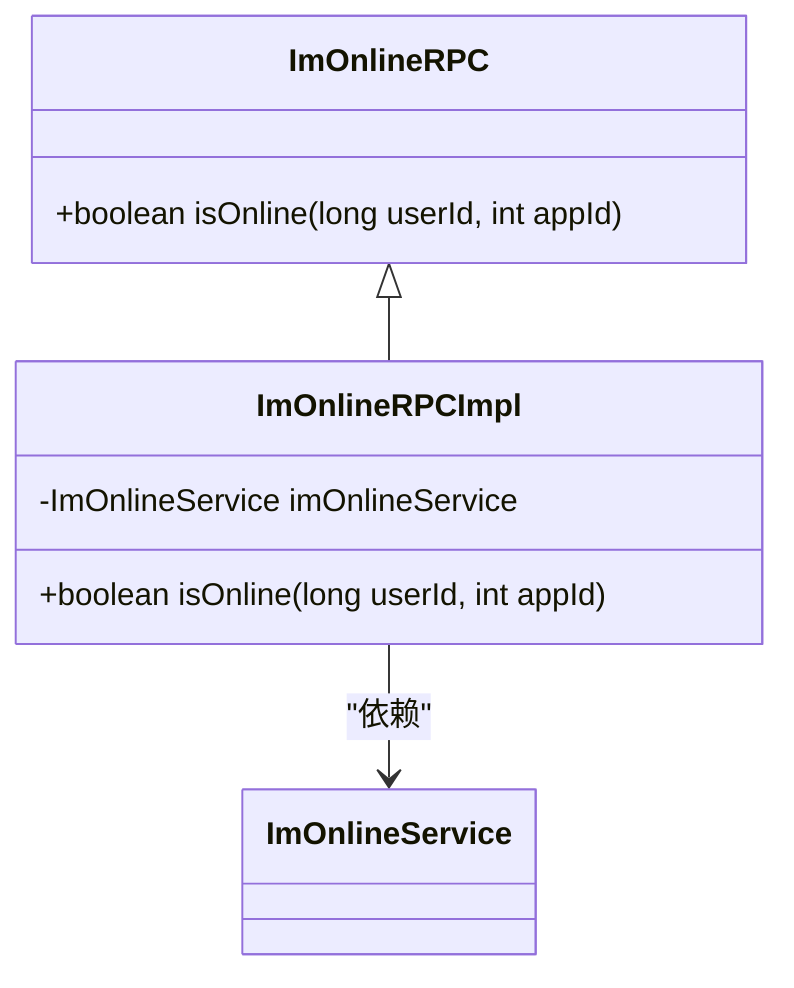
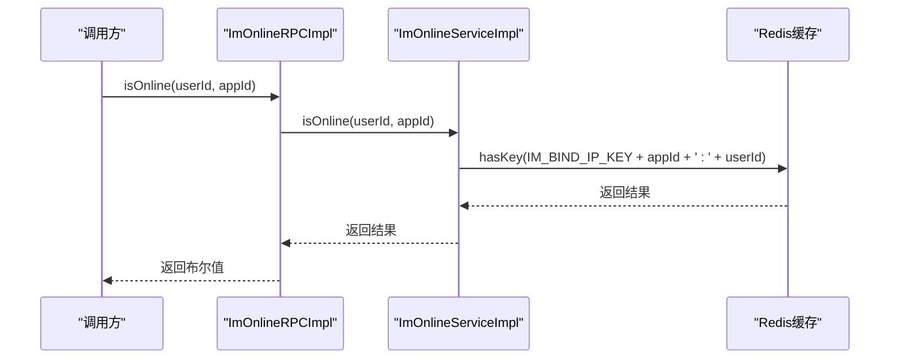
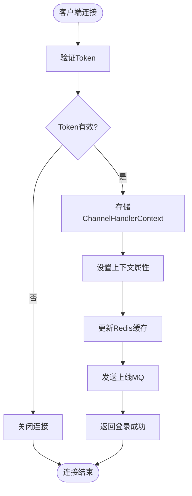
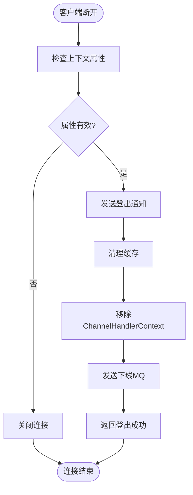
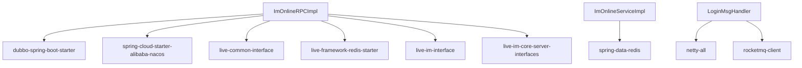

# IM在线状态RPC接口

<cite>
**本文档引用文件**   
- [ImOnlineRPC.java](file://live-im-interface/src/main/java/com/logilong/live/im/interfaces/ImOnlineRPC.java)
- [ImOnlineRPCImpl.java](file://live-im-provider/src/main/java/com/logilong/live/im/provider/rpc/ImOnlineRPCImpl.java)
- [ImOnlineServiceImpl.java](file://live-im-provider/src/main/java/com/logilong/live/im/provider/service/impl/ImOnlineServiceImpl.java)
- [ChannelHandlerContextCache.java](file://live-im-core-server/src/main/java/com/logilong/live/im/core/server/common/ChannelHandlerContextCache.java)
- [ImContextUtils.java](file://live-im-core-server/src/main/java/com/logilong/live/im/core/server/common/ImContextUtils.java)
- [LoginMsgHandler.java](file://live-im-core-server/src/main/java/com/logilong/live/im/core/server/handler/impl/LoginMsgHandler.java)
- [LogoutMsgHandler.java](file://live-im-core-server/src/main/java/com/logilong/live/im/core/server/handler/impl/LogoutMsgHandler.java)
- [ImCoreServerConstants.java](file://live-im-core-server-interfaces/src/main/java/com/logilong/live/im/core/server/interfaces/constants/ImCoreServerConstants.java)
- [ImOnlineDTO.java](file://live-im-core-server-interfaces/src/main/java/com/logilong/live/im/core/server/interfaces/dto/ImOnlineDTO.java)
- [ImOfflineDTO.java](file://live-im-core-server-interfaces/src/main/java/com/logilong/live/im/core/server/interfaces/dto/ImOfflineDTO.java)
- [bootstrap.yml](file://live-im-provider/src/main/resources/bootstrap.yml)
- [ImCoreServerProviderCacheKeyBuilder.java](file://live-framework/live-framework-redis-starter/src/main/java/com/logilong/live/framework/redis/starter/key/ImCoreServerProviderCacheKeyBuilder.java)
</cite>

## 目录
1. [介绍](#介绍)
2. [项目结构](#项目结构)
3. [核心组件](#核心组件)
4. [架构概述](#架构概述)
5. [详细组件分析](#详细组件分析)
6. [依赖分析](#依赖分析)
7. [性能考虑](#性能考虑)
8. [故障排除指南](#故障排除指南)
9. [结论](#结论)

## 介绍
本文档深入文档化ImOnlineRPC接口的isOnline方法，该方法用于检查指定用户在特定AppId下的在线状态。详细说明其在Dubbo服务架构中的暴露机制，结合ImOnlineRPCImpl实现类分析服务调用链路。解释该接口如何与live-im-core-server模块集成，通过Netty通道上下文缓存实现在线状态同步。描述接口参数含义、返回值逻辑及异常处理机制。提供实际调用示例，说明在直播间、消息推送等场景中的应用。分析性能优化策略，如缓存机制和调用频率控制。

## 项目结构
IM在线状态检查功能分布在多个模块中，主要涉及live-im-interface、live-im-provider和live-im-core-server三个核心模块。接口定义位于live-im-interface模块，具体实现位于live-im-provider模块，而底层连接管理则由live-im-core-server模块负责。

**图示来源**
- [ImOnlineRPC.java](file://live-im-interface/src/main/java/com/logilong/live/im/interfaces/ImOnlineRPC.java)
- [ImOnlineRPCImpl.java](file://live-im-provider/src/main/java/com/logilong/live/im/provider/rpc/ImOnlineRPCImpl.java)
- [ImOnlineServiceImpl.java](file://live-im-provider/src/main/java/com/logilong/live/im/provider/service/impl/ImOnlineServiceImpl.java)
- [LoginMsgHandler.java](file://live-im-core-server/src/main/java/com/logilong/live/im/core/server/handler/impl/LoginMsgHandler.java)
- [LogoutMsgHandler.java](file://live-im-core-server/src/main/java/com/logilong/live/im/core/server/handler/impl/LogoutMsgHandler.java)
- [ChannelHandlerContextCache.java](file://live-im-core-server/src/main/java/com/logilong/live/im/core/server/common/ChannelHandlerContextCache.java)

**本节来源**
- [ImOnlineRPC.java](file://live-im-interface/src/main/java/com/logilong/live/im/interfaces/ImOnlineRPC.java)
- [ImOnlineRPCImpl.java](file://live-im-provider/src/main/java/com/logilong/live/im/provider/rpc/ImOnlineRPCImpl.java)
- [ImOnlineServiceImpl.java](file://live-im-provider/src/main/java/com/logilong/live/im/provider/service/impl/ImOnlineServiceImpl.java)

## 核心组件
ImOnlineRPC接口的核心组件包括接口定义、RPC实现类、服务实现类以及底层连接管理组件。接口定义了isOnline方法，RPC实现类通过Dubbo暴露服务，服务实现类查询Redis缓存判断用户在线状态，而底层组件负责维护Netty通道上下文与用户状态的映射关系。

**本节来源**
- [ImOnlineRPC.java](file://live-im-interface/src/main/java/com/logilong/live/im/interfaces/ImOnlineRPC.java)
- [ImOnlineRPCImpl.java](file://live-im-provider/src/main/java/com/logilong/live/im/provider/rpc/ImOnlineRPCImpl.java)
- [ImOnlineServiceImpl.java](file://live-im-provider/src/main/java/com/logilong/live/im/provider/service/impl/ImOnlineServiceImpl.java)

## 架构概述
IM在线状态检查功能采用分层架构设计，包括接口层、服务层和核心服务器层。接口层定义RPC契约，服务层实现业务逻辑，核心服务器层管理客户端连接。通过Dubbo框架实现服务暴露与调用，利用Redis作为分布式缓存存储用户在线状态，Netty负责处理TCP/WS长连接。

**图示来源**
- [ImOnlineRPCImpl.java](file://live-im-provider/src/main/java/com/logilong/live/im/provider/rpc/ImOnlineRPCImpl.java)
- [ImOnlineServiceImpl.java](file://live-im-provider/src/main/java/com/logilong/live/im/provider/service/impl/ImOnlineServiceImpl.java)
- [LoginMsgHandler.java](file://live-im-core-server/src/main/java/com/logilong/live/im/core/server/handler/impl/LoginMsgHandler.java)

## 详细组件分析

### ImOnlineRPC接口分析
ImOnlineRPC接口是IM在线状态检查的核心契约，定义了isOnline方法用于判断用户是否在线。该接口被Dubbo框架用于服务暴露，使得其他服务可以通过RPC调用检查用户在线状态。

#### 接口定义

**图示来源**
- [ImOnlineRPC.java](file://live-im-interface/src/main/java/com/logilong/live/im/interfaces/ImOnlineRPC.java)
- [ImOnlineRPCImpl.java](file://live-im-provider/src/main/java/com/logilong/live/im/provider/rpc/ImOnlineRPCImpl.java)

#### 服务调用链路

**图示来源**
- [ImOnlineRPCImpl.java](file://live-im-provider/src/main/java/com/logilong/live/im/provider/rpc/ImOnlineRPCImpl.java)
- [ImOnlineServiceImpl.java](file://live-im-provider/src/main/java/com/logilong/live/im/provider/service/impl/ImOnlineServiceImpl.java)

**本节来源**
- [ImOnlineRPC.java](file://live-im-interface/src/main/java/com/logilong/live/im/interfaces/ImOnlineRPC.java)
- [ImOnlineRPCImpl.java](file://live-im-provider/src/main/java/com/logilong/live/im/provider/rpc/ImOnlineRPCImpl.java)
- [ImOnlineServiceImpl.java](file://live-im-provider/src/main/java/com/logilong/live/im/provider/service/impl/ImOnlineServiceImpl.java)

### 在线状态同步机制分析
在线状态同步机制是IM系统的核心功能之一，通过Netty通道上下文缓存和Redis分布式缓存实现用户在线状态的实时同步。

#### 登录处理流程

**图示来源**
- [LoginMsgHandler.java](file://live-im-core-server/src/main/java/com/logilong/live/im/core/server/handler/impl/LoginMsgHandler.java)
- [ChannelHandlerContextCache.java](file://live-im-core-server/src/main/java/com/logilong/live/im/core/server/common/ChannelHandlerContextCache.java)
- [ImContextUtils.java](file://live-im-core-server/src/main/java/com/logilong/live/im/core/server/common/ImContextUtils.java)

#### 登出处理流程

**图示来源**
- [LogoutMsgHandler.java](file://live-im-core-server/src/main/java/com/logilong/live/im/core/server/handler/impl/LogoutMsgHandler.java)
- [ChannelHandlerContextCache.java](file://live-im-core-server/src/main/java/com/logilong/live/im/core/server/common/ChannelHandlerContextCache.java)
- [ImContextUtils.java](file://live-im-core-server/src/main/java/com/logilong/live/im/core/server/common/ImContextUtils.java)

**本节来源**
- [LoginMsgHandler.java](file://live-im-core-server/src/main/java/com/logilong/live/im/core/server/handler/impl/LoginMsgHandler.java)
- [LogoutMsgHandler.java](file://live-im-core-server/src/main/java/com/logilong/live/im/core/server/handler/impl/LogoutMsgHandler.java)
- [ChannelHandlerContextCache.java](file://live-im-core-server/src/main/java/com/logilong/live/im/core/server/common/ChannelHandlerContextCache.java)
- [ImContextUtils.java](file://live-im-core-server/src/main/java/com/logilong/live/im/core/server/common/ImContextUtils.java)

## 依赖分析
ImOnlineRPC功能依赖多个核心组件和服务，包括Dubbo服务框架、Nacos服务发现、Redis缓存和RocketMQ消息队列。

**图示来源**
- [ImOnlineRPCImpl.java](file://live-im-provider/src/main/java/com/logilong/live/im/provider/rpc/ImOnlineRPCImpl.java)
- [pom.xml](file://live-im-provider/pom.xml)
- [LoginMsgHandler.java](file://live-im-core-server/src/main/java/com/logilong/live/im/core/server/handler/impl/LoginMsgHandler.java)

**本节来源**
- [ImOnlineRPCImpl.java](file://live-im-provider/src/main/java/com/logilong/live/im/provider/rpc/ImOnlineRPCImpl.java)
- [pom.xml](file://live-im-provider/pom.xml)
- [LoginMsgHandler.java](file://live-im-core-server/src/main/java/com/logilong/live/im/core/server/handler/impl/LoginMsgHandler.java)

## 性能考虑
ImOnlineRPC接口的性能优化主要体现在缓存机制、调用频率控制和连接管理三个方面。

### 缓存机制
接口使用Redis作为分布式缓存存储用户在线状态，通过hasKey操作快速判断用户是否在线。缓存键遵循"live-im-core-server:bindIp:{appId}:{userId}"格式，确保键的唯一性和可读性。

### 调用频率控制
虽然当前实现中未直接体现调用频率控制，但可通过Dubbo的限流机制或在调用方实现缓存来减少对后端服务的压力。建议在高频调用场景下，调用方实现本地缓存，避免频繁RPC调用。

### 连接管理优化
通过ChannelHandlerContextCache集中管理Netty通道上下文，避免了重复查找和创建。同时，利用Redis的过期机制自动清理长时间未活动的连接，减少内存占用。

**本节来源**
- [ImOnlineServiceImpl.java](file://live-im-provider/src/main/java/com/logilong/live/im/provider/service/impl/ImOnlineServiceImpl.java)
- [ImCoreServerConstants.java](file://live-im-core-server-interfaces/src/main/java/com/logilong/live/im/core/server/interfaces/constants/ImCoreServerConstants.java)
- [ChannelHandlerContextCache.java](file://live-im-core-server/src/main/java/com/logilong/live/im/core/server/common/ChannelHandlerContextCache.java)

## 故障排除指南
### 常见问题及解决方案
1. **用户在线但isOnline返回false**
   - 检查Redis中是否存在对应键值
   - 确认用户登录时是否成功写入Redis
   - 检查Redis连接是否正常

2. **频繁的Redis连接超时**
   - 检查Redis服务器负载
   - 确认连接池配置是否合理
   - 检查网络延迟

3. **用户下线后状态未及时更新**
   - 检查客户端是否正常发送登出消息
   - 确认LogoutMsgHandler是否正确执行
   - 检查MQ发送是否成功

**本节来源**
- [ImOnlineServiceImpl.java](file://live-im-provider/src/main/java/com/logilong/live/im/provider/service/impl/ImOnlineServiceImpl.java)
- [LoginMsgHandler.java](file://live-im-core-server/src/main/java/com/logilong/live/im/core/server/handler/impl/LoginMsgHandler.java)
- [LogoutMsgHandler.java](file://live-im-core-server/src/main/java/com/logilong/live/im/core/server/handler/impl/LogoutMsgHandler.java)

## 结论
ImOnlineRPC接口通过Dubbo服务框架暴露，利用Redis缓存实现高效的在线状态查询。其与live-im-core-server模块深度集成，通过Netty通道上下文缓存和Redis分布式缓存实现用户在线状态的实时同步。该设计具有良好的扩展性和性能表现，适用于直播间、消息推送等多种实时通信场景。建议在实际应用中结合本地缓存和调用频率控制进一步优化性能。