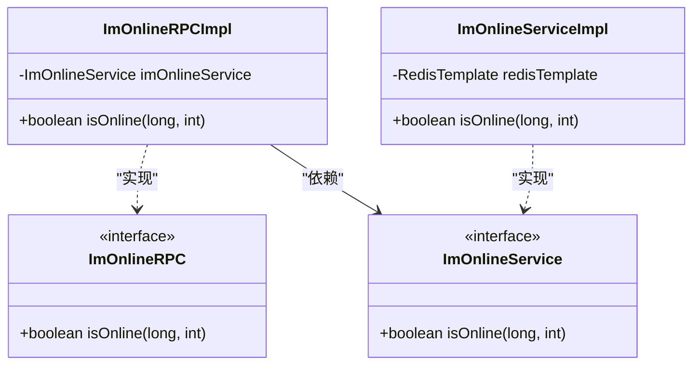
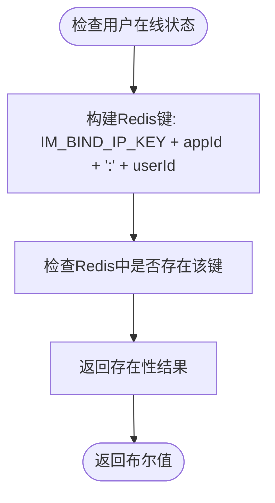
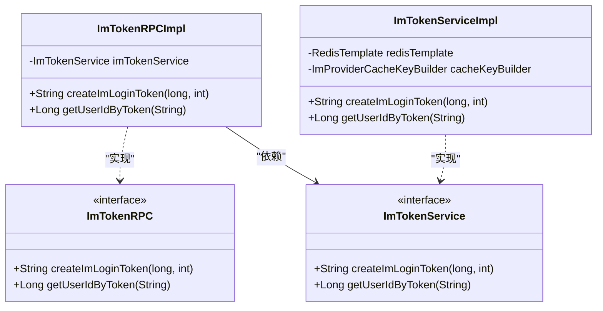
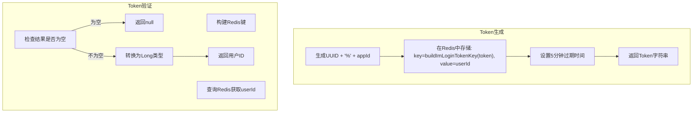
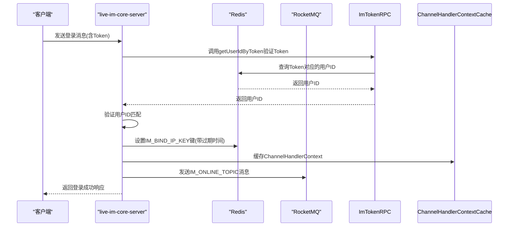
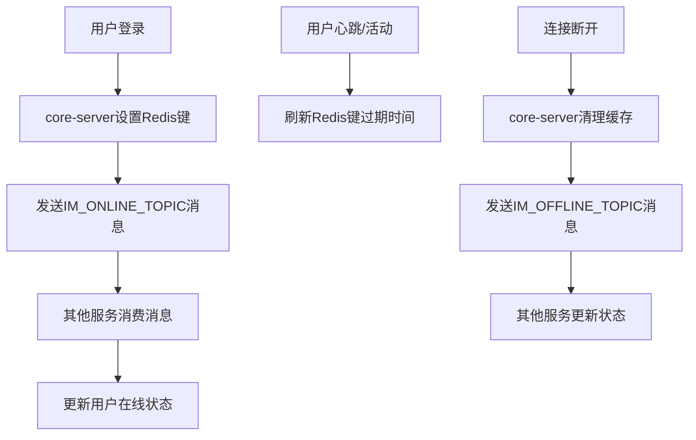
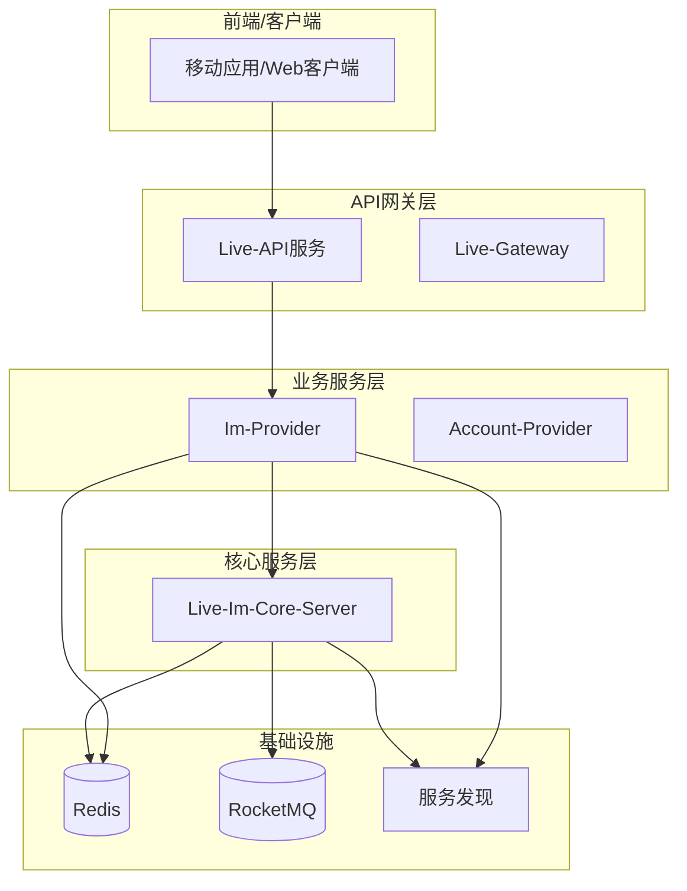
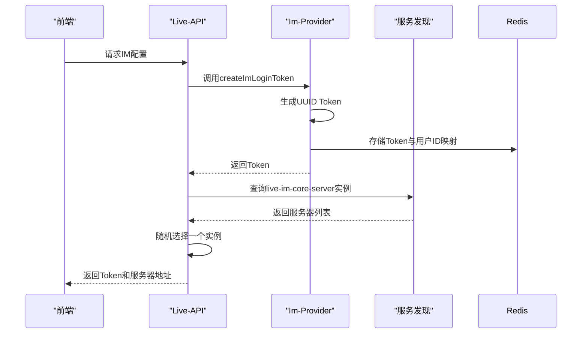

# IM服务RPC接口

<cite>
**本文档引用的文件**
- [ImOnlineRPC.java](file://live-im-interface/src/main/java/com/logilong/live/im/interfaces/ImOnlineRPC.java)
- [ImTokenRPC.java](file://live-im-interface/src/main/java/com/logilong/live/im/interfaces/ImTokenRPC.java)
- [ImOnlineRPCImpl.java](file://live-im-provider/src/main/java/com/logilong/live/im/provider/rpc/ImOnlineRPCImpl.java)
- [ImTokenRPCImpl.java](file://live-im-provider/src/main/java/com/logilong/live/im/provider/rpc/ImTokenRPCImpl.java)
- [ImOnlineServiceImpl.java](file://live-im-provider/src/main/java/com/logilong/live/im/provider/service/impl/ImOnlineServiceImpl.java)
- [ImTokenServiceImpl.java](file://live-im-provider/src/main/java/com/logilong/live/im/provider/service/impl/ImTokenServiceImpl.java)
- [LoginMsgHandler.java](file://live-im-core-server/src/main/java/com/logilong/live/im/core/server/handler/impl/LoginMsgHandler.java)
- [ImCoreServerConstants.java](file://live-im-core-server-interfaces/src/main/java/com/logilong/live/im/core/server/interfaces/constants/ImCoreServerConstants.java)
- [ImProviderCacheKeyBuilder.java](file://live-framework/live-framework-redis-starter/src/main/java/com/logilong/live/framework/redis/starter/key/ImProviderCacheKeyBuilder.java)
- [ImServiceImpl.java](file://live-api/src/main/java/com/logilong/live/api/service/impl/ImServiceImpl.java)
- [ImCoreServerProviderTopicNames.java](file://live-common-interface/src/main/java/com/logilong/live/common/interfaces/topic/ImCoreServerProviderTopicNames.java)
</cite>

## 目录
1. [简介](#简介)
2. [核心RPC接口定义](#核心rpc接口定义)
3. [ImOnlineRPC接口实现与集成机制](#imonlinerpc接口实现与集成机制)
4. [ImTokenRPC接口实现与安全机制](#imtokenrpc接口实现与安全机制)
5. [实时消息推送与在线状态同步](#实时消息推送与在线状态同步)
6. [系统架构与组件交互](#系统架构与组件交互)
7. [关键数据流分析](#关键数据流分析)
8. [结论](#结论)

## 简介
本文档深入分析IM服务相关的RPC接口，重点阐述ImOnlineRPC和ImTokenRPC两个核心接口的实现机制。文档详细说明了用户在线状态检查、IM登录Token生成与验证、以及这些功能如何与live-im-core-server集成以支持实时消息推送和在线状态同步。通过分析live-im-provider中的具体实现类，揭示了底层逻辑和数据流转过程。

## 核心RPC接口定义

### ImOnlineRPC接口
ImOnlineRPC接口定义了检查用户在线状态的方法，用于判断指定用户在特定AppId下是否处于在线状态。

**接口方法**:
- `boolean isOnline(long userId, int appId)`：检查用户是否在线

**Section sources**
- [ImOnlineRPC.java](file://live-im-interface/src/main/java/com/logilong/live/im/interfaces/ImOnlineRPC.java#L1-L13)

### ImTokenRPC接口
ImTokenRPC接口提供了IM登录Token的生成和解析功能，是用户身份验证的核心组件。

**接口方法**:
- `String createImLoginToken(long userId, int appId)`：为用户生成IM登录Token
- `Long getUserIdByToken(String token)`：根据Token解析用户ID

**Section sources**
- [ImTokenRPC.java](file://live-im-interface/src/main/java/com/logilong/live/im/interfaces/ImTokenRPC.java#L1-L16)

## ImOnlineRPC接口实现与集成机制

### 接口实现类
ImOnlineRPC接口由ImOnlineRPCImpl类实现，该类通过Dubbo服务暴露，调用底层ImOnlineService服务。

**Diagram sources**
- [ImOnlineRPCImpl.java](file://live-im-provider/src/main/java/com/logilong/live/im/provider/rpc/ImOnlineRPCImpl.java#L1-L20)
- [ImOnlineServiceImpl.java](file://live-im-provider/src/main/java/com/logilong/live/im/provider/service/impl/ImOnlineServiceImpl.java#L1-L22)

### 在线状态检查逻辑
ImOnlineServiceImpl通过Redis检查用户在线状态，使用ImCoreServerConstants中定义的键前缀。

**Section sources**
- [ImOnlineServiceImpl.java](file://live-im-provider/src/main/java/com/logilong/live/im/provider/service/impl/ImOnlineServiceImpl.java#L1-L22)
- [ImCoreServerConstants.java](file://live-im-core-server-interfaces/src/main/java/com/logilong/live/im/core/server/interfaces/constants/ImCoreServerConstants.java#L1-L8)

## ImTokenRPC接口实现与安全机制

### 接口实现类
ImTokenRPC接口由ImTokenRPCImpl类实现，通过Dubbo服务暴露，委托给ImTokenService处理具体逻辑。

**Diagram sources**
- [ImTokenRPCImpl.java](file://live-im-provider/src/main/java/com/logilong/live/im/provider/rpc/ImTokenRPCImpl.java#L1-L27)
- [ImTokenServiceImpl.java](file://live-im-provider/src/main/java/com/logilong/live/im/provider/service/impl/ImTokenServiceImpl.java#L1-L35)

### Token生成与验证机制
ImTokenServiceImpl实现了Token的生成和验证逻辑，使用UUID结合AppId作为Token，并在Redis中存储用户ID。

**Section sources**
- [ImTokenServiceImpl.java](file://live-im-provider/src/main/java/com/logilong/live/im/provider/service/impl/ImTokenServiceImpl.java#L1-L35)
- [ImProviderCacheKeyBuilder.java](file://live-framework/live-framework-redis-starter/src/main/java/com/logilong/live/framework/redis/starter/key/ImProviderCacheKeyBuilder.java#L1-L20)

## 实时消息推送与在线状态同步

### 与live-im-core-server的集成
当用户成功登录时，LoginMsgHandler会更新用户状态并发送MQ消息通知其他系统组件。

**Diagram sources**
- [LoginMsgHandler.java](file://live-im-core-server/src/main/java/com/logilong/live/im/core/server/handler/impl/LoginMsgHandler.java#L1-L121)
- [ImCoreServerConstants.java](file://live-im-core-server-interfaces/src/main/java/com/logilong/live/im/core/server/interfaces/constants/ImCoreServerConstants.java#L1-L8)
- [ImCoreServerProviderTopicNames.java](file://live-common-interface/src/main/java/com/logilong/live/common/interfaces/topic/ImCoreServerProviderTopicNames.java#L1-L25)

### 在线状态同步流程
系统通过Redis键的存在性和MQ消息来维护和同步用户的在线状态。

**Section sources**
- [LoginMsgHandler.java](file://live-im-core-server/src/main/java/com/logilong/live/im/core/server/handler/impl/LoginMsgHandler.java#L79-L119)
- [ImCoreServerProviderTopicNames.java](file://live-common-interface/src/main/java/com/logilong/live/common/interfaces/topic/ImCoreServerProviderTopicNames.java#L1-L25)

## 系统架构与组件交互

### 整体架构图
展示IM相关组件的层次结构和依赖关系。

**Diagram sources**
- [ImServiceImpl.java](file://live-api/src/main/java/com/logilong/live/api/service/impl/ImServiceImpl.java#L1-L41)
- [LoginMsgHandler.java](file://live-im-core-server/src/main/java/com/logilong/live/im/core/server/handler/impl/LoginMsgHandler.java#L1-L121)

## 关键数据流分析

### IM配置获取流程
从API层获取IM配置信息的完整流程，包括Token生成和服务器地址发现。

**Section sources**
- [ImServiceImpl.java](file://live-api/src/main/java/com/logilong/live/api/service/impl/ImServiceImpl.java#L1-L41)
- [ImTokenRPCImpl.java](file://live-im-provider/src/main/java/com/logilong/live/im/provider/rpc/ImTokenRPCImpl.java#L1-L27)

## 结论
本文档详细分析了IM服务的RPC接口实现机制。ImOnlineRPC通过Redis键存在性检查用户在线状态，ImTokenRPC使用UUID生成Token并结合Redis实现安全的用户身份验证。这些接口与live-im-core-server深度集成，通过Redis状态存储和RocketMQ消息通知，实现了高效的实时消息推送和在线状态同步功能。整个系统采用分层架构，各组件职责清晰，通过Dubbo RPC和消息队列实现松耦合的分布式通信。