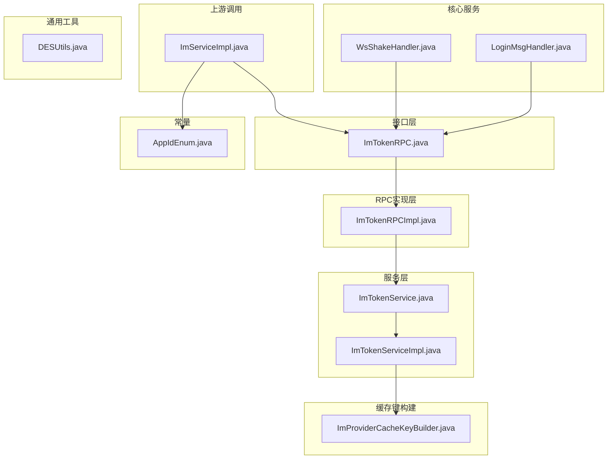
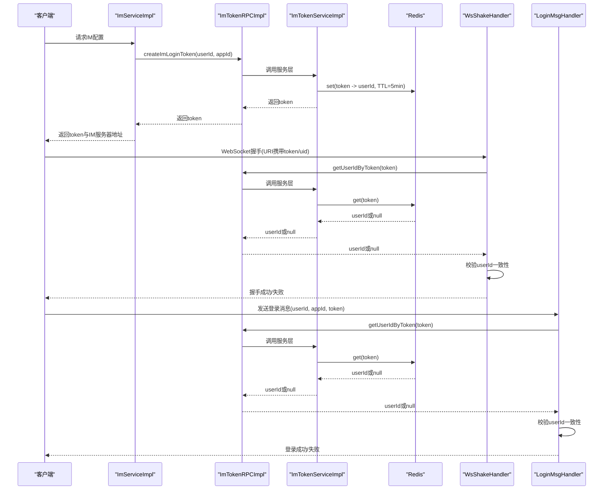
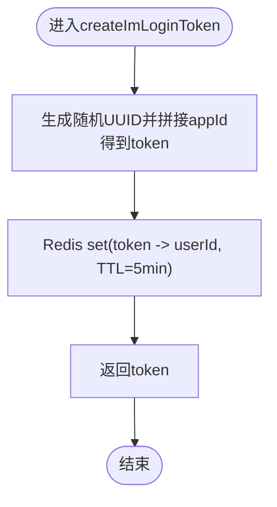
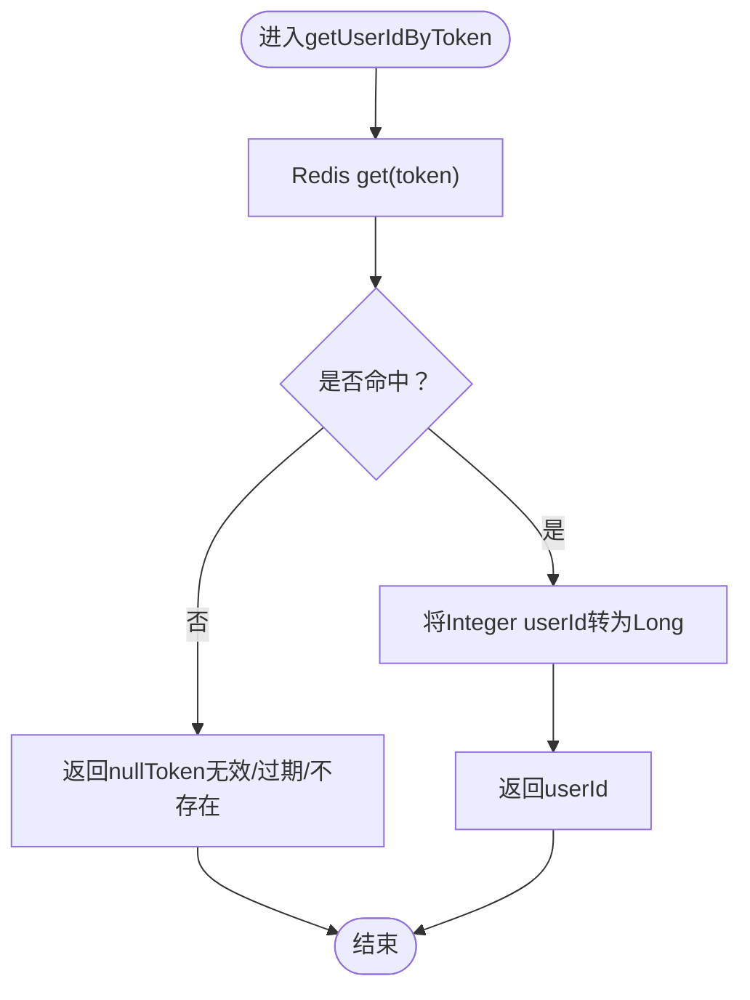
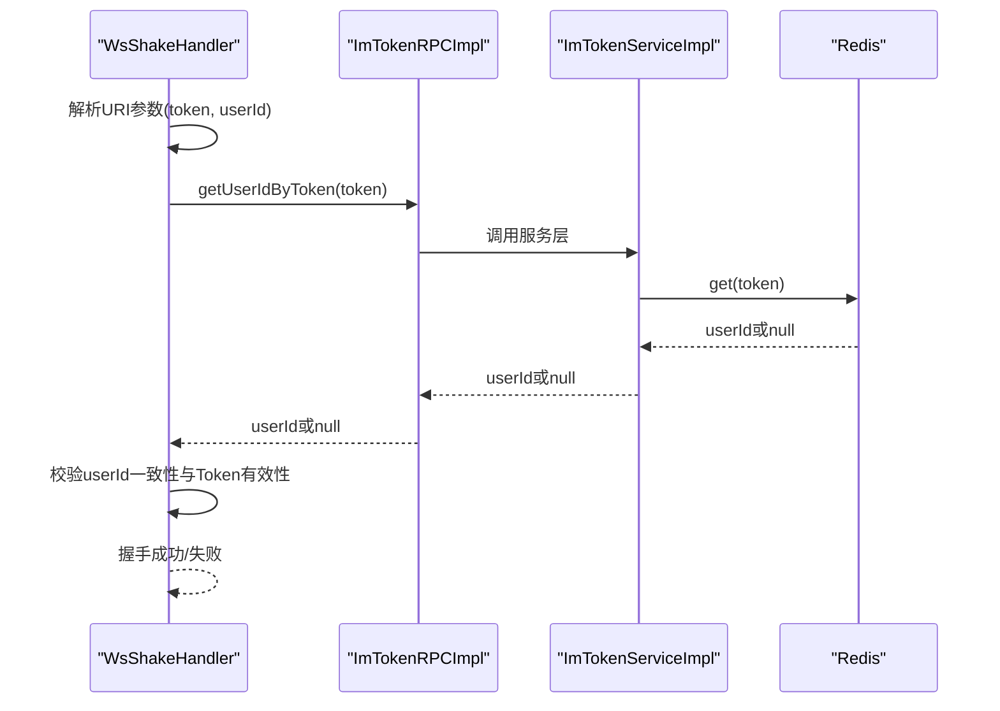
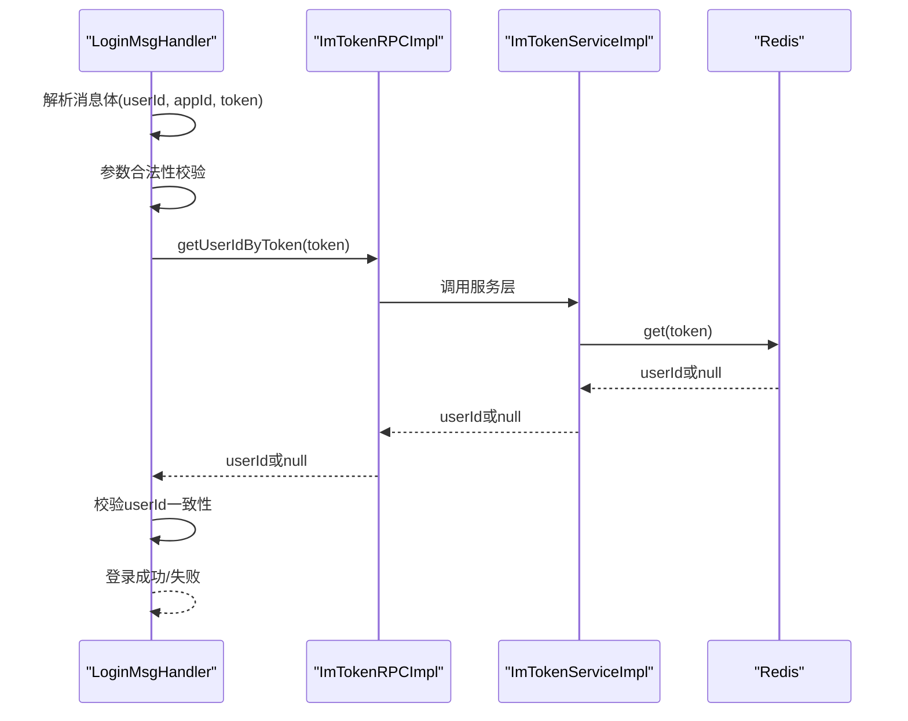
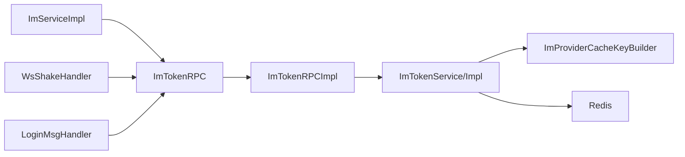

# IM登录Token管理RPC接口

<cite>
**本文引用的文件列表**
- [ImTokenRPC.java](file://live-im-interface/src/main/java/com/logilong/live/im/interfaces/ImTokenRPC.java)
- [ImTokenRPCImpl.java](file://live-im-provider/src/main/java/com/logilong/live/im/provider/rpc/ImTokenRPCImpl.java)
- [ImTokenService.java](file://live-im-provider/src/main/java/com/logilong/live/im/provider/service/ImTokenService.java)
- [ImTokenServiceImpl.java](file://live-im-provider/src/main/java/com/logilong/live/im/provider/service/impl/ImTokenServiceImpl.java)
- [ImProviderCacheKeyBuilder.java](file://live-framework/live-framework-redis-starter/src/main/java/com/logilong/live/framework/redis/starter/key/ImProviderCacheKeyBuilder.java)
- [WsShakeHandler.java](file://live-im-core-server/src/main/java/com/logilong/live/im/core/server/handler/ws/WsShakeHandler.java)
- [LoginMsgHandler.java](file://live-im-core-server/src/main/java/com/logilong/live/im/core/server/handler/impl/LoginMsgHandler.java)
- [ImServiceImpl.java](file://live-api/src/main/java/com/logilong/live/api/service/impl/ImServiceImpl.java)
- [AppIdEnum.java](file://live-im-interface/src/main/java/com/logilong/live/im/constants/AppIdEnum.java)
- [DESUtils.java](file://live-common-interface/src/main/java/com/logilong/live/common/interfaces/utils/DESUtils.java)
</cite>

## 目录
1. [引言](#引言)
2. [项目结构](#项目结构)
3. [核心组件](#核心组件)
4. [架构总览](#架构总览)
5. [详细组件分析](#详细组件分析)
6. [依赖关系分析](#依赖关系分析)
7. [性能与安全性考量](#性能与安全性考量)
8. [故障排查指南](#故障排查指南)
9. [结论](#结论)

## 引言
本文档围绕ImTokenRPC接口的两个核心方法createImLoginToken与getUserIdByToken进行系统化文档化，重点说明：
- createImLoginToken如何为用户生成IM登录Token，包括Token结构、有效期与存储机制；
- getUserIdByToken如何解析Token并校验有效性，以及过期与非法Token的处理；
- 结合live-im-core-server的WsShakeHandler与LoginMsgHandler，说明Token在WebSocket握手与登录流程中的验证过程；
- 提供接口调用的安全最佳实践，以防范Token泄露与重放攻击。

## 项目结构
本功能涉及以下模块与文件：
- 接口层：ImTokenRPC接口定义
- RPC实现层：ImTokenRPCImpl对外暴露RPC能力
- 服务层：ImTokenService与ImTokenServiceImpl负责Token生成与校验
- 缓存键构建：ImProviderCacheKeyBuilder负责Redis键前缀与命名规范
- 核心服务：WsShakeHandler与LoginMsgHandler在IM核心服务器中执行握手与登录校验
- 上游调用：ImServiceImpl在API网关侧生成Token并下发给客户端
- 常量：AppIdEnum定义业务域标识
- 其他：DESUtils提供DES加解密工具（与IM登录Token无直接关联，但作为通用安全工具存在）

图表来源
- [ImTokenRPC.java](file://live-im-interface/src/main/java/com/logilong/live/im/interfaces/ImTokenRPC.java#L1-L16)
- [ImTokenRPCImpl.java](file://live-im-provider/src/main/java/com/logilong/live/im/provider/rpc/ImTokenRPCImpl.java#L1-L27)
- [ImTokenService.java](file://live-im-provider/src/main/java/com/logilong/live/im/provider/service/ImTokenService.java#L1-L17)
- [ImTokenServiceImpl.java](file://live-im-provider/src/main/java/com/logilong/live/im/provider/service/impl/ImTokenServiceImpl.java#L1-L35)
- [ImProviderCacheKeyBuilder.java](file://live-framework/live-framework-redis-starter/src/main/java/com/logilong/live/framework/redis/starter/key/ImProviderCacheKeyBuilder.java#L1-L20)
- [WsShakeHandler.java](file://live-im-core-server/src/main/java/com/logilong/live/im/core/server/handler/ws/WsShakeHandler.java#L1-L108)
- [LoginMsgHandler.java](file://live-im-core-server/src/main/java/com/logilong/live/im/core/server/handler/impl/LoginMsgHandler.java#L1-L121)
- [ImServiceImpl.java](file://live-api/src/main/java/com/logilong/live/api/service/impl/ImServiceImpl.java#L1-L41)
- [AppIdEnum.java](file://live-im-interface/src/main/java/com/logilong/live/im/constants/AppIdEnum.java#L1-L18)
- [DESUtils.java](file://live-common-interface/src/main/java/com/logilong/live/common/interfaces/utils/DESUtils.java#L1-L108)

章节来源
- [ImTokenRPC.java](file://live-im-interface/src/main/java/com/logilong/live/im/interfaces/ImTokenRPC.java#L1-L16)
- [ImTokenRPCImpl.java](file://live-im-provider/src/main/java/com/logilong/live/im/provider/rpc/ImTokenRPCImpl.java#L1-L27)
- [ImTokenService.java](file://live-im-provider/src/main/java/com/logilong/live/im/provider/service/ImTokenService.java#L1-L17)
- [ImTokenServiceImpl.java](file://live-im-provider/src/main/java/com/logilong/live/im/provider/service/impl/ImTokenServiceImpl.java#L1-L35)
- [ImProviderCacheKeyBuilder.java](file://live-framework/live-framework-redis-starter/src/main/java/com/logilong/live/framework/redis/starter/key/ImProviderCacheKeyBuilder.java#L1-L20)
- [WsShakeHandler.java](file://live-im-core-server/src/main/java/com/logilong/live/im/core/server/handler/ws/WsShakeHandler.java#L1-L108)
- [LoginMsgHandler.java](file://live-im-core-server/src/main/java/com/logilong/live/im/core/server/handler/impl/LoginMsgHandler.java#L1-L121)
- [ImServiceImpl.java](file://live-api/src/main/java/com/logilong/live/api/service/impl/ImServiceImpl.java#L1-L41)
- [AppIdEnum.java](file://live-im-interface/src/main/java/com/logilong/live/im/constants/AppIdEnum.java#L1-L18)
- [DESUtils.java](file://live-common-interface/src/main/java/com/logilong/live/common/interfaces/utils/DESUtils.java#L1-L108)

## 核心组件
- 接口定义：ImTokenRPC定义createImLoginToken与getUserIdByToken两个方法，分别用于生成IM登录Token与根据Token解析用户ID。
- RPC实现：ImTokenRPCImpl将调用委派给ImTokenService，保持接口与实现分离。
- 服务实现：ImTokenServiceImpl负责Token生成与校验，使用UUID生成随机串并附加appId，同时将userId与token绑定存储于Redis，设置5分钟有效期。
- 缓存键构建：ImProviderCacheKeyBuilder统一构建Redis键前缀，确保键名可读且可维护。
- 核心服务校验：WsShakeHandler在WebSocket握手阶段解析URI参数，调用getUserIdByToken进行校验；LoginMsgHandler在TCP登录消息阶段同样校验Token与userId一致性。
- 上游调用：ImServiceImpl在API侧生成Token并返回给客户端，同时选择IM核心服务器实例地址。

章节来源
- [ImTokenRPC.java](file://live-im-interface/src/main/java/com/logilong/live/im/interfaces/ImTokenRPC.java#L1-L16)
- [ImTokenRPCImpl.java](file://live-im-provider/src/main/java/com/logilong/live/im/provider/rpc/ImTokenRPCImpl.java#L1-L27)
- [ImTokenService.java](file://live-im-provider/src/main/java/com/logilong/live/im/provider/service/ImTokenService.java#L1-L17)
- [ImTokenServiceImpl.java](file://live-im-provider/src/main/java/com/logilong/live/im/provider/service/impl/ImTokenServiceImpl.java#L1-L35)
- [ImProviderCacheKeyBuilder.java](file://live-framework/live-framework-redis-starter/src/main/java/com/logilong/live/framework/redis/starter/key/ImProviderCacheKeyBuilder.java#L1-L20)
- [WsShakeHandler.java](file://live-im-core-server/src/main/java/com/logilong/live/im/core/server/handler/ws/WsShakeHandler.java#L1-L108)
- [LoginMsgHandler.java](file://live-im-core-server/src/main/java/com/logilong/live/im/core/server/handler/impl/LoginMsgHandler.java#L1-L121)
- [ImServiceImpl.java](file://live-api/src/main/java/com/logilong/live/api/service/impl/ImServiceImpl.java#L1-L41)

## 架构总览
下图展示IM登录Token在各组件间的流转与校验路径，包括API侧生成Token、核心服务器握手与登录校验、以及Redis存储与查询。

图表来源
- [ImServiceImpl.java](file://live-api/src/main/java/com/logilong/live/api/service/impl/ImServiceImpl.java#L1-L41)
- [ImTokenRPCImpl.java](file://live-im-provider/src/main/java/com/logilong/live/im/provider/rpc/ImTokenRPCImpl.java#L1-L27)
- [ImTokenServiceImpl.java](file://live-im-provider/src/main/java/com/logilong/live/im/provider/service/impl/ImTokenServiceImpl.java#L1-L35)
- [WsShakeHandler.java](file://live-im-core-server/src/main/java/com/logilong/live/im/core/server/handler/ws/WsShakeHandler.java#L1-L108)
- [LoginMsgHandler.java](file://live-im-core-server/src/main/java/com/logilong/live/im/core/server/handler/impl/LoginMsgHandler.java#L1-L121)

## 详细组件分析

### 组件A：Token生成与存储（createImLoginToken）
- Token结构：由“随机UUID + 分隔符 + appId”构成，便于后续从Token中提取appId。
- 生成流程：
  - 生成随机UUID并拼接appId，形成token；
  - 使用RedisTemplate将token映射到userId并设置TTL为5分钟；
  - 返回token给调用方。
- 存储机制：
  - 键名通过ImProviderCacheKeyBuilder统一构建，保证键名规范；
  - TTL短（5分钟），降低Token泄露风险与占用空间。
- 复杂度分析：
  - 生成与存储均为O(1)；
  - Redis读写受网络与Redis性能影响，建议使用高性能Redis集群。

图表来源
- [ImTokenServiceImpl.java](file://live-im-provider/src/main/java/com/logilong/live/im/provider/service/impl/ImTokenServiceImpl.java#L20-L26)
- [ImProviderCacheKeyBuilder.java](file://live-framework/live-framework-redis-starter/src/main/java/com/logilong/live/framework/redis/starter/key/ImProviderCacheKeyBuilder.java#L13-L17)

章节来源
- [ImTokenServiceImpl.java](file://live-im-provider/src/main/java/com/logilong/live/im/provider/service/impl/ImTokenServiceImpl.java#L20-L26)
- [ImProviderCacheKeyBuilder.java](file://live-framework/live-framework-redis-starter/src/main/java/com/logilong/live/framework/redis/starter/key/ImProviderCacheKeyBuilder.java#L13-L17)

### 组件B：Token解析与校验（getUserIdByToken）
- 解析流程：
  - 通过RedisTemplate按构建好的键名查询token对应的userId；
  - 若未命中或值为空，返回null表示Token无效或已过期；
  - 若命中，将Integer类型userId转换为Long后返回。
- 过期与非法处理：
  - Redis过期自动清理，getUserIdByToken返回null；
  - 核心服务器在握手与登录阶段均对返回值进行判空与一致性校验，拒绝非法连接。
- 复杂度分析：
  - 查询为O(1)，受Redis性能影响。

图表来源
- [ImTokenServiceImpl.java](file://live-im-provider/src/main/java/com/logilong/live/im/provider/service/impl/ImTokenServiceImpl.java#L27-L32)

章节来源
- [ImTokenServiceImpl.java](file://live-im-provider/src/main/java/com/logilong/live/im/provider/service/impl/ImTokenServiceImpl.java#L27-L32)

### 组件C：WebSocket握手校验（WsShakeHandler）
- 参数解析：从URI路径中解析出token与userId；
- 校验步骤：
  - 调用getUserIdByToken(token)获取userId；
  - 从Token尾部提取appId；
  - 比较返回的userId与URI中的userId是否一致；
  - 任一条件不满足则拒绝握手并关闭连接；
  - 校验通过后完成握手并触发登录成功处理。
- 安全要点：
  - URI中包含userId，避免客户端伪造；
  - Token与userId双重校验，降低重放风险。

图表来源
- [WsShakeHandler.java](file://live-im-core-server/src/main/java/com/logilong/live/im/core/server/handler/ws/WsShakeHandler.java#L58-L97)

章节来源
- [WsShakeHandler.java](file://live-im-core-server/src/main/java/com/logilong/live/im/core/server/handler/ws/WsShakeHandler.java#L58-L97)

### 组件D：TCP登录消息校验（LoginMsgHandler）
- 参数校验：从消息体中解析userId、appId与token；
- 校验步骤：
  - 对参数进行基本合法性校验；
  - 调用getUserIdByToken(token)获取userId；
  - 比较返回的userId与消息中的userId是否一致；
  - 一致则登录成功，否则关闭连接并抛出异常。
- 安全要点：
  - 双重校验（参数合法性+Token校验）；
  - 已登录上下文防重复请求。

图表来源
- [LoginMsgHandler.java](file://live-im-core-server/src/main/java/com/logilong/live/im/core/server/handler/impl/LoginMsgHandler.java#L44-L74)

章节来源
- [LoginMsgHandler.java](file://live-im-core-server/src/main/java/com/logilong/live/im/core/server/handler/impl/LoginMsgHandler.java#L44-L74)

### 组件E：上游调用与Token下发（ImServiceImpl）
- 调用流程：在获取IM配置时，调用createImLoginToken生成Token，并通过DiscoveryClient选择IM核心服务器地址；
- 客户端使用：将生成的Token与服务器地址下发至客户端，用于后续WebSocket/TCP连接。

章节来源
- [ImServiceImpl.java](file://live-api/src/main/java/com/logilong/live/api/service/impl/ImServiceImpl.java#L25-L40)
- [AppIdEnum.java](file://live-im-interface/src/main/java/com/logilong/live/im/constants/AppIdEnum.java#L1-L18)

## 依赖关系分析
- 接口与实现解耦：ImTokenRPC定义接口，ImTokenRPCImpl仅做委派，ImTokenService与ImTokenServiceImpl承担具体逻辑；
- 缓存键构建：ImProviderCacheKeyBuilder集中管理Redis键命名，避免硬编码；
- 核心服务依赖：WsShakeHandler与LoginMsgHandler均通过Dubbo引用ImTokenRPC，实现跨进程调用；
- 上游依赖：ImServiceImpl依赖ImTokenRPC生成Token并返回给客户端。

图表来源
- [ImServiceImpl.java](file://live-api/src/main/java/com/logilong/live/api/service/impl/ImServiceImpl.java#L1-L41)
- [ImTokenRPC.java](file://live-im-interface/src/main/java/com/logilong/live/im/interfaces/ImTokenRPC.java#L1-L16)
- [ImTokenRPCImpl.java](file://live-im-provider/src/main/java/com/logilong/live/im/provider/rpc/ImTokenRPCImpl.java#L1-L27)
- [ImTokenService.java](file://live-im-provider/src/main/java/com/logilong/live/im/provider/service/ImTokenService.java#L1-L17)
- [ImTokenServiceImpl.java](file://live-im-provider/src/main/java/com/logilong/live/im/provider/service/impl/ImTokenServiceImpl.java#L1-L35)
- [ImProviderCacheKeyBuilder.java](file://live-framework/live-framework-redis-starter/src/main/java/com/logilong/live/framework/redis/starter/key/ImProviderCacheKeyBuilder.java#L1-L20)
- [WsShakeHandler.java](file://live-im-core-server/src/main/java/com/logilong/live/im/core/server/handler/ws/WsShakeHandler.java#L1-L108)
- [LoginMsgHandler.java](file://live-im-core-server/src/main/java/com/logilong/live/im/core/server/handler/impl/LoginMsgHandler.java#L1-L121)

章节来源
- [ImServiceImpl.java](file://live-api/src/main/java/com/logilong/live/api/service/impl/ImServiceImpl.java#L1-L41)
- [ImTokenRPCImpl.java](file://live-im-provider/src/main/java/com/logilong/live/im/provider/rpc/ImTokenRPCImpl.java#L1-L27)
- [ImTokenServiceImpl.java](file://live-im-provider/src/main/java/com/logilong/live/im/provider/service/impl/ImTokenServiceImpl.java#L1-L35)
- [ImProviderCacheKeyBuilder.java](file://live-framework/live-framework-redis-starter/src/main/java/com/logilong/live/framework/redis/starter/key/ImProviderCacheKeyBuilder.java#L1-L20)
- [WsShakeHandler.java](file://live-im-core-server/src/main/java/com/logilong/live/im/core/server/handler/ws/WsShakeHandler.java#L1-L108)
- [LoginMsgHandler.java](file://live-im-core-server/src/main/java/com/logilong/live/im/core/server/handler/impl/LoginMsgHandler.java#L1-L121)

## 性能与安全性考量
- 性能特性
  - Token生成与查询均为O(1)，Redis读写延迟决定整体性能；
  - TTL短（5分钟）减少Redis占用与过期扫描压力；
  - 建议使用Redis集群与持久化策略优化高并发场景。
- 安全性
  - Token结构包含appId，便于区分业务域；
  - 核心服务器在握手与登录阶段均进行userId一致性校验，防止Token被他人复用；
  - Token有效期短，降低泄露窗口；
  - 建议配合HTTPS、最小权限原则与访问控制进一步加固。

[本节为通用指导，无需列出章节来源]

## 故障排查指南
- 现象：握手失败或登录失败
  - 检查WsShakeHandler与LoginMsgHandler的日志，确认是否因getUserIdByToken返回null导致校验失败；
  - 确认Redis中是否存在对应token键，以及TTL是否已过期；
  - 核对URI中的userId与Token尾部appId是否与生成时一致。
- 现象：Token被重复使用
  - 由于TTL短（5分钟），Token过期后会被Redis自动清理，无法复用；
  - 若仍出现异常，检查核心服务器是否正确解析URI参数与Token结构。
- 现象：参数错误
  - LoginMsgHandler对userId与appId有最小阈值校验，若小于阈值会直接拒绝；
  - 确保上游调用传入的userId与appId符合预期。

章节来源
- [WsShakeHandler.java](file://live-im-core-server/src/main/java/com/logilong/live/im/core/server/handler/ws/WsShakeHandler.java#L58-L97)
- [LoginMsgHandler.java](file://live-im-core-server/src/main/java/com/logilong/live/im/core/server/handler/impl/LoginMsgHandler.java#L44-L74)
- [ImTokenServiceImpl.java](file://live-im-provider/src/main/java/com/logilong/live/im/provider/service/impl/ImTokenServiceImpl.java#L20-L32)

## 结论
- createImLoginToken通过UUID + appId构造Token，并在Redis中以短TTL绑定userId，确保Token易用且可控；
- getUserIdByToken基于Redis查询实现，返回null代表Token无效或过期，核心服务器在握手与登录阶段严格校验；
- WsShakeHandler与LoginMsgHandler共同保障Token在WebSocket与TCP两种接入方式下的安全校验；
- 建议在生产环境中结合HTTPS、访问控制与监控告警，持续优化性能与安全。