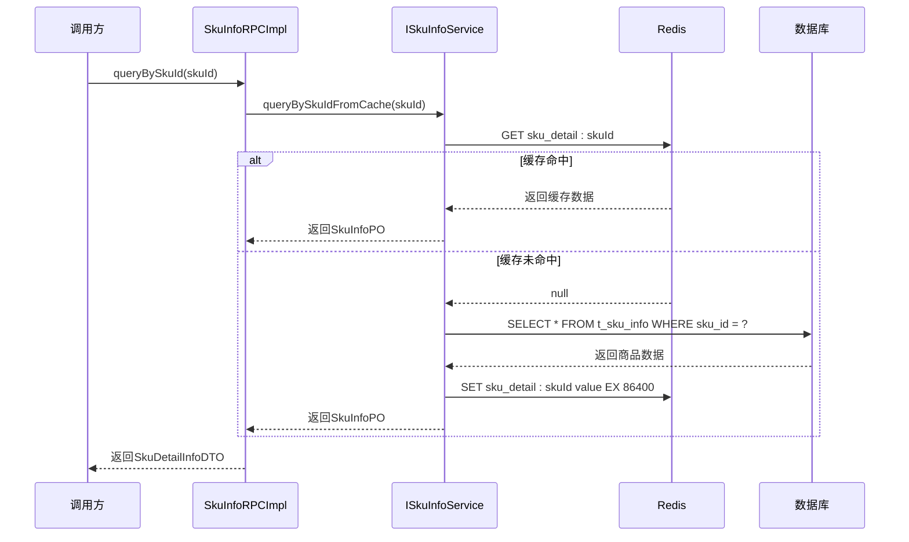
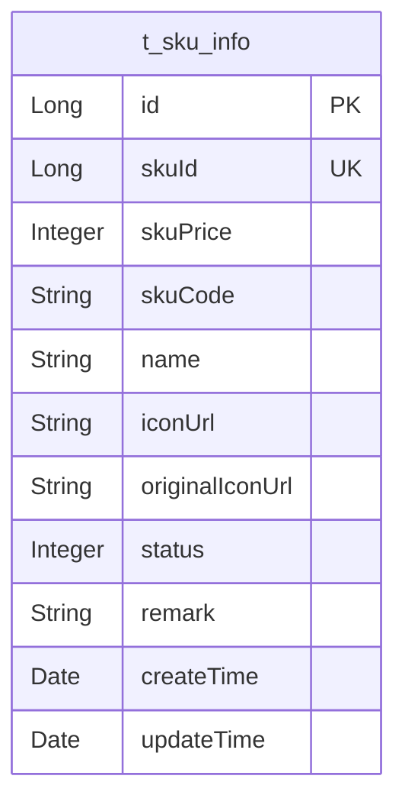
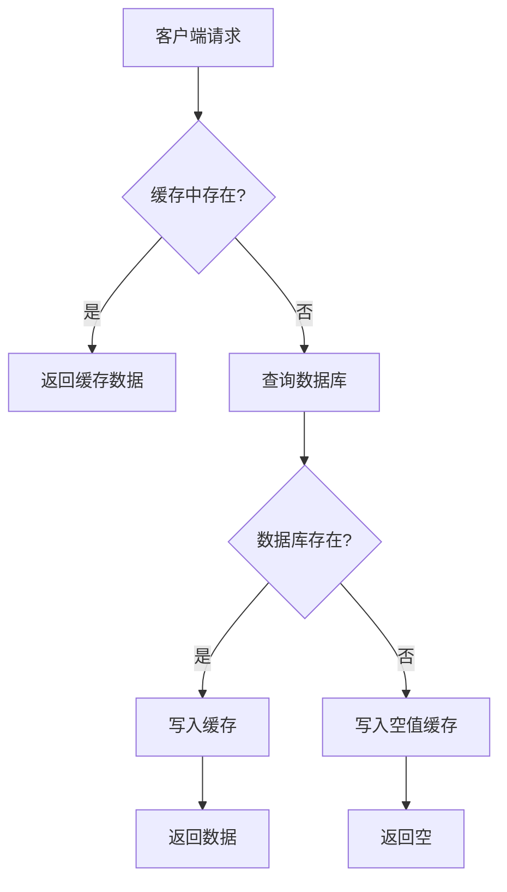
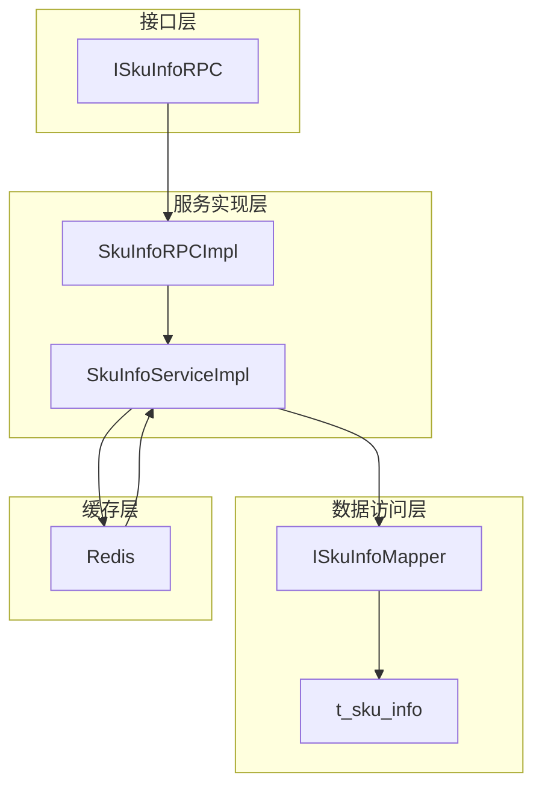

# 商品信息RPC接口

<cite>
**本文档引用的文件**
- [ISkuInfoRPC.java](file://live-sku-interface/src/main/java/com/logilong/live/sku/interfaces/ISkuInfoRPC.java)
- [SkuInfoDTO.java](file://live-sku-interface/src/main/java/com/logilong/live/sku/dto/SkuInfoDTO.java)
- [SkuDetailInfoDTO.java](file://live-sku-interface/src/main/java/com/logilong/live/sku/dto/SkuDetailInfoDTO.java)
- [SkuInfoRPCImpl.java](file://live-sku-provider/src/main/java/com/logilong/live/sku/provider/rpc/SkuInfoRPCImpl.java)
- [SkuInfoServiceImpl.java](file://live-sku-provider/src/main/java/com/logilong/live/sku/provider/service/impl/SkuInfoServiceImpl.java)
- [SkuInfoPO.java](file://live-sku-provider/src/main/java/com/logilong/live/sku/provider/dao/po/SkuInfoPO.java)
- [IAnchorShopInfoService.java](file://live-sku-provider/src/main/java/com/logilong/live/sku/provider/service/IAnchorShopInfoService.java)
- [SkuProviderCacheKeyBuilder.java](file://live-framework/live-framework-redis-starter/src/main/java/com/logilong/live/framework/redis/starter/key/SkuProviderCacheKeyBuilder.java)
- [CommonStatusEnum.java](file://live-common-interface/src/main/java/com/logilong/live/common/interfaces/enums/CommonStatusEnum.java)
</cite>

## 目录
1. [简介](#简介)
2. [核心组件](#核心组件)
3. [接口实现机制](#接口实现机制)
4. [数据结构详解](#数据结构详解)
5. [缓存策略与性能优化](#缓存策略与性能优化)
6. [架构概览](#架构概览)

## 简介
本文档系统化地文档化了直播平台中的商品信息RPC接口ISkuInfoRPC，该接口为直播电商场景提供核心的商品信息查询服务。接口主要支持通过主播ID批量查询商品信息，以及通过商品ID查询单个商品的详细信息。系统设计考虑了高并发场景下的性能需求，采用了多级缓存策略来优化查询性能，并通过Dubbo框架实现服务间的远程调用。

## 核心组件

商品信息RPC接口系统由多个核心组件构成，包括接口定义、服务实现、数据访问层和缓存管理。接口定义位于`live-sku-interface`模块，服务实现位于`live-sku-provider`模块，通过Dubbo框架进行服务暴露和调用。系统采用MyBatis-Plus作为ORM框架，与MySQL数据库交互，并使用Redis作为缓存层以提高查询性能。

**本节来源**
- [ISkuInfoRPC.java](file://live-sku-interface/src/main/java/com/logilong/live/sku/interfaces/ISkuInfoRPC.java)
- [SkuInfoRPCImpl.java](file://live-sku-provider/src/main/java/com/logilong/live/sku/provider/rpc/SkuInfoRPCImpl.java)
- [SkuInfoServiceImpl.java](file://live-sku-provider/src/main/java/com/logilong/live/sku/provider/service/impl/SkuInfoServiceImpl.java)

## 接口实现机制

### 通过主播ID批量查询商品

`queryByAnchorId`方法实现了通过主播ID批量查询商品信息的功能。该方法首先调用`IAnchorShopInfoService`服务，根据主播ID查询该主播店铺中所有商品的SKU ID列表。然后使用这些SKU ID批量查询商品基本信息，并将结果转换为`SkuInfoDTO`对象列表返回。

该实现采用了服务间协作的设计模式，将主播与商品的关联关系管理与商品信息管理分离，提高了系统的模块化程度和可维护性。

### 通过商品ID查询商品详情

`queryBySkuId`方法实现了通过商品ID查询单个商品详情的功能。该方法优先从Redis缓存中查询商品信息，如果缓存中存在则直接返回，避免了对数据库的直接访问。如果缓存中不存在，则从数据库查询，并将结果写入缓存供后续请求使用。

这种缓存优先的查询策略显著降低了数据库的访问压力，特别是在高并发场景下，能够有效提升系统的响应速度和吞吐量。

**图表来源**
- [SkuInfoRPCImpl.java](file://live-sku-provider/src/main/java/com/logilong/live/sku/provider/rpc/SkuInfoRPCImpl.java#L30-L32)
- [SkuInfoServiceImpl.java](file://live-sku-provider/src/main/java/com/logilong/live/sku/provider/service/impl/SkuInfoServiceImpl.java#L46-L64)

**本节来源**
- [SkuInfoRPCImpl.java](file://live-sku-provider/src/main/java/com/logilong/live/sku/provider/rpc/SkuInfoRPCImpl.java)
- [SkuInfoServiceImpl.java](file://live-sku-provider/src/main/java/com/logilong/live/sku/provider/service/impl/SkuInfoServiceImpl.java)

## 数据结构详解

### SkuInfoDTO 字段说明

`SkuInfoDTO`是商品基本信息的数据传输对象，包含以下核心字段：

| 字段名 | 类型 | 业务含义 |
|--------|------|----------|
| id | Long | 商品信息记录的主键ID |
| skuId | Long | 商品的唯一标识ID |
| skuPrice | Long | 商品价格（单位：分） |
| stockNum | Integer | 商品库存数量 |
| status | Byte | 商品状态（0:无效, 1:有效） |
| name | String | 商品名称 |
| iconUrl | String | 商品展示图片URL |
| categoryId | Long | 商品所属分类ID |
| createTime | Date | 记录创建时间 |

### SkuDetailInfoDTO 字段说明

`SkuDetailInfoDTO`是商品详情信息的数据传输对象，继承了`SkuInfoDTO`的所有字段，提供了更完整的商品信息视图。在当前实现中，`SkuDetailInfoDTO`与`SkuInfoDTO`具有相同的字段结构，为未来扩展商品详情信息预留了接口设计。

### 数据库表结构

商品信息存储在`t_sku_info`表中，对应的持久化对象为`SkuInfoPO`。该表设计遵循了数据库规范化原则，包含了商品的核心属性信息，并通过`status`字段实现了逻辑删除功能，避免了数据的物理删除。

**图表来源**
- [SkuInfoDTO.java](file://live-sku-interface/src/main/java/com/logilong/live/sku/dto/SkuInfoDTO.java)
- [SkuDetailInfoDTO.java](file://live-sku-interface/src/main/java/com/logilong/live/sku/dto/SkuDetailInfoDTO.java)
- [SkuInfoPO.java](file://live-sku-provider/src/main/java/com/logilong/live/sku/provider/dao/po/SkuInfoPO.java)

**本节来源**
- [SkuInfoDTO.java](file://live-sku-interface/src/main/java/com/logilong/live/sku/dto/SkuInfoDTO.java)
- [SkuDetailInfoDTO.java](file://live-sku-interface/src/main/java/com/logilong/live/sku/dto/SkuDetailInfoDTO.java)
- [SkuInfoPO.java](file://live-sku-provider/src/main/java/com/logilong/live/sku/provider/dao/po/SkuInfoPO.java)

## 缓存策略与性能优化

### 缓存键设计

系统采用了规范化的缓存键设计策略，通过`SkuProviderCacheKeyBuilder`类统一管理商品相关缓存键的生成。商品详情信息的缓存键格式为`{prefix}:sku_detail:{skuId}`，其中`prefix`为模块前缀，确保了缓存键的唯一性和可读性。

这种集中式的缓存键管理方式避免了在代码各处硬编码缓存键，提高了代码的可维护性，并降低了缓存键冲突的风险。

### 缓存更新与失效

系统实现了缓存的自动加载和更新机制。当缓存未命中时，系统会自动从数据库加载数据并写入缓存，设置1天的过期时间。同时，系统采用了空值缓存策略，对于查询结果为空的情况，也会在缓存中存储一个空对象，有效期同样为1天，以防止缓存穿透攻击。

### 查询性能优化

在数据库查询层面，系统使用MyBatis-Plus的LambdaQueryWrapper构建查询条件，确保只查询状态为有效的商品信息（status=1）。对于单个商品查询，添加了`limit 1`限制，避免不必要的数据扫描。

在服务调用层面，通过Dubbo的RPC机制实现了服务的远程调用，调用方无需关心服务的具体部署位置，实现了服务的透明化调用。

**图表来源**
- [SkuProviderCacheKeyBuilder.java](file://live-framework/live-framework-redis-starter/src/main/java/com/logilong/live/framework/redis/starter/key/SkuProviderCacheKeyBuilder.java)
- [SkuInfoServiceImpl.java](file://live-sku-provider/src/main/java/com/logilong/live/sku/provider/service/impl/SkuInfoServiceImpl.java#L46-L64)

**本节来源**
- [SkuProviderCacheKeyBuilder.java](file://live-framework/live-framework-redis-starter/src/main/java/com/logilong/live/framework/redis/starter/key/SkuProviderCacheKeyBuilder.java)
- [SkuInfoServiceImpl.java](file://live-sku-provider/src/main/java/com/logilong/live/sku/provider/service/impl/SkuInfoServiceImpl.java)
- [CommonStatusEnum.java](file://live-common-interface/src/main/java/com/logilong/live/common/interfaces/enums/CommonStatusEnum.java)

## 架构概览

商品信息RPC接口系统采用典型的微服务架构设计，各组件职责分明，通过清晰的接口边界实现松耦合。接口定义与实现分离的设计模式使得服务的升级和维护更加灵活，不同团队可以并行开发而不会相互影响。

系统通过引入缓存层，构建了"缓存+数据库"的两级存储架构，有效应对了高并发场景下的性能挑战。同时，通过Dubbo服务框架实现了服务的注册与发现，支持服务的水平扩展和负载均衡。

**图表来源**
- [ISkuInfoRPC.java](file://live-sku-interface/src/main/java/com/logilong/live/sku/interfaces/ISkuInfoRPC.java)
- [SkuInfoRPCImpl.java](file://live-sku-provider/src/main/java/com/logilong/live/sku/provider/rpc/SkuInfoRPCImpl.java)
- [SkuInfoServiceImpl.java](file://live-sku-provider/src/main/java/com/logilong/live/sku/provider/service/impl/SkuInfoServiceImpl.java)
- [SkuInfoPO.java](file://live-sku-provider/src/main/java/com/logilong/live/sku/provider/dao/po/SkuInfoPO.java)

**本节来源**
- [ISkuInfoRPC.java](file://live-sku-interface/src/main/java/com/logilong/live/sku/interfaces/ISkuInfoRPC.java)
- [SkuInfoRPCImpl.java](file://live-sku-provider/src/main/java/com/logilong/live/sku/provider/rpc/SkuInfoRPCImpl.java)
- [SkuInfoServiceImpl.java](file://live-sku-provider/src/main/java/com/logilong/live/sku/provider/service/impl/SkuInfoServiceImpl.java)