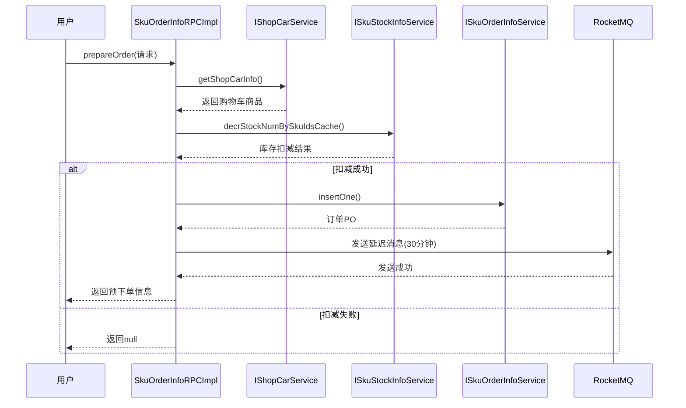
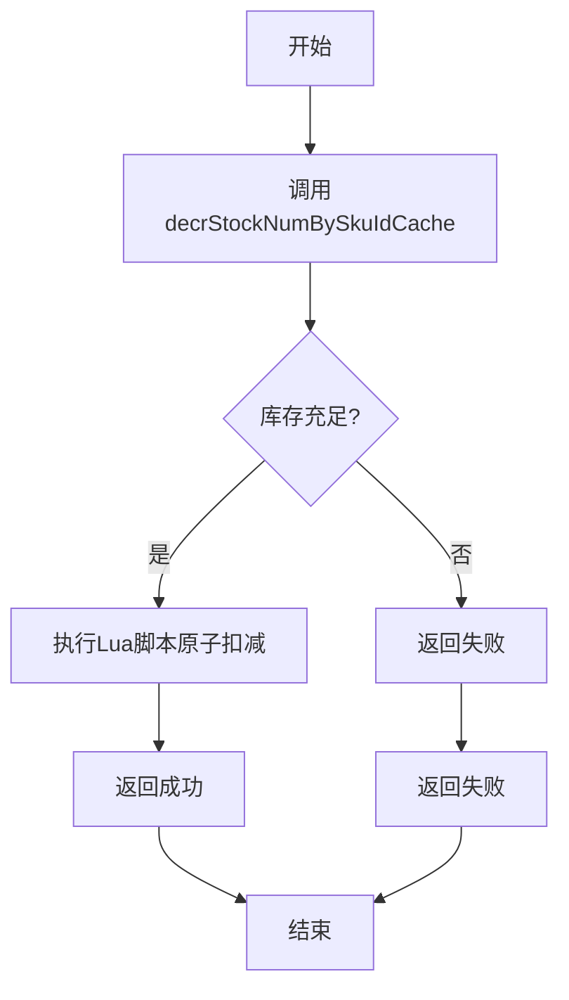
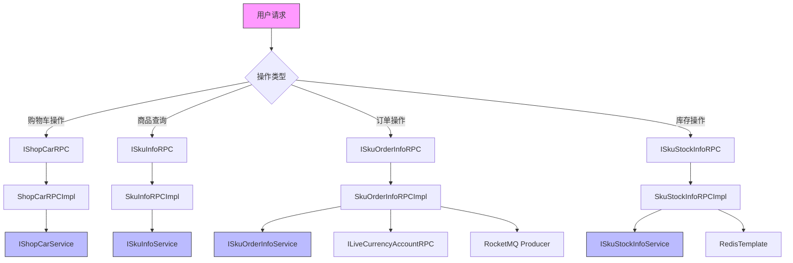

# 商品服务RPC接口

<cite>
**本文档引用的文件**  
- [IShopCarRPC.java](file://live-sku-interface/src/main/java/com/logilong/live/sku/interfaces/IShopCarRPC.java)
- [ISkuInfoRPC.java](file://live-sku-interface/src/main/java/com/logilong/live/sku/interfaces/ISkuInfoRPC.java)
- [ISkuOrderInfoRPC.java](file://live-sku-interface/src/main/java/com/logilong/live/sku/interfaces/ISkuOrderInfoRPC.java)
- [ISkuStockInfoRPC.java](file://live-sku-interface/src/main/java/com/logilong/live/sku/interfaces/ISkuStockInfoRPC.java)
- [SkuInfoDTO.java](file://live-sku-interface/src/main/java/com/logilong/live/sku/dto/SkuInfoDTO.java)
- [SkuStockInfoRPCImpl.java](file://live-sku-provider/src/main/java/com/logilong/live/sku/provider/rpc/SkuStockInfoRPCImpl.java)
- [SkuOrderInfoRPCImpl.java](file://live-sku-provider/src/main/java/com/logilong/live/sku/provider/rpc/SkuOrderInfoRPCImpl.java)
- [SkuInfoRPCImpl.java](file://live-sku-provider/src/main/java/com/logilong/live/sku/provider/rpc/SkuInfoRPCImpl.java)
- [ShopCarRPCImpl.java](file://live-sku-provider/src/main/java/com/logilong/live/sku/provider/rpc/ShopCarRPCImpl.java)
- [SkuOrderInfoEnum.java](file://live-sku-interface/src/main/java/com/logilong/live/sku/constants/SkuOrderInfoEnum.java)
</cite>

## 目录
1. [简介](#简介)
2. [购物车服务接口](#购物车服务接口)
3. [商品信息查询接口](#商品信息查询接口)
4. [订单管理接口](#订单管理接口)
5. [库存管理接口](#库存管理接口)
6. [核心数据结构说明](#核心数据结构说明)
7. [接口调用流程图](#接口调用流程图)
8. [总结](#总结)

## 简介
本文档系统化地描述了商品服务中的RPC接口设计与实现，涵盖购物车操作、商品信息查询、订单生命周期管理以及库存管理四大核心功能模块。重点说明了基于Lua脚本的原子性库存扣减机制和关键业务字段的语义定义。

**本节不涉及具体源码分析，因此无来源标注**

## 购物车服务接口
`IShopCarRPC` 接口提供了对用户购物车的完整操作支持，包括查看、添加、删除、清空和修改商品数量等功能。

### 核心方法
- `getShopCarInfo`: 查询指定用户在特定直播间购物车的详细信息
- `addShopCar`: 将指定商品添加至用户购物车
- `removeFromShopCar`: 从购物车中移除指定商品
- `clearShopCar`: 清空用户在指定直播间的所有购物车商品
- `addShopCarItemNum`: 修改购物车中某商品的数量

该接口通过 `ShopCarRPCImpl` 实现，实际业务逻辑由 `IShopCarService` 服务层处理。

**节来源**  
- [IShopCarRPC.java](file://live-sku-interface/src/main/java/com/logilong/live/sku/interfaces/IShopCarRPC.java#L6-L31)
- [ShopCarRPCImpl.java](file://live-sku-provider/src/main/java/com/logilong/live/sku/provider/rpc/ShopCarRPCImpl.java#L10-L41)

## 商品信息查询接口
`ISkuInfoRPC` 接口负责提供商品基本信息的查询能力。

### 核心方法
- `queryByAnchorId`: 根据主播ID查询其关联的所有商品列表
- `queryBySkuId`: 根据商品SKU ID查询商品详情信息

实现类 `SkuInfoRPCImpl` 通过调用 `ISkuInfoService` 和 `IAnchorShopInfoService` 完成数据聚合，并使用 `ConvertBeanUtils` 工具进行DTO转换。

**节来源**  
- [ISkuInfoRPC.java](file://live-sku-interface/src/main/java/com/logilong/live/sku/interfaces/ISkuInfoRPC.java#L10-L21)
- [SkuInfoRPCImpl.java](file://live-sku-provider/src/main/java/com/logilong/live/sku/provider/rpc/SkuInfoRPCImpl.java#L15-L33)

## 订单管理接口
`ISkuOrderInfoRPC` 接口管理订单的全生命周期，从预下单到支付完成。

### 核心方法
- `insertOne`: 创建新订单
- `updateOrderStatus`: 更新订单状态
- `prepareOrder`: 预下单操作，包含库存预扣减
- `payNow`: 执行支付操作

#### 预下单流程

**图来源**  
- [SkuOrderInfoRPCImpl.java](file://live-sku-provider/src/main/java/com/logilong/live/sku/provider/rpc/SkuOrderInfoRPCImpl.java#L63-L111)

**节来源**  
- [ISkuOrderInfoRPC.java](file://live-sku-interface/src/main/java/com/logilong/live/sku/interfaces/ISkuOrderInfoRPC.java#L5-L31)
- [SkuOrderInfoRPCImpl.java](file://live-sku-provider/src/main/java/com/logilong/live/sku/provider/rpc/SkuOrderInfoRPCImpl.java#L29-L180)

## 库存管理接口
`ISkuStockInfoRPC` 接口提供全面的库存管理功能，特别强调了高并发场景下的数据一致性保障。

### 核心方法
- `queryBySkuId`: 查询指定商品的库存信息
- `prepareStockInfo`: 将数据库库存预热到Redis缓存
- `queryStockNum`: 基础缓存查询接口
- `syncStockNumToMySql`: 同步Redis库存到MySQL
- `updateStockNumBySkuId`: 更新商品库存
- `decrStockNumBySkuIdCache`: 使用Lua脚本原子性扣减库存

### 原子性库存扣减实现
`decrStockNumBySkuIdCache` 方法通过调用服务层实现，确保在高并发环境下库存数据的一致性。系统采用Redis缓存+MySQL持久化的双层存储架构，并通过定时任务同步数据。

**图来源**  
- [ISkuStockInfoRPC.java](file://live-sku-interface/src/main/java/com/logilong/live/sku/interfaces/ISkuStockInfoRPC.java#L5-L44)
- [SkuStockInfoRPCImpl.java](file://live-sku-provider/src/main/java/com/logilong/live/sku/provider/rpc/SkuStockInfoRPCImpl.java#L50-L53)

**节来源**  
- [ISkuStockInfoRPC.java](file://live-sku-interface/src/main/java/com/logilong/live/sku/interfaces/ISkuStockInfoRPC.java#L5-L44)
- [SkuStockInfoRPCImpl.java](file://live-sku-provider/src/main/java/com/logilong/live/sku/provider/rpc/SkuStockInfoRPCImpl.java#L23-L103)

## 核心数据结构说明
### SkuInfoDTO 字段说明
`SkuInfoDTO` 是商品信息的核心数据传输对象，主要字段包括：

- `id`: 数据库主键ID
- `skuId`: 商品SKU唯一标识
- `skuPrice`: 商品价格（单位：分）
- `skuCode`: 商品编码
- `name`: 商品名称
- `iconUrl`: 商品图标URL
- `originalIconUrl`: 原始图标URL
- `remark`: 商品备注信息
- `status`: 商品状态（0:下架, 1:上架）
- `categoryId`: 所属分类ID
- `createTime`: 创建时间
- `updateTime`: 更新时间

这些字段构成了商品展示和交易的基础数据模型。

**节来源**  
- [SkuInfoDTO.java](file://live-sku-interface/src/main/java/com/logilong/live/sku/dto/SkuInfoDTO.java#L10-L38)

## 接口调用流程图

**图来源**  
- [SkuOrderInfoRPCImpl.java](file://live-sku-provider/src/main/java/com/logilong/live/sku/provider/rpc/SkuOrderInfoRPCImpl.java#L34-L44)
- [SkuStockInfoRPCImpl.java](file://live-sku-provider/src/main/java/com/logilong/live/sku/provider/rpc/SkuStockInfoRPCImpl.java#L27-L33)

## 总结
商品服务通过四个核心RPC接口实现了完整的电商交易链路：
1. 购物车服务提供灵活的商品管理能力
2. 商品信息服务支持快速查询
3. 订单服务管理交易状态流转
4. 库存服务确保高并发下的数据一致性

特别值得注意的是，系统通过Lua脚本实现了原子性库存扣减，并结合RocketMQ延迟消息机制处理订单超时回滚，有效保障了交易系统的稳定性和数据准确性。

**本节为总结性内容，不涉及具体源码，因此无来源标注**