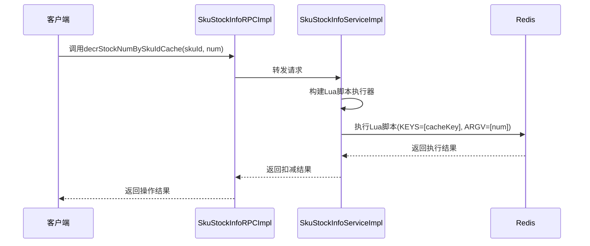
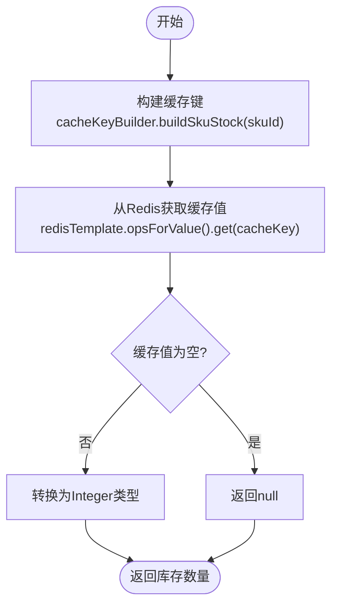
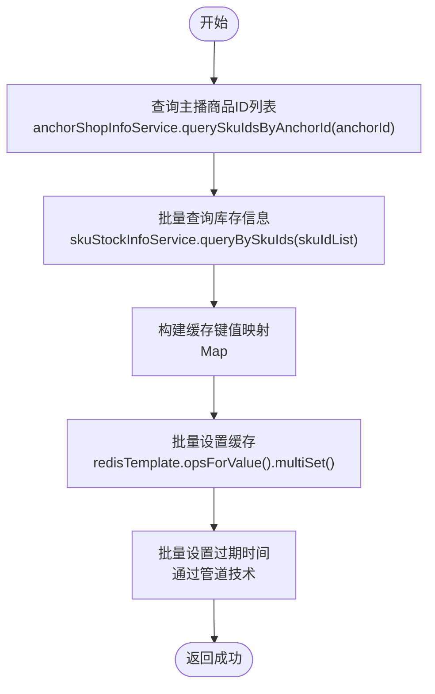
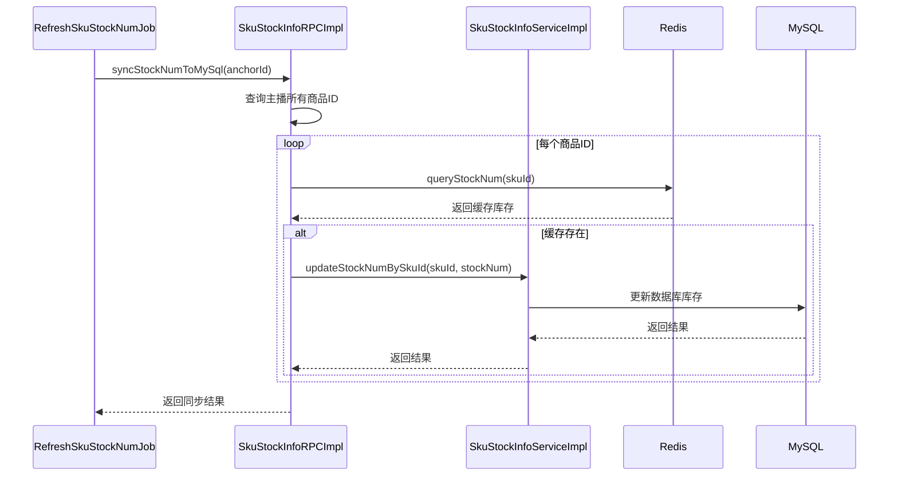
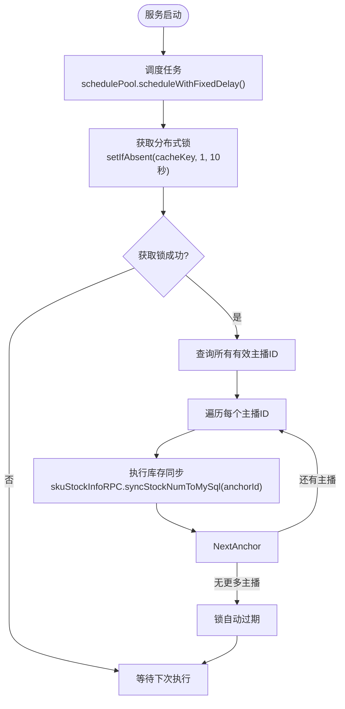
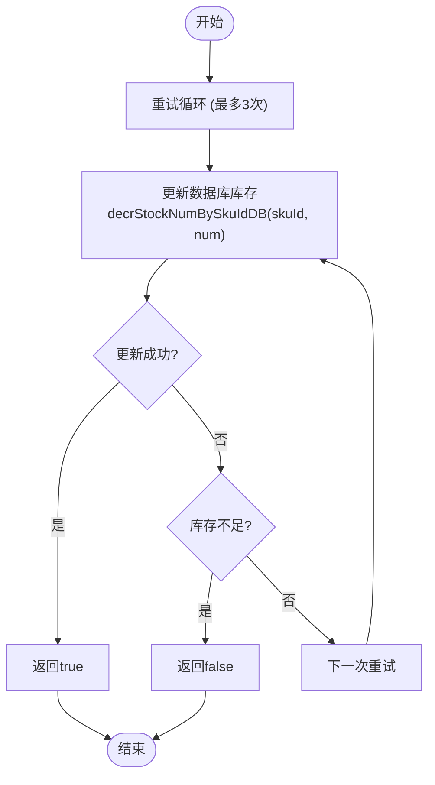
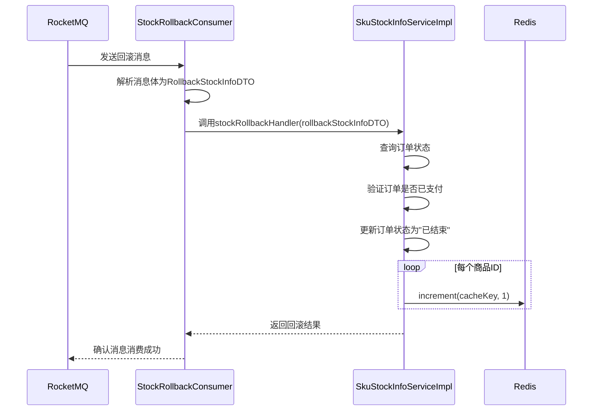
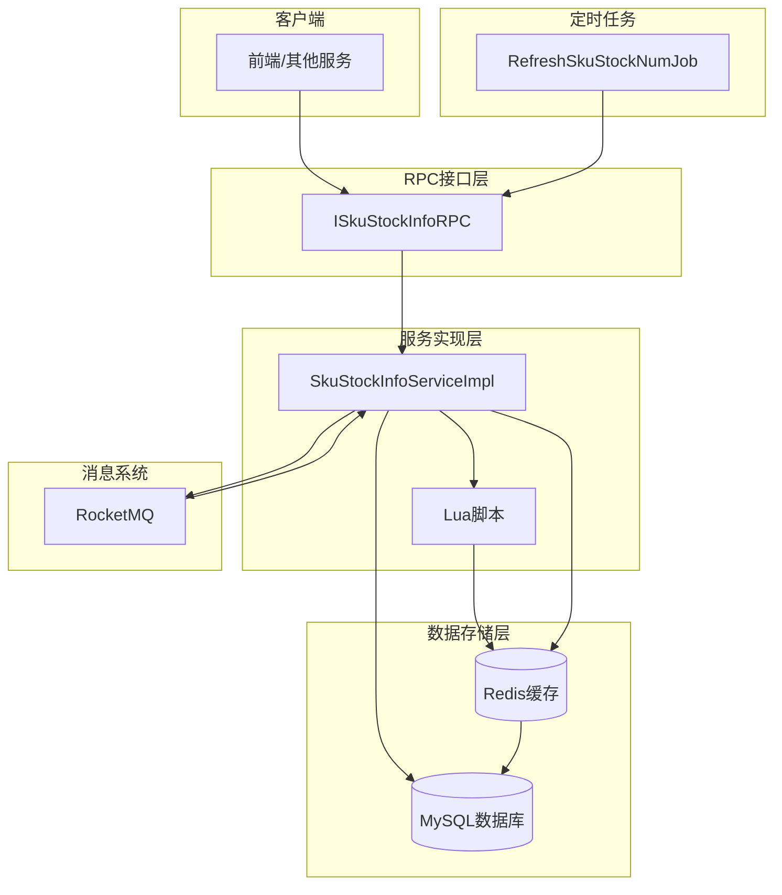

# 库存管理RPC接口

<cite>
**本文档引用的文件**
- [ISkuStockInfoRPC.java](file://live-sku-interface/src/main/java/com/logilong/live/sku/interfaces/ISkuStockInfoRPC.java)
- [SkuStockInfoRPCImpl.java](file://live-sku-provider/src/main/java/com/logilong/live/sku/provider/rpc/SkuStockInfoRPCImpl.java)
- [SkuStockInfoServiceImpl.java](file://live-sku-provider/src/main/java/com/logilong/live/sku/provider/service/impl/SkuStockInfoServiceImpl.java)
- [secKill.lua](file://live-gift-provider/src/main/resources/secKill.lua)
- [RefreshSkuStockNumJob.java](file://live-sku-provider/src/main/java/com/logilong/live/sku/provider/config/RefreshSkuStockNumJob.java)
- [StockRollbackConsumer.java](file://live-sku-provider/src/main/java/com/logilong/live/sku/provider/consumer/StockRollbackConsumer.java)
- [ISkuStockInfoService.java](file://live-sku-provider/src/main/java/com/logilong/live/sku/provider/service/ISkuStockInfoService.java)
- [RollbackStockInfoDTO.java](file://live-sku-interface/src/main/java/com/logilong/live/sku/dto/RollbackStockInfoDTO.java)
- [DecrStockNumBO.java](file://live-sku-provider/src/main/java/com/logilong/live/sku/provider/service/bo/DecrStockNumBO.java)
- [SkuProviderCacheKeyBuilder.java](file://live-framework/live-framework-redis-starter/src/main/java/com/logilong/live/framework/redis/starter/key/SkuProviderCacheKeyBuilder.java)
</cite>

## 目录
1. [引言](#引言)
2. [核心组件分析](#核心组件分析)
3. [库存扣减机制](#库存扣减机制)
4. [缓存查询与预热](#缓存查询与预热)
5. [数据同步机制](#数据同步机制)
6. [双写一致性策略](#双写一致性策略)
7. [库存回滚机制](#库存回滚机制)
8. [架构概览](#架构概览)
9. [结论](#结论)

## 引言
本文档深入分析库存管理RPC接口ISkuStockInfoRPC的设计与实现，重点阐述如何通过Lua脚本实现Redis中库存的原子性扣减以防止超卖。文档详细说明了库存查询、预热、同步及回滚等关键机制，以及Redis与MySQL双写一致性策略。

## 核心组件分析

库存管理RPC接口ISkuStockInfoRPC是直播平台商品库存管理的核心服务，提供了一系列用于库存操作的远程过程调用方法。该接口通过Dubbo框架暴露服务，实现了高性能的分布式调用。

接口定义了多个关键方法，包括通过商品ID查询库存、预热库存信息、基础缓存查询、同步库存到MySQL、更新库存以及最重要的库存扣减操作。这些方法共同构成了一个完整的库存管理系统，支持高并发场景下的库存管理需求。

**Section sources**
- [ISkuStockInfoRPC.java](file://live-sku-interface/src/main/java/com/logilong/live/sku/interfaces/ISkuStockInfoRPC.java#L5-L44)

## 库存扣减机制

### Lua脚本实现原子性扣减

`decrStockNumBySkuIdCache`方法通过执行Lua脚本实现了Redis中库存的原子性扣减，有效防止了超卖问题。该方法的核心在于使用Lua脚本将多个Redis操作封装为一个原子操作。

**Diagram sources**
- [SkuStockInfoRPCImpl.java](file://live-sku-provider/src/main/java/com/logilong/live/sku/provider/rpc/SkuStockInfoRPCImpl.java#L50-L53)
- [SkuStockInfoServiceImpl.java](file://live-sku-provider/src/main/java/com/logilong/live/sku/provider/service/impl/SkuStockInfoServiceImpl.java#L103-L113)
- [secKill.lua](file://live-gift-provider/src/main/resources/secKill.lua#L1-L9)

Lua脚本的逻辑如下：
1. 首先检查指定KEY（库存缓存键）是否存在
2. 如果存在，获取当前库存值
3. 判断当前库存是否大于等于要扣减的数量
4. 如果条件满足，执行decrby命令扣减库存并返回新值
5. 如果条件不满足或KEY不存在，返回-1表示扣减失败

这种设计确保了"检查-扣减"操作的原子性，避免了在高并发场景下多个请求同时读取到相同库存值导致的超卖问题。

**Section sources**
- [SkuStockInfoServiceImpl.java](file://live-sku-provider/src/main/java/com/logilong/live/sku/provider/service/impl/SkuStockInfoServiceImpl.java#L38-L45)
- [SkuStockInfoServiceImpl.java](file://live-sku-provider/src/main/java/com/logilong/live/sku/provider/service/impl/SkuStockInfoServiceImpl.java#L103-L113)

## 缓存查询与预热

### queryStockNum缓存查询机制

`queryStockNum`方法提供了基础的缓存查询接口，直接从Redis中获取指定商品ID的库存数量。该方法通过`SkuProviderCacheKeyBuilder`构建缓存键，然后使用`redisTemplate`从Redis中获取值。

**Diagram sources**
- [SkuStockInfoRPCImpl.java](file://live-sku-provider/src/main/java/com/logilong/live/sku/provider/rpc/SkuStockInfoRPCImpl.java#L86-L90)

### prepareStockInfo库存预热流程

`prepareStockInfo`方法实现了库存预热功能，将指定主播关联的商品库存从数据库加载到Redis缓存中。该流程首先通过`anchorShopInfoService`查询主播关联的商品ID列表，然后批量查询这些商品的库存信息，最后使用`redisTemplate.opsForValue().multiSet()`方法将库存数据批量写入Redis。

预热过程中还设置了缓存过期时间（1天），通过管道（pipeline）技术批量设置所有缓存键的过期时间，提高了操作效率。

**Diagram sources**
- [SkuStockInfoRPCImpl.java](file://live-sku-provider/src/main/java/com/logilong/live/sku/provider/rpc/SkuStockInfoRPCImpl.java#L61-L83)

**Section sources**
- [SkuStockInfoRPCImpl.java](file://live-sku-provider/src/main/java/com/logilong/live/sku/provider/rpc/SkuStockInfoRPCImpl.java#L61-L83)

## 数据同步机制

### syncStockNumToMySql定时同步

`syncStockNumToMySql`方法实现了将Redis中的库存数据同步到MySQL数据库的功能。该方法通常由定时任务触发，确保缓存与数据库的数据一致性。

**Diagram sources**
- [SkuStockInfoRPCImpl.java](file://live-sku-provider/src/main/java/com/logilong/live/sku/provider/rpc/SkuStockInfoRPCImpl.java#L92-L102)
- [RefreshSkuStockNumJob.java](file://live-sku-provider/src/main/java/com/logilong/live/sku/provider/config/RefreshSkuStockNumJob.java#L55-L64)

### 定时任务实现

`RefreshSkuStockNumJob`类实现了定时同步的调度逻辑。该任务使用`ScheduledThreadPoolExecutor`以固定延迟的方式执行，每隔1秒检查并同步库存数据。

为避免在分布式部署环境下多个节点同时执行同步任务，该实现采用了分布式锁机制。通过`redisTemplate.opsForValue().setIfAbsent()`方法尝试获取锁，只有成功获取锁的节点才能执行同步操作，确保了任务的幂等性。

**Diagram sources**
- [RefreshSkuStockNumJob.java](file://live-sku-provider/src/main/java/com/logilong/live/sku/provider/config/RefreshSkuStockNumJob.java#L36-L65)

**Section sources**
- [RefreshSkuStockNumJob.java](file://live-sku-provider/src/main/java/com/logilong/live/sku/provider/config/RefreshSkuStockNumJob.java#L21-L66)

## 双写一致性策略

系统采用了"先更新数据库，再删除缓存"的双写一致性策略，但在库存管理场景中，由于高并发扣减操作的特殊性，采用了不同的处理方式。

对于直接更新场景的`updateStockNumBySkuId`方法，系统首先尝试更新数据库，如果更新成功，则更新Redis缓存。该方法实现了重试机制（最多3次），以应对数据库并发更新冲突。

**Diagram sources**
- [SkuStockInfoRPCImpl.java](file://live-sku-provider/src/main/java/com/logilong/live/sku/provider/rpc/SkuStockInfoRPCImpl.java#L37-L47)
- [SkuStockInfoServiceImpl.java](file://live-sku-provider/src/main/java/com/logilong/live/sku/provider/service/impl/SkuStockInfoServiceImpl.java#L88-L99)

在高并发秒杀场景下，系统优先使用Redis缓存进行库存扣减，通过Lua脚本保证原子性，然后通过定时任务异步同步到数据库，这种最终一致性方案能够更好地支持高并发访问。

**Section sources**
- [SkuStockInfoRPCImpl.java](file://live-sku-provider/src/main/java/com/logilong/live/sku/provider/rpc/SkuStockInfoRPCImpl.java#L37-L47)
- [SkuStockInfoServiceImpl.java](file://live-sku-provider/src/main/java/com/logilong/live/sku/provider/service/impl/SkuStockInfoServiceImpl.java#L88-L99)

## 库存回滚机制

### StockRollbackConsumer库存回滚

当订单支付超时或取消时，需要将已扣减的库存回滚。系统通过消息队列实现库存回滚，`StockRollbackConsumer`类作为消息消费者监听库存回滚主题。

**Diagram sources**
- [StockRollbackConsumer.java](file://live-sku-provider/src/main/java/com/logilong/live/sku/provider/consumer/StockRollbackConsumer.java#L31-L51)
- [SkuStockInfoServiceImpl.java](file://live-sku-provider/src/main/java/com/logilong/live/sku/provider/service/impl/SkuStockInfoServiceImpl.java#L133-L148)

### 回滚处理逻辑

`stockRollbackHandler`方法首先验证订单状态，确保只有未支付的订单才能进行库存回滚。然后更新订单状态，并通过`redisTemplate.opsForValue().increment()`方法将库存逐个商品回滚到Redis缓存中。

这种基于消息队列的异步回滚机制解耦了订单系统和库存系统，提高了系统的可靠性和可扩展性。

**Section sources**
- [StockRollbackConsumer.java](file://live-sku-provider/src/main/java/com/logilong/live/sku/provider/consumer/StockRollbackConsumer.java#L22-L52)
- [SkuStockInfoServiceImpl.java](file://live-sku-provider/src/main/java/com/logilong/live/sku/provider/service/impl/SkuStockInfoServiceImpl.java#L133-L148)

## 架构概览

**Diagram sources**
- [ISkuStockInfoRPC.java](file://live-sku-interface/src/main/java/com/logilong/live/sku/interfaces/ISkuStockInfoRPC.java#L5-L44)
- [SkuStockInfoRPCImpl.java](file://live-sku-provider/src/main/java/com/logilong/live/sku/provider/rpc/SkuStockInfoRPCImpl.java#L23-L104)
- [SkuStockInfoServiceImpl.java](file://live-sku-provider/src/main/java/com/logilong/live/sku/provider/service/impl/SkuStockInfoServiceImpl.java#L27-L151)
- [RefreshSkuStockNumJob.java](file://live-sku-provider/src/main/java/com/logilong/live/sku/provider/config/RefreshSkuStockNumJob.java#L21-L66)
- [StockRollbackConsumer.java](file://live-sku-provider/src/main/java/com/logilong/live/sku/provider/consumer/StockRollbackConsumer.java#L22-L52)

## 结论
库存管理RPC接口ISkuStockInfoRPC通过Lua脚本实现了Redis中库存扣减的原子性，有效防止了高并发场景下的超卖问题。系统采用Redis作为主要库存操作存储，通过定时任务异步同步到MySQL，实现了高性能与数据一致性的平衡。

缓存预热机制确保了热点数据的快速访问，而基于消息队列的库存回滚机制则保证了订单状态变更时库存的正确性。分布式锁的使用确保了定时任务在集群环境下的安全执行。

整体架构设计充分考虑了直播带货场景的高并发特性，通过合理的缓存策略、原子操作和异步处理机制，构建了一个稳定可靠的库存管理系统。