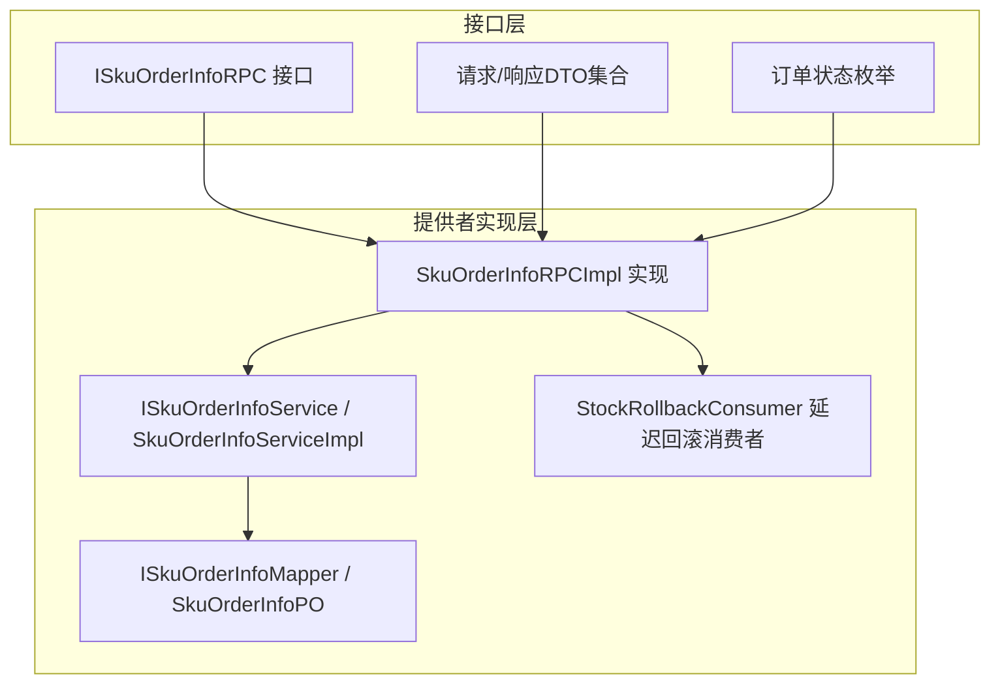
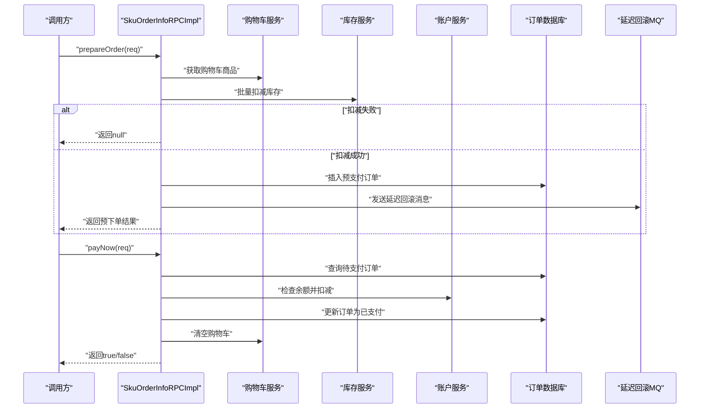
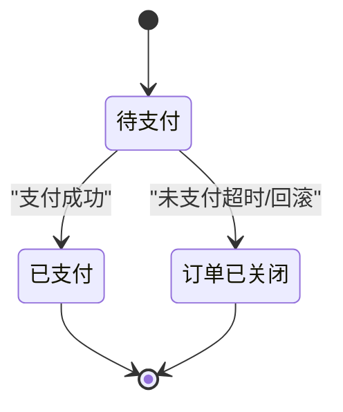
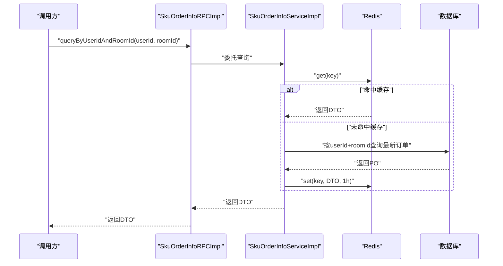
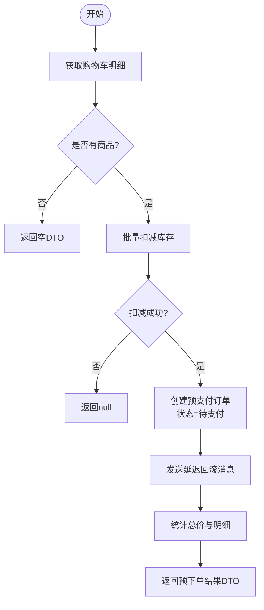
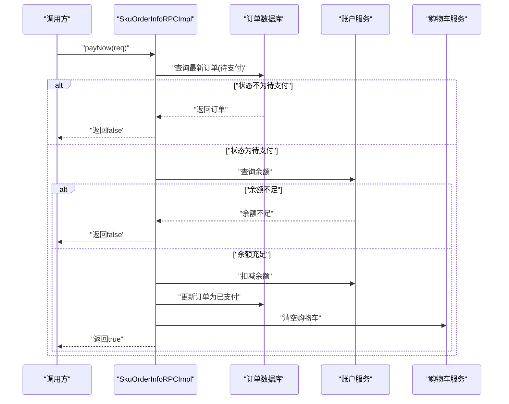
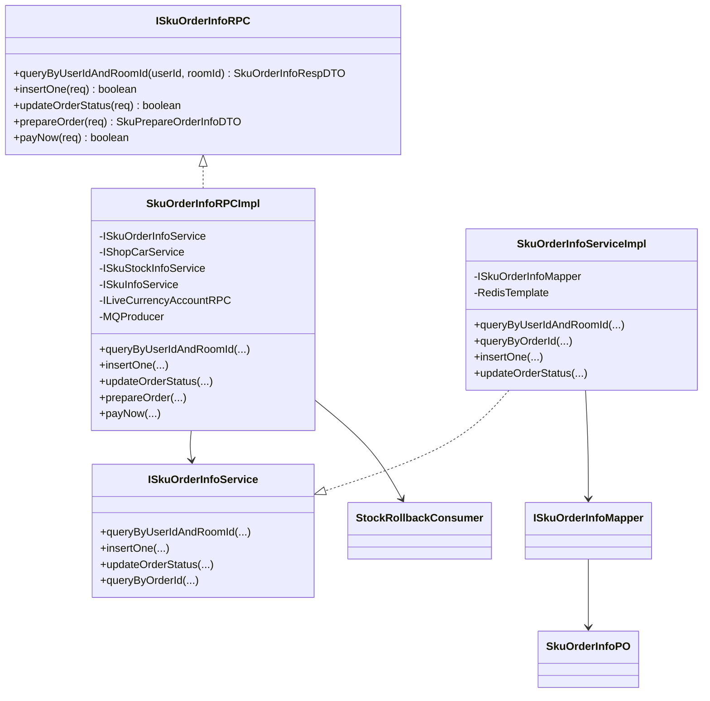

# 订单管理RPC接口

<cite>
**本文引用的文件列表**
- [ISkuOrderInfoRPC.java](file://live-sku-interface/src/main/java/com/logilong/live/sku/interfaces/ISkuOrderInfoRPC.java)
- [SkuOrderInfoReqDTO.java](file://live-sku-interface/src/main/java/com/logilong/live/sku/dto/SkuOrderInfoReqDTO.java)
- [SkuOrderInfoRespDTO.java](file://live-sku-interface/src/main/java/com/logilong/live/sku/dto/SkuOrderInfoRespDTO.java)
- [PrepareOrderReqDTO.java](file://live-sku-interface/src/main/java/com/logilong/live/sku/dto/PrepareOrderReqDTO.java)
- [PayNowReqDTO.java](file://live-sku-interface/src/main/java/com/logilong/live/sku/dto/PayNowReqDTO.java)
- [SkuPrepareOrderInfoDTO.java](file://live-sku-interface/src/main/java/com/logilong/live/sku/dto/SkuPrepareOrderInfoDTO.java)
- [SkuPrepareOrderItemInfoDTO.java](file://live-sku-interface/src/main/java/com/logilong/live/sku/dto/SkuPrepareOrderItemInfoDTO.java)
- [RollbackStockInfoDTO.java](file://live-sku-interface/src/main/java/com/logilong/live/sku/dto/RollbackStockInfoDTO.java)
- [SkuOrderInfoEnum.java](file://live-sku-interface/src/main/java/com/logilong/live/sku/constants/SkuOrderInfoEnum.java)
- [SkuOrderInfoRPCImpl.java](file://live-sku-provider/src/main/java/com/logilong/live/sku/provider/rpc/SkuOrderInfoRPCImpl.java)
- [ISkuOrderInfoService.java](file://live-sku-provider/src/main/java/com/logilong/live/sku/provider/service/ISkuOrderInfoService.java)
- [SkuOrderInfoServiceImpl.java](file://live-sku-provider/src/main/java/com/logilong/live/sku/provider/service/impl/SkuOrderInfoServiceImpl.java)
- [ISkuOrderInfoMapper.java](file://live-sku-provider/src/main/java/com/logilong/live/sku/provider/dao/mapper/ISkuOrderInfoMapper.java)
- [SkuOrderInfoPO.java](file://live-sku-provider/src/main/java/com/logilong/live/sku/provider/dao/po/SkuOrderInfoPO.java)
- [StockRollbackConsumer.java](file://live-sku-provider/src/main/java/com/logilong/live/sku/provider/consumer/StockRollbackConsumer.java)
</cite>

## 目录
1. [简介](#简介)
2. [项目结构](#项目结构)
3. [核心组件](#核心组件)
4. [架构总览](#架构总览)
5. [详细组件分析](#详细组件分析)
6. [依赖关系分析](#依赖关系分析)
7. [性能与可靠性](#性能与可靠性)
8. [故障排查指南](#故障排查指南)
9. [结论](#结论)
10. [附录](#附录)

## 简介
本文件系统性地文档化订单管理RPC接口ISkuOrderInfoRPC的五个核心方法：queryByUserIdAndRoomId（按用户+直播间查询订单）、insertOne（创建订单）、updateOrderStatus（更新订单状态）、prepareOrder（预下单）、payNow（支付）。同时，对请求与响应DTO结构进行说明，并解释订单状态机与事务处理机制（含库存扣减、延迟回滚、余额扣减与订单状态变更的协调流程）。

## 项目结构
围绕订单管理的核心代码分布在“接口层”和“提供者实现层”，接口层定义RPC契约与DTO，提供者实现层完成业务编排、数据库访问、缓存与消息队列集成。

图表来源
- [ISkuOrderInfoRPC.java](file://live-sku-interface/src/main/java/com/logilong/live/sku/interfaces/ISkuOrderInfoRPC.java#L1-L32)
- [SkuOrderInfoRPCImpl.java](file://live-sku-provider/src/main/java/com/logilong/live/sku/provider/rpc/SkuOrderInfoRPCImpl.java#L1-L181)
- [ISkuOrderInfoService.java](file://live-sku-provider/src/main/java/com/logilong/live/sku/provider/service/ISkuOrderInfoService.java#L1-L27)
- [SkuOrderInfoServiceImpl.java](file://live-sku-provider/src/main/java/com/logilong/live/sku/provider/service/impl/SkuOrderInfoServiceImpl.java#L1-L91)
- [ISkuOrderInfoMapper.java](file://live-sku-provider/src/main/java/com/logilong/live/sku/provider/dao/mapper/ISkuOrderInfoMapper.java#L1-L10)
- [SkuOrderInfoPO.java](file://live-sku-provider/src/main/java/com/logilong/live/sku/provider/dao/po/SkuOrderInfoPO.java#L1-L27)
- [StockRollbackConsumer.java](file://live-sku-provider/src/main/java/com/logilong/live/sku/provider/consumer/StockRollbackConsumer.java#L1-L52)

章节来源
- [ISkuOrderInfoRPC.java](file://live-sku-interface/src/main/java/com/logilong/live/sku/interfaces/ISkuOrderInfoRPC.java#L1-L32)
- [SkuOrderInfoRPCImpl.java](file://live-sku-provider/src/main/java/com/logilong/live/sku/provider/rpc/SkuOrderInfoRPCImpl.java#L1-L181)

## 核心组件
- ISkuOrderInfoRPC：定义订单管理RPC契约，包括查询、创建、状态更新、预下单、支付。
- DTO集合：
  - 请求：SkuOrderInfoReqDTO、PrepareOrderReqDTO、PayNowReqDTO
  - 响应：SkuOrderInfoRespDTO、SkuPrepareOrderInfoDTO、SkuPrepareOrderItemInfoDTO
- 订单状态枚举：SkuOrderInfoEnum（待支付、已支付、订单已关闭）
- 实现与服务：
  - SkuOrderInfoRPCImpl：业务编排（库存扣减、订单创建、延迟回滚、余额扣减、状态更新、购物车清理）
  - ISkuOrderInfoService/SkuOrderInfoServiceImpl：订单查询、插入、状态更新；Redis缓存读写
  - ISkuOrderInfoMapper/SkuOrderInfoPO：MyBatis映射与持久化
  - StockRollbackConsumer：RocketMQ延迟回滚消费者

章节来源
- [ISkuOrderInfoRPC.java](file://live-sku-interface/src/main/java/com/logilong/live/sku/interfaces/ISkuOrderInfoRPC.java#L1-L32)
- [SkuOrderInfoReqDTO.java](file://live-sku-interface/src/main/java/com/logilong/live/sku/dto/SkuOrderInfoReqDTO.java#L1-L23)
- [SkuOrderInfoRespDTO.java](file://live-sku-interface/src/main/java/com/logilong/live/sku/dto/SkuOrderInfoRespDTO.java#L1-L32)
- [PrepareOrderReqDTO.java](file://live-sku-interface/src/main/java/com/logilong/live/sku/dto/PrepareOrderReqDTO.java#L1-L17)
- [PayNowReqDTO.java](file://live-sku-interface/src/main/java/com/logilong/live/sku/dto/PayNowReqDTO.java#L1-L22)
- [SkuPrepareOrderInfoDTO.java](file://live-sku-interface/src/main/java/com/logilong/live/sku/dto/SkuPrepareOrderInfoDTO.java#L1-L22)
- [SkuPrepareOrderItemInfoDTO.java](file://live-sku-interface/src/main/java/com/logilong/live/sku/dto/SkuPrepareOrderItemInfoDTO.java#L1-L23)
- [RollbackStockInfoDTO.java](file://live-sku-interface/src/main/java/com/logilong/live/sku/dto/RollbackStockInfoDTO.java#L1-L17)
- [SkuOrderInfoEnum.java](file://live-sku-interface/src/main/java/com/logilong/live/sku/constants/SkuOrderInfoEnum.java#L1-L18)
- [SkuOrderInfoRPCImpl.java](file://live-sku-provider/src/main/java/com/logilong/live/sku/provider/rpc/SkuOrderInfoRPCImpl.java#L1-L181)
- [ISkuOrderInfoService.java](file://live-sku-provider/src/main/java/com/logilong/live/sku/provider/service/ISkuOrderInfoService.java#L1-L27)
- [SkuOrderInfoServiceImpl.java](file://live-sku-provider/src/main/java/com/logilong/live/sku/provider/service/impl/SkuOrderInfoServiceImpl.java#L1-L91)
- [ISkuOrderInfoMapper.java](file://live-sku-provider/src/main/java/com/logilong/live/sku/provider/dao/mapper/ISkuOrderInfoMapper.java#L1-L10)
- [SkuOrderInfoPO.java](file://live-sku-provider/src/main/java/com/logilong/live/sku/provider/dao/po/SkuOrderInfoPO.java#L1-L27)
- [StockRollbackConsumer.java](file://live-sku-provider/src/main/java/com/logilong/live/sku/provider/consumer/StockRollbackConsumer.java#L1-L52)

## 架构总览
订单管理采用“RPC接口 + 服务编排 + 缓存 + 数据库 + MQ”的分层架构。RPC实现负责跨模块协作（库存、账户、购物车），服务层负责缓存与数据库交互，MQ负责延迟回滚保障最终一致性。

图表来源
- [SkuOrderInfoRPCImpl.java](file://live-sku-provider/src/main/java/com/logilong/live/sku/provider/rpc/SkuOrderInfoRPCImpl.java#L62-L159)
- [ISkuOrderInfoService.java](file://live-sku-provider/src/main/java/com/logilong/live/sku/provider/service/ISkuOrderInfoService.java#L1-L27)
- [SkuOrderInfoServiceImpl.java](file://live-sku-provider/src/main/java/com/logilong/live/sku/provider/service/impl/SkuOrderInfoServiceImpl.java#L31-L90)

## 详细组件分析

### 接口与契约：ISkuOrderInfoRPC
- queryByUserIdAndRoomId：按用户与直播间查询最新订单，返回响应DTO。
- insertOne：创建订单，接收请求DTO，返回布尔值（实现中以非空判断替代）。
- updateOrderStatus：更新订单状态，接收请求DTO。
- prepareOrder：预下单，基于购物车生成预下单信息，执行库存扣减与订单创建，并发送延迟回滚消息。
- payNow：支付，校验订单状态为待支付，扣减余额，更新订单状态，清空购物车。

章节来源
- [ISkuOrderInfoRPC.java](file://live-sku-interface/src/main/java/com/logilong/live/sku/interfaces/ISkuOrderInfoRPC.java#L1-L32)

### 请求与响应DTO结构说明

- SkuOrderInfoReqDTO
  - 字段：id、orderId、userId、roomId、status、skuIdList
  - 用途：作为订单查询、创建、状态更新的通用请求载体
  - 关键点：skuIdList为列表，实际入库以逗号拼接字符串存储

- SkuOrderInfoRespDTO
  - 字段：id、skuIdList（字符串）、userId、roomId、status、extra、createTime、updateTime
  - 用途：对外返回订单详情，包含SKU列表字符串、状态码、时间戳

- PrepareOrderReqDTO
  - 字段：userId、roomId
  - 用途：触发预下单流程的输入参数

- PayNowReqDTO
  - 字段：userId、roomId
  - 用途：触发支付流程的输入参数

- SkuPrepareOrderInfoDTO
  - 字段：totalPrice、skuPrepareOrderItemInfoDTOList
  - 用途：预下单返回的汇总信息，包含总金额与明细项

- SkuPrepareOrderItemInfoDTO
  - 字段：count、skuInfoDTO
  - 用途：预下单单项明细，包含数量与SKU基本信息

- RollbackStockInfoDTO
  - 字段：userId、orderId
  - 用途：延迟回滚消息体，携带用户与订单标识

章节来源
- [SkuOrderInfoReqDTO.java](file://live-sku-interface/src/main/java/com/logilong/live/sku/dto/SkuOrderInfoReqDTO.java#L1-L23)
- [SkuOrderInfoRespDTO.java](file://live-sku-interface/src/main/java/com/logilong/live/sku/dto/SkuOrderInfoRespDTO.java#L1-L32)
- [PrepareOrderReqDTO.java](file://live-sku-interface/src/main/java/com/logilong/live/sku/dto/PrepareOrderReqDTO.java#L1-L17)
- [PayNowReqDTO.java](file://live-sku-interface/src/main/java/com/logilong/live/sku/dto/PayNowReqDTO.java#L1-L22)
- [SkuPrepareOrderInfoDTO.java](file://live-sku-interface/src/main/java/com/logilong/live/sku/dto/SkuPrepareOrderInfoDTO.java#L1-L22)
- [SkuPrepareOrderItemInfoDTO.java](file://live-sku-interface/src/main/java/com/logilong/live/sku/dto/SkuPrepareOrderItemInfoDTO.java#L1-L23)
- [RollbackStockInfoDTO.java](file://live-sku-interface/src/main/java/com/logilong/live/sku/dto/RollbackStockInfoDTO.java#L1-L17)

### 订单状态机与事务处理机制

- 状态枚举
  - 待支付：PREPARE_PAY
  - 已支付：PAYED
  - 订单已关闭：END

- 状态流转
  - 预下单成功后订单进入“待支付”
  - 支付成功后订单进入“已支付”
  - 若未支付，延迟回滚将释放库存，订单最终关闭

- 事务与一致性保障
  - 预下单阶段：先扣减库存，再创建订单，最后发送延迟回滚消息。若任一步骤失败，通过回滚策略避免脏数据。
  - 支付阶段：先校验订单状态为“待支付”，再检查余额，扣减余额，更新订单状态，最后清空购物车。
  - 缓存策略：查询订单时优先命中Redis，写入时删除对应缓存键，确保后续读取到最新状态。
  - MQ延迟回滚：通过RocketMQ延迟消息实现超时自动回滚，保证最终一致性。

图表来源
- [SkuOrderInfoEnum.java](file://live-sku-interface/src/main/java/com/logilong/live/sku/constants/SkuOrderInfoEnum.java#L1-L18)
- [SkuOrderInfoRPCImpl.java](file://live-sku-provider/src/main/java/com/logilong/live/sku/provider/rpc/SkuOrderInfoRPCImpl.java#L62-L159)
- [SkuOrderInfoServiceImpl.java](file://live-sku-provider/src/main/java/com/logilong/live/sku/provider/service/impl/SkuOrderInfoServiceImpl.java#L31-L90)
- [StockRollbackConsumer.java](file://live-sku-provider/src/main/java/com/logilong/live/sku/provider/consumer/StockRollbackConsumer.java#L1-L52)

### 方法一：queryByUserIdAndRoomId（按用户+直播间查询订单）
- 功能：查询指定用户在指定直播间的最新订单。
- 实现要点：
  - 先查Redis缓存，命中则直接返回
  - 未命中则查询数据库，取最新一条记录，并写入Redis缓存
- 返回：SkuOrderInfoRespDTO

图表来源
- [SkuOrderInfoRPCImpl.java](file://live-sku-provider/src/main/java/com/logilong/live/sku/provider/rpc/SkuOrderInfoRPCImpl.java#L47-L51)
- [SkuOrderInfoServiceImpl.java](file://live-sku-provider/src/main/java/com/logilong/live/sku/provider/service/impl/SkuOrderInfoServiceImpl.java#L31-L49)

章节来源
- [ISkuOrderInfoRPC.java](file://live-sku-interface/src/main/java/com/logilong/live/sku/interfaces/ISkuOrderInfoRPC.java#L10-L10)
- [SkuOrderInfoServiceImpl.java](file://live-sku-provider/src/main/java/com/logilong/live/sku/provider/service/impl/SkuOrderInfoServiceImpl.java#L31-L49)

### 方法二：insertOne（创建订单）
- 功能：创建一条订单记录。
- 实现要点：
  - 将请求中的skuIdList转换为逗号分隔字符串存入数据库
  - 插入后返回持久化对象
- 返回：布尔值（实现中以非空判断替代）

章节来源
- [ISkuOrderInfoRPC.java](file://live-sku-interface/src/main/java/com/logilong/live/sku/interfaces/ISkuOrderInfoRPC.java#L15-L15)
- [SkuOrderInfoServiceImpl.java](file://live-sku-provider/src/main/java/com/logilong/live/sku/provider/service/impl/SkuOrderInfoServiceImpl.java#L69-L77)

### 方法三：updateOrderStatus（更新订单状态）
- 功能：根据请求更新订单状态。
- 实现要点：
  - 仅更新状态与主键
  - 更新后删除对应Redis缓存键，确保后续读取到最新状态

章节来源
- [ISkuOrderInfoRPC.java](file://live-sku-interface/src/main/java/com/logilong/live/sku/interfaces/ISkuOrderInfoRPC.java#L17-L21)
- [SkuOrderInfoServiceImpl.java](file://live-sku-provider/src/main/java/com/logilong/live/sku/provider/service/impl/SkuOrderInfoServiceImpl.java#L80-L89)

### 方法四：prepareOrder（预下单）
- 功能：基于购物车生成预下单信息，扣减库存，创建预支付订单，并发送延迟回滚消息。
- 流程要点：
  - 转换请求为购物车查询参数，获取购物车明细
  - 从明细提取SKU列表，执行批量库存扣减
  - 若扣减失败，返回空（表示预下单失败）
  - 扣减成功后创建订单，状态置为“待支付”
  - 发送延迟回滚消息（RocketMQ延迟级别设置为30分钟）
  - 统计总价与明细，组装返回DTO

图表来源
- [SkuOrderInfoRPCImpl.java](file://live-sku-provider/src/main/java/com/logilong/live/sku/provider/rpc/SkuOrderInfoRPCImpl.java#L62-L111)
- [SkuOrderInfoServiceImpl.java](file://live-sku-provider/src/main/java/com/logilong/live/sku/provider/service/impl/SkuOrderInfoServiceImpl.java#L69-L77)
- [StockRollbackConsumer.java](file://live-sku-provider/src/main/java/com/logilong/live/sku/provider/consumer/StockRollbackConsumer.java#L42-L47)

章节来源
- [ISkuOrderInfoRPC.java](file://live-sku-interface/src/main/java/com/logilong/live/sku/interfaces/ISkuOrderInfoRPC.java#L22-L24)
- [SkuOrderInfoRPCImpl.java](file://live-sku-provider/src/main/java/com/logilong/live/sku/provider/rpc/SkuOrderInfoRPCImpl.java#L62-L111)

### 方法五：payNow（支付）
- 功能：完成支付流程，校验状态、扣减余额、更新订单状态、清空购物车。
- 流程要点：
  - 查询当前用户在该直播间的最新订单，校验状态为“待支付”
  - 从订单中解析SKU列表，计算应付金额
  - 调用账户服务检查余额是否充足
  - 余额充足则扣减余额，更新订单为“已支付”，并清空购物车
  - 任一步骤失败均记录日志并返回false

图表来源
- [SkuOrderInfoRPCImpl.java](file://live-sku-provider/src/main/java/com/logilong/live/sku/provider/rpc/SkuOrderInfoRPCImpl.java#L113-L159)
- [SkuOrderInfoServiceImpl.java](file://live-sku-provider/src/main/java/com/logilong/live/sku/provider/service/impl/SkuOrderInfoServiceImpl.java#L31-L49)

章节来源
- [ISkuOrderInfoRPC.java](file://live-sku-interface/src/main/java/com/logilong/live/sku/interfaces/ISkuOrderInfoRPC.java#L26-L30)
- [SkuOrderInfoRPCImpl.java](file://live-sku-provider/src/main/java/com/logilong/live/sku/provider/rpc/SkuOrderInfoRPCImpl.java#L113-L159)

## 依赖关系分析

图表来源
- [ISkuOrderInfoRPC.java](file://live-sku-interface/src/main/java/com/logilong/live/sku/interfaces/ISkuOrderInfoRPC.java#L1-L32)
- [SkuOrderInfoRPCImpl.java](file://live-sku-provider/src/main/java/com/logilong/live/sku/provider/rpc/SkuOrderInfoRPCImpl.java#L1-L181)
- [ISkuOrderInfoService.java](file://live-sku-provider/src/main/java/com/logilong/live/sku/provider/service/ISkuOrderInfoService.java#L1-L27)
- [SkuOrderInfoServiceImpl.java](file://live-sku-provider/src/main/java/com/logilong/live/sku/provider/service/impl/SkuOrderInfoServiceImpl.java#L1-L91)
- [ISkuOrderInfoMapper.java](file://live-sku-provider/src/main/java/com/logilong/live/sku/provider/dao/mapper/ISkuOrderInfoMapper.java#L1-L10)
- [SkuOrderInfoPO.java](file://live-sku-provider/src/main/java/com/logilong/live/sku/provider/dao/po/SkuOrderInfoPO.java#L1-L27)
- [StockRollbackConsumer.java](file://live-sku-provider/src/main/java/com/logilong/live/sku/provider/consumer/StockRollbackConsumer.java#L1-L52)

章节来源
- [SkuOrderInfoRPCImpl.java](file://live-sku-provider/src/main/java/com/logilong/live/sku/provider/rpc/SkuOrderInfoRPCImpl.java#L1-L181)
- [SkuOrderInfoServiceImpl.java](file://live-sku-provider/src/main/java/com/logilong/live/sku/provider/service/impl/SkuOrderInfoServiceImpl.java#L1-L91)

## 性能与可靠性
- 缓存策略：查询订单优先命中Redis，减少数据库压力；更新订单后主动删除缓存键，避免脏读。
- 数据库访问：查询按userId+roomId过滤并按主键倒序取第一条，配合合适的索引可降低扫描成本。
- 幂等与一致性：
  - 预下单先扣库存再创建订单，失败即回滚，避免超卖风险。
  - 支付流程严格校验订单状态与余额，失败快速返回。
  - 延迟回滚通过RocketMQ延迟消息实现，超时自动释放库存，保障最终一致性。
- 日志与异常：关键步骤均记录错误日志，便于定位问题。

[本节为通用性能讨论，无需列出具体文件来源]

## 故障排查指南
- 预下单失败
  - 检查库存扣减是否成功
  - 检查订单创建是否成功
  - 检查延迟回滚消息发送是否异常
- 支付失败
  - 检查订单状态是否仍为“待支付”
  - 检查账户余额是否充足
  - 检查余额扣减与订单状态更新是否成功
  - 检查购物车清空是否成功
- 缓存不一致
  - 触发状态更新后，确认缓存键已被删除
  - 检查Redis连接与配置

章节来源
- [SkuOrderInfoRPCImpl.java](file://live-sku-provider/src/main/java/com/logilong/live/sku/provider/rpc/SkuOrderInfoRPCImpl.java#L113-L159)
- [SkuOrderInfoServiceImpl.java](file://live-sku-provider/src/main/java/com/logilong/live/sku/provider/service/impl/SkuOrderInfoServiceImpl.java#L80-L89)

## 结论
ISkuOrderInfoRPC提供了完整的订单生命周期管理能力，结合Redis缓存、数据库持久化与RocketMQ延迟回滚，实现了高性能与高可靠性的订单处理流程。预下单与支付流程严格遵循状态机约束，配合幂等设计与完善的日志记录，能够有效支撑直播电商场景下的订单并发与一致性需求。

[本节为总结性内容，无需列出具体文件来源]

## 附录

### 数据模型与字段说明
- SkuOrderInfoPO（t_sku_order_info）
  - 主键：id
  - SKU列表：skuIdList（字符串，逗号分隔）
  - 用户与房间：userId、roomId
  - 状态：status（枚举编码）
  - 扩展：extra
  - 时间：createTime、updateTime

章节来源
- [SkuOrderInfoPO.java](file://live-sku-provider/src/main/java/com/logilong/live/sku/provider/dao/po/SkuOrderInfoPO.java#L1-L27)