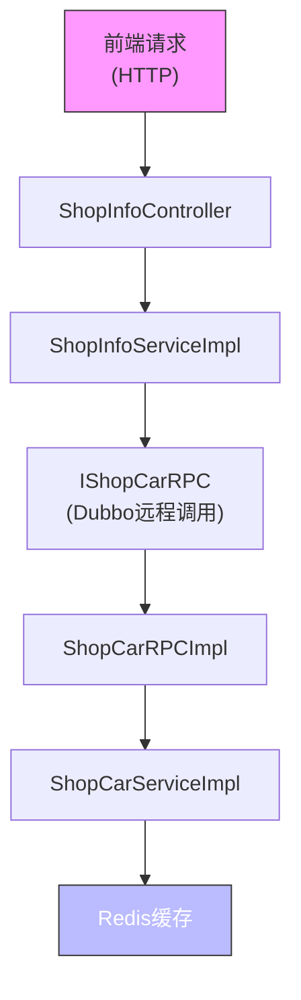

# 购物车RPC接口

<cite>
**本文档引用文件**  
- [IShopCarRPC.java](file://live-sku-interface/src/main/java/com/logilong/live/sku/interfaces/IShopCarRPC.java)
- [ShopCarReqDTO.java](file://live-sku-interface/src/main/java/com/logilong/live/sku/dto/ShopCarReqDTO.java)
- [ShopCarRespDTO.java](file://live-sku-interface/src/main/java/com/logilong/live/sku/dto/ShopCarRespDTO.java)
- [ShopCarItemRespDTO.java](file://live-sku-interface/src/main/java/com/logilong/live/sku/dto/ShopCarItemRespDTO.java)
- [ShopCarRPCImpl.java](file://live-sku-provider/src/main/java/com/logilong/live/sku/provider/rpc/ShopCarRPCImpl.java)
- [ShopCarServiceImpl.java](file://live-sku-provider/src/main/java/com/logilong/live/sku/provider/service/impl/ShopCarServiceImpl.java)
- [ShopInfoServiceImpl.java](file://live-api/src/main/java/com/logilong/live/api/service/impl/ShopInfoServiceImpl.java)
- [ShopCarReqVO.java](file://live-api/src/main/java/com/logilong/live/api/vo/req/ShopCarReqVO.java)
- [ShopCarRespVO.java](file://live-api/src/main/java/com/logilong/live/api/vo/resp/ShopCarRespVO.java)
- [ShopCarItemRespVO.java](file://live-api/src/main/java/com/logilong/live/api/vo/resp/ShopCarItemRespVO.java)
</cite>

## 目录
1. [简介](#简介)
2. [核心方法详解](#核心方法详解)
3. [数据传输对象（DTO）设计](#数据传输对象dto设计)
4. [高并发下的幂等性处理机制](#高并发下的幂等性处理机制)
5. [与API服务层的调用关系](#与api服务层的调用关系)
6. [总结](#总结)

## 简介
购物车RPC接口 `IShopCarRPC` 是直播电商平台中用于管理用户在直播间内购物车状态的核心服务。该接口通过Dubbo协议暴露，为上层API服务提供添加、删除、清空、修改数量及查询购物车信息的功能。购物车以直播间维度进行隔离，采用Redis哈希结构存储，确保高性能读写和会话一致性。

**Section sources**
- [IShopCarRPC.java](file://live-sku-interface/src/main/java/com/logilong/live/sku/interfaces/IShopCarRPC.java#L6-L31)

## 核心方法详解

### getShopCarInfo：查询购物车信息
该方法用于获取指定用户在特定直播间内的完整购物车信息，包括商品列表、数量及总价。

- **输入参数**：`ShopCarReqDTO`，包含 `userId`、`roomId`、`skuId`（未使用）
- **返回值**：`ShopCarRespDTO`，封装了用户ID、房间ID、总价格及商品项列表
- **实现逻辑**：
  1. 构建Redis缓存键（基于用户ID和房间ID）
  2. 扫描哈希表获取所有商品ID及其数量
  3. 批量查询商品详情（`SkuInfoDTO`）
  4. 计算总价并组装响应对象

### addShopCar：添加商品
将指定商品加入用户购物车，若商品已存在则覆盖数量为1。

- **输入参数**：`ShopCarReqDTO`
- **返回值**：布尔值表示操作是否成功
- **实现逻辑**：
  - 使用 `HSET` 命令将商品ID作为字段、数量1作为值存入Redis哈希

### removeFromShopCar：删除商品
从购物车中移除指定商品。

- **实现逻辑**：
  - 使用 `HDEL` 命令删除对应商品ID的字段

### clearShopCar：清空购物车
清空用户在当前直播间的整个购物车。

- **实现逻辑**：
  - 使用 `DEL` 命令删除整个Redis哈希键

### addShopCarItemNum：修改商品数量
增加购物车中某商品的数量（每次+1）。

- **实现逻辑**：
  - 使用 `HINCRBY` 命令对指定商品ID的值进行原子性递增

**Section sources**
- [IShopCarRPC.java](file://live-sku-interface/src/main/java/com/logilong/live/sku/interfaces/IShopCarRPC.java#L6-L31)
- [ShopCarServiceImpl.java](file://live-sku-provider/src/main/java/com/logilong/live/sku/provider/service/impl/ShopCarServiceImpl.java#L37-L62)

## 数据传输对象（DTO）设计

### ShopCarReqDTO：请求参数说明
定义购物车操作所需的请求参数：

- **userId**：用户唯一标识，用于区分不同用户的购物车数据
- **roomId**：直播间ID，作为购物车的维度隔离依据（每个直播间独立购物车）
- **skuId**：商品SKU编号，标识具体商品

> 注：`anchorId` 并未在 `ShopCarReqDTO` 中出现，可能是文档误解。实际业务中主播ID可通过 `roomId` 关联查询获得。

```java
@Data
public class ShopCarReqDTO implements Serializable {
    private Long userId;
    private Integer roomId;
    private Long skuId;
}
```

### ShopCarRespDTO：响应结构设计
封装购物车查询结果：

- **userId**：用户ID
- **roomId**：直播间ID
- **totalPrice**：购物车中所有商品的总价（单位：分）
- **shopCarItemRespDTOList**：商品项列表，每个元素包含数量和商品详情

其中 `ShopCarItemRespDTO` 结构如下：
- **count**：商品数量
- **skuInfoDTO**：完整的商品信息对象（如名称、价格、图片等）

**Section sources**
- [ShopCarReqDTO.java](file://live-sku-interface/src/main/java/com/logilong/live/sku/dto/ShopCarReqDTO.java#L10-L16)
- [ShopCarRespDTO.java](file://live-sku-interface/src/main/java/com/logilong/live/sku/dto/ShopCarRespDTO.java#L11-L20)
- [ShopCarItemRespDTO.java](file://live-sku-interface/src/main/java/com/logilong/live/sku/dto/ShopCarItemRespDTO.java#L14-L21)

## 高并发下的幂等性处理机制

由于购物车操作频繁且可能面临重复提交（如网络重试、用户误操作），系统通过以下方式保障幂等性：

1. **Redis原子操作**：
   - `addShopCar` 使用 `HSET`，天然幂等（重复设置同一商品数量为1不影响结果）
   - `addShopCarItemNum` 使用 `HINCRBY`，支持原子递增，避免并发修改导致数量错误
   - `removeFromShopCar` 使用 `HDEL`，删除不存在的字段无副作用
   - `clearShopCar` 使用 `DEL`，删除不存在的键无副作用

2. **无持久化设计**：
   - 购物车数据仅存储于Redis，不落库，减少事务开销
   - 以直播间为维度隔离，降低锁竞争概率

3. **缓存键设计**：
   - 缓存键由 `userId` 和 `roomId` 共同构成，确保多维度隔离
   - 使用 `SkuProviderCacheKeyBuilder.buildShopCar()` 统一生成，保证一致性

4. **无状态服务**：
   - 所有状态保存在Redis，服务节点可水平扩展

此设计在保证高并发性能的同时，实现了关键操作的幂等性。

**Section sources**
- [ShopCarServiceImpl.java](file://live-sku-provider/src/main/java/com/logilong/live/sku/provider/service/impl/ShopCarServiceImpl.java#L37-L62)
- [SkuProviderCacheKeyBuilder.java](file://live-framework/live-framework-redis-starter/src/main/java/com/logilong/live/framework/redis/starter/key/SkuProviderCacheKeyBuilder.java)

## 与API服务层的调用关系

购物车RPC接口由 `live-api` 模块中的 `ShopInfoServiceImpl` 通过Dubbo远程调用使用，整体调用链如下：



**Diagram sources**
- [ShopInfoServiceImpl.java](file://live-api/src/main/java/com/logilong/live/api/service/impl/ShopInfoServiceImpl.java#L58-L89)
- [ShopCarRPCImpl.java](file://live-sku-provider/src/main/java/com/logilong/live/sku/provider/rpc/ShopCarRPCImpl.java#L10-L41)

### 调用流程说明
1. **参数转换**：
   - API层接收 `ShopCarReqVO`（不含 `userId`）
   - 在 `ShopInfoServiceImpl` 中通过 `LiveRequestContext.getUserId()` 注入当前登录用户ID
   - 使用 `ConvertBeanUtils.convert()` 转换为 `ShopCarReqDTO`

2. **远程调用**：
   - 通过 `@DubboReference` 注解注入 `IShopCarRPC` 服务
   - 直接调用对应方法完成购物车操作

3. **响应转换**：
   - 将 `ShopCarRespDTO` 转换为VO对象返回前端
   - 商品列表通过 `ConvertBeanUtils.convertList()` 批量转换

该设计实现了前后端分离、服务解耦，并通过DTO/VO模式隔离了内部模型与外部接口。

**Section sources**
- [ShopInfoServiceImpl.java](file://live-api/src/main/java/com/logilong/live/api/service/impl/ShopInfoServiceImpl.java#L58-L92)
- [ShopCarReqVO.java](file://live-api/src/main/java/com/logilong/live/api/vo/req/ShopCarReqVO.java#L6-L10)
- [ShopCarRespVO.java](file://live-api/src/main/java/com/logilong/live/api/vo/resp/ShopCarRespVO.java#L8-L17)

## 总结
`IShopCarRPC` 接口作为购物车功能的核心，具备以下特点：

- **职责清晰**：提供五个基本操作，覆盖购物车全生命周期
- **性能优异**：基于Redis哈希结构，读写高效，适合高并发场景
- **幂等安全**：利用Redis原子命令保障操作幂等性
- **扩展性强**：通过Dubbo服务化，支持独立部署与横向扩展
- **调用透明**：API层通过标准Dubbo引用无缝集成

建议后续可增加购物车过期机制、最大商品数限制等风控策略，进一步提升系统健壮性。