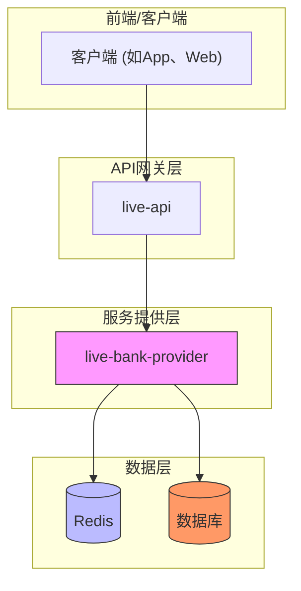
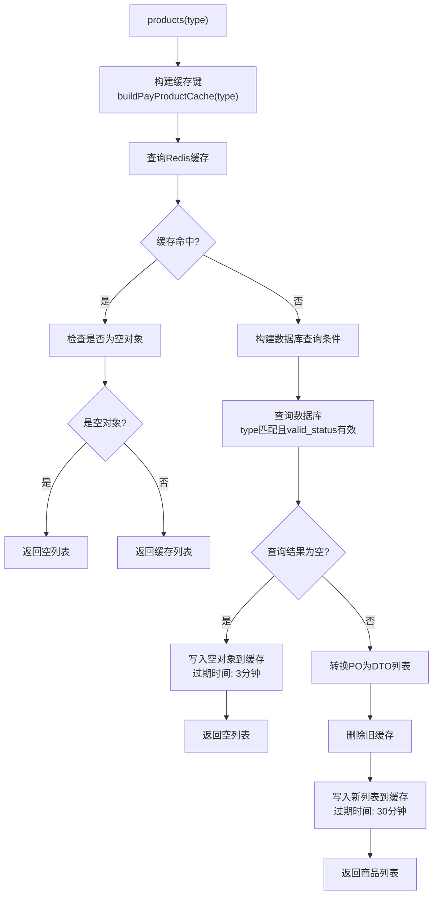
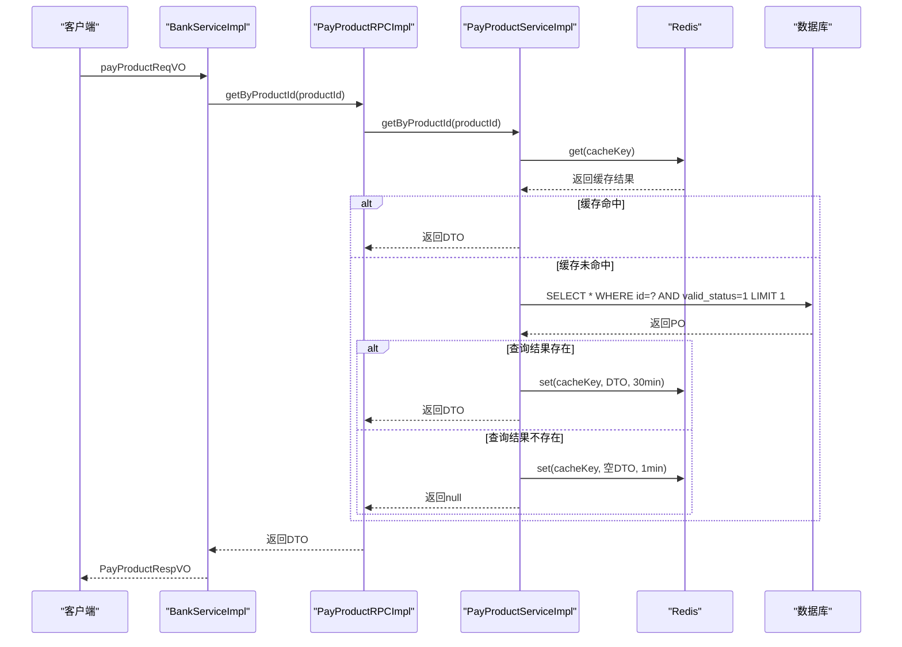
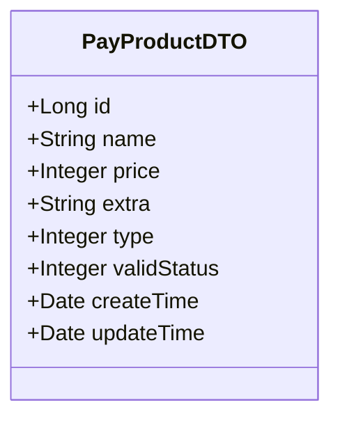
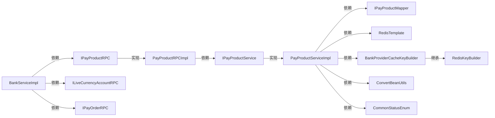

# 支付商品RPC接口

<cite>
**本文档引用的文件**  
- [IPayProductRPC.java](file://live-bank-interface/src/main/java/com/logilong/live/bank/interfaces/IPayProductRPC.java)
- [PayProductRPCImpl.java](file://live-bank-provider/src/main/java/com/logilong/live/bank/provider/rpc/PayProductRPCImpl.java)
- [PayProductDTO.java](file://live-bank-interface/src/main/java/com/logilong/live/bank/dto/PayProductDTO.java)
- [BankProviderCacheKeyBuilder.java](file://live-framework/live-framework-redis-starter/src/main/java/com/logilong/live/framework/redis/starter/key/BankProviderCacheKeyBuilder.java)
- [BankServiceImpl.java](file://live-api/src/main/java/com/logilong/live/api/service/impl/BankServiceImpl.java)
- [PayProductServiceImpl.java](file://live-bank-provider/src/main/java/com/logilong/live/bank/provider/service/impl/PayProductServiceImpl.java)
- [RedisKeyBuilder.java](file://live-framework/live-framework-redis-starter/src/main/java/com/logilong/live/framework/redis/starter/key/RedisKeyBuilder.java)
- [CommonStatusEnum.java](file://live-common-interface/src/main/java/com/logilong/live/common/interfaces/enums/CommonStatusEnum.java)
</cite>

## 目录
1. [介绍](#介绍)
2. [核心组件](#核心组件)
3. [架构概览](#架构概览)
4. [详细组件分析](#详细组件分析)
5. [依赖分析](#依赖分析)
6. [性能考虑](#性能考虑)
7. [故障排除指南](#故障排除指南)
8. [结论](#结论)

## 介绍
本文档全面文档化IPayProductRPC接口的两个核心方法：`products(Integer type)` 和 `getByProductId(Long productId)`。重点描述其缓存机制、业务逻辑、数据结构及在系统中的调用上下文。该接口服务于直播打赏、虚拟商品购买等业务场景，通过三层缓存机制（Redis + 空值缓存）优化性能并防止缓存穿透。

## 核心组件
IPayProductRPC接口是支付中台对外暴露的核心服务之一，提供按业务类型获取支付商品列表和按ID查询单个商品的功能。其核心实现位于`PayProductServiceImpl`中，通过Dubbo RPC暴露为远程服务，并由`BankServiceImpl`在API层进行调用。

**Section sources**
- [IPayProductRPC.java](file://live-bank-interface/src/main/java/com/logilong/live/bank/interfaces/IPayProductRPC.java#L8-L21)
- [PayProductRPCImpl.java](file://live-bank-provider/src/main/java/com/logilong/live/bank/provider/rpc/PayProductRPCImpl.java#L12-L26)
- [PayProductServiceImpl.java](file://live-bank-provider/src/main/java/com/logilong/live/bank/provider/service/impl/PayProductServiceImpl.java#L21-L80)

## 架构概览

**Diagram sources**
- [BankServiceImpl.java](file://live-api/src/main/java/com/logilong/live/api/service/impl/BankServiceImpl.java#L33)
- [PayProductRPCImpl.java](file://live-bank-provider/src/main/java/com/logilong/live/bank/provider/rpc/PayProductRPCImpl.java#L15)
- [PayProductServiceImpl.java](file://live-bank-provider/src/main/java/com/logilong/live/bank/provider/service/impl/PayProductServiceImpl.java#L24-L26)

## 详细组件分析

### products(Integer type) 方法分析
该方法根据业务类型（如直播打赏、虚拟商品购买）返回可用的支付商品列表，其核心逻辑实现了高效的三层缓存机制。

#### 缓存与数据库交互流程

**Diagram sources**
- [PayProductServiceImpl.java](file://live-bank-provider/src/main/java/com/logilong/live/bank/provider/service/impl/PayProductServiceImpl.java#L31-L54)
- [BankProviderCacheKeyBuilder.java](file://live-framework/live-framework-redis-starter/src/main/java/com/logilong/live/framework/redis/starter/key/BankProviderCacheKeyBuilder.java#L25-L27)

**Section sources**
- [PayProductServiceImpl.java](file://live-bank-provider/src/main/java/com/logilong/live/bank/provider/service/impl/PayProductServiceImpl.java#L31-L54)
- [CommonStatusEnum.java](file://live-common-interface/src/main/java/com/logilong/live/common/interfaces/enums/CommonStatusEnum.java#L3)

### getByProductId(Long productId) 方法分析
该方法根据商品ID查询单个商品详情，同样实现了缓存优化和空值处理。

#### 单商品查询流程

**Diagram sources**
- [PayProductServiceImpl.java](file://live-bank-provider/src/main/java/com/logilong/live/bank/provider/service/impl/PayProductServiceImpl.java#L58-L78)
- [BankProviderCacheKeyBuilder.java](file://live-framework/live-framework-redis-starter/src/main/java/com/logilong/live/framework/redis/starter/key/BankProviderCacheKeyBuilder.java#L18-L20)

**Section sources**
- [PayProductServiceImpl.java](file://live-bank-provider/src/main/java/com/logilong/live/bank/provider/service/impl/PayProductServiceImpl.java#L58-L78)
- [BankServiceImpl.java](file://live-api/src/main/java/com/logilong/live/api/service/impl/BankServiceImpl.java#L65)

### PayProductDTO 数据结构分析
`PayProductDTO`是支付商品的核心数据传输对象，定义了商品的基本属性。

#### 字段业务含义

**字段说明：**
- `id`: 商品唯一标识符
- `name`: 商品名称（如"钻石礼包"）
- `price`: 商品价格（单位：分），是前端展示的**现价**
- `extra`: 扩展字段，JSON格式，通常包含`coin`（对应虚拟币数量）等信息
- `type`: 业务类型，区分不同场景的商品（如直播打赏、商城购买）
- `validStatus`: 有效状态，1表示有效，0表示无效，查询时只返回有效商品
- `createTime/updateTime`: 创建和更新时间

**前端展示应用：**
在`BankServiceImpl`中，`price`字段用于计算用户需要支付的金额，`extra`字段中的`coin`值被解析后用于展示商品包含的虚拟币数量。

**Section sources**
- [PayProductDTO.java](file://live-bank-interface/src/main/java/com/logilong/live/bank/dto/PayProductDTO.java#L15-L23)
- [BankServiceImpl.java](file://live-api/src/main/java/com/logilong/live/api/service/impl/BankServiceImpl.java#L51)

## 依赖分析

**Diagram sources**
- [PayProductRPCImpl.java](file://live-bank-provider/src/main/java/com/logilong/live/bank/provider/rpc/PayProductRPCImpl.java#L6-L7)
- [PayProductServiceImpl.java](file://live-bank-provider/src/main/java/com/logilong/live/bank/provider/service/impl/PayProductServiceImpl.java#L24-L28)
- [BankServiceImpl.java](file://live-api/src/main/java/com/logilong/live/api/service/impl/BankServiceImpl.java#L32-L37)

**Section sources**
- [PayProductRPCImpl.java](file://live-bank-provider/src/main/java/com/logilong/live/bank/provider/rpc/PayProductRPCImpl.java#L12-L26)
- [PayProductServiceImpl.java](file://live-bank-provider/src/main/java/com/logilong/live/bank/provider/service/impl/PayProductServiceImpl.java#L21-L80)
- [BankServiceImpl.java](file://live-api/src/main/java/com/logilong/live/api/service/impl/BankServiceImpl.java#L29-L92)

## 性能考虑
- **缓存策略**：采用两级缓存策略，有效商品列表缓存30分钟，空结果缓存3分钟，单个商品缓存30分钟，空商品缓存1分钟，平衡了数据新鲜度和性能。
- **防止缓存穿透**：对数据库查询为空的结果，写入一个空的`PayProductDTO`对象到缓存，并设置较短的过期时间，有效防止了恶意请求对数据库的冲击。
- **批量操作优化**：对于列表缓存，使用`leftPushAll`一次性写入整个数组，避免了逐个写入的性能开销。
- **数据库查询优化**：使用MyBatis-Plus的`LambdaQueryWrapper`构建查询条件，并添加`limit 1`限制单商品查询的返回数量。

## 故障排除指南
- **问题**：调用`products(type)`方法返回空列表
  - **检查点1**：确认数据库中是否存在`type`匹配且`valid_status=1`的记录
  - **检查点2**：检查Redis中是否存在以`pay_product_cache:type`为前缀的键，确认缓存是否被正确写入
  - **检查点3**：确认`BankProviderCacheKeyBuilder`的前缀配置是否正确

- **问题**：调用`getByProductId(productId)`方法返回null
  - **检查点1**：确认数据库中是否存在指定ID且`valid_status=1`的记录
  - **检查点2**：检查Redis中是否存在以`pay_product_item_cache:productId`为前缀的键，如果存在且为一个空对象，则说明数据库中无此记录
  - **检查点3**：确认传入的`productId`是否为有效值

- **问题**：缓存未生效，数据库查询频繁
  - **检查点1**：确认`RedisTemplate`和`BankProviderCacheKeyBuilder`的Bean是否被正确注入
  - **检查点2**：检查Redis服务是否正常运行
  - **检查点3**：确认`@Service`和`@Resource`注解是否正确使用

**Section sources**
- [PayProductServiceImpl.java](file://live-bank-provider/src/main/java/com/logilong/live/bank/provider/service/impl/PayProductServiceImpl.java#L31-L78)
- [CommonStatusEnum.java](file://live-common-interface/src/main/java/com/logilong/live/common/interfaces/enums/CommonStatusEnum.java#L3)

## 结论
IPayProductRPC接口通过精心设计的缓存机制，有效提升了支付商品查询的性能和系统稳定性。其`products`方法实现了基于业务类型的批量查询和三层缓存策略，`getByProductId`方法提供了高效的单商品查询能力。`PayProductDTO`数据结构清晰地定义了商品的核心属性，`price`和`extra`字段为前端展示提供了必要的信息。整个接口通过Dubbo RPC暴露，被`BankServiceImpl`等上层服务安全调用，构成了支付系统的重要组成部分。