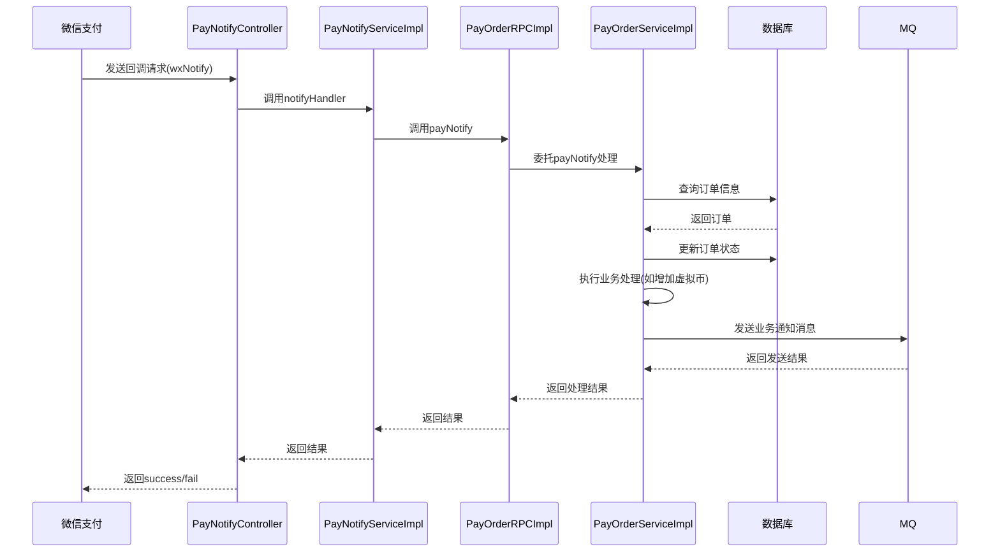
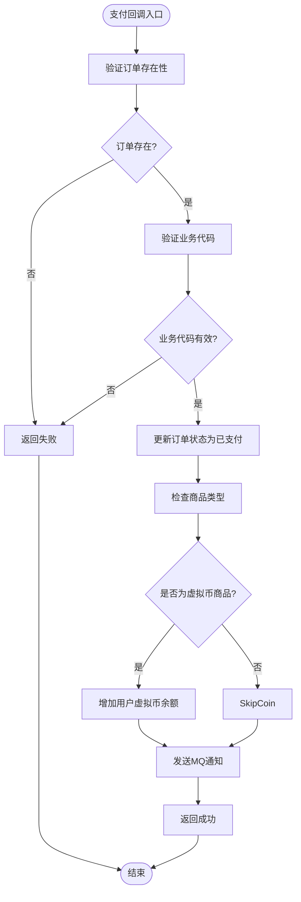
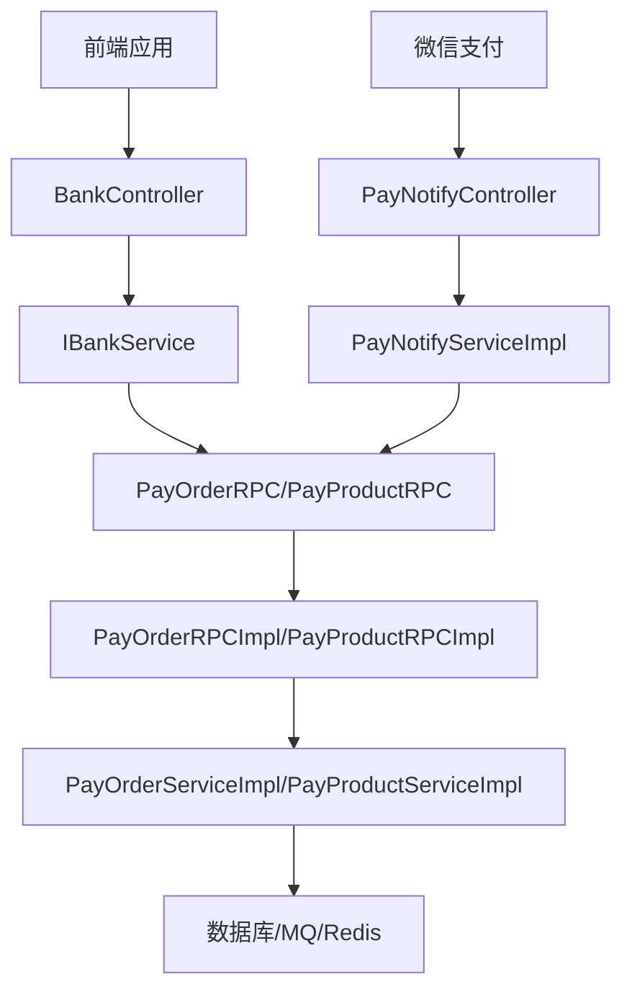

# 支付服务RPC接口

<cite>
**本文档引用的文件**
- [IPayOrderRPC.java](file://live-bank-interface/src/main/java/com/logilong/live/bank/interfaces/IPayOrderRPC.java)
- [IPayProductRPC.java](file://live-bank-interface/src/main/java/com/logilong/live/bank/interfaces/IPayProductRPC.java)
- [PayOrderDTO.java](file://live-bank-interface/src/main/java/com/logilong/live/bank/dto/PayOrderDTO.java)
- [PayProductDTO.java](file://live-bank-interface/src/main/java/com/logilong/live/bank/dto/PayProductDTO.java)
- [PayOrderRPCImpl.java](file://live-bank-provider/src/main/java/com/logilong/live/bank/provider/rpc/PayOrderRPCImpl.java)
- [PayProductRPCImpl.java](file://live-bank-provider/src/main/java/com/logilong/live/bank/provider/rpc/PayProductRPCImpl.java)
- [PayOrderServiceImpl.java](file://live-bank-provider/src/main/java/com/logilong/live/bank/provider/service/impl/PayOrderServiceImpl.java)
- [PayProductServiceImpl.java](file://live-bank-provider/src/main/java/com/logilong/live/bank/provider/service/impl/PayProductServiceImpl.java)
- [OrderStatusEnum.java](file://live-bank-interface/src/main/java/com/logilong/live/bank/constants/OrderStatusEnum.java)
- [PayProductTypeEnum.java](file://live-bank-interface/src/main/java/com/logilong/live/bank/constants/PayProductTypeEnum.java)
- [BankController.java](file://live-api/src/main/java/com/logilong/live/api/controller/BankController.java)
- [PayNotifyController.java](file://live-bank-api/src/main/java/com/logilong/live/bank/api/controller/PayNotifyController.java)
- [PayNotifyServiceImpl.java](file://live-bank-api/src/main/java/com/logilong/live/bank/api/service/impl/PayNotifyServiceImpl.java)
</cite>

## 目录
1. [支付订单RPC接口](#支付订单rpc接口)
2. [支付商品RPC接口](#支付商品rpc接口)
3. [数据传输对象定义](#数据传输对象定义)
4. [服务实现细节](#服务实现细节)
5. [调用链路分析](#调用链路分析)

## 支付订单RPC接口

`IPayOrderRPC`接口定义了支付订单的核心操作，包括创建订单、更新订单状态和处理支付回调。

### insertOne方法业务逻辑

`insertOne`方法用于创建新的支付订单。该方法接收`PayOrderDTO`对象作为参数，通过调用`PayOrderServiceImpl`的`insertOne`方法实现。在服务实现中，系统会生成一个唯一的UUID作为订单ID，并将订单信息持久化到数据库中。成功创建后返回生成的订单ID。

**Section sources**
- [IPayOrderRPC.java](file://live-bank-interface/src/main/java/com/logilong/live/bank/interfaces/IPayOrderRPC.java#L12)
- [PayOrderRPCImpl.java](file://live-bank-provider/src/main/java/com/logilong/live/bank/provider/rpc/PayOrderRPCImpl.java#L18-L20)
- [PayOrderServiceImpl.java](file://live-bank-provider/src/main/java/com/logilong/live/bank/provider/service/impl/PayOrderServiceImpl.java#L50-L56)

### updateOrderStatus方法重载方式

`updateOrderStatus`方法提供了两种重载方式来更新订单状态：

1. **通过主键ID更新**：接收订单的数据库主键ID和新的状态值，直接通过ID更新订单状态。
2. **通过订单号更新**：接收订单号字符串和新的状态值，通过订单号字段进行更新。

这两种方式提供了灵活的订单状态更新机制，适应不同的业务场景需求。在实现层面，两种方式都委托给`PayOrderServiceImpl`进行实际的数据库操作。

**Section sources**
- [IPayOrderRPC.java](file://live-bank-interface/src/main/java/com/logilong/live/bank/interfaces/IPayOrderRPC.java#L18-L23)
- [PayOrderRPCImpl.java](file://live-bank-provider/src/main/java/com/logilong/live/bank/provider/rpc/PayOrderRPCImpl.java#L23-L30)
- [PayOrderServiceImpl.java](file://live-bank-provider/src/main/java/com/logilong/live/bank/provider/service/impl/PayOrderServiceImpl.java#L58-L73)

### payNotify方法处理微信支付回调

`payNotify`方法处理来自微信支付的回调请求。该方法接收包含支付结果信息的`PayOrderDTO`对象，验证订单的合法性，更新订单状态为已支付，并根据业务类型执行相应的后续操作（如增加用户虚拟币余额），最后通过RocketMQ向相关业务服务发送通知。

**Diagram sources**
- [PayNotifyController.java](file://live-bank-api/src/main/java/com/logilong/live/bank/api/controller/PayNotifyController.java)
- [PayNotifyServiceImpl.java](file://live-bank-api/src/main/java/com/logilong/live/bank/api/service/impl/PayNotifyServiceImpl.java)
- [PayOrderRPCImpl.java](file://live-bank-provider/src/main/java/com/logilong/live/bank/provider/rpc/PayOrderRPCImpl.java)
- [PayOrderServiceImpl.java](file://live-bank-provider/src/main/java/com/logilong/live/bank/provider/service/impl/PayOrderServiceImpl.java)

**Section sources**
- [IPayOrderRPC.java](file://live-bank-interface/src/main/java/com/logilong/live/bank/interfaces/IPayOrderRPC.java#L29)
- [PayOrderRPCImpl.java](file://live-bank-provider/src/main/java/com/logilong/live/bank/provider/rpc/PayOrderRPCImpl.java#L33-L35)
- [PayOrderServiceImpl.java](file://live-bank-provider/src/main/java/com/logilong/live/bank/provider/service/impl/PayOrderServiceImpl.java#L76-L105)

## 支付商品RPC接口

`IPayProductRPC`接口提供了获取支付商品信息的功能。

### products方法根据业务类型返回商品列表

`products`方法根据传入的业务类型参数返回相应的可用支付商品列表。该方法实现了缓存机制，首先尝试从Redis缓存中获取数据，如果缓存中不存在，则从数据库查询并更新缓存。查询时会过滤出有效状态的商品，并按价格降序排列。

**Section sources**
- [IPayProductRPC.java](file://live-bank-interface/src/main/java/com/logilong/live/bank/interfaces/IPayProductRPC.java#L14)
- [PayProductRPCImpl.java](file://live-bank-provider/src/main/java/com/logilong/live/bank/provider/rpc/PayProductRPCImpl.java#L18-L20)
- [PayProductServiceImpl.java](file://live-bank-provider/src/main/java/com/logilong/live/bank/provider/service/impl/PayProductServiceImpl.java#L31-L55)

### getByProductId方法查询单个商品详情

`getByProductId`方法根据商品ID查询单个商品的详细信息。与`products`方法类似，该方法也实现了缓存机制，优先从Redis缓存中读取数据，缓存未命中时从数据库查询并将结果写入缓存，以提高后续访问的性能。

**Section sources**
- [IPayProductRPC.java](file://live-bank-interface/src/main/java/com/logilong/live/bank/interfaces/IPayProductRPC.java#L20)
- [PayProductRPCImpl.java](file://live-bank-provider/src/main/java/com/logilong/live/bank/provider/rpc/PayProductRPCImpl.java#L23-L25)
- [PayProductServiceImpl.java](file://live-bank-provider/src/main/java/com/logilong/live/bank/provider/service/impl/PayProductServiceImpl.java#L58-L78)

## 数据传输对象定义

### PayProductDTO字段业务含义

`PayProductDTO`类定义了支付商品的数据结构，其主要字段的业务含义如下：

- **price**: 商品价格，以分为单位的整数值，表示用户需要支付的金额
- **originalPrice**: 原价，用于显示商品的原始价格，支持折扣展示
- **discount**: 折扣信息，表示商品的折扣比例或金额，用于计算实际支付价格
- **id**: 商品唯一标识符，用于区分不同的支付商品
- **name**: 商品名称，显示给用户的商品标题
- **type**: 商品类型，标识商品所属的业务场景（如虚拟币充值）
- **validStatus**: 有效状态，标识商品是否可用（有效/无效）
- **extra**: 扩展信息，JSON格式的字符串，存储商品的额外配置信息
- **createTime**: 创建时间，记录商品的创建时间戳
- **updateTime**: 更新时间，记录商品信息最后修改的时间戳

**Section sources**
- [PayProductDTO.java](file://live-bank-interface/src/main/java/com/logilong/live/bank/dto/PayProductDTO.java)

## 服务实现细节

### PayOrderServiceImpl实现细节

`PayOrderServiceImpl`是支付订单服务的核心实现类，主要功能包括：

1. **订单创建**：生成UUID作为订单号，将订单信息持久化到数据库
2. **状态更新**：提供基于ID和订单号的两种状态更新方式
3. **回调处理**：验证支付回调的合法性，更新订单状态，执行业务逻辑
4. **消息通知**：通过RocketMQ向相关业务服务发送支付成功通知

在支付回调处理中，系统会验证订单是否存在，检查业务代码的有效性，然后调用`payNotifyHandler`方法执行具体的业务处理逻辑。

**Diagram sources**
- [PayOrderServiceImpl.java](file://live-bank-provider/src/main/java/com/logilong/live/bank/provider/service/impl/PayOrderServiceImpl.java)

**Section sources**
- [PayOrderServiceImpl.java](file://live-bank-provider/src/main/java/com/logilong/live/bank/provider/service/impl/PayOrderServiceImpl.java)

### PayProductServiceImpl实现细节

`PayProductServiceImpl`实现了支付商品服务，主要特点包括：

1. **缓存策略**：使用Redis作为缓存层，减少数据库访问压力
2. **缓存键设计**：使用`BankProviderCacheKeyBuilder`构建规范的缓存键
3. **缓存穿透防护**：当查询结果为空时，向缓存写入空对象并设置较短的过期时间
4. **缓存更新**：当数据库查询到数据后，删除旧缓存并写入新数据，设置较长的过期时间

对于商品列表查询，系统会将结果缓存30分钟；对于单个商品查询，缓存时间为30分钟；对于空结果，缓存时间为1-3分钟，以防止缓存穿透攻击。

**Section sources**
- [PayProductServiceImpl.java](file://live-bank-provider/src/main/java/com/logilong/live/bank/provider/service/impl/PayProductServiceImpl.java)

## 调用链路分析

### 完整调用链路

支付功能的完整调用链路如下：

1. **前端请求**：用户在前端发起支付请求
2. **API层**：`BankController`接收请求，调用`IBankService`
3. **服务层**：`BankServiceImpl`处理业务逻辑，调用`IPayOrderRPC`和`IPayProductRPC`
4. **RPC层**：`PayOrderRPCImpl`和`PayProductRPCImpl`作为Dubbo服务提供者
5. **实现层**：`PayOrderServiceImpl`和`PayProductServiceImpl`执行具体业务逻辑
6. **数据访问**：通过MyBatis Plus访问数据库
7. **回调处理**：微信支付回调`PayNotifyController`，经由`PayNotifyServiceImpl`调用`PayOrderRPC`

**Diagram sources**
- [BankController.java](file://live-api/src/main/java/com/logilong/live/api/controller/BankController.java)
- [PayNotifyController.java](file://live-bank-api/src/main/java/com/logilong/live/bank/api/controller/PayNotifyController.java)
- [PayNotifyServiceImpl.java](file://live-bank-api/src/main/java/com/logilong/live/bank/api/service/impl/PayNotifyServiceImpl.java)
- [PayOrderRPCImpl.java](file://live-bank-provider/src/main/java/com/logilong/live/bank/provider/rpc/PayOrderRPCImpl.java)

**Section sources**
- [BankController.java](file://live-api/src/main/java/com/logilong/live/api/controller/BankController.java)
- [PayNotifyController.java](file://live-bank-api/src/main/java/com/logilong/live/bank/api/controller/PayNotifyController.java)
- [PayNotifyServiceImpl.java](file://live-bank-api/src/main/java/com/logilong/live/bank/api/service/impl/PayNotifyServiceImpl.java)