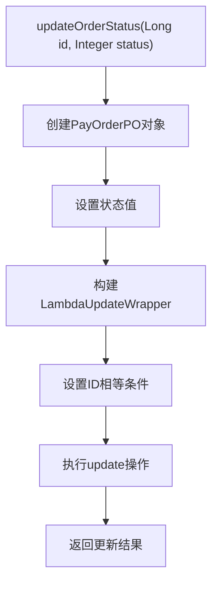
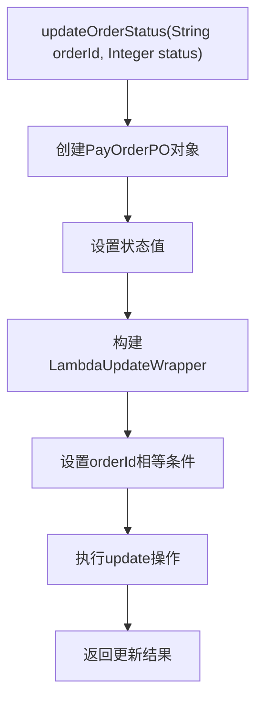
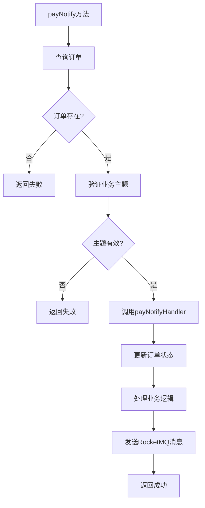
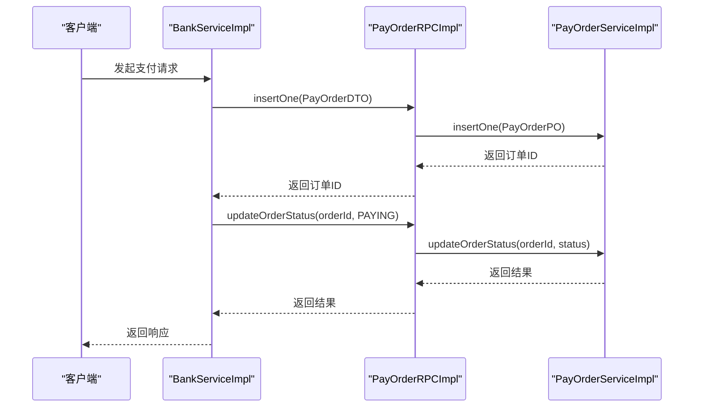
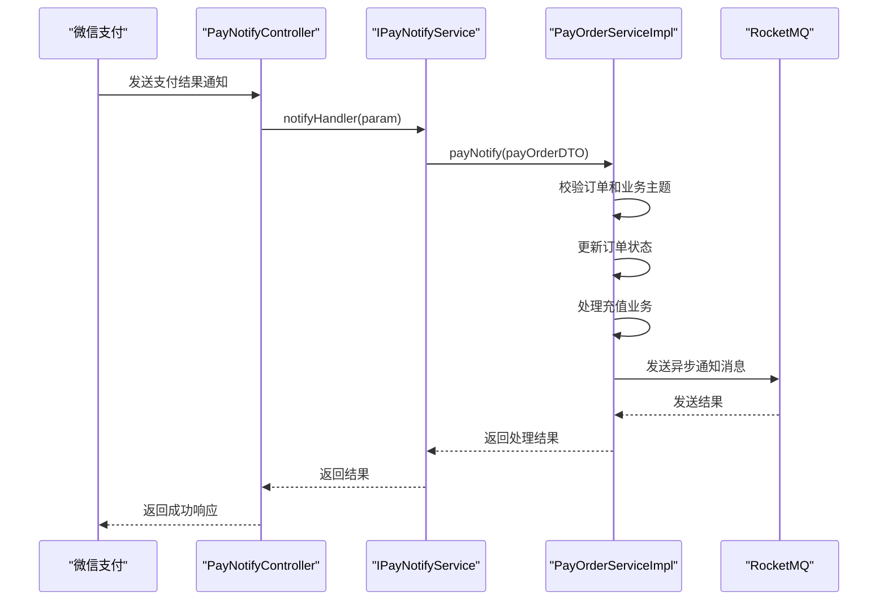

# 支付订单RPC接口

<cite>
**本文档引用的文件**   
- [IPayOrderRPC.java](file://live-bank-interface/src/main/java/com/logilong/live/bank/interfaces/IPayOrderRPC.java)
- [PayOrderRPCImpl.java](file://live-bank-provider/src/main/java/com/logilong/live/bank/provider/rpc/PayOrderRPCImpl.java)
- [PayOrderServiceImpl.java](file://live-bank-provider/src/main/java/com/logilong/live/bank/provider/service/impl/PayOrderServiceImpl.java)
- [PayOrderDTO.java](file://live-bank-interface/src/main/java/com/logilong/live/bank/dto/PayOrderDTO.java)
- [PayOrderPO.java](file://live-bank-provider/src/main/java/com/logilong/live/bank/provider/dao/po/PayOrderPO.java)
- [BankServiceImpl.java](file://live-api/src/main/java/com/logilong/live/api/service/impl/BankServiceImpl.java)
- [PayNotifyController.java](file://live-bank-api/src/main/java/com/logilong/live/bank/api/controller/PayNotifyController.java)
- [OrderStatusEnum.java](file://live-bank-interface/src/main/java/com/logilong/live/bank/constants/OrderStatusEnum.java)
- [PayProductTypeEnum.java](file://live-bank-interface/src/main/java/com/logilong/live/bank/constants/PayProductTypeEnum.java)
</cite>

## 目录
1. [介绍](#介绍)
2. [核心方法详细说明](#核心方法详细说明)
3. [跨服务调用链路分析](#跨服务调用链路分析)
4. [支付回调处理流程](#支付回调处理流程)
5. [异常处理策略](#异常处理策略)

## 介绍
IPayOrderRPC接口是支付系统的核心服务接口，定义了订单创建、状态更新和支付回调处理等关键方法。该接口通过Dubbo框架暴露为远程服务，被多个业务模块引用，实现了支付订单的统一管理和处理。接口位于`live-bank-interface`模块中，由`live-bank-provider`模块提供具体实现，并通过`BankServiceImpl`在API层被调用。

**Section sources**
- [IPayOrderRPC.java](file://live-bank-interface/src/main/java/com/logilong/live/bank/interfaces/IPayOrderRPC.java)

## 核心方法详细说明

### insertOne方法
`insertOne`方法接收`PayOrderDTO`参数并返回订单ID字符串。该方法的业务逻辑如下：在`PayOrderServiceImpl`中，首先生成UUID作为订单号，然后将订单数据持久化到数据库。具体实现中，`PayOrderRPCImpl`作为Dubbo服务实现类，将DTO转换为PO对象后委托给`PayOrderService`进行处理。订单号的生成使用Java标准库的`UUID.randomUUID().toString()`方法，确保全局唯一性。

**Section sources**
- [PayOrderRPCImpl.java](file://live-bank-provider/src/main/java/com/logilong/live/bank/provider/rpc/PayOrderRPCImpl.java#L18-L20)
- [PayOrderServiceImpl.java](file://live-bank-provider/src/main/java/com/logilong/live/bank/provider/service/impl/PayOrderServiceImpl.java#L50-L56)

### updateOrderStatus(Long id, Integer status)方法
该方法基于主键ID更新订单状态，实现了直接通过数据库主键进行更新的机制。在实现中，使用MyBatis-Plus的`LambdaUpdateWrapper`构建更新条件。具体流程为：创建`PayOrderPO`对象设置新状态，然后使用`LambdaUpdateWrapper`指定`id`字段的相等条件，最后通过`update`方法执行数据库更新操作。这种方法避免了全表扫描，提高了更新效率。

**Diagram sources**
- [PayOrderServiceImpl.java](file://live-bank-provider/src/main/java/com/logilong/live/bank/provider/service/impl/PayOrderServiceImpl.java#L58-L64)

**Section sources**
- [PayOrderServiceImpl.java](file://live-bank-provider/src/main/java/com/logilong/live/bank/provider/service/impl/PayOrderServiceImpl.java#L58-L64)

### updateOrderStatus(String orderId, Integer status)方法
这是`updateOrderStatus`的重载方法，通过订单编号更新状态，主要用于外部支付回调后的状态同步场景。该方法的实现同样使用MyBatis-Plus的`LambdaUpdateWrapper`，但查询条件基于`orderId`字段。这种设计使得系统能够通过外部系统提供的订单号进行状态更新，而不需要知道数据库的主键ID，提高了接口的灵活性和可用性。

**Diagram sources**
- [PayOrderServiceImpl.java](file://live-bank-provider/src/main/java/com/logilong/live/bank/provider/service/impl/PayOrderServiceImpl.java#L66-L73)

**Section sources**
- [PayOrderServiceImpl.java](file://live-bank-provider/src/main/java/com/logilong/live/bank/provider/service/impl/PayOrderServiceImpl.java#L66-L73)

### payNotify方法
`payNotify`方法处理微信支付回调的核心流程，包含订单校验、业务主题验证、业务处理和异步通知等多个步骤。首先通过订单ID查询订单是否存在，然后验证业务主题的有效性，接着调用`payNotifyHandler`进行具体的业务处理（如虚拟币充值），最后通过RocketMQ发送异步通知消息给相关服务。该方法确保了支付回调的安全性和可靠性。

**Diagram sources**
- [PayOrderServiceImpl.java](file://live-bank-provider/src/main/java/com/logilong/live/bank/provider/service/impl/PayOrderServiceImpl.java#L76-L106)

**Section sources**
- [PayOrderServiceImpl.java](file://live-bank-provider/src/main/java/com/logilong/live/bank/provider/service/impl/PayOrderServiceImpl.java#L76-L106)

## 跨服务调用链路分析
IPayOrderRPC接口的调用链路涉及多个服务模块。`BankServiceImpl`通过Dubbo的`@DubboReference`注解引用`IPayOrderRPC`服务，实现了跨服务调用。当用户发起支付请求时，API层的`BankServiceImpl`首先调用`insertOne`创建订单，然后在支付过程中调用`updateOrderStatus`更新状态。这种设计实现了服务解耦，使得支付逻辑可以独立演进和部署。

**Diagram sources**
- [BankServiceImpl.java](file://live-api/src/main/java/com/logilong/live/api/service/impl/BankServiceImpl.java#L37-L78)
- [PayOrderRPCImpl.java](file://live-bank-provider/src/main/java/com/logilong/live/bank/provider/rpc/PayOrderRPCImpl.java)

**Section sources**
- [BankServiceImpl.java](file://live-api/src/main/java/com/logilong/live/api/service/impl/BankServiceImpl.java)
- [PayOrderRPCImpl.java](file://live-bank-provider/src/main/java/com/logilong/live/bank/provider/rpc/PayOrderRPCImpl.java)

## 支付回调处理流程
微信支付回调的完整处理流程从`PayNotifyController`开始，经过`IPayNotifyService`处理，最终调用`payNotify`方法完成订单状态更新和业务处理。`PayNotifyController`接收HTTP POST请求，提取参数后委托给服务层处理。整个流程确保了外部支付结果能够安全、可靠地同步到系统内部，同时通过异步消息机制解耦了核心支付逻辑和后续业务处理。

**Diagram sources**
- [PayNotifyController.java](file://live-bank-api/src/main/java/com/logilong/live/bank/api/controller/PayNotifyController.java)
- [PayOrderServiceImpl.java](file://live-bank-provider/src/main/java/com/logilong/live/bank/provider/service/impl/PayOrderServiceImpl.java)

**Section sources**
- [PayNotifyController.java](file://live-bank-api/src/main/java/com/logilong/live/bank/api/controller/PayNotifyController.java)
- [PayOrderServiceImpl.java](file://live-bank-provider/src/main/java/com/logilong/live/bank/provider/service/impl/PayOrderServiceImpl.java)

## 异常处理策略
系统在处理支付相关操作时采用了多层次的异常处理策略。在`payNotify`方法中，对订单不存在或业务主题无效的情况直接返回false，避免了异常的抛出，确保了外部回调接口的稳定性。日志记录使用SLF4J框架，在关键步骤记录错误信息，便于问题排查。对于RocketMQ消息发送失败的情况，虽然捕获了异常并记录日志，但仍然返回true，保证了支付回调流程的最终成功，体现了支付系统对一致性的重视。

**Section sources**
- [PayOrderServiceImpl.java](file://live-bank-provider/src/main/java/com/logilong/live/bank/provider/service/impl/PayOrderServiceImpl.java#L79-L104)