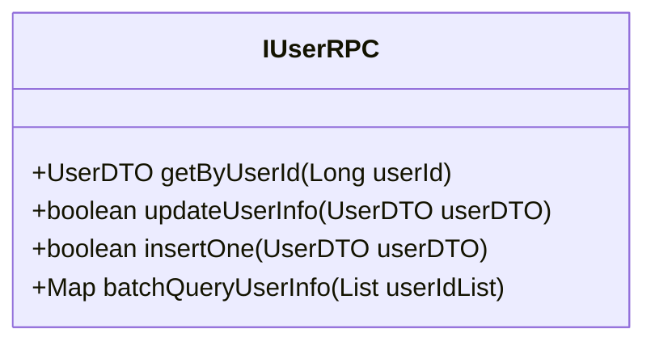
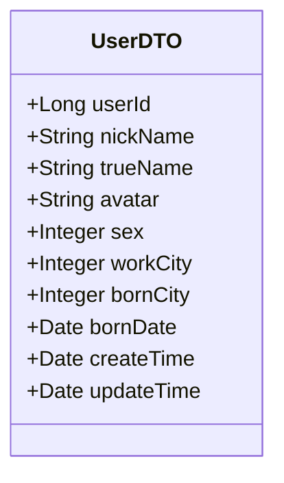
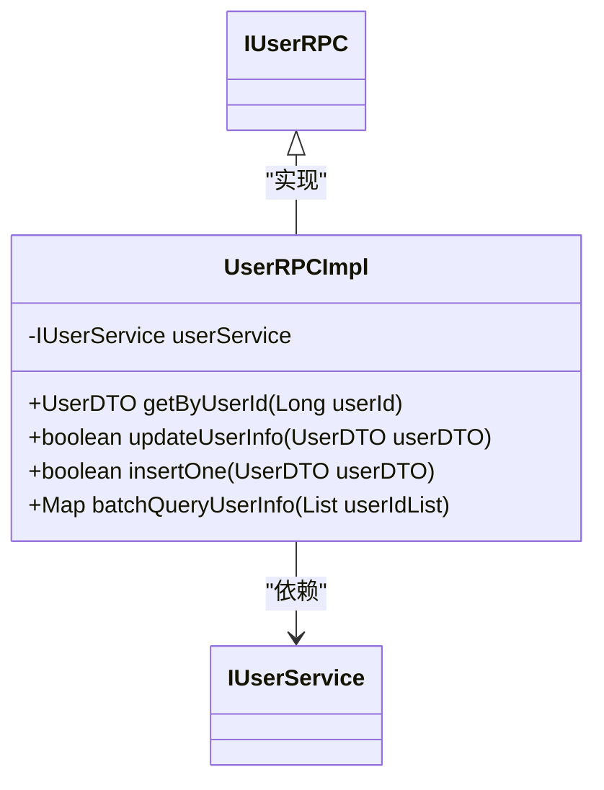
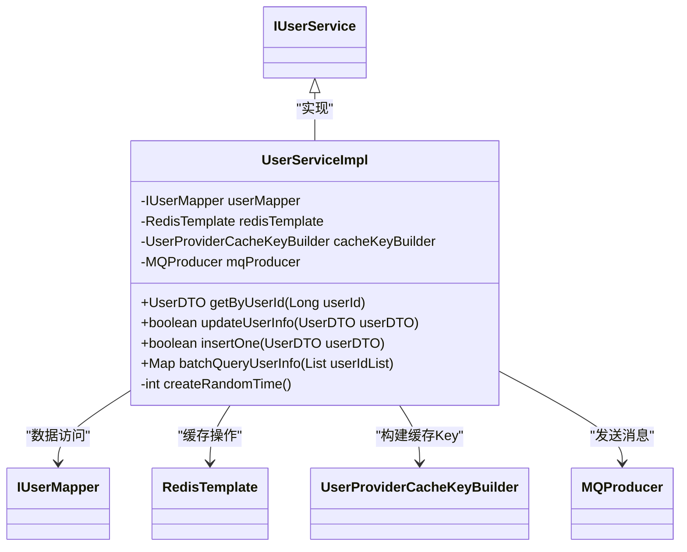
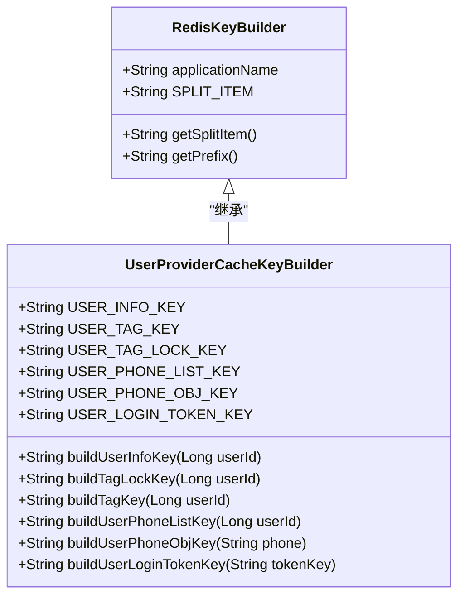
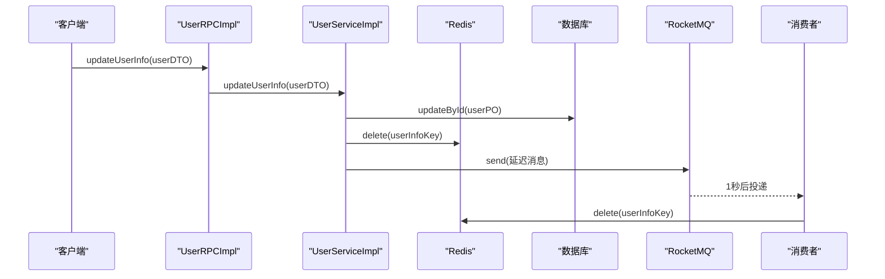
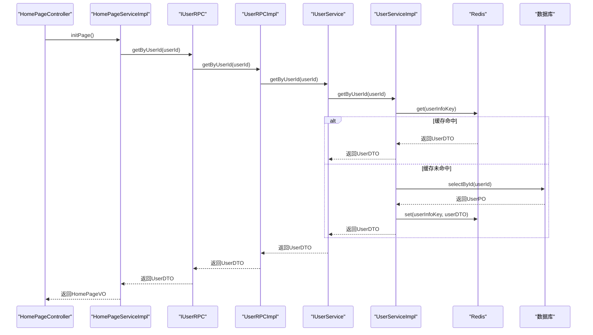

# 用户信息RPC接口

<cite>
**本文档引用的文件**
- [IUserRPC.java](file://live-user-interface/src/main/java/com/logilong/live/user/interfaces/IUserRPC.java)
- [UserDTO.java](file://live-user-interface/src/main/java/com/logilong/live/user/dto/UserDTO.java)
- [UserRPCImpl.java](file://live-user-provider/src/main/java/com/logilong/live/user/provider/rpc/UserRPCImpl.java)
- [UserServiceImpl.java](file://live-user-provider/src/main/java/com/logilong/live/user/provider/service/impl/UserServiceImpl.java)
- [UserProviderCacheKeyBuilder.java](file://live-framework/live-framework-redis-starter/src/main/java/com/logilong/live/framework/redis/starter/key/UserProviderCacheKeyBuilder.java)
- [RedisKeyBuilder.java](file://live-framework/live-framework-redis-starter/src/main/java/com/logilong/live/framework/redis/starter/key/RedisKeyBuilder.java)
- [IUserService.java](file://live-user-provider/src/main/java/com/logilong/live/user/provider/service/IUserService.java)
- [CacheAsyncDeleteCode.java](file://live-user-interface/src/main/java/com/logilong/live/user/constants/CacheAsyncDeleteCode.java)
- [UserCacheAsyncDeleteDTO.java](file://live-user-interface/src/main/java/com/logilong/live/user/dto/UserCacheAsyncDeleteDTO.java)
- [UserProviderTopicNames.java](file://live-common-interface/src/main/java/com/logilong/live/common/interfaces/topic/UserProviderTopicNames.java)
- [RocketMQConsumerConfig.java](file://live-user-provider/src/main/java/com/logilong/live/user/provider/consumer/RocketMQConsumerConfig.java)
- [HomePageServiceImpl.java](file://live-api/src/main/java/com/logilong/live/api/service/impl/HomePageServiceImpl.java)
- [LivingRoomServiceImpl.java](file://live-api/src/main/java/com/logilong/live/api/service/impl/LivingRoomServiceImpl.java)
</cite>

## 目录
1. [简介](#简介)
2. [核心接口定义](#核心接口定义)
3. [数据传输对象（DTO）](#数据传输对象dto)
4. [RPC层实现](#rpC层实现)
5. [服务层实现](#服务层实现)
6. [缓存策略](#缓存策略)
7. [数据库一致性保障机制](#数据库一致性保障机制)
8. [调用关系分析](#调用关系分析)
9. [使用示例](#使用示例)
10. [异常处理建议](#异常处理建议)

## 简介
本文档全面记录了用户信息RPC接口的实现与使用。详细说明了`getByUserId`、`updateUserInfo`、`insertOne`和`batchQueryUserInfo`四个核心方法的功能与调用场景。深入解析了`UserDTO`中`userId`、`nickName`、`avatar`、`sex`等字段的业务含义及序列化机制。结合`UserRPCImpl`和`UserServiceImpl`的实现，阐述了服务层与RPC层的调用关系，以及缓存策略（如Redis缓存Key构建`UserProviderCacheKeyBuilder`）和数据库一致性保障机制。提供了各接口的调用示例和异常处理建议。

**Section sources**
- [IUserRPC.java](file://live-user-interface/src/main/java/com/logilong/live/user/interfaces/IUserRPC.java#L8-L42)
- [UserDTO.java](file://live-user-interface/src/main/java/com/logilong/live/user/dto/UserDTO.java#L10-L25)

## 核心接口定义
`IUserRPC`接口定义了用户信息管理的核心RPC方法，位于`live-user-interface`模块中，为其他服务提供统一的远程调用契约。



**Diagram sources**
- [IUserRPC.java](file://live-user-interface/src/main/java/com/logilong/live/user/interfaces/IUserRPC.java#L8-L42)

**Section sources**
- [IUserRPC.java](file://live-user-interface/src/main/java/com/logilong/live/user/interfaces/IUserRPC.java#L8-L42)

## 数据传输对象（DTO）
`UserDTO`是用户信息的数据传输对象，用于在RPC调用中序列化和反序列化用户数据。



**Diagram sources**
- [UserDTO.java](file://live-user-interface/src/main/java/com/logilong/live/user/dto/UserDTO.java#L10-L25)

**Section sources**
- [UserDTO.java](file://live-user-interface/src/main/java/com/logilong/live/user/dto/UserDTO.java#L10-L25)

## RPC层实现
`UserRPCImpl`是`IUserRPC`接口的具体实现，作为Dubbo服务提供者，负责接收远程调用并委托给服务层处理。



**Diagram sources**
- [UserRPCImpl.java](file://live-user-provider/src/main/java/com/logilong/live/user/provider/rpc/UserRPCImpl.java#L14-L38)
- [IUserService.java](file://live-user-provider/src/main/java/com/logilong/live/user/provider/service/IUserService.java#L9-L41)

**Section sources**
- [UserRPCImpl.java](file://live-user-provider/src/main/java/com/logilong/live/user/provider/rpc/UserRPCImpl.java#L14-L38)

## 服务层实现
`UserServiceImpl`是用户信息业务逻辑的核心实现，包含了缓存、数据库操作和消息队列等复杂逻辑。



**Diagram sources**
- [UserServiceImpl.java](file://live-user-provider/src/main/java/com/logilong/live/user/provider/service/impl/UserServiceImpl.java#L31-L156)

**Section sources**
- [UserServiceImpl.java](file://live-user-provider/src/main/java/com/logilong/live/user/provider/service/impl/UserServiceImpl.java#L31-L156)

## 缓存策略
系统采用Redis作为缓存层，通过`UserProviderCacheKeyBuilder`构建缓存Key，并实现了高效的缓存读取和写入策略。



**Diagram sources**
- [UserProviderCacheKeyBuilder.java](file://live-framework/live-framework-redis-starter/src/main/java/com/logilong/live/framework/redis/starter/key/UserProviderCacheKeyBuilder.java#L12-L45)
- [RedisKeyBuilder.java](file://live-framework/live-framework-redis-starter/src/main/java/com/logilong/live/framework/redis/starter/key/RedisKeyBuilder.java#L8-L21)

**Section sources**
- [UserProviderCacheKeyBuilder.java](file://live-framework/live-framework-redis-starter/src/main/java/com/logilong/live/framework/redis/starter/key/UserProviderCacheKeyBuilder.java#L12-L45)
- [UserServiceImpl.java](file://live-user-provider/src/main/java/com/logilong/live/user/provider/service/impl/UserServiceImpl.java#L39-L57)

## 数据库一致性保障机制
系统通过缓存双删策略和RocketMQ延迟消息机制，确保数据库与缓存的一致性。



**Diagram sources**
- [UserServiceImpl.java](file://live-user-provider/src/main/java/com/logilong/live/user/provider/service/impl/UserServiceImpl.java#L61-L85)
- [RocketMQConsumerConfig.java](file://live-user-provider/src/main/java/com/logilong/live/user/provider/consumer/RocketMQConsumerConfig.java#L37-L52)

**Section sources**
- [UserServiceImpl.java](file://live-user-provider/src/main/java/com/logilong/live/user/provider/service/impl/UserServiceImpl.java#L61-L85)
- [RocketMQConsumerConfig.java](file://live-user-provider/src/main/java/com/logilong/live/user/provider/consumer/RocketMQConsumerConfig.java#L26-L52)
- [CacheAsyncDeleteCode.java](file://live-user-interface/src/main/java/com/logilong/live/user/constants/CacheAsyncDeleteCode.java#L10-L17)
- [UserCacheAsyncDeleteDTO.java](file://live-user-interface/src/main/java/com/logilong/live/user/dto/UserCacheAsyncDeleteDTO.java#L9-L18)
- [UserProviderTopicNames.java](file://live-common-interface/src/main/java/com/logilong/live/common/interfaces/topic/UserProviderTopicNames.java#L4-L9)

## 调用关系分析
以下序列图展示了从API层到用户服务层的完整调用链路。



**Diagram sources**
- [HomePageServiceImpl.java](file://live-api/src/main/java/com/logilong/live/api/service/impl/HomePageServiceImpl.java#L22-L33)
- [UserRPCImpl.java](file://live-user-provider/src/main/java/com/logilong/live/user/provider/rpc/UserRPCImpl.java#L20-L22)
- [UserServiceImpl.java](file://live-user-provider/src/main/java/com/logilong/live/user/provider/service/impl/UserServiceImpl.java#L44-L57)

**Section sources**
- [HomePageServiceImpl.java](file://live-api/src/main/java/com/logilong/live/api/service/impl/HomePageServiceImpl.java#L22-L33)
- [LivingRoomServiceImpl.java](file://live-api/src/main/java/com/logilong/live/api/service/impl/LivingRoomServiceImpl.java#L88-L110)

## 使用示例
以下是`IUserRPC`接口的典型使用场景：

### 单个用户信息查询
```java
// 在HomePageServiceImpl中使用
UserDTO userDTO = userRPC.getByUserId(userId);
```

### 批量用户信息查询
```java
// 在LivingRoomServiceImpl中使用
Map<Long, UserDTO> userDTOMap = userRPC.batchQueryUserInfo(
    Arrays.asList(anchorId, userId).stream().distinct().collect(Collectors.toList())
);
```

### 用户信息更新
```java
// 更新用户信息
UserDTO userDTO = new UserDTO();
userDTO.setUserId(123L);
userDTO.setNickName("新昵称");
userDTO.setAvatar("new_avatar_url");
boolean success = userRPC.updateUserInfo(userDTO);
```

**Section sources**
- [HomePageServiceImpl.java](file://live-api/src/main/java/com/logilong/live/api/service/impl/HomePageServiceImpl.java#L23-L28)
- [LivingRoomServiceImpl.java](file://live-api/src/main/java/com/logilong/live/api/service/impl/LivingRoomServiceImpl.java#L91-L93)
- [UserRPCImpl.java](file://live-user-provider/src/main/java/com/logilong/live/user/provider/rpc/UserRPCImpl.java#L25-L27)

## 异常处理建议
1. **参数校验**：在调用`getByUserId`、`updateUserInfo`等方法前，应确保`userId`不为null。
2. **缓存穿透**：`getByUserId`方法已处理缓存穿透，当数据库查询结果为null时不会缓存。
3. **批量查询优化**：`batchQueryUserInfo`方法对id<=10000的数据进行了过滤，避免查询无效数据。
4. **数据库一致性**：`updateUserInfo`方法采用"先更新数据库，再删除缓存"的策略，并通过延迟消息进行二次删除，防止并发场景下的数据不一致。
5. **异常捕获**：`updateUserInfo`方法中对MQ发送异常进行了捕获并抛出运行时异常，确保事务的完整性。

**Section sources**
- [UserServiceImpl.java](file://live-user-provider/src/main/java/com/logilong/live/user/provider/service/impl/UserServiceImpl.java#L44-L57)
- [UserServiceImpl.java](file://live-user-provider/src/main/java/com/logilong/live/user/provider/service/impl/UserServiceImpl.java#L61-L85)
- [UserServiceImpl.java](file://live-user-provider/src/main/java/com/logilong/live/user/provider/service/impl/UserServiceImpl.java#L98-L106)