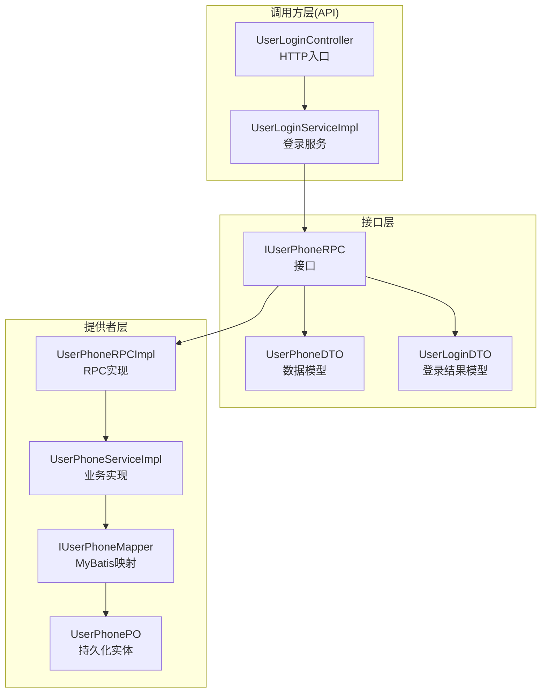
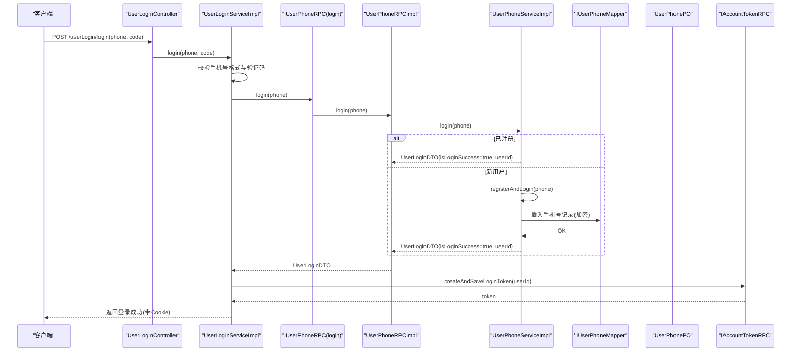
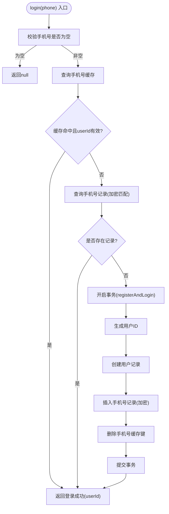
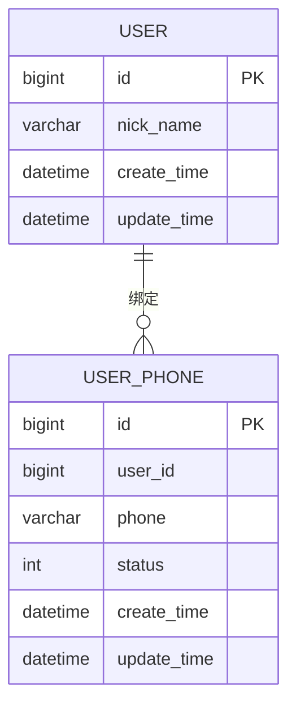
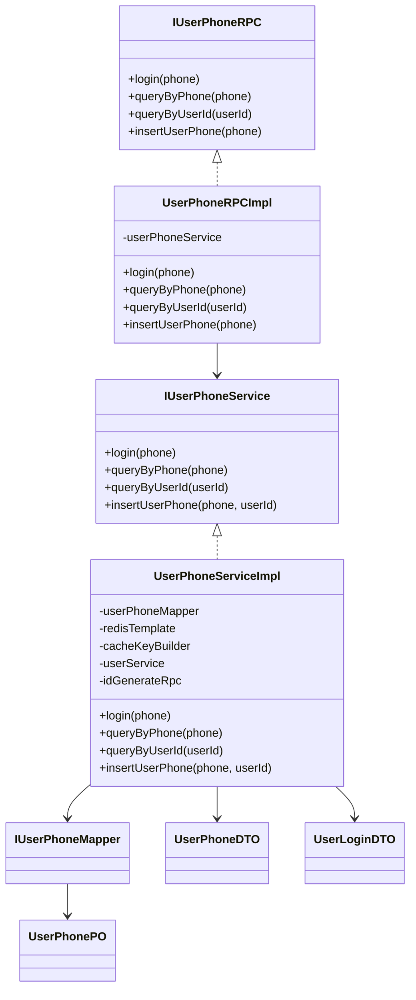

# 用户手机号RPC接口

<cite>
**本文引用的文件列表**
- [IUserPhoneRPC.java](file://live-user-interface/src/main/java/com/logilong/live/user/interfaces/IUserPhoneRPC.java)
- [UserPhoneRPCImpl.java](file://live-user-provider/src/main/java/com/logilong/live/user/provider/rpc/UserPhoneRPCImpl.java)
- [IUserPhoneService.java](file://live-user-provider/src/main/java/com/logilong/live/user/provider/service/IUserPhoneService.java)
- [UserPhoneServiceImpl.java](file://live-user-provider/src/main/java/com/logilong/live/user/provider/service/impl/UserPhoneServiceImpl.java)
- [IUserPhoneMapper.java](file://live-user-provider/src/main/java/com/logilong/live/user/provider/dao/mapper/IUserPhoneMapper.java)
- [UserPhonePO.java](file://live-user-provider/src/main/java/com/logilong/live/user/provider/dao/po/UserPhonePO.java)
- [UserPhoneDTO.java](file://live-user-interface/src/main/java/com/logilong/live/user/dto/UserPhoneDTO.java)
- [UserLoginDTO.java](file://live-user-interface/src/main/java/com/logilong/live/user/dto/UserLoginDTO.java)
- [UserLoginController.java](file://live-api/src/main/java/com/logilong/live/api/controller/UserLoginController.java)
- [UserLoginServiceImpl.java](file://live-api/src/main/java/com/logilong/live/api/service/impl/UserLoginServiceImpl.java)
</cite>

## 目录
1. [简介](#简介)
2. [项目结构](#项目结构)
3. [核心组件](#核心组件)
4. [架构总览](#架构总览)
5. [详细组件分析](#详细组件分析)
6. [依赖关系分析](#依赖关系分析)
7. [性能与并发特性](#性能与并发特性)
8. [故障排查指南](#故障排查指南)
9. [结论](#结论)

## 简介
本文件系统化梳理用户手机号RPC接口的功能与实现，重点围绕以下目标展开：
- 全面记录 IUserPhoneRPC 接口能力：login、queryByPhone、queryByUserId、insertUserPhone 四个方法的职责与行为边界。
- 深入解析 login 方法的双重作用：作为“用户登录”入口，同时承担“新用户手机号注册”的原子性操作。
- 解释 queryByPhone 与 queryByUserId 在用户身份识别与信息关联中的应用方式。
- 分析 insertUserPhone 的使用场景与数据校验逻辑（含加密策略）。
- 结合 UserPhoneDTO 与 UserLoginDTO 的数据结构，阐明手机号与用户账户的绑定关系。
- 总结实现类在高并发登录请求下的性能优化措施与幂等性保障机制。

## 项目结构
用户手机号相关能力分布在三层：
- 接口层（Interface）：定义对外暴露的 RPC 接口与 DTO 数据模型。
- 提供者层（Provider）：实现 RPC 接口，封装业务逻辑、缓存与数据库交互。
- 调用方层（API）：前端或网关侧服务，负责参数校验与调用 RPC。

图表来源
- [IUserPhoneRPC.java](file://live-user-interface/src/main/java/com/logilong/live/user/interfaces/IUserPhoneRPC.java#L1-L30)
- [UserPhoneRPCImpl.java](file://live-user-provider/src/main/java/com/logilong/live/user/provider/rpc/UserPhoneRPCImpl.java#L1-L40)
- [IUserPhoneService.java](file://live-user-provider/src/main/java/com/logilong/live/user/provider/service/IUserPhoneService.java#L1-L36)
- [UserPhoneServiceImpl.java](file://live-user-provider/src/main/java/com/logilong/live/user/provider/service/impl/UserPhoneServiceImpl.java#L1-L182)
- [IUserPhoneMapper.java](file://live-user-provider/src/main/java/com/logilong/live/user/provider/dao/mapper/IUserPhoneMapper.java#L1-L11)
- [UserPhonePO.java](file://live-user-provider/src/main/java/com/logilong/live/user/provider/dao/po/UserPhonePO.java#L1-L23)
- [UserPhoneDTO.java](file://live-user-interface/src/main/java/com/logilong/live/user/dto/UserPhoneDTO.java#L1-L21)
- [UserLoginDTO.java](file://live-user-interface/src/main/java/com/logilong/live/user/dto/UserLoginDTO.java#L1-L32)
- [UserLoginController.java](file://live-api/src/main/java/com/logilong/live/api/controller/UserLoginController.java#L1-L32)
- [UserLoginServiceImpl.java](file://live-api/src/main/java/com/logilong/live/api/service/impl/UserLoginServiceImpl.java#L1-L88)

章节来源
- [IUserPhoneRPC.java](file://live-user-interface/src/main/java/com/logilong/live/user/interfaces/IUserPhoneRPC.java#L1-L30)
- [UserPhoneRPCImpl.java](file://live-user-provider/src/main/java/com/logilong/live/user/provider/rpc/UserPhoneRPCImpl.java#L1-L40)
- [UserPhoneServiceImpl.java](file://live-user-provider/src/main/java/com/logilong/live/user/provider/service/impl/UserPhoneServiceImpl.java#L1-L182)
- [UserLoginController.java](file://live-api/src/main/java/com/logilong/live/api/controller/UserLoginController.java#L1-L32)
- [UserLoginServiceImpl.java](file://live-api/src/main/java/com/logilong/live/api/service/impl/UserLoginServiceImpl.java#L1-L88)

## 核心组件
- IUserPhoneRPC：对外暴露的手机号相关RPC接口，包含登录、查询手机号、按用户ID查询、新增手机号四类操作。
- UserPhoneRPCImpl：基于 Dubbo 的 RPC 实现，直接委托 IUserPhoneService 执行具体逻辑。
- IUserPhoneService / UserPhoneServiceImpl：核心业务实现，负责登录原子性（注册+登录）、缓存策略、数据库读写、手机号加解密。
- IUserPhoneMapper / UserPhonePO：MyBatis 映射与持久化实体，承载 t_user_phone 表的读写。
- UserPhoneDTO / UserLoginDTO：数据传输对象，描述手机号与用户绑定关系及登录结果。

章节来源
- [IUserPhoneRPC.java](file://live-user-interface/src/main/java/com/logilong/live/user/interfaces/IUserPhoneRPC.java#L1-L30)
- [UserPhoneRPCImpl.java](file://live-user-provider/src/main/java/com/logilong/live/user/provider/rpc/UserPhoneRPCImpl.java#L1-L40)
- [IUserPhoneService.java](file://live-user-provider/src/main/java/com/logilong/live/user/provider/service/IUserPhoneService.java#L1-L36)
- [UserPhoneServiceImpl.java](file://live-user-provider/src/main/java/com/logilong/live/user/provider/service/impl/UserPhoneServiceImpl.java#L1-L182)
- [IUserPhoneMapper.java](file://live-user-provider/src/main/java/com/logilong/live/user/provider/dao/mapper/IUserPhoneMapper.java#L1-L11)
- [UserPhonePO.java](file://live-user-provider/src/main/java/com/logilong/live/user/provider/dao/po/UserPhonePO.java#L1-L23)
- [UserPhoneDTO.java](file://live-user-interface/src/main/java/com/logilong/live/user/dto/UserPhoneDTO.java#L1-L21)
- [UserLoginDTO.java](file://live-user-interface/src/main/java/com/logilong/live/user/dto/UserLoginDTO.java#L1-L32)

## 架构总览
登录流程从 HTTP 控制器进入，经由登录服务校验验证码后，调用 IUserPhoneRPC.login 完成手机号登录/注册一体化操作；随后通过账号令牌RPC生成并下发登录令牌。

图表来源
- [UserLoginController.java](file://live-api/src/main/java/com/logilong/live/api/controller/UserLoginController.java#L1-L32)
- [UserLoginServiceImpl.java](file://live-api/src/main/java/com/logilong/live/api/service/impl/UserLoginServiceImpl.java#L1-L88)
- [IUserPhoneRPC.java](file://live-user-interface/src/main/java/com/logilong/live/user/interfaces/IUserPhoneRPC.java#L1-L30)
- [UserPhoneRPCImpl.java](file://live-user-provider/src/main/java/com/logilong/live/user/provider/rpc/UserPhoneRPCImpl.java#L1-L40)
- [UserPhoneServiceImpl.java](file://live-user-provider/src/main/java/com/logilong/live/user/provider/service/impl/UserPhoneServiceImpl.java#L1-L182)
- [IUserPhoneMapper.java](file://live-user-provider/src/main/java/com/logilong/live/user/provider/dao/mapper/IUserPhoneMapper.java#L1-L11)
- [UserPhonePO.java](file://live-user-provider/src/main/java/com/logilong/live/user/provider/dao/po/UserPhonePO.java#L1-L23)

## 详细组件分析

### IUserPhoneRPC 接口能力
- login(phone): 用户登录入口，内部完成“已注册用户直接登录”与“未注册用户自动注册并登录”的原子性操作。
- queryByPhone(phone): 根据手机号查询用户绑定信息，返回 UserPhoneDTO。
- queryByUserId(userId): 根据用户ID查询其手机号信息列表，返回 List<UserPhoneDTO>。
- insertUserPhone(phone): 新增手机号记录（不返回用户ID时由内部生成），用于预绑定或批量导入等场景。

章节来源
- [IUserPhoneRPC.java](file://live-user-interface/src/main/java/com/logilong/live/user/interfaces/IUserPhoneRPC.java#L1-L30)

### UserPhoneRPCImpl 实现
- 将 IUserPhoneRPC 的四个方法直接委托给 IUserPhoneService，保持接口与实现的清晰分离。
- insertUserPhone(phone) 内部调用 IUserPhoneService.insertUserPhone(phone, null)，实现“无用户ID”的新增。

章节来源
- [UserPhoneRPCImpl.java](file://live-user-provider/src/main/java/com/logilong/live/user/provider/rpc/UserPhoneRPCImpl.java#L1-L40)

### IUserPhoneService / UserPhoneServiceImpl 核心逻辑

#### login(phone) 双重作用与原子性
- 输入校验：对空手机号进行快速返回。
- 查询已注册：若手机号存在，直接返回登录成功与 userId。
- 新用户注册+登录：若不存在，通过分布式ID生成 userId，创建用户记录，插入手机号记录（加密存储），清理空值缓存键，返回登录成功。
- 并发保护：registerAndLogin 使用事务，保证“创建用户 + 插入手机号”原子性；同时在插入后主动删除对应手机号缓存键，避免脏读。

图表来源
- [UserPhoneServiceImpl.java](file://live-user-provider/src/main/java/com/logilong/live/user/provider/service/impl/UserPhoneServiceImpl.java#L50-L120)
- [UserPhoneServiceImpl.java](file://live-user-provider/src/main/java/com/logilong/live/user/provider/service/impl/UserPhoneServiceImpl.java#L120-L182)

章节来源
- [IUserPhoneService.java](file://live-user-provider/src/main/java/com/logilong/live/user/provider/service/IUserPhoneService.java#L1-L36)
- [UserPhoneServiceImpl.java](file://live-user-provider/src/main/java/com/logilong/live/user/provider/service/impl/UserPhoneServiceImpl.java#L50-L120)
- [UserPhoneServiceImpl.java](file://live-user-provider/src/main/java/com/logilong/live/user/provider/service/impl/UserPhoneServiceImpl.java#L120-L182)

#### queryByPhone(phone) 身份识别与缓存策略
- 输入校验：空手机号直接返回 null。
- 缓存优先：命中则返回；命中但 userId 为空表示“空值缓存”，返回 null。
- 缓存缺失：查询数据库，命中后解密手机号字段并写入缓存；未命中写入空值缓存（短期过期）防止缓存穿透。
- 解密策略：返回前对 phone 字段执行解密，确保上层拿到明文手机号。

章节来源
- [UserPhoneServiceImpl.java](file://live-user-provider/src/main/java/com/logilong/live/user/provider/service/impl/UserPhoneServiceImpl.java#L107-L158)

#### queryByUserId(userId) 信息关联
- 输入校验：非法 userId 直接返回空列表。
- 缓存优先：命中则判断首个元素 userId 是否为空（空值缓存），决定返回空列表或解析列表。
- 缓存缺失：查询数据库（按用户ID与有效状态过滤），命中后对每个记录解密手机号并写入列表缓存；未命中写入空值缓存。
- 关联意义：用于“用户维度”展示其绑定的手机号集合，便于后续扩展多手机号或多设备绑定场景。

章节来源
- [UserPhoneServiceImpl.java](file://live-user-provider/src/main/java/com/logilong/live/user/provider/service/impl/UserPhoneServiceImpl.java#L133-L181)

#### insertUserPhone(phone, userId) 使用场景与校验
- 使用场景：预绑定、批量导入、外部系统同步等。
- 参数校验：当 userId 为空时，内部通过分布式ID生成器获取新用户ID。
- 数据安全：手机号入库前进行加密存储；返回前解密用于缓存与返回。
- 原子性：插入操作独立于登录流程，但同样遵循统一的加密与状态管理策略。

章节来源
- [UserPhoneServiceImpl.java](file://live-user-provider/src/main/java/com/logilong/live/user/provider/service/impl/UserPhoneServiceImpl.java#L97-L105)
- [UserPhoneServiceImpl.java](file://live-user-provider/src/main/java/com/logilong/live/user/provider/service/impl/UserPhoneServiceImpl.java#L171-L180)

### 数据模型与绑定关系

- 绑定关系：UserPhonePO 中的 userId 指向用户表主键，形成“用户-手机号”一对多或一对一的绑定关系。
- 加密策略：手机号入库前加密，返回前解密，兼顾安全与易用。
- 状态管理：通过 status 字段标识有效/无效，查询时默认仅取有效记录。

图表来源
- [UserPhonePO.java](file://live-user-provider/src/main/java/com/logilong/live/user/provider/dao/po/UserPhonePO.java#L1-L23)
- [IUserPhoneMapper.java](file://live-user-provider/src/main/java/com/logilong/live/user/provider/dao/mapper/IUserPhoneMapper.java#L1-L11)
- [UserPhoneServiceImpl.java](file://live-user-provider/src/main/java/com/logilong/live/user/provider/service/impl/UserPhoneServiceImpl.java#L171-L180)

章节来源
- [UserPhoneDTO.java](file://live-user-interface/src/main/java/com/logilong/live/user/dto/UserPhoneDTO.java#L1-L21)
- [UserPhonePO.java](file://live-user-provider/src/main/java/com/logilong/live/user/provider/dao/po/UserPhonePO.java#L1-L23)

## 依赖关系分析

图表来源
- [IUserPhoneRPC.java](file://live-user-interface/src/main/java/com/logilong/live/user/interfaces/IUserPhoneRPC.java#L1-L30)
- [UserPhoneRPCImpl.java](file://live-user-provider/src/main/java/com/logilong/live/user/provider/rpc/UserPhoneRPCImpl.java#L1-L40)
- [IUserPhoneService.java](file://live-user-provider/src/main/java/com/logilong/live/user/provider/service/IUserPhoneService.java#L1-L36)
- [UserPhoneServiceImpl.java](file://live-user-provider/src/main/java/com/logilong/live/user/provider/service/impl/UserPhoneServiceImpl.java#L1-L182)
- [IUserPhoneMapper.java](file://live-user-provider/src/main/java/com/logilong/live/user/provider/dao/mapper/IUserPhoneMapper.java#L1-L11)
- [UserPhonePO.java](file://live-user-provider/src/main/java/com/logilong/live/user/provider/dao/po/UserPhonePO.java#L1-L23)
- [UserPhoneDTO.java](file://live-user-interface/src/main/java/com/logilong/live/user/dto/UserPhoneDTO.java#L1-L21)
- [UserLoginDTO.java](file://live-user-interface/src/main/java/com/logilong/live/user/dto/UserLoginDTO.java#L1-L32)

## 性能与并发特性
- 缓存策略
  - 对 queryByPhone 采用“对象缓存 + 空值缓存”：命中直接返回；未命中写入空值缓存（短期过期），防止缓存穿透。
  - 对 queryByUserId 采用“列表缓存 + 空值缓存”：命中直接返回；未命中写入空值缓存，减少数据库压力。
  - 返回前对 phone 字段解密，确保上层拿到明文手机号，避免重复解密。
- 加密与解密
  - 入库前加密，入库后解密，兼顾安全性与可读性。
- 事务保障
  - registerAndLogin 使用事务，确保“创建用户 + 插入手机号”原子性，异常时回滚并记录日志。
- 并发优化
  - 登录入口先查缓存再查库，降低热点手机号的数据库压力。
  - 插入后主动删除手机号缓存键，避免脏读。
  - 短期空值缓存窗口内，后续请求可直接命中空值缓存，进一步缓解缓存穿透风险。

章节来源
- [UserPhoneServiceImpl.java](file://live-user-provider/src/main/java/com/logilong/live/user/provider/service/impl/UserPhoneServiceImpl.java#L50-L120)
- [UserPhoneServiceImpl.java](file://live-user-provider/src/main/java/com/logilong/live/user/provider/service/impl/UserPhoneServiceImpl.java#L120-L182)

## 故障排查指南
- 登录失败
  - 检查验证码校验是否通过：UserLoginServiceImpl.login 中对验证码进行校验，失败直接返回业务错误。
  - 检查 IUserPhoneRPC.login 返回值：isLoginSuccess=false 时需定位到 UserPhoneServiceImpl 的注册流程或事务回滚原因。
- 缓存穿透
  - 若 queryByPhone 返回 null，确认是否命中空值缓存键；可通过缓存键构建工具定位。
- 数据一致性
  - registerAndLogin 抛出异常会触发事务回滚，检查日志中“用户注册登录失败”的异常堆栈。
- 安全问题
  - 确认手机号入库前已加密，返回前已解密；避免明文泄露。

章节来源
- [UserLoginServiceImpl.java](file://live-api/src/main/java/com/logilong/live/api/service/impl/UserLoginServiceImpl.java#L50-L88)
- [UserPhoneServiceImpl.java](file://live-user-provider/src/main/java/com/logilong/live/user/provider/service/impl/UserPhoneServiceImpl.java#L60-L90)

## 结论
IUserPhoneRPC 通过 login 的双重作用，将“用户登录”与“新用户手机号注册”整合为一次原子性操作，简化了调用方逻辑并提升了用户体验。配合完善的缓存策略、加解密与事务保障，实现了高并发场景下的高性能与强一致。queryByPhone 与 queryByUserId 为用户身份识别与信息关联提供了稳定支撑；insertUserPhone 则满足了预绑定与批量导入等扩展需求。整体设计在安全、性能与可维护性之间取得良好平衡。