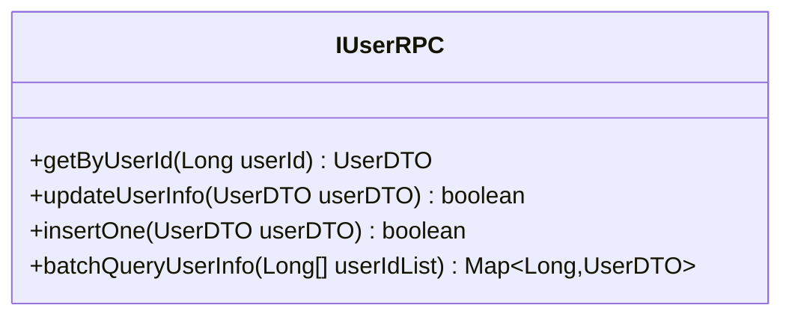
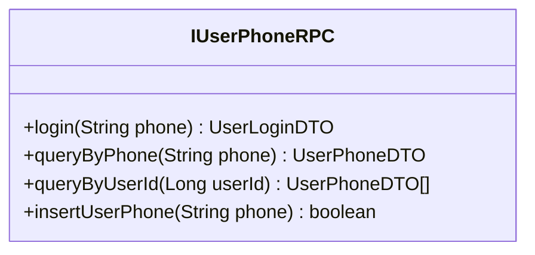
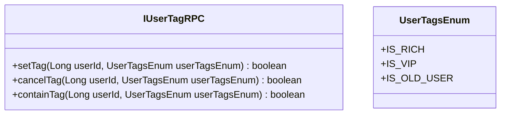
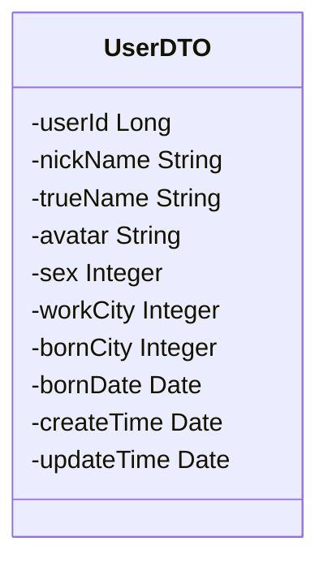
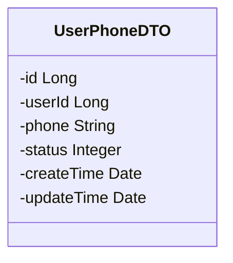
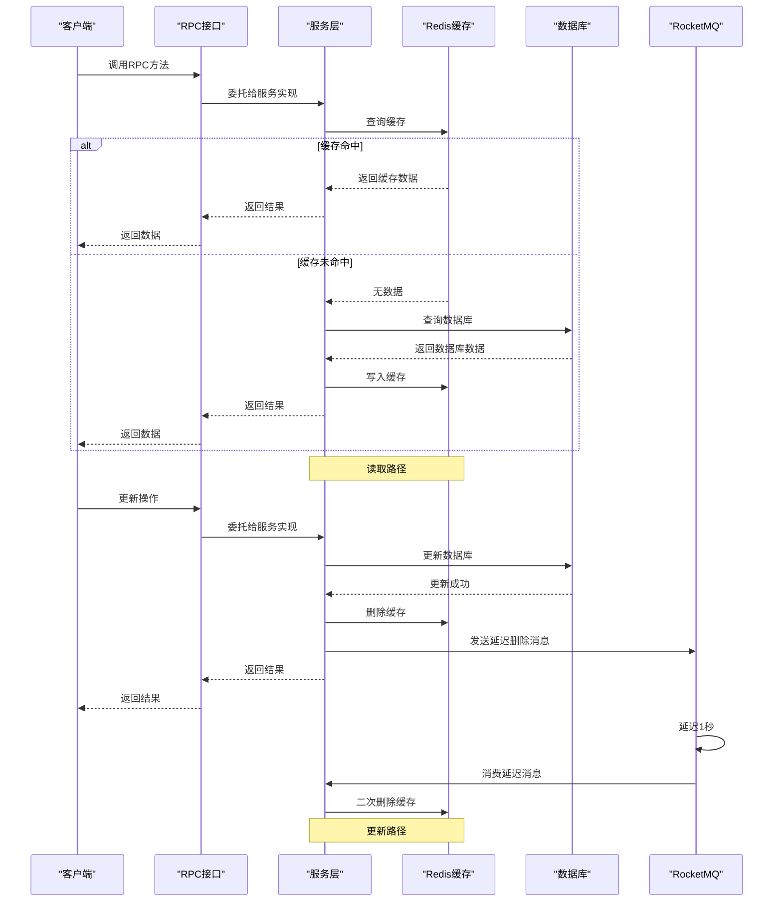
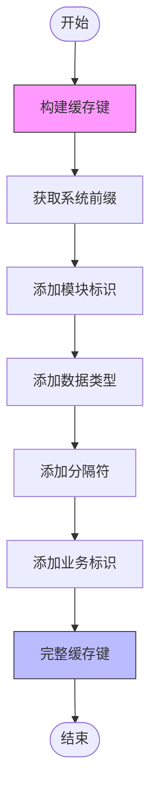
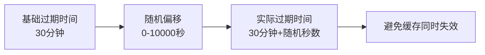

# 用户服务RPC接口

<cite>
**本文档引用的文件**   
- [IUserRPC.java](file://live-user-interface/src/main/java/com/logilong/live/user/interfaces/IUserRPC.java)
- [IUserPhoneRPC.java](file://live-user-interface/src/main/java/com/logilong/live/user/interfaces/IUserPhoneRPC.java)
- [IUserTagRPC.java](file://live-user-interface/src/main/java/com/logilong/live/user/interfaces/IUserTagRPC.java)
- [UserDTO.java](file://live-user-interface/src/main/java/com/logilong/live/user/dto/UserDTO.java)
- [UserPhoneDTO.java](file://live-user-interface/src/main/java/com/logilong/live/user/dto/UserPhoneDTO.java)
- [UserTagEnum.java](file://live-user-interface/src/main/java/com/logilong/live/user/constants/UserTagsEnum.java)
- [UserRPCImpl.java](file://live-user-provider/src/main/java/com/logilong/live/user/provider/rpc/UserRPCImpl.java)
- [UserPhoneRPCImpl.java](file://live-user-provider/src/main/java/com/logilong/live/user/provider/rpc/UserPhoneRPCImpl.java)
- [UserTagRPCImpl.java](file://live-user-provider/src/main/java/com/logilong/live/user/provider/rpc/UserTagRPCImpl.java)
- [UserServiceImpl.java](file://live-user-provider/src/main/java/com/logilong/live/user/provider/service/impl/UserServiceImpl.java)
- [UserProviderCacheKeyBuilder.java](file://live-framework/live-framework-redis-starter/src/main/java/com/logilong/live/framework/redis/starter/key/UserProviderCacheKeyBuilder.java)
- [RocketMQConsumerConfig.java](file://live-user-provider/src/main/java/com/logilong/live/user/provider/consumer/RocketMQConsumerConfig.java)
- [CacheAsyncDeleteCode.java](file://live-user-interface/src/main/java/com/logilong/live/user/constants/CacheAsyncDeleteCode.java)
- [UserCacheAsyncDeleteDTO.java](file://live-user-interface/src/main/java/com/logilong/live/user/dto/UserCacheAsyncDeleteDTO.java)
</cite>

## 目录
1. [用户服务RPC接口概述](#用户服务rpc接口概述)
2. [IUserRPC接口](#iuserpc接口)
3. [IUserPhoneRPC接口](#iuserphonercp接口)
4. [IUserTagRPC接口](#iusertagrpc接口)
5. [数据传输对象(DTO)说明](#数据传输对象dto说明)
6. [缓存策略与数据一致性](#缓存策略与数据一致性)

## 用户服务RPC接口概述

用户服务提供了三个主要的RPC接口：IUserRPC用于用户基本信息管理，IUserPhoneRPC处理手机号相关操作，IUserTagRPC管理用户标签。这些接口通过Dubbo框架暴露服务，为上层应用提供用户相关的数据访问能力。

**Section sources**
- [IUserRPC.java](file://live-user-interface/src/main/java/com/logilong/live/user/interfaces/IUserRPC.java)
- [IUserPhoneRPC.java](file://live-user-interface/src/main/java/com/logilong/live/user/interfaces/IUserPhoneRPC.java)
- [IUserTagRPC.java](file://live-user-interface/src/main/java/com/logilong/live/user/interfaces/IUserTagRPC.java)

## IUserRPC接口

IUserRPC接口提供了用户信息的增删改查功能，是用户服务的核心接口之一。

### 方法说明

**Diagram sources**
- [IUserRPC.java](file://live-user-interface/src/main/java/com/logilong/live/user/interfaces/IUserRPC.java)

#### getByUserId
根据用户ID查询用户信息。该方法首先尝试从Redis缓存中获取数据，如果缓存中不存在，则从数据库查询并将结果写入缓存。

#### updateUserInfo
更新用户信息。更新成功后，会立即删除Redis中的缓存数据，并通过RocketMQ发送延迟消息进行二次删除，确保缓存一致性。

#### insertOne
插入新的用户信息。该操作直接写入数据库，不涉及缓存操作。

#### batchQueryUserInfo
批量查询用户信息。该方法会先尝试从Redis中批量获取缓存数据，对于缓存中缺失的数据，会从数据库查询并批量写回缓存。

**Section sources**
- [IUserRPC.java](file://live-user-interface/src/main/java/com/logilong/live/user/interfaces/IUserRPC.java)
- [UserRPCImpl.java](file://live-user-provider/src/main/java/com/logilong/live/user/provider/rpc/UserRPCImpl.java)

## IUserPhoneRPC接口

IUserPhoneRPC接口处理与手机号相关的用户操作，包括用户登录、手机号查询等功能。

### 方法说明

**Diagram sources**
- [IUserPhoneRPC.java](file://live-user-interface/src/main/java/com/logilong/live/user/interfaces/IUserPhoneRPC.java)

#### login
用户登录接口。如果手机号对应的用户不存在，会自动创建新用户（注册）。该方法返回包含用户登录信息的UserLoginDTO对象。

#### queryByPhone
根据手机号查询用户信息。该方法用于验证手机号是否已注册以及获取关联的用户信息。

#### queryByUserId
根据用户ID查询该用户绑定的所有手机号信息。一个用户可能绑定多个手机号。

#### insertUserPhone
插入用户手机号信息。该方法用于为现有用户添加新的手机号。

**Section sources**
- [IUserPhoneRPC.java](file://live-user-interface/src/main/java/com/logilong/live/user/interfaces/IUserPhoneRPC.java)
- [UserPhoneRPCImpl.java](file://live-user-provider/src/main/java/com/logilong/live/user/provider/rpc/UserPhoneRPCImpl.java)

## IUserTagRPC接口

IUserTagRPC接口提供了用户标签的管理功能，支持标签的设置、取消和查询。

### 方法说明

**Diagram sources**
- [IUserTagRPC.java](file://live-user-interface/src/main/java/com/logilong/live/user/interfaces/IUserTagRPC.java)
- [UserTagsEnum.java](file://live-user-interface/src/main/java/com/logilong/live/user/constants/UserTagsEnum.java)

#### setTag
为指定用户设置标签。系统使用位运算的方式存储多个标签，每个标签对应一个唯一的位值。

#### cancelTag
取消指定用户的某个标签。通过位运算清除对应的标签位。

#### containTag
检查指定用户是否包含某个标签。通过位运算判断标签位是否被设置。

**Section sources**
- [IUserTagRPC.java](file://live-user-interface/src/main/java/com/logilong/live/user/interfaces/IUserTagRPC.java)
- [UserTagRPCImpl.java](file://live-user-provider/src/main/java/com/logilong/live/user/provider/rpc/UserTagRPCImpl.java)
- [UserTagsEnum.java](file://live-user-interface/src/main/java/com/logilong/live/user/constants/UserTagsEnum.java)

## 数据传输对象(DTO)说明

### UserDTO
UserDTO是用户基本信息的数据传输对象，包含以下字段：

**Diagram sources**
- [UserDTO.java](file://live-user-interface/src/main/java/com/logilong/live/user/dto/UserDTO.java)

- **userId**: 用户唯一标识符
- **nickName**: 用户昵称
- **trueName**: 真实姓名
- **avatar**: 头像URL
- **sex**: 性别（0:未知, 1:男, 2:女）
- **workCity**: 工作城市编码
- **bornCity**: 出生城市编码
- **bornDate**: 出生日期
- **createTime**: 创建时间
- **updateTime**: 更新时间

### UserPhoneDTO
UserPhoneDTO是用户手机号信息的数据传输对象。

**Diagram sources**
- [UserPhoneDTO.java](file://live-user-interface/src/main/java/com/logilong/live/user/dto/UserPhoneDTO.java)

- **id**: 主键ID
- **userId**: 关联的用户ID
- **phone**: 手机号码
- **status**: 状态（如：正常、禁用等）
- **createTime**: 创建时间
- **updateTime**: 更新时间

**Section sources**
- [UserDTO.java](file://live-user-interface/src/main/java/com/logilong/live/user/dto/UserDTO.java)
- [UserPhoneDTO.java](file://live-user-interface/src/main/java/com/logilong/live/user/dto/UserPhoneDTO.java)

## 缓存策略与数据一致性

用户服务采用了多层次的缓存策略来提高系统性能，同时通过多种机制确保数据一致性。

### 缓存架构

**Diagram sources**
- [UserServiceImpl.java](file://live-user-provider/src/main/java/com/logilong/live/user/provider/service/impl/UserServiceImpl.java)
- [RocketMQConsumerConfig.java](file://live-user-provider/src/main/java/com/logilong/live/user/provider/consumer/RocketMQConsumerConfig.java)

### 缓存键设计

缓存键由UserProviderCacheKeyBuilder类统一管理，遵循统一的命名规范：

**Diagram sources**
- [UserProviderCacheKeyBuilder.java](file://live-framework/live-framework-redis-starter/src/main/java/com/logilong/live/framework/redis/starter/key/UserProviderCacheKeyBuilder.java)

### 缓存一致性保障机制

#### 双重删除策略
当更新用户信息时，系统执行以下步骤确保缓存一致性：
1. 先删除Redis中的缓存数据
2. 向RocketMQ发送延迟1秒的删除消息
3. 消费者接收到消息后执行二次删除

这种策略可以解决在高并发场景下可能出现的"缓存脏读"问题。

#### 批量查询优化
对于batchQueryUserInfo方法，系统采用以下优化策略：
- 使用Redis的multiGet批量获取缓存数据
- 对数据库查询结果使用分片路由避免笛卡尔积
- 并行查询不同分片的数据
- 使用管道技术批量设置缓存过期时间

#### 随机过期时间
为防止缓存雪崩，系统为缓存设置了随机的过期时间（基础时间+随机偏移）。

**Diagram sources**
- [UserServiceImpl.java](file://live-user-provider/src/main/java/com/logilong/live/user/provider/service/impl/UserServiceImpl.java)
- [RocketMQConsumerConfig.java](file://live-user-provider/src/main/java/com/logilong/live/user/provider/consumer/RocketMQConsumerConfig.java)
- [CacheAsyncDeleteCode.java](file://live-user-interface/src/main/java/com/logilong/live/user/constants/CacheAsyncDeleteCode.java)

**Section sources**
- [UserServiceImpl.java](file://live-user-provider/src/main/java/com/logilong/live/user/provider/service/impl/UserServiceImpl.java)
- [UserProviderCacheKeyBuilder.java](file://live-framework/live-framework-redis-starter/src/main/java/com/logilong/live/framework/redis/starter/key/UserProviderCacheKeyBuilder.java)
- [RocketMQConsumerConfig.java](file://live-user-provider/src/main/java/com/logilong/live/user/provider/consumer/RocketMQConsumerConfig.java)
- [CacheAsyncDeleteCode.java](file://live-user-interface/src/main/java/com/logilong/live/user/constants/CacheAsyncDeleteCode.java)
- [UserCacheAsyncDeleteDTO.java](file://live-user-interface/src/main/java/com/logilong/live/user/dto/UserCacheAsyncDeleteDTO.java)