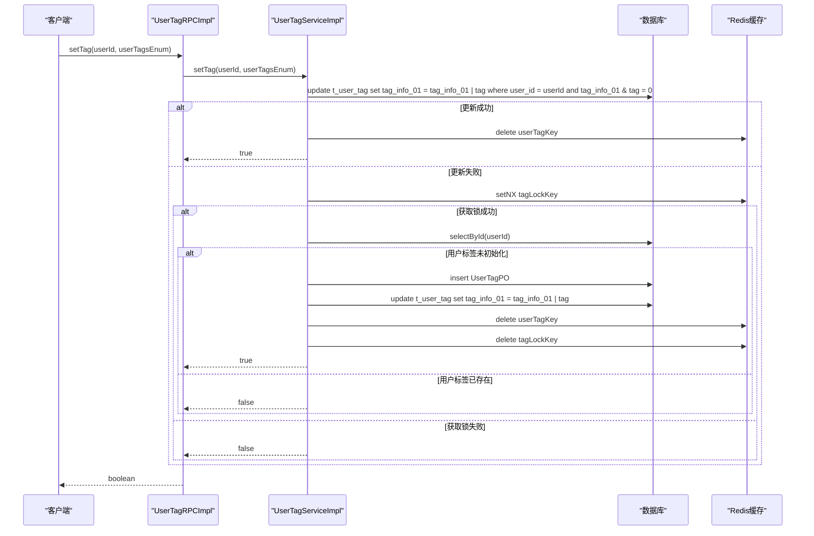
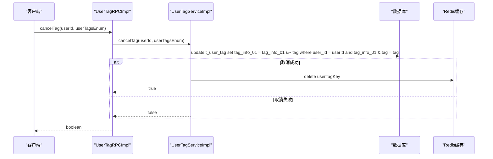
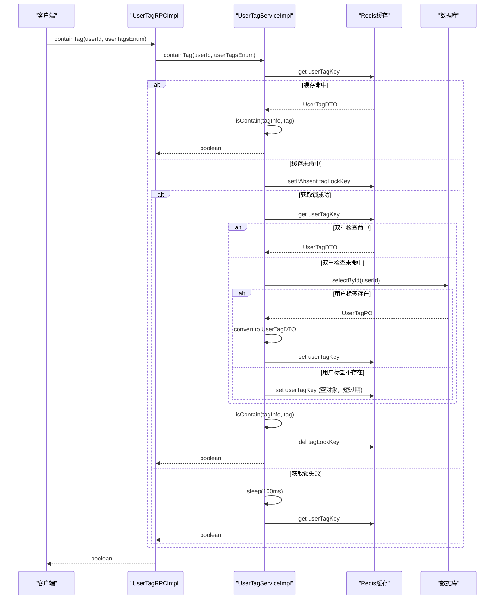
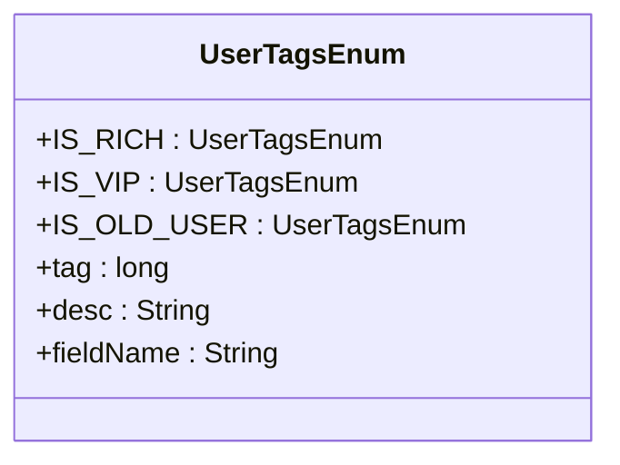
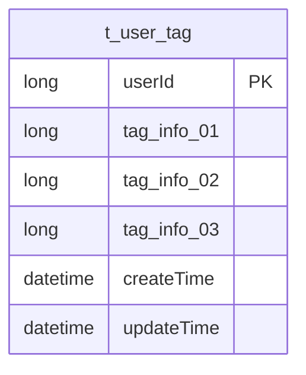
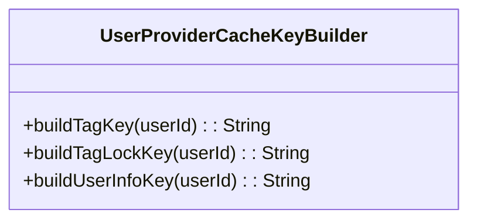
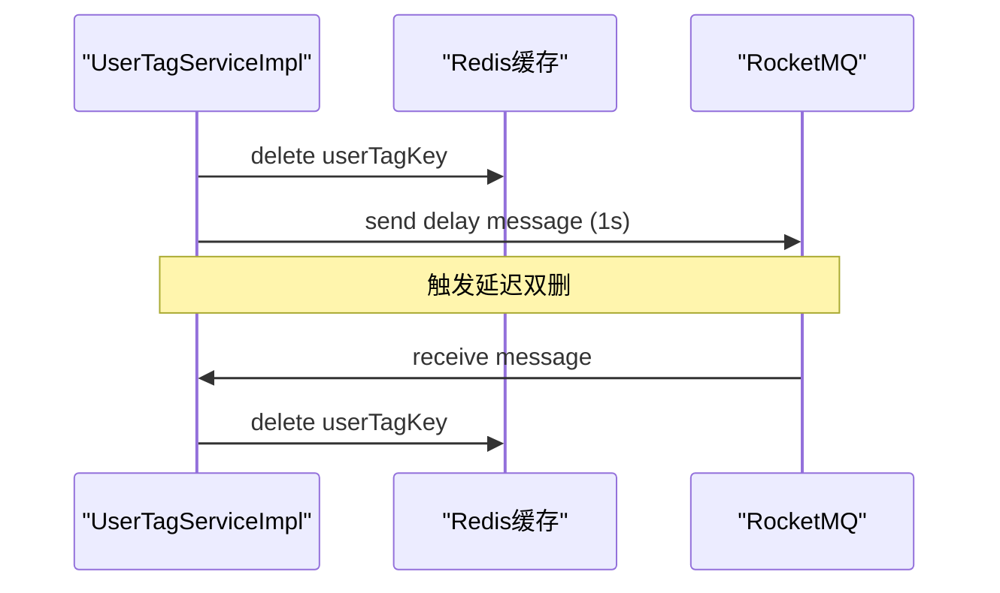
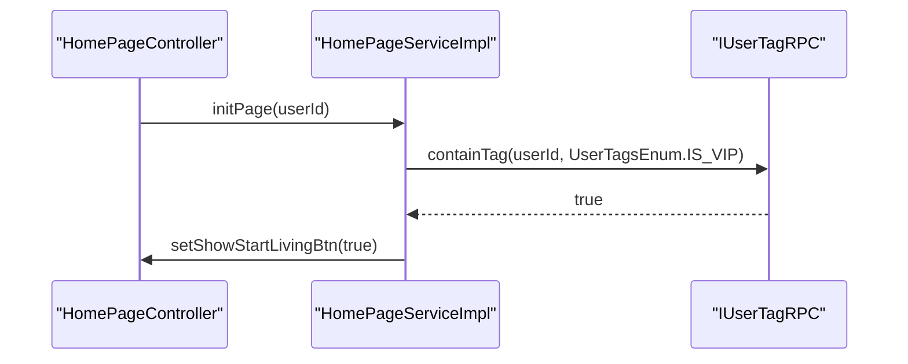

# 用户标签RPC接口

<cite>
**本文档引用的文件**   
- [IUserTagRPC.java](file://live-user-interface/src/main/java/com/logilong/live/user/interfaces/IUserTagRPC.java)
- [UserTagRPCImpl.java](file://live-user-provider/src/main/java/com/logilong/live/user/provider/rpc/UserTagRPCImpl.java)
- [UserTagServiceImpl.java](file://live-user-provider/src/main/java/com/logilong/live/user/provider/service/impl/UserTagServiceImpl.java)
- [UserTagsEnum.java](file://live-user-interface/src/main/java/com/logilong/live/user/constants/UserTagsEnum.java)
- [UserTagDTO.java](file://live-user-interface/src/main/java/com/logilong/live/user/dto/UserTagDTO.java)
- [UserTagPO.java](file://live-user-provider/src/main/java/com/logilong/live/user/provider/dao/po/UserTagPO.java)
- [IUserTagMapper.java](file://live-user-provider/src/main/java/com/logilong/live/user/provider/dao/mapper/IUserTagMapper.java)
- [UserProviderCacheKeyBuilder.java](file://live-framework/live-framework-redis-starter/src/main/java/com/logilong/live/framework/redis/starter/key/UserProviderCacheKeyBuilder.java)
- [TagInfoUtils.java](file://live-user-interface/src/main/java/com/logilong/live/user/utils/TagInfoUtils.java)
- [CacheAsyncDeleteCode.java](file://live-user-interface/src/main/java/com/logilong/live/user/constants/CacheAsyncDeleteCode.java)
- [UserProviderTopicNames.java](file://live-common-interface/src/main/java/com/logilong/live/common/interfaces/topic/UserProviderTopicNames.java)
- [HomePageServiceImpl.java](file://live-api/src/main/java/com/logilong/live/api/service/impl/HomePageServiceImpl.java)
</cite>

## 目录
1. [简介](#简介)
2. [核心组件](#核心组件)
3. [标签管理方法详解](#标签管理方法详解)
4. [用户标签体系](#用户标签体系)
5. [应用场景](#应用场景)
6. [缓存策略与数据一致性](#缓存策略与数据一致性)
7. [典型使用案例](#典型使用案例)

## 简介
本文档系统化地记录了IUserTagRPC接口的标签管理功能，深入解析了setTag、cancelTag和containTag三个核心方法的业务逻辑与实现细节。结合UserTagsEnum枚举，说明了平台预定义的用户标签体系及其业务含义。阐述了标签系统在用户画像、精准营销和权限控制中的应用场景。分析了其实现过程中对Redis缓存的使用策略（如UserProviderCacheKeyBuilder），以及如何保证标签变更的实时性和数据一致性。提供了典型使用案例，如主播身份标识、VIP用户识别等。

## 核心组件

### 接口定义
IUserTagRPC接口定义了用户标签管理的核心方法，包括设置标签、取消标签和判断是否包含某个标签。

**Section sources**
- [IUserTagRPC.java](file://live-user-interface/src/main/java/com/logilong/live/user/interfaces/IUserTagRPC.java)

### 实现类
UserTagRPCImpl是IUserTagRPC接口的实现类，通过Dubbo服务暴露，调用UserTagServiceImpl服务进行实际的业务处理。

**Section sources**
- [UserTagRPCImpl.java](file://live-user-provider/src/main/java/com/logilong/live/user/provider/rpc/UserTagRPCImpl.java)

### 服务实现
UserTagServiceImpl是用户标签服务的核心实现类，负责处理标签的增删查改逻辑，包含对数据库和Redis缓存的操作。

**Section sources**
- [UserTagServiceImpl.java](file://live-user-provider/src/main/java/com/logilong/live/user/provider/service/impl/UserTagServiceImpl.java)

## 标签管理方法详解

### setTag方法
setTag方法用于为用户设置指定的标签。该方法首先尝试更新数据库中的标签字段，如果更新成功，则删除Redis中的缓存数据。如果更新失败（可能因为用户不存在或标签数据未初始化），则通过分布式锁机制确保并发场景下的数据一致性，并初始化用户标签数据。

**Diagram sources**
- [UserTagServiceImpl.java](file://live-user-provider/src/main/java/com/logilong/live/user/provider/service/impl/UserTagServiceImpl.java#L51-L92)
- [IUserTagMapper.java](file://live-user-provider/src/main/java/com/logilong/live/user/provider/dao/mapper/IUserTagMapper.java#L15-L16)

### cancelTag方法
cancelTag方法用于取消用户的指定标签。该方法通过按位与取反操作来清除标签位，并在操作成功后删除Redis中的缓存数据，确保后续查询能获取最新状态。

**Diagram sources**
- [UserTagServiceImpl.java](file://live-user-provider/src/main/java/com/logilong/live/user/provider/service/impl/UserTagServiceImpl.java#L96-L104)
- [IUserTagMapper.java](file://live-user-provider/src/main/java/com/logilong/live/user/provider/dao/mapper/IUserTagMapper.java#L23-L24)

### containTag方法
containTag方法用于判断用户是否包含指定的标签。该方法优先从Redis缓存中查询用户标签数据，如果缓存中不存在，则通过分布式锁机制查询数据库并更新缓存，避免缓存击穿问题。

**Diagram sources**
- [UserTagServiceImpl.java](file://live-user-provider/src/main/java/com/logilong/live/user/provider/service/impl/UserTagServiceImpl.java#L108-L123)
- [TagInfoUtils.java](file://live-user-interface/src/main/java/com/logilong/live/user/utils/TagInfoUtils.java#L12-L14)

## 用户标签体系

### UserTagsEnum枚举
UserTagsEnum枚举定义了平台预定义的用户标签，采用位运算的方式存储多个标签，每个标签对应一个唯一的位值。

**Diagram sources**
- [UserTagsEnum.java](file://live-user-interface/src/main/java/com/logilong/live/user/constants/UserTagsEnum.java)

### 标签字段映射
用户标签数据存储在t_user_tag表中，使用多个字段（tag_info_01, tag_info_02, tag_info_03）来存储不同类别的标签，通过UserTagFieldNameConstants常量类进行字段名管理。

**Diagram sources**
- [UserTagPO.java](file://live-user-provider/src/main/java/com/logilong/live/user/provider/dao/po/UserTagPO.java)
- [UserTagFieldNameConstants.java](file://live-user-interface/src/main/java/com/logilong/live/user/constants/UserTagFieldNameConstants.java)

## 应用场景

### 用户画像
通过用户标签系统，可以构建详细的用户画像，了解用户的消费能力、活跃度、偏好等特征，为个性化推荐和精准营销提供数据支持。

### 精准营销
基于用户标签进行分群，针对不同标签的用户群体推送定制化的营销活动，提高营销转化率。

### 权限控制
利用用户标签实现细粒度的权限控制，例如VIP用户可以访问特定功能或享受特殊服务。

## 缓存策略与数据一致性

### Redis缓存使用
系统使用Redis缓存用户标签数据，通过UserProviderCacheKeyBuilder构建缓存键，提高查询性能。

**Diagram sources**
- [UserProviderCacheKeyBuilder.java](file://live-framework/live-framework-redis-starter/src/main/java/com/logilong/live/framework/redis/starter/key/UserProviderCacheKeyBuilder.java)

### 数据一致性保障
采用"延迟双删"策略保证缓存与数据库的数据一致性。在更新数据库后立即删除缓存，并通过RocketMQ发送延迟消息进行二次删除，防止主从同步延迟导致的缓存不一致问题。

**Diagram sources**
- [UserTagServiceImpl.java](file://live-user-provider/src/main/java/com/logilong/live/user/provider/service/impl/UserTagServiceImpl.java#L129-L154)
- [CacheAsyncDeleteCode.java](file://live-user-interface/src/main/java/com/logilong/live/user/constants/CacheAsyncDeleteCode.java)
- [UserProviderTopicNames.java](file://live-common-interface/src/main/java/com/logilong/live/common/interfaces/topic/UserProviderTopicNames.java)

## 典型使用案例

### 主播身份标识
通过为用户设置特定标签来标识其主播身份，在直播相关功能中进行权限判断和特殊处理。

### VIP用户识别
利用IS_VIP标签识别VIP用户，在首页展示特殊按钮或提供专属服务。

**Diagram sources**
- [HomePageServiceImpl.java](file://live-api/src/main/java/com/logilong/live/api/service/impl/HomePageServiceImpl.java#L29)