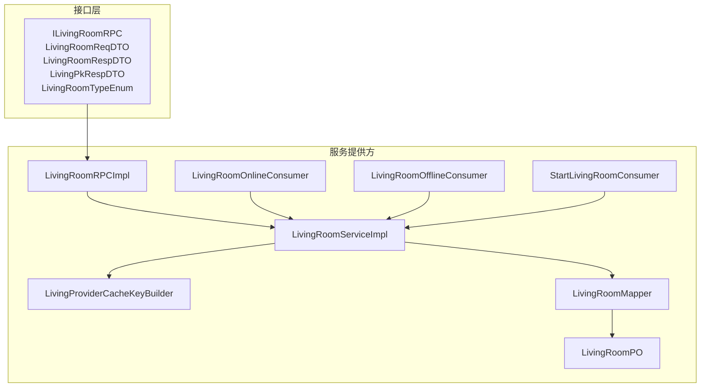
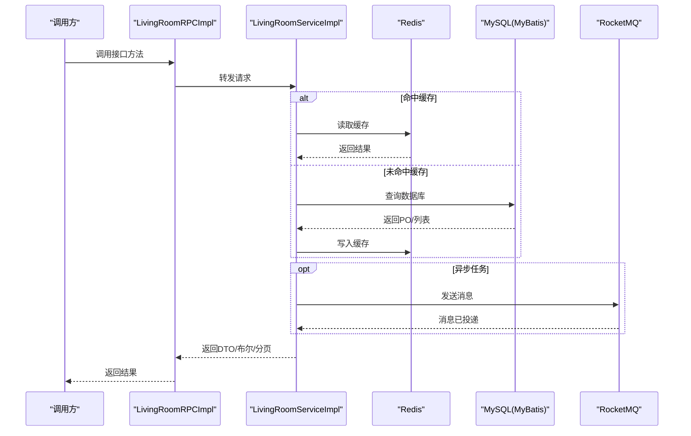
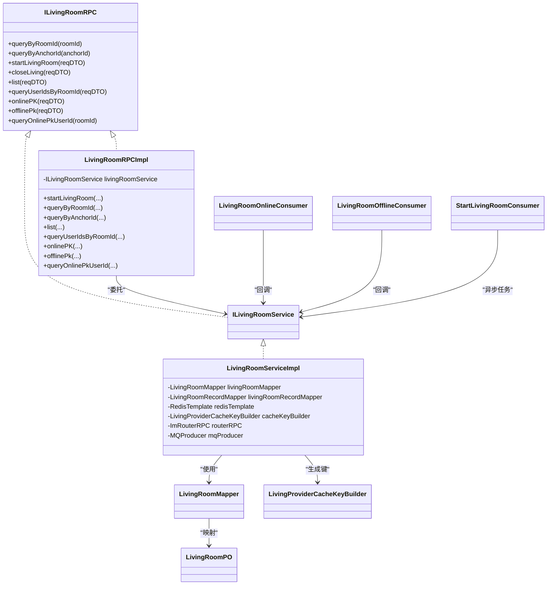
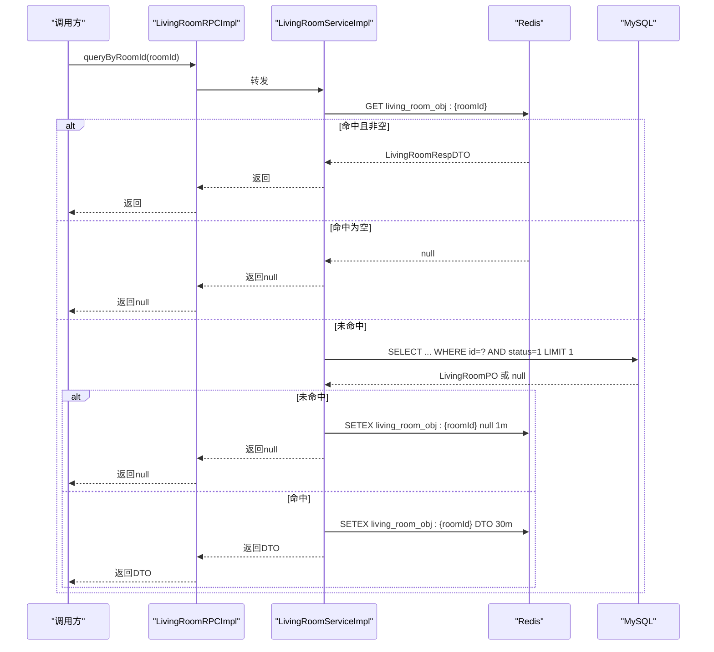
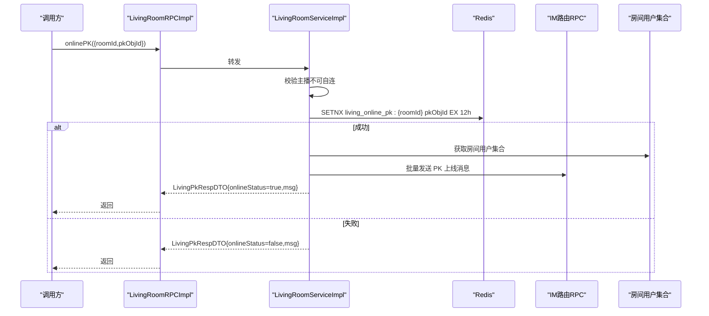
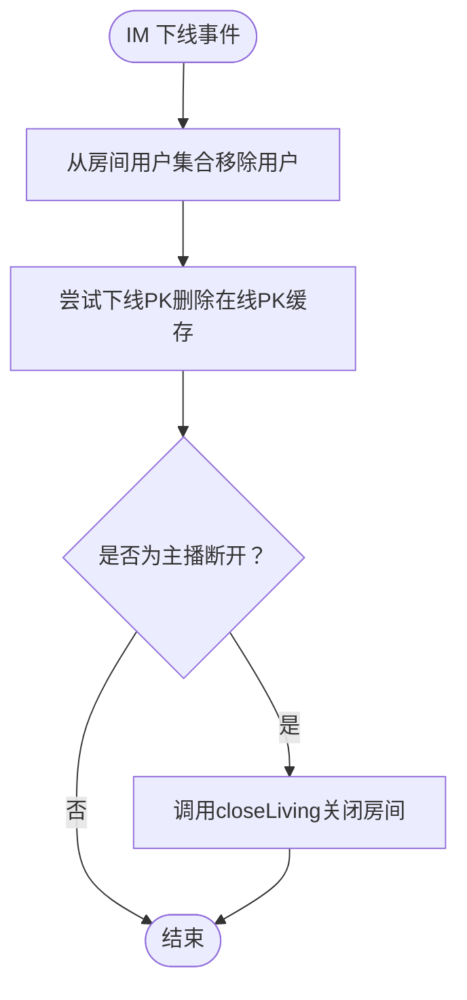
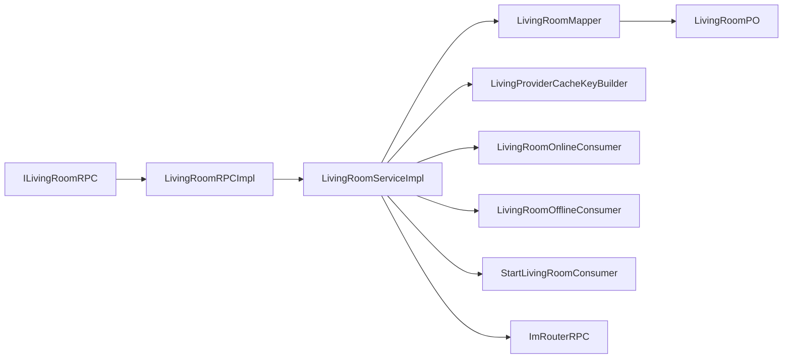

# 直播间服务RPC接口

<cite>
**本文引用的文件**
- [ILivingRoomRPC.java](file://live-living-interface/src/main/java/com/logilong/live/living/interfaces/rpc/ILivingRoomRPC.java)
- [LivingRoomReqDTO.java](file://live-living-interface/src/main/java/com/logilong/live/living/interfaces/dto/LivingRoomReqDTO.java)
- [LivingRoomRespDTO.java](file://live-living-interface/src/main/java/com/logilong/live/living/interfaces/dto/LivingRoomRespDTO.java)
- [LivingPkRespDTO.java](file://live-living-interface/src/main/java/com/logilong/live/living/interfaces/dto/LivingPkRespDTO.java)
- [LivingRoomTypeEnum.java](file://live-living-interface/src/main/java/com/logilong/live/living/interfaces/constants/LivingRoomTypeEnum.java)
- [LivingRoomRPCImpl.java](file://live-living-provider/src/main/java/com/logilong/live/living/provider/rpc/LivingRoomRPCImpl.java)
- [LivingRoomServiceImpl.java](file://live-living-provider/src/main/java/com/logilong/live/living/provider/service/impl/LivingRoomServiceImpl.java)
- [LivingRoomMapper.java](file://live-living-provider/src/main/java/com/logilong/live/living/producer/dao/mapper/LivingRoomMapper.java)
- [LivingRoomPO.java](file://live-living-provider/src/main/java/com/logilong/live/living/producer/dao/po/LivingRoomPO.java)
- [LivingProviderCacheKeyBuilder.java](file://live-framework/live-framework-redis-starter/src/main/java/com/logilong/live/framework/redis/starter/key/LivingProviderCacheKeyBuilder.java)
- [CommonStatusEnum.java](file://live-common-interface/src/main/java/com/logilong/live/common/interfaces/enums/CommonStatusEnum.java)
- [LivingRoomOnlineConsumer.java](file://live-living-provider/src/main/java/com/logilong/live/living/provider/consumer/LivingRoomOnlineConsumer.java)
- [LivingRoomOfflineConsumer.java](file://live-living-provider/src/main/java/com/logilong/live/living/provider/consumer/LivingRoomOfflineConsumer.java)
- [StartLivingRoomConsumer.java](file://live-living-provider/src/main/java/com/logilong/live/living/provider/consumer/StartLivingRoomConsumer.java)
- [bootstrap.yml](file://live-living-provider/src/main/resources/bootstrap.yml)
</cite>

## 目录
1. [简介](#简介)
2. [项目结构](#项目结构)
3. [核心组件](#核心组件)
4. [架构总览](#架构总览)
5. [详细组件分析](#详细组件分析)
6. [依赖关系分析](#依赖关系分析)
7. [性能与缓存策略](#性能与缓存策略)
8. [故障排查指南](#故障排查指南)
9. [结论](#结论)

## 简介
本文件系统性文档化 ILivingRoomRPC 接口的所有方法，涵盖：
- 查询类：按房间号查询、按主播ID查询
- 生命周期类：开启直播间、关闭直播间
- 列表分页：分页查询直播间列表
- 在线用户：按房间查询用户集合
- PK 连线：在线PK、离线PK、查询当前PK对象
- 数据模型：LivingRoomReqDTO 与 LivingRoomRespDTO 字段语义
- 实现细节：基于 live-living-provider 的 LivingRoomServiceImpl

## 项目结构
- 接口层（live-living-interface）：定义 RPC 接口与 DTO/枚举
- 服务提供方（live-living-provider）：实现 RPC 与业务逻辑，包含 Redis 缓存、MQ 消费者、MyBatis Mapper
- 公共组件（live-framework、live-common-interface）：Redis Key 构建器、通用状态枚举等

图表来源
- [ILivingRoomRPC.java](file://live-living-interface/src/main/java/com/logilong/live/living/interfaces/rpc/ILivingRoomRPC.java#L1-L59)
- [LivingRoomRPCImpl.java](file://live-living-provider/src/main/java/com/logilong/live/living/provider/rpc/LivingRoomRPCImpl.java#L1-L65)
- [LivingRoomServiceImpl.java](file://live-living-provider/src/main/java/com/logilong/live/living/provider/service/impl/LivingRoomServiceImpl.java#L1-L294)
- [LivingProviderCacheKeyBuilder.java](file://live-framework/live-framework-redis-starter/src/main/java/com/logilong/live/framework/redis/starter/key/LivingProviderCacheKeyBuilder.java#L1-L39)
- [LivingRoomMapper.java](file://live-living-provider/src/main/java/com/logilong/live/living/producer/dao/mapper/LivingRoomMapper.java#L1-L11)
- [LivingRoomPO.java](file://live-living-provider/src/main/java/com/logilong/live/living/producer/dao/po/LivingRoomPO.java#L1-L27)
- [LivingRoomOnlineConsumer.java](file://live-living-provider/src/main/java/com/logilong/live/living/provider/consumer/LivingRoomOnlineConsumer.java#L1-L51)
- [LivingRoomOfflineConsumer.java](file://live-living-provider/src/main/java/com/logilong/live/living/provider/consumer/LivingRoomOfflineConsumer.java#L1-L51)
- [StartLivingRoomConsumer.java](file://live-living-provider/src/main/java/com/logilong/live/living/provider/consumer/StartLivingRoomConsumer.java#L1-L51)

章节来源
- [bootstrap.yml](file://live-living-provider/src/main/resources/bootstrap.yml#L1-L24)

## 核心组件
- ILivingRoomRPC：对外暴露的直播间 RPC 接口，包含查询、生命周期、列表、用户集合、PK 连线等方法
- LivingRoomReqDTO：请求参数载体，包含房间标识、主播标识、PK 对象、分页等
- LivingRoomRespDTO：响应结果载体，包含房间基础信息、类型、统计指标、PK 对象等
- LivingPkRespDTO：PK 连线返回体，包含是否成功与提示信息
- LivingRoomServiceImpl：核心业务实现，负责缓存、数据库访问、IM 用户集合维护、MQ 事件处理
- LivingRoomRPCImpl：Dubbo 暴露的 RPC 实现，转发到服务层
- Redis 缓存键构建器：统一管理直播相关缓存键前缀与命名规则
- MyBatis Mapper/PO：持久层映射，支撑查询与记录归档

章节来源
- [ILivingRoomRPC.java](file://live-living-interface/src/main/java/com/logilong/live/living/interfaces/rpc/ILivingRoomRPC.java#L1-L59)
- [LivingRoomReqDTO.java](file://live-living-interface/src/main/java/com/logilong/live/living/interfaces/dto/LivingRoomReqDTO.java#L1-L27)
- [LivingRoomRespDTO.java](file://live-living-interface/src/main/java/com/logilong/live/living/interfaces/dto/LivingRoomRespDTO.java#L1-L23)
- [LivingPkRespDTO.java](file://live-living-interface/src/main/java/com/logilong/live/living/interfaces/dto/LivingPkRespDTO.java#L1-L16)
- [LivingRoomRPCImpl.java](file://live-living-provider/src/main/java/com/logilong/live/living/provider/rpc/LivingRoomRPCImpl.java#L1-L65)
- [LivingRoomServiceImpl.java](file://live-living-provider/src/main/java/com/logilong/live/living/provider/service/impl/LivingRoomServiceImpl.java#L1-L294)
- [LivingProviderCacheKeyBuilder.java](file://live-framework/live-framework-redis-starter/src/main/java/com/logilong/live/framework/redis/starter/key/LivingProviderCacheKeyBuilder.java#L1-L39)
- [LivingRoomMapper.java](file://live-living-provider/src/main/java/com/logilong/live/living/producer/dao/mapper/LivingRoomMapper.java#L1-L11)
- [LivingRoomPO.java](file://live-living-provider/src/main/java/com/logilong/live/living/producer/dao/po/LivingRoomPO.java#L1-L27)

## 架构总览
- RPC 层：ILivingRoomRPC 定义接口；LivingRoomRPCImpl 通过 Dubbo 暴露
- 业务层：LivingRoomServiceImpl 负责核心逻辑，包括缓存、数据库、IM 用户集合、MQ 事件
- 数据层：LivingRoomMapper/PO 访问 t_living_room 表；记录归档至 t_living_room_record
- 缓存层：Redis 键由 LivingProviderCacheKeyBuilder 统一生成
- MQ 层：IM 上线/下线事件、开始直播异步任务

图表来源
- [LivingRoomRPCImpl.java](file://live-living-provider/src/main/java/com/logilong/live/living/provider/rpc/LivingRoomRPCImpl.java#L1-L65)
- [LivingRoomServiceImpl.java](file://live-living-provider/src/main/java/com/logilong/live/living/provider/service/impl/LivingRoomServiceImpl.java#L1-L294)
- [LivingRoomMapper.java](file://live-living-provider/src/main/java/com/logilong/live/living/producer/dao/mapper/LivingRoomMapper.java#L1-L11)
- [LivingProviderCacheKeyBuilder.java](file://live-framework/live-framework-redis-starter/src/main/java/com/logilong/live/framework/redis/starter/key/LivingProviderCacheKeyBuilder.java#L1-L39)

## 详细组件分析

### ILivingRoomRPC 接口方法详解
- queryByRoomId(roomId)
  - 功能：按房间ID查询有效直播间
  - 缓存策略：先查 Redis，命中直接返回；未命中查库并回填缓存；空值也缓存以避免穿透
  - PK 类型处理：若房间类型为 PK 直播间，则补充当前在线 PK 对象ID
  - 返回：LivingRoomRespDTO 或 null
- queryByAnchorId(anchorId)
  - 功能：按主播ID查询其最新有效直播间
  - 返回：LivingRoomRespDTO
- startLivingRoom(reqDTO)
  - 功能：创建新直播间，设置状态为有效，记录开始时间
  - 缓存策略：插入后清理旧缓存键，避免脏读
  - 异步任务：向 MQ 发送“开始直播”主题消息，触发商品库存预热
  - 返回：新房间ID
- closeLiving(reqDTO)
  - 功能：关闭指定房间，校验主播身份
  - 归档：将房间记录复制到历史表并标记失效
  - 清理：删除对应房间缓存键
  - 返回：布尔
- list(reqDTO)
  - 功能：分页查询直播列表
  - 缓存策略：直播列表缓存在 Redis 列表中，按类型分组；分页直接从缓存读取
  - 返回：PageWrapper<LivingRoomRespDTO>
- queryUserIdsByRoomId(reqDTO)
  - 功能：查询房间内所有在线用户ID集合
  - 实现：使用 Redis Set 存储用户集合，采用 SCAN 分批扫描，避免阻塞
  - 返回：List<Long>
- onlinePK(reqDTO)
  - 功能：PK 直播间用户上线准备PK
  - 幂等：使用 Redis SETNX 保证同一房间仅允许一个在线PK对象
  - 通知：向房间内所有用户广播 PK 上线消息
  - 返回：LivingPkRespDTO（包含是否成功与提示）
- offlinePk(reqDTO)
  - 功能：PK 直播间用户下线
  - 实现：删除房间在线PK缓存键
  - 返回：布尔
- queryOnlinePkUserId(roomId)
  - 功能：查询当前房间在线PK对象ID
  - 返回：Long

章节来源
- [ILivingRoomRPC.java](file://live-living-interface/src/main/java/com/logilong/live/living/interfaces/rpc/ILivingRoomRPC.java#L1-L59)

### 请求与响应数据模型
- LivingRoomReqDTO 字段
  - id：房间主键（可选）
  - anchorId：主播ID（可选）
  - pkObjId：PK 对象ID（用于PK连线）
  - roomName：房间名称（可选）
  - roomId：房间ID（查询/操作常用）
  - covertImg：封面图（可选）
  - type：房间类型（如普通/PK）
  - appId：应用ID（用于区分不同应用的用户集合）
  - page/pageSize：分页参数
- LivingRoomRespDTO 字段
  - id：房间ID
  - anchorId：主播ID
  - roomName：房间名称
  - covertImg：封面图
  - type：房间类型
  - watchNum：观看数（可能来自缓存或统计）
  - goodNum：点赞数（可能来自缓存或统计）
  - pkObjId：当前在线PK对象ID（仅PK房间）
- LivingPkRespDTO 字段
  - onlineStatus：是否成功上线PK
  - msg：提示信息

章节来源
- [LivingRoomReqDTO.java](file://live-living-interface/src/main/java/com/logilong/live/living/interfaces/dto/LivingRoomReqDTO.java#L1-L27)
- [LivingRoomRespDTO.java](file://live-living-interface/src/main/java/com/logilong/live/living/interfaces/dto/LivingRoomRespDTO.java#L1-L23)
- [LivingPkRespDTO.java](file://live-living-interface/src/main/java/com/logilong/live/living/interfaces/dto/LivingPkRespDTO.java#L1-L16)

### 实现细节：LivingRoomServiceImpl
- 启动与关闭
  - startLivingRoom：插入房间记录，清理缓存，异步发送 MQ
  - closeLiving：校验主播身份，归档记录并删除缓存
- 查询与缓存
  - queryByRoomId：Redis 命中优先；未命中查库并回填；空值缓存防穿透；PK房间补全在线PK对象
  - queryByAnchorId：按主播ID取最新有效房间
  - list：从 Redis 列表缓存读取分页数据
- 在线用户集合
  - userOnlineHandler：IM 上线事件，将用户加入房间+应用维度的Redis Set，并设置过期
  - userOfflineHandler：IM 下线事件，从集合移除；同时尝试下线PK；若主播断开则关闭房间
  - queryUserIdsByRoomId：SCAN 分批读取集合，避免阻塞
- PK 连线
  - onlinePk：SETNX 保证房间唯一在线PK；成功后广播消息给房间内所有用户
  - offlinePk：删除房间在线PK缓存键
  - queryOnlinePkUserId：读取房间在线PK缓存键
- IM 消息广播
  - batchSendImMsg：构造消息体并通过 IM 路由RPC 批量发送

图表来源
- [ILivingRoomRPC.java](file://live-living-interface/src/main/java/com/logilong/live/living/interfaces/rpc/ILivingRoomRPC.java#L1-L59)
- [LivingRoomRPCImpl.java](file://live-living-provider/src/main/java/com/logilong/live/living/provider/rpc/LivingRoomRPCImpl.java#L1-L65)
- [LivingRoomServiceImpl.java](file://live-living-provider/src/main/java/com/logilong/live/living/provider/service/impl/LivingRoomServiceImpl.java#L1-L294)
- [LivingRoomMapper.java](file://live-living-provider/src/main/java/com/logilong/live/living/producer/dao/mapper/LivingRoomMapper.java#L1-L11)
- [LivingRoomPO.java](file://live-living-provider/src/main/java/com/logilong/live/living/producer/dao/po/LivingRoomPO.java#L1-L27)
- [LivingProviderCacheKeyBuilder.java](file://live-framework/live-framework-redis-starter/src/main/java/com/logilong/live/framework/redis/starter/key/LivingProviderCacheKeyBuilder.java#L1-L39)
- [LivingRoomOnlineConsumer.java](file://live-living-provider/src/main/java/com/logilong/live/living/provider/consumer/LivingRoomOnlineConsumer.java#L1-L51)
- [LivingRoomOfflineConsumer.java](file://live-living-provider/src/main/java/com/logilong/live/living/provider/consumer/LivingRoomOfflineConsumer.java#L1-L51)
- [StartLivingRoomConsumer.java](file://live-living-provider/src/main/java/com/logilong/live/living/provider/consumer/StartLivingRoomConsumer.java#L1-L51)

### 关键流程时序

#### 查询房间流程（含缓存与空值缓存）

图表来源
- [LivingRoomServiceImpl.java](file://live-living-provider/src/main/java/com/logilong/live/living/provider/service/impl/LivingRoomServiceImpl.java#L111-L138)
- [LivingProviderCacheKeyBuilder.java](file://live-framework/live-framework-redis-starter/src/main/java/com/logilong/live/framework/redis/starter/key/LivingProviderCacheKeyBuilder.java#L32-L34)

#### PK 连线流程（幂等与广播）

图表来源
- [LivingRoomServiceImpl.java](file://live-living-provider/src/main/java/com/logilong/live/living/provider/service/impl/LivingRoomServiceImpl.java#L223-L248)
- [LivingRoomServiceImpl.java](file://live-living-provider/src/main/java/com/logilong/live/living/provider/service/impl/LivingRoomServiceImpl.java#L282-L292)

#### IM 上线/下线与房间关闭联动

图表来源
- [LivingRoomServiceImpl.java](file://live-living-provider/src/main/java/com/logilong/live/living/provider/service/impl/LivingRoomServiceImpl.java#L192-L207)
- [LivingRoomServiceImpl.java](file://live-living-provider/src/main/java/com/logilong/live/living/provider/service/impl/LivingRoomServiceImpl.java#L90-L108)

## 依赖关系分析
- 接口与实现
  - ILivingRoomRPC 与 LivingRoomRPCImpl：RPC 暴露层
  - ILivingRoomService 与 LivingRoomServiceImpl：业务实现层
- 数据访问
  - LivingRoomMapper/PO：MyBatis 映射 t_living_room
  - 记录归档：关闭房间时写入 t_living_room_record
- 缓存
  - LivingProviderCacheKeyBuilder：统一生成 Redis 键
  - 缓存键类型：房间对象、房间列表、在线PK、房间用户集合、刷新锁
- MQ
  - IM 上线/下线：LivingRoomOnlineConsumer/LivingRoomOfflineConsumer
  - 开始直播：StartLivingRoomConsumer 触发库存预热
- IM 路由
  - 通过 ImRouterRPC 批量发送 PK 上线消息

图表来源
- [ILivingRoomRPC.java](file://live-living-interface/src/main/java/com/logilong/live/living/interfaces/rpc/ILivingRoomRPC.java#L1-L59)
- [LivingRoomRPCImpl.java](file://live-living-provider/src/main/java/com/logilong/live/living/provider/rpc/LivingRoomRPCImpl.java#L1-L65)
- [LivingRoomServiceImpl.java](file://live-living-provider/src/main/java/com/logilong/live/living/provider/service/impl/LivingRoomServiceImpl.java#L1-L294)
- [LivingRoomMapper.java](file://live-living-provider/src/main/java/com/logilong/live/living/producer/dao/mapper/LivingRoomMapper.java#L1-L11)
- [LivingRoomPO.java](file://live-living-provider/src/main/java/com/logilong/live/living/producer/dao/po/LivingRoomPO.java#L1-L27)
- [LivingProviderCacheKeyBuilder.java](file://live-framework/live-framework-redis-starter/src/main/java/com/logilong/live/framework/redis/starter/key/LivingProviderCacheKeyBuilder.java#L1-L39)
- [LivingRoomOnlineConsumer.java](file://live-living-provider/src/main/java/com/logilong/live/living/provider/consumer/LivingRoomOnlineConsumer.java#L1-L51)
- [LivingRoomOfflineConsumer.java](file://live-living-provider/src/main/java/com/logilong/live/living/provider/consumer/LivingRoomOfflineConsumer.java#L1-L51)
- [StartLivingRoomConsumer.java](file://live-living-provider/src/main/java/com/logilong/live/living/provider/consumer/StartLivingRoomConsumer.java#L1-L51)

## 性能与缓存策略
- Redis 缓存
  - 房间对象：30分钟有效期；空值缓存1分钟防穿透
  - 房间列表：按类型分组缓存为 Redis 列表，分页直接从缓存读取
  - 在线PK：SETNX 保证房间唯一在线PK，12小时过期
  - 房间用户集合：Redis Set，SCAN 分批读取，避免阻塞
- 数据库访问
  - 查询限制：按状态与类型过滤，必要时加 LIMIT
  - 列表查询限制：最多1000条，避免大结果集
- MQ 异步
  - 开始直播：异步预热库存，降低首屏延迟
  - IM 事件：异步维护用户集合与PK状态
- 事务与幂等
  - 关闭房间：严格校验主播身份，事务保证归档与删除一致性
  - PK 连线：SETNX 幂等，避免并发覆盖

章节来源
- [LivingRoomServiceImpl.java](file://live-living-provider/src/main/java/com/logilong/live/living/provider/service/impl/LivingRoomServiceImpl.java#L111-L138)
- [LivingRoomServiceImpl.java](file://live-living-provider/src/main/java/com/logilong/live/living/provider/service/impl/LivingRoomServiceImpl.java#L150-L166)
- [LivingRoomServiceImpl.java](file://live-living-provider/src/main/java/com/logilong/live/living/provider/service/impl/LivingRoomServiceImpl.java#L223-L248)
- [LivingRoomServiceImpl.java](file://live-living-provider/src/main/java/com/logilong/live/living/provider/service/impl/LivingRoomServiceImpl.java#L181-L207)

## 故障排查指南
- 查询不到房间
  - 检查 Redis 缓存键是否存在与过期；确认房间状态为有效
  - 空值缓存可能导致误判，检查是否命中空值缓存
- PK 连线失败
  - 检查房间是否为 PK 类型；确认 SETNX 是否被其他用户占用
  - 查看 IM 广播是否成功投递
- 用户集合不准确
  - 检查 IM 上线/下线事件是否正常消费
  - 确认房间+应用维度的集合键是否正确
- 关闭房间失败
  - 校验主播ID是否匹配；查看事务是否回滚
  - 确认历史记录是否写入成功

章节来源
- [LivingRoomServiceImpl.java](file://live-living-provider/src/main/java/com/logilong/live/living/provider/service/impl/LivingRoomServiceImpl.java#L90-L108)
- [LivingRoomServiceImpl.java](file://live-living-provider/src/main/java/com/logilong/live/living/provider/service/impl/LivingRoomServiceImpl.java#L181-L207)
- [LivingRoomServiceImpl.java](file://live-living-provider/src/main/java/com/logilong/live/living/provider/service/impl/LivingRoomServiceImpl.java#L223-L248)
- [LivingRoomOnlineConsumer.java](file://live-living-provider/src/main/java/com/logilong/live/living/provider/consumer/LivingRoomOnlineConsumer.java#L31-L49)
- [LivingRoomOfflineConsumer.java](file://live-living-provider/src/main/java/com/logilong/live/living/provider/consumer/LivingRoomOfflineConsumer.java#L31-L49)

## 结论
- ILivingRoomRPC 提供了完整的直播间生命周期与运营能力，覆盖查询、分页、用户集合、PK 连线等核心场景
- LivingRoomServiceImpl 将缓存、数据库、MQ、IM 融合，形成高可用、低延迟的直播房间服务
- 通过 Redis 键规范与幂等设计，保障了并发安全与一致性
- 建议在生产环境中持续监控 Redis 命中率、MQ 消费延迟与数据库慢查询，确保系统稳定运行