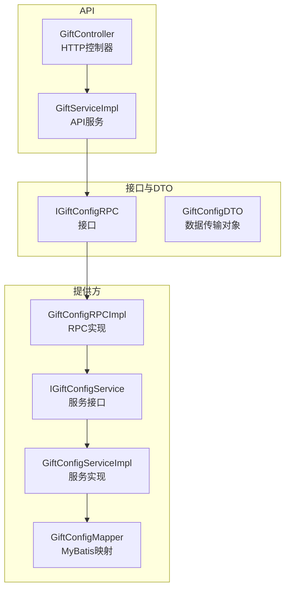
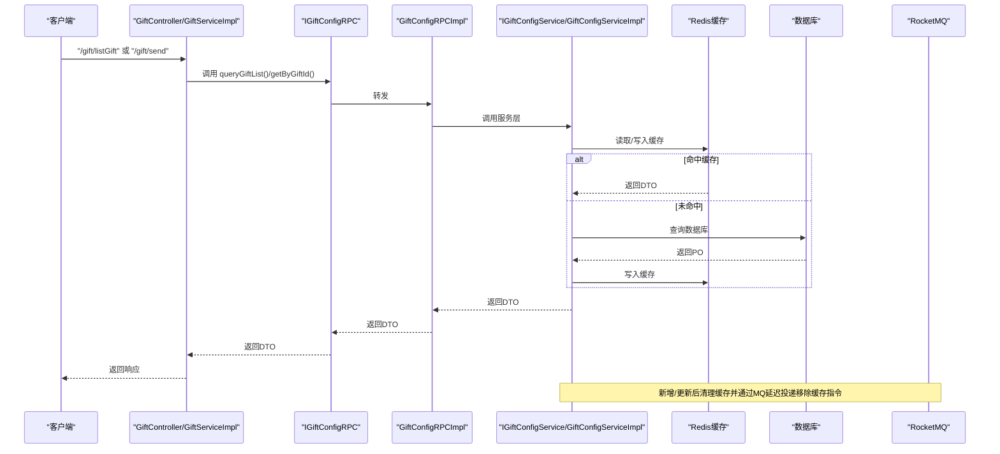
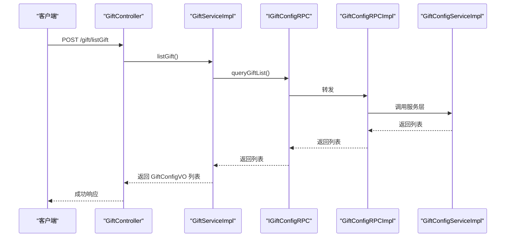
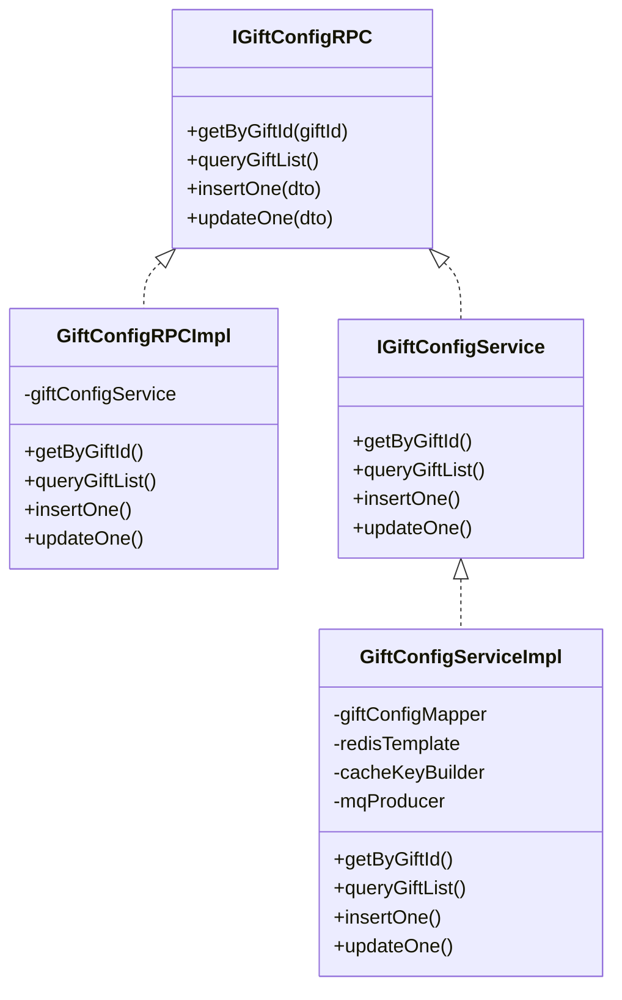

# 礼物配置RPC接口

<cite>
**本文引用的文件**
- [IGiftConfigRPC.java](file://live-gift-interface/src/main/java/com/logilong/live/gift/interfaces/IGiftConfigRPC.java)
- [GiftConfigDTO.java](file://live-gift-interface/src/main/java/com/logilong/live/gift/dto/GiftConfigDTO.java)
- [GiftConfigRPCImpl.java](file://live-gift-provider/src/main/java/com/logilong/live/gift/provider/rpc/GiftConfigRPCImpl.java)
- [IGiftConfigService.java](file://live-gift-provider/src/main/java/com/logilong/live/gift/provider/service/IGiftConfigService.java)
- [GiftConfigServiceImpl.java](file://live-gift-provider/src/main/java/com/logilong/live/gift/provider/service/impl/GiftConfigServiceImpl.java)
- [GiftController.java](file://live-api/src/main/java/com/logilong/live/api/controller/GiftController.java)
- [GiftServiceImpl.java](file://live-api/src/main/java/com/logilong/live/api/service/impl/GiftServiceImpl.java)
- [GiftProviderTopicNames.java](file://live-common-interface/src/main/java/com/logilong/live/common/interfaces/topic/GiftProviderTopicNames.java)
- [GiftProviderCacheKeyBuilder.java](file://live-framework/live-framework-redis-starter/src/main/java/com/logilong/live/framework/redis/starter/key/GiftProviderCacheKeyBuilder.java)
- [CommonStatusEnum.java](file://live-common-interface/src/main/java/com/logilong/live/common/interfaces/enums/CommonStatusEnum.java)
- [GiftConfigMapper.java](file://live-gift-provider/src/main/java/com/logilong/live/gift/provider/dao/mapper/GiftConfigMapper.java)
</cite>

## 目录
1. [简介](#简介)
2. [项目结构](#项目结构)
3. [核心组件](#核心组件)
4. [架构总览](#架构总览)
5. [详细组件分析](#详细组件分析)
6. [依赖关系分析](#依赖关系分析)
7. [性能与限流](#性能与限流)
8. [故障排查指南](#故障排查指南)
9. [结论](#结论)
10. [附录](#附录)

## 简介
本文件面向“礼物配置RPC接口”的使用者与维护者，系统性说明以下内容：
- IGiftConfigRPC 接口的四个方法：getByGiftId、queryGiftList、insertOne、updateOne 的职责、调用场景与典型用法
- 数据传输对象 GiftConfigDTO 的字段语义与业务规则
- API 层通过 Dubbo 调用礼物提供方服务的完整链路
- 高并发场景下的性能特征、缓存策略与限流建议
- 正常调用与异常处理的参考示例路径

## 项目结构
礼物配置相关能力分布在三个模块：
- 接口与DTO定义：live-gift-interface
- 提供方实现：live-gift-provider
- API 控制器与服务：live-api

图表来源
- [IGiftConfigRPC.java](file://live-gift-interface/src/main/java/com/logilong/live/gift/interfaces/IGiftConfigRPC.java#L1-L29)
- [GiftConfigDTO.java](file://live-gift-interface/src/main/java/com/logilong/live/gift/dto/GiftConfigDTO.java#L1-L25)
- [GiftConfigRPCImpl.java](file://live-gift-provider/src/main/java/com/logilong/live/gift/provider/rpc/GiftConfigRPCImpl.java#L1-L37)
- [IGiftConfigService.java](file://live-gift-provider/src/main/java/com/logilong/live/gift/provider/service/IGiftConfigService.java#L1-L39)
- [GiftConfigServiceImpl.java](file://live-gift-provider/src/main/java/com/logilong/live/gift/provider/service/impl/GiftConfigServiceImpl.java#L1-L154)
- [GiftConfigMapper.java](file://live-gift-provider/src/main/java/com/logilong/live/gift/provider/dao/mapper/GiftConfigMapper.java#L1-L10)
- [GiftController.java](file://live-api/src/main/java/com/logilong/live/api/controller/GiftController.java#L1-L41)
- [GiftServiceImpl.java](file://live-api/src/main/java/com/logilong/live/api/service/impl/GiftServiceImpl.java#L1-L78)

章节来源
- [IGiftConfigRPC.java](file://live-gift-interface/src/main/java/com/logilong/live/gift/interfaces/IGiftConfigRPC.java#L1-L29)
- [GiftConfigDTO.java](file://live-gift-interface/src/main/java/com/logilong/live/gift/dto/GiftConfigDTO.java#L1-L25)
- [GiftConfigRPCImpl.java](file://live-gift-provider/src/main/java/com/logilong/live/gift/provider/rpc/GiftConfigRPCImpl.java#L1-L37)
- [IGiftConfigService.java](file://live-gift-provider/src/main/java/com/logilong/live/gift/provider/service/IGiftConfigService.java#L1-L39)
- [GiftConfigServiceImpl.java](file://live-gift-provider/src/main/java/com/logilong/live/gift/provider/service/impl/GiftConfigServiceImpl.java#L1-L154)
- [GiftController.java](file://live-api/src/main/java/com/logilong/live/api/controller/GiftController.java#L1-L41)
- [GiftServiceImpl.java](file://live-api/src/main/java/com/logilong/live/api/service/impl/GiftServiceImpl.java#L1-L78)

## 核心组件
- IGiftConfigRPC：对外暴露的礼物配置RPC接口，包含按ID查询、查询全部、新增、更新四类操作。
- GiftConfigDTO：礼物配置的数据载体，包含礼物标识、价格、名称、状态、封面图、动效地址、创建/更新时间等字段。
- GiftConfigRPCImpl：基于Dubbo的服务实现，转发到服务层。
- IGiftConfigService / GiftConfigServiceImpl：提供缓存、数据库与消息队列协同的读写逻辑。
- GiftController / GiftServiceImpl：API层入口，负责HTTP请求与RPC调用的衔接，并在发送礼物时做前置校验与消息投递。

章节来源
- [IGiftConfigRPC.java](file://live-gift-interface/src/main/java/com/logilong/live/gift/interfaces/IGiftConfigRPC.java#L1-L29)
- [GiftConfigDTO.java](file://live-gift-interface/src/main/java/com/logilong/live/gift/dto/GiftConfigDTO.java#L1-L25)
- [GiftConfigRPCImpl.java](file://live-gift-provider/src/main/java/com/logilong/live/gift/provider/rpc/GiftConfigRPCImpl.java#L1-L37)
- [IGiftConfigService.java](file://live-gift-provider/src/main/java/com/logilong/live/gift/provider/service/IGiftConfigService.java#L1-L39)
- [GiftConfigServiceImpl.java](file://live-gift-provider/src/main/java/com/logilong/live/gift/provider/service/impl/GiftConfigServiceImpl.java#L1-L154)
- [GiftController.java](file://live-api/src/main/java/com/logilong/live/api/controller/GiftController.java#L1-L41)
- [GiftServiceImpl.java](file://live-api/src/main/java/com/logilong/live/api/service/impl/GiftServiceImpl.java#L1-L78)

## 架构总览
API 层通过 Dubbo 引用 IGiftConfigRPC，提供方侧由 GiftConfigRPCImpl 实现并委托给 GiftConfigServiceImpl。服务层采用 Redis 缓存与 MyBatis 访问数据库，并通过 RocketMQ Topic 协同缓存失效。

图表来源
- [GiftController.java](file://live-api/src/main/java/com/logilong/live/api/controller/GiftController.java#L1-L41)
- [GiftServiceImpl.java](file://live-api/src/main/java/com/logilong/live/api/service/impl/GiftServiceImpl.java#L1-L78)
- [IGiftConfigRPC.java](file://live-gift-interface/src/main/java/com/logilong/live/gift/interfaces/IGiftConfigRPC.java#L1-L29)
- [GiftConfigRPCImpl.java](file://live-gift-provider/src/main/java/com/logilong/live/gift/provider/rpc/GiftConfigRPCImpl.java#L1-L37)
- [IGiftConfigService.java](file://live-gift-provider/src/main/java/com/logilong/live/gift/provider/service/IGiftConfigService.java#L1-L39)
- [GiftConfigServiceImpl.java](file://live-gift-provider/src/main/java/com/logilong/live/gift/provider/service/impl/GiftConfigServiceImpl.java#L1-L154)
- [GiftProviderTopicNames.java](file://live-common-interface/src/main/java/com/logilong/live/common/interfaces/topic/GiftProviderTopicNames.java#L1-L21)

## 详细组件分析

### IGiftConfigRPC 接口与方法说明
- getByGiftId(Integer giftId)
  - 用途：根据礼物ID精确查询礼物配置
  - 典型场景：发送礼物前获取礼物价格、动效地址等关键信息
- queryGiftList()
  - 用途：查询所有有效礼物配置列表
  - 典型场景：展示礼物选择界面或房间内礼物面板
- insertOne(GiftConfigDTO giftConfigDTO)
  - 用途：新增一条礼物配置
  - 典型场景：后台管理新增礼物
- updateOne(GiftConfigDTO giftConfigDTO)
  - 用途：更新一条礼物配置
  - 典型场景：后台管理修改礼物信息或上下架

章节来源
- [IGiftConfigRPC.java](file://live-gift-interface/src/main/java/com/logilong/live/gift/interfaces/IGiftConfigRPC.java#L1-L29)

### GiftConfigDTO 字段语义与业务规则
- giftId：礼物唯一标识，主键
- price：礼物单价（通常以钻石计价）
- giftName：礼物名称
- status：礼物状态（1为有效，0为无效）
- coverImgUrl：封面图片URL
- svgaUrl：动效资源URL（用于播放礼物特效）
- createTime/updateTime：创建与更新时间

业务规则要点：
- 仅查询 status=1 的有效礼物
- 新增时默认 status=1
- 上下架通过更新 status 字段实现

章节来源
- [GiftConfigDTO.java](file://live-gift-interface/src/main/java/com/logilong/live/gift/dto/GiftConfigDTO.java#L1-L25)
- [CommonStatusEnum.java](file://live-common-interface/src/main/java/com/logilong/live/common/interfaces/enums/CommonStatusEnum.java#L1-L17)

### GiftConfigRPCImpl 实现
- 作为 Dubbo 服务暴露，直接委托给 IGiftConfigService
- 方法一一对应：getByGiftId、queryGiftList、insertOne、updateOne

章节来源
- [GiftConfigRPCImpl.java](file://live-gift-provider/src/main/java/com/logilong/live/gift/provider/rpc/GiftConfigRPCImpl.java#L1-L37)

### IGiftConfigService 与 GiftConfigServiceImpl
- 缓存策略
  - 单条礼物：按 giftId 构建缓存键，命中则延长过期时间；未命中从数据库查询并回填缓存；空结果采用“空值缓存”并短时过期，降低抖动
  - 列表：使用 Redis List 存储，带锁避免并发写入竞争；有效期较长，适合高频读取
- 数据持久化
  - 使用 MyBatis Mapper 进行插入与更新
- 缓存失效
  - 新增/更新后删除对应缓存键，并通过 RocketMQ Topic 延迟消息触发缓存移除，确保最终一致性

章节来源
- [IGiftConfigService.java](file://live-gift-provider/src/main/java/com/logilong/live/gift/provider/service/IGiftConfigService.java#L1-L39)
- [GiftConfigServiceImpl.java](file://live-gift-provider/src/main/java/com/logilong/live/gift/provider/service/impl/GiftConfigServiceImpl.java#L1-L154)
- [GiftProviderCacheKeyBuilder.java](file://live-framework/live-framework-redis-starter/src/main/java/com/logilong/live/framework/redis/starter/key/GiftProviderCacheKeyBuilder.java#L1-L89)
- [GiftConfigMapper.java](file://live-gift-provider/src/main/java/com/logilong/live/gift/provider/dao/mapper/GiftConfigMapper.java#L1-L10)

### API 层调用链路
- GiftController 提供 HTTP 接口：/gift/listGift、/gift/send
- GiftServiceImpl 通过 Dubbo 引用 IGiftConfigRPC
  - listGift：调用 queryGiftList 并转换为 VO
  - send：先从本地缓存或 RPC 获取礼物配置，进行参数校验，再投递 RocketMQ 消息

图表来源
- [GiftController.java](file://live-api/src/main/java/com/logilong/live/api/controller/GiftController.java#L1-L41)
- [GiftServiceImpl.java](file://live-api/src/main/java/com/logilong/live/api/service/impl/GiftServiceImpl.java#L1-L78)
- [IGiftConfigRPC.java](file://live-gift-interface/src/main/java/com/logilong/live/gift/interfaces/IGiftConfigRPC.java#L1-L29)
- [GiftConfigRPCImpl.java](file://live-gift-provider/src/main/java/com/logilong/live/gift/provider/rpc/GiftConfigRPCImpl.java#L1-L37)
- [GiftConfigServiceImpl.java](file://live-gift-provider/src/main/java/com/logilong/live/gift/provider/service/impl/GiftConfigServiceImpl.java#L1-L154)

## 依赖关系分析
- 接口与实现解耦：接口层只定义契约，提供方实现与服务层通过注解暴露/引用
- 缓存与持久化分离：服务层统一管理缓存与数据库交互
- 消息驱动缓存失效：通过 RocketMQ Topic 与延迟消息保证缓存最终一致

图表来源
- [IGiftConfigRPC.java](file://live-gift-interface/src/main/java/com/logilong/live/gift/interfaces/IGiftConfigRPC.java#L1-L29)
- [GiftConfigRPCImpl.java](file://live-gift-provider/src/main/java/com/logilong/live/gift/provider/rpc/GiftConfigRPCImpl.java#L1-L37)
- [IGiftConfigService.java](file://live-gift-provider/src/main/java/com/logilong/live/gift/provider/service/IGiftConfigService.java#L1-L39)
- [GiftConfigServiceImpl.java](file://live-gift-provider/src/main/java/com/logilong/live/gift/provider/service/impl/GiftConfigServiceImpl.java#L1-L154)

## 性能与限流
- 缓存命中率
  - 单条礼物：按 giftId 缓存，命中后延长有效期；未命中时回源数据库并回填缓存
  - 列表：使用 Redis List，带锁写入，避免并发写入竞争，适合高频读取
- 空值缓存
  - 对不存在的礼物配置设置短时过期，降低抖动与数据库压力
- 延迟消息失效
  - 新增/更新后通过 RocketMQ Topic 延迟消息移除缓存，确保最终一致性
- 本地缓存
  - API 层 GiftServiceImpl 对单条礼物配置做了本地 Caffeine 缓存，减少重复 RPC 调用
- 限流建议
  - 在网关或服务端可结合限流组件对 /gift/listGift 与 /gift/send 接口进行 QPS 限制
  - 对 insertOne/updateOne 等写操作建议增加幂等与速率限制，防止恶意刷单

章节来源
- [GiftConfigServiceImpl.java](file://live-gift-provider/src/main/java/com/logilong/live/gift/provider/service/impl/GiftConfigServiceImpl.java#L1-L154)
- [GiftServiceImpl.java](file://live-api/src/main/java/com/logilong/live/api/service/impl/GiftServiceImpl.java#L1-L78)

## 故障排查指南
- 查询不到礼物配置
  - 检查 status 是否为有效状态
  - 确认缓存是否命中或已过期
  - 查看数据库是否存在该 giftId 的记录
- 列表为空
  - 检查 Redis 列表缓存是否为空值缓存标记
  - 观察服务层是否成功回源数据库并写入缓存
- 新增/更新后读取仍旧数据
  - 确认 RocketMQ 延迟消息是否成功投递与消费
  - 检查缓存键构建是否正确
- 发送礼物失败
  - 校验 GiftServiceImpl 中的前置校验（如不允许给自己送礼）
  - 检查 RocketMQ 主题与消费者是否可用

章节来源
- [GiftConfigServiceImpl.java](file://live-gift-provider/src/main/java/com/logilong/live/gift/provider/service/impl/GiftConfigServiceImpl.java#L1-L154)
- [GiftServiceImpl.java](file://live-api/src/main/java/com/logilong/live/api/service/impl/GiftServiceImpl.java#L1-L78)
- [GiftProviderTopicNames.java](file://live-common-interface/src/main/java/com/logilong/live/common/interfaces/topic/GiftProviderTopicNames.java#L1-L21)

## 结论
礼物配置RPC接口通过清晰的分层设计与完善的缓存/消息机制，在高并发场景下实现了低延迟与高可用。建议在生产环境中配合网关限流、幂等控制与监控告警，持续优化缓存命中率与消息处理时延。

## 附录

### API 调用示例（参考路径）
- 获取礼物列表
  - HTTP 请求：POST /gift/listGift
  - 服务链路：GiftController -> GiftServiceImpl.listGift -> IGiftConfigRPC.queryGiftList -> GiftConfigRPCImpl -> GiftConfigServiceImpl
  - 参考路径
    - [GiftController.java](file://live-api/src/main/java/com/logilong/live/api/controller/GiftController.java#L1-L41)
    - [GiftServiceImpl.java](file://live-api/src/main/java/com/logilong/live/api/service/impl/GiftServiceImpl.java#L1-L78)
    - [IGiftConfigRPC.java](file://live-gift-interface/src/main/java/com/logilong/live/gift/interfaces/IGiftConfigRPC.java#L1-L29)
    - [GiftConfigRPCImpl.java](file://live-gift-provider/src/main/java/com/logilong/live/gift/provider/rpc/GiftConfigRPCImpl.java#L1-L37)
    - [GiftConfigServiceImpl.java](file://live-gift-provider/src/main/java/com/logilong/live/gift/provider/service/impl/GiftConfigServiceImpl.java#L1-L154)
- 发送礼物
  - HTTP 请求：POST /gift/send
  - 服务链路：GiftController -> GiftServiceImpl.send -> IGiftConfigRPC.getByGiftId -> GiftConfigRPCImpl -> GiftConfigServiceImpl -> RocketMQ 投递
  - 参考路径
    - [GiftController.java](file://live-api/src/main/java/com/logilong/live/api/controller/GiftController.java#L1-L41)
    - [GiftServiceImpl.java](file://live-api/src/main/java/com/logilong/live/api/service/impl/GiftServiceImpl.java#L1-L78)
    - [IGiftConfigRPC.java](file://live-gift-interface/src/main/java/com/logilong/live/gift/interfaces/IGiftConfigRPC.java#L1-L29)
    - [GiftConfigRPCImpl.java](file://live-gift-provider/src/main/java/com/logilong/live/gift/provider/rpc/GiftConfigRPCImpl.java#L1-L37)
    - [GiftConfigServiceImpl.java](file://live-gift-provider/src/main/java/com/logilong/live/gift/provider/service/impl/GiftConfigServiceImpl.java#L1-L154)

### 异常处理参考
- 当 getByGiftId 返回空且未命中缓存时，API 层会抛出业务错误（例如“礼物配置不存在”）
- 发送礼物时禁止给自己送礼，否则抛出业务错误
- RocketMQ 投递异常会记录日志但不影响主流程返回

章节来源
- [GiftServiceImpl.java](file://live-api/src/main/java/com/logilong/live/api/service/impl/GiftServiceImpl.java#L1-L78)