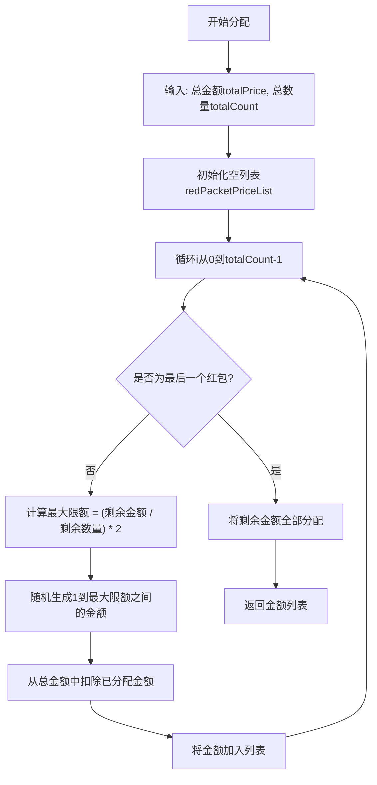
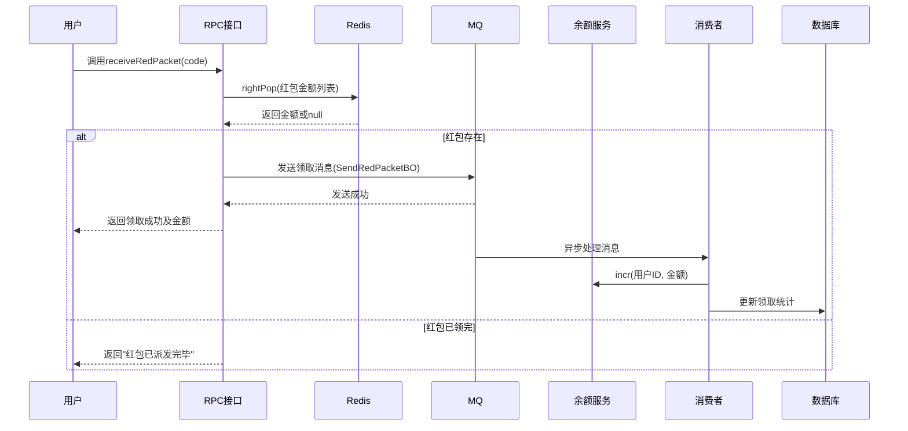
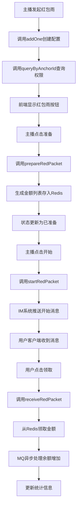
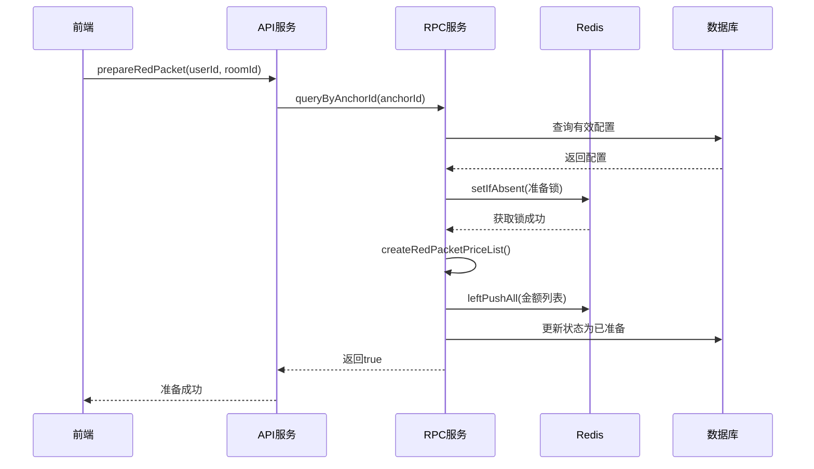
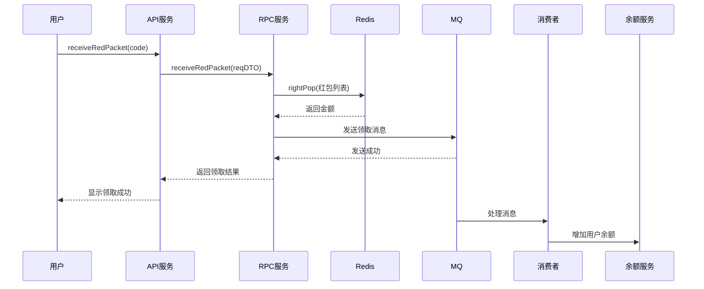

# 红包雨RPC接口

<cite>
**本文档引用文件**  
- [IRedPacketConfigRPC.java](file://live-gift-interface/src/main/java/com/logilong/live/gift/interfaces/IRedPacketConfigRPC.java)
- [RedPacketConfigReqDTO.java](file://live-gift-interface/src/main/java/com/logilong/live/gift/dto/RedPacketConfigReqDTO.java)
- [RedPacketConfigRespDTO.java](file://live-gift-interface/src/main/java/com/logilong/live/gift/dto/RedPacketConfigRespDTO.java)
- [RedPacketConfigRPCImpl.java](file://live-gift-provider/src/main/java/com/logilong/live/gift/provider/rpc/RedPacketConfigRPCImpl.java)
- [RedPacketConfigServiceImpl.java](file://live-gift-provider/src/main/java/com/logilong/live/gift/provider/service/impl/RedPacketConfigServiceImpl.java)
- [RedPacketConfigPO.java](file://live-gift-provider/src/main/java/com/logilong/live/gift/provider/dao/po/RedPacketConfigPO.java)
- [RedPacketStatusEnum.java](file://live-gift-interface/src/main/java/com/logilong/live/gift/constants/RedPacketStatusEnum.java)
- [ReceiveRedPacketConsumer.java](file://live-gift-provider/src/main/java/com/logilong/live/gift/provider/consumer/ReceiveRedPacketConsumer.java)
- [GiftProviderCacheKeyBuilder.java](file://live-framework/live-framework-redis-starter/src/main/java/com/logilong/live/framework/redis/starter/key/GiftProviderCacheKeyBuilder.java)
- [LivingRoomServiceImpl.java](file://live-api/src/main/java/com/logilong/live/api/service/impl/LivingRoomServiceImpl.java)
</cite>

## 目录
1. [简介](#简介)
2. [核心接口说明](#核心接口说明)
3. [数据对象定义](#数据对象定义)
4. [红包金额分配算法](#红包金额分配算法)
5. [领取逻辑与并发控制](#领取逻辑与并发控制)
6. [红包雨业务流程图](#红包雨业务流程图)
7. [安全防护与防刷策略](#安全防护与防刷策略)
8. [调用时序分析](#调用时序分析)

## 简介
红包雨功能是直播平台中增强用户互动的重要功能，允许主播向直播间观众发放虚拟红包。本系统通过RPC接口实现红包配置、准备、启动和领取等全流程管理，采用Redis分布式缓存和RocketMQ异步处理机制，确保高并发场景下的性能与数据一致性。

**Section sources**
- [IRedPacketConfigRPC.java](file://live-gift-interface/src/main/java/com/logilong/live/gift/interfaces/IRedPacketConfigRPC.java)
- [RedPacketConfigServiceImpl.java](file://live-gift-provider/src/main/java/com/logilong/live/gift/provider/service/impl/RedPacketConfigServiceImpl.java)

## 核心接口说明

### queryByAnchorId - 主播权限查询
该接口用于查询主播是否具备发起红包雨的权限。系统根据主播ID在数据库中查找有效的红包配置记录（状态非“已发送”），返回配置信息以供前端判断是否显示红包雨按钮。

**Section sources**
- [IRedPacketConfigRPC.java](file://live-gift-interface/src/main/java/com/logilong/live/gift/interfaces/IRedPacketConfigRPC.java#L12)
- [RedPacketConfigServiceImpl.java](file://live-gift-provider/src/main/java/com/logilong/live/gift/provider/service/impl/RedPacketConfigServiceImpl.java#L63-L71)

### updateById - 配置更新
更新已有红包雨配置信息。接收`RedPacketConfigRespDTO`对象，将其转换为持久化对象后更新数据库记录。主要用于修改红包总金额、数量等参数。

**Section sources**
- [IRedPacketConfigRPC.java](file://live-gift-interface/src/main/java/com/logilong/live/gift/interfaces/IRedPacketConfigRPC.java#L17)
- [RedPacketConfigServiceImpl.java](file://live-gift-provider/src/main/java/com/logilong/live/gift/provider/service/impl/RedPacketConfigServiceImpl.java#L90-L92)

### addOne - 新增配置
为主播新增红包雨配置。系统自动生成唯一配置码（UUID），插入数据库。此操作通常在主播首次设置红包雨时调用。

**Section sources**
- [IRedPacketConfigRPC.java](file://live-gift-interface/src/main/java/com/logilong/live/gift/interfaces/IRedPacketConfigRPC.java#L22)
- [RedPacketConfigServiceImpl.java](file://live-gift-provider/src/main/java/com/logilong/live/gift/provider/service/impl/RedPacketConfigServiceImpl.java#L84-L87)

### prepareRedPacket - 准备金额
主播点击“准备红包”时调用。系统执行以下操作：
1. 查询主播当前有效配置
2. 使用Redis分布式锁防止重复准备
3. 采用“二倍均值法”生成红包金额列表
4. 将金额列表分批存入Redis List结构
5. 更新配置状态为“已准备”

**Section sources**
- [IRedPacketConfigRPC.java](file://live-gift-interface/src/main/java/com/logilong/live/gift/interfaces/IRedPacketConfigRPC.java#L27)
- [RedPacketConfigServiceImpl.java](file://live-gift-provider/src/main/java/com/logilong/live/gift/provider/service/impl/RedPacketConfigServiceImpl.java#L95-L121)

### receiveRedPacket - 领取红包
用户点击领取时调用。系统从Redis List右侧弹出一个金额（保证原子性），发送MQ消息进行异步处理，并返回领取结果。若列表为空则表示红包已领完。

**Section sources**
- [IRedPacketConfigRPC.java](file://live-gift-interface/src/main/java/com/logilong/live/gift/interfaces/IRedPacketConfigRPC.java#L32)
- [RedPacketConfigServiceImpl.java](file://live-gift-provider/src/main/java/com/logilong/live/gift/provider/service/impl/RedPacketConfigServiceImpl.java#L172-L198)

### startRedPacket - 启动红包雨
主播点击“开始红包雨”时调用。系统验证红包已准备且未启动过，然后通过IM系统向直播间所有在线用户推送“开始抢红包”消息，触发客户端领取界面展示。

**Section sources**
- [IRedPacketConfigRPC.java](file://live-gift-interface/src/main/java/com/logilong/live/gift/interfaces/IRedPacketConfigRPC.java#L37)
- [RedPacketConfigServiceImpl.java](file://live-gift-provider/src/main/java/com/logilong/live/gift/provider/service/impl/RedPacketConfigServiceImpl.java#L125-L153)

## 数据对象定义

### RedPacketConfigReqDTO 请求数据对象
| 字段 | 类型 | 说明 |
|------|------|------|
| id | Integer | 配置ID |
| roomId | Integer | 直播间ID |
| status | Integer | 状态 |
| userId | Long | 用户ID |
| redPacketConfigCode | String | 红包配置码 |
| totalPrice | Integer | 总金额（单位：分） |
| totalCount | Integer | 红包总数 |
| remark | String | 备注 |

**Section sources**
- [RedPacketConfigReqDTO.java](file://live-gift-interface/src/main/java/com/logilong/live/gift/dto/RedPacketConfigReqDTO.java)

### RedPacketConfigRespDTO 响应数据对象
| 字段 | 类型 | 说明 |
|------|------|------|
| anchorId | Long | 主播ID |
| totalPrice | Integer | 总金额 |
| totalCount | Integer | 红包总数 |
| configCode | String | 配置码 |
| remark | String | 备注 |

**Section sources**
- [RedPacketConfigRespDTO.java](file://live-gift-interface/src/main/java/com/logilong/live/gift/dto/RedPacketConfigRespDTO.java)

### 业务规则
- **anchorId**: 主播唯一标识，用于权限校验和配置查询
- **totalAmount**: 红包总金额，单位为平台虚拟币（如直播币），最小单位为1
- **packetNum**: 红包总数量，需大于0
- **minAmount**: 单个红包最小金额为1
- **maxAmount**: 单个红包最大金额不超过剩余平均金额的2倍（二倍均值法）

## 红包金额分配算法

系统采用“二倍均值法”进行红包金额分配，确保公平性和随机性。

**Diagram sources**
- [RedPacketConfigServiceImpl.java](file://live-gift-provider/src/main/java/com/logilong/live/gift/provider/service/impl/RedPacketConfigServiceImpl.java#L224-L238)

**Section sources**
- [RedPacketConfigServiceImpl.java](file://live-gift-provider/src/main/java/com/logilong/live/gift/provider/service/impl/RedPacketConfigServiceImpl.java#L224-L238)

## 领取逻辑与并发控制

### 领取流程

**Diagram sources**
- [RedPacketConfigServiceImpl.java](file://live-gift-provider/src/main/java/com/logilong/live/gift/provider/service/impl/RedPacketConfigServiceImpl.java#L172-L198)
- [ReceiveRedPacketConsumer.java](file://live-gift-provider/src/main/java/com/logilong/live/gift/provider/consumer/ReceiveRedPacketConsumer.java)

### 并发控制机制
系统使用Redis分布式锁保障关键操作的原子性：

1. **准备阶段锁**：`red_packet_init_lock:{code}`，防止同一红包被重复准备
2. **领取阶段**：Redis List的`rightPop`操作本身具有原子性，确保每个红包仅被领取一次
3. **通知阶段锁**：`red_packet_notify:{code}`，防止重复发送开始消息

**Section sources**
- [RedPacketConfigServiceImpl.java](file://live-gift-provider/src/main/java/com/logilong/live/gift/provider/service/impl/RedPacketConfigServiceImpl.java#L102-L105)
- [GiftProviderCacheKeyBuilder.java](file://live-framework/live-framework-redis-starter/src/main/java/com/logilong/live/framework/redis/starter/key/GiftProviderCacheKeyBuilder.java)

## 红包雨业务流程图

**Diagram sources**
- [RedPacketConfigServiceImpl.java](file://live-gift-provider/src/main/java/com/logilong/live/gift/provider/service/impl/RedPacketConfigServiceImpl.java)
- [LivingRoomServiceImpl.java](file://live-api/src/main/java/com/logilong/live/api/service/impl/LivingRoomServiceImpl.java)

## 安全防护与防刷策略

### 安全措施
1. **权限校验**：所有操作均需验证用户身份，通过网关拦截器获取`userId`
2. **幂等性控制**：通过Redis锁和状态机防止重复操作
3. **数据一致性**：关键操作使用数据库事务和MQ可靠投递
4. **输入验证**：对金额、数量等参数进行合法性校验

### 防刷策略
1. **频率限制**：通过`live-framework-web-starter`中的`RequestLimit`注解限制接口调用频率
2. **身份绑定**：领取操作绑定用户ID，防止同一用户重复领取
3. **状态控制**：红包状态机（待准备→已准备→已发送）防止非法状态迁移
4. **日志审计**：记录关键操作日志，便于异常行为追踪

**Section sources**
- [LiveUserInfoInterceptor.java](file://live-framework/live-framework-web-starter/src/main/java/com/logilong/live/web/starter/context/LiveUserInfoInterceptor.java)
- [RedPacketConfigServiceImpl.java](file://live-gift-provider/src/main/java/com/logilong/live/gift/provider/service/impl/RedPacketConfigServiceImpl.java)

## 调用时序分析

**Diagram sources**
- [LivingRoomServiceImpl.java](file://live-api/src/main/java/com/logilong/live/api/service/impl/LivingRoomServiceImpl.java#L123-L127)
- [RedPacketConfigServiceImpl.java](file://live-gift-provider/src/main/java/com/logilong/live/gift/provider/service/impl/RedPacketConfigServiceImpl.java#L172-L198)

**Section sources**
- [LivingRoomServiceImpl.java](file://live-api/src/main/java/com/logilong/live/api/service/impl/LivingRoomServiceImpl.java)
- [RedPacketConfigServiceImpl.java](file://live-gift-provider/src/main/java/com/logilong/live/gift/provider/service/impl/RedPacketConfigServiceImpl.java)