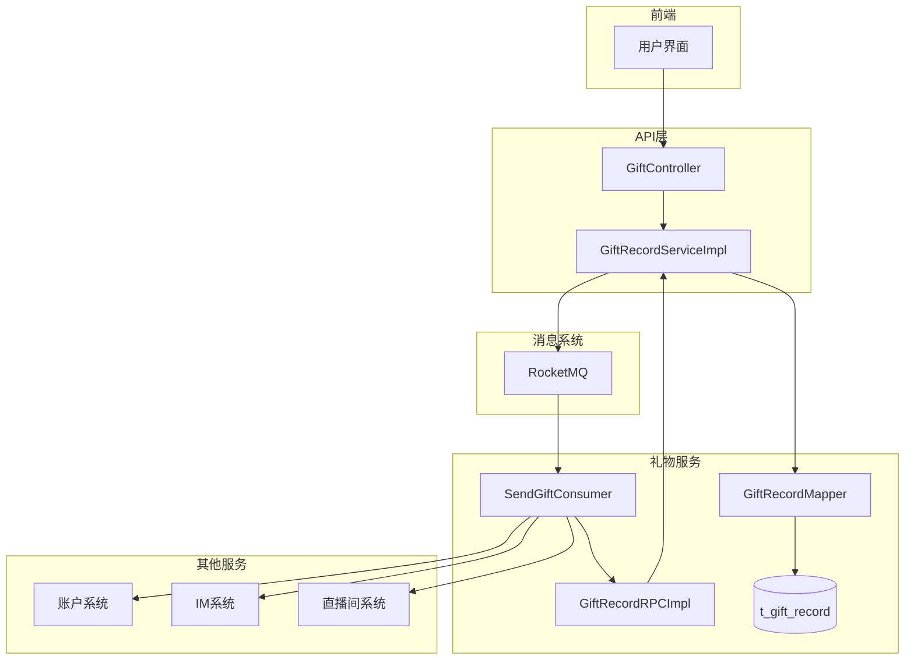
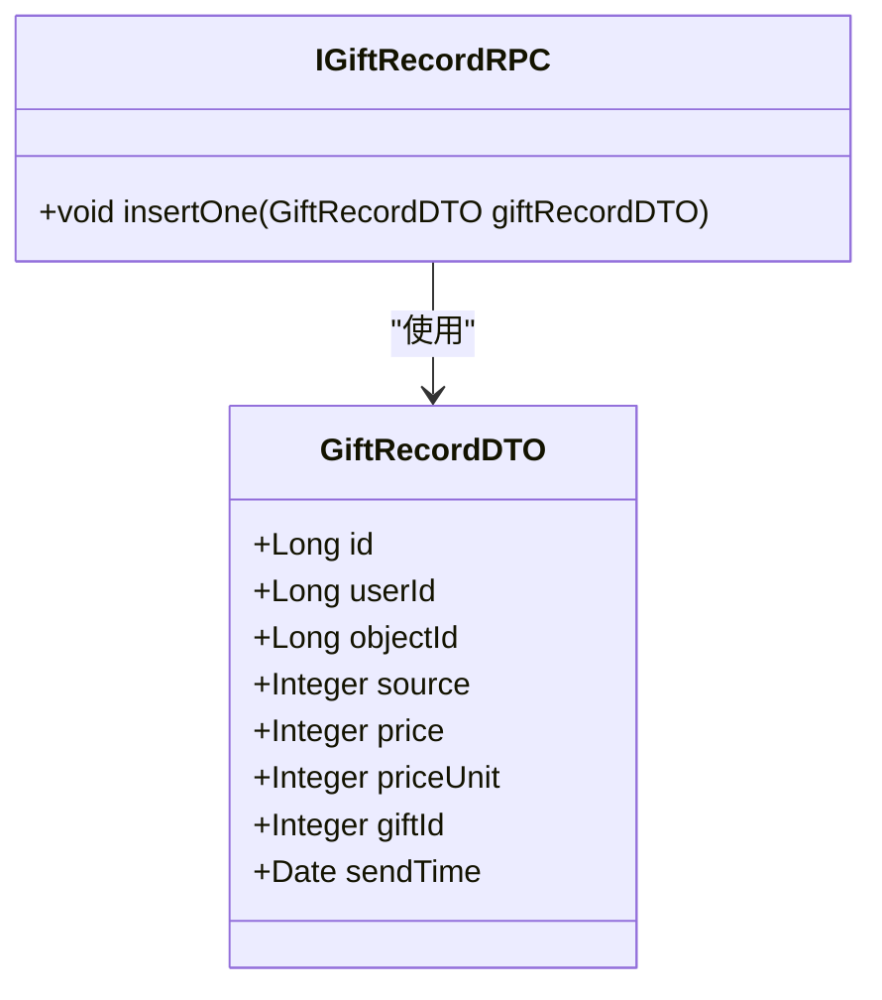
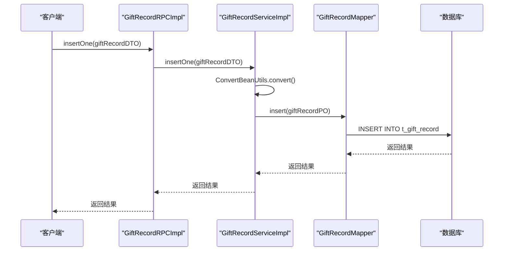
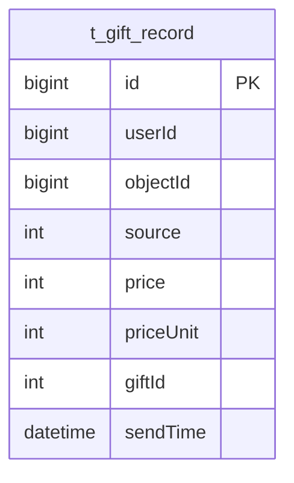
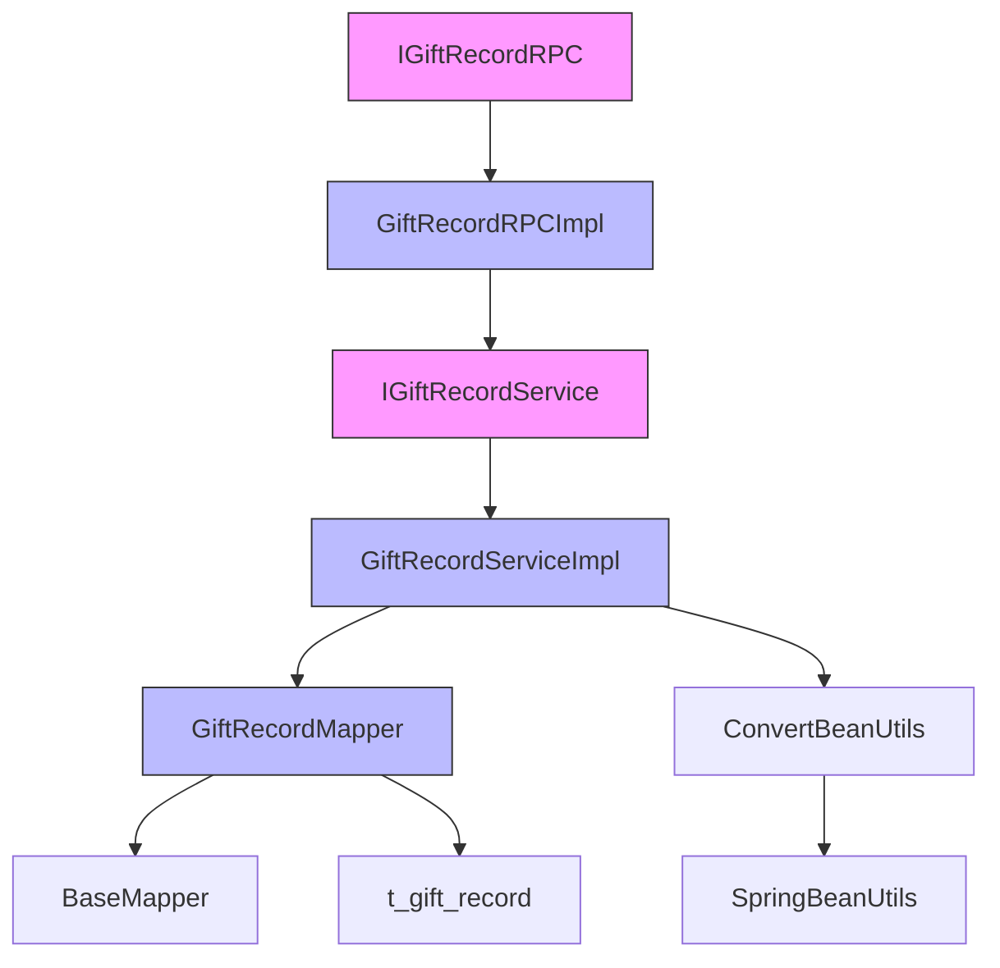

# 送礼记录RPC接口

<cite>
**本文档引用文件**   
- [IGiftRecordRPC.java](file://live-gift-interface/src/main/java/com/logilong/live/gift/interfaces/IGiftRecordRPC.java)
- [GiftRecordDTO.java](file://live-gift-interface/src/main/java/com/logilong/live/gift/dto/GiftRecordDTO.java)
- [GiftRecordRPCImpl.java](file://live-gift-provider/src/main/java/com/logilong/live/gift/provider/rpc/GiftRecordRPCImpl.java)
- [GiftRecordServiceImpl.java](file://live-gift-provider/src/main/java/com/logilong/live/gift/provider/service/impl/GiftRecordServiceImpl.java)
- [GiftRecordMapper.java](file://live-gift-provider/src/main/java/com/logilong/live/gift/provider/dao/mapper/GiftRecordMapper.java)
- [GiftRecordPO.java](file://live-gift-provider/src/main/java/com/logilong/live/gift/provider/dao/po/GiftRecordPO.java)
- [SendGiftConsumer.java](file://live-gift-provider/src/main/java/com/logilong/live/gift/provider/consumer/SendGiftConsumer.java)
- [GiftServiceImpl.java](file://live-api/src/main/java/com/logilong/live/api/service/impl/GiftServiceImpl.java)
- [SendGiftMq.java](file://live-common-interface/src/main/java/com/logilong/live/common/interfaces/dto/SendGiftMq.java)
</cite>

## 目录
1. [介绍](#介绍)
2. [核心组件](#核心组件)
3. [架构概览](#架构概览)
4. [详细组件分析](#详细组件分析)
5. [依赖分析](#依赖分析)
6. [性能考虑](#性能考虑)
7. [故障排除指南](#故障排除指南)
8. [结论](#结论)

## 介绍
本文档详细记录了送礼记录RPC接口的功能，重点描述了IGiftRecordRPC接口中insertOne方法的业务逻辑。文档深入解析了GiftRecordDTO中关键字段的业务含义，说明了该接口在用户送礼业务流程中的位置，以及与IM系统、账户系统和消息系统的交互关系。同时提供了接口调用的时序图和异常处理策略，包括重复送礼的幂等性处理方案，并记录了该接口的性能监控指标和日志追踪方法。

## 核心组件

送礼记录RPC接口的核心组件包括IGiftRecordRPC接口、GiftRecordDTO数据传输对象、GiftRecordRPCImpl RPC实现类、GiftRecordServiceImpl服务实现类以及底层的DAO组件。这些组件共同协作，实现了送礼记录的持久化功能。

**组件来源**
- [IGiftRecordRPC.java](file://live-gift-interface/src/main/java/com/logilong/live/gift/interfaces/IGiftRecordRPC.java#L5-L10)
- [GiftRecordDTO.java](file://live-gift-interface/src/main/java/com/logilong/live/gift/dto/GiftRecordDTO.java#L10-L23)
- [GiftRecordRPCImpl.java](file://live-gift-provider/src/main/java/com/logilong/live/gift/provider/rpc/GiftRecordRPCImpl.java#L11-L20)
- [GiftRecordServiceImpl.java](file://live-gift-provider/src/main/java/com/logilong/live/gift/provider/service/impl/GiftRecordServiceImpl.java#L13-L23)

## 架构概览

送礼记录功能的架构涉及多个系统组件的协同工作。用户通过API发起送礼请求，该请求通过消息队列异步处理，最终调用送礼记录RPC接口完成数据持久化。

**图表来源**
- [GiftServiceImpl.java](file://live-api/src/main/java/com/logilong/live/api/service/impl/GiftServiceImpl.java#L31-L76)
- [SendGiftConsumer.java](file://live-gift-provider/src/main/java/com/logilong/live/gift/provider/consumer/SendGiftConsumer.java#L1-L212)
- [GiftRecordRPCImpl.java](file://live-gift-provider/src/main/java/com/logilong/live/gift/provider/rpc/GiftRecordRPCImpl.java#L11-L20)

## 详细组件分析

### IGiftRecordRPC接口分析
IGiftRecordRPC接口定义了送礼记录的核心功能，目前主要提供insertOne方法用于插入送礼记录。

**图表来源**
- [IGiftRecordRPC.java](file://live-gift-interface/src/main/java/com/logilong/live/gift/interfaces/IGiftRecordRPC.java#L5-L10)
- [GiftRecordDTO.java](file://live-gift-interface/src/main/java/com/logilong/live/gift/dto/GiftRecordDTO.java#L10-L23)

### insertOne方法业务逻辑分析
insertOne方法的业务逻辑主要涉及数据转换和持久化操作。该方法通过服务层调用，将DTO对象转换为PO对象并插入数据库。

**图表来源**
- [GiftRecordRPCImpl.java](file://live-gift-provider/src/main/java/com/logilong/live/gift/provider/rpc/GiftRecordRPCImpl.java#L17-L19)
- [GiftRecordServiceImpl.java](file://live-gift-provider/src/main/java/com/logilong/live/gift/provider/service/impl/GiftRecordServiceImpl.java#L19-L22)
- [GiftRecordMapper.java](file://live-gift-provider/src/main/java/com/logilong/live/gift/provider/dao/mapper/GiftRecordMapper.java#L9-L10)

### 数据完整性约束分析
送礼记录的数据完整性通过数据库表结构和应用层逻辑共同保证。t_gift_record表定义了必要的字段来确保数据的完整性和一致性。

**图表来源**
- [GiftRecordPO.java](file://live-gift-provider/src/main/java/com/logilong/live/gift/provider/dao/po/GiftRecordPO.java#L11-L24)

## 依赖分析

送礼记录RPC接口依赖于多个系统组件，包括数据转换工具、数据库访问组件和分布式服务框架。

**图表来源**
- [GiftRecordRPCImpl.java](file://live-gift-provider/src/main/java/com/logilong/live/gift/provider/rpc/GiftRecordRPCImpl.java#L14-L18)
- [GiftRecordServiceImpl.java](file://live-gift-provider/src/main/java/com/logilong/live/gift/provider/service/impl/GiftRecordServiceImpl.java#L16-L17)
- [ConvertBeanUtils.java](file://live-common-interface/src/main/java/com/logilong/live/common/interfaces/utils/ConvertBeanUtils.java#L20-L26)

**组件来源**
- [GiftRecordRPCImpl.java](file://live-gift-provider/src/main/java/com/logilong/live/gift/provider/rpc/GiftRecordRPCImpl.java#L1-L20)
- [GiftRecordServiceImpl.java](file://live-gift-provider/src/main/java/com/logilong/live/gift/provider/service/impl/GiftRecordServiceImpl.java#L1-L23)
- [ConvertBeanUtils.java](file://live-common-interface/src/main/java/com/logilong/live/common/interfaces/utils/ConvertBeanUtils.java#L1-L55)

## 性能考虑

送礼记录接口的性能主要受数据库写入性能和序列化/反序列化开销的影响。由于该接口通常通过消息队列异步调用，对实时性要求相对较低，但需要保证高吞吐量和数据一致性。

在高并发场景下，数据库写入可能成为性能瓶颈，建议通过分库分表策略来提升写入性能。同时，对象转换操作（DTO到PO）也存在一定开销，但目前使用Spring的BeanUtils进行属性拷贝，性能表现良好。

## 故障排除指南

### 常见问题及解决方案
1. **送礼记录未持久化**：检查消息队列消费者是否正常运行，确认SendGiftConsumer是否成功消费消息并调用insertOne方法。
2. **数据不一致**：检查事务处理逻辑，确保在账户扣款和送礼记录写入之间保持一致性。
3. **性能下降**：监控数据库写入性能，检查是否存在慢查询，考虑对t_gift_record表进行分库分表。

### 日志追踪方法
系统通过多层级日志记录来追踪送礼记录的处理流程：
- API层记录送礼请求的接收
- 消息队列记录消息的发送和消费
- RPC层记录insertOne方法的调用
- 数据库层记录具体的SQL执行

通过关联UUID或业务流水号，可以完整追踪一次送礼操作的全流程。

**组件来源**
- [SendGiftConsumer.java](file://live-gift-provider/src/main/java/com/logilong/live/gift/provider/consumer/SendGiftConsumer.java#L125-L126)
- [GiftServiceImpl.java](file://live-api/src/main/java/com/logilong/live/api/service/impl/GiftServiceImpl.java#L70-L73)

## 结论

送礼记录RPC接口是直播平台礼物系统的核心组件之一，负责持久化用户的送礼行为。该接口通过简洁的insertOne方法提供了送礼记录的写入功能，与消息系统、账户系统和IM系统紧密协作，实现了完整的送礼业务流程。

接口设计遵循了微服务架构的最佳实践，通过DTO进行数据传输，使用Dubbo作为RPC框架，保证了服务间的解耦。数据持久化通过MyBatis-Plus实现，简化了数据库操作。整个送礼流程采用异步处理模式，通过RocketMQ消息队列解耦业务逻辑，提高了系统的可扩展性和可靠性。

未来优化方向包括对t_gift_record表进行分库分表以支持更大规模的数据存储，以及引入更完善的监控和告警机制来保障服务的稳定性。