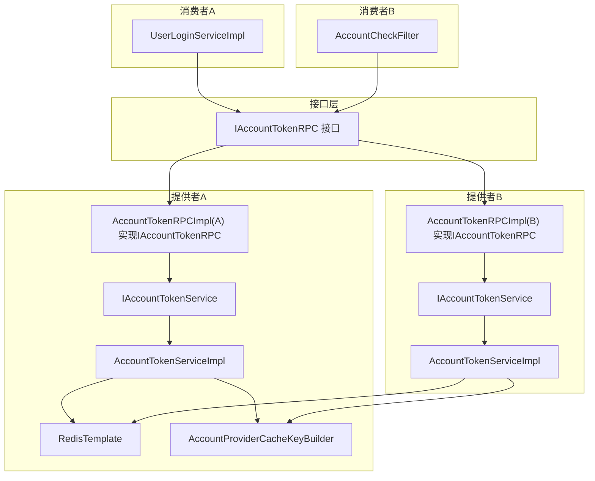
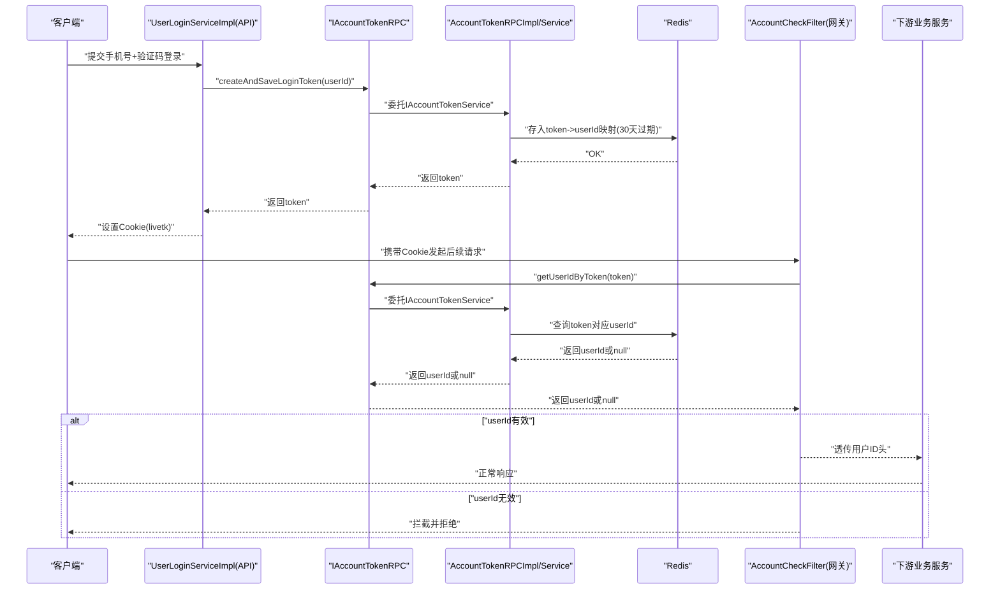
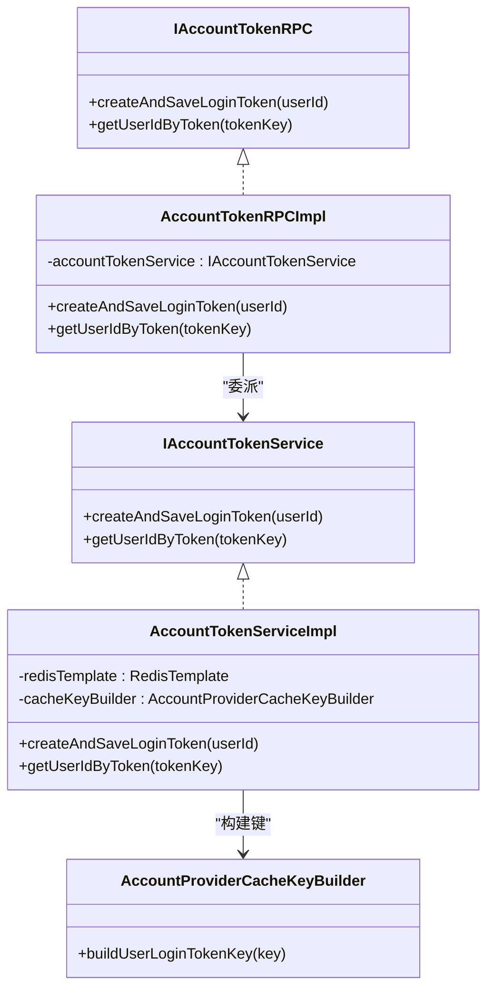
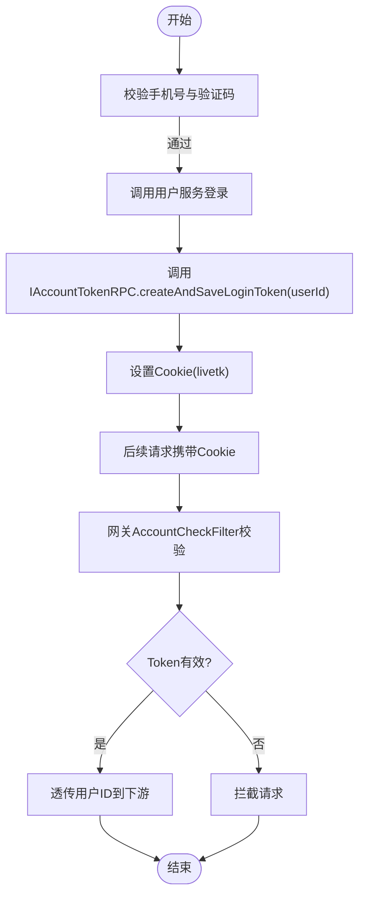
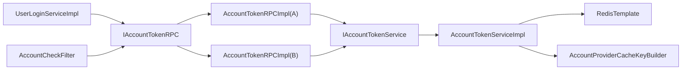

# 账户服务RPC接口

<cite>
**本文引用的文件**
- [IAccountTokenRPC.java](file://live-account-interface/src/main/java/com/logilong/live/account/interfaces/IAccountTokenRPC.java)
- [AccountTokenRPCImpl.java](file://live-account-provider/src/main/java/com/logilong/live/account/provider/rpc/AccountTokenRPCImpl.java)
- [AccountTokenRPCImpl.java](file://live-user-provider/src/main/java/com/logilong/live/user/provider/rpc/AccountTokenRPCImpl.java)
- [IAccountTokenService.java](file://live-account-provider/src/main/java/com/logilong/live/account/provider/service/IAccountTokenService.java)
- [AccountTokenServiceImpl.java](file://live-account-provider/src/main/java/com/logilong/live/account/provider/service/impl/AccountTokenServiceImpl.java)
- [AccountProviderCacheKeyBuilder.java](file://live-framework/live-framework-redis-starter/src/main/java/com/logilong/live/framework/redis/starter/key/AccountProviderCacheKeyBuilder.java)
- [RedisConfig.java](file://live-framework/live-framework-redis-starter/src/main/java/com/logilong/live/framework/redis/starter/config/RedisConfig.java)
- [RedisKeyBuilder.java](file://live-framework/live-framework-redis-starter/src/main/java/com/logilong/live/framework/redis/starter/key/RedisKeyBuilder.java)
- [UserLoginServiceImpl.java](file://live-api/src/main/java/com/logilong/live/api/service/impl/UserLoginServiceImpl.java)
- [AccountCheckFilter.java](file://live-gateway/src/main/java/com/logilong/live/gateway/filter/AccountCheckFilter.java)
- [GatewayApplicationProperties.java](file://live-gateway/src/main/java/com/logilong/live/gateway/properties/GatewayApplicationProperties.java)
- [GatewayHeaderEnum.java](file://live-common-interface/src/main/java/com/logilong/live/common/interfaces/enums/GatewayHeaderEnum.java)
- [pom.xml](file://live-account-interface/pom.xml)
- [pom.xml](file://live-account-provider/pom.xml)
- [pom.xml](file://live-api/pom.xml)
</cite>

## 目录
1. [简介](#简介)
2. [项目结构](#项目结构)
3. [核心组件](#核心组件)
4. [架构总览](#架构总览)
5. [详细组件分析](#详细组件分析)
6. [依赖关系分析](#依赖关系分析)
7. [性能与扩展性](#性能与扩展性)
8. [故障排查指南](#故障排查指南)
9. [结论](#结论)
10. [附录：Dubbo服务引用配置示例](#附录dubbo服务引用配置示例)

## 简介
本文件围绕IAccountTokenRPC接口展开，系统性阐述其在用户认证流程中的核心作用，包括：
- createAndSaveLoginToken方法如何生成并持久化用户Token；
- getUserIdByToken方法如何校验Token有效性并返回用户ID；
- 在Spring Boot应用中通过@DubboReference注入该接口的实践；
- Token的存储机制（Redis）、过期策略及安全性考虑（如防重放攻击）；
- 结合live-user-provider中的UserLoginServiceImpl说明实际调用场景。

## 项目结构
IAccountTokenRPC位于独立的接口模块，由两个提供者模块分别实现：
- live-account-provider：提供者A，实现IAccountTokenRPC并通过IAccountTokenService操作Redis；
- live-user-provider：提供者B，同样实现IAccountTokenRPC，但委托给IAccountTokenService；
- live-api：消费者A，使用@DubboReference注入IAccountTokenRPC，完成登录后下发Cookie；
- live-gateway：消费者B，使用@DubboReference注入IAccountTokenRPC，在全局过滤器中校验Cookie中的Token并透传用户ID。

图表来源
- [IAccountTokenRPC.java](file://live-account-interface/src/main/java/com/logilong/live/account/interfaces/IAccountTokenRPC.java#L1-L22)
- [AccountTokenRPCImpl.java](file://live-account-provider/src/main/java/com/logilong/live/account/provider/rpc/AccountTokenRPCImpl.java#L1-L24)
- [AccountTokenRPCImpl.java](file://live-user-provider/src/main/java/com/logilong/live/user/provider/rpc/AccountTokenRPCImpl.java#L1-L25)
- [IAccountTokenService.java](file://live-account-provider/src/main/java/com/logilong/live/account/provider/service/IAccountTokenService.java#L1-L16)
- [AccountTokenServiceImpl.java](file://live-account-provider/src/main/java/com/logilong/live/account/provider/service/impl/AccountTokenServiceImpl.java#L1-L33)
- [AccountProviderCacheKeyBuilder.java](file://live-framework/live-framework-redis-starter/src/main/java/com/logilong/live/framework/redis/starter/key/AccountProviderCacheKeyBuilder.java#L1-L18)
- [RedisConfig.java](file://live-framework/live-framework-redis-starter/src/main/java/com/logilong/live/framework/redis/starter/config/RedisConfig.java#L1-L27)
- [UserLoginServiceImpl.java](file://live-api/src/main/java/com/logilong/live/api/service/impl/UserLoginServiceImpl.java#L1-L88)
- [AccountCheckFilter.java](file://live-gateway/src/main/java/com/logilong/live/gateway/filter/AccountCheckFilter.java#L1-L101)

章节来源
- [pom.xml](file://live-account-interface/pom.xml#L1-L13)
- [pom.xml](file://live-account-provider/pom.xml#L1-L62)
- [pom.xml](file://live-api/pom.xml#L1-L121)

## 核心组件
- IAccountTokenRPC：定义两类能力
  - createAndSaveLoginToken：为指定用户创建并保存登录Token；
  - getUserIdByToken：校验Token并返回绑定的用户ID。
- IAccountTokenService：服务层接口，封装具体实现细节；
- AccountTokenServiceImpl：基于Redis的实现，负责Token生成、存储与读取；
- AccountProviderCacheKeyBuilder：统一构建Redis键前缀与命名空间；
- UserLoginServiceImpl：在登录流程中调用IAccountTokenRPC创建Token并下发Cookie；
- AccountCheckFilter：在网关层校验Cookie中的Token并透传用户ID。

章节来源
- [IAccountTokenRPC.java](file://live-account-interface/src/main/java/com/logilong/live/account/interfaces/IAccountTokenRPC.java#L1-L22)
- [IAccountTokenService.java](file://live-account-provider/src/main/java/com/logilong/live/account/provider/service/IAccountTokenService.java#L1-L16)
- [AccountTokenServiceImpl.java](file://live-account-provider/src/main/java/com/logilong/live/account/provider/service/impl/AccountTokenServiceImpl.java#L1-L33)
- [AccountProviderCacheKeyBuilder.java](file://live-framework/live-framework-redis-starter/src/main/java/com/logilong/live/framework/redis/starter/key/AccountProviderCacheKeyBuilder.java#L1-L18)
- [UserLoginServiceImpl.java](file://live-api/src/main/java/com/logilong/live/api/service/impl/UserLoginServiceImpl.java#L1-L88)
- [AccountCheckFilter.java](file://live-gateway/src/main/java/com/logilong/live/gateway/filter/AccountCheckFilter.java#L1-L101)

## 架构总览
IAccountTokenRPC贯穿“登录下发Token”和“请求鉴权”两条主线：
- 登录侧：API服务调用IAccountTokenRPC生成Token，写入Cookie；
- 鉴权侧：网关过滤器从Cookie提取Token，调用IAccountTokenRPC校验，失败则拦截，成功则透传用户ID给下游。

图表来源
- [UserLoginServiceImpl.java](file://live-api/src/main/java/com/logilong/live/api/service/impl/UserLoginServiceImpl.java#L1-L88)
- [IAccountTokenRPC.java](file://live-account-interface/src/main/java/com/logilong/live/account/interfaces/IAccountTokenRPC.java#L1-L22)
- [AccountTokenRPCImpl.java](file://live-account-provider/src/main/java/com/logilong/live/account/provider/rpc/AccountTokenRPCImpl.java#L1-L24)
- [AccountTokenServiceImpl.java](file://live-account-provider/src/main/java/com/logilong/live/account/provider/service/impl/AccountTokenServiceImpl.java#L1-L33)
- [AccountCheckFilter.java](file://live-gateway/src/main/java/com/logilong/live/gateway/filter/AccountCheckFilter.java#L1-L101)

## 详细组件分析

### IAccountTokenRPC接口与职责
- createAndSaveLoginToken：为用户生成唯一Token并持久化，返回可下发的字符串Token；
- getUserIdByToken：校验Token有效性，返回绑定的用户ID；若无效返回空值。

章节来源
- [IAccountTokenRPC.java](file://live-account-interface/src/main/java/com/logilong/live/account/interfaces/IAccountTokenRPC.java#L1-L22)

### 提供者A：AccountTokenRPCImpl与AccountTokenServiceImpl
- AccountTokenRPCImpl：作为Dubbo服务暴露IAccountTokenRPC，内部委派给IAccountTokenService；
- AccountTokenServiceImpl：
  - 生成UUID作为Token；
  - 使用AccountProviderCacheKeyBuilder构建Redis键，存入userId，设置30天过期；
  - 校验时按相同键规则读取，返回userId或空。

图表来源
- [AccountTokenRPCImpl.java](file://live-account-provider/src/main/java/com/logilong/live/account/provider/rpc/AccountTokenRPCImpl.java#L1-L24)
- [IAccountTokenService.java](file://live-account-provider/src/main/java/com/logilong/live/account/provider/service/IAccountTokenService.java#L1-L16)
- [AccountTokenServiceImpl.java](file://live-account-provider/src/main/java/com/logilong/live/account/provider/service/impl/AccountTokenServiceImpl.java#L1-L33)
- [AccountProviderCacheKeyBuilder.java](file://live-framework/live-framework-redis-starter/src/main/java/com/logilong/live/framework/redis/starter/key/AccountProviderCacheKeyBuilder.java#L1-L18)

章节来源
- [AccountTokenRPCImpl.java](file://live-account-provider/src/main/java/com/logilong/live/account/provider/rpc/AccountTokenRPCImpl.java#L1-L24)
- [AccountTokenServiceImpl.java](file://live-account-provider/src/main/java/com/logilong/live/account/provider/service/impl/AccountTokenServiceImpl.java#L1-L33)
- [AccountProviderCacheKeyBuilder.java](file://live-framework/live-framework-redis-starter/src/main/java/com/logilong/live/framework/redis/starter/key/AccountProviderCacheKeyBuilder.java#L1-L18)

### 提供者B：UserProvider侧的AccountTokenRPCImpl
- 同样实现IAccountTokenRPC，委派给IAccountTokenService；
- 与提供者A共享相同的Redis存储策略与键命名规范。

章节来源
- [AccountTokenRPCImpl.java](file://live-user-provider/src/main/java/com/logilong/live/user/provider/rpc/AccountTokenRPCImpl.java#L1-L25)

### Redis存储机制与过期策略
- 键命名：通过AccountProviderCacheKeyBuilder在RedisKeyBuilder基础上拼接前缀与分隔符，形成统一命名空间；
- 存储内容：以“token”为键，存储“userId”字符串；
- 过期策略：设置30天TTL，到期自动清理，降低长期占用与泄露风险；
- 序列化：RedisConfig中配置了合适的序列化策略，确保对象类型安全存储。

章节来源
- [AccountProviderCacheKeyBuilder.java](file://live-framework/live-framework-redis-starter/src/main/java/com/logilong/live/framework/redis/starter/key/AccountProviderCacheKeyBuilder.java#L1-L18)
- [RedisKeyBuilder.java](file://live-framework/live-framework-redis-starter/src/main/java/com/logilong/live/framework/redis/starter/key/RedisKeyBuilder.java#L1-L22)
- [RedisConfig.java](file://live-framework/live-framework-redis-starter/src/main/java/com/logilong/live/framework/redis/starter/config/RedisConfig.java#L1-L27)
- [AccountTokenServiceImpl.java](file://live-account-provider/src/main/java/com/logilong/live/account/provider/service/impl/AccountTokenServiceImpl.java#L1-L33)

### 安全性考虑与防重放攻击
- Token强度：采用UUID生成，具备足够熵值，降低碰撞概率；
- 过期控制：30天有效期，缩短Token生命周期，降低长期滥用风险；
- Cookie策略：API侧设置Cookie域、路径与Max-Age，配合HTTPS可进一步提升安全性；
- 网关拦截：AccountCheckFilter在网关层统一校验，无效Token直接拦截，避免进入下游；
- 白名单机制：GatewayApplicationProperties支持配置无需校验的URL列表，便于开放登录等接口；
- 用户ID透传：通过GatewayHeaderEnum.USER_LOGIN_ID将userId透传至下游，便于业务侧统一鉴权。

章节来源
- [UserLoginServiceImpl.java](file://live-api/src/main/java/com/logilong/live/api/service/impl/UserLoginServiceImpl.java#L1-L88)
- [AccountCheckFilter.java](file://live-gateway/src/main/java/com/logilong/live/gateway/filter/AccountCheckFilter.java#L1-L101)
- [GatewayApplicationProperties.java](file://live-gateway/src/main/java/com/logilong/live/gateway/properties/GatewayApplicationProperties.java#L1-L17)
- [GatewayHeaderEnum.java](file://live-common-interface/src/main/java/com/logilong/live/common/interfaces/enums/GatewayHeaderEnum.java#L1-L19)

### 实际调用场景：登录流程
- UserLoginServiceImpl在登录成功后调用IAccountTokenRPC.createAndSaveLoginToken，得到Token；
- 将Token写入名为“livetk”的Cookie，设置域名、路径与有效期；
- 后续请求携带该Cookie，网关通过AccountCheckFilter校验Token并透传用户ID。

图表来源
- [UserLoginServiceImpl.java](file://live-api/src/main/java/com/logilong/live/api/service/impl/UserLoginServiceImpl.java#L1-L88)
- [AccountCheckFilter.java](file://live-gateway/src/main/java/com/logilong/live/gateway/filter/AccountCheckFilter.java#L1-L101)

章节来源
- [UserLoginServiceImpl.java](file://live-api/src/main/java/com/logilong/live/api/service/impl/UserLoginServiceImpl.java#L1-L88)
- [AccountCheckFilter.java](file://live-gateway/src/main/java/com/logilong/live/gateway/filter/AccountCheckFilter.java#L1-L101)

## 依赖关系分析
- 接口与实现解耦：IAccountTokenRPC仅定义契约，具体实现由提供者A/B各自实现；
- Dubbo暴露：提供者A/B均通过@DubboService导出服务，消费者通过@DubboReference注入；
- Redis依赖：AccountTokenServiceImpl依赖RedisTemplate与AccountProviderCacheKeyBuilder；
- 网关与API：API侧负责登录与Cookie下发；网关侧负责统一鉴权与用户ID透传。

图表来源
- [UserLoginServiceImpl.java](file://live-api/src/main/java/com/logilong/live/api/service/impl/UserLoginServiceImpl.java#L1-L88)
- [AccountCheckFilter.java](file://live-gateway/src/main/java/com/logilong/live/gateway/filter/AccountCheckFilter.java#L1-L101)
- [IAccountTokenRPC.java](file://live-account-interface/src/main/java/com/logilong/live/account/interfaces/IAccountTokenRPC.java#L1-L22)
- [AccountTokenRPCImpl.java](file://live-account-provider/src/main/java/com/logilong/live/account/provider/rpc/AccountTokenRPCImpl.java#L1-L24)
- [AccountTokenRPCImpl.java](file://live-user-provider/src/main/java/com/logilong/live/user/provider/rpc/AccountTokenRPCImpl.java#L1-L25)
- [AccountTokenServiceImpl.java](file://live-account-provider/src/main/java/com/logilong/live/account/provider/service/impl/AccountTokenServiceImpl.java#L1-L33)
- [AccountProviderCacheKeyBuilder.java](file://live-framework/live-framework-redis-starter/src/main/java/com/logilong/live/framework/redis/starter/key/AccountProviderCacheKeyBuilder.java#L1-L18)

章节来源
- [pom.xml](file://live-account-interface/pom.xml#L1-L13)
- [pom.xml](file://live-account-provider/pom.xml#L1-L62)
- [pom.xml](file://live-api/pom.xml#L1-L121)

## 性能与扩展性
- Redis热点：Token键命中率高，建议结合Redis集群与合理分片策略；
- TTL管理：30天过期策略平衡安全与可用，可根据业务调整；
- 并发一致性：Redis单命令原子性保障读写一致，避免并发竞争；
- 扩展点：可引入Token黑名单、滑动过期、二次校验等增强安全与性能的策略。

[本节为通用指导，不直接分析具体文件]

## 故障排查指南
- 现象：网关拦截无效Token请求
  - 检查Cookie名称与值是否正确下发与携带；
  - 确认IAccountTokenRPC的getUserIdByToken返回值；
  - 核对Redis中是否存在对应键及过期时间。
- 现象：登录后无法获取用户ID
  - 检查AccountCheckFilter是否正确透传用户ID头；
  - 确认下游服务是否正确读取GatewayHeaderEnum.USER_LOGIN_ID。
- 现象：Token频繁失效
  - 检查Cookie Max-Age与域名设置；
  - 核对Redis过期策略与键命名是否一致。

章节来源
- [AccountCheckFilter.java](file://live-gateway/src/main/java/com/logilong/live/gateway/filter/AccountCheckFilter.java#L1-L101)
- [GatewayHeaderEnum.java](file://live-common-interface/src/main/java/com/logilong/live/common/interfaces/enums/GatewayHeaderEnum.java#L1-L19)
- [UserLoginServiceImpl.java](file://live-api/src/main/java/com/logilong/live/api/service/impl/UserLoginServiceImpl.java#L1-L88)

## 结论
IAccountTokenRPC通过清晰的接口设计与Redis持久化，实现了登录Token的生成、存储与校验，配合网关统一鉴权与Cookie下发，形成了完整的用户认证闭环。提供者A/B的双实现增强了系统的可扩展性与部署灵活性；30天过期策略兼顾安全与用户体验；网关层的白名单与拦截机制进一步提升了整体安全性。

[本节为总结性内容，不直接分析具体文件]

## 附录：Dubbo服务引用配置示例
在Spring Boot应用中，通过@DubboReference注入IAccountTokenRPC接口，即可在服务类中直接调用其方法。以下为典型注入位置与调用方式的参考路径：
- API侧注入与使用：参见 [UserLoginServiceImpl.java](file://live-api/src/main/java/com/logilong/live/api/service/impl/UserLoginServiceImpl.java#L1-L88)，其中包含@DubboReference与IAccountTokenRPC的使用；
- 网关侧注入与使用：参见 [AccountCheckFilter.java](file://live-gateway/src/main/java/com/logilong/live/gateway/filter/AccountCheckFilter.java#L1-L101)，其中包含@DubboReference与IAccountTokenRPC的使用。

章节来源
- [UserLoginServiceImpl.java](file://live-api/src/main/java/com/logilong/live/api/service/impl/UserLoginServiceImpl.java#L1-L88)
- [AccountCheckFilter.java](file://live-gateway/src/main/java/com/logilong/live/gateway/filter/AccountCheckFilter.java#L1-L101)