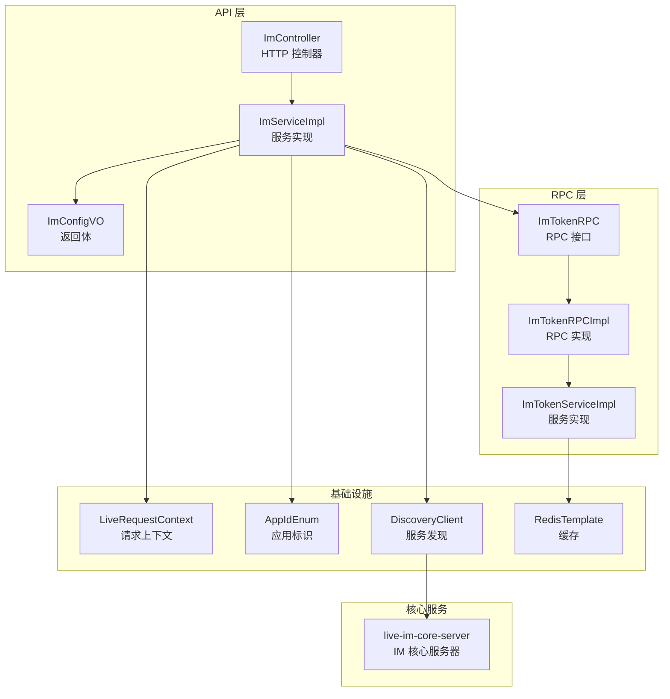
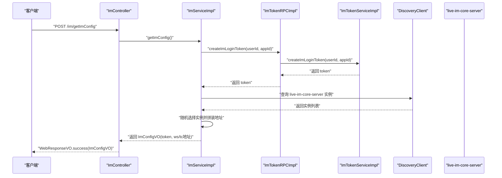
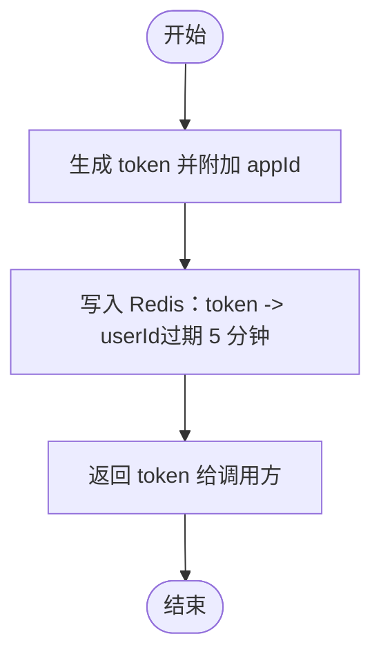
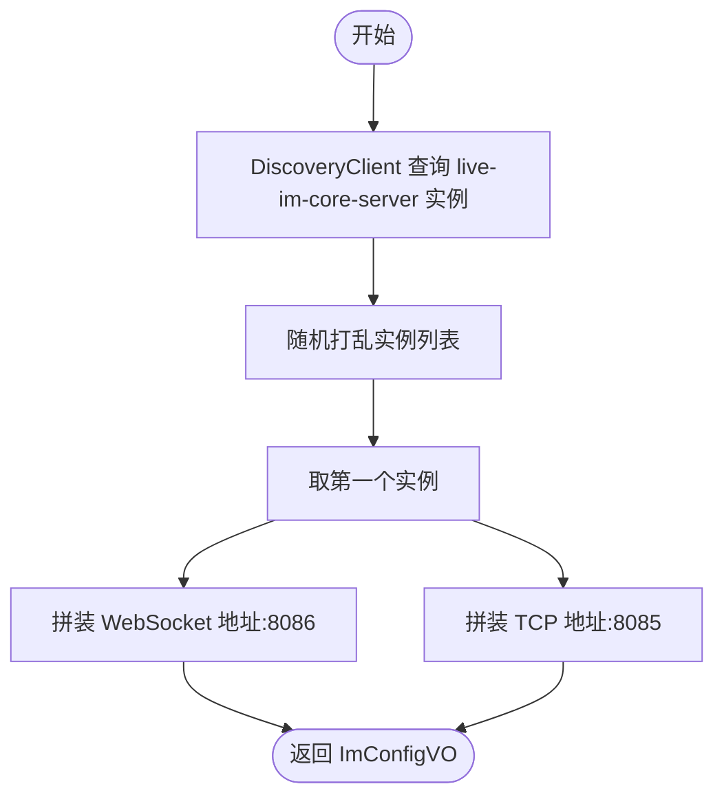
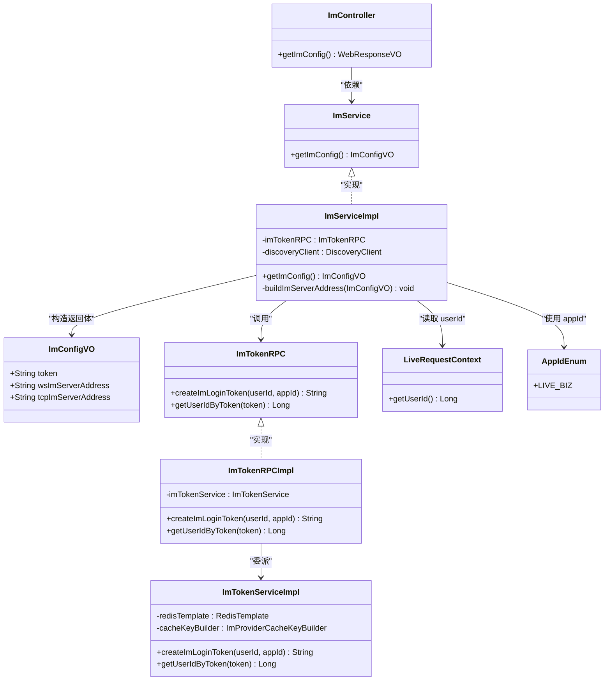
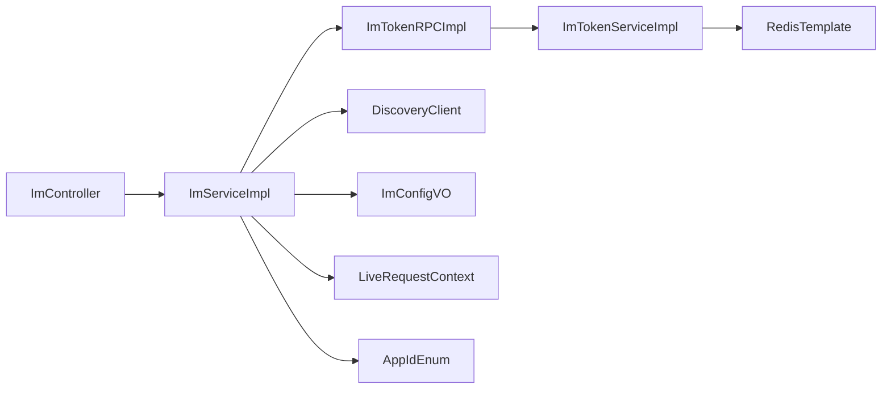

# 即时通讯API

<cite>
**本文引用的文件**
- [ImController.java](file://live-api/src/main/java/com/logilong/live/api/controller/ImController.java)
- [ImService.java](file://live-api/src/main/java/com/logilong/live/api/service/ImService.java)
- [ImServiceImpl.java](file://live-api/src/main/java/com/logilong/live/api/service/impl/ImServiceImpl.java)
- [ImConfigVO.java](file://live-api/src/main/java/com/logilong/live/api/vo/resp/ImConfigVO.java)
- [ImTokenRPC.java](file://live-im-interface/src/main/java/com/logilong/live/im/interfaces/ImTokenRPC.java)
- [ImTokenRPCImpl.java](file://live-im-provider/src/main/java/com/logilong/live/im/provider/rpc/ImTokenRPCImpl.java)
- [ImTokenServiceImpl.java](file://live-im-provider/src/main/java/com/logilong/live/im/provider/service/impl/ImTokenServiceImpl.java)
- [AppIdEnum.java](file://live-im-interface/src/main/java/com/logilong/live/im/constants/AppIdEnum.java)
- [LiveRequestContext.java](file://live-framework/live-framework-web-starter/src/main/java/com/logilong/live/web/starter/context/LiveRequestContext.java)
- [ImCoreServerApplication.java](file://live-im-core-server/src/main/java/com/logilong/live/im/core/server/ImCoreServerApplication.java)
</cite>

## 目录
1. [简介](#简介)
2. [项目结构](#项目结构)
3. [核心组件](#核心组件)
4. [架构总览](#架构总览)
5. [详细组件分析](#详细组件分析)
6. [依赖关系分析](#依赖关系分析)
7. [性能考虑](#性能考虑)
8. [故障排查指南](#故障排查指南)
9. [结论](#结论)
10. [附录：响应示例](#附录响应示例)

## 简介
本文件为 ImController 的 API 文档，聚焦“获取 IM 连接配置与 Token”的接口，说明如何返回 ImConfigVO，其中包含 IM 服务器地址（WebSocket/TCP）、端口以及用于客户端建立连接所需的连接 Token。文档还解释了 Token 的生成流程：通过调用 live-im-provider 的 ImTokenRPC 服务完成身份验证与 Token 生成；并阐述该接口在客户端与 IM 核心服务器（live-im-core-server）连接过程中的作用。

## 项目结构
- 接口层（API 层）：ImController 提供对外 HTTP 接口，返回 WebResponseVO 包裹的 ImConfigVO。
- 服务层（API 层）：ImService 定义接口，ImServiceImpl 实现具体逻辑，负责调用 RPC 获取 Token，并通过服务发现选择 IM 核心服务器地址。
- RPC 层（IM Provider）：ImTokenRPC 接口定义 Token 生成与解析能力；ImTokenRPCImpl 将调用委派给 ImTokenServiceImpl。
- 存储层（IM Provider）：ImTokenServiceImpl 使用 Redis 缓存 Token 到用户 ID 的映射，设置过期时间。
- 上下文与常量：LiveRequestContext 提供当前请求的用户 ID；AppIdEnum 提供业务应用标识。
- 核心服务：live-im-core-server 作为 IM 核心服务器，负责实际的 IM 连接与消息处理。

图表来源
- [ImController.java](file://live-api/src/main/java/com/logilong/live/api/controller/ImController.java#L1-L23)
- [ImServiceImpl.java](file://live-api/src/main/java/com/logilong/live/api/service/impl/ImServiceImpl.java#L1-L41)
- [ImConfigVO.java](file://live-api/src/main/java/com/logilong/live/api/vo/resp/ImConfigVO.java#L1-L16)
- [ImTokenRPC.java](file://live-im-interface/src/main/java/com/logilong/live/im/interfaces/ImTokenRPC.java#L1-L16)
- [ImTokenRPCImpl.java](file://live-im-provider/src/main/java/com/logilong/live/im/provider/rpc/ImTokenRPCImpl.java#L1-L27)
- [ImTokenServiceImpl.java](file://live-im-provider/src/main/java/com/logilong/live/im/provider/service/impl/ImTokenServiceImpl.java#L1-L35)
- [LiveRequestContext.java](file://live-framework/live-framework-web-starter/src/main/java/com/logilong/live/web/starter/context/LiveRequestContext.java#L1-L66)
- [AppIdEnum.java](file://live-im-interface/src/main/java/com/logilong/live/im/constants/AppIdEnum.java#L1-L19)
- [ImCoreServerApplication.java](file://live-im-core-server/src/main/java/com/logilong/live/im/core/server/ImCoreServerApplication.java#L1-L23)

章节来源
- [ImController.java](file://live-api/src/main/java/com/logilong/live/api/controller/ImController.java#L1-L23)
- [ImServiceImpl.java](file://live-api/src/main/java/com/logilong/live/api/service/impl/ImServiceImpl.java#L1-L41)
- [ImConfigVO.java](file://live-api/src/main/java/com/logilong/live/api/vo/resp/ImConfigVO.java#L1-L16)
- [ImTokenRPC.java](file://live-im-interface/src/main/java/com/logilong/live/im/interfaces/ImTokenRPC.java#L1-L16)
- [ImTokenRPCImpl.java](file://live-im-provider/src/main/java/com/logilong/live/im/provider/rpc/ImTokenRPCImpl.java#L1-L27)
- [ImTokenServiceImpl.java](file://live-im-provider/src/main/java/com/logilong/live/im/provider/service/impl/ImTokenServiceImpl.java#L1-L35)
- [LiveRequestContext.java](file://live-framework/live-framework-web-starter/src/main/java/com/logilong/live/web/starter/context/LiveRequestContext.java#L1-L66)
- [AppIdEnum.java](file://live-im-interface/src/main/java/com/logilong/live/im/constants/AppIdEnum.java#L1-L19)
- [ImCoreServerApplication.java](file://live-im-core-server/src/main/java/com/logilong/live/im/core/server/ImCoreServerApplication.java#L1-L23)

## 核心组件
- ImController：提供 HTTP 接口 /im/getImConfig，返回 WebResponseVO.success(ImConfigVO)。
- ImService：定义 getImConfig() 方法。
- ImServiceImpl：实现 getImConfig()，负责：
  - 调用 ImTokenRPC.createImLoginToken 获取 Token；
  - 通过 DiscoveryClient 获取 live-im-core-server 实例，拼装 WebSocket/TCP 地址并写入 ImConfigVO。
- ImConfigVO：返回体，包含 token、wsImServerAddress、tcpImServerAddress。
- ImTokenRPC 及其实现：封装 Token 生成与解析。
- ImTokenServiceImpl：使用 Redis 缓存 Token 到用户 ID 的映射，设置过期时间。
- LiveRequestContext：从请求上下文中获取当前用户 ID。
- AppIdEnum：提供业务应用标识（如 LIVE_BIZ）。

章节来源
- [ImController.java](file://live-api/src/main/java/com/logilong/live/api/controller/ImController.java#L1-L23)
- [ImService.java](file://live-api/src/main/java/com/logilong/live/api/service/ImService.java#L1-L10)
- [ImServiceImpl.java](file://live-api/src/main/java/com/logilong/live/api/service/impl/ImServiceImpl.java#L1-L41)
- [ImConfigVO.java](file://live-api/src/main/java/com/logilong/live/api/vo/resp/ImConfigVO.java#L1-L16)
- [ImTokenRPC.java](file://live-im-interface/src/main/java/com/logilong/live/im/interfaces/ImTokenRPC.java#L1-L16)
- [ImTokenRPCImpl.java](file://live-im-provider/src/main/java/com/logilong/live/im/provider/rpc/ImTokenRPCImpl.java#L1-L27)
- [ImTokenServiceImpl.java](file://live-im-provider/src/main/java/com/logilong/live/im/provider/service/impl/ImTokenServiceImpl.java#L1-L35)
- [LiveRequestContext.java](file://live-framework/live-framework-web-starter/src/main/java/com/logilong/live/web/starter/context/LiveRequestContext.java#L1-L66)
- [AppIdEnum.java](file://live-im-interface/src/main/java/com/logilong/live/im/constants/AppIdEnum.java#L1-L19)

## 架构总览
下面的序列图展示了客户端调用 /im/getImConfig 的完整流程，以及 Token 生成与服务器地址选择的关键步骤。

图表来源
- [ImController.java](file://live-api/src/main/java/com/logilong/live/api/controller/ImController.java#L1-L23)
- [ImServiceImpl.java](file://live-api/src/main/java/com/logilong/live/api/service/impl/ImServiceImpl.java#L1-L41)
- [ImTokenRPCImpl.java](file://live-im-provider/src/main/java/com/logilong/live/im/provider/rpc/ImTokenRPCImpl.java#L1-L27)
- [ImTokenServiceImpl.java](file://live-im-provider/src/main/java/com/logilong/live/im/provider/service/impl/ImTokenServiceImpl.java#L1-L35)

## 详细组件分析

### 接口定义与返回体
- 接口路径：/im/getImConfig
- 请求方式：POST
- 返回体：WebResponseVO.success(ImConfigVO)
- ImConfigVO 字段：
  - token：用于客户端连接 IM 的认证令牌
  - wsImServerAddress：WebSocket 连接地址（含端口）
  - tcpImServerAddress：TCP 连接地址（含端口）

章节来源
- [ImController.java](file://live-api/src/main/java/com/logilong/live/api/controller/ImController.java#L1-L23)
- [ImConfigVO.java](file://live-api/src/main/java/com/logilong/live/api/vo/resp/ImConfigVO.java#L1-L16)

### Token 生成流程（身份验证与 Token 生成）
- 调用链路：
  - ImServiceImpl.getImConfig() -> ImTokenRPC.createImLoginToken(userId, appId)
  - ImTokenRPCImpl -> ImTokenServiceImpl.createImLoginToken(...)
- 生成策略：
  - 生成唯一 token，并附加 appId
  - 将 token 映射到 userId 写入 Redis，设置过期时间为 5 分钟
- 解析策略：
  - ImTokenRPCImpl -> ImTokenServiceImpl.getUserIdByToken(token) 从 Redis 中读取 userId

图表来源
- [ImTokenRPCImpl.java](file://live-im-provider/src/main/java/com/logilong/live/im/provider/rpc/ImTokenRPCImpl.java#L1-L27)
- [ImTokenServiceImpl.java](file://live-im-provider/src/main/java/com/logilong/live/im/provider/service/impl/ImTokenServiceImpl.java#L1-L35)

章节来源
- [ImTokenRPC.java](file://live-im-interface/src/main/java/com/logilong/live/im/interfaces/ImTokenRPC.java#L1-L16)
- [ImTokenRPCImpl.java](file://live-im-provider/src/main/java/com/logilong/live/im/provider/rpc/ImTokenRPCImpl.java#L1-L27)
- [ImTokenServiceImpl.java](file://live-im-provider/src/main/java/com/logilong/live/im/provider/service/impl/ImTokenServiceImpl.java#L1-L35)

### 服务器地址选择与客户端连接
- 服务发现：
  - ImServiceImpl 通过 DiscoveryClient 查询服务名为 live-im-core-server 的实例列表
  - 对实例列表进行随机打乱后取第一个实例
- 地址拼装：
  - WebSocket 地址：host + ":8086"
  - TCP 地址：host + ":8085"
- 客户端连接作用：
  - 客户端拿到 token 与服务器地址后，即可与 live-im-core-server 建立 WebSocket 或 TCP 连接
  - 连接鉴权阶段通常使用 token 进行身份校验（由核心服务器侧处理）

图表来源
- [ImServiceImpl.java](file://live-api/src/main/java/com/logilong/live/api/service/impl/ImServiceImpl.java#L1-L41)

章节来源
- [ImServiceImpl.java](file://live-api/src/main/java/com/logilong/live/api/service/impl/ImServiceImpl.java#L1-L41)
- [ImCoreServerApplication.java](file://live-im-core-server/src/main/java/com/logilong/live/im/core/server/ImCoreServerApplication.java#L1-L23)

### 类关系图（代码级）

图表来源
- [ImController.java](file://live-api/src/main/java/com/logilong/live/api/controller/ImController.java#L1-L23)
- [ImService.java](file://live-api/src/main/java/com/logilong/live/api/service/ImService.java#L1-L10)
- [ImServiceImpl.java](file://live-api/src/main/java/com/logilong/live/api/service/impl/ImServiceImpl.java#L1-L41)
- [ImConfigVO.java](file://live-api/src/main/java/com/logilong/live/api/vo/resp/ImConfigVO.java#L1-L16)
- [ImTokenRPC.java](file://live-im-interface/src/main/java/com/logilong/live/im/interfaces/ImTokenRPC.java#L1-L16)
- [ImTokenRPCImpl.java](file://live-im-provider/src/main/java/com/logilong/live/im/provider/rpc/ImTokenRPCImpl.java#L1-L27)
- [ImTokenServiceImpl.java](file://live-im-provider/src/main/java/com/logilong/live/im/provider/service/impl/ImTokenServiceImpl.java#L1-L35)
- [LiveRequestContext.java](file://live-framework/live-framework-web-starter/src/main/java/com/logilong/live/web/starter/context/LiveRequestContext.java#L1-L66)
- [AppIdEnum.java](file://live-im-interface/src/main/java/com/logilong/live/im/constants/AppIdEnum.java#L1-L19)

## 依赖关系分析
- 控制器到服务：ImController 依赖 ImService 接口，通过注入实现调用。
- 服务到 RPC：ImServiceImpl 通过 DubboReference 注入 ImTokenRPC，用于生成 Token。
- RPC 到服务实现：ImTokenRPCImpl 委派到 ImTokenServiceImpl。
- 服务到上下文与常量：ImServiceImpl 从 LiveRequestContext 获取 userId，使用 AppIdEnum.LIVE_BIZ。
- 服务到服务发现：ImServiceImpl 使用 DiscoveryClient 获取 live-im-core-server 实例，拼装地址。
- 服务到存储：ImTokenServiceImpl 使用 RedisTemplate 持久化 token 映射。

图表来源
- [ImController.java](file://live-api/src/main/java/com/logilong/live/api/controller/ImController.java#L1-L23)
- [ImServiceImpl.java](file://live-api/src/main/java/com/logilong/live/api/service/impl/ImServiceImpl.java#L1-L41)
- [ImTokenRPCImpl.java](file://live-im-provider/src/main/java/com/logilong/live/im/provider/rpc/ImTokenRPCImpl.java#L1-L27)
- [ImTokenServiceImpl.java](file://live-im-provider/src/main/java/com/logilong/live/im/provider/service/impl/ImTokenServiceImpl.java#L1-L35)
- [LiveRequestContext.java](file://live-framework/live-framework-web-starter/src/main/java/com/logilong/live/web/starter/context/LiveRequestContext.java#L1-L66)
- [AppIdEnum.java](file://live-im-interface/src/main/java/com/logilong/live/im/constants/AppIdEnum.java#L1-L19)

章节来源
- [ImServiceImpl.java](file://live-api/src/main/java/com/logilong/live/api/service/impl/ImServiceImpl.java#L1-L41)
- [ImTokenRPCImpl.java](file://live-im-provider/src/main/java/com/logilong/live/im/provider/rpc/ImTokenRPCImpl.java#L1-L27)
- [ImTokenServiceImpl.java](file://live-im-provider/src/main/java/com/logilong/live/im/provider/service/impl/ImTokenServiceImpl.java#L1-L35)
- [LiveRequestContext.java](file://live-framework/live-framework-web-starter/src/main/java/com/logilong/live/web/starter/context/LiveRequestContext.java#L1-L66)
- [AppIdEnum.java](file://live-im-interface/src/main/java/com/logilong/live/im/constants/AppIdEnum.java#L1-L19)

## 性能考虑
- Token 过期时间：Redis 中 token 映射默认过期时间为 5 分钟，建议结合业务场景评估是否需要调整。
- 服务发现与负载：对实例列表进行随机打乱，有助于在多实例部署下均衡流量。
- Redis 访问：Token 生成与解析均涉及 Redis 读写，应确保 Redis 集群稳定与低延迟。
- 并发与线程安全：LiveRequestContext 使用 ThreadLocal，避免跨请求污染；Redis 操作为单键读写，注意高并发下的 QPS 限制。

## 故障排查指南
- Token 为空或无效
  - 检查 LiveRequestContext 是否正确设置了当前用户 ID
  - 确认 AppIdEnum.LIVE_BIZ 是否符合预期
  - 核对 Redis 是否可用，以及 ImProviderCacheKeyBuilder 的 key 规则
- 无法获取服务器地址
  - 检查服务注册中心是否已注册 live-im-core-server
  - 确认 DiscoveryClient 能正常查询到实例列表
- 连接失败
  - 核对 wsImServerAddress 与 tcpImServerAddress 是否可达
  - 确认 live-im-core-server 已启动且监听对应端口

章节来源
- [ImServiceImpl.java](file://live-api/src/main/java/com/logilong/live/api/service/impl/ImServiceImpl.java#L1-L41)
- [ImTokenServiceImpl.java](file://live-im-provider/src/main/java/com/logilong/live/im/provider/service/impl/ImTokenServiceImpl.java#L1-L35)
- [LiveRequestContext.java](file://live-framework/live-framework-web-starter/src/main/java/com/logilong/live/web/starter/context/LiveRequestContext.java#L1-L66)
- [ImCoreServerApplication.java](file://live-im-core-server/src/main/java/com/logilong/live/im/core/server/ImCoreServerApplication.java#L1-L23)

## 结论
/ im/getImConfig 接口通过 ImController -> ImServiceImpl -> ImTokenRPC 的链路，为客户端提供连接 IM 所需的完整配置：Token 与服务器地址。Token 由 live-im-provider 侧基于 Redis 生成并短期缓存，服务器地址通过服务发现动态选择。该接口在客户端与 live-im-core-server 建立连接过程中起到关键的“引导”作用。

## 附录：响应示例
- 成功响应字段
  - token：字符串，用于连接鉴权
  - wsImServerAddress：字符串，形如 host:8086
  - tcpImServerAddress：字符串，形如 host:8085
- 示例结构（仅示意，非代码片段）
  - {
      "code": 200,
      "message": "success",
      "data": {
        "token": "xxxxxxxx-xxxx-xxxx-xxxx-xxxxxxxxxxxx%10001",
        "wsImServerAddress": "127.0.0.1:8086",
        "tcpImServerAddress": "127.0.0.1:8085"
      }
    }

章节来源
- [ImConfigVO.java](file://live-api/src/main/java/com/logilong/live/api/vo/resp/ImConfigVO.java#L1-L16)
- [ImServiceImpl.java](file://live-api/src/main/java/com/logilong/live/api/service/impl/ImServiceImpl.java#L1-L41)
- [ImTokenServiceImpl.java](file://live-im-provider/src/main/java/com/logilong/live/im/provider/service/impl/ImTokenServiceImpl.java#L1-L35)