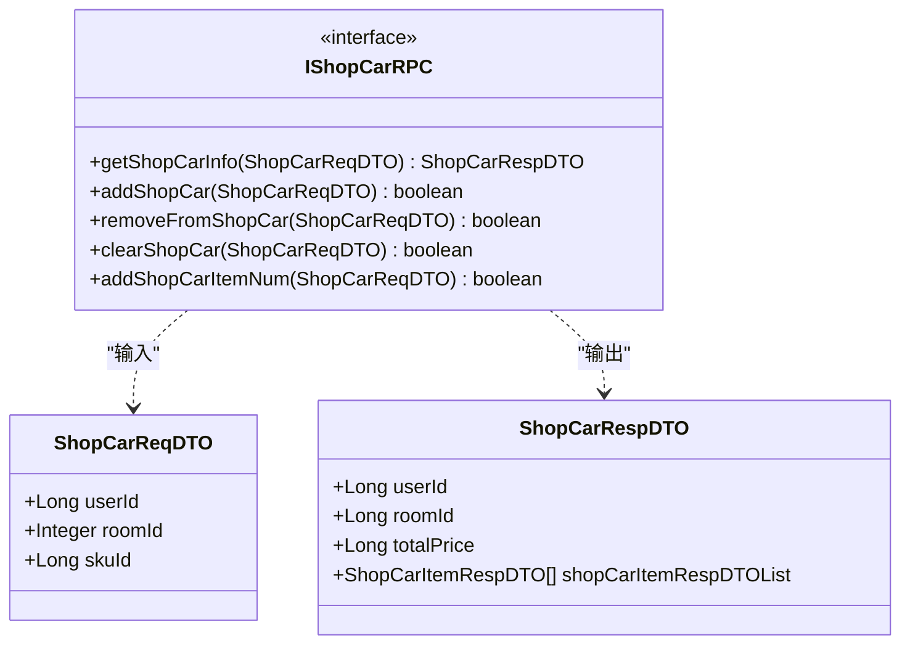
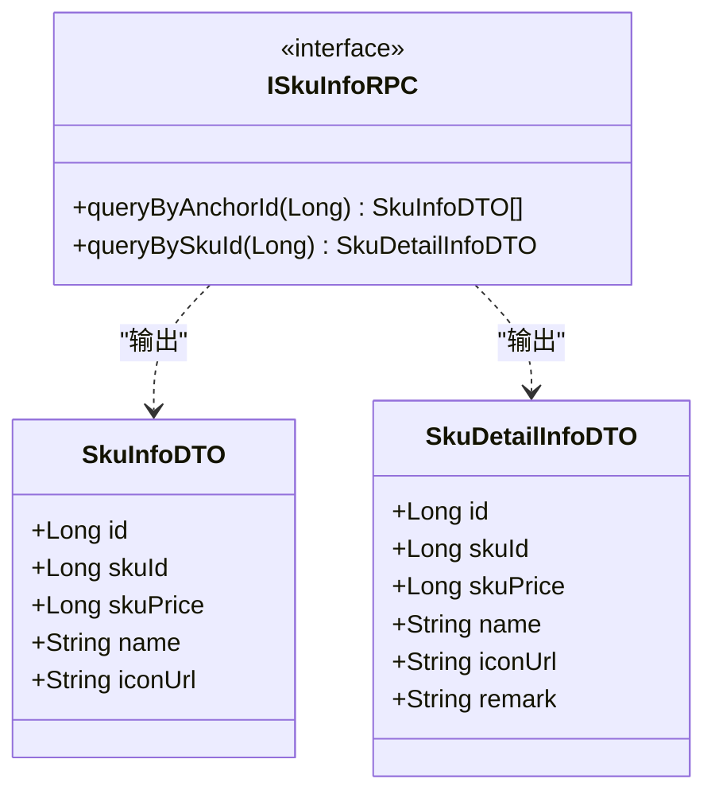
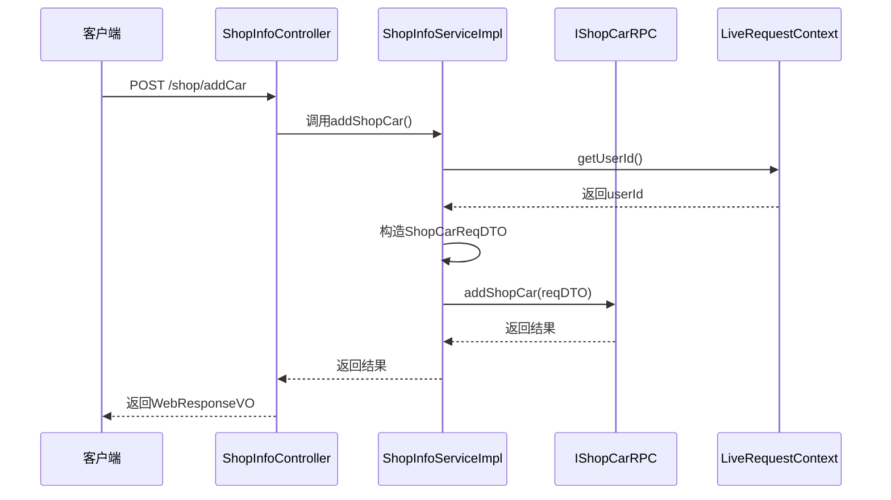
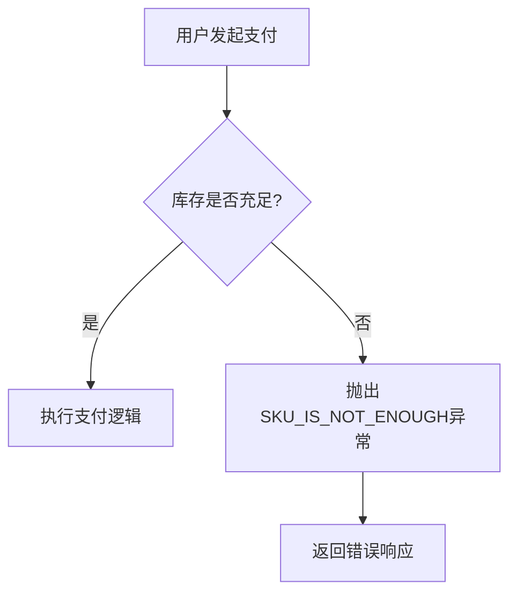

# 商品与购物车API

<cite>
**本文档引用的文件**  
- [ShopInfoController.java](file://live-api/src/main/java/com/logilong/live/api/controller/ShopInfoController.java)
- [ShopInfoServiceImpl.java](file://live-api/src/main/java/com/logilong/live/api/service/impl/ShopInfoServiceImpl.java)
- [IShopInfoService.java](file://live-api/src/main/java/com/logilong/live/api/service/IShopInfoService.java)
- [ShopCarReqVO.java](file://live-api/src/main/java/com/logilong/live/api/vo/req/ShopCarReqVO.java)
- [ShopCarRespVO.java](file://live-api/src/main/java/com/logilong/live/api/vo/resp/ShopCarRespVO.java)
- [ShopCarItemRespVO.java](file://live-api/src/main/java/com/logilong/live/api/vo/resp/ShopCarItemRespVO.java)
- [IShopCarRPC.java](file://live-sku-interface/src/main/java/com/logilong/live/sku/interfaces/IShopCarRPC.java)
- [ISkuInfoRPC.java](file://live-sku-interface/src/main/java/com/logilong/live/sku/interfaces/ISkuInfoRPC.java)
- [ShopCarReqDTO.java](file://live-sku-interface/src/main/java/com/logilong/live/sku/dto/ShopCarReqDTO.java)
- [ShopCarRespDTO.java](file://live-sku-interface/src/main/java/com/logilong/live/sku/dto/ShopCarRespDTO.java)
- [ShopCarItemRespDTO.java](file://live-sku-interface/src/main/java/com/logilong/live/sku/dto/ShopCarItemRespDTO.java)
- [SkuInfoDTO.java](file://live-sku-interface/src/main/java/com/logilong/live/sku/dto/SkuInfoDTO.java)
- [SkuDetailInfoDTO.java](file://live-sku-interface/src/main/java/com/logilong/live/sku/dto/SkuDetailInfoDTO.java)
- [ApiErrorEnum.java](file://live-api/src/main/java/com/logilong/live/api/error/ApiErrorEnum.java)
- [LiveRequestContext.java](file://live-framework/live-framework-web-starter/src/main/java/com/logilong/live/web/starter/context/LiveRequestContext.java)
</cite>

## 目录
1. [简介](#简介)
2. [购物车管理接口](#购物车管理接口)
3. [商品信息查询接口](#商品信息查询接口)
4. [请求与响应数据结构](#请求与响应数据结构)
5. [远程服务调用机制](#远程服务调用机制)
6. [用户会话与购物车关联](#用户会话与购物车关联)
7. [使用示例](#使用示例)
8. [错误处理](#错误处理)

## 简介
本API文档详细说明了`ShopInfoController`提供的商品信息查询和购物车管理功能。系统通过RESTful接口支持用户在直播间场景下对商品进行浏览、添加至购物车、修改、删除及清空等操作。购物车数据以直播间为维度进行隔离，确保不同直播间之间的购物车数据独立。

**Section sources**
- [ShopInfoController.java](file://live-api/src/main/java/com/logilong/live/api/controller/ShopInfoController.java#L1-L76)

## 购物车管理接口
`ShopInfoController`提供了完整的购物车增删改查（CRUD）接口，所有接口均通过`/shop`前缀访问。

### 添加商品到购物车
- **端点**: `POST /shop/addCar`
- **功能**: 将指定商品添加到用户当前直播间的购物车中
- **幂等性**: 若商品已存在，则可能更新数量（具体由`IShopCarRPC`实现决定）

### 从购物车移除商品
- **端点**: `POST /shop/removeFromCar`
- **功能**: 从购物车中移除指定商品

### 获取购物车信息
- **端点**: `POST /shop/getCarInfo`
- **功能**: 查询当前用户在指定直播间内的完整购物车信息，包括商品列表和总价

### 清空购物车
- **端点**: `POST /shop/clearCar`
- **功能**: 清空当前用户在指定直播间内的所有购物车商品

**Section sources**
- [ShopInfoController.java](file://live-api/src/main/java/com/logilong/live/api/controller/ShopInfoController.java#L37-L55)
- [IShopInfoService.java](file://live-api/src/main/java/com/logilong/live/api/service/IShopInfoService.java#L33-L53)

## 商品信息查询接口
提供商品列表和详情的查询能力。

### 查询直播间商品列表
- **端点**: `POST /shop/listSkuInfo`
- **参数**: `roomId`（直播间ID）
- **流程**: 
  1. 根据`roomId`调用`ILivingRoomRPC`获取主播ID（`anchorId`）
  2. 使用`anchorId`调用`ISkuInfoRPC`查询该主播的商品列表

### 查询商品详情
- **端点**: `POST /shop/detail`
- **参数**: `skuId`（商品SKU ID）
- **功能**: 获取指定商品的详细信息

**Section sources**
- [ShopInfoController.java](file://live-api/src/main/java/com/logilong/live/api/controller/ShopInfoController.java#L20-L28)
- [IShopInfoService.java](file://live-api/src/main/java/com/logilong/live/api/service/IShopInfoService.java#L24-L29)

## 请求与响应数据结构

### 请求体：ShopCarReqVO
该对象用于购物车操作的请求参数。

| 字段 | 类型 | 描述 |
|------|------|------|
| `skuId` | Long | 商品SKU ID |
| `roomId` | Integer | 直播间ID |

**Section sources**
- [ShopCarReqVO.java](file://live-api/src/main/java/com/logilong/live/api/vo/req/ShopCarReqVO.java#L1-L11)

### 响应体：ShopCarRespVO
该对象封装了购物车的完整信息。

| 字段 | 类型 | 描述 |
|------|------|------|
| `userId` | Long | 用户ID |
| `roomId` | Integer | 直播间ID |
| `totalPrice` | Long | 购物车商品总价（单位：分） |
| `shopCarItemRespVOList` | List<ShopCarItemRespVO> | 购物车商品项列表 |

**Section sources**
- [ShopCarRespVO.java](file://live-api/src/main/java/com/logilong/live/api/vo/resp/ShopCarRespVO.java#L1-L18)

### 购物车商品项：ShopCarItemRespVO
表示购物车中的单个商品条目。

| 字段 | 类型 | 描述 |
|------|------|------|
| `count` | Integer | 商品数量 |
| `skuInfoDTO` | SkuInfoDTO | 商品基本信息 |

**Section sources**
- [ShopCarItemRespVO.java](file://live-api/src/main/java/com/logilong/live/api/vo/resp/ShopCarItemRespVO.java#L1-L23)

## 远程服务调用机制
系统采用Dubbo RPC进行服务间通信，`ShopInfoServiceImpl`通过以下接口与`live-sku-provider`交互：

### IShopCarRPC
处理购物车相关操作，定义在`live-sku-interface`模块中。



**Diagram sources**
- [IShopCarRPC.java](file://live-sku-interface/src/main/java/com/logilong/live/sku/interfaces/IShopCarRPC.java#L1-L32)
- [ShopCarReqDTO.java](file://live-sku-interface/src/main/java/com/logilong/live/sku/dto/ShopCarReqDTO.java#L1-L17)
- [ShopCarRespDTO.java](file://live-sku-interface/src/main/java/com/logilong/live/sku/dto/ShopCarRespDTO.java#L1-L21)

### ISkuInfoRPC
处理商品信息查询。



**Diagram sources**
- [ISkuInfoRPC.java](file://live-sku-interface/src/main/java/com/logilong/live/sku/interfaces/ISkuInfoRPC.java#L1-L22)
- [SkuInfoDTO.java](file://live-sku-interface/src/main/java/com/logilong/live/sku/dto/SkuInfoDTO.java#L1-L39)
- [SkuDetailInfoDTO.java](file://live-sku-interface/src/main/java/com/logilong/live/sku/dto/SkuDetailInfoDTO.java#L1-L33)

## 用户会话与购物车关联
购物车数据与用户会话通过`LiveRequestContext`进行关联：

1. 所有购物车操作接口在调用`IShopCarRPC`前，都会将当前登录用户的ID注入到`ShopCarReqDTO`中。
2. `LiveRequestContext.getUserId()`从请求上下文中获取当前用户的身份信息。
3. 购物车数据在`live-sku-provider`中以`userId`和`roomId`为联合键进行存储和查询，确保数据隔离。



**Diagram sources**
- [ShopInfoServiceImpl.java](file://live-api/src/main/java/com/logilong/live/api/service/impl/ShopInfoServiceImpl.java#L58-L62)
- [LiveRequestContext.java](file://live-framework/live-framework-web-starter/src/main/java/com/logilong/live/web/starter/context/LiveRequestContext.java)

## 使用示例

### 添加商品到购物车
**请求**:
```json
{
  "skuId": 1001,
  "roomId": 2001
}
```

**响应**:
```json
{
  "code": 200,
  "msg": "success",
  "data": true
}
```

### 获取购物车列表
**请求**:
```json
{
  "roomId": 2001
}
```

**响应**:
```json
{
  "code": 200,
  "msg": "success",
  "data": {
    "userId": 12345,
    "roomId": 2001,
    "totalPrice": 29900,
    "shopCarItemRespVOList": [
      {
        "count": 1,
        "skuInfoDTO": {
          "skuId": 1001,
          "name": "智能手表",
          "skuPrice": 29900,
          "iconUrl": "https://example.com/watch.jpg"
        }
      }
    ]
  }
}
```

**Section sources**
- [ShopInfoController.java](file://live-api/src/main/java/com/logilong/live/api/controller/ShopInfoController.java)
- [ShopInfoServiceImpl.java](file://live-api/src/main/java/com/logilong/live/api/service/impl/ShopInfoServiceImpl.java)

## 错误处理
系统通过`ApiErrorEnum`定义了标准化的错误码。

### 库存不足错误
当商品库存不足时，系统会抛出特定错误：

| 错误码 | 错误信息 | HTTP状态码 |
|--------|----------|-----------|
| 10010 | 商品库存不足，请重新下单 | 400 |

该错误在`payNow`等支付相关操作中可能被触发。



**Section sources**
- [ApiErrorEnum.java](file://live-api/src/main/java/com/logilong/live/api/error/ApiErrorEnum.java#L1-L37)
- [ShopInfoServiceImpl.java](file://live-api/src/main/java/com/logilong/live/api/service/impl/ShopInfoServiceImpl.java#L112-L113)