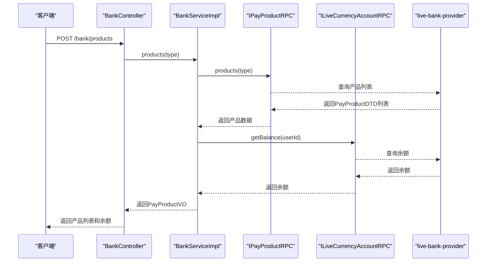
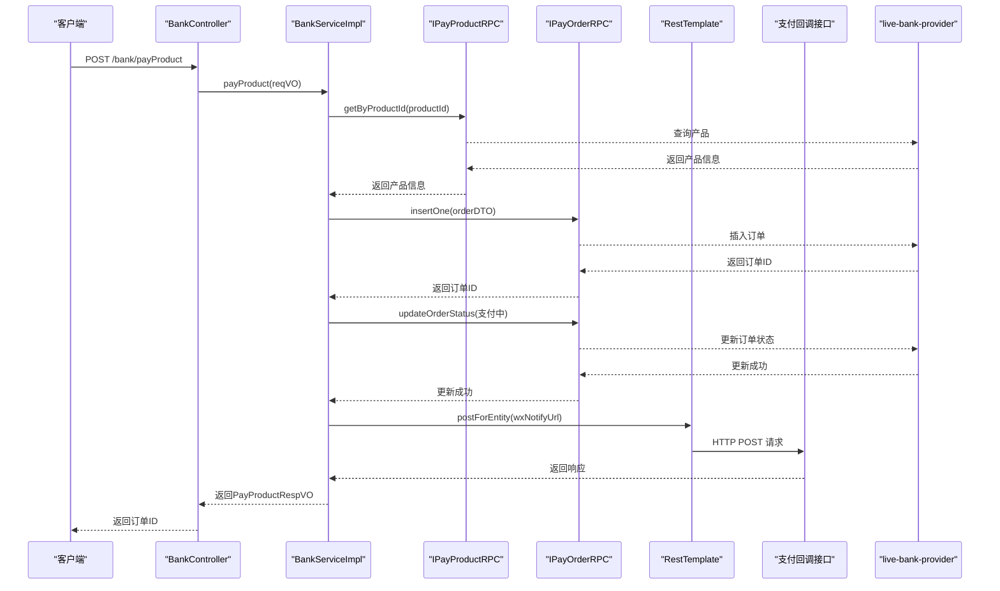
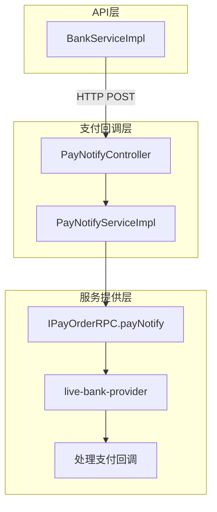

# 支付银行API

<cite>
**本文档引用的文件**
- [BankController.java](file://live-api/src/main/java/com/logilong/live/api/controller/BankController.java)
- [IBankService.java](file://live-api/src/main/java/com/logilong/live/api/service/IBankService.java)
- [BankServiceImpl.java](file://live-api/src/main/java/com/logilong/live/api/service/impl/BankServiceImpl.java)
- [PayProductReqVO.java](file://live-api/src/main/java/com/logilong/live/api/vo/req/PayProductReqVO.java)
- [PayProductRespVO.java](file://live-api/src/main/java/com/logilong/live/api/vo/resp/PayProductRespVO.java)
- [PayProductVO.java](file://live-api/src/main/java/com/logilong/live/api/vo/resp/PayProductVO.java)
- [PayProductItemVO.java](file://live-api/src/main/java/com/logilong/live/api/vo/resp/PayProductItemVO.java)
- [ApiErrorEnum.java](file://live-api/src/main/java/com/logilong/live/api/error/ApiErrorEnum.java)
- [PayProductTypeEnum.java](file://live-bank-interface/src/main/java/com/logilong/live/bank/constants/PayProductTypeEnum.java)
- [PayChannelEnum.java](file://live-bank-interface/src/main/java/com/logilong/live/bank/constants/PayChannelEnum.java)
- [PaySourceEnum.java](file://live-bank-interface/src/main/java/com/logilong/live/bank/constants/PaySourceEnum.java)
- [IPayProductRPC.java](file://live-bank-interface/src/main/java/com/logilong/live/bank/interfaces/IPayProductRPC.java)
- [PayNotifyController.java](file://live-bank-api/src/main/java/com/logilong/live/bank/api/controller/PayNotifyController.java)
- [PayNotifyServiceImpl.java](file://live-bank-api/src/main/java/com/logilong/live/bank/api/service/impl/PayNotifyServiceImpl.java)
- [WxPayNotifyVO.java](file://live-bank-api/src/main/java/com/logilong/live/bank/api/vo/WxPayNotifyVO.java)
- [OrderStatusEnum.java](file://live-bank-interface/src/main/java/com/logilong/live/bank/constants/OrderStatusEnum.java)
</cite>

## 目录
1. [简介](#简介)
2. [支付产品查询接口](#支付产品查询接口)
3. [支付下单接口](#支付下单接口)
4. [支付回调处理](#支付回调处理)
5. [响应示例](#响应示例)
6. [错误码说明](#错误码说明)

## 简介
本文档详细描述了直播平台中支付银行API的核心功能，重点介绍支付产品查询和下单接口。文档涵盖了获取支付产品列表的端点、下单流程、支付回调处理机制以及相关错误码。系统通过`BankController`提供RESTful API，与`live-bank-provider`服务通过Dubbo RPC进行通信，实现支付功能。

**Section sources**
- [BankController.java](file://live-api/src/main/java/com/logilong/live/api/controller/BankController.java#L1-L39)

## 支付产品查询接口

### 接口说明
获取指定类型支付产品的列表信息，包括产品名称、ID、价格（虚拟币数量）以及用户的当前余额。

### 接口详情
- **端点**: `/bank/products`
- **HTTP方法**: POST
- **请求参数**:
  - `type` (Integer, 必填): 产品类型，用于区分不同业务场景的产品
    - 参考 `PayProductTypeEnum` 枚举

### 响应结构
返回 `PayProductVO` 对象，包含以下字段：
- `currentBalance` (Integer): 用户当前虚拟币余额
- `payProductItemVOList` (List<PayProductItemVO>): 支付产品列表

`PayProductItemVO` 结构：
- `id` (Long): 产品ID
- `name` (String): 产品名称
- `coinNum` (Integer): 产品价格（虚拟币数量）

### 处理流程
1. 接收客户端请求，验证`type`参数不为空
2. 调用`IPayProductRPC.products(type)`从`live-bank-provider`获取产品数据
3. 将`PayProductDTO`转换为前端友好的`PayProductItemVO`
4. 调用`ILiveCurrencyAccountRPC.getBalance()`获取用户当前余额
5. 组装`PayProductVO`并返回



**Diagram sources**
- [BankController.java](file://live-api/src/main/java/com/logilong/live/api/controller/BankController.java#L21-L25)
- [BankServiceImpl.java](file://live-api/src/main/java/com/logilong/live/api/service/impl/BankServiceImpl.java#L43-L57)
- [IBankService.java](file://live-api/src/main/java/com/logilong/live/api/service/IBankService.java#L15-L16)

**Section sources**
- [BankController.java](file://live-api/src/main/java/com/logilong/live/api/controller/BankController.java#L21-L25)
- [BankServiceImpl.java](file://live-api/src/main/java/com/logilong/live/api/service/impl/BankServiceImpl.java#L43-L57)
- [PayProductVO.java](file://live-api/src/main/java/com/logilong/live/api/vo/resp/PayProductVO.java#L1-L20)
- [PayProductItemVO.java](file://live-api/src/main/java/com/logilong/live/api/vo/resp/PayProductItemVO.java#L1-L13)
- [PayProductTypeEnum.java](file://live-bank-interface/src/main/java/com/logilong/live/bank/constants/PayProductTypeEnum.java#L1-L17)

## 支付下单接口

### 接口说明
处理用户支付请求，创建支付订单并返回支付所需信息。

### 接口详情
- **端点**: `/bank/payProduct`
- **HTTP方法**: POST
- **请求体**: `PayProductReqVO` 对象

### 请求参数
`PayProductReqVO` 结构：
- `productId` (Long, 必填): 产品ID
- `paySource` (Integer, 必填): 支付来源
  - 参考 `PaySourceEnum` 枚举
- `payChannel` (Integer, 必填): 支付渠道
  - 参考 `PayChannelEnum` 枚举

### 响应结构
返回 `PayProductRespVO` 对象：
- `orderId` (String): 创建的订单ID

### 处理流程
1. 接收`PayProductReqVO`请求参数
2. 验证参数有效性（非空、支付来源和渠道有效）
3. 调用`IPayProductRPC.getByProductId()`验证产品存在
4. 创建`PayOrderDTO`并调用`IPayOrderRPC.insertOne()`插入订单
5. 更新订单状态为"支付中"
6. 发起HTTP请求到支付回调接口，触发支付流程
7. 返回订单ID给客户端



**Diagram sources**
- [BankController.java](file://live-api/src/main/java/com/logilong/live/api/controller/BankController.java#L33-L36)
- [BankServiceImpl.java](file://live-api/src/main/java/com/logilong/live/api/service/impl/BankServiceImpl.java#L60-L90)
- [PayProductReqVO.java](file://live-api/src/main/java/com/logilong/live/api/vo/req/PayProductReqVO.java#L1-L26)
- [PayProductRespVO.java](file://live-api/src/main/java/com/logilong/live/api/vo/resp/PayProductRespVO.java#L1-L11)

**Section sources**
- [BankController.java](file://live-api/src/main/java/com/logilong/live/api/controller/BankController.java#L33-L36)
- [BankServiceImpl.java](file://live-api/src/main/java/com/logilong/live/api/service/impl/BankServiceImpl.java#L60-L90)
- [PayProductReqVO.java](file://live-api/src/main/java/com/logilong/live/api/vo/req/PayProductReqVO.java#L1-L26)
- [PayProductRespVO.java](file://live-api/src/main/java/com/logilong/live/api/vo/resp/PayProductRespVO.java#L1-L11)
- [PaySourceEnum.java](file://live-bank-interface/src/main/java/com/logilong/live/bank/constants/PaySourceEnum.java#L1-L31)
- [PayChannelEnum.java](file://live-bank-interface/src/main/java/com/logilong/live/bank/constants/PayChannelEnum.java#L1-L23)
- [OrderStatusEnum.java](file://live-bank-interface/src/main/java/com/logilong/live/bank/constants/OrderStatusEnum.java#L1-L24)

## 支付回调处理

### 关联说明
支付下单接口会触发一个HTTP请求到配置的支付回调URL，该请求由`live-bank-api`模块的`PayNotifyController`处理，形成API层与支付回调服务的关联。

### 回调流程
1. `BankServiceImpl`通过`RestTemplate`向`live.wxNotify`配置的URL发送POST请求
2. 请求参数包含订单ID、用户ID和业务代码(bizCode)
3. `PayNotifyController.wxNotify()`接收请求并调用`PayNotifyService`
4. `PayNotifyService`解析参数并调用`IPayOrderRPC.payNotify()`处理支付通知

### 关键组件
- **PayNotifyController**: 处理外部支付回调请求
  - 端点: `/payNotify/wxNotify`
- **WxPayNotifyVO**: 封装回调请求参数
  - 包含`orderId`、`userId`、`bizCode`
- **PayNotifyServiceImpl**: 处理回调业务逻辑



**Diagram sources**
- [BankServiceImpl.java](file://live-api/src/main/java/com/logilong/live/api/service/impl/BankServiceImpl.java#L82-L88)
- [PayNotifyController.java](file://live-bank-api/src/main/java/com/logilong/live/bank/api/controller/PayNotifyController.java#L1-L25)
- [PayNotifyServiceImpl.java](file://live-bank-api/src/main/java/com/logilong/live/bank/api/service/impl/PayNotifyServiceImpl.java#L1-L27)
- [WxPayNotifyVO.java](file://live-bank-api/src/main/java/com/logilong/live/bank/api/vo/WxPayNotifyVO.java#L1-L12)

**Section sources**
- [BankServiceImpl.java](file://live-api/src/main/java/com/logilong/live/api/service/impl/BankServiceImpl.java#L82-L88)
- [PayNotifyController.java](file://live-bank-api/src/main/java/com/logilong/live/bank/api/controller/PayNotifyController.java#L1-L25)
- [PayNotifyServiceImpl.java](file://live-bank-api/src/main/java/com/logilong/live/bank/api/service/impl/PayNotifyServiceImpl.java#L1-L27)
- [WxPayNotifyVO.java](file://live-bank-api/src/main/java/com/logilong/live/bank/api/vo/WxPayNotifyVO.java#L1-L12)

## 响应示例

### 成功获取产品列表
```json
{
  "code": 200,
  "msg": "success",
  "data": {
    "currentBalance": 1000,
    "payProductItemVOList": [
      {
        "id": 1,
        "name": "小礼包",
        "coinNum": 100
      },
      {
        "id": 2,
        "name": "中礼包",
        "coinNum": 500
      },
      {
        "id": 3,
        "name": "大礼包",
        "coinNum": 1000
      }
    ]
  }
}
```

### 下单失败（产品无效）
```json
{
  "code": 400,
  "msg": "参数错误",
  "data": null
}
```

**Section sources**
- [BankController.java](file://live-api/src/main/java/com/logilong/live/api/controller/BankController.java#L22-L25)
- [BankServiceImpl.java](file://live-api/src/main/java/com/logilong/live/api/service/impl/BankServiceImpl.java#L60-L90)

## 错误码说明

### 支付相关错误码
以下错误码定义在`ApiErrorEnum`中，用于标识支付相关的错误：

| 错误码 | 错误消息 | 说明 |
|--------|---------|------|
| PAY_ERROR (11) | 支付异常 | 通用支付异常 |
| PARAM_ERROR | 参数错误 | 请求参数无效或缺失 |

### 参数验证错误
- **产品不存在**: 当`productId`在系统中找不到对应产品时，返回`PARAM_ERROR`
- **支付来源无效**: 当`paySource`不是`PaySourceEnum`中定义的有效值时，返回`PARAM_ERROR`
- **必填参数缺失**: 当`productId`、`paySource`等必填参数为空时，返回`PARAM_ERROR`

**Section sources**
- [ApiErrorEnum.java](file://live-api/src/main/java/com/logilong/live/api/error/ApiErrorEnum.java#L1-L37)
- [BankServiceImpl.java](file://live-api/src/main/java/com/logilong/live/api/service/impl/BankServiceImpl.java#L63-L66)