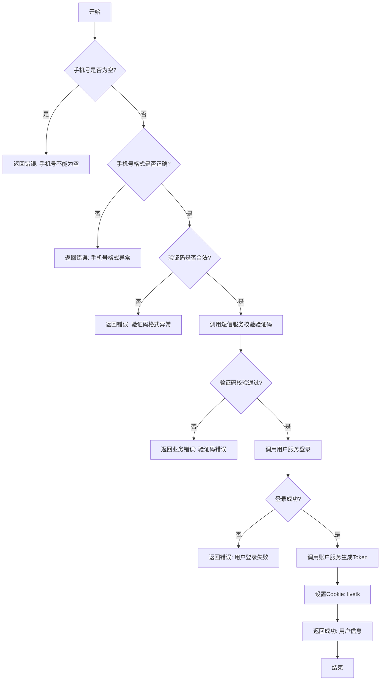
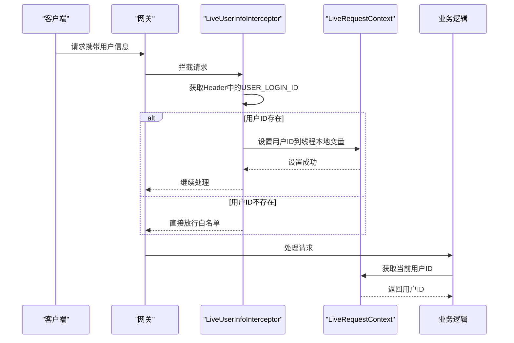

# 用户登录API

<cite>
**本文档引用的文件**  
- [UserLoginController.java](file://live-api/src/main/java/com/logilong/live/api/controller/UserLoginController.java)
- [UserLoginServiceImpl.java](file://live-api/src/main/java/com/logilong/live/api/service/impl/UserLoginServiceImpl.java)
- [IUserLoginService.java](file://live-api/src/main/java/com/logilong/live/api/service/IUserLoginService.java)
- [UserLoginVO.java](file://live-api/src/main/java/com/logilong/live/api/vo/UserLoginVO.java)
- [WebResponseVO.java](file://live-common-interface/src/main/java/com/logilong/live/common/interfaces/vo/WebResponseVO.java)
- [ApiErrorEnum.java](file://live-api/src/main/java/com/logilong/live/api/error/ApiErrorEnum.java)
- [LiveUserInfoInterceptor.java](file://live-framework/live-framework-web-starter/src/main/java/com/logilong/live/web/ starter/context/LiveUserInfoInterceptor.java)
- [ISmsRPC.java](file://live-msg-interface/src/main/java/com/logilong/live/msg/interfaces/ISmsRPC.java)
- [IUserPhoneRPC.java](file://live-user-interface/src/main/java/com/logilong/live/user/interfaces/IUserPhoneRPC.java)
- [IAccountTokenRPC.java](file://live-account-interface/src/main/java/com/logilong/live/account/interfaces/IAccountTokenRPC.java)
</cite>

## 目录
1. [简介](#简介)
2. [核心接口说明](#核心接口说明)
3. [请求参数与响应结构](#请求参数与响应结构)
4. [登录流程实现逻辑](#登录流程实现逻辑)
5. [调用示例](#调用示例)
6. [错误码说明](#错误码说明)
7. [认证机制](#认证机制)

## 简介
本文档详细描述了`UserLoginController`提供的用户登录相关RESTful接口，包括获取验证码、用户登录等功能。文档涵盖接口定义、请求参数、响应结构、错误码、实现流程及认证机制，旨在为前端开发和系统集成提供完整的技术参考。

## 核心接口说明

### 获取验证码接口
- **HTTP方法**: POST
- **URL路径**: `/userLogin/sendLoginCode`
- **功能描述**: 向指定手机号发送登录验证码，用于后续登录验证。

### 用户登录接口
- **HTTP方法**: POST
- **URL路径**: `/userLogin/login`
- **功能描述**: 使用手机号和验证码进行登录，校验通过后生成Token并设置Cookie，返回用户信息。

**Section sources**
- [UserLoginController.java](file://live-api/src/main/java/com/logilong/live/api/controller/UserLoginController.java#L19-L31)
- [IUserLoginService.java](file://live-api/src/main/java/com/logilong/live/api/service/IUserLoginService.java#L9-L17)

## 请求参数与响应结构

### 请求参数
| 接口 | 参数名 | 类型 | 必填 | 说明 |
|------|--------|------|------|------|
| 获取验证码 | phone | String | 是 | 用户手机号 |
| 用户登录 | phone | String | 是 | 用户手机号 |
| 用户登录 | code | Integer | 是 | 验证码（需大于1000） |

### 响应结构
所有接口均返回统一的`WebResponseVO`结构：

```json
{
  "code": 200,
  "msg": "success",
  "data": {}
}
```

其中：
- `code`: 状态码（200成功，其他为错误）
- `msg`: 描述信息
- `data`: 返回数据，登录成功时包含`UserLoginVO`

#### UserLoginVO结构
```java
@Data
public class UserLoginVO {
    private Long userId;
}
```

**Section sources**
- [UserLoginVO.java](file://live-api/src/main/java/com/logilong/live/api/vo/UserLoginVO.java#L1-L10)
- [WebResponseVO.java](file://live-common-interface/src/main/java/com/logilong/live/common/interfaces/vo/WebResponseVO.java#L1-L72)

## 登录流程实现逻辑

用户登录流程包含以下关键步骤：



**Diagram sources**
- [UserLoginServiceImpl.java](file://live-api/src/main/java/com/logilong/live/api/service/impl/UserLoginServiceImpl.java#L39-L87)

**Section sources**
- [UserLoginServiceImpl.java](file://live-api/src/main/java/com/logilong/live/api/service/impl/UserLoginServiceImpl.java#L26-L88)

## 调用示例

### 获取验证码请求
```http
POST /userLogin/sendLoginCode HTTP/1.1
Content-Type: application/x-www-form-urlencoded

phone=13800138000
```

#### 成功响应
```json
{
  "code": 200,
  "msg": "success",
  "data": null
}
```

#### 失败响应（手机号为空）
```json
{
  "code": 501,
  "msg": "手机号不能为空",
  "data": null
}
```

### 用户登录请求
```http
POST /userLogin/login HTTP/1.1
Content-Type: application/x-www-form-urlencoded

phone=13800138000&code=123456
```

#### 成功响应
```json
{
  "code": 200,
  "msg": "success",
  "data": {
    "userId": 10001
  }
}
```

#### 失败响应（验证码错误）
```json
{
  "code": 501,
  "msg": "验证码错误",
  "data": null
}
```

**Section sources**
- [UserLoginServiceImpl.java](file://live-api/src/main/java/com/logilong/live/api/service/impl/UserLoginServiceImpl.java#L40-L87)

## 错误码说明

`ApiErrorEnum`中定义的登录相关错误码：

| 错误码 | 错误消息 | 触发条件 |
|--------|----------|----------|
| 1 | 手机号不能为空 | phone参数为空或null |
| 2 | 手机号格式异常 | phone不符合中国大陆手机号正则格式 |
| 3 | 验证码格式异常 | code为null或小于等于1000 |
| 4 | 用户登录失败 | 用户服务返回登录失败 |

**Section sources**
- [ApiErrorEnum.java](file://live-api/src/main/java/com/logilong/live/api/error/ApiErrorEnum.java#L12-L15)

## 认证机制

系统通过`LiveUserInfoInterceptor`实现用户认证：



**Diagram sources**
- [LiveUserInfoInterceptor.java](file://live-framework/live-framework-web-starter/src/main/java/com/logilong/live/web/starter/context/LiveUserInfoInterceptor.java#L14-L35)

**Section sources**
- [LiveUserInfoInterceptor.java](file://live-framework/live-framework-web-starter/src/main/java/com/logilong/live/web/starter/context/LiveUserInfoInterceptor.java#L1-L35)