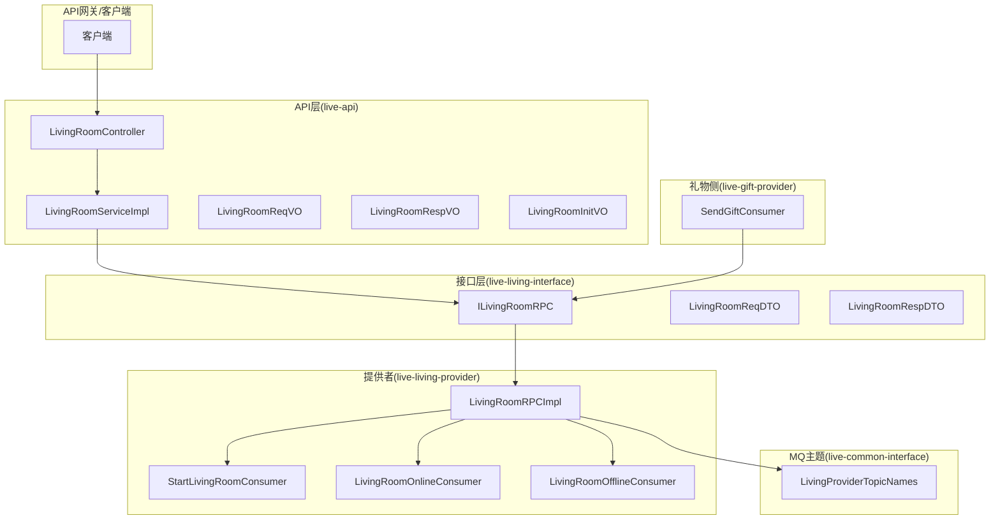
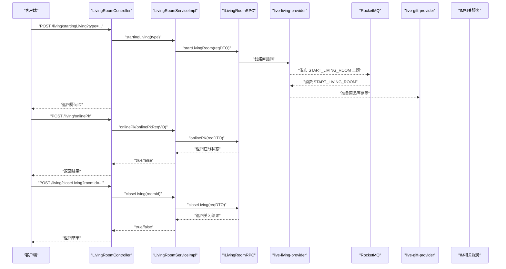
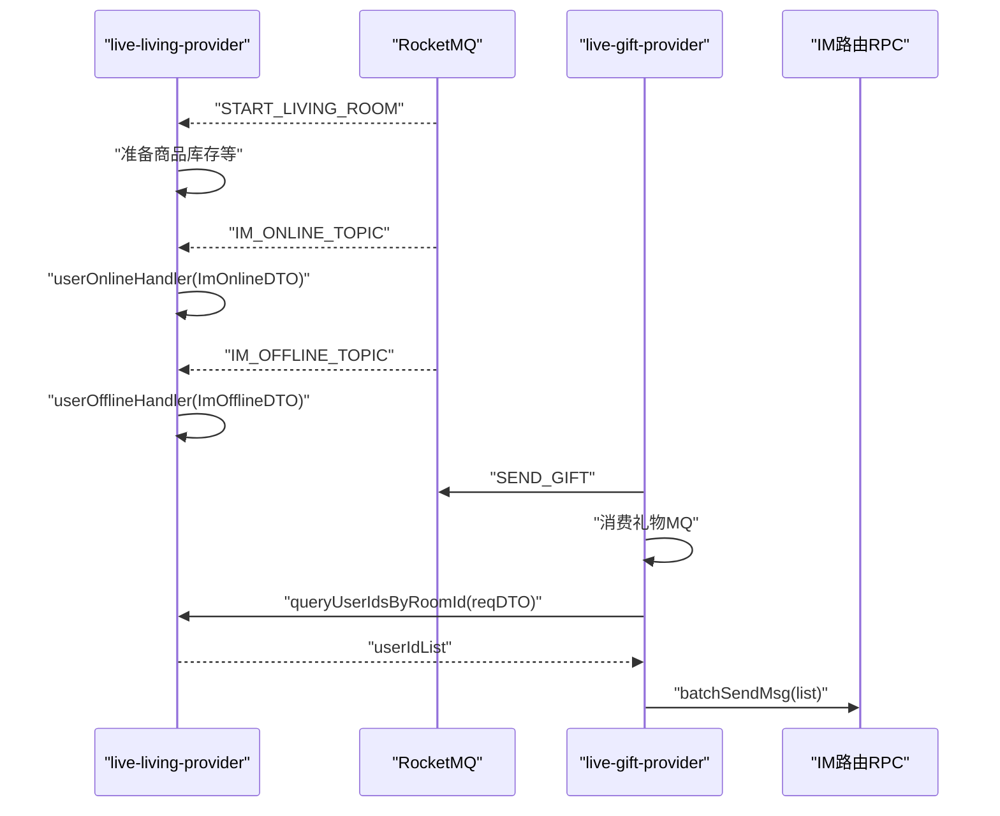
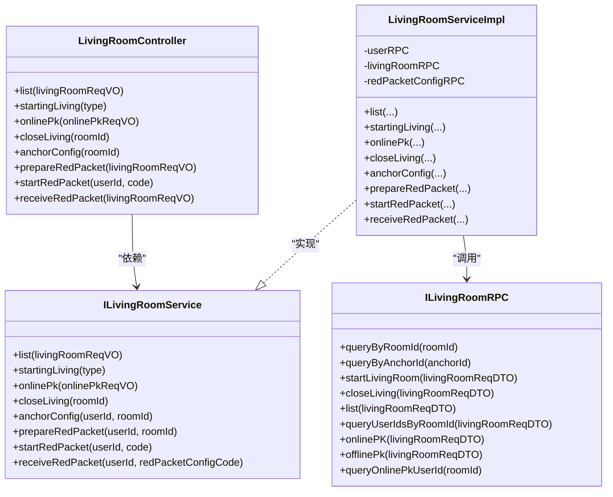

# 直播间API

<cite>
**本文引用的文件**
- [LivingRoomController.java](file://live-api/src/main/java/com/logilong/live/api/controller/LivingRoomController.java)
- [ILivingRoomService.java](file://live-api/src/main/java/com/logilong/live/api/service/ILivingRoomService.java)
- [LivingRoomServiceImpl.java](file://live-api/src/main/java/com/logilong/live/api/service/impl/LivingRoomServiceImpl.java)
- [LivingRoomReqVO.java](file://live-api/src/main/java/com/logilong/live/api/vo/req/LivingRoomReqVO.java)
- [LivingRoomRespVO.java](file://live-api/src/main/java/com/logilong/live/api/vo/resp/LivingRoomRespVO.java)
- [LivingRoomInitVO.java](file://live-api/src/main/java/com/logilong/live/api/vo/LivingRoomInitVO.java)
- [ILivingRoomRPC.java](file://live-living-interface/src/main/java/com/logilong/live/living/interfaces/rpc/ILivingRoomRPC.java)
- [LivingRoomReqDTO.java](file://live-living-interface/src/main/java/com/logilong/live/living/interfaces/dto/LivingRoomReqDTO.java)
- [LivingRoomRespDTO.java](file://live-living-interface/src/main/java/com/logilong/live/living/interfaces/dto/LivingRoomRespDTO.java)
- [ApiErrorEnum.java](file://live-api/src/main/java/com/logilong/live/api/error/ApiErrorEnum.java)
- [LivingProviderTopicNames.java](file://live-common-interface/src/main/java/com/logilong/live/common/interfaces/topic/LivingProviderTopicNames.java)
- [StartLivingRoomConsumer.java](file://live-living-provider/src/main/java/com/logilong/live/living/provider/consumer/StartLivingRoomConsumer.java)
- [LivingRoomOnlineConsumer.java](file://live-living-provider/src/main/java/com/logilong/live/living/provider/consumer/LivingRoomOnlineConsumer.java)
- [LivingRoomOfflineConsumer.java](file://live-living-provider/src/main/java/com/logilong/live/living/provider/consumer/LivingRoomOfflineConsumer.java)
- [SendGiftConsumer.java](file://live-gift-provider/src/main/java/com/logilong/live/gift/provider/consumer/SendGiftConsumer.java)
</cite>

## 目录
1. [简介](#简介)
2. [项目结构](#项目结构)
3. [核心组件](#核心组件)
4. [架构总览](#架构总览)
5. [详细组件分析](#详细组件分析)
6. [依赖关系分析](#依赖关系分析)
7. [性能考量](#性能考量)
8. [故障排查指南](#故障排查指南)
9. [结论](#结论)
10. [附录](#附录)

## 简介
本文件面向开发者，系统性梳理直播间的API能力，包括创建、加入、退出、状态查询、PK在线、红包雨等接口；明确请求体LivingRoomReqVO与响应体LivingRoomRespVO的数据结构；解释ILivingRoomRPC在live-living-provider中的作用与调用链；阐述直播间状态同步机制与MQ通知（IM、礼物）流程；给出创建成功与加入失败（房间不存在）的调用示例及对应错误码说明。

## 项目结构
- 控制层：位于live-api模块，提供REST接口入口，负责参数校验、限流、返回统一包装。
- 服务层：位于live-api模块，封装对ILivingRoomRPC的调用，完成业务编排与跨模块RPC调用。
- 接口定义：位于live-living-interface模块，定义ILivingRoomRPC及DTO。
- 提供者：位于live-living-provider模块，实现RPC接口，处理直播间生命周期与MQ消费。
- MQ主题：位于live-common-interface模块，定义直播相关MQ主题名称。
- 礼物侧：位于live-gift-provider模块，消费礼物MQ，向IM广播礼物事件。
- IM侧：位于live-im-*模块，通过MQ接收在线/离线事件，驱动直播间用户状态同步。

图表来源
- [LivingRoomController.java](file://live-api/src/main/java/com/logilong/live/api/controller/LivingRoomController.java#L1-L96)
- [LivingRoomServiceImpl.java](file://live-api/src/main/java/com/logilong/live/api/service/impl/LivingRoomServiceImpl.java#L1-L160)
- [ILivingRoomRPC.java](file://live-living-interface/src/main/java/com/logilong/live/living/interfaces/rpc/ILivingRoomRPC.java#L1-L59)
- [LivingRoomReqDTO.java](file://live-living-interface/src/main/java/com/logilong/live/living/interfaces/dto/LivingRoomReqDTO.java#L1-L27)
- [LivingRoomRespDTO.java](file://live-living-interface/src/main/java/com/logilong/live/living/interfaces/dto/LivingRoomRespDTO.java#L1-L23)
- [LivingProviderTopicNames.java](file://live-common-interface/src/main/java/com/logilong/live/common/interfaces/topic/LivingProviderTopicNames.java#L1-L11)
- [StartLivingRoomConsumer.java](file://live-living-provider/src/main/java/com/logilong/live/living/provider/consumer/StartLivingRoomConsumer.java#L1-L51)
- [LivingRoomOnlineConsumer.java](file://live-living-provider/src/main/java/com/logilong/live/living/provider/consumer/LivingRoomOnlineConsumer.java#L1-L51)
- [LivingRoomOfflineConsumer.java](file://live-living-provider/src/main/java/com/logilong/live/living/provider/consumer/LivingRoomOfflineConsumer.java#L1-L51)
- [SendGiftConsumer.java](file://live-gift-provider/src/main/java/com/logilong/live/gift/provider/consumer/SendGiftConsumer.java#L1-L212)

章节来源
- [LivingRoomController.java](file://live-api/src/main/java/com/logilong/live/api/controller/LivingRoomController.java#L1-L96)
- [ILivingRoomService.java](file://live-api/src/main/java/com/logilong/live/api/service/ILivingRoomService.java#L1-L67)
- [LivingRoomServiceImpl.java](file://live-api/src/main/java/com/logilong/live/api/service/impl/LivingRoomServiceImpl.java#L1-L160)

## 核心组件
- LivingRoomController：REST控制器，暴露直播相关接口，执行参数校验与限流策略，返回统一响应包装。
- ILivingRoomService：API层服务接口，定义列表、创建、PK在线、关闭、主播配置、红包雨等业务方法。
- LivingRoomServiceImpl：API层服务实现，聚合用户RPC、ILivingRoomRPC、红包RPC，完成业务编排与跨模块调用。
- ILivingRoomRPC：直播域RPC接口，定义查询、创建、关闭、列表、PK在线/离线、按房间查询在线用户等能力。
- VO模型：
  - LivingRoomReqVO：请求参数载体，包含类型、分页、房间ID、红包配置码等。
  - LivingRoomRespVO：列表响应载体，包含房间基础信息。
  - LivingRoomInitVO：主播配置响应载体，包含主播/观众昵称、头像、是否主播、默认背景、PK对象ID等。

章节来源
- [LivingRoomController.java](file://live-api/src/main/java/com/logilong/live/api/controller/LivingRoomController.java#L1-L96)
- [ILivingRoomService.java](file://live-api/src/main/java/com/logilong/live/api/service/ILivingRoomService.java#L1-L67)
- [LivingRoomServiceImpl.java](file://live-api/src/main/java/com/logilong/live/api/service/impl/LivingRoomServiceImpl.java#L1-L160)
- [LivingRoomReqVO.java](file://live-api/src/main/java/com/logilong/live/api/vo/req/LivingRoomReqVO.java#L1-L14)
- [LivingRoomRespVO.java](file://live-api/src/main/java/com/logilong/live/api/vo/resp/LivingRoomRespVO.java#L1-L16)
- [LivingRoomInitVO.java](file://live-api/src/main/java/com/logilong/live/api/vo/LivingRoomInitVO.java#L1-L24)

## 架构总览
- API层通过LivingRoomController接收HTTP请求，调用LivingRoomServiceImpl执行业务逻辑。
- LivingRoomServiceImpl通过ILivingRoomRPC与live-living-provider交互，完成直播间生命周期管理。
- 直播间状态变化通过MQ主题通知相关服务（IM、礼物侧），实现跨模块解耦与实时广播。

图表来源
- [LivingRoomController.java](file://live-api/src/main/java/com/logilong/live/api/controller/LivingRoomController.java#L1-L96)
- [LivingRoomServiceImpl.java](file://live-api/src/main/java/com/logilong/live/api/service/impl/LivingRoomServiceImpl.java#L1-L160)
- [ILivingRoomRPC.java](file://live-living-interface/src/main/java/com/logilong/live/living/interfaces/rpc/ILivingRoomRPC.java#L1-L59)
- [LivingProviderTopicNames.java](file://live-common-interface/src/main/java/com/logilong/live/common/interfaces/topic/LivingProviderTopicNames.java#L1-L11)
- [StartLivingRoomConsumer.java](file://live-living-provider/src/main/java/com/logilong/live/living/provider/consumer/StartLivingRoomConsumer.java#L1-L51)
- [SendGiftConsumer.java](file://live-gift-provider/src/main/java/com/logilong/live/gift/provider/consumer/SendGiftConsumer.java#L1-L212)

## 详细组件分析

### 控制器接口定义与行为
- 列表接口：/living/list，POST，参数LivingRoomReqVO，返回LivingRoomPageRespVO（由服务层转换）。
- 创建接口：/living/startingLiving，POST，参数type，返回LivingRoomInitVO（包含roomId）。
- PK在线接口：/living/onlinePk，POST，参数OnlinePKReqVO，返回布尔值。
- 关闭接口：/living/closeLiving，POST，参数roomId，返回布尔值。
- 主播配置接口：/living/anchorConfig，POST，参数roomId，返回LivingRoomInitVO。
- 红包雨准备接口：/living/prepareRedPacket，POST，参数LivingRoomReqVO，返回布尔值。
- 红包雨开始接口：/living/startRedPacket，POST，参数userId与code，返回布尔值。
- 红包雨领取接口：/living/receiveRedPacket，POST，参数LivingRoomReqVO，返回RedPacketReceiveVO。

章节来源
- [LivingRoomController.java](file://live-api/src/main/java/com/logilong/live/api/controller/LivingRoomController.java#L1-L96)

### 请求体LivingRoomReqVO字段说明
- type：直播类型（整型）
- page：页码（整型，>0）
- pageSize：每页大小（整型，<=100）
- roomId：房间ID（整型）
- redPacketConfigCode：红包配置码（字符串）

章节来源
- [LivingRoomReqVO.java](file://live-api/src/main/java/com/logilong/live/api/vo/req/LivingRoomReqVO.java#L1-L14)

### 响应体LivingRoomRespVO字段说明
- id：房间ID
- roomName：房间名称
- anchorId：主播ID
- watchNum：观看人数
- goodNum：点赞数
- type：直播类型
- covertImg：封面图

章节来源
- [LivingRoomRespVO.java](file://live-api/src/main/java/com/logilong/live/api/vo/resp/LivingRoomRespVO.java#L1-L16)

### 响应体LivingRoomInitVO字段说明
- anchorId：主播ID
- userId：当前用户ID
- anchorImg：主播头像（兼容字段）
- roomName：房间名称
- isAnchor：是否为主播
- redPacketConfigCode：红包配置码
- avatar：当前用户头像
- roomId：房间ID
- watcherNickName：观众昵称
- anchorNickName：主播昵称
- watcherAvatar：观众头像
- defaultBgImg：默认背景图
- pkObjId：PK对象ID

章节来源
- [LivingRoomInitVO.java](file://live-api/src/main/java/com/logilong/live/api/vo/LivingRoomInitVO.java#L1-L24)

### 服务层业务编排与RPC交互
- list：将LivingRoomReqVO转换为LivingRoomReqDTO后调用ILivingRoomRPC.list，再将LivingRoomRespDTO列表转换为LivingRoomRespVO列表。
- startingLiving：组装LivingRoomReqDTO（含主播ID、房间名、头像、类型），调用ILivingRoomRPC.startLivingRoom，返回房间ID。
- onlinePk：设置appId与pkObjId，调用ILivingRoomRPC.onlinePK，若在线状态为false则抛出业务异常。
- closeLiving：组装LivingRoomReqDTO（roomId与anchorId），调用ILivingRoomRPC.closeLiving。
- anchorConfig：调用ILivingRoomRPC.queryByRoomId，校验房间是否存在；批量查询主播与当前用户信息，组装LivingRoomInitVO；若房间不存在，roomId置为-1。
- prepareRedPacket：校验房间存在且当前用户为主播，调用红包RPC准备红包。
- startRedPacket：校验房间存在，调用红包RPC开始红包雨。
- receiveRedPacket：调用红包RPC领取红包，返回RedPacketReceiveVO。

章节来源
- [LivingRoomServiceImpl.java](file://live-api/src/main/java/com/logilong/live/api/service/impl/LivingRoomServiceImpl.java#L1-L160)

### ILivingRoomRPC接口与DTO
- 查询房间：queryByRoomId、queryByAnchorId
- 生命周期：startLivingRoom、closeLiving
- 列表：list
- PK：onlinePK、offlinePk、queryOnlinePkUserId
- 批量用户：queryUserIdsByRoomId

章节来源
- [ILivingRoomRPC.java](file://live-living-interface/src/main/java/com/logilong/live/living/interfaces/rpc/ILivingRoomRPC.java#L1-L59)
- [LivingRoomReqDTO.java](file://live-living-interface/src/main/java/com/logilong/live/living/interfaces/dto/LivingRoomReqDTO.java#L1-L27)
- [LivingRoomRespDTO.java](file://live-living-interface/src/main/java/com/logilong/live/living/interfaces/dto/LivingRoomRespDTO.java#L1-L23)

### 直播间状态同步与MQ通知
- MQ主题：START_LIVING_ROOM用于通知直播开始，live-living-provider订阅该主题，准备商品库存等。
- IM在线/离线：live-living-provider订阅IM在线/离线主题，分别调用userOnlineHandler与userOfflineHandler更新房间内用户状态。
- 礼物广播：live-gift-provider消费礼物MQ，根据房间ID查询在线用户列表，通过IM路由RPC批量广播礼物事件。

图表来源
- [LivingProviderTopicNames.java](file://live-common-interface/src/main/java/com/logilong/live/common/interfaces/topic/LivingProviderTopicNames.java#L1-L11)
- [StartLivingRoomConsumer.java](file://live-living-provider/src/main/java/com/logilong/live/living/provider/consumer/StartLivingRoomConsumer.java#L1-L51)
- [LivingRoomOnlineConsumer.java](file://live-living-provider/src/main/java/com/logilong/live/living/provider/consumer/LivingRoomOnlineConsumer.java#L1-L51)
- [LivingRoomOfflineConsumer.java](file://live-living-provider/src/main/java/com/logilong/live/living/provider/consumer/LivingRoomOfflineConsumer.java#L1-L51)
- [SendGiftConsumer.java](file://live-gift-provider/src/main/java/com/logilong/live/gift/provider/consumer/SendGiftConsumer.java#L1-L212)
- [ILivingRoomRPC.java](file://live-living-interface/src/main/java/com/logilong/live/living/interfaces/rpc/ILivingRoomRPC.java#L1-L59)

## 依赖关系分析
- 控制器依赖服务层接口ILivingRoomService。
- 服务层依赖ILivingRoomRPC、用户RPC、红包RPC。
- RPC接口定义位于接口层，提供者实现位于提供者层。
- MQ主题与消费者位于公共接口与提供者模块。

图表来源
- [LivingRoomController.java](file://live-api/src/main/java/com/logilong/live/api/controller/LivingRoomController.java#L1-L96)
- [ILivingRoomService.java](file://live-api/src/main/java/com/logilong/live/api/service/ILivingRoomService.java#L1-L67)
- [LivingRoomServiceImpl.java](file://live-api/src/main/java/com/logilong/live/api/service/impl/LivingRoomServiceImpl.java#L1-L160)
- [ILivingRoomRPC.java](file://live-living-interface/src/main/java/com/logilong/live/living/interfaces/rpc/ILivingRoomRPC.java#L1-L59)

章节来源
- [LivingRoomController.java](file://live-api/src/main/java/com/logilong/live/api/controller/LivingRoomController.java#L1-L96)
- [ILivingRoomService.java](file://live-api/src/main/java/com/logilong/live/api/service/ILivingRoomService.java#L1-L67)
- [LivingRoomServiceImpl.java](file://live-api/src/main/java/com/logilong/live/api/service/impl/LivingRoomServiceImpl.java#L1-L160)
- [ILivingRoomRPC.java](file://live-living-interface/src/main/java/com/logilong/live/living/interfaces/rpc/ILivingRoomRPC.java#L1-L59)

## 性能考量
- 分页参数限制：列表接口对page与pageSize进行约束，避免过大分页请求影响性能。
- 限流策略：多处接口使用注解级限流，防止接口被恶意或突发流量冲击。
- 批量广播：礼物侧通过查询房间内所有在线用户ID后批量广播，减少多次RPC调用。
- 缓存键设计：礼物侧使用Redis脚本原子操作维护PK进度，降低并发竞争带来的锁粒度。

章节来源
- [LivingRoomController.java](file://live-api/src/main/java/com/logilong/live/api/controller/LivingRoomController.java#L1-L96)
- [LivingRoomServiceImpl.java](file://live-api/src/main/java/com/logilong/live/api/service/impl/LivingRoomServiceImpl.java#L1-L160)
- [SendGiftConsumer.java](file://live-gift-provider/src/main/java/com/logilong/live/gift/provider/consumer/SendGiftConsumer.java#L1-L212)

## 故障排查指南
- 参数校验失败：当type/page/pageSize/roomId为空或不合法时，返回参数错误。
- 房间不存在：anchorConfig中若查询不到房间信息，返回roomId=-1。
- PK在线冲突：onlinePk返回在线状态为false时，抛出业务异常，提示“目前正有人连线，请稍后再试”。
- 关播异常：closeLiving返回false时，返回“关播异常”。
- 红包相关：receiveRedPacket返回“红包已派发完毕”表示无剩余可领。

章节来源
- [LivingRoomController.java](file://live-api/src/main/java/com/logilong/live/api/controller/LivingRoomController.java#L1-L96)
- [LivingRoomServiceImpl.java](file://live-api/src/main/java/com/logilong/live/api/service/impl/LivingRoomServiceImpl.java#L1-L160)
- [ApiErrorEnum.java](file://live-api/src/main/java/com/logilong/live/api/error/ApiErrorEnum.java#L1-L37)

## 结论
本API围绕LivingRoomController提供完整的直播间生命周期管理能力，通过ILivingRoomRPC与live-living-provider解耦协作，并借助MQ实现IM与礼物侧的实时通知。参数校验、限流与错误码体系确保了接口的健壮性与可运维性。建议在接入时严格遵循请求参数规范与错误码约定，结合限流策略合理控制调用频率。

## 附录

### API清单与示例

- 创建直播间
  - URL：/living/startingLiving
  - 方法：POST
  - 请求参数：type（整型）
  - 返回：LivingRoomInitVO（包含roomId）
  - 示例路径：[StartingLiving示例](file://live-api/src/main/java/com/logilong/live/api/controller/LivingRoomController.java#L32-L40)

- 加入PK直播间
  - URL：/living/onlinePk
  - 方法：POST
  - 请求参数：OnlinePKReqVO（包含roomId等）
  - 返回：布尔值
  - 示例路径：[OnlinePk示例](file://live-api/src/main/java/com/logilong/live/api/controller/LivingRoomController.java#L42-L47)

- 退出/关闭直播间
  - URL：/living/closeLiving
  - 方法：POST
  - 请求参数：roomId（整型）
  - 返回：布尔值
  - 示例路径：[CloseLiving示例](file://live-api/src/main/java/com/logilong/live/api/controller/LivingRoomController.java#L50-L58)

- 主播配置查询
  - URL：/living/anchorConfig
  - 方法：POST
  - 请求参数：roomId（整型）
  - 返回：LivingRoomInitVO
  - 示例路径：[AnchorConfig示例](file://live-api/src/main/java/com/logilong/live/api/controller/LivingRoomController.java#L63-L66)

- 红包雨准备
  - URL：/living/prepareRedPacket
  - 方法：POST
  - 请求参数：LivingRoomReqVO（包含roomId）
  - 返回：布尔值
  - 示例路径：[PrepareRedPacket示例](file://live-api/src/main/java/com/logilong/live/api/controller/LivingRoomController.java#L71-L75)

- 红包雨开始
  - URL：/living/startRedPacket
  - 方法：POST
  - 请求参数：userId（长整型）、code（字符串）
  - 返回：布尔值
  - 示例路径：[StartRedPacket示例](file://live-api/src/main/java/com/logilong/live/api/controller/LivingRoomController.java#L80-L84)

- 红包雨领取
  - URL：/living/receiveRedPacket
  - 方法：POST
  - 请求参数：LivingRoomReqVO（包含redPacketConfigCode）
  - 返回：RedPacketReceiveVO（包含价格与提示信息）
  - 示例路径：[ReceiveRedPacket示例](file://live-api/src/main/java/com/logilong/live/api/controller/LivingRoomController.java#L86-L94)

### 错误码说明
- LIVING_ROOM_END：直播间已结束
- PK_ONLINE_BUSY：目前正有人连线，请稍后再试
- 其他通用错误：见ApiErrorEnum枚举

章节来源
- [ApiErrorEnum.java](file://live-api/src/main/java/com/logilong/live/api/error/ApiErrorEnum.java#L1-L37)