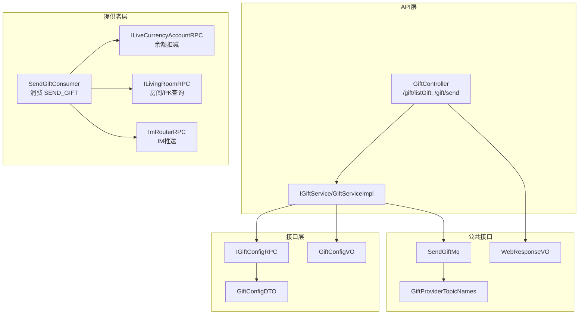
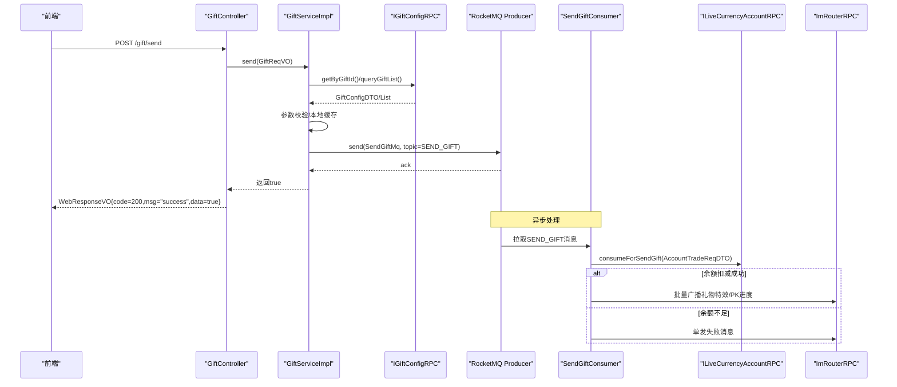
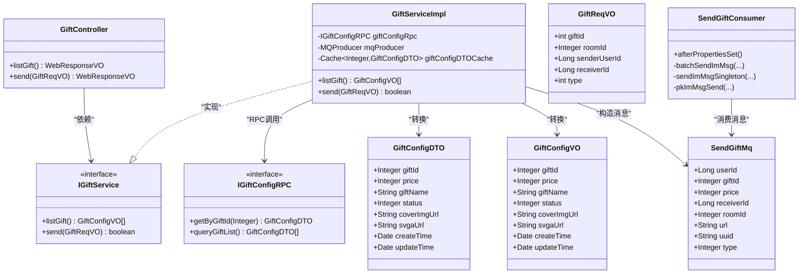

# 礼物系统API

<cite>
**本文引用的文件**
- [GiftController.java](file://live-api/src/main/java/com/logilong/live/api/controller/GiftController.java)
- [IGiftService.java](file://live-api/src/main/java/com/logilong/live/api/service/IGiftService.java)
- [GiftServiceImpl.java](file://live-api/src/main/java/com/logilong/live/api/service/impl/GiftServiceImpl.java)
- [GiftReqVO.java](file://live-api/src/main/java/com/logilong/live/api/vo/req/GiftReqVO.java)
- [GiftConfigVO.java](file://live-api/src/main/java/com/logilong/live/api/vo/resp/GiftConfigVO.java)
- [IGiftConfigRPC.java](file://live-gift-interface/src/main/java/com/logilong/live/gift/interfaces/IGiftConfigRPC.java)
- [GiftConfigDTO.java](file://live-gift-interface/src/main/java/com/logilong/live/gift/dto/GiftConfigDTO.java)
- [SendGiftMq.java](file://live-common-interface/src/main/java/com/logilong/live/common/interfaces/dto/SendGiftMq.java)
- [GiftProviderTopicNames.java](file://live-common-interface/src/main/java/com/logilong/live/common/interfaces/topic/GiftProviderTopicNames.java)
- [SendGiftConsumer.java](file://live-gift-provider/src/main/java/com/logilong/live/gift/provider/consumer/SendGiftConsumer.java)
- [ApiErrorEnum.java](file://live-api/src/main/java/com/logilong/live/api/error/ApiErrorEnum.java)
- [WebResponseVO.java](file://live-common-interface/src/main/java/com/logilong/live/common/interfaces/vo/WebResponseVO.java)
</cite>

## 目录
1. [简介](#简介)
2. [项目结构](#项目结构)
3. [核心组件](#核心组件)
4. [架构总览](#架构总览)
5. [详细组件分析](#详细组件分析)
6. [依赖关系分析](#依赖关系分析)
7. [性能考量](#性能考量)
8. [故障排查指南](#故障排查指南)
9. [结论](#结论)

## 简介
本文件面向前端与后端开发者，系统化梳理礼物系统的API设计与实现，重点覆盖以下内容：
- 送礼接口与礼物配置查询接口的HTTP定义、请求体与响应格式
- 送礼流程中与live-gift-provider的RPC调用关系
- 基于RocketMQ的异步处理送礼记录与IM推送机制
- 成功与失败场景的响应示例，结合业务错误码(ApiErrorEnum)

## 项目结构
礼物系统涉及三层：
- API网关层：控制器负责对外暴露REST接口
- 服务层：封装业务逻辑，进行参数校验、RPC调用与消息投递
- 提供者层：消费MQ，执行余额扣减、IM广播、PK进度计算等

图表来源
- [GiftController.java](file://live-api/src/main/java/com/logilong/live/api/controller/GiftController.java#L1-L41)
- [IGiftService.java](file://live-api/src/main/java/com/logilong/live/api/service/IGiftService.java#L1-L25)
- [GiftServiceImpl.java](file://live-api/src/main/java/com/logilong/live/api/service/impl/GiftServiceImpl.java#L1-L78)
- [IGiftConfigRPC.java](file://live-gift-interface/src/main/java/com/logilong/live/gift/interfaces/IGiftConfigRPC.java#L1-L29)
- [GiftConfigDTO.java](file://live-gift-interface/src/main/java/com/logilong/live/gift/dto/GiftConfigDTO.java#L1-L25)
- [GiftConfigVO.java](file://live-api/src/main/java/com/logilong/live/api/vo/resp/GiftConfigVO.java#L1-L19)
- [SendGiftMq.java](file://live-common-interface/src/main/java/com/logilong/live/common/interfaces/dto/SendGiftMq.java#L1-L17)
- [GiftProviderTopicNames.java](file://live-common-interface/src/main/java/com/logilong/live/common/interfaces/topic/GiftProviderTopicNames.java#L1-L21)
- [SendGiftConsumer.java](file://live-gift-provider/src/main/java/com/logilong/live/gift/provider/consumer/SendGiftConsumer.java#L1-L212)

章节来源
- [GiftController.java](file://live-api/src/main/java/com/logilong/live/api/controller/GiftController.java#L1-L41)
- [IGiftService.java](file://live-api/src/main/java/com/logilong/live/api/service/IGiftService.java#L1-L25)
- [GiftServiceImpl.java](file://live-api/src/main/java/com/logilong/live/api/service/impl/GiftServiceImpl.java#L1-L78)

## 核心组件
- GiftController：对外暴露礼物相关REST接口，返回统一响应(WebResponseVO)
- IGiftService/GiftServiceImpl：业务编排，包含RPC调用、本地缓存、MQ消息投递
- IGiftConfigRPC：礼物配置RPC接口，提供按ID查询与全量查询能力
- GiftReqVO：送礼请求体，包含礼物ID、房间ID、发送者、接收者、类型等
- GiftConfigVO：礼物配置响应体，包含礼物ID、价格、名称、状态、封面与动效地址等
- SendGiftMq：送礼MQ消息体，包含用户ID、礼物ID、价格、接收者、房间、动效URL、UUID、类型
- GiftProviderTopicNames：RocketMQ主题常量，SEND_GIFT为主题名
- SendGiftConsumer：MQ消费者，执行余额扣减、IM广播、PK进度计算
- ApiErrorEnum：业务错误码枚举，用于统一错误标识
- WebResponseVO：统一响应包装类

章节来源
- [GiftController.java](file://live-api/src/main/java/com/logilong/live/api/controller/GiftController.java#L1-L41)
- [IGiftService.java](file://live-api/src/main/java/com/logilong/live/api/service/IGiftService.java#L1-L25)
- [GiftServiceImpl.java](file://live-api/src/main/java/com/logilong/live/api/service/impl/GiftServiceImpl.java#L1-L78)
- [IGiftConfigRPC.java](file://live-gift-interface/src/main/java/com/logilong/live/gift/interfaces/IGiftConfigRPC.java#L1-L29)
- [GiftReqVO.java](file://live-api/src/main/java/com/logilong/live/api/vo/req/GiftReqVO.java#L1-L14)
- [GiftConfigVO.java](file://live-api/src/main/java/com/logilong/live/api/vo/resp/GiftConfigVO.java#L1-L19)
- [SendGiftMq.java](file://live-common-interface/src/main/java/com/logilong/live/common/interfaces/dto/SendGiftMq.java#L1-L17)
- [GiftProviderTopicNames.java](file://live-common-interface/src/main/java/com/logilong/live/common/interfaces/topic/GiftProviderTopicNames.java#L1-L21)
- [SendGiftConsumer.java](file://live-gift-provider/src/main/java/com/logilong/live/gift/provider/consumer/SendGiftConsumer.java#L1-L212)
- [ApiErrorEnum.java](file://live-api/src/main/java/com/logilong/live/api/error/ApiErrorEnum.java#L1-L37)
- [WebResponseVO.java](file://live-common-interface/src/main/java/com/logilong/live/common/interfaces/vo/WebResponseVO.java#L1-L72)

## 架构总览
送礼流程采用“同步接口+异步处理”的模式：
- 控制器接收请求，调用服务层
- 服务层进行参数校验、本地缓存命中、RPC查询礼物配置
- 服务层构造MQ消息并投递到SEND_GIFT主题
- 提供者侧消费者从MQ拉取消息，执行余额扣减、IM广播、PK进度计算
- 失败时通过IM单发失败消息告知用户

图表来源
- [GiftController.java](file://live-api/src/main/java/com/logilong/live/api/controller/GiftController.java#L1-L41)
- [GiftServiceImpl.java](file://live-api/src/main/java/com/logilong/live/api/service/impl/GiftServiceImpl.java#L1-L78)
- [IGiftConfigRPC.java](file://live-gift-interface/src/main/java/com/logilong/live/gift/interfaces/IGiftConfigRPC.java#L1-L29)
- [SendGiftMq.java](file://live-common-interface/src/main/java/com/logilong/live/common/interfaces/dto/SendGiftMq.java#L1-L17)
- [GiftProviderTopicNames.java](file://live-common-interface/src/main/java/com/logilong/live/common/interfaces/topic/GiftProviderTopicNames.java#L1-L21)
- [SendGiftConsumer.java](file://live-gift-provider/src/main/java/com/logilong/live/gift/provider/consumer/SendGiftConsumer.java#L1-L212)

## 详细组件分析

### 送礼接口 /gift/send
- HTTP方法：POST
- 路径：/gift/send
- 请求体：GiftReqVO
  - 字段说明
    - giftId：礼物ID
    - roomId：房间ID
    - senderUserId：发送者用户ID
    - receiverId：接收者用户ID
    - type：送礼类型（默认/PK）
- 响应格式：WebResponseVO
  - code：200表示成功
  - msg：success
  - data：布尔值，true表示受理成功
- 业务要点
  - 服务层会先从RPC查询礼物配置，若不存在则抛出业务错误
  - 校验发送者不能是自己
  - 构造SendGiftMq并投递到RocketMQ主题SEND_GIFT
  - 返回true，不阻塞等待异步处理结果

章节来源
- [GiftController.java](file://live-api/src/main/java/com/logilong/live/api/controller/GiftController.java#L1-L41)
- [IGiftService.java](file://live-api/src/main/java/com/logilong/live/api/service/IGiftService.java#L1-L25)
- [GiftServiceImpl.java](file://live-api/src/main/java/com/logilong/live/api/service/impl/GiftServiceImpl.java#L1-L78)
- [GiftReqVO.java](file://live-api/src/main/java/com/logilong/live/api/vo/req/GiftReqVO.java#L1-L14)
- [SendGiftMq.java](file://live-common-interface/src/main/java/com/logilong/live/common/interfaces/dto/SendGiftMq.java#L1-L17)
- [GiftProviderTopicNames.java](file://live-common-interface/src/main/java/com/logilong/live/common/interfaces/topic/GiftProviderTopicNames.java#L1-L21)
- [WebResponseVO.java](file://live-common-interface/src/main/java/com/logilong/live/common/interfaces/vo/WebResponseVO.java#L1-L72)

### 礼物配置查询接口 /gift/listGift
- HTTP方法：POST
- 路径：/gift/listGift
- 请求体：无
- 响应格式：WebResponseVO
  - data：GiftConfigVO列表
- 业务要点
  - 服务层调用RPC查询全量礼物配置，并转换为GiftConfigVO返回

章节来源
- [GiftController.java](file://live-api/src/main/java/com/logilong/live/api/controller/GiftController.java#L1-L41)
- [IGiftService.java](file://live-api/src/main/java/com/logilong/live/api/service/IGiftService.java#L1-L25)
- [GiftServiceImpl.java](file://live-api/src/main/java/com/logilong/live/api/service/impl/GiftServiceImpl.java#L1-L78)
- [IGiftConfigRPC.java](file://live-gift-interface/src/main/java/com/logilong/live/gift/interfaces/IGiftConfigRPC.java#L1-L29)
- [GiftConfigVO.java](file://live-api/src/main/java/com/logilong/live/api/vo/resp/GiftConfigVO.java#L1-L19)

### 送礼流程与RPC/MQ交互
- RPC调用链
  - IGiftConfigRPC.getByGiftId/getByGiftId：按礼物ID查询配置
  - IGiftConfigRPC.queryGiftList：查询全量礼物配置
- MQ消息
  - 主题：SEND_GIFT
  - 消息体：SendGiftMq，包含用户ID、礼物ID、价格、接收者、房间、动效URL、UUID、类型
- 提供者侧处理
  - SendGiftConsumer订阅SEND_GIFT，去重后执行余额扣减、IM广播或失败通知

章节来源
- [IGiftConfigRPC.java](file://live-gift-interface/src/main/java/com/logilong/live/gift/interfaces/IGiftConfigRPC.java#L1-L29)
- [SendGiftMq.java](file://live-common-interface/src/main/java/com/logilong/live/common/interfaces/dto/SendGiftMq.java#L1-L17)
- [GiftProviderTopicNames.java](file://live-common-interface/src/main/java/com/logilong/live/common/interfaces/topic/GiftProviderTopicNames.java#L1-L21)
- [SendGiftConsumer.java](file://live-gift-provider/src/main/java/com/logilong/live/gift/provider/consumer/SendGiftConsumer.java#L1-L212)

### 数据模型与复杂度
- GiftReqVO：字段简单，O(1)访问
- GiftConfigVO：字段固定，O(1)映射
- 本地缓存：Caffeine缓存GiftConfigDTO，按giftId键缓存，默认最大1000，过期90秒
- RPC查询：按ID查询为一次RPC调用；全量查询为一次RPC调用
- MQ投递：单条消息发送，幂等通过UUID+Redis锁保障

章节来源
- [GiftServiceImpl.java](file://live-api/src/main/java/com/logilong/live/api/service/impl/GiftServiceImpl.java#L1-L78)
- [GiftConfigDTO.java](file://live-gift-interface/src/main/java/com/logilong/live/gift/dto/GiftConfigDTO.java#L1-L25)

### 错误处理与业务错误码
- ApiErrorEnum关键错误码
  - GIFT_CONFIG_ERROR：礼物信息异常（如礼物不存在）
  - NOT_SEND_TO_YOURSELF：不允许送礼给自己
  - SEND_GIFT_ERROR：送礼失败
- 控制器返回统一响应(WebResponseVO)，code=200表示成功，data为业务返回值
- 失败场景
  - 余额不足：提供者侧在MQ消费时扣减失败，通过IM单发失败消息告知用户
  - 礼物不存在：服务层校验失败，返回业务错误

章节来源
- [ApiErrorEnum.java](file://live-api/src/main/java/com/logilong/live/api/error/ApiErrorEnum.java#L1-L37)
- [GiftServiceImpl.java](file://live-api/src/main/java/com/logilong/live/api/service/impl/GiftServiceImpl.java#L1-L78)
- [SendGiftConsumer.java](file://live-gift-provider/src/main/java/com/logilong/live/gift/provider/consumer/SendGiftConsumer.java#L1-L212)
- [WebResponseVO.java](file://live-common-interface/src/main/java/com/logilong/live/common/interfaces/vo/WebResponseVO.java#L1-L72)

## 依赖关系分析
- 控制器依赖服务接口
- 服务实现依赖RPC接口与MQ生产者
- 服务实现依赖本地缓存与工具类
- 提供者消费者依赖MQ消费者属性、Redis、银行RPC、直播房间RPC、IM路由RPC

图表来源
- [GiftController.java](file://live-api/src/main/java/com/logilong/live/api/controller/GiftController.java#L1-L41)
- [IGiftService.java](file://live-api/src/main/java/com/logilong/live/api/service/IGiftService.java#L1-L25)
- [GiftServiceImpl.java](file://live-api/src/main/java/com/logilong/live/api/service/impl/GiftServiceImpl.java#L1-L78)
- [IGiftConfigRPC.java](file://live-gift-interface/src/main/java/com/logilong/live/gift/interfaces/IGiftConfigRPC.java#L1-L29)
- [GiftConfigDTO.java](file://live-gift-interface/src/main/java/com/logilong/live/gift/dto/GiftConfigDTO.java#L1-L25)
- [GiftConfigVO.java](file://live-api/src/main/java/com/logilong/live/api/vo/resp/GiftConfigVO.java#L1-L19)
- [GiftReqVO.java](file://live-api/src/main/java/com/logilong/live/api/vo/req/GiftReqVO.java#L1-L14)
- [SendGiftMq.java](file://live-common-interface/src/main/java/com/logilong/live/common/interfaces/dto/SendGiftMq.java#L1-L17)
- [SendGiftConsumer.java](file://live-gift-provider/src/main/java/com/logilong/live/gift/provider/consumer/SendGiftConsumer.java#L1-L212)

## 性能考量
- 本地缓存：对GiftConfigDTO按giftId进行缓存，减少RPC调用次数，提升查询性能
- 批量IM推送：提供者侧批量发送IM消息，降低网络往返开销
- MQ异步：送礼接口立即返回，异步处理扣减与广播，提高接口吞吐
- 幂等控制：通过UUID+Redis锁避免重复消费，确保业务一致性

章节来源
- [GiftServiceImpl.java](file://live-api/src/main/java/com/logilong/live/api/service/impl/GiftServiceImpl.java#L1-L78)
- [SendGiftConsumer.java](file://live-gift-provider/src/main/java/com/logilong/live/gift/provider/consumer/SendGiftConsumer.java#L1-L212)

## 故障排查指南
- 送礼失败（余额不足）
  - 现象：前端收到业务成功响应，但IM收到失败提示
  - 排查：检查提供者侧SendGiftConsumer是否正确消费SEND_GIFT，确认余额扣减RPC返回失败
  - 参考路径
    - [SendGiftConsumer.java](file://live-gift-provider/src/main/java/com/logilong/live/gift/provider/consumer/SendGiftConsumer.java#L101-L121)
- 礼物不存在
  - 现象：服务层校验失败，返回业务错误
  - 排查：确认礼物ID是否存在，检查RPC查询是否返回空
  - 参考路径
    - [GiftServiceImpl.java](file://live-api/src/main/java/com/logilong/live/api/service/impl/GiftServiceImpl.java#L50-L76)
    - [IGiftConfigRPC.java](file://live-gift-interface/src/main/java/com/logilong/live/gift/interfaces/IGiftConfigRPC.java#L1-L29)
- MQ未消费
  - 现象：送礼接口返回成功，但无IM效果
  - 排查：确认RocketMQ消费者组、namesrv配置，检查消费者是否启动
  - 参考路径
    - [SendGiftConsumer.java](file://live-gift-provider/src/main/java/com/logilong/live/gift/provider/consumer/SendGiftConsumer.java#L74-L126)
    - [GiftProviderTopicNames.java](file://live-common-interface/src/main/java/com/logilong/live/common/interfaces/topic/GiftProviderTopicNames.java#L1-L21)

章节来源
- [SendGiftConsumer.java](file://live-gift-provider/src/main/java/com/logilong/live/gift/provider/consumer/SendGiftConsumer.java#L1-L212)
- [GiftServiceImpl.java](file://live-api/src/main/java/com/logilong/live/api/service/impl/GiftServiceImpl.java#L1-L78)
- [IGiftConfigRPC.java](file://live-gift-interface/src/main/java/com/logilong/live/gift/interfaces/IGiftConfigRPC.java#L1-L29)
- [GiftProviderTopicNames.java](file://live-common-interface/src/main/java/com/logilong/live/common/interfaces/topic/GiftProviderTopicNames.java#L1-L21)

## 结论
- 送礼接口采用“同步受理+异步处理”模式，兼顾用户体验与系统稳定性
- 通过本地缓存与MQ异步解耦，有效降低RPC与IM调用压力
- 错误处理清晰，失败场景通过IM反馈给用户，提升可感知性
- 建议在前端侧对送礼按钮增加防重复点击与倒计时提示，配合后端幂等控制