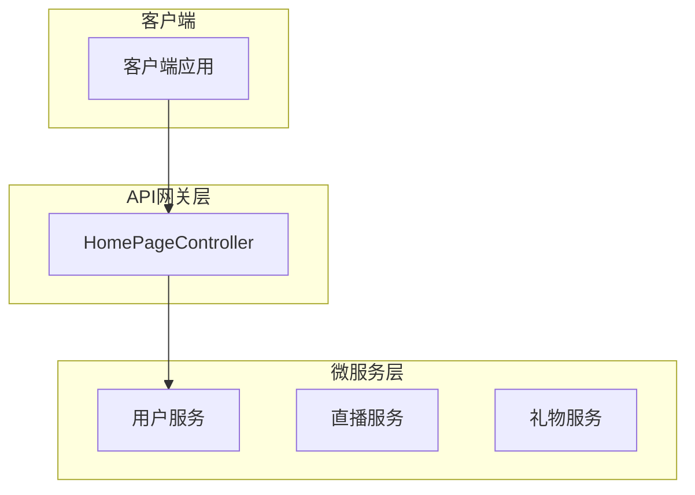
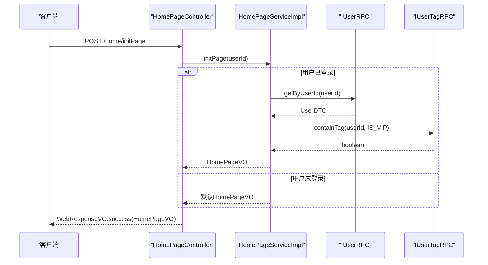
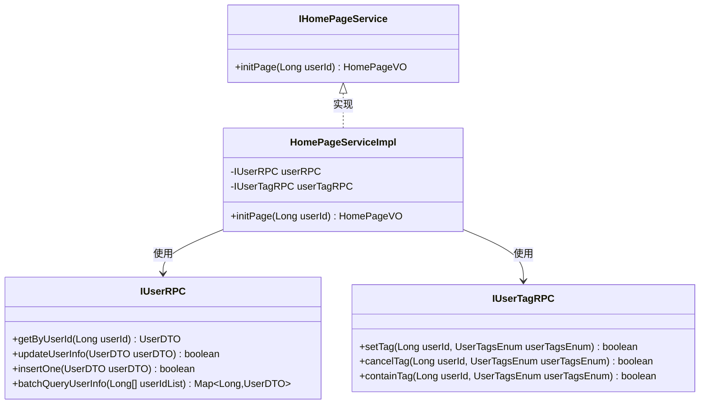
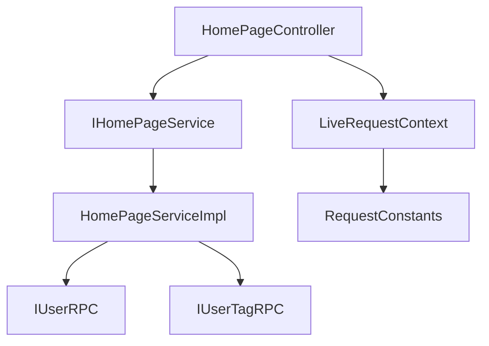

# 首页聚合API

<cite>
**本文档引用文件**  
- [HomePageController.java](file://live-api/src/main/java/com/logilong/live/api/controller/HomePageController.java)
- [HomePageVO.java](file://live-api/src/main/java/com/logilong/live/api/vo/HomePageVO.java)
- [IHomePageService.java](file://live-api/src/main/java/com/logilong/live/api/service/IHomePageService.java)
- [HomePageServiceImpl.java](file://live-api/src/main/java/com/logilong/live/api/service/impl/HomePageServiceImpl.java)
- [IUserRPC.java](file://live-user-interface/src/main/java/com/logilong/live/user/interfaces/IUserRPC.java)
- [IUserTagRPC.java](file://live-user-interface/src/main/java/com/logilong/live/user/interfaces/IUserTagRPC.java)
- [LiveRequestContext.java](file://live-framework/live-framework-web-starter/src/main/java/com/logilong/live/web/starter/context/LiveRequestContext.java)
</cite>

## 目录
1. [简介](#简介)
2. [项目结构](#项目结构)
3. [核心组件](#核心组件)
4. [架构概述](#架构概述)
5. [详细组件分析](#详细组件分析)
6. [依赖分析](#依赖分析)
7. [性能考虑](#性能考虑)
8. [故障排除指南](#故障排除指南)
9. [结论](#结论)

## 简介
本API文档旨在描述`HomePageController`中的首页数据聚合接口，该接口作为门面模式（Facade）的实现，整合了多个微服务的数据，以减少客户端的多次请求。接口通过调用`live-user-provider`获取用户基本信息和标签信息，构建包含用户身份状态、昵称、头像以及是否显示开播按钮的聚合响应。文档详细说明了接口的工作流程、返回结构以及在用户未登录情况下的处理逻辑。

## 项目结构
`HomePageController`位于`live-api`模块中，是整个直播平台的API网关层的一部分。该控制器通过Dubbo RPC调用`live-user-provider`提供的用户服务接口，获取用户数据并聚合到首页视图对象中。系统采用微服务架构，各服务通过Nacos进行服务发现与注册，使用Dubbo作为RPC框架进行服务间通信。

**Diagram sources**
- [HomePageController.java](file://live-api/src/main/java/com/logilong/live/api/controller/HomePageController.java#L1-L31)
- [IUserRPC.java](file://live-user-interface/src/main/java/com/logilong/live/user/interfaces/IUserRPC.java#L1-L43)

**Section sources**
- [HomePageController.java](file://live-api/src/main/java/com/logilong/live/api/controller/HomePageController.java#L1-L31)
- [pom.xml](file://live-api/pom.xml#L87-L96)

## 核心组件
`HomePageController`的核心功能是聚合用户数据，通过`IHomePageService`接口定义的`initPage`方法，接收用户ID并返回包含用户信息的`HomePageVO`对象。服务实现类`HomePageServiceImpl`通过Dubbo引用`IUserRPC`和`IUserTagRPC`接口，分别获取用户基本信息和标签信息，从而判断用户是否为VIP并决定是否显示开播按钮。

**Section sources**
- [IHomePageService.java](file://live-api/src/main/java/com/logilong/live/api/service/IHomePageService.java#L6-L18)
- [HomePageServiceImpl.java](file://live-api/src/main/java/com/logilong/live/api/service/impl/HomePageServiceImpl.java#L1-L34)

## 架构概述
该API采用门面模式，将复杂的内部服务调用封装在单一接口中，对外提供简洁的聚合数据。`HomePageController`作为门面，协调`IUserRPC`和`IUserTagRPC`两个远程服务，实现了数据聚合。系统通过`LiveRequestContext`管理用户上下文，确保在请求处理过程中能够获取当前登录用户的ID。

**Diagram sources**
- [HomePageController.java](file://live-api/src/main/java/com/logilong/live/api/controller/HomePageController.java#L20-L30)
- [HomePageServiceImpl.java](file://live-api/src/main/java/com/logilong/live/api/service/impl/HomePageServiceImpl.java#L22-L33)

## 详细组件分析

### HomePageController分析
`HomePageController`是首页数据聚合的入口，通过`/home/initPage`端点接收请求。控制器从`LiveRequestContext`中获取当前用户的ID，若用户已登录，则调用`IHomePageService`的`initPage`方法获取聚合数据；若未登录，则返回包含默认状态的`HomePageVO`。

#### API服务接口

**Diagram sources**
- [IHomePageService.java](file://live-api/src/main/java/com/logilong/live/api/service/IHomePageService.java#L6-L18)
- [HomePageServiceImpl.java](file://live-api/src/main/java/com/logilong/live/api/service/impl/HomePageServiceImpl.java#L14-L34)
- [IUserRPC.java](file://live-user-interface/src/main/java/com/logilong/live/user/interfaces/IUserRPC.java#L8-L43)
- [IUserTagRPC.java](file://live-user-interface/src/main/java/com/logilong/live/user/interfaces/IUserTagRPC.java#L6-L35)

**Section sources**
- [HomePageController.java](file://live-api/src/main/java/com/logilong/live/api/controller/HomePageController.java#L1-L31)
- [HomePageServiceImpl.java](file://live-api/src/main/java/com/logilong/live/api/service/impl/HomePageServiceImpl.java#L1-L34)

### HomePageVO结构分析
`HomePageVO`是首页视图对象，封装了返回给客户端的所有数据字段。该对象包含用户登录状态、用户ID、昵称、头像以及是否显示开播按钮的标志。

| 字段名 | 类型 | 描述 |
|--------|------|------|
| loginStatus | boolean | 用户登录状态 |
| userId | long | 用户ID |
| nickName | String | 用户昵称 |
| avatar | String | 用户头像URL |
| showStartLivingBtn | boolean | 是否显示开播按钮 |

**Section sources**
- [HomePageVO.java](file://live-api/src/main/java/com/logilong/live/api/vo/HomePageVO.java#L6-L14)

## 依赖分析
`HomePageController`依赖于`live-user-provider`提供的用户服务，通过Dubbo RPC进行远程调用。系统通过`pom.xml`中的依赖声明引入`live-user-interface`、`live-living-interface`和`live-gift-interface`，实现了服务间的解耦。`LiveRequestContext`作为上下文管理器，依赖于`live-framework-web-starter`模块。

**Diagram sources**
- [pom.xml](file://live-api/pom.xml#L87-L96)
- [HomePageServiceImpl.java](file://live-api/src/main/java/com/logilong/live/api/service/impl/HomePageServiceImpl.java#L16-L19)

**Section sources**
- [pom.xml](file://live-api/pom.xml#L87-L96)
- [LiveRequestContext.java](file://live-framework/live-framework-web-starter/src/main/java/com/logilong/live/web/starter/context/LiveRequestContext.java#L1-L66)

## 性能考虑
当前实现中，`HomePageController`在用户登录时会进行两次RPC调用（获取用户信息和检查VIP标签），这可能会增加响应延迟。建议考虑在`live-user-provider`中提供一个批量查询接口，将用户基本信息和标签信息合并为一次调用，以减少网络开销。此外，`LiveRequestContext`使用`InheritableThreadLocal`确保了父子线程间的上下文传递，但需要注意在请求结束时调用`clear()`方法以避免内存泄漏。

## 故障排除指南
当首页数据无法正确显示时，应首先检查`LiveRequestContext.getUserId()`是否能正确获取用户ID。如果用户ID为null，需确认网关是否正确传递了`USER_LOGIN_ID`头部信息。若RPC调用失败，应检查`live-user-provider`服务是否正常运行，以及Nacos注册中心中服务实例的状态。对于VIP用户无法显示开播按钮的问题，需验证`IUserTagRPC.containTag`方法的实现逻辑和数据库中用户标签的存储情况。

**Section sources**
- [LiveRequestContext.java](file://live-framework/live-framework-web-starter/src/main/java/com/logilong/live/web/starter/context/LiveRequestContext.java#L27-L30)
- [LiveUserInfoInterceptor.java](file://live-framework/live-framework-web-starter/src/main/java/com/logilong/live/web/starter/context/LiveUserInfoInterceptor.java#L18-L27)

## 结论
`HomePageController`成功实现了门面模式，将多个服务的数据聚合为单一接口，简化了客户端的调用逻辑。通过`IHomePageService`和`HomePageVO`的设计，系统实现了良好的解耦和可扩展性。未来可考虑优化RPC调用次数，并增加对其他服务（如直播和礼物）的数据聚合，以提供更丰富的首页内容。