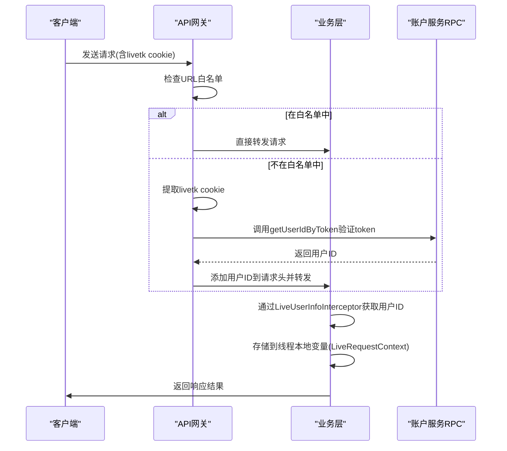
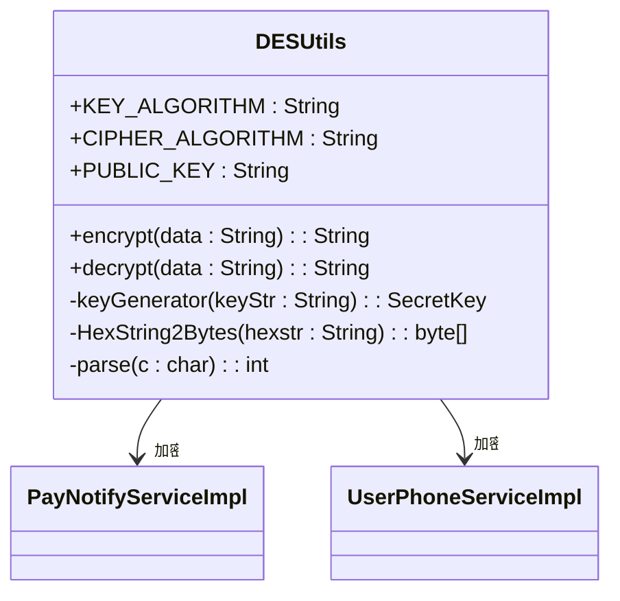
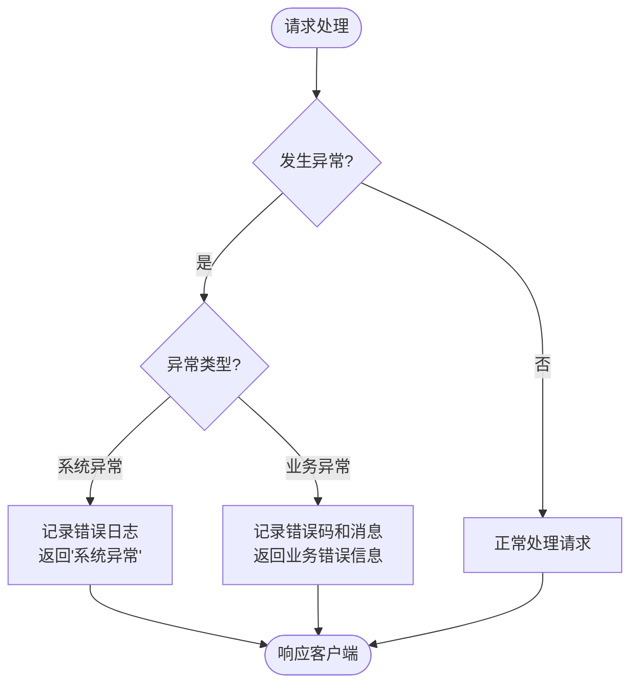
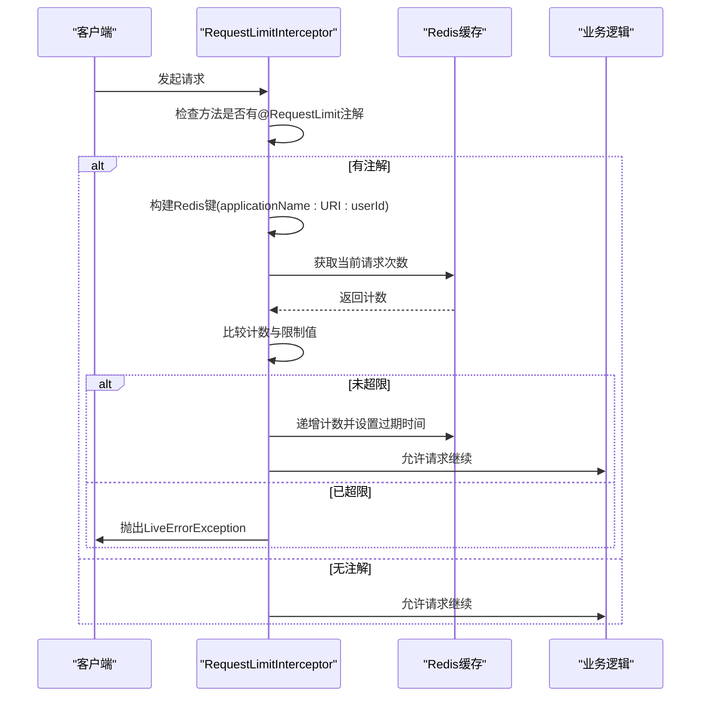
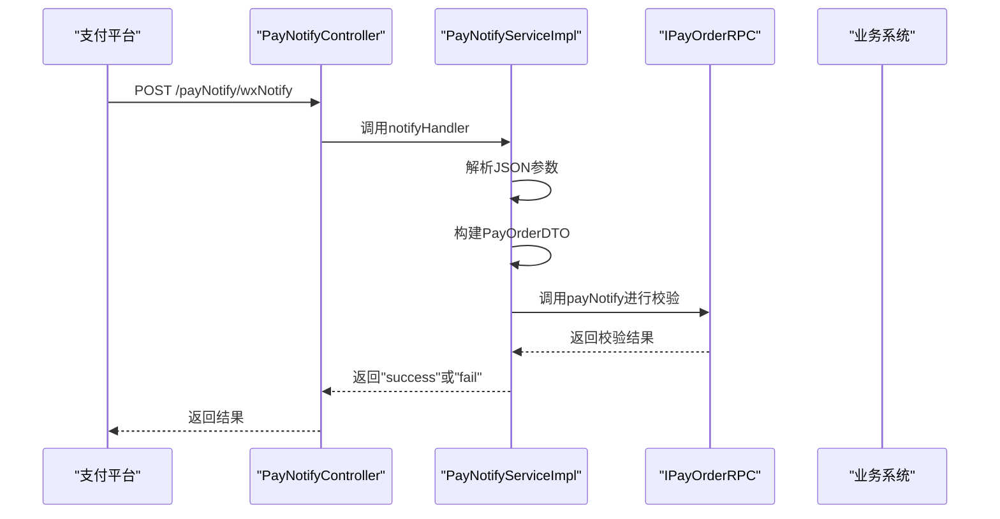

# 安全考虑

<cite>
**本文档引用的文件**
- [AccountCheckFilter.java](file://live-gateway/src/main/java/com/logilong/live/gateway/filter/AccountCheckFilter.java)
- [LiveUserInfoInterceptor.java](file://live-framework/live-framework-web-starter/src/main/java/com/logilong/live/web/starter/context/LiveUserInfoInterceptor.java)
- [DESUtils.java](file://live-common-interface/src/main/java/com/logilong/live/common/interfaces/utils/DESUtils.java)
- [GlobalExceptionHandler.java](file://live-framework/live-framework-web-starter/src/main/java/com/logilong/live/web/starter/error/GlobalExceptionHandler.java)
- [RequestLimit.java](file://live-framework/live-framework-web-starter/src/main/java/com/logilong/live/web/starter/config/RequestLimit.java)
- [RequestLimitInterceptor.java](file://live-framework/live-framework-web-starter/src/main/java/com/logilong/live/web/starter/context/RequestLimitInterceptor.java)
- [LiveRequestContext.java](file://live-framework/live-framework-web-starter/src/main/java/com/logilong/live/web/starter/context/LiveRequestContext.java)
- [WebConfig.java](file://live-framework/live-framework-web-starter/src/main/java/com/logilong/live/web/starter/config/WebConfig.java)
- [GatewayHeaderEnum.java](file://live-common-interface/src/main/java/com/logilong/live/common/interfaces/enums/GatewayHeaderEnum.java)
- [PayNotifyController.java](file://live-bank-api/src/main/java/com/logilong/live/bank/api/controller/PayNotifyController.java)
- [PayNotifyServiceImpl.java](file://live-bank-api/src/main/java/com/logilong/live/bank/api/service/impl/PayNotifyServiceImpl.java)
- [WxPayNotifyVO.java](file://live-bank-api/src/main/java/com/logilong/live/bank/api/vo/WxPayNotifyVO.java)
- [LiveErrorException.java](file://live-framework/live-framework-web-starter/src/main/java/com/logilong/live/web/starter/error/LiveErrorException.java)
</cite>

## 目录
1. [引言](#引言)
2. [双重身份验证机制](#双重身份验证机制)
3. [敏感数据加密策略](#敏感数据加密策略)
4. [全局异常处理与信息泄露防护](#全局异常处理与信息泄露防护)
5. [防刷限流机制](#防刷限流机制)
6. [支付接口安全机制](#支付接口安全机制)
7. [安全审计建议与漏洞防范](#安全审计建议与漏洞防范)
8. [总结](#总结)

## 引言

本系统采用分层安全架构设计，通过API网关层与业务层的双重防护机制，确保系统的安全性。系统实现了从请求入口到业务处理的完整安全链条，包括身份验证、权限校验、数据加密、异常处理、流量控制等多个方面。通过分析系统架构，我们可以全面了解其安全防护措施的实现原理和工作机制。

## 双重身份验证机制

系统采用API网关层（AccountCheckFilter）与业务层（LiveUserInfoInterceptor）的双重身份验证机制，确保用户身份的安全性和可靠性。

**图示来源**
- [AccountCheckFilter.java](file://live-gateway/src/main/java/com/logilong/live/gateway/filter/AccountCheckFilter.java#L30-L100)
- [LiveUserInfoInterceptor.java](file://live-framework/live-framework-web-starter/src/main/java/com/logilong/live/web/starter/context/LiveUserInfoInterceptor.java#L14-L35)
- [LiveRequestContext.java](file://live-framework/live-framework-web-starter/src/main/java/com/logilong/live/web/starter/context/LiveRequestContext.java#L12-L66)

**流程说明：**

1. **API网关层验证（AccountCheckFilter）**：
   - 系统首先检查请求URL是否在白名单中，若在则直接转发
   - 若不在白名单中，则提取请求中的"livetk" cookie
   - 通过Dubbo RPC调用accountTokenRPC.getUserIdByToken方法验证token合法性
   - 验证通过后，将用户ID添加到请求头中并转发给下游服务

2. **业务层验证（LiveUserInfoInterceptor）**：
   - 业务层通过拦截器获取网关传递的用户ID请求头
   - 将用户ID存储到线程本地变量（ThreadLocal）中，供后续业务逻辑使用
   - 在请求处理完成后清除线程本地变量，防止内存泄漏

**安全优势：**
- **分层防护**：网关层和业务层双重验证，即使某一层被绕过，另一层仍能提供保护
- **职责分离**：网关负责身份验证，业务层负责权限校验，符合安全设计原则
- **信息传递安全**：通过请求头传递用户ID，避免敏感信息暴露在URL或请求体中

**本节来源**
- [AccountCheckFilter.java](file://live-gateway/src/main/java/com/logilong/live/gateway/filter/AccountCheckFilter.java#L30-L100)
- [LiveUserInfoInterceptor.java](file://live-framework/live-framework-web-starter/src/main/java/com/logilong/live/web/starter/context/LiveUserInfoInterceptor.java#L14-L35)
- [GatewayHeaderEnum.java](file://live-common-interface/src/main/java/com/logilong/live/common/interfaces/enums/GatewayHeaderEnum.java#L13-L20)

## 敏感数据加密策略

系统采用DESUtils工具类对敏感数据进行加密处理，确保数据在存储和传输过程中的安全性。

**图示来源**
- [DESUtils.java](file://live-common-interface/src/main/java/com/logilong/live/common/interfaces/utils/DESUtils.java#L13-L108)
- [PayNotifyServiceImpl.java](file://live-bank-api/src/main/java/com/logilong/live/bank/api/service/impl/PayNotifyServiceImpl.java#L13-L28)

**实现细节：**

1. **加密算法配置**：
   - 使用DES算法，工作模式为ECB，填充方式为PKCS5Padding
   - 固定密钥为"BAS9j2C3D4E5F60708"，存储在代码中

2. **加密流程**：
   - 通过keyGenerator方法生成密钥对象
   - 使用Cipher类初始化加密模式
   - 执行加密操作，结果使用Base64编码

3. **解密流程**：
   - 使用相同的密钥初始化解密模式
   - 执行解密操作，返回原始数据

**安全考量：**
- **算法选择**：虽然DES算法已不是最安全的选择，但在系统内部数据传输场景下仍可提供基本保护
- **密钥管理**：密钥硬编码在代码中，存在一定的安全风险，建议使用更安全的密钥管理方案
- **数据保护**：主要用于手机号等敏感信息的加密存储和传输

**本节来源**
- [DESUtils.java](file://live-common-interface/src/main/java/com/logilong/live/common/interfaces/utils/DESUtils.java#L13-L108)

## 全局异常处理与信息泄露防护

系统通过GlobalExceptionHandler实现全局异常处理，有效防止敏感信息泄露。

**图示来源**
- [GlobalExceptionHandler.java](file://live-framework/live-framework-web-starter/src/main/java/com/logilong/live/web/starter/error/GlobalExceptionHandler.java#L12-L33)
- [LiveErrorException.java](file://live-framework/live-framework-web-starter/src/main/java/com/logilong/live/web/starter/error/LiveErrorException.java#L10-L21)

**异常处理机制：**

1. **系统异常处理**：
   - 捕获所有Exception类型的异常
   - 记录详细的错误日志，包括请求URI和异常堆栈
   - 向客户端返回通用的"系统异常"消息，不暴露具体错误信息

2. **业务异常处理**：
   - 捕获LiveErrorException类型的业务异常
   - 记录错误码和错误消息
   - 返回预定义的业务错误信息，便于前端处理

**安全优势：**
- **信息隐藏**：避免将详细的错误信息暴露给客户端，防止攻击者利用错误信息进行攻击
- **日志记录**：完整的错误日志有助于问题排查和安全审计
- **用户体验**：统一的错误响应格式，提升用户体验

**本节来源**
- [GlobalExceptionHandler.java](file://live-framework/live-framework-web-starter/src/main/java/com/logilong/live/web/starter/error/GlobalExceptionHandler.java#L12-L33)
- [LiveErrorException.java](file://live-framework/live-framework-web-starter/src/main/java/com/logilong/live/web/starter/error/LiveErrorException.java#L10-L21)

## 防刷限流机制

系统通过RequestLimit注解和RequestLimitInterceptor实现防刷限流功能，有效对抗恶意请求。

**图示来源**
- [RequestLimit.java](file://live-framework/live-framework-web-starter/src/main/java/com/logilong/live/web/starter/config/RequestLimit.java#L12-L29)
- [RequestLimitInterceptor.java](file://live-framework/live-framework-web-starter/src/main/java/com/logilong/live/web/starter/context/RequestLimitInterceptor.java#L21-L68)

**实现细节：**

1. **注解定义**：
   - RequestLimit注解包含limit（允许请求数）、second（时间范围）和msg（提示信息）三个属性
   - 可以灵活配置不同接口的限流策略

2. **拦截器逻辑**：
   - 检查处理方法是否标记了RequestLimit注解
   - 从LiveRequestContext获取当前用户ID
   - 使用Redis存储和统计请求次数
   - 基于应用名、请求URI和用户ID构建唯一的Redis键

3. **计数机制**：
   - 首次请求时创建计数器并设置过期时间
   - 后续请求递增计数，检查是否超过限制
   - 超限时抛出业务异常，由全局异常处理器返回提示信息

**安全优势：**
- **防刷保护**：有效防止恶意用户通过脚本大量刷接口
- **资源保护**：避免系统资源被耗尽，保障服务稳定性
- **灵活配置**：可根据不同接口的重要性和资源消耗设置不同的限流策略

**本节来源**
- [RequestLimit.java](file://live-framework/live-framework-web-starter/src/main/java/com/logilong/live/web/starter/config/RequestLimit.java#L12-L29)
- [RequestLimitInterceptor.java](file://live-framework/live-framework-web-starter/src/main/java/com/logilong/live/web/starter/context/RequestLimitInterceptor.java#L21-L68)
- [WebConfig.java](file://live-framework/live-framework-web-starter/src/main/java/com/logilong/live/web/starter/config/WebConfig.java#L10-L29)

## 支付接口安全机制

系统通过严格的签名验证和回调校验机制确保支付相关接口的安全性。

**图示来源**
- [PayNotifyController.java](file://live-bank-api/src/main/java/com/logilong/live/bank/api/controller/PayNotifyController.java#L15-L26)
- [PayNotifyServiceImpl.java](file://live-bank-api/src/main/java/com/logilong/live/bank/api/service/impl/PayNotifyServiceImpl.java#L13-L28)
- [WxPayNotifyVO.java](file://live-bank-api/src/main/java/com/logilong/live/bank/api/vo/WxPayNotifyVO.java#L7-L13)

**安全机制：**

1. **回调接口设计**：
   - 专用的支付回调控制器(PayNotifyController)
   - 使用POST方法接收支付平台的异步通知
   - 接口路径专用于支付回调，与其他业务接口分离

2. **参数处理**：
   - 接收JSON格式的参数字符串
   - 使用FastJSON2解析为WxPayNotifyVO对象
   - 提取关键信息如订单号、用户ID、业务码等

3. **安全校验**：
   - 通过Dubbo RPC调用payOrderRPC.payNotify进行最终校验
   - 校验逻辑在服务端实现，避免客户端绕过
   - 校验通过后返回"success"，否则返回"fail"

4. **异步处理**：
   - 回调接口快速响应，避免支付平台重复通知
   - 复杂的业务处理通过消息队列异步执行

**安全优势：**
- **防重放攻击**：通过订单号唯一性校验防止重复支付
- **数据完整性**：关键参数通过RPC调用在服务端校验
- **可靠性**：异步处理确保支付状态最终一致性

**本节来源**
- [PayNotifyController.java](file://live-bank-api/src/main/java/com/logilong/live/bank/api/controller/PayNotifyController.java#L15-L26)
- [PayNotifyServiceImpl.java](file://live-bank-api/src/main/java/com/logilong/live/bank/api/service/impl/PayNotifyServiceImpl.java#L13-L28)
- [WxPayNotifyVO.java](file://live-bank-api/src/main/java/com/logilong/live/bank/api/vo/WxPayNotifyVO.java#L7-L13)

## 安全审计建议与漏洞防范

基于系统架构分析，提出以下安全审计建议与漏洞防范指南：

### SQL注入防范

虽然系统使用了MyBatis框架，但仍需注意SQL注入风险：

1. **参数化查询**：始终使用#{}而非${}进行参数绑定
2. **输入验证**：对所有用户输入进行严格验证和过滤
3. **ORM使用**：优先使用MyBatis-Plus等安全的ORM操作
4. **动态SQL**：如必须使用动态SQL，应进行严格的白名单校验

### XSS攻击防范

1. **输入过滤**：对用户输入的内容进行HTML标签过滤
2. **输出编码**：在渲染到页面前对特殊字符进行HTML编码
3. **CSP策略**：实施内容安全策略(Content Security Policy)
4. **富文本处理**：使用专门的富文本处理库，如Jsoup进行净化

### 其他安全建议

1. **密钥管理**：
   - 将DESUtils中的硬编码密钥移至配置中心
   - 使用更安全的加密算法如AES
   - 实现密钥轮换机制

2. **认证机制增强**：
   - 考虑使用JWT替代简单的token机制
   - 实现token刷新和撤销机制
   - 增加多因素认证支持

3. **日志安全**：
   - 避免在日志中记录敏感信息如密码、完整token等
   - 实现日志脱敏功能
   - 定期审计日志访问权限

4. **依赖安全**：
   - 定期更新第三方库版本
   - 使用依赖扫描工具检查已知漏洞
   - 最小化依赖范围，移除不必要的库

5. **API安全**：
   - 实现API签名机制，防止请求被篡改
   - 增加请求时间戳校验，防止重放攻击
   - 对敏感接口增加IP白名单限制

**本节来源**
- [AccountCheckFilter.java](file://live-gateway/src/main/java/com/logilong/live/gateway/filter/AccountCheckFilter.java#L30-L100)
- [DESUtils.java](file://live-common-interface/src/main/java/com/logilong/live/common/interfaces/utils/DESUtils.java#L13-L108)
- [GlobalExceptionHandler.java](file://live-framework/live-framework-web-starter/src/main/java/com/logilong/live/web/starter/error/GlobalExceptionHandler.java#L12-L33)

## 总结

本系统构建了多层次的安全防护体系，通过API网关层和业务层的双重身份验证机制，确保了用户身份的安全性。系统实现了完整的安全链条，包括：

1. **身份验证**：通过AccountCheckFilter和LiveUserInfoInterceptor实现分层身份验证
2. **数据保护**：使用DESUtils对敏感数据进行加密处理
3. **异常处理**：通过GlobalExceptionHandler防止敏感信息泄露
4. **流量控制**：利用RequestLimit注解实现防刷限流
5. **支付安全**：通过严格的回调校验机制确保支付接口安全

尽管系统已具备较为完善的安全机制，但仍存在一些可改进之处，如密钥管理、加密算法选择等。建议在后续版本中持续优化安全策略，定期进行安全审计，确保系统能够应对不断变化的安全威胁。

通过本次安全架构分析，我们全面了解了系统的安全防护措施，为后续的安全优化和漏洞防范提供了指导方向。