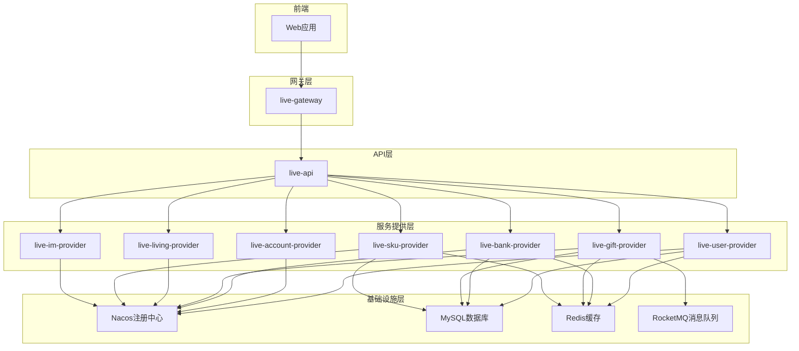

# 开发指南

<cite>
**本文档中引用的文件**  
- [pom.xml](file://pom.xml)
- [ApiWebApplication.java](file://live-api/src/main/java/com/logilong/live/api/ApiWebApplication.java)
- [bootstrap.yml](file://live-api/src/main/resources/bootstrap.yml)
- [UserLoginController.java](file://live-api/src/main/java/com/logilong/live/api/controller/UserLoginController.java)
- [LiveUserInfoInterceptor.java](file://live-framework/live-framework-web-starter/src/main/java/com/logilong/live/web/starter/context/LiveUserInfoInterceptor.java)
- [AccountCheckFilter.java](file://live-gateway/src/main/java/com/logilong/live/gateway/filter/AccountCheckFilter.java)
- [WebResponseVO.java](file://live-common-interface/src/main/java/com/logilong/live/common/interfaces/vo/WebResponseVO.java)
- [ErrorAssert.java](file://live-framework/live-framework-web-starter/src/main/java/com/logilong/live/web/starter/error/ErrorAssert.java)
- [GlobalExceptionHandler.java](file://live-framework/live-framework-web-starter/src/main/java/com/logilong/live/web/starter/error/GlobalExceptionHandler.java)
- [WebConfig.java](file://live-framework/live-framework-web-starter/src/main/java/com/logilong/live/web/starter/config/WebConfig.java)
- [LiveRequestContext.java](file://live-framework/live-framework-web-starter/src/main/java/com/logilong/live/web/starter/context/LiveRequestContext.java)
- [RequestConstants.java](file://live-framework/live-framework-web-starter/src/main/java/com/logilong/live/web/starter/constants/RequestConstants.java)
</cite>

## 目录
1. [项目结构](#项目结构)
2. [本地开发环境搭建](#本地开发环境搭建)
3. [IDE配置](#ide配置)
4. [Nacos与数据库连接](#nacos与数据库连接)
5. [服务运行与调试](#服务运行与调试)
6. [编码规范](#编码规范)
7. [接口返回标准](#接口返回标准)
8. [拦截器与过滤器使用](#拦截器与过滤器使用)
9. [新增模块开发指南](#新增模块开发指南)
10. [测试实践](#测试实践)

## 项目结构

本项目采用Maven多模块架构，各模块职责清晰，遵循微服务设计原则。核心模块包括：

- **接口模块**（*-interface）：定义RPC接口、DTO、枚举等共享契约
- **服务提供者模块**（*-provider）：实现业务逻辑，提供RPC服务
- **API模块**（live-api）：对外REST API入口，聚合业务
- **网关模块**（live-gateway）：统一入口，路由与过滤
- **框架模块**（live-framework-*）：公共组件封装
- **消息模块**（live-msg-*）：短信服务
- **ID生成模块**（live-id-generate-*）：分布式ID生成



**Diagram sources**
- [pom.xml](file://pom.xml)
- [ApiWebApplication.java](file://live-api/src/main/java/com/logilong/live/api/ApiWebApplication.java)

**Section sources**
- [pom.xml](file://pom.xml#L1-L92)

## 本地开发环境搭建

### 前置依赖
- JDK 17
- Maven 3.8+
- IntelliJ IDEA 或 Eclipse
- Docker（用于启动Nacos等中间件）
- MySQL 8.0
- Redis
- Nacos 2.x

### 项目导入步骤
1. 克隆项目到本地目录 ``
2. 使用IDE打开根目录下的 `pom.xml` 文件
3. Maven会自动识别为多模块项目并导入所有子模块
4. 等待依赖下载完成

### 依赖管理
项目通过根 `pom.xml` 统一管理版本，关键依赖包括：
- Spring Boot 3.0.4
- Spring Cloud Alibaba 2022.0.0.0-RC1
- Dubbo 3.3.2
- MyBatis-Plus 3.5.3
- Sharding-JDBC 5.3.2
- RocketMQ 5.2.0

**Section sources**
- [pom.xml](file://pom.xml#L47-L76)

## IDE配置

### IntelliJ IDEA配置
1. **Maven设置**：确保Maven版本为3.8+，JDK为17
2. **编码设置**：File → Settings → Editor → File Encodings，设置为UTF-8
3. **注解处理**：Enable annotation processing
4. **Lombok插件**：安装Lombok插件以支持注解
5. **代码格式化**：导入团队代码风格模板（如有）

### Eclipse配置
1. 安装Maven Integration for Eclipse (m2e)
2. 安装Lombok插件
3. 设置项目编码为UTF-8
4. 启用注解处理

### 运行配置
为每个服务创建独立的运行配置：
- Main Class: 对应模块的Application类
- VM Options: `-Dspring.profiles.active=dev`
- Environment Variables: 根据需要设置

**Section sources**
- [pom.xml](file://pom.xml#L72-L74)

## Nacos与数据库连接

### Nacos配置
各服务通过 `bootstrap.yml` 连接Nacos：

```yaml
spring:
  application:
    name: live-api
  cloud:
    nacos:
      username: nacos
      password: nacos
      discovery:
        server-addr: live-server:8848
        namespace: live-test
      config:
        file-extension: yaml
        server-addr: live-server:8848
        namespace: live-test
```

### 本地Nacos启动
使用Docker Compose启动Nacos：

```bash
docker-compose -f live-gateway/docker/docker-compose.yml up -d
```

### 数据库连接
数据库配置在Nacos中管理，服务启动时自动拉取。本地开发可直接在Nacos中配置数据源信息。

**Diagram sources**
- [bootstrap.yml](file://live-api/src/main/resources/bootstrap.yml)

**Section sources**
- [bootstrap.yml](file://live-api/src/main/resources/bootstrap.yml#L1-L22)

## 服务运行与调试

### 主要服务入口
各模块的Application类为启动入口：

| 模块 | 主类 |
|------|------|
| live-api | ApiWebApplication |
| live-gateway | GateWayApplication |
| live-user-provider | UserProviderApplication |
| live-account-provider | AccountProviderApplication |
| live-bank-provider | BankProviderApplication |

### 启动顺序
1. 启动Nacos
2. 启动MySQL、Redis
3. 启动各provider服务
4. 启动live-api
5. 启动live-gateway

### 调试技巧
- 在IDE中直接运行Application类的main方法
- 使用断点调试业务逻辑
- 查看日志输出（logback-spring.xml配置）

**Section sources**
- [ApiWebApplication.java](file://live-api/src/main/java/com/logilong/live/api/ApiWebApplication.java#L1-L19)

## 编码规范

### 代码风格
- 遵循阿里巴巴Java开发手册
- 使用Lombok减少样板代码
- 方法命名采用驼峰命名法
- 类名采用大驼峰命名法

### 日志输出
- 使用SLF4J门面，Logback实现
- 关键业务逻辑必须记录日志
- 异常信息必须完整记录堆栈

### 异常处理模式
使用 `ErrorAssert` 断言类进行参数校验：

```java
// 判断对象不为空
ErrorAssert.isNotNull(obj, LiveBaseError.PARAM_NULL);

// 判断字符串非空
ErrorAssert.isNotBlank(str, LiveBaseError.PARAM_EMPTY);

// 判断条件为真
ErrorAssert.isTure(flag, LiveBaseError.ILLEGAL_STATE);
```

**Diagram sources**
- [ErrorAssert.java](file://live-framework/live-framework-web-starter/src/main/java/com/logilong/live/web/starter/error/ErrorAssert.java)

**Section sources**
- [ErrorAssert.java](file://live-framework/live-framework-web-starter/src/main/java/com/logilong/live/web/starter/error/ErrorAssert.java#L1-L55)

## 接口返回标准

### WebResponseVO统一返回格式
所有API接口返回统一使用 `WebResponseVO`：

```java
// 成功返回
WebResponseVO.success();
WebResponseVO.success(data);

// 业务错误
WebResponseVO.bizError("错误信息");
WebResponseVO.bizError(501, "错误信息");

// 系统错误
WebResponseVO.sysError();
WebResponseVO.sysError("系统异常");

// 参数错误
WebResponseVO.errorParam();
WebResponseVO.errorParam("参数错误信息");
```

### 状态码规范
| 状态码 | 含义 |
|-------|------|
| 200 | 成功 |
| 400 | 参数错误 |
| 500 | 系统异常 |
| 501 | 业务错误 |

**Diagram sources**
- [WebResponseVO.java](file://live-common-interface/src/main/java/com/logilong/live/common/interfaces/vo/WebResponseVO.java)

**Section sources**
- [WebResponseVO.java](file://live-common-interface/src/main/java/com/logilong/live/common/interfaces/vo/WebResponseVO.java#L1-L72)

## 拦截器与过滤器使用

### 全局过滤器：AccountCheckFilter
在网关层进行token校验：

```java
@Component
public class AccountCheckFilter implements GlobalFilter, Ordered {
    
    @DubboReference
    private IAccountTokenRPC accountTokenRPC;
    
    @Override
    public Mono<Void> filter(ServerWebExchange exchange, GatewayFilterChain chain) {
        // 1. 获取请求URL
        // 2. 白名单URL直接放行
        // 3. 提取livetk cookie
        // 4. 调用RPC验证token
        // 5. 将userId放入请求头传递给下游
        ServerHttpRequest.Builder builder = request.mutate();
        builder.header(GatewayHeaderEnum.USER_LOGIN_ID.getName(), String.valueOf(userId));
        return chain.filter(exchange.mutate().request(builder.build()).build());
    }
}
```

### Web拦截器：LiveUserInfoInterceptor
在Web层提取用户信息：

```java
public class LiveUserInfoInterceptor implements HandlerInterceptor {
    
    @Override
    public boolean preHandle(HttpServletRequest request, HttpServletResponse response, Object handler) {
        String userIdStr = request.getHeader(GatewayHeaderEnum.USER_LOGIN_ID.getName());
        if (!StringUtils.isEmpty(userIdStr)) {
            LiveRequestContext.set(RequestConstants.LIVE_USER_ID, Long.valueOf(userIdStr));
        }
        return true;
    }
    
    @Override
    public void postHandle(HttpServletRequest request, HttpServletResponse response, Object handler, ModelAndView modelAndView) {
        LiveRequestContext.clear();
    }
}
```

### 请求上下文管理
使用ThreadLocal管理用户上下文：

```java
public class LiveRequestContext {
    private static final ThreadLocal<Map<Object, Object>> resources = new InheritableThreadLocalMap<>();
    
    public static void set(Object key, Object value) {
        resources.get().put(key, value);
    }
    
    public static Object get(Object key) {
        return resources.get().get(key);
    }
    
    public static void clear() {
        resources.remove();
    }
    
    public static Long getUserId() {
        Object userId = get(RequestConstants.LIVE_USER_ID);
        return userId == null ? null : (Long) userId;
    }
}
```

**Diagram sources**
- [AccountCheckFilter.java](file://live-gateway/src/main/java/com/logilong/live/gateway/filter/AccountCheckFilter.java)
- [LiveUserInfoInterceptor.java](file://live-framework/live-framework-web-starter/src/main/java/com/logilong/live/web/starter/context/LiveUserInfoInterceptor.java)
- [LiveRequestContext.java](file://live-framework/live-framework-web-starter/src/main/java/com/logilong/live/web/starter/context/LiveRequestContext.java)

**Section sources**
- [AccountCheckFilter.java](file://live-gateway/src/main/java/com/logilong/live/gateway/filter/AccountCheckFilter.java#L1-L101)
- [LiveUserInfoInterceptor.java](file://live-framework/live-framework-web-starter/src/main/java/com/logilong/live/web/starter/context/LiveUserInfoInterceptor.java#L1-L35)
- [WebConfig.java](file://live-framework/live-framework-web-starter/src/main/java/com/logilong/live/web/starter/config/WebConfig.java#L1-L29)
- [LiveRequestContext.java](file://live-framework/live-framework-web-starter/src/main/java/com/logilong/live/web/starter/context/LiveRequestContext.java#L1-L66)
- [RequestConstants.java](file://live-framework/live-framework-web-starter/src/main/java/com/logilong/live/web/starter/constants/RequestConstants.java#L1-L8)

## 新增模块开发指南

### 添加新的Controller
1. 在 `live-api` 模块创建Controller类
2. 使用 `@RestController` 和 `@RequestMapping` 注解
3. 注入对应Service
4. 返回 `WebResponseVO`

```java
@RestController
@RequestMapping("/example")
public class ExampleController {
    
    @Resource
    private IExampleService exampleService;
    
    @PostMapping("/doSomething")
    public WebResponseVO doSomething(@RequestBody ExampleReqVO reqVO) {
        ErrorAssert.isNotBlank(reqVO.getName(), LiveBaseError.PARAM_EMPTY);
        return WebResponseVO.success(exampleService.doSomething(reqVO));
    }
}
```

### 添加新的Service
1. 在对应provider模块创建Service接口和实现
2. 实现类添加 `@Service` 注解
3. 使用MyBatis-Plus进行数据库操作

### 添加新的RPC接口
1. 在对应interface模块定义接口
2. 在provider模块实现接口，添加 `@DubboService` 注解
3. 在需要调用的地方使用 `@DubboReference` 注入

### 拦截器配置
全局拦截器在 `WebConfig` 中注册：

```java
@Configuration
public class WebConfig implements WebMvcConfigurer {
    
    @Bean
    public LiveUserInfoInterceptor liveUserInfoInterceptor() {
        return new LiveUserInfoInterceptor();
    }
    
    @Override
    public void addInterceptors(InterceptorRegistry registry) {
        registry.addInterceptor(liveUserInfoInterceptor()).addPathPatterns("/**").excludePathPatterns("/error");
    }
}
```

**Section sources**
- [UserLoginController.java](file://live-api/src/main/java/com/logilong/live/api/controller/UserLoginController.java#L1-L32)
- [WebConfig.java](file://live-framework/live-framework-web-starter/src/main/java/com/logilong/live/web/starter/config/WebConfig.java#L1-L29)

## 测试实践

### 单元测试
- 使用JUnit 5
- 覆盖核心业务逻辑
- 模拟依赖（Mockito）
- 断言使用 `ErrorAssert`

### 集成测试
- 使用 `@SpringBootTest`
- 测试完整调用链
- 准备测试数据
- 清理测试环境

### 最佳实践
1. 为每个Service编写单元测试
2. 关键Controller编写集成测试
3. 使用内存数据库进行测试
4. 测试覆盖率目标80%以上
5. 持续集成中运行测试

**Section sources**
- [GlobalExceptionHandler.java](file://live-framework/live-framework-web-starter/src/main/java/com/logilong/live/web/starter/error/GlobalExceptionHandler.java#L1-L33)