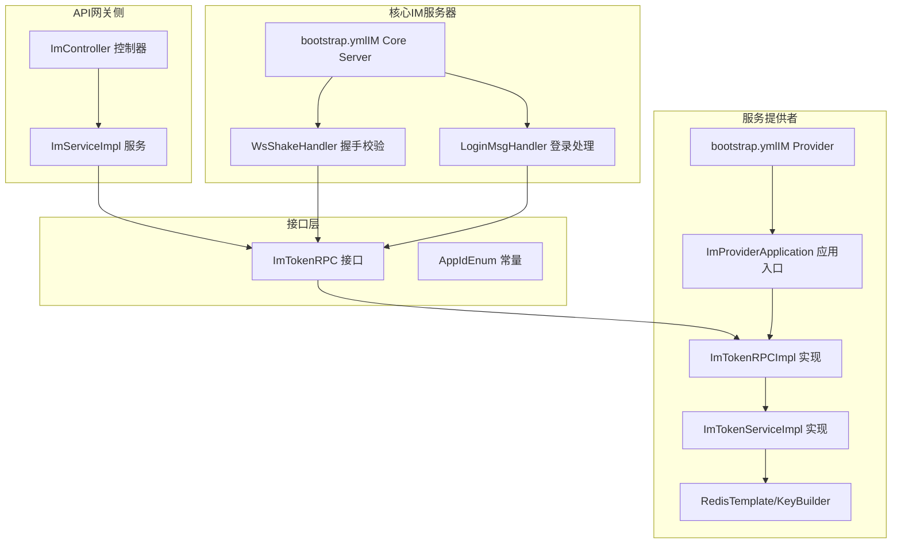
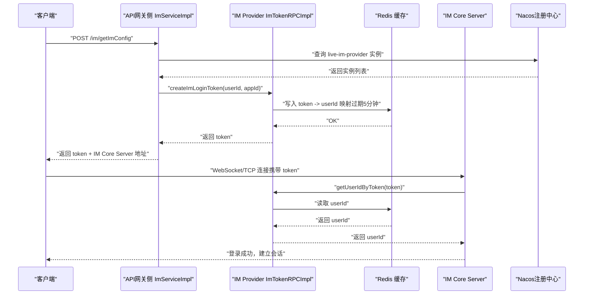
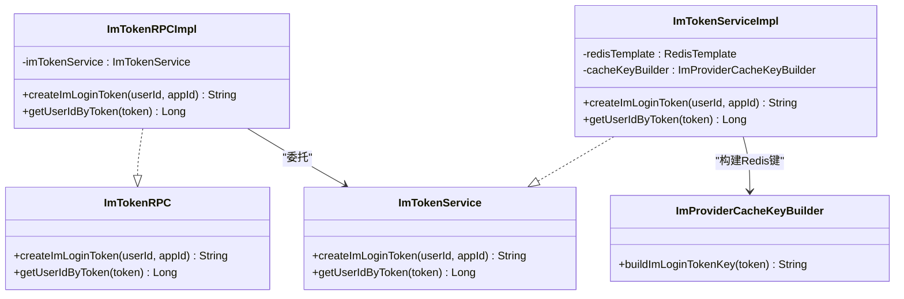
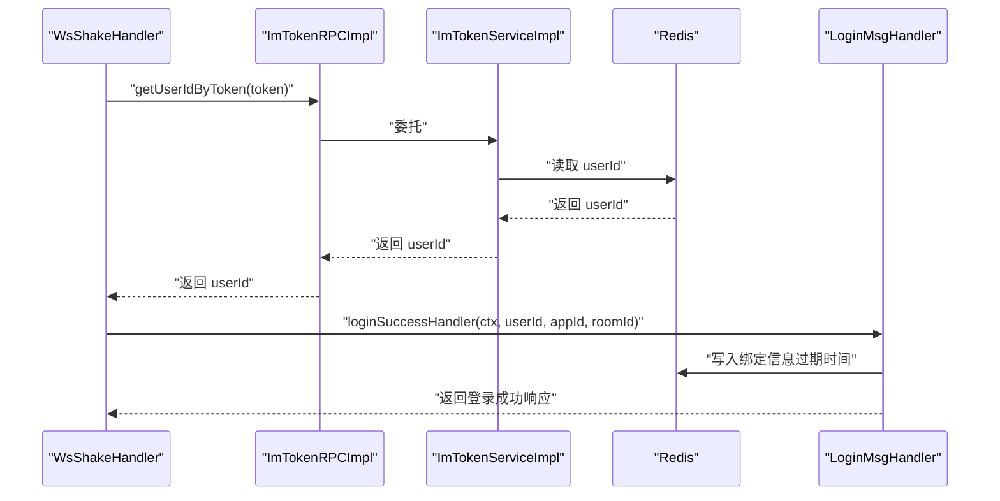
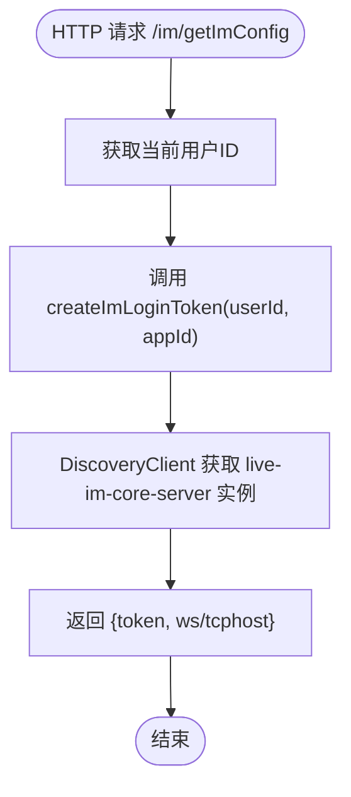
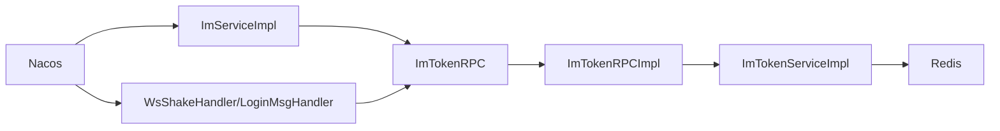

# IM业务服务层

<cite>
**本文引用的文件**
- [ImProviderApplication.java](file://live-im-provider/src/main/java/com/logilong/live/im/provider/ImProviderApplication.java)
- [ImTokenRPC.java](file://live-im-interface/src/main/java/com/logilong/live/im/interfaces/ImTokenRPC.java)
- [ImTokenRPCImpl.java](file://live-im-provider/src/main/java/com/logilong/live/im/provider/rpc/ImTokenRPCImpl.java)
- [ImTokenService.java](file://live-im-provider/src/main/java/com/logilong/live/im/provider/service/ImTokenService.java)
- [ImTokenServiceImpl.java](file://live-im-provider/src/main/java/com/logilong/live/im/provider/service/impl/ImTokenServiceImpl.java)
- [ImProviderCacheKeyBuilder.java](file://live-framework/live-framework-redis-starter/src/main/java/com/logilong/live/framework/redis/starter/key/ImProviderCacheKeyBuilder.java)
- [bootstrap.yml（IM Provider）](file://live-im-provider/src/main/resources/bootstrap.yml)
- [LoginMsgHandler.java](file://live-im-core-server/src/main/java/com/logilong/live/im/core/server/handler/impl/LoginMsgHandler.java)
- [WsShakeHandler.java](file://live-im-core-server/src/main/java/com/logilong/live/im/core/server/handler/ws/WsShakeHandler.java)
- [ImServiceImpl.java](file://live-api/src/main/java/com/logilong/live/api/service/impl/ImServiceImpl.java)
- [ImController.java](file://live-api/src/main/java/com/logilong/live/api/controller/ImController.java)
- [AppIdEnum.java](file://live-im-interface/src/main/java/com/logilong/live/im/constants/AppIdEnum.java)
- [bootstrap.yml（IM Core Server）](file://live-im-core-server/src/main/resources/bootstrap.yml)
</cite>

## 目录
1. [简介](#简介)
2. [项目结构](#项目结构)
3. [核心组件](#核心组件)
4. [架构总览](#架构总览)
5. [详细组件分析](#详细组件分析)
6. [依赖关系分析](#依赖关系分析)
7. [性能考量](#性能考量)
8. [故障排查指南](#故障排查指南)
9. [结论](#结论)
10. [附录：Dubbo调用示例与直播场景](#附录dubbo调用示例与直播场景)

## 简介
本文件深入解析IM业务服务层（im-provider）的实现机制，重点说明：
- ImProviderApplication如何通过@EnableDubbo注解暴露Dubbo服务，并以非Web应用模式运行。
- ImTokenRPC接口定义的createImLoginToken和getUserIdByToken两个核心方法，及其在用户身份鉴权中的作用。
- 结合ImTokenRPCImpl实现类，分析Token生成与解析的业务逻辑，包括用户ID与AppID的绑定、Token有效期管理及安全性保障措施。
- 说明该服务如何与Nacos注册中心集成，实现服务发现与调用。
- 提供Dubbo服务调用的代码示例路径，并解释其在直播平台中的实际应用场景，如用户登录后获取IM通信凭证的完整流程。

## 项目结构
IM业务服务层主要由以下模块组成：
- 接口层（live-im-interface）：定义IM领域RPC接口与常量。
- 服务提供者（live-im-provider）：实现RPC接口，提供Token生成与校验能力；基于Redis存储Token与用户映射。
- 核心IM服务器（live-im-core-server）：接收WebSocket/TCP连接，完成握手与登录校验，依赖IM Provider提供的Token RPC。
- API网关侧（live-api）：对外提供HTTP接口，调用IM Provider生成Token，并返回IM服务器地址供前端连接。

图表来源
- [ImProviderApplication.java](file://live-im-provider/src/main/java/com/logilong/live/im/provider/ImProviderApplication.java#L1-L20)
- [ImTokenRPC.java](file://live-im-interface/src/main/java/com/logilong/live/im/interfaces/ImTokenRPC.java#L1-L16)
- [ImTokenRPCImpl.java](file://live-im-provider/src/main/java/com/logilong/live/im/provider/rpc/ImTokenRPCImpl.java#L1-L27)
- [ImTokenServiceImpl.java](file://live-im-provider/src/main/java/com/logilong/live/im/provider/service/impl/ImTokenServiceImpl.java#L1-L35)
- [ImProviderCacheKeyBuilder.java](file://live-framework/live-framework-redis-starter/src/main/java/com/logilong/live/framework/redis/starter/key/ImProviderCacheKeyBuilder.java#L1-L20)
- [bootstrap.yml（IM Provider）](file://live-im-provider/src/main/resources/bootstrap.yml#L1-L22)
- [WsShakeHandler.java](file://live-im-core-server/src/main/java/com/logilong/live/im/core/server/handler/ws/WsShakeHandler.java#L1-L108)
- [LoginMsgHandler.java](file://live-im-core-server/src/main/java/com/logilong/live/im/core/server/handler/impl/LoginMsgHandler.java#L1-L121)
- [bootstrap.yml（IM Core Server）](file://live-im-core-server/src/main/resources/bootstrap.yml#L1-L22)
- [ImController.java](file://live-api/src/main/java/com/logilong/live/api/controller/ImController.java#L1-L23)
- [ImServiceImpl.java](file://live-api/src/main/java/com/logilong/live/api/service/impl/ImServiceImpl.java#L1-L41)
- [AppIdEnum.java](file://live-im-interface/src/main/java/com/logilong/live/im/constants/AppIdEnum.java#L1-L19)

章节来源
- [ImProviderApplication.java](file://live-im-provider/src/main/java/com/logilong/live/im/provider/ImProviderApplication.java#L1-L20)
- [bootstrap.yml（IM Provider）](file://live-im-provider/src/main/resources/bootstrap.yml#L1-L22)
- [bootstrap.yml（IM Core Server）](file://live-im-core-server/src/main/resources/bootstrap.yml#L1-L22)

## 核心组件
- 接口层（ImTokenRPC）
  - 定义两个关键方法：创建IM登录Token与根据Token查询用户ID。
  - 为上层服务（API网关侧与IM核心服务器）提供统一的身份鉴权入口。
- 服务实现层（ImTokenRPCImpl）
  - 将RPC方法委托给ImTokenServiceImpl，实现Dubbo服务暴露。
- 业务实现层（ImTokenServiceImpl）
  - 使用UUID生成Token，并将“token%appId”作为唯一标识。
  - 通过Redis键值对存储用户ID，设置过期时间（默认5分钟），实现Token有效期管理。
  - 使用ImProviderCacheKeyBuilder构建Redis键，保证命名规范与可维护性。
- 注册与配置（Nacos）
  - 通过bootstrap.yml配置Nacos注册中心地址与命名空间，实现服务注册与发现。
- 调用方（API网关侧）
  - ImServiceImpl通过DubboReference注入ImTokenRPC，调用createImLoginToken生成Token。
  - 同时通过DiscoveryClient获取IM Core Server实例地址，返回给前端。
- 调用方（IM核心服务器）
  - WsShakeHandler与LoginMsgHandler在握手与登录阶段调用ImTokenRPC进行Token校验。
  - 校验通过后建立会话上下文并上报在线事件。

章节来源
- [ImTokenRPC.java](file://live-im-interface/src/main/java/com/logilong/live/im/interfaces/ImTokenRPC.java#L1-L16)
- [ImTokenRPCImpl.java](file://live-im-provider/src/main/java/com/logilong/live/im/provider/rpc/ImTokenRPCImpl.java#L1-L27)
- [ImTokenService.java](file://live-im-provider/src/main/java/com/logilong/live/im/provider/service/ImTokenService.java#L1-L18)
- [ImTokenServiceImpl.java](file://live-im-provider/src/main/java/com/logilong/live/im/provider/service/impl/ImTokenServiceImpl.java#L1-L35)
- [ImProviderCacheKeyBuilder.java](file://live-framework/live-framework-redis-starter/src/main/java/com/logilong/live/framework/redis/starter/key/ImProviderCacheKeyBuilder.java#L1-L20)
- [ImServiceImpl.java](file://live-api/src/main/java/com/logilong/live/api/service/impl/ImServiceImpl.java#L1-L41)
- [ImController.java](file://live-api/src/main/java/com/logilong/live/api/controller/ImController.java#L1-L23)
- [WsShakeHandler.java](file://live-im-core-server/src/main/java/com/logilong/live/im/core/server/handler/ws/WsShakeHandler.java#L1-L108)
- [LoginMsgHandler.java](file://live-im-core-server/src/main/java/com/logilong/live/im/core/server/handler/impl/LoginMsgHandler.java#L1-L121)
- [AppIdEnum.java](file://live-im-interface/src/main/java/com/logilong/live/im/constants/AppIdEnum.java#L1-L19)

## 架构总览
IM业务服务层采用“接口+RPC实现+业务实现+缓存”的分层设计，配合Nacos实现服务注册与发现。整体交互如下：

图表来源
- [ImServiceImpl.java](file://live-api/src/main/java/com/logilong/live/api/service/impl/ImServiceImpl.java#L1-L41)
- [ImTokenRPCImpl.java](file://live-im-provider/src/main/java/com/logilong/live/im/provider/rpc/ImTokenRPCImpl.java#L1-L27)
- [ImTokenServiceImpl.java](file://live-im-provider/src/main/java/com/logilong/live/im/provider/service/impl/ImTokenServiceImpl.java#L1-L35)
- [WsShakeHandler.java](file://live-im-core-server/src/main/java/com/logilong/live/im/core/server/handler/ws/WsShakeHandler.java#L1-L108)
- [LoginMsgHandler.java](file://live-im-core-server/src/main/java/com/logilong/live/im/core/server/handler/impl/LoginMsgHandler.java#L1-L121)
- [bootstrap.yml（IM Provider）](file://live-im-provider/src/main/resources/bootstrap.yml#L1-L22)
- [bootstrap.yml（IM Core Server）](file://live-im-core-server/src/main/resources/bootstrap.yml#L1-L22)

## 详细组件分析

### 组件A：ImProviderApplication（非Web Dubbo服务入口）
- 关键点
  - 使用@EnableDubbo启用Dubbo服务暴露。
  - 使用@EnableDiscoveryClient启用服务注册与发现。
  - 通过SpringApplication.setWebApplicationType(WebApplicationType.NONE)以非Web模式运行，避免启动Tomcat等Web容器，直接由Dubbo协议提供服务。
- 运行方式
  - 作为独立进程启动，仅承载RPC服务，不提供HTTP路由。
- 与Nacos集成
  - 通过bootstrap.yml配置Nacos注册中心地址与命名空间，实现服务注册与发现。

章节来源
- [ImProviderApplication.java](file://live-im-provider/src/main/java/com/logilong/live/im/provider/ImProviderApplication.java#L1-L20)
- [bootstrap.yml（IM Provider）](file://live-im-provider/src/main/resources/bootstrap.yml#L1-L22)

### 组件B：ImTokenRPC接口与实现（Token生成与校验）
- 接口定义
  - createImLoginToken：生成IM登录Token，参数包含用户ID与AppID。
  - getUserIdByToken：根据Token查询用户ID，用于登录鉴权。
- 实现逻辑（ImTokenRPCImpl）
  - 将RPC方法委托给ImTokenServiceImpl，实现Dubbo服务暴露。
- 业务实现（ImTokenServiceImpl）
  - Token生成：使用UUID生成随机串，并拼接“%appId”，形成“token%appId”的唯一标识。
  - 存储与过期：将Redis键设为“imLoginToken:token%appId”，值为用户ID，过期时间为5分钟。
  - 查询：从Redis读取用户ID，若不存在返回空。
- 安全性与有效性
  - Token有效期短（5分钟），降低泄露风险。
  - Token与AppID绑定，便于后续按业务域隔离。
  - Redis键命名规范，便于运维与清理。

图表来源
- [ImTokenRPC.java](file://live-im-interface/src/main/java/com/logilong/live/im/interfaces/ImTokenRPC.java#L1-L16)
- [ImTokenRPCImpl.java](file://live-im-provider/src/main/java/com/logilong/live/im/provider/rpc/ImTokenRPCImpl.java#L1-L27)
- [ImTokenService.java](file://live-im-provider/src/main/java/com/logilong/live/im/provider/service/ImTokenService.java#L1-L18)
- [ImTokenServiceImpl.java](file://live-im-provider/src/main/java/com/logilong/live/im/provider/service/impl/ImTokenServiceImpl.java#L1-L35)
- [ImProviderCacheKeyBuilder.java](file://live-framework/live-framework-redis-starter/src/main/java/com/logilong/live/framework/redis/starter/key/ImProviderCacheKeyBuilder.java#L1-L20)

章节来源
- [ImTokenRPC.java](file://live-im-interface/src/main/java/com/logilong/live/im/interfaces/ImTokenRPC.java#L1-L16)
- [ImTokenRPCImpl.java](file://live-im-provider/src/main/java/com/logilong/live/im/provider/rpc/ImTokenRPCImpl.java#L1-L27)
- [ImTokenServiceImpl.java](file://live-im-provider/src/main/java/com/logilong/live/im/provider/service/impl/ImTokenServiceImpl.java#L1-L35)
- [ImProviderCacheKeyBuilder.java](file://live-framework/live-framework-redis-starter/src/main/java/com/logilong/live/framework/redis/starter/key/ImProviderCacheKeyBuilder.java#L1-L20)

### 组件C：IM核心服务器（握手与登录校验）
- WsShakeHandler（WebSocket握手）
  - 解析URI参数，提取token与userId。
  - 调用ImTokenRPC.getUserIdByToken进行校验。
  - 从Token尾部解析AppID，确保与用户ID匹配。
  - 握手成功后，调用LoginMsgHandler完成登录成功处理。
- LoginMsgHandler（登录处理）
  - 再次校验Token与userId一致性。
  - 成功后建立会话上下文，写入Redis绑定信息，发送在线MQ事件。
  - 返回登录成功响应给客户端。

图表来源
- [WsShakeHandler.java](file://live-im-core-server/src/main/java/com/logilong/live/im/core/server/handler/ws/WsShakeHandler.java#L1-L108)
- [LoginMsgHandler.java](file://live-im-core-server/src/main/java/com/logilong/live/im/core/server/handler/impl/LoginMsgHandler.java#L1-L121)
- [ImTokenRPCImpl.java](file://live-im-provider/src/main/java/com/logilong/live/im/provider/rpc/ImTokenRPCImpl.java#L1-L27)
- [ImTokenServiceImpl.java](file://live-im-provider/src/main/java/com/logilong/live/im/provider/service/impl/ImTokenServiceImpl.java#L1-L35)

章节来源
- [WsShakeHandler.java](file://live-im-core-server/src/main/java/com/logilong/live/im/core/server/handler/ws/WsShakeHandler.java#L1-L108)
- [LoginMsgHandler.java](file://live-im-core-server/src/main/java/com/logilong/live/im/core/server/handler/impl/LoginMsgHandler.java#L1-L121)

### 组件D：API网关侧（生成Token与返回IM服务器地址）
- ImController
  - 对外提供HTTP接口，返回IM配置。
- ImServiceImpl
  - 通过DubboReference注入ImTokenRPC，调用createImLoginToken生成Token。
  - 通过DiscoveryClient获取IM Core Server实例，构造WebSocket/TCP地址返回给前端。
- AppID选择
  - 使用AppIdEnum.LIVE_BIZ（10001）作为业务域标识，便于后续按AppID隔离与统计。

图表来源
- [ImController.java](file://live-api/src/main/java/com/logilong/live/api/controller/ImController.java#L1-L23)
- [ImServiceImpl.java](file://live-api/src/main/java/com/logilong/live/api/service/impl/ImServiceImpl.java#L1-L41)
- [AppIdEnum.java](file://live-im-interface/src/main/java/com/logilong/live/im/constants/AppIdEnum.java#L1-L19)

章节来源
- [ImController.java](file://live-api/src/main/java/com/logilong/live/api/controller/ImController.java#L1-L23)
- [ImServiceImpl.java](file://live-api/src/main/java/com/logilong/live/api/service/impl/ImServiceImpl.java#L1-L41)
- [AppIdEnum.java](file://live-im-interface/src/main/java/com/logilong/live/im/constants/AppIdEnum.java#L1-L19)

## 依赖关系分析
- 组件耦合
  - ImTokenRPCImpl依赖ImTokenService，ImTokenServiceImpl依赖Redis与CacheKeyBuilder，职责清晰。
  - IM Core Server通过DubboReference依赖ImTokenRPC，实现跨进程鉴权。
  - API网关侧通过DubboReference依赖ImTokenRPC，同时通过DiscoveryClient依赖服务发现。
- 外部依赖
  - Redis：存储Token与用户ID映射，支持过期与高并发读写。
  - Nacos：服务注册与发现，支撑RPC与HTTP调用。
- 潜在循环依赖
  - 未见循环依赖迹象，各模块边界清晰。

图表来源
- [ImServiceImpl.java](file://live-api/src/main/java/com/logilong/live/api/service/impl/ImServiceImpl.java#L1-L41)
- [ImTokenRPCImpl.java](file://live-im-provider/src/main/java/com/logilong/live/im/provider/rpc/ImTokenRPCImpl.java#L1-L27)
- [ImTokenServiceImpl.java](file://live-im-provider/src/main/java/com/logilong/live/im/provider/service/impl/ImTokenServiceImpl.java#L1-L35)
- [WsShakeHandler.java](file://live-im-core-server/src/main/java/com/logilong/live/im/core/server/handler/ws/WsShakeHandler.java#L1-L108)
- [LoginMsgHandler.java](file://live-im-core-server/src/main/java/com/logilong/live/im/core/server/handler/impl/LoginMsgHandler.java#L1-L121)
- [bootstrap.yml（IM Provider）](file://live-im-provider/src/main/resources/bootstrap.yml#L1-L22)
- [bootstrap.yml（IM Core Server）](file://live-im-core-server/src/main/resources/bootstrap.yml#L1-L22)

章节来源
- [ImServiceImpl.java](file://live-api/src/main/java/com/logilong/live/api/service/impl/ImServiceImpl.java#L1-L41)
- [ImTokenRPCImpl.java](file://live-im-provider/src/main/java/com/logilong/live/im/provider/rpc/ImTokenRPCImpl.java#L1-L27)
- [ImTokenServiceImpl.java](file://live-im-provider/src/main/java/com/logilong/live/im/provider/service/impl/ImTokenServiceImpl.java#L1-L35)
- [WsShakeHandler.java](file://live-im-core-server/src/main/java/com/logilong/live/im/core/server/handler/ws/WsShakeHandler.java#L1-L108)
- [LoginMsgHandler.java](file://live-im-core-server/src/main/java/com/logilong/live/im/core/server/handler/impl/LoginMsgHandler.java#L1-L121)
- [bootstrap.yml（IM Provider）](file://live-im-provider/src/main/resources/bootstrap.yml#L1-L22)
- [bootstrap.yml（IM Core Server）](file://live-im-core-server/src/main/resources/bootstrap.yml#L1-L22)

## 性能考量
- Token过期时间（5分钟）：平衡安全性与用户体验，建议根据业务场景调整。
- Redis读写：单次读写开销低，适合高频登录鉴权场景。
- 服务发现：DiscoveryClient获取实例后打乱顺序，具备简单负载均衡效果。
- 非Web模式：减少容器开销，提升RPC服务启动与运行效率。

[本节为通用性能讨论，无需列出具体文件来源]

## 故障排查指南
- Token无效或过期
  - 现象：WsShakeHandler/LoginMsgHandler返回校验失败。
  - 排查：确认Redis中是否存在对应键；检查过期时间是否被提前清理。
  - 参考路径：[WsShakeHandler.java](file://live-im-core-server/src/main/java/com/logilong/live/im/core/server/handler/ws/WsShakeHandler.java#L1-L108)，[LoginMsgHandler.java](file://live-im-core-server/src/main/java/com/logilong/live/im/core/server/handler/impl/LoginMsgHandler.java#L1-L121)，[ImTokenServiceImpl.java](file://live-im-provider/src/main/java/com/logilong/live/im/provider/service/impl/ImTokenServiceImpl.java#L1-L35)
- 无法连接IM Core Server
  - 现象：前端无法建立WebSocket/TCP连接。
  - 排查：确认Nacos中live-im-core-server实例是否注册；检查bootstrap.yml配置；确认DiscoveryClient返回的实例可用。
  - 参考路径：[bootstrap.yml（IM Core Server）](file://live-im-core-server/src/main/resources/bootstrap.yml#L1-L22)，[ImServiceImpl.java](file://live-api/src/main/java/com/logilong/live/api/service/impl/ImServiceImpl.java#L1-L41)
- Dubbo服务不可用
  - 现象：API网关侧或IM Core Server调用ImTokenRPC失败。
  - 排查：确认Nacos中live-im-provider已注册；检查@EnableDubbo与@EnableDiscoveryClient配置；确认网络连通性。
  - 参考路径：[ImProviderApplication.java](file://live-im-provider/src/main/java/com/logilong/live/im/provider/ImProviderApplication.java#L1-L20)，[bootstrap.yml（IM Provider）](file://live-im-provider/src/main/resources/bootstrap.yml#L1-L22)

章节来源
- [WsShakeHandler.java](file://live-im-core-server/src/main/java/com/logilong/live/im/core/server/handler/ws/WsShakeHandler.java#L1-L108)
- [LoginMsgHandler.java](file://live-im-core-server/src/main/java/com/logilong/live/im/core/server/handler/impl/LoginMsgHandler.java#L1-L121)
- [ImTokenServiceImpl.java](file://live-im-provider/src/main/java/com/logilong/live/im/provider/service/impl/ImTokenServiceImpl.java#L1-L35)
- [bootstrap.yml（IM Core Server）](file://live-im-core-server/src/main/resources/bootstrap.yml#L1-L22)
- [ImServiceImpl.java](file://live-api/src/main/java/com/logilong/live/api/service/impl/ImServiceImpl.java#L1-L41)
- [ImProviderApplication.java](file://live-im-provider/src/main/java/com/logilong/live/im/provider/ImProviderApplication.java#L1-L20)
- [bootstrap.yml（IM Provider）](file://live-im-provider/src/main/resources/bootstrap.yml#L1-L22)

## 结论
IM业务服务层通过清晰的分层设计与Nacos服务治理，实现了Token生成与校验的高效、安全与可扩展。非Web应用模式降低了运行成本，Dubbo服务暴露简化了跨进程调用。结合Redis的短期缓存与严格的Token校验流程，满足了直播场景下用户身份鉴权与即时通信的高并发需求。

[本节为总结性内容，无需列出具体文件来源]

## 附录：Dubbo调用示例与直播场景

### Dubbo调用示例（代码片段路径）
- API网关侧生成Token
  - 示例路径：[ImServiceImpl.java](file://live-api/src/main/java/com/logilong/live/api/service/impl/ImServiceImpl.java#L1-L41)
  - 关键步骤：通过DubboReference注入ImTokenRPC，调用createImLoginToken(userId, appId)，随后构建IM Core Server地址返回给前端。
- IM核心服务器校验Token
  - 示例路径：[WsShakeHandler.java](file://live-im-core-server/src/main/java/com/logilong/live/im/core/server/handler/ws/WsShakeHandler.java#L1-L108)
  - 关键步骤：解析URI参数获取token与userId，调用getUserIdByToken进行校验，校验通过后握手并进入登录处理流程。
- 登录成功处理
  - 示例路径：[LoginMsgHandler.java](file://live-im-core-server/src/main/java/com/logilong/live/im/core/server/handler/impl/LoginMsgHandler.java#L1-L121)
  - 关键步骤：建立会话上下文、写入Redis绑定信息、发送在线MQ事件。

### 直播平台典型应用场景
- 用户登录后获取IM通信凭证
  - 步骤1：前端调用API网关的“获取IM配置”接口。
  - 步骤2：API网关调用IM Provider的createImLoginToken生成Token，并返回Token与IM Core Server地址。
  - 步骤3：前端使用Token与IM Core Server建立WebSocket/TCP连接。
  - 步骤4：IM Core Server通过getUserIdByToken校验Token，校验通过后建立会话并返回登录成功响应。
  - 步骤5：IM Core Server向业务系统推送在线事件，完成直播间的IM接入。

章节来源
- [ImController.java](file://live-api/src/main/java/com/logilong/live/api/controller/ImController.java#L1-L23)
- [ImServiceImpl.java](file://live-api/src/main/java/com/logilong/live/api/service/impl/ImServiceImpl.java#L1-L41)
- [WsShakeHandler.java](file://live-im-core-server/src/main/java/com/logilong/live/im/core/server/handler/ws/WsShakeHandler.java#L1-L108)
- [LoginMsgHandler.java](file://live-im-core-server/src/main/java/com/logilong/live/im/core/server/handler/impl/LoginMsgHandler.java#L1-L121)
- [AppIdEnum.java](file://live-im-interface/src/main/java/com/logilong/live/im/constants/AppIdEnum.java#L1-L19)