# IM核心通信层

<cite>
**本文档引用文件**  
- [ImCoreServerApplication.java](file://live-im-core-server/src/main/java/com/logilong/live/im/core/server/ImCoreServerApplication.java)
- [WsImServerCoreHandler.java](file://live-im-core-server/src/main/java/com/logilong/live/im/core/server/handler/ws/WsImServerCoreHandler.java)
- [RouterHandlerRPCImpl.java](file://live-im-core-server/src/main/java/com/logilong/live/im/core/server/rpc/RouterHandlerRPCImpl.java)
- [IRouterHandlerRPC.java](file://live-im-core-server-interfaces/src/main/java/com/logilong/live/im/core/server/interfaces/rpc/IRouterHandlerRPC.java)
- [ImHandlerFactory.java](file://live-im-core-server/src/main/java/com/logilong/live/im/core/server/handler/ImHandlerFactory.java)
- [ImHandlerFactoryImpl.java](file://live-im-core-server/src/main/java/com/logilong/live/im/core/server/handler/impl/ImHandlerFactoryImpl.java)
- [LoginMsgHandler.java](file://live-im-core-server/src/main/java/com/logilong/live/im/core/server/handler/impl/LoginMsgHandler.java)
- [HeartBeatImMsgHandler.java](file://live-im-core-server/src/main/java/com/logilong/live/im/core/server/handler/impl/HeartBeatImMsgHandler.java)
- [BizImMsgHandler.java](file://live-im-core-server/src/main/java/com/logilong/live/im/core/server/handler/impl/BizImMsgHandler.java)
- [LogoutMsgHandler.java](file://live-im-core-server/src/main/java/com/logilong/live/im/core/server/handler/impl/LogoutMsgHandler.java)
- [ImMsg.java](file://live-im-core-server/src/main/java/com/logilong/live/im/core/server/common/ImMsg.java)
- [WsNettyImServerStarter.java](file://live-im-core-server/src/main/java/com/logilong/live/im/core/server/starter/WsNettyImServerStarter.java)
- [RouterHandlerServiceImpl.java](file://live-im-core-server/src/main/java/com/logilong/live/im/core/server/service/impl/RouterHandlerServiceImpl.java)
- [IRouterHandlerService.java](file://live-im-core-server/src/main/java/com/logilong/live/im/core/server/service/IRouterHandlerService.java)
- [SimplyHandler.java](file://live-im-core-server/src/main/java/com/logilong/live/im/core/server/handler/SimplyHandler.java)
- [bootstrap.yml](file://live-im-core-server/src/main/resources/bootstrap.yml)
</cite>

## 目录
1. [引言](#引言)
2. [项目结构](#项目结构)
3. [核心组件](#核心组件)
4. [架构概述](#架构概述)
5. [详细组件分析](#详细组件分析)
6. [依赖分析](#依赖分析)
7. [性能考量](#性能考量)
8. [故障排除指南](#故障排除指南)
9. [结论](#结论)

## 引言
本文档全面解析IM核心通信层（im-core-server）的技术实现，重点剖析基于Netty构建的WebSocket长连接服务。详细说明ImCoreServerApplication如何通过@EnableDubbo和@EnableDiscoveryClient实现服务注册与远程调用能力。深入分析WsImServerCoreHandler的核心处理逻辑，包括channelRead0方法如何处理WebSocket文本帧，通过ImHandlerFactory分发不同类型的IM消息（登录、心跳、业务消息等），以及channelInactive方法如何捕获连接断开事件并触发logoutMsgHandler执行用户下线逻辑。阐述IRouterHandlerRPC接口定义的sendMsg和batchSendMsg方法，说明消息路由机制如何实现点对点或广播式消息投递。结合代码分析，解释IM系统如何保障高并发下的连接稳定性、消息有序性和低延迟特性，并讨论其在直播弹幕、实时通知等场景中的性能优化策略。

## 项目结构
IM核心通信层（im-core-server）是整个即时通讯系统的核心组件，负责处理客户端的长连接、消息分发和状态管理。该项目采用Spring Boot + Netty技术栈，通过WebSocket协议实现全双工通信。项目结构清晰，主要分为common、handler、rpc、service、starter等模块，各司其职。

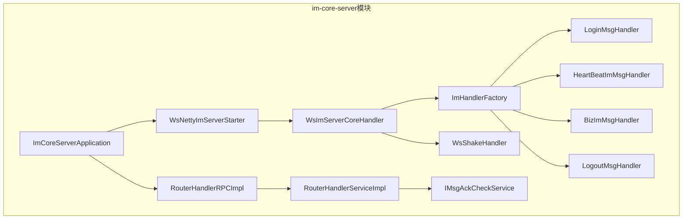

**图示来源**
- [ImCoreServerApplication.java](file://live-im-core-server/src/main/java/com/logilong/live/im/core/server/ImCoreServerApplication.java)
- [WsNettyImServerStarter.java](file://live-im-core-server/src/main/java/com/logilong/live/im/core/server/starter/WsNettyImServerStarter.java)
- [WsImServerCoreHandler.java](file://live-im-core-server/src/main/java/com/logilong/live/im/core/server/handler/ws/WsImServerCoreHandler.java)

**本节来源**
- [ImCoreServerApplication.java](file://live-im-core-server/src/main/java/com/logilong/live/im/core/server/ImCoreServerApplication.java)
- [WsNettyImServerStarter.java](file://live-im-core-server/src/main/java/com/logilong/live/im/core/server/starter/WsNettyImServerStarter.java)

## 核心组件
IM核心通信层的核心组件包括：基于Netty的WebSocket服务器、消息处理器工厂、各类消息处理器、消息路由服务等。这些组件协同工作，实现了高并发、低延迟的即时通讯功能。

**本节来源**
- [ImCoreServerApplication.java](file://live-im-core-server/src/main/java/com/logilong/live/im/core/server/ImCoreServerApplication.java)
- [WsImServerCoreHandler.java](file://live-im-core-server/src/main/java/com/logilong/live/im/core/server/handler/ws/WsImServerCoreHandler.java)
- [ImHandlerFactory.java](file://live-im-core-server/src/main/java/com/logilong/live/im/core/server/handler/ImHandlerFactory.java)

## 架构概述
IM核心通信层采用典型的微服务架构，通过Dubbo实现服务注册与发现，通过Netty实现高性能网络通信。整体架构分为接入层、处理层和路由层。

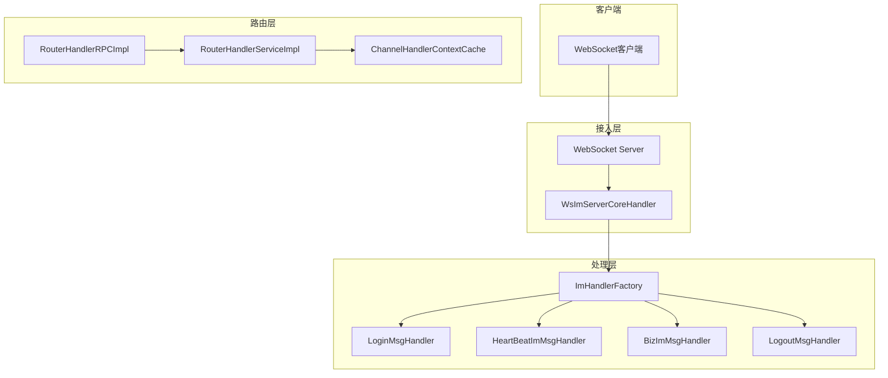

**图示来源**
- [WsImServerCoreHandler.java](file://live-im-core-server/src/main/java/com/logilong/live/im/core/server/handler/ws/WsImServerCoreHandler.java)
- [ImHandlerFactory.java](file://live-im-core-server/src/main/java/com/logilong/live/im/core/server/handler/ImHandlerFactory.java)
- [RouterHandlerRPCImpl.java](file://live-im-core-server/src/main/java/com/logilong/live/im/core/server/rpc/RouterHandlerRPCImpl.java)

## 详细组件分析

### 核心应用启动类分析
ImCoreServerApplication是IM核心通信层的启动类，通过Spring Boot注解配置应用，使用@EnableDubbo启用Dubbo服务，使用@EnableDiscoveryClient启用服务发现功能。该类将Web应用类型设置为NONE，因为Netty服务器独立运行，不依赖于内嵌的Web服务器。

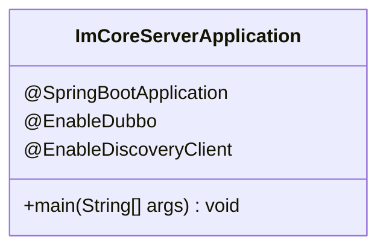

**图示来源**
- [ImCoreServerApplication.java](file://live-im-core-server/src/main/java/com/logilong/live/im/core/server/ImCoreServerApplication.java#L13-L15)

**本节来源**
- [ImCoreServerApplication.java](file://live-im-core-server/src/main/java/com/logilong/live/im/core/server/ImCoreServerApplication.java)

### WebSocket核心处理器分析
WsImServerCoreHandler是WebSocket消息处理的核心入口，继承自Netty的SimpleChannelInboundHandler，负责处理WebSocket帧。该处理器通过channelRead0方法处理接收到的消息，通过channelInactive方法处理连接断开事件。

#### 消息处理流程
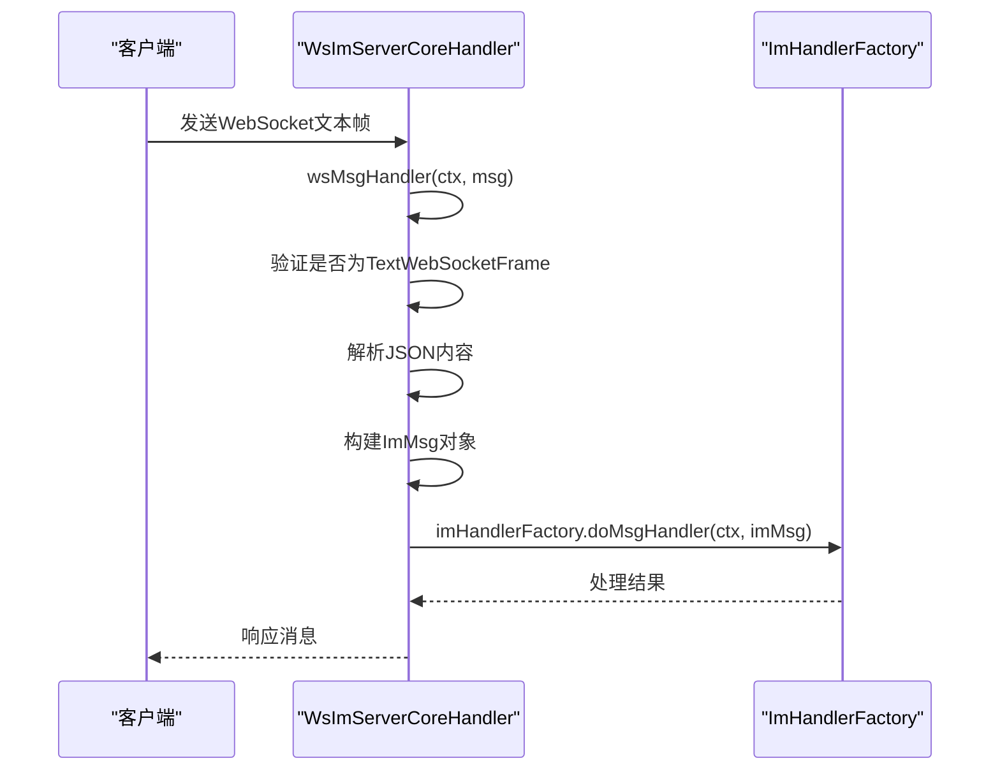

**图示来源**
- [WsImServerCoreHandler.java](file://live-im-core-server/src/main/java/com/logilong/live/im/core/server/handler/ws/WsImServerCoreHandler.java#L37-L75)

#### 连接断开处理
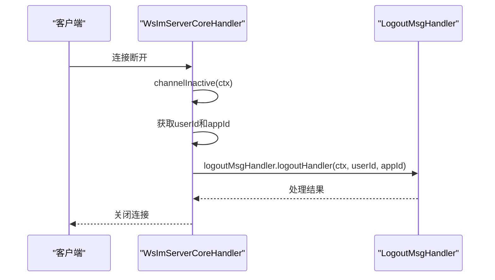

**图示来源**
- [WsImServerCoreHandler.java](file://live-im-core-server/src/main/java/com/logilong/live/im/core/server/handler/ws/WsImServerCoreHandler.java#L44-L51)

**本节来源**
- [WsImServerCoreHandler.java](file://live-im-core-server/src/main/java/com/logilong/live/im/core/server/handler/ws/WsImServerCoreHandler.java)

### 消息处理器工厂分析
ImHandlerFactory是消息处理器的工厂接口，定义了doMsgHandler方法用于处理消息。ImHandlerFactoryImpl是其实现类，通过Spring的InitializingBean接口在初始化时注册各类消息处理器。

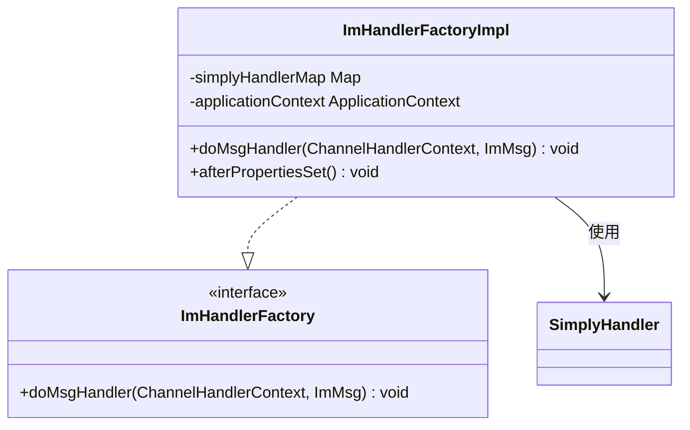

**图示来源**
- [ImHandlerFactory.java](file://live-im-core-server/src/main/java/com/logilong/live/im/core/server/handler/ImHandlerFactory.java)
- [ImHandlerFactoryImpl.java](file://live-im-core-server/src/main/java/com/logilong/live/im/core/server/handler/impl/ImHandlerFactoryImpl.java)

**本节来源**
- [ImHandlerFactory.java](file://live-im-core-server/src/main/java/com/logilong/live/im/core/server/handler/ImHandlerFactory.java)
- [ImHandlerFactoryImpl.java](file://live-im-core-server/src/main/java/com/logilong/live/im/core/server/handler/impl/ImHandlerFactoryImpl.java)

### 各类消息处理器分析
IM系统定义了多种消息处理器，分别处理不同类型的IM消息。

#### 登录消息处理器
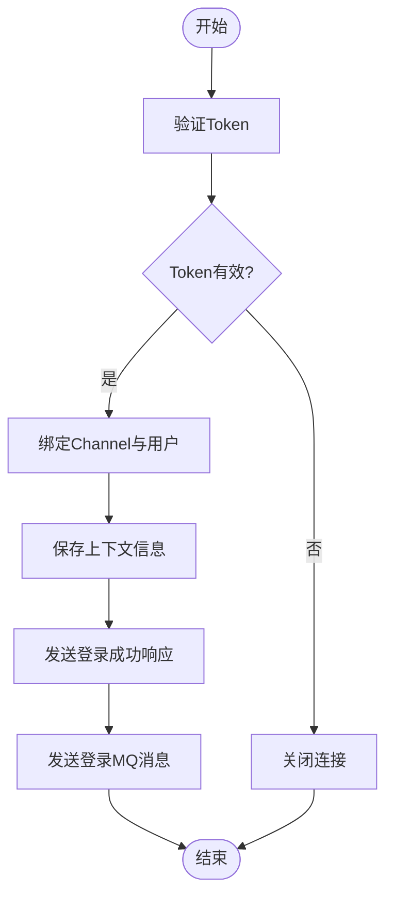

**图示来源**
- [LoginMsgHandler.java](file://live-im-core-server/src/main/java/com/logilong/live/im/core/server/handler/impl/LoginMsgHandler.java#L45-L73)

#### 心跳消息处理器
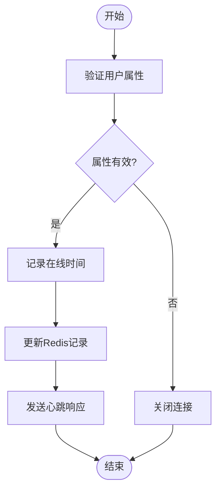

**图示来源**
- [HeartBeatImMsgHandler.java](file://live-im-core-server/src/main/java/com/logilong/live/im/core/server/handler/impl/HeartBeatImMsgHandler.java#L38-L62)

#### 业务消息处理器
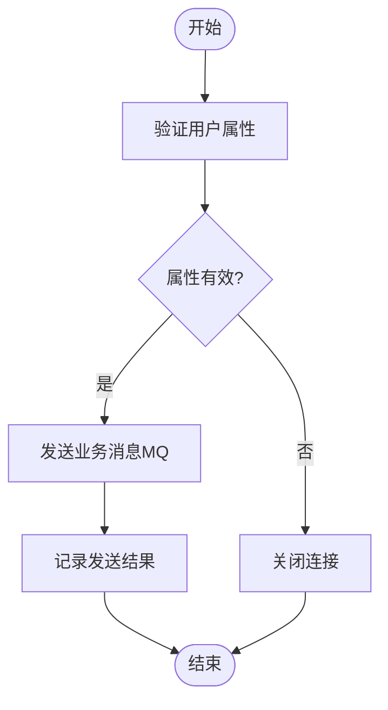

**图示来源**
- [BizImMsgHandler.java](file://live-im-core-server/src/main/java/com/logilong/live/im/core/server/handler/impl/BizImMsgHandler.java#L28-L52)

#### 登出消息处理器
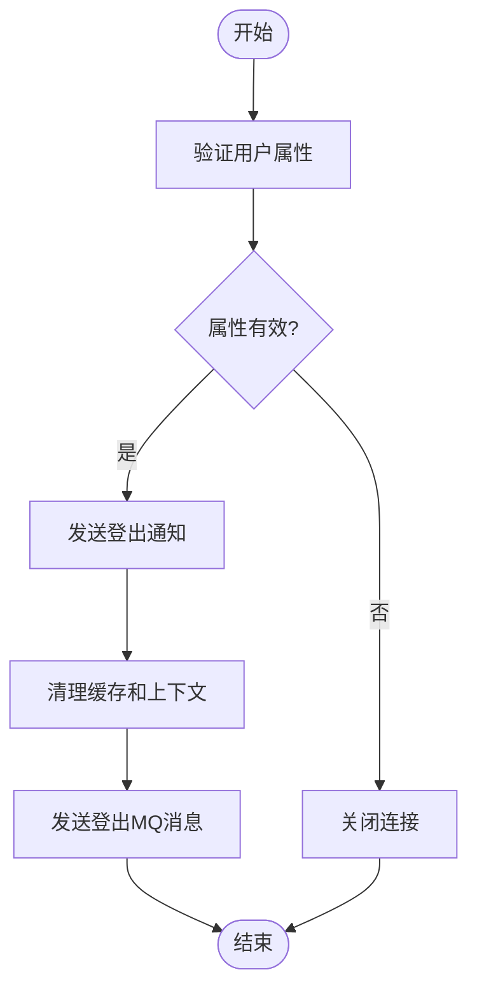

**图示来源**
- [LogoutMsgHandler.java](file://live-im-core-server/src/main/java/com/logilong/live/im/core/server/handler/impl/LogoutMsgHandler.java#L37-L48)

**本节来源**
- [LoginMsgHandler.java](file://live-im-core-server/src/main/java/com/logilong/live/im/core/server/handler/impl/LoginMsgHandler.java)
- [HeartBeatImMsgHandler.java](file://live-im-core-server/src/main/java/com/logilong/live/im/core/server/handler/impl/HeartBeatImMsgHandler.java)
- [BizImMsgHandler.java](file://live-im-core-server/src/main/java/com/logilong/live/im/core/server/handler/impl/BizImMsgHandler.java)
- [LogoutMsgHandler.java](file://live-im-core-server/src/main/java/com/logilong/live/im/core/server/handler/impl/LogoutMsgHandler.java)

### 消息路由机制分析
IRouterHandlerRPC接口定义了消息路由的远程调用方法，包括sendMsg和batchSendMsg，用于从其他服务向IM客户端发送消息。

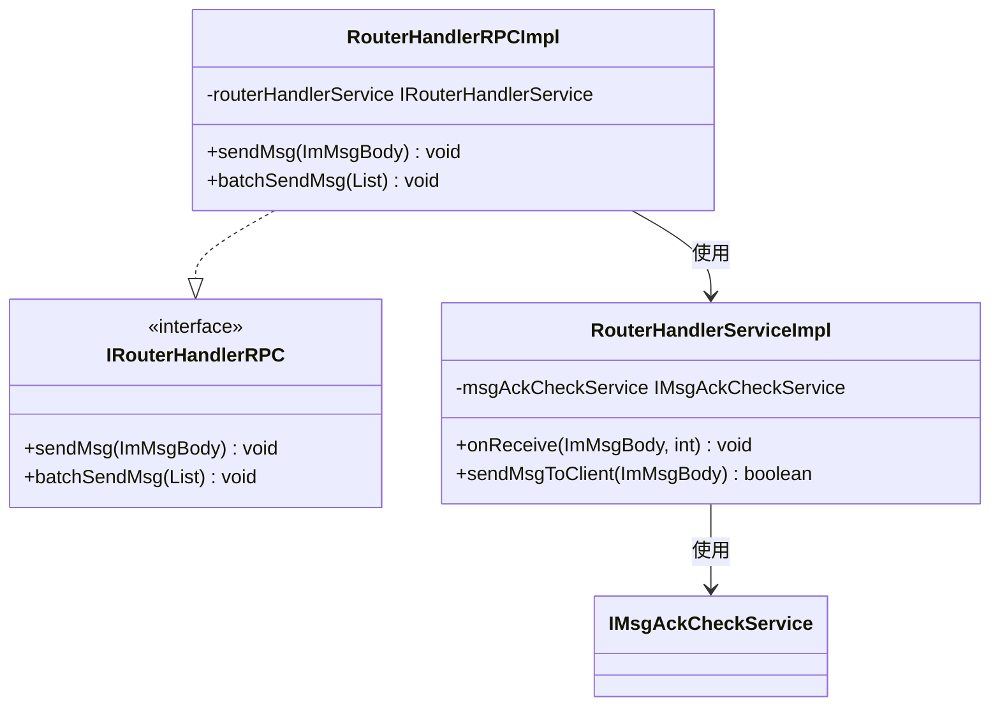

**图示来源**
- [IRouterHandlerRPC.java](file://live-im-core-server-interfaces/src/main/java/com/logilong/live/im/core/server/interfaces/rpc/IRouterHandlerRPC.java)
- [RouterHandlerRPCImpl.java](file://live-im-core-server/src/main/java/com/logilong/live/im/core/server/rpc/RouterHandlerRPCImpl.java)
- [RouterHandlerServiceImpl.java](file://live-im-core-server/src/main/java/com/logilong/live/im/core/server/service/impl/RouterHandlerServiceImpl.java)

**本节来源**
- [IRouterHandlerRPC.java](file://live-im-core-server-interfaces/src/main/java/com/logilong/live/im/core/server/interfaces/rpc/IRouterHandlerRPC.java)
- [RouterHandlerRPCImpl.java](file://live-im-core-server/src/main/java/com/logilong/live/im/core/server/rpc/RouterHandlerRPCImpl.java)
- [RouterHandlerServiceImpl.java](file://live-im-core-server/src/main/java/com/logilong/live/im/core/server/service/impl/RouterHandlerServiceImpl.java)

## 依赖分析
IM核心通信层依赖于多个外部组件和服务，包括Dubbo、Netty、Spring Boot、Nacos、RocketMQ等。

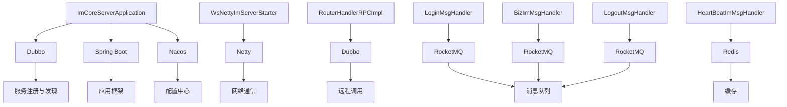

**图示来源**
- [ImCoreServerApplication.java](file://live-im-core-server/src/main/java/com/logilong/live/im/core/server/ImCoreServerApplication.java)
- [WsNettyImServerStarter.java](file://live-im-core-server/src/main/java/com/logilong/live/im/core/server/starter/WsNettyImServerStarter.java)
- [RouterHandlerRPCImpl.java](file://live-im-core-server/src/main/java/com/logilong/live/im/core/server/rpc/RouterHandlerRPCImpl.java)
- [LoginMsgHandler.java](file://live-im-core-server/src/main/java/com/logilong/live/im/core/server/handler/impl/LoginMsgHandler.java)
- [HeartBeatImMsgHandler.java](file://live-im-core-server/src/main/java/com/logilong/live/im/core/server/handler/impl/HeartBeatImMsgHandler.java)
- [BizImMsgHandler.java](file://live-im-core-server/src/main/java/com/logilong/live/im/core/server/handler/impl/BizImMsgHandler.java)
- [LogoutMsgHandler.java](file://live-im-core-server/src/main/java/com/logilong/live/im/core/server/handler/impl/LogoutMsgHandler.java)

**本节来源**
- [ImCoreServerApplication.java](file://live-im-core-server/src/main/java/com/logilong/live/im/core/server/ImCoreServerApplication.java)
- [bootstrap.yml](file://live-im-core-server/src/main/resources/bootstrap.yml)

## 性能考量
IM核心通信层在设计时充分考虑了高并发场景下的性能需求，采用了多项优化策略：

1. **连接管理**：使用ChannelHandlerContextCache缓存用户的ChannelHandlerContext，实现快速消息投递。
2. **消息分发**：通过ImHandlerFactory实现消息的快速分发，避免复杂的条件判断。
3. **异步处理**：对于非关键路径的操作（如发送MQ消息），采用异步方式处理，减少主线程阻塞。
4. **资源复用**：Netty的EventLoopGroup实现线程复用，减少线程创建开销。
5. **心跳机制**：通过Redis的ZSet记录用户心跳时间，高效管理在线用户状态。

这些优化策略确保了系统在高并发场景下仍能保持低延迟和高稳定性，特别适用于直播弹幕、实时通知等对实时性要求极高的场景。

## 故障排除指南
在使用IM核心通信层时，可能会遇到以下常见问题：

1. **连接失败**：检查客户端发送的Token是否有效，用户ID和AppID是否符合要求。
2. **消息丢失**：确认消息路由服务是否正常运行，检查RocketMQ的消费情况。
3. **心跳超时**：检查Redis连接是否正常，确认心跳间隔设置是否合理。
4. **服务注册失败**：检查Nacos配置是否正确，确认DUBBO_IP_TO_REGISTRY和DUBBO_PORT_TO_REGISTRY环境变量是否设置。

**本节来源**
- [LoginMsgHandler.java](file://live-im-core-server/src/main/java/com/logilong/live/im/core/server/handler/impl/LoginMsgHandler.java)
- [HeartBeatImMsgHandler.java](file://live-im-core-server/src/main/java/com/logilong/live/im/core/server/handler/impl/HeartBeatImMsgHandler.java)
- [RouterHandlerRPCImpl.java](file://live-im-core-server/src/main/java/com/logilong/live/im/core/server/rpc/RouterHandlerRPCImpl.java)

## 结论
IM核心通信层通过基于Netty的WebSocket长连接服务，实现了高性能、高可靠的即时通讯功能。通过@EnableDubbo和@EnableDiscoveryClient实现了服务的注册与发现，支持分布式部署。WsImServerCoreHandler作为核心处理器，通过ImHandlerFactory分发不同类型的IM消息，实现了清晰的职责分离。IRouterHandlerRPC接口提供了消息路由能力，支持点对点和广播式消息投递。整个系统在设计上充分考虑了高并发场景下的性能需求，通过连接管理、消息分发、异步处理等优化策略，确保了系统的稳定性和低延迟特性，为直播弹幕、实时通知等应用场景提供了坚实的技术基础。