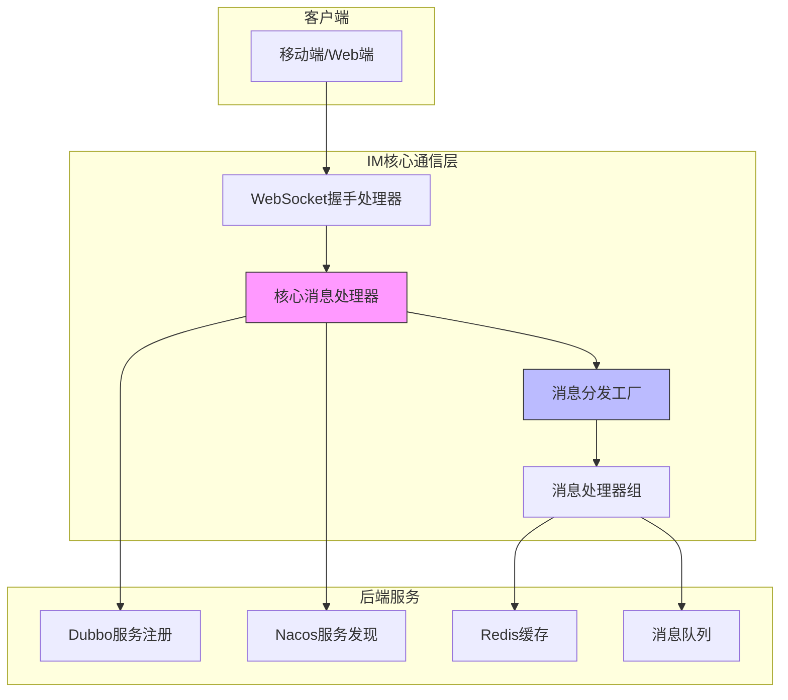
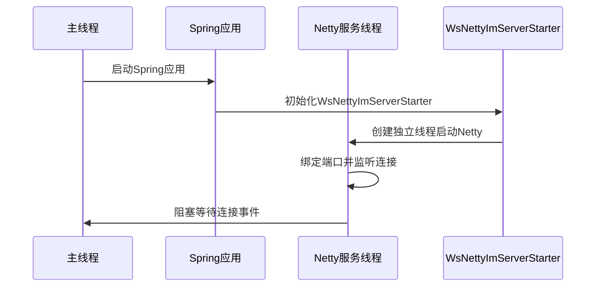
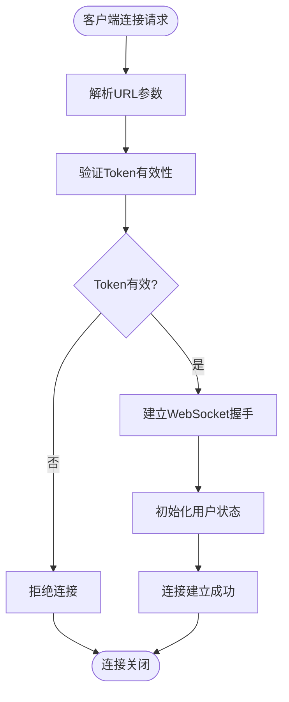
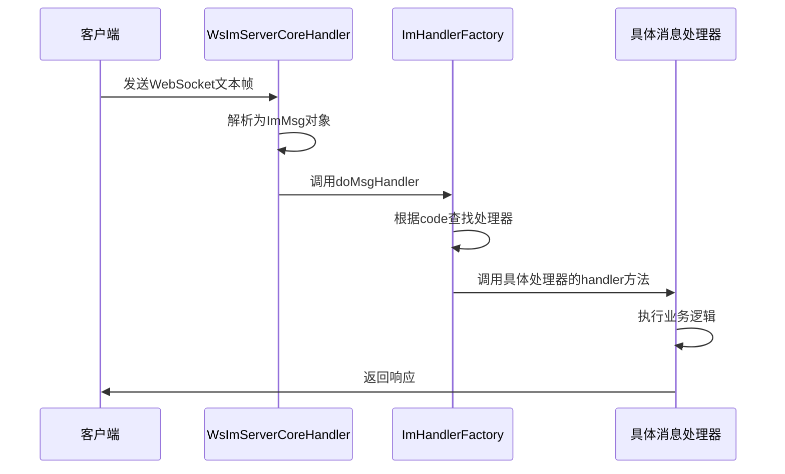
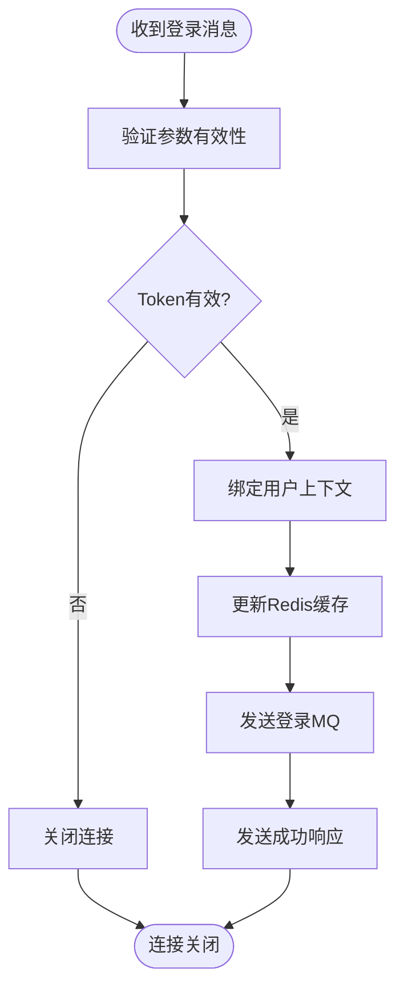
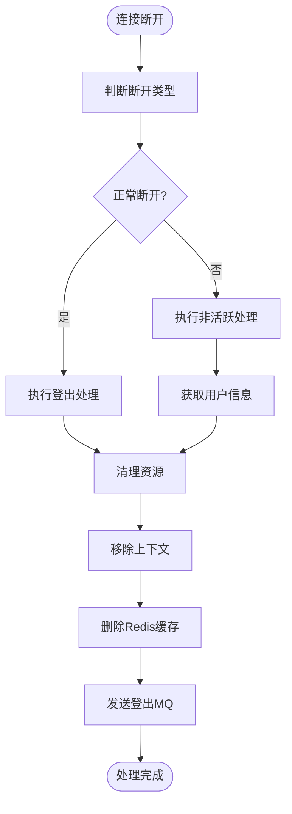
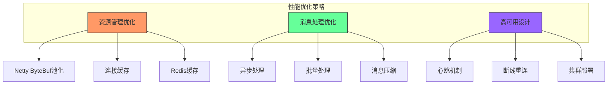

# IM核心通信机制

<cite>
**本文档引用文件**  
- [ImCoreServerApplication.java](file://live-im-core-server/src/main/java/com/logilong/live/im/core/server/ImCoreServerApplication.java)
- [WsImServerCoreHandler.java](file://live-im-core-server/src/main/java/com/logilong/live/im/core/server/handler/ws/WsImServerCoreHandler.java)
- [WsNettyImServerStarter.java](file://live-im-core-server/src/main/java/com/logilong/live/im/core/server/starter/WsNettyImServerStarter.java)
- [ImHandlerFactoryImpl.java](file://live-im-core-server/src/main/java/com/logilong/live/im/core/server/handler/impl/ImHandlerFactoryImpl.java)
- [LoginMsgHandler.java](file://live-im-core-server/src/main/java/com/logilong/live/im/core/server/handler/impl/LoginMsgHandler.java)
- [LogoutMsgHandler.java](file://live-im-core-server/src/main/java/com/logilong/live/im/core/server/handler/impl/LogoutMsgHandler.java)
- [ImMsg.java](file://live-im-core-server/src/main/java/com/logilong/live/im/core/server/common/ImMsg.java)
- [ImContextUtils.java](file://live-im-core-server/src/main/java/com/logilong/live/im/core/server/common/ImContextUtils.java)
- [ChannelHandlerContextCache.java](file://live-im-core-server/src/main/java/com/logilong/live/im/core/server/common/ChannelHandlerContextCache.java)
- [WsShakeHandler.java](file://live-im-core-server/src/main/java/com/logilong/live/im/core/server/handler/ws/WsShakeHandler.java)
- [ImMsgCodeEnum.java](file://live-im-interface/src/main/java/com/logilong/live/im/constants/ImMsgCodeEnum.java)
- [ImCoreServerConstants.java](file://live-im-core-server-interfaces/src/main/java/com/logilong/live/im/core/server/interfaces/constants/ImCoreServerConstants.java)
</cite>

## 目录
1. [系统架构概述](#系统架构概述)
2. [服务启动与配置机制](#服务启动与配置机制)
3. [WebSocket长连接处理流程](#websocket长连接处理流程)
4. [消息分发与处理机制](#消息分发与处理机制)
5. [连接生命周期管理](#连接生命周期管理)
6. [高并发与稳定性保障](#高并发与稳定性保障)
7. [性能优化策略](#性能优化策略)

## 系统架构概述

IM核心通信层采用Netty作为底层网络框架，构建高性能的WebSocket长连接服务。系统通过Dubbo实现服务注册与远程调用能力，结合Nacos进行服务发现，形成分布式IM通信架构。



**图示来源**  
- [WsImServerCoreHandler.java](file://live-im-core-server/src/main/java/com/logilong/live/im/core/server/handler/ws/WsImServerCoreHandler.java)
- [ImHandlerFactoryImpl.java](file://live-im-core-server/src/main/java/com/logilong/live/im/core/server/handler/impl/ImHandlerFactoryImpl.java)

**本节来源**  
- [ImCoreServerApplication.java](file://live-im-core-server/src/main/java/com/logilong/live/im/core/server/ImCoreServerApplication.java)
- [bootstrap.yml](file://live-im-core-server/src/main/resources/bootstrap.yml)

## 服务启动与配置机制

IM核心服务通过`ImCoreServerApplication`作为启动入口，采用Spring Boot框架进行初始化。服务通过特定配置实现独立Netty服务的启动模式。

### 启动类配置分析

`ImCoreServerApplication`类使用了关键注解组合：
- `@SpringBootApplication`：启用Spring Boot自动配置
- `@EnableDubbo`：启用Dubbo服务注册与调用能力
- `@EnableDiscoveryClient`：启用服务发现功能

在`main`方法中，通过`setWebApplicationType(WebApplicationType.NONE)`设置应用类型为非Web模式，这使得Spring Boot容器不会启动内置的Web服务器，从而为独立的Netty服务启动创造条件。



**图示来源**  
- [ImCoreServerApplication.java](file://live-im-core-server/src/main/java/com/logilong/live/im/core/server/ImCoreServerApplication.java)
- [WsNettyImServerStarter.java](file://live-im-core-server/src/main/java/com/logilong/live/im/core/server/starter/WsNettyImServerStarter.java)

**本节来源**  
- [ImCoreServerApplication.java](file://live-im-core-server/src/main/java/com/logilong/live/im/core/server/ImCoreServerApplication.java#L13-L23)
- [WsNettyImServerStarter.java](file://live-im-core-server/src/main/java/com/logilong/live/im/core/server/starter/WsNettyImServerStarter.java#L27-L101)

## WebSocket长连接处理流程

WebSocket长连接的建立和处理是IM系统的核心功能，通过Netty的ChannelPipeline机制实现高效的消息处理。

### 握手连接处理

`WsShakeHandler`负责WebSocket的握手连接处理，其主要职责包括：
1. 解析客户端连接URL中的参数（token、userId、roomId等）
2. 验证token的有效性
3. 建立WebSocket握手连接
4. 初始化用户登录状态



**图示来源**  
- [WsShakeHandler.java](file://live-im-core-server/src/main/java/com/logilong/live/im/core/server/handler/ws/WsShakeHandler.java#L25-L108)

**本节来源**  
- [WsShakeHandler.java](file://live-im-core-server/src/main/java/com/logilong/live/im/core/server/handler/ws/WsShakeHandler.java#L25-L108)
- [LoginMsgHandler.java](file://live-im-core-server/src/main/java/com/logilong/live/im/core/server/handler/impl/LoginMsgHandler.java#L32-L121)

## 消息分发与处理机制

IM系统采用工厂模式实现消息的分发与处理，确保不同类型的消息能够被正确的处理器处理。

### 消息结构设计

`ImMsg`类定义了统一的消息结构，包含以下关键字段：
- `magic`：魔数，用于基本校验
- `code`：消息类型码，标识消息作用
- `len`：消息体长度
- `body`：消息体内容，以字节数组存储

```java
// 消息结构示例
ImMsg {
    short magic;    // 魔数
    int code;       // 消息类型码
    int len;        // 消息体长度
    byte[] body;    // 消息体
}
```

### 消息分发流程

消息分发由`ImHandlerFactory`接口及其实现类`ImHandlerFactoryImpl`完成，采用策略模式根据消息类型码分发到相应的处理器。



**图示来源**  
- [ImMsg.java](file://live-im-core-server/src/main/java/com/logilong/live/im/core/server/common/ImMsg.java#L10-L36)
- [ImHandlerFactoryImpl.java](file://live-im-core-server/src/main/java/com/logilong/live/im/core/server/handler/impl/ImHandlerFactoryImpl.java#L17-L45)

**本节来源**  
- [ImMsg.java](file://live-im-core-server/src/main/java/com/logilong/live/im/core/server/common/ImMsg.java#L10-L36)
- [ImHandlerFactory.java](file://live-im-core-server/src/main/java/com/logilong/live/im/core/server/handler/ImHandlerFactory.java#L7-L14)
- [ImHandlerFactoryImpl.java](file://live-im-core-server/src/main/java/com/logilong/live/im/core/server/handler/impl/ImHandlerFactoryImpl.java#L17-L45)
- [ImMsgCodeEnum.java](file://live-im-interface/src/main/java/com/logilong/live/im/constants/ImMsgCodeEnum.java)

## 连接生命周期管理

IM系统通过Netty的事件机制实现连接的全生命周期管理，确保连接的稳定性和资源的正确释放。

### 连接建立与认证

`LoginMsgHandler`负责处理登录消息，实现用户身份认证和连接绑定：

1. 验证token与userId的匹配性
2. 将用户ID与ChannelHandlerContext关联
3. 在Redis中记录用户连接信息
4. 发送登录成功通知



**图示来源**  
- [LoginMsgHandler.java](file://live-im-core-server/src/main/java/com/logilong/live/im/core/server/handler/impl/LoginMsgHandler.java#L32-L121)

### 连接断开处理

`LogoutMsgHandler`和`channelInactive`方法共同处理连接断开事件：

- 正常断开：客户端发送登出消息，服务端执行清理
- 异常断开：网络中断等，Netty触发`channelInactive`事件



**图示来源**  
- [LogoutMsgHandler.java](file://live-im-core-server/src/main/java/com/logilong/live/im/core/server/handler/impl/LogoutMsgHandler.java#L27-L97)
- [WsImServerCoreHandler.java](file://live-im-core-server/src/main/java/com/logilong/live/im/core/server/handler/ws/WsImServerCoreHandler.java#L44-L51)

**本节来源**  
- [LoginMsgHandler.java](file://live-im-core-server/src/main/java/com/logilong/live/im/core/server/handler/impl/LoginMsgHandler.java#L32-L121)
- [LogoutMsgHandler.java](file://live-im-core-server/src/main/java/com/logilong/live/im/core/server/handler/impl/LogoutMsgHandler.java#L27-L97)
- [WsImServerCoreHandler.java](file://live-im-core-server/src/main/java/com/logilong/live/im/core/server/handler/ws/WsImServerCoreHandler.java#L36-L76)
- [ImContextUtils.java](file://live-im-core-server/src/main/java/com/logilong/live/im/core/server/common/ImContextUtils.java#L8-L43)

## 高并发与稳定性保障

IM核心通信层通过多种机制保障高并发下的连接稳定性和消息有序性。

### 连接管理机制

系统采用`ChannelHandlerContextCache`类集中管理用户与连接的映射关系：

- 使用HashMap存储userId到ChannelHandlerContext的映射
- 提供线程安全的put、get、remove操作
- 在服务启动时记录对外暴露的IP和端口

```java
// 连接缓存结构
ChannelHandlerContextCache {
    private static String SERVER_IP_ADDRESS;
    private static final Map<Long, ChannelHandlerContext> channelHandlerContextMap;
}
```

### 消息有序性保障

通过以下机制确保消息的有序性：
1. Netty的单线程EventLoop保证单个连接的消息处理顺序
2. 消息体中的序列号机制（隐含在业务逻辑中）
3. 服务端与客户端的心跳机制维持连接活跃

### 异常处理与日志记录

系统建立了完善的异常处理和日志记录机制：
- 所有关键操作都有详细的日志输出
- 异常被捕获并记录到日志系统
- 关键资源操作有失败重试机制

**本节来源**  
- [ChannelHandlerContextCache.java](file://live-im-core-server/src/main/java/com/logilong/live/im/core/server/common/ChannelHandlerContextCache.java#L8-L37)
- [WsImServerCoreHandler.java](file://live-im-core-server/src/main/java/com/logilong/live/im/core/server/handler/ws/WsImServerCoreHandler.java#L27-L76)
- [LoginMsgHandler.java](file://live-im-core-server/src/main/java/com/logilong/live/im/core/server/handler/impl/LoginMsgHandler.java#L35-L121)

## 性能优化策略

针对直播弹幕、实时通知等高实时性场景，IM通信层实施了多项性能优化策略。

### 资源管理优化

- 使用Netty的ByteBuf池化技术减少内存分配开销
- 连接对象的复用和缓存减少创建开销
- Redis缓存用户连接信息，避免重复查询

### 消息处理优化

- 异步处理耗时操作（如MQ发送）
- 批量处理相似类型的消息
- 消息压缩减少网络传输量

### 高可用设计

- 服务注册与发现确保集群部署
- 心跳机制检测连接健康状态
- 断线重连机制保障用户体验



**图示来源**  
- [WsNettyImServerStarter.java](file://live-im-core-server/src/main/java/com/logilong/live/im/core/server/starter/WsNettyImServerStarter.java#L27-L101)
- [ChannelHandlerContextCache.java](file://live-im-core-server/src/main/java/com/logilong/live/im/core/server/common/ChannelHandlerContextCache.java#L8-L37)
- [ImCoreServerConstants.java](file://live-im-core-server-interfaces/src/main/java/com/logilong/live/im/core/server/interfaces/constants/ImCoreServerConstants.java)

**本节来源**  
- [WsNettyImServerStarter.java](file://live-im-core-server/src/main/java/com/logilong/live/im/core/server/starter/WsNettyImServerStarter.java#L27-L101)
- [ChannelHandlerContextCache.java](file://live-im-core-server/src/main/java/com/logilong/live/im/core/server/common/ChannelHandlerContextCache.java#L8-L37)
- [ImCoreServerConstants.java](file://live-im-core-server-interfaces/src/main/java/com/logilong/live/im/core/server/interfaces/constants/ImCoreServerConstants.java)
- [LoginMsgHandler.java](file://live-im-core-server/src/main/java/com/logilong/live/im/core/server/handler/impl/LoginMsgHandler.java#L93-L95)