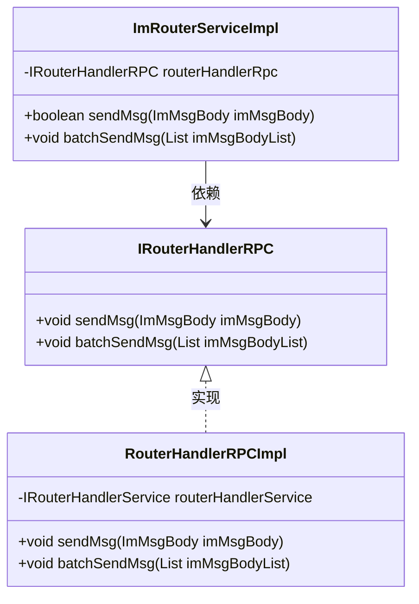
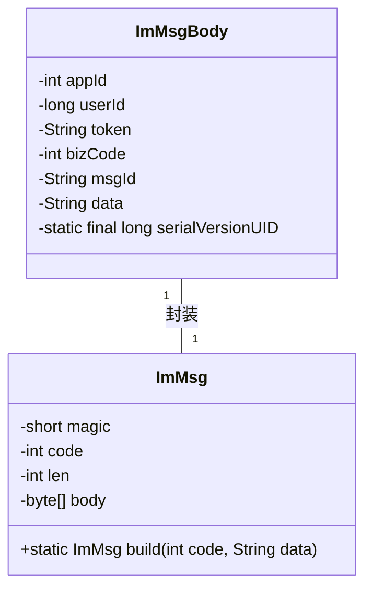
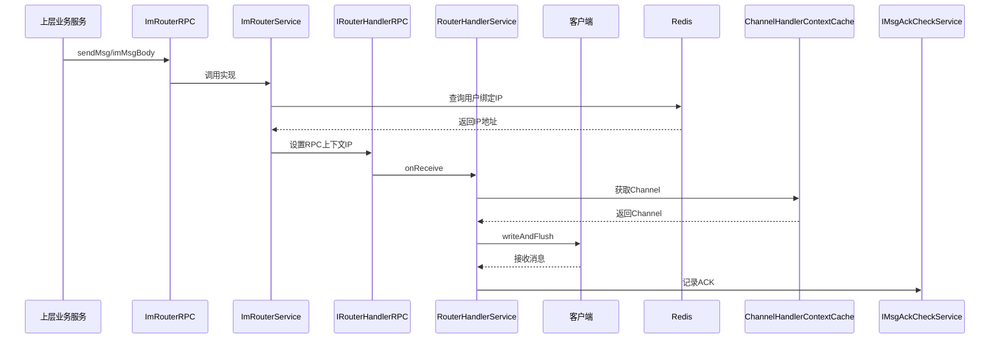
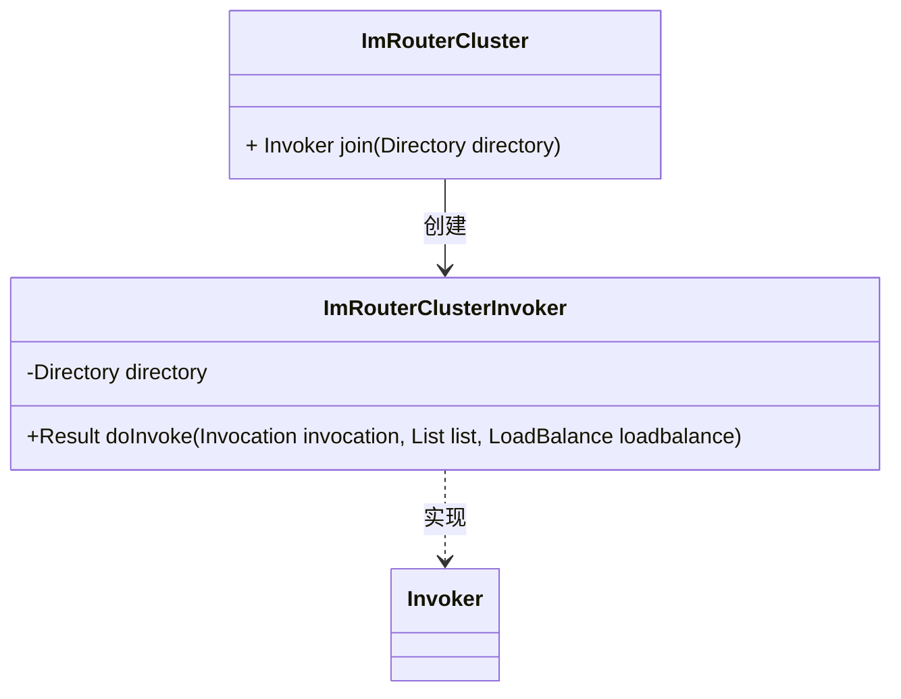
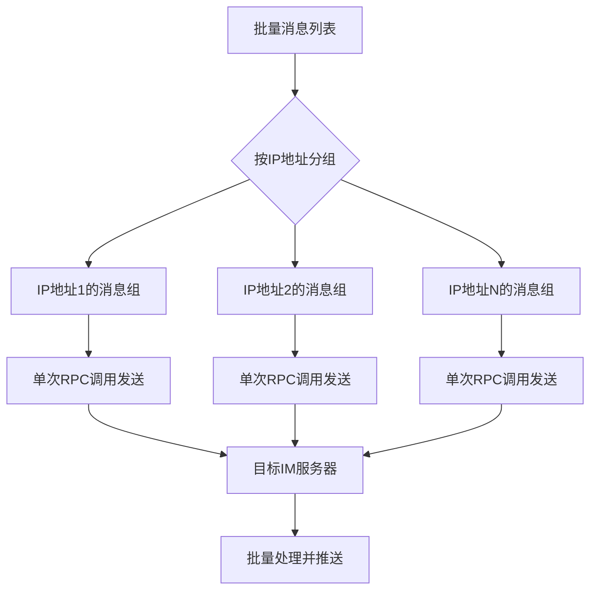
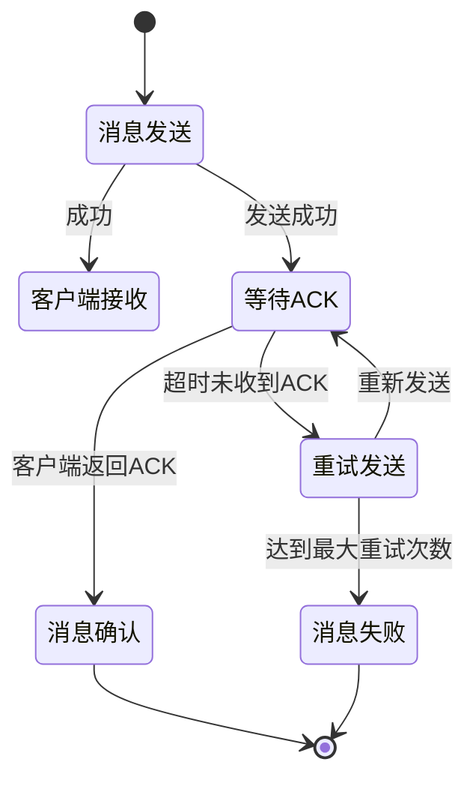

# 消息路由与投递机制

<cite>
**本文档引用文件**  
- [IRouterHandlerRPC.java](file://live-im-core-server-interfaces/src/main/java/com/logilong/live/im/core/server/interfaces/rpc/IRouterHandlerRPC.java)
- [RouterHandlerRPCImpl.java](file://live-im-core-server/src/main/java/com/logilong/live/im/core/server/rpc/RouterHandlerRPCImpl.java)
- [RouterHandlerServiceImpl.java](file://live-im-core-server/src/main/java/com/logilong/live/im/core/server/service/impl/RouterHandlerServiceImpl.java)
- [ImMsgBody.java](file://live-im-interface/src/main/java/com/logilong/live/im/dto/ImMsgBody.java)
- [ImRouterRPCImpl.java](file://live-im-router-provider/src/main/java/com/logilong/live/im/router/provider/rpc/ImRouterRPCImpl.java)
- [ImRouterServiceImpl.java](file://live-im-router-provider/src/main/java/com/logilong/live/im/router/provider/service/impl/ImRouterServiceImpl.java)
- [ChannelHandlerContextCache.java](file://live-im-core-server/src/main/java/com/logilong/live/im/core/server/common/ChannelHandlerContextCache.java)
- [ImMsg.java](file://live-im-core-server/src/main/java/com/logilong/live/im/core/server/common/ImMsg.java)
- [ImCoreServerConstants.java](file://live-im-core-server-interfaces/src/main/java/com/logilong/live/im/core/server/interfaces/constants/ImCoreServerConstants.java)
- [ImRouterCluster.java](file://live-im-router-provider/src/main/java/com/logilong/live/im/router/provider/cluster/ImRouterCluster.java)
- [ImRouterClusterInvoker.java](file://live-im-router-provider/src/main/java/com/logilong/live/im/router/provider/cluster/ImRouterClusterInvoker.java)
- [ImRouterRPC.java](file://live-im-router-interface/src/main/java/com/logilong/live/im/router/interfaces/ImRouterRPC.java)
</cite>

## 目录
1. [引言](#引言)
2. [核心接口定义](#核心接口定义)
3. [消息体结构设计](#消息体结构设计)
4. [消息路由服务实现](#消息路由服务实现)
5. [集群环境下的路由策略](#集群环境下的路由策略)
6. [批量发送性能优化](#批量发送性能优化)
7. [实际调用示例](#实际调用示例)
8. [可靠性保障机制](#可靠性保障机制)
9. [结论](#结论)

## 引言
本系统实现了高效、可靠的消息路由与投递机制，支持点对点和广播式消息推送。通过Dubbo RPC调用，上层业务服务（如礼物系统、直播间）可以触发消息推送流程。系统采用分层架构设计，包含路由层（router）、核心服务层（core-server）和客户端连接管理，确保消息的可靠投递与最终一致性。

## 核心接口定义

### IRouterHandlerRPC接口
该接口定义了消息路由处理器的核心功能，专门供路由层服务调用：



**接口说明：**
- `sendMsg`: 按用户ID进行单条消息发送
- `batchSendMsg`: 支持批量消息发送，适用于直播间等群聊场景

**接口来源**
- [IRouterHandlerRPC.java](file://live-im-core-server-interfaces/src/main/java/com/logilong/live/im/core/server/interfaces/rpc/IRouterHandlerRPC.java#L11-L22)
- [RouterHandlerRPCImpl.java](file://live-im-core-server/src/main/java/com/logilong/live/im/core/server/rpc/RouterHandlerRPCImpl.java#L12-L28)

## 消息体结构设计

### ImMsgBody结构
消息体`ImMsgBody`是消息传递的核心数据结构，实现了序列化接口，包含以下关键字段：



**字段说明：**
- `appId`: 业务线ID，标识接入IM服务的不同业务
- `userId`: 用户ID，用于定位目标接收者
- `token`: 认证令牌，用于建立连接时的身份验证
- `bizCode`: 业务标识，区分不同类型的消息
- `msgId`: 唯一消息ID，由系统生成，用于消息追踪和去重
- `data`: 业务数据，JSON格式的字符串，携带具体消息内容

**序列化处理流程：**
1. 消息体对象通过FastJSON序列化为JSON字符串
2. 构建`ImMsg`协议包，包含魔数、编码、长度和序列化后的字节数组
3. 通过Netty框架进行网络传输

**消息体来源**
- [ImMsgBody.java](file://live-im-interface/src/main/java/com/logilong/live/im/dto/ImMsgBody.java#L8-L40)
- [ImMsg.java](file://live-im-core-server/src/main/java/com/logilong/live/im/core/server/common/ImMsg.java#L10-L35)

## 消息路由服务实现

### 路由服务调用链路
系统采用分层调用架构，从上层业务到核心服务的完整调用链路如下：



### 单条消息发送流程
1. 上层服务通过Dubbo调用`ImRouterRPC.sendMsg`
2. `ImRouterServiceImpl`从Redis中查询用户绑定的IM服务器IP地址
3. 设置Dubbo RPC上下文的IP信息
4. 调用`IRouterHandlerRPC.sendMsg`转发到指定IM服务器
5. `RouterHandlerServiceImpl`通过`ChannelHandlerContextCache`获取用户连接通道
6. 构建`ImMsg`协议包并发送给客户端

**路由服务来源**
- [ImRouterServiceImpl.java](file://live-im-router-provider/src/main/java/com/logilong/live/im/router/provider/service/impl/ImRouterServiceImpl.java#L19-L77)
- [RouterHandlerServiceImpl.java](file://live-im-core-server/src/main/java/com/logilong/live/im/core/server/service/impl/RouterHandlerServiceImpl.java#L17-L45)

## 集群环境下的路由策略

### 自定义集群路由实现
系统实现了基于IP地址的精准路由策略，确保消息能够正确投递到用户连接的IM服务器实例。



### 路由策略工作原理
1. **用户绑定信息存储**：用户登录时，将用户ID与IM服务器IP地址的映射关系存储到Redis
2. **路由查询**：发送消息时，根据用户ID查询其连接的IM服务器IP
3. **上下文传递**：通过Dubbo的`RpcContext`传递目标服务器IP
4. **精准调用**：自定义`ImRouterClusterInvoker`根据上下文IP选择具体的服务提供者

**关键代码逻辑：**
- Redis键格式：`live-im-core-server:bindIp:{appId}:{userId}`
- 从`RpcContext`获取目标IP并匹配服务提供者
- 实现了服务级别的负载均衡和故障转移能力

**集群路由来源**
- [ImRouterCluster.java](file://live-im-router-provider/src/main/java/com/logilong/live/im/router/provider/cluster/ImRouterCluster.java#L11-L17)
- [ImRouterClusterInvoker.java](file://live-im-router-provider/src/main/java/com/logilong/live/im/router/provider/cluster/ImRouterClusterInvoker.java#L11-L36)
- [ImCoreServerConstants.java](file://live-im-core-server-interfaces/src/main/java/com/logilong/live/im/core/server/interfaces/constants/ImCoreServerConstants.java#L6)

## 批量发送性能优化

### 批量发送实现机制
系统针对批量消息发送进行了深度优化，避免了逐条调用带来的性能损耗。



### 性能优化策略
1. **批量查询**：使用`multiGet`一次性获取所有用户的绑定IP信息
2. **分组聚合**：将发往同一IM服务器的消息聚合到同一个列表
3. **批量调用**：对每个IP地址只进行一次RPC调用，传入批量消息列表
4. **并行处理**：不同IP地址的消息组可以并行处理

**性能优势：**
- 减少了RPC调用次数，从O(n)降低到O(m)，其中m为涉及的IM服务器数量
- 降低了网络开销和序列化/反序列化成本
- 提高了消息投递的整体吞吐量

**批量发送来源**
- [ImRouterServiceImpl.java](file://live-im-router-provider/src/main/java/com/logilong/live/im/router/provider/service/impl/ImRouterServiceImpl.java#L40-L75)
- [RouterHandlerRPCImpl.java](file://live-im-core-server/src/main/java/com/logilong/live/im/core/server/rpc/RouterHandlerRPCImpl.java#L22-L27)

## 实际调用示例

### 上层服务调用方式
上层业务服务（如礼物系统、直播间）通过依赖注入`ImRouterRPC`接口来触发消息推送：

```java
// 示例：礼物系统发送消息
@DubboReference
private ImRouterRPC routerRPC;

public void sendGiftNotification(long userId, int appId, String giftInfo) {
    ImMsgBody imMsgBody = new ImMsgBody();
    imMsgBody.setUserId(userId);
    imMsgBody.setAppId(appId);
    imMsgBody.setBizCode(ImMsgBizCodeEnum.GIFT_NOTIFY.getCode());
    imMsgBody.setData(JSON.toJSONString(giftInfo));
    
    boolean success = routerRPC.sendMsg(imMsgBody);
    if (!success) {
        // 处理发送失败情况
        log.error("消息发送失败，用户ID:{}", userId);
    }
}
```

### 直播间批量推送示例
```java
// 示例：直播间内批量发送消息
public void broadcastInLivingRoom(List<Long> userIds, int appId, JSONObject message) {
    List<ImMsgBody> msgList = userIds.stream().map(userId -> {
        ImMsgBody body = new ImMsgBody();
        body.setUserId(userId);
        body.setAppId(appId);
        body.setBizCode(ImMsgBizCodeEnum.LIVING_ROOM_MSG.getCode());
        body.setData(message.toJSONString());
        return body;
    }).collect(Collectors.toList());
    
    routerRPC.batchSendMsg(msgList);
}
```

**调用接口来源**
- [ImRouterRPC.java](file://live-im-router-interface/src/main/java/com/logilong/live/im/router/interfaces/ImRouterRPC.java#L7-L19)

## 可靠性保障机制

### 消息确认与重试
系统实现了完整的消息可靠性保障机制：



**关键机制：**
1. **ACK记录**：每次发送消息后记录ACK状态和重试次数
2. **延迟消息**：发送延迟消息用于触发重试机制
3. **重试策略**：基于时间间隔的指数退避重试算法
4. **最终一致性**：确保消息最终能够到达客户端

**可靠性来源**
- [RouterHandlerServiceImpl.java](file://live-im-core-server/src/main/java/com/logilong/live/im/core/server/service/impl/RouterHandlerServiceImpl.java#L23-L29)
- [IMsgAckCheckService.java](file://live-im-core-server/src/main/java/com/logilong/live/im/core/server/service/IMsgAckCheckService.java#L6-L27)

## 结论
本消息路由与投递机制设计充分考虑了高性能、高可用和可靠性需求。通过分层架构设计，实现了业务逻辑与消息投递的解耦。基于Redis的用户绑定信息存储和自定义Dubbo集群策略，确保了在集群环境下的精准路由。批量发送的优化策略显著提升了系统吞吐量。完整的ACK确认和重试机制保障了消息的可靠投递。该机制已成功应用于礼物系统、直播间等多个业务场景，表现稳定可靠。