# 即时通讯服务

<cite>
**本文档引用文件**  
- [ImProviderApplication.java](file://live-im-provider/src/main/java/com/logilong/live/im/provider/ImProviderApplication.java)
- [ImTokenRPC.java](file://live-im-interface/src/main/java/com/logilong/live/im/interfaces/ImTokenRPC.java)
- [ImTokenRPCImpl.java](file://live-im-provider/src/main/java/com/logilong/live/im/provider/rpc/ImTokenRPCImpl.java)
- [ImCoreServerApplication.java](file://live-im-core-server/src/main/java/com/logilong/live/im/core/server/ImCoreServerApplication.java)
- [IRouterHandlerRPC.java](file://live-im-core-server-interfaces/src/main/java/com/logilong/live/im/core/server/interfaces/rpc/IRouterHandlerRPC.java)
- [RouterHandlerRPCImpl.java](file://live-im-core-server/src/main/java/com/logilong/live/im/core/server/rpc/RouterHandlerRPCImpl.java)
- [WsImServerCoreHandler.java](file://live-im-core-server/src/main/java/com/logilong/live/im/core/server/handler/ws/WsImServerCoreHandler.java)
- [WsNettyImServerStarter.java](file://live-im-core-server/src/main/java/com/logilong/live/im/core/server/starter/WsNettyImServerStarter.java)
- [LoginMsgHandler.java](file://live-im-core-server/src/main/java/com/logilong/live/im/core/server/handler/impl/LoginMsgHandler.java)
- [HeartBeatImMsgHandler.java](file://live-im-core-server/src/main/java/com/logilong/live/im/core/server/handler/impl/HeartBeatImMsgHandler.java)
- [RouterHandlerServiceImpl.java](file://live-im-core-server/src/main/java/com/logilong/live/im/core/server/service/impl/RouterHandlerServiceImpl.java)
- [ChannelHandlerContextCache.java](file://live-im-core-server/src/main/java/com/logilong/live/im/core/server/common/ChannelHandlerContextCache.java)
- [ImMsg.java](file://live-im-core-server/src/main/java/com/logilong/live/im/core/server/common/ImMsg.java)
- [WsShakeHandler.java](file://live-im-core-server/src/main/java/com/logilong/live/im/core/server/handler/ws/WsShakeHandler.java)
- [ImOnlineRPC.java](file://live-im-interface/src/main/java/com/logilong/live/im/interfaces/ImOnlineRPC.java)
</cite>

## 目录
1. [系统架构概述](#系统架构概述)
2. [核心组件分析](#核心组件分析)
3. [分层架构设计](#分层架构设计)
4. [业务逻辑层（im-provider）](#业务逻辑层im-provider)
5. [通信核心层（im-core-server）](#通信核心层im-core-server)
6. [消息路由机制](#消息路由机制)
7. [在线状态同步与心跳检测](#在线状态同步与心跳检测)
8. [直播互动中的实时性保障](#直播互动中的实时性保障)
9. [海量连接处理能力](#海量连接处理能力)
10. [断线重连策略](#断线重连策略)

## 系统架构概述

本即时通讯系统采用分层架构设计，主要分为业务逻辑层（im-provider）和通信核心层（im-core-server）。系统通过Dubbo服务框架实现服务间的远程调用，使用Netty作为网络通信基础，支持WebSocket长连接，确保了高并发场景下的实时消息传递能力。

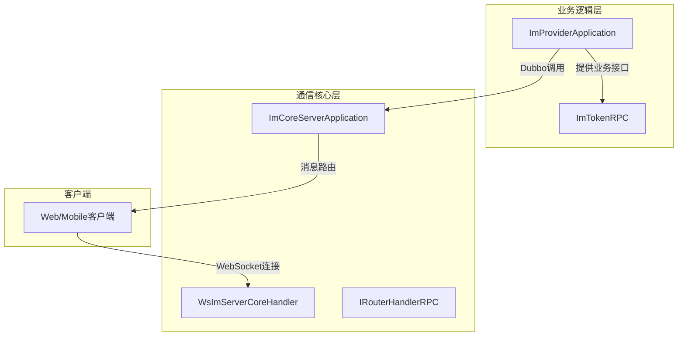

**图示来源**  
- [ImProviderApplication.java](file://live-im-provider/src/main/java/com/logilong/live/im/provider/ImProviderApplication.java)
- [ImCoreServerApplication.java](file://live-im-core-server/src/main/java/com/logilong/live/im/core/server/ImCoreServerApplication.java)
- [WsImServerCoreHandler.java](file://live-im-core-server/src/main/java/com/logilong/live/im/core/server/handler/ws/WsImServerCoreHandler.java)

## 核心组件分析

系统核心组件包括服务提供者应用、消息处理器、连接管理器和路由服务。这些组件协同工作，实现了完整的即时通讯功能。

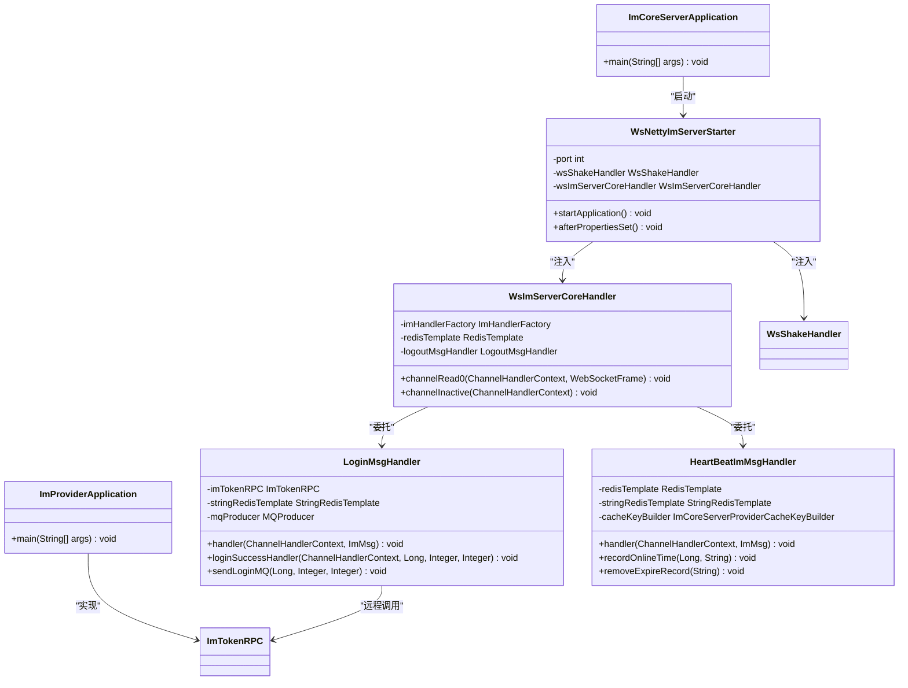

**图示来源**  
- [ImProviderApplication.java](file://live-im-provider/src/main/java/com/logilong/live/im/provider/ImProviderApplication.java#L12-L18)
- [ImCoreServerApplication.java](file://live-im-core-server/src/main/java/com/logilong/live/im/core/server/ImCoreServerApplication.java#L16-L22)
- [WsImServerCoreHandler.java](file://live-im-core-server/src/main/java/com/logilong/live/im/core/server/handler/ws/WsImServerCoreHandler.java#L25-L75)
- [WsNettyImServerStarter.java](file://live-im-core-server/src/main/java/com/logilong/live/im/core/server/starter/WsNettyImServerStarter.java#L27-L100)
- [LoginMsgHandler.java](file://live-im-core-server/src/main/java/com/logilong/live/im/core/server/handler/impl/LoginMsgHandler.java#L33-L120)
- [HeartBeatImMsgHandler.java](file://live-im-core-server/src/main/java/com/logilong/live/im/core/server/handler/impl/HeartBeatImMsgHandler.java#L26-L79)

## 分层架构设计

系统采用清晰的分层架构设计，将业务逻辑与通信核心分离，提高了系统的可维护性和扩展性。

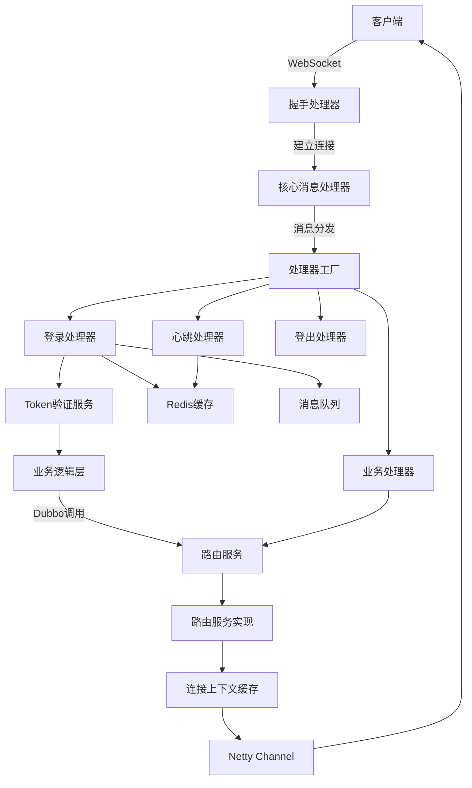

**图示来源**  
- [WsShakeHandler.java](file://live-im-core-server/src/main/java/com/logilong/live/im/core/server/handler/ws/WsShakeHandler.java)
- [WsImServerCoreHandler.java](file://live-im-core-server/src/main/java/com/logilong/live/im/core/server/handler/ws/WsImServerCoreHandler.java)
- [ImHandlerFactory.java](file://live-im-core-server/src/main/java/com/logilong/live/im/core/server/handler/ImHandlerFactory.java)
- [LoginMsgHandler.java](file://live-im-core-server/src/main/java/com/logilong/live/im/core/server/handler/impl/LoginMsgHandler.java)
- [HeartBeatImMsgHandler.java](file://live-im-core-server/src/main/java/com/logilong/live/im/core/server/handler/impl/HeartBeatImMsgHandler.java)
- [RouterHandlerRPCImpl.java](file://live-im-core-server/src/main/java/com/logilong/live/im/core/server/rpc/RouterHandlerRPCImpl.java)

## 业务逻辑层（im-provider）

业务逻辑层负责处理IM系统的核心业务逻辑，通过Dubbo框架对外提供RPC服务接口。

### ImProviderApplication分析

ImProviderApplication是业务逻辑层的启动类，负责初始化Dubbo服务并启动Spring应用上下文。

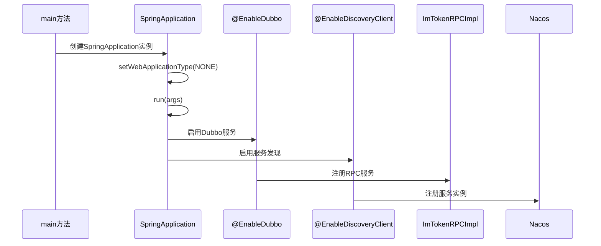

**图示来源**  
- [ImProviderApplication.java](file://live-im-provider/src/main/java/com/logilong/live/im/provider/ImProviderApplication.java#L9-L18)

### ImTokenRPC接口实现

ImTokenRPC接口定义了IM系统用户认证相关的业务方法，由ImTokenRPCImpl实现。

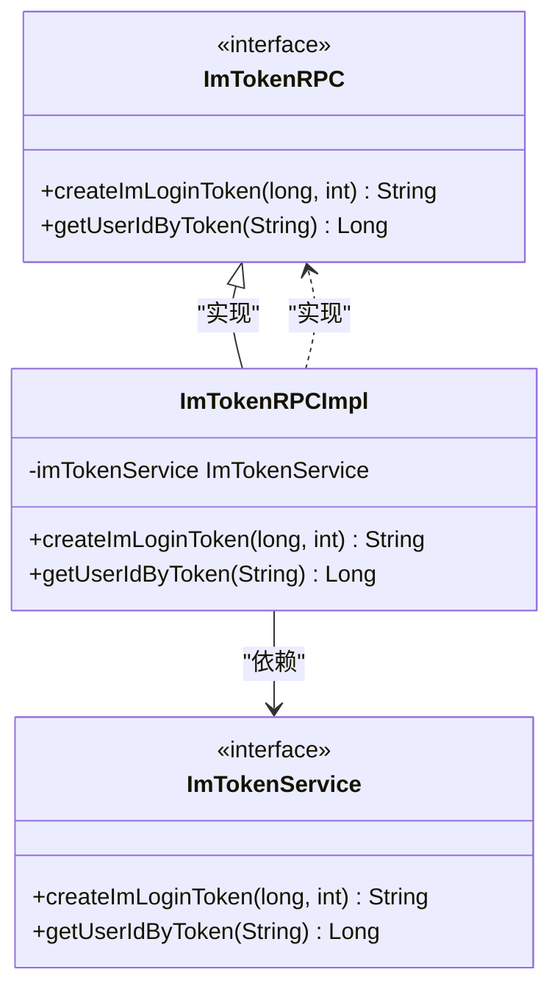

**图示来源**  
- [ImTokenRPC.java](file://live-im-interface/src/main/java/com/logilong/live/im/interfaces/ImTokenRPC.java#L4-L15)
- [ImTokenRPCImpl.java](file://live-im-provider/src/main/java/com/logilong/live/im/provider/rpc/ImTokenRPCImpl.java#L12-L26)

## 通信核心层（im-core-server）

通信核心层基于Netty实现WebSocket长连接管理，负责处理客户端连接、消息收发和连接状态维护。

### WsImServerCoreHandler分析

WsImServerCoreHandler是WebSocket消息的核心处理器，负责接收和分发客户端消息。

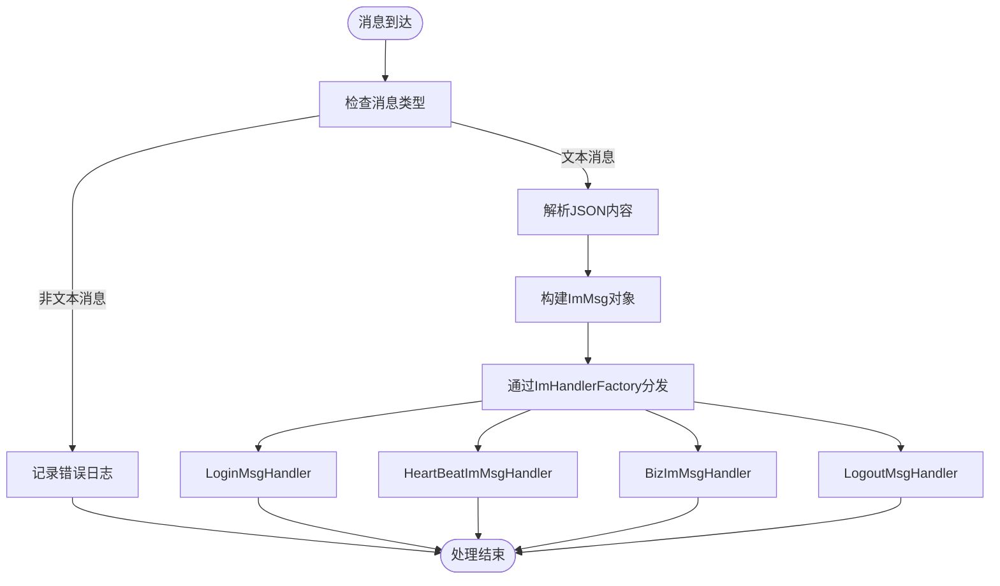

**图示来源**  
- [WsImServerCoreHandler.java](file://live-im-core-server/src/main/java/com/logilong/live/im/core/server/handler/ws/WsImServerCoreHandler.java#L37-L75)

### 连接生命周期管理

系统通过WsShakeHandler和WsImServerCoreHandler协同管理WebSocket连接的整个生命周期。

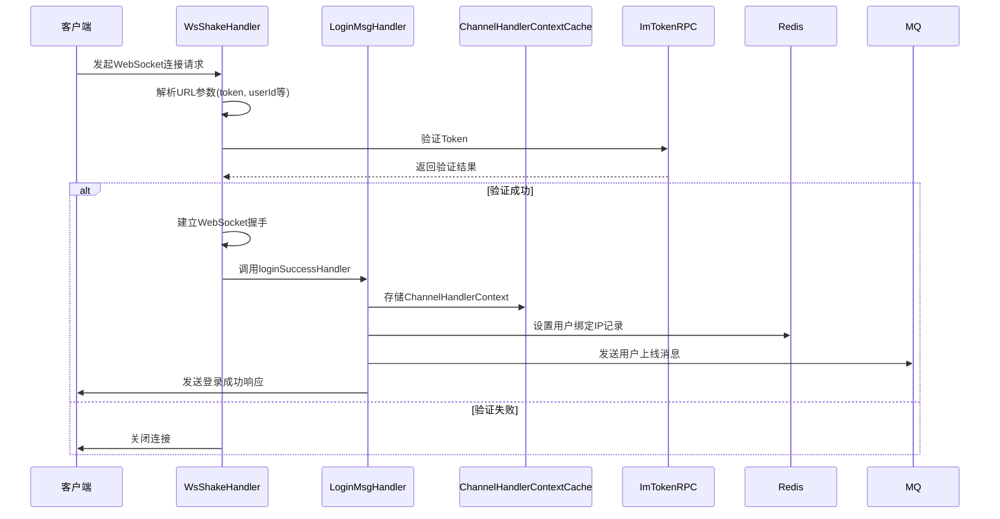

**图示来源**  
- [WsShakeHandler.java](file://live-im-core-server/src/main/java/com/logilong/live/im/core/server/handler/ws/WsShakeHandler.java#L42-L97)
- [LoginMsgHandler.java](file://live-im-core-server/src/main/java/com/logilong/live/im/core/server/handler/impl/LoginMsgHandler.java#L79-L98)

## 消息路由机制

消息路由机制负责将消息从发送方准确传递到接收方，是IM系统的核心功能之一。

### IRouterHandlerRPC接口

IRouterHandlerRPC接口定义了消息路由的核心方法，供路由层调用。

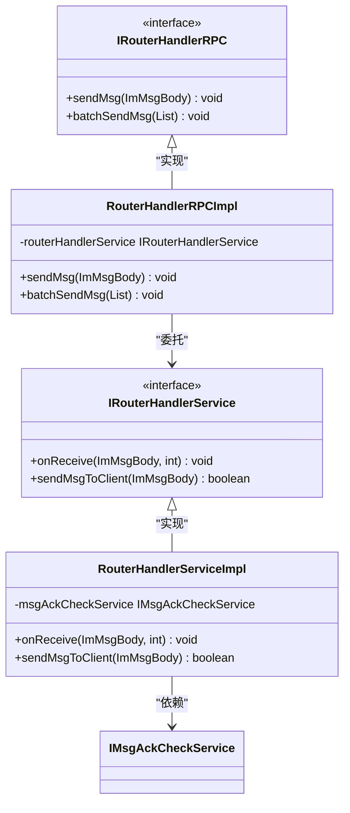

**图示来源**  
- [IRouterHandlerRPC.java](file://live-im-core-server-interfaces/src/main/java/com/logilong/live/im/core/server/interfaces/rpc/IRouterHandlerRPC.java#L11-L22)
- [RouterHandlerRPCImpl.java](file://live-im-core-server/src/main/java/com/logilong/live/im/core/server/rpc/RouterHandlerRPCImpl.java#L12-L28)
- [RouterHandlerServiceImpl.java](file://live-im-core-server/src/main/java/com/logilong/live/im/core/server/service/impl/RouterHandlerServiceImpl.java#L17-L45)

### 消息发送流程

消息发送流程展示了从路由服务到客户端的完整消息传递路径。

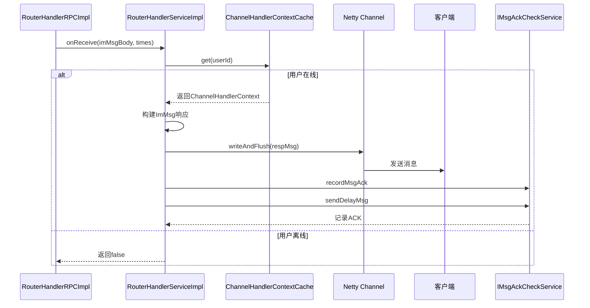

**图示来源**  
- [RouterHandlerRPCImpl.java](file://live-im-core-server/src/main/java/com/logilong/live/im/core/server/rpc/RouterHandlerRPCImpl.java#L18-L26)
- [RouterHandlerServiceImpl.java](file://live-im-core-server/src/main/java/com/logilong/live/im/core/server/service/impl/RouterHandlerServiceImpl.java#L23-L42)

## 在线状态同步与心跳检测

系统通过Redis和心跳机制实现用户在线状态的实时同步和检测。

### 心跳检测机制

心跳检测机制确保系统能够及时感知客户端的连接状态。

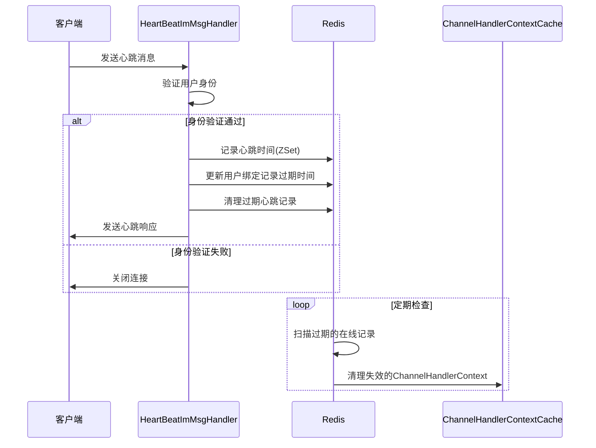

**图示来源**  
- [HeartBeatImMsgHandler.java](file://live-im-core-server/src/main/java/com/logilong/live/im/core/server/handler/impl/HeartBeatImMsgHandler.java#L38-L61)
- [ChannelHandlerContextCache.java](file://live-im-core-server/src/main/java/com/logilong/live/im/core/server/common/ChannelHandlerContextCache.java)

### 在线状态同步

在线状态通过MQ消息实现跨服务的状态同步。

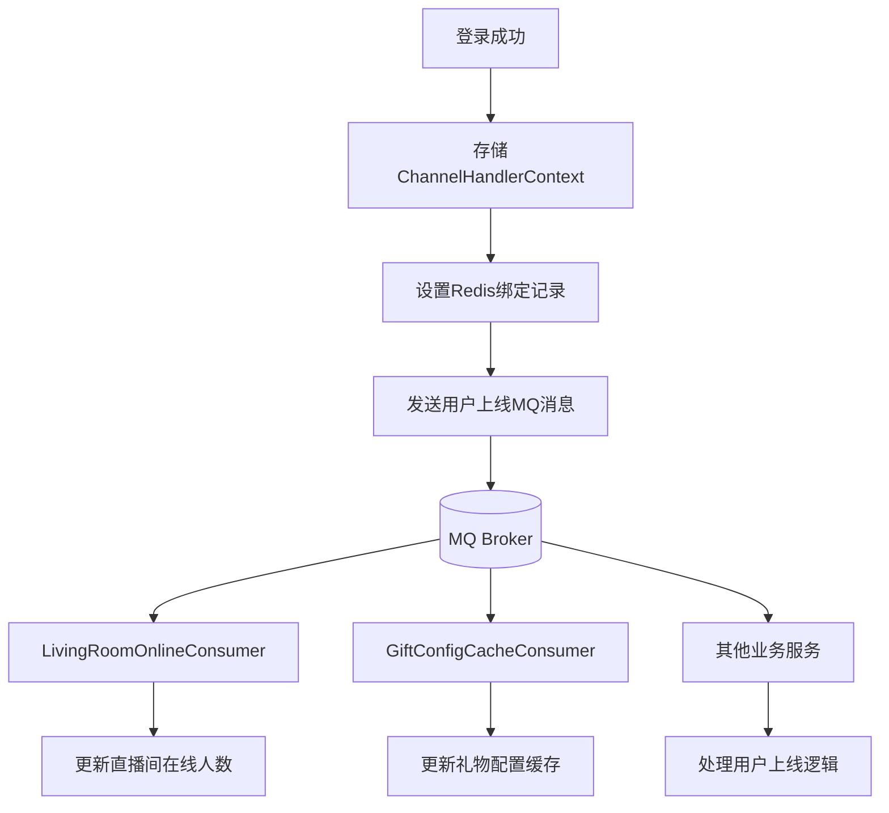

**图示来源**  
- [LoginMsgHandler.java](file://live-im-core-server/src/main/java/com/logilong/live/im/core/server/handler/impl/LoginMsgHandler.java#L98-L118)
- [living-provider/consumer/LivingRoomOnlineConsumer.java](file://live-living-provider/src/main/java/com/logilong/live/living/provider/consumer/LivingRoomOnlineConsumer.java)

## 直播互动中的实时性保障

系统通过多种机制确保直播互动场景下的消息实时性。

### 消息处理流水线

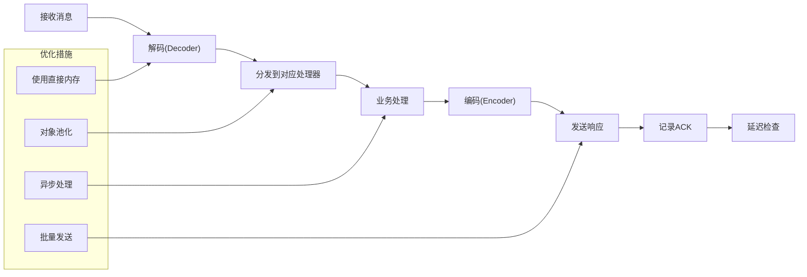

**图示来源**  
- [TcpImMsgDecoder.java](file://live-im-core-server/src/main/java/com/logilong/live/im/core/server/common/TcpImMsgDecoder.java)
- [TcpImMsgEncoder.java](file://live-im-core-server/src/main/java/com/logilong/live/im/core/server/common/TcpImMsgEncoder.java)
- [RouterHandlerServiceImpl.java](file://live-im-core-server/src/main/java/com/logilong/live/im/core/server/service/impl/RouterHandlerServiceImpl.java)

### 实时性优化策略

1. **连接复用**：通过WebSocket长连接避免频繁的TCP握手
2. **消息批量处理**：支持批量发送消息，减少网络开销
3. **异步处理**：非关键操作异步执行，提高响应速度
4. **内存优化**：使用直接内存和对象池减少GC压力
5. **零拷贝**：Netty的零拷贝机制减少数据复制开销

## 海量连接处理能力

系统通过多种技术手段支持海量连接处理。

### 连接管理架构

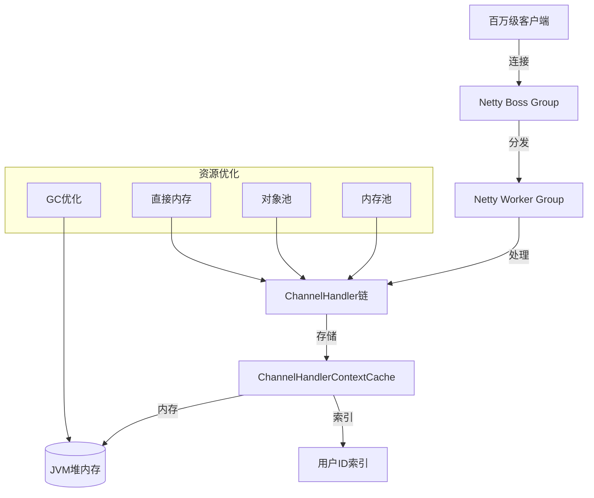

**图示来源**  
- [WsNettyImServerStarter.java](file://live-im-core-server/src/main/java/com/logilong/live/im/core/server/starter/WsNettyImServerStarter.java#L44-L46)
- [ChannelHandlerContextCache.java](file://live-im-core-server/src/main/java/com/logilong/live/im/core/server/common/ChannelHandlerContextCache.java)

### 性能优化措施

- **线程模型优化**：采用Reactor模式，Boss线程负责连接，Worker线程负责读写
- **内存管理**：使用对象池和内存池减少对象创建开销
- **连接复用**：长连接避免频繁的连接建立和断开
- **异步处理**：非阻塞I/O和异步操作提高吞吐量
- **水平扩展**：通过服务注册发现支持集群部署

## 断线重连策略

系统实现了完善的断线重连机制，确保用户体验。

### 断线检测与处理

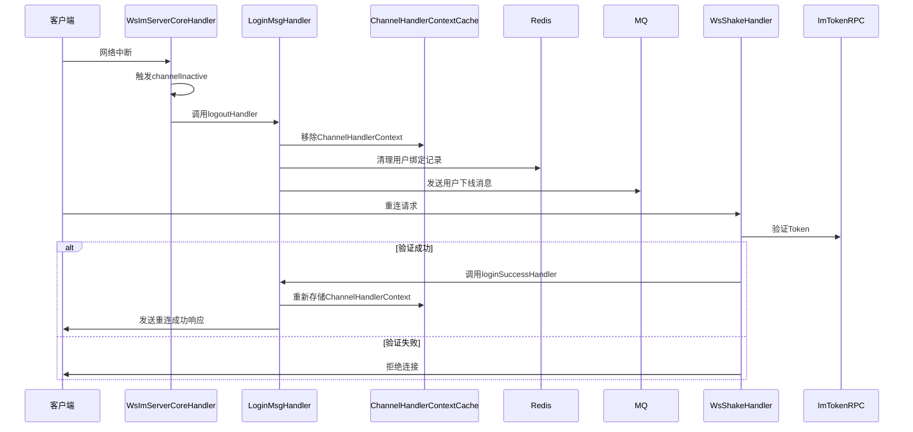

**图示来源**  
- [WsImServerCoreHandler.java](file://live-im-core-server/src/main/java/com/logilong/live/im/core/server/handler/ws/WsImServerCoreHandler.java#L44-L51)
- [LoginMsgHandler.java](file://live-im-core-server/src/main/java/com/logilong/live/im/core/server/handler/impl/LoginMsgHandler.java#L79-L98)
- [WsShakeHandler.java](file://live-im-core-server/src/main/java/com/logilong/live/im/core/server/handler/ws/WsShakeHandler.java#L59-L97)

### 重连策略特点

1. **自动重连**：客户端检测到断线后自动尝试重连
2. **快速恢复**：通过Token验证快速恢复会话状态
3. **消息补偿**：通过ACK机制确保消息不丢失
4. **幂等处理**：防止重复登录导致的状态异常
5. **优雅降级**：在网络不稳定时提供降级方案