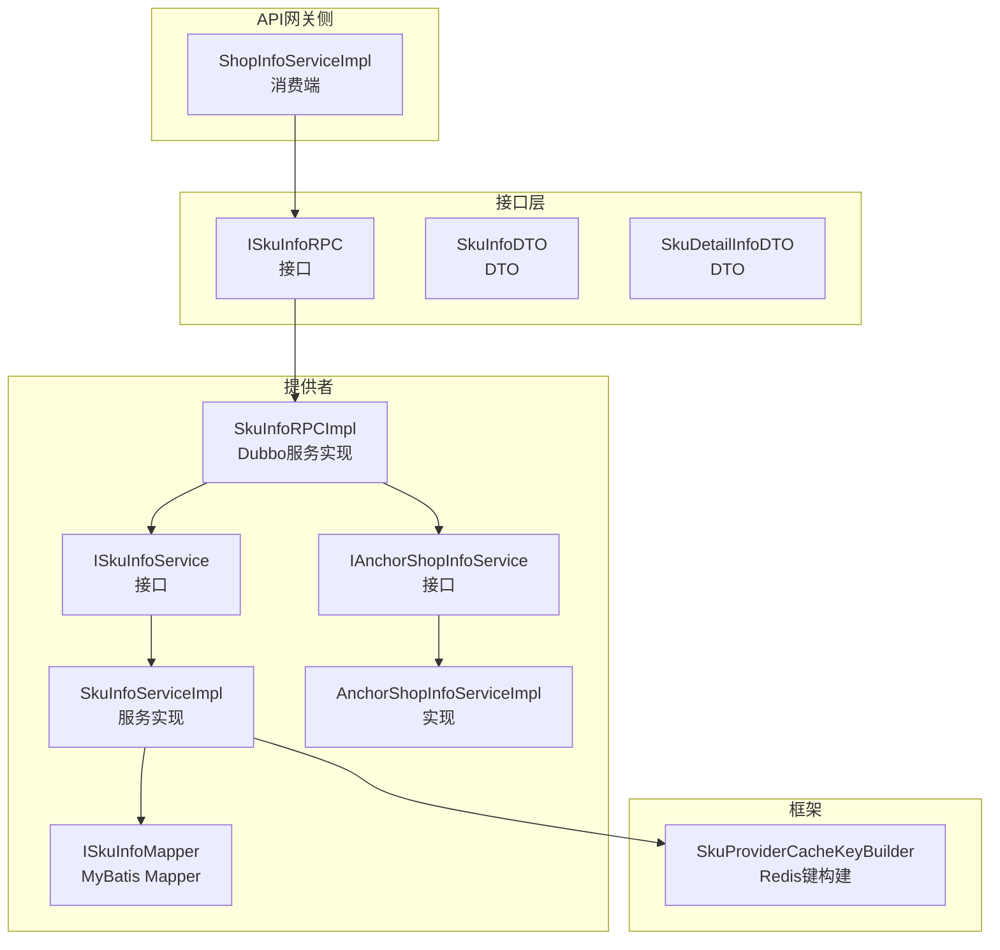
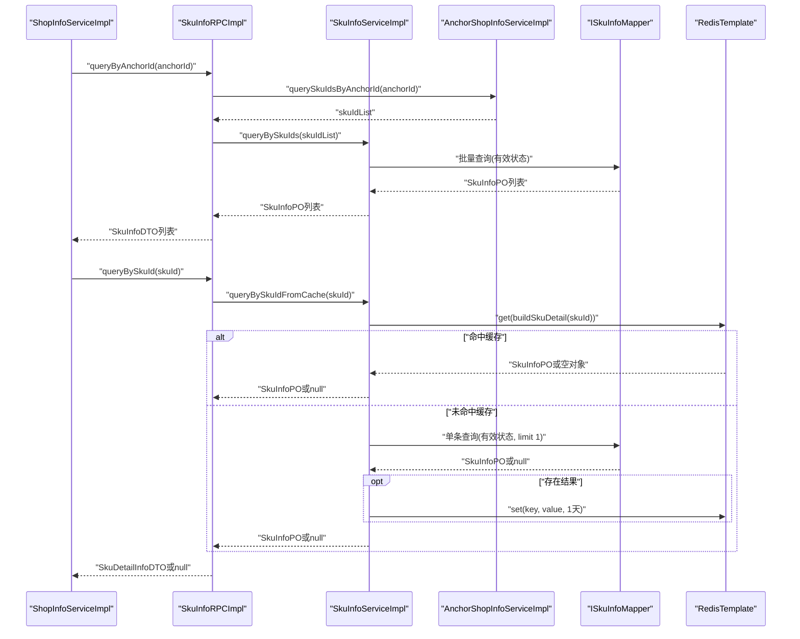
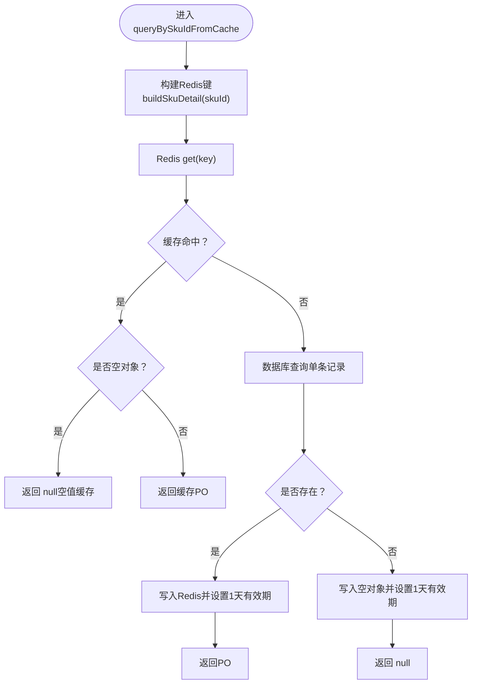
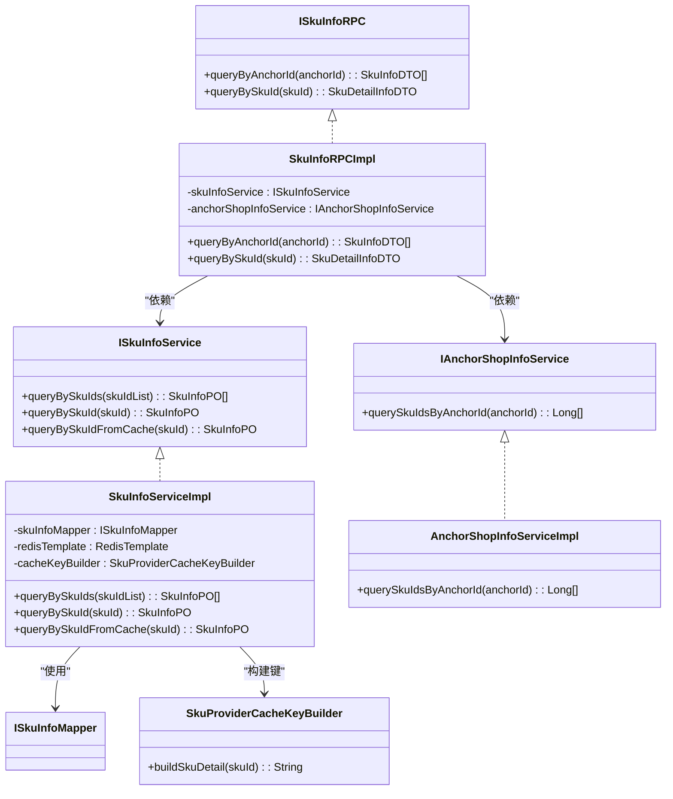

# 商品信息管理

<cite>
**本文引用的文件**
- [ISkuInfoRPC.java](file://live-sku-interface/src/main/java/com/logilong/live/sku/interfaces/ISkuInfoRPC.java)
- [SkuInfoRPCImpl.java](file://live-sku-provider/src/main/java/com/logilong/live/sku/provider/rpc/SkuInfoRPCImpl.java)
- [ISkuInfoService.java](file://live-sku-provider/src/main/java/com/logilong/live/sku/provider/service/ISkuInfoService.java)
- [SkuInfoServiceImpl.java](file://live-sku-provider/src/main/java/com/logilong/live/sku/provider/service/impl/SkuInfoServiceImpl.java)
- [IAnchorShopInfoService.java](file://live-sku-provider/src/main/java/com/logilong/live/sku/provider/service/IAnchorShopInfoService.java)
- [AnchorShopInfoServiceImpl.java](file://live-sku-provider/src/main/java/com/logilong/live/sku/provider/service/impl/AnchorShopInfoServiceImpl.java)
- [ISkuInfoMapper.java](file://live-sku-provider/src/main/java/com/logilong/live/sku/provider/dao/mapper/ISkuInfoMapper.java)
- [SkuProviderCacheKeyBuilder.java](file://live-framework/live-framework-redis-starter/src/main/java/com/logilong/live/framework/redis/starter/key/SkuProviderCacheKeyBuilder.java)
- [ShopInfoServiceImpl.java](file://live-api/src/main/java/com/logilong/live/api/service/impl/ShopInfoServiceImpl.java)
- [SkuInfoReqVO.java](file://live-api/src/main/java/com/logilong/live/api/vo/req/SkuInfoReqVO.java)
- [SkuInfoDTO.java](file://live-sku-interface/src/main/java/com/logilong/live/sku/dto/SkuInfoDTO.java)
- [SkuDetailInfoDTO.java](file://live-sku-interface/src/main/java/com/logilong/live/sku/dto/SkuDetailInfoDTO.java)
</cite>

## 目录
1. [引言](#引言)
2. [项目结构](#项目结构)
3. [核心组件](#核心组件)
4. [架构总览](#架构总览)
5. [详细组件分析](#详细组件分析)
6. [依赖关系分析](#依赖关系分析)
7. [性能考量](#性能考量)
8. [故障排查指南](#故障排查指南)
9. [结论](#结论)
10. [附录](#附录)

## 引言
本文件系统性阐述“商品信息管理”模块的设计与实现，聚焦于ISkuInfoRPC接口中的两个关键方法：按主播查询商品列表（queryByAnchorId）与按单品查询详情（queryBySkuId）。文档将解释SkuInfoRPCImpl如何通过Dubbo服务暴露接口并委托给SkuInfoServiceImpl进行数据处理；深入剖析SkuInfoServiceImpl在queryBySkuIdFromCache中对Redis缓存的构建、空值缓存防穿透机制与有效期管理；并结合“主播商品列表查询”和“单品详情查询”两大典型场景，给出数据访问路径与性能优化建议。

## 项目结构
围绕商品信息管理的关键模块分布如下：
- 接口层（live-sku-interface）：定义对外RPC接口ISkuInfoRPC，以及DTO（SkuInfoDTO、SkuDetailInfoDTO）。
- 提供者（live-sku-provider）：实现RPC与服务层，包含SkuInfoRPCImpl、ISkuInfoService及其实现SkuInfoServiceImpl，以及AnchorShopInfoService相关实现。
- 框架（live-framework）：提供Redis缓存键构建工具SkuProviderCacheKeyBuilder。
- API网关侧（live-api）：消费端调用ISkuInfoRPC，如ShopInfoServiceImpl在直播房间页与商品详情页使用该接口。

图表来源
- [ISkuInfoRPC.java](file://live-sku-interface/src/main/java/com/logilong/live/sku/interfaces/ISkuInfoRPC.java#L1-L22)
- [SkuInfoRPCImpl.java](file://live-sku-provider/src/main/java/com/logilong/live/sku/provider/rpc/SkuInfoRPCImpl.java#L1-L34)
- [ISkuInfoService.java](file://live-sku-provider/src/main/java/com/logilong/live/sku/provider/service/ISkuInfoService.java#L1-L20)
- [SkuInfoServiceImpl.java](file://live-sku-provider/src/main/java/com/logilong/live/sku/provider/service/impl/SkuInfoServiceImpl.java#L1-L67)
- [IAnchorShopInfoService.java](file://live-sku-provider/src/main/java/com/logilong/live/sku/provider/service/IAnchorShopInfoService.java#L1-L17)
- [AnchorShopInfoServiceImpl.java](file://live-sku-provider/src/main/java/com/logilong/live/sku/provider/service/impl/AnchorShopInfoServiceImpl.java#L1-L35)
- [ISkuInfoMapper.java](file://live-sku-provider/src/main/java/com/logilong/live/sku/provider/dao/mapper/ISkuInfoMapper.java#L1-L10)
- [SkuProviderCacheKeyBuilder.java](file://live-framework/live-framework-redis-starter/src/main/java/com/logilong/live/framework/redis/starter/key/SkuProviderCacheKeyBuilder.java#L1-L41)
- [ShopInfoServiceImpl.java](file://live-api/src/main/java/com/logilong/live/api/service/impl/ShopInfoServiceImpl.java#L1-L116)

章节来源
- [ISkuInfoRPC.java](file://live-sku-interface/src/main/java/com/logilong/live/sku/interfaces/ISkuInfoRPC.java#L1-L22)
- [SkuInfoRPCImpl.java](file://live-sku-provider/src/main/java/com/logilong/live/sku/provider/rpc/SkuInfoRPCImpl.java#L1-L34)
- [SkuInfoServiceImpl.java](file://live-sku-provider/src/main/java/com/logilong/live/sku/provider/service/impl/SkuInfoServiceImpl.java#L1-L67)
- [SkuProviderCacheKeyBuilder.java](file://live-framework/live-framework-redis-starter/src/main/java/com/logilong/live/framework/redis/starter/key/SkuProviderCacheKeyBuilder.java#L1-L41)
- [ShopInfoServiceImpl.java](file://live-api/src/main/java/com/logilong/live/api/service/impl/ShopInfoServiceImpl.java#L1-L116)

## 核心组件
- ISkuInfoRPC：对外RPC接口，提供两类能力：
  - queryByAnchorId：按主播ID返回其在售商品列表。
  - queryBySkuId：按单品ID返回商品详情。
- SkuInfoRPCImpl：Dubbo服务实现，负责：
  - 调用IAnchorShopInfoService获取主播的商品SKU列表；
  - 调用ISkuInfoService批量查询商品信息并转换为DTO；
  - 对queryBySkuId调用缓存查询方法并转换为详情DTO。
- ISkuInfoService/SkuInfoServiceImpl：服务层实现，负责：
  - 批量查询（queryBySkuIds）与单条查询（queryBySkuId）；
  - 缓存查询（queryBySkuIdFromCache）：构建Redis键、命中缓存、空值缓存、设置过期时间。
- IAnchorShopInfoService/AnchorShopInfoServiceImpl：提供主播与SKU映射关系，按有效状态过滤。
- SkuProviderCacheKeyBuilder：统一构建Redis键前缀与命名空间，保证键的可维护性与一致性。
- ShopInfoServiceImpl：API侧消费者，分别在“房间商品列表”和“商品详情”场景调用ISkuInfoRPC。

章节来源
- [ISkuInfoRPC.java](file://live-sku-interface/src/main/java/com/logilong/live/sku/interfaces/ISkuInfoRPC.java#L1-L22)
- [SkuInfoRPCImpl.java](file://live-sku-provider/src/main/java/com/logilong/live/sku/provider/rpc/SkuInfoRPCImpl.java#L1-L34)
- [ISkuInfoService.java](file://live-sku-provider/src/main/java/com/logilong/live/sku/provider/service/ISkuInfoService.java#L1-L20)
- [SkuInfoServiceImpl.java](file://live-sku-provider/src/main/java/com/logilong/live/sku/provider/service/impl/SkuInfoServiceImpl.java#L1-L67)
- [IAnchorShopInfoService.java](file://live-sku-provider/src/main/java/com/logilong/live/sku/provider/service/IAnchorShopInfoService.java#L1-L17)
- [AnchorShopInfoServiceImpl.java](file://live-sku-provider/src/main/java/com/logilong/live/sku/provider/service/impl/AnchorShopInfoServiceImpl.java#L1-L35)
- [SkuProviderCacheKeyBuilder.java](file://live-framework/live-framework-redis-starter/src/main/java/com/logilong/live/framework/redis/starter/key/SkuProviderCacheKeyBuilder.java#L1-L41)
- [ShopInfoServiceImpl.java](file://live-api/src/main/java/com/logilong/live/api/service/impl/ShopInfoServiceImpl.java#L1-L116)

## 架构总览
下图展示从API侧到RPC、服务与数据访问的整体链路，以及缓存策略在其中的位置。

图表来源
- [ShopInfoServiceImpl.java](file://live-api/src/main/java/com/logilong/live/api/service/impl/ShopInfoServiceImpl.java#L1-L116)
- [SkuInfoRPCImpl.java](file://live-sku-provider/src/main/java/com/logilong/live/sku/provider/rpc/SkuInfoRPCImpl.java#L1-L34)
- [SkuInfoServiceImpl.java](file://live-sku-provider/src/main/java/com/logilong/live/sku/provider/service/impl/SkuInfoServiceImpl.java#L1-L67)
- [IAnchorShopInfoService.java](file://live-sku-provider/src/main/java/com/logilong/live/sku/provider/service/IAnchorShopInfoService.java#L1-L17)
- [AnchorShopInfoServiceImpl.java](file://live-sku-provider/src/main/java/com/logilong/live/sku/provider/service/impl/AnchorShopInfoServiceImpl.java#L1-L35)
- [ISkuInfoMapper.java](file://live-sku-provider/src/main/java/com/logilong/live/sku/provider/dao/mapper/ISkuInfoMapper.java#L1-L10)
- [SkuProviderCacheKeyBuilder.java](file://live-framework/live-framework-redis-starter/src/main/java/com/logilong/live/framework/redis/starter/key/SkuProviderCacheKeyBuilder.java#L1-L41)

## 详细组件分析

### ISkuInfoRPC接口与方法语义
- queryByAnchorId：输入为主播ID，输出为该主播在售商品列表DTO集合。该方法用于“主播商品列表查询”场景。
- queryBySkuId：输入为单品ID，输出为商品详情DTO。该方法用于“单品详情查询”场景。

章节来源
- [ISkuInfoRPC.java](file://live-sku-interface/src/main/java/com/logilong/live/sku/interfaces/ISkuInfoRPC.java#L1-L22)

### SkuInfoRPCImpl：Dubbo服务暴露与调用链
- 通过注解暴露为Dubbo服务，注入ISkuInfoService与IAnchorShopInfoService。
- queryByAnchorId流程：
  - 先通过IAnchorShopInfoService.querySkuIdsByAnchorId获取主播的有效SKU列表；
  - 再调用ISkuInfoService.queryBySkuIds进行批量查询；
  - 最终通过ConvertBeanUtils将PO转换为DTO返回。
- queryBySkuId流程：
  - 直接调用ISkuInfoService.queryBySkuIdFromCache进行缓存查询；
  - 将返回的PO转换为SkuDetailInfoDTO返回。

章节来源
- [SkuInfoRPCImpl.java](file://live-sku-provider/src/main/java/com/logilong/live/sku/provider/rpc/SkuInfoRPCImpl.java#L1-L34)
- [IAnchorShopInfoService.java](file://live-sku-provider/src/main/java/com/logilong/live/sku/provider/service/IAnchorShopInfoService.java#L1-L17)
- [ISkuInfoService.java](file://live-sku-provider/src/main/java/com/logilong/live/sku/provider/service/ISkuInfoService.java#L1-L20)

### SkuInfoServiceImpl：数据库查询与缓存策略
- 批量查询（queryBySkuIds）：
  - 使用LambdaQueryWrapper按SKU列表与有效状态进行筛选；
  - 返回SkuInfoPO列表。
- 单条查询（queryBySkuId）：
  - 使用LambdaQueryWrapper按SKU与有效状态筛选，并限制只取一条记录；
  - 返回SkuInfoPO或null。
- 缓存查询（queryBySkuIdFromCache）：
  - 键构建：使用SkuProviderCacheKeyBuilder.buildSkuDetail(skuId)生成Redis键；
  - 命中缓存：若缓存存在且非空，则直接返回；
  - 空值缓存：若缓存命中为空对象，则返回null，避免穿透；
  - 未命中缓存：先查数据库，若存在则写入Redis并设置1天有效期；若不存在则写入空对象并设置1天有效期，防止缓存穿透。

图表来源
- [SkuInfoServiceImpl.java](file://live-sku-provider/src/main/java/com/logilong/live/sku/provider/service/impl/SkuInfoServiceImpl.java#L1-L67)
- [SkuProviderCacheKeyBuilder.java](file://live-framework/live-framework-redis-starter/src/main/java/com/logilong/live/framework/redis/starter/key/SkuProviderCacheKeyBuilder.java#L1-L41)

章节来源
- [SkuInfoServiceImpl.java](file://live-sku-provider/src/main/java/com/logilong/live/sku/provider/service/impl/SkuInfoServiceImpl.java#L1-L67)
- [ISkuInfoMapper.java](file://live-sku-provider/src/main/java/com/logilong/live/sku/provider/dao/mapper/ISkuInfoMapper.java#L1-L10)

### IAnchorShopInfoService与AnchorShopInfoServiceImpl：主播与SKU映射
- IAnchorShopInfoService.querySkuIdsByAnchorId：按主播ID与有效状态查询其SKU列表；
- AnchorShopInfoServiceImpl基于Mapper执行查询并返回SKU列表。

章节来源
- [IAnchorShopInfoService.java](file://live-sku-provider/src/main/java/com/logilong/live/sku/provider/service/IAnchorShopInfoService.java#L1-L17)
- [AnchorShopInfoServiceImpl.java](file://live-sku-provider/src/main/java/com/logilong/live/sku/provider/service/impl/AnchorShopInfoServiceImpl.java#L1-L35)

### DTO模型：SkuInfoDTO与SkuDetailInfoDTO
- 两者均包含SKU主键、价格、编码、名称、图标、备注、状态、分类等字段，满足列表与详情的展示需求。
- SkuInfoRPCImpl在不同场景下分别返回SkuInfoDTO或SkuDetailInfoDTO。

章节来源
- [SkuInfoDTO.java](file://live-sku-interface/src/main/java/com/logilong/live/sku/dto/SkuInfoDTO.java#L1-L39)
- [SkuDetailInfoDTO.java](file://live-sku-interface/src/main/java/com/logilong/live/sku/dto/SkuDetailInfoDTO.java#L1-L33)

### API侧消费：ShopInfoServiceImpl
- 在“房间商品列表”场景：通过ISkuInfoRPC.queryByAnchorId获取主播商品列表，并转换为前端VO。
- 在“商品详情”场景：通过ISkuInfoRPC.queryBySkuId获取详情，并转换为前端VO。

章节来源
- [ShopInfoServiceImpl.java](file://live-api/src/main/java/com/logilong/live/api/service/impl/ShopInfoServiceImpl.java#L1-L116)
- [SkuInfoReqVO.java](file://live-api/src/main/java/com/logilong/live/api/vo/req/SkuInfoReqVO.java#L1-L10)

## 依赖关系分析
- 组件耦合与职责分离：
  - 接口层仅定义契约，提供者实现具体逻辑，API侧仅依赖接口；
  - 服务层封装数据访问与缓存策略，降低上层复杂度；
  - 缓存键构建集中化，便于统一管理与扩展。
- 外部依赖：
  - MyBatis-Plus用于ORM与条件构造；
  - Spring Data Redis用于缓存读写；
  - Dubbo用于RPC暴露与消费。

图表来源
- [ISkuInfoRPC.java](file://live-sku-interface/src/main/java/com/logilong/live/sku/interfaces/ISkuInfoRPC.java#L1-L22)
- [SkuInfoRPCImpl.java](file://live-sku-provider/src/main/java/com/logilong/live/sku/provider/rpc/SkuInfoRPCImpl.java#L1-L34)
- [ISkuInfoService.java](file://live-sku-provider/src/main/java/com/logilong/live/sku/provider/service/ISkuInfoService.java#L1-L20)
- [SkuInfoServiceImpl.java](file://live-sku-provider/src/main/java/com/logilong/live/sku/provider/service/impl/SkuInfoServiceImpl.java#L1-L67)
- [IAnchorShopInfoService.java](file://live-sku-provider/src/main/java/com/logilong/live/sku/provider/service/IAnchorShopInfoService.java#L1-L17)
- [AnchorShopInfoServiceImpl.java](file://live-sku-provider/src/main/java/com/logilong/live/sku/provider/service/impl/AnchorShopInfoServiceImpl.java#L1-L35)
- [SkuProviderCacheKeyBuilder.java](file://live-framework/live-framework-redis-starter/src/main/java/com/logilong/live/framework/redis/starter/key/SkuProviderCacheKeyBuilder.java#L1-L41)
- [ISkuInfoMapper.java](file://live-sku-provider/src/main/java/com/logilong/live/sku/provider/dao/mapper/ISkuInfoMapper.java#L1-L10)

## 性能考量
- 批量查询优化：
  - queryBySkuIds采用in条件与状态过滤，减少多次往返；
  - API侧在“房间商品列表”场景通过一次RPC批量获取，避免多次单点查询。
- 缓存命中优先：
  - queryBySkuIdFromCache优先读取Redis，未命中再回源数据库；
  - 空值缓存避免对不存在SKU的重复穿透请求。
- 过期策略：
  - 成功查询与空值均设置1天有效期，平衡一致性与性能。
- 建议优化：
  - 对高频SKU可考虑热点预热；
  - 结合限流与降级策略，防止突发流量冲击；
  - 对列表查询可增加分页参数以控制返回规模。

[本节为通用性能讨论，不直接分析具体文件]

## 故障排查指南
- 现象：queryBySkuId返回null
  - 可能原因：数据库无此SKU或状态无效；缓存命中空对象。
  - 排查步骤：确认SKU状态为有效；检查Redis键是否存在且未过期；核对buildSkuDetail键前缀配置。
- 现象：列表查询为空
  - 可能原因：主播无在售SKU；AnchorShopInfoServiceImpl过滤了无效状态。
  - 排查步骤：确认主播状态与关联关系；检查AnchorShopInfoMapper查询条件。
- 现象：缓存未生效
  - 可能原因：Redis连接异常；键构建不一致；过期时间设置错误。
  - 排查步骤：验证RedisTemplate可用性；核对SkuProviderCacheKeyBuilder构建规则；检查有效期单位与时长。

章节来源
- [SkuInfoServiceImpl.java](file://live-sku-provider/src/main/java/com/logilong/live/sku/provider/service/impl/SkuInfoServiceImpl.java#L1-L67)
- [SkuProviderCacheKeyBuilder.java](file://live-framework/live-framework-redis-starter/src/main/java/com/logilong/live/framework/redis/starter/key/SkuProviderCacheKeyBuilder.java#L1-L41)
- [IAnchorShopInfoService.java](file://live-sku-provider/src/main/java/com/logilong/live/sku/provider/service/IAnchorShopInfoService.java#L1-L17)

## 结论
本模块通过清晰的分层设计与缓存策略，实现了高效稳定的商品信息查询能力。ISkuInfoRPC定义了简洁的业务接口，SkuInfoRPCImpl承担编排职责，SkuInfoServiceImpl集中处理数据库访问与缓存，AnchorShopInfoServiceImpl提供主播-商品映射关系。在“主播商品列表查询”和“单品详情查询”两大场景下，均能以较低延迟返回结果，并通过空值缓存与有效期管理提升整体稳定性与性能。

[本节为总结性内容，不直接分析具体文件]

## 附录
- 关键路径参考
  - 主播商品列表：ShopInfoServiceImpl.queryByRoomId -> ISkuInfoRPC.queryByAnchorId -> SkuInfoRPCImpl.queryByAnchorId -> IAnchorShopInfoService.querySkuIdsByAnchorId -> ISkuInfoService.queryBySkuIds -> ISkuInfoMapper
  - 单品详情：ShopInfoServiceImpl.detail -> ISkuInfoRPC.queryBySkuId -> SkuInfoRPCImpl.queryBySkuId -> ISkuInfoService.queryBySkuIdFromCache -> RedisTemplate -> ISkuInfoMapper

章节来源
- [ShopInfoServiceImpl.java](file://live-api/src/main/java/com/logilong/live/api/service/impl/ShopInfoServiceImpl.java#L1-L116)
- [ISkuInfoRPC.java](file://live-sku-interface/src/main/java/com/logilong/live/sku/interfaces/ISkuInfoRPC.java#L1-L22)
- [SkuInfoRPCImpl.java](file://live-sku-provider/src/main/java/com/logilong/live/sku/provider/rpc/SkuInfoRPCImpl.java#L1-L34)
- [ISkuInfoService.java](file://live-sku-provider/src/main/java/com/logilong/live/sku/provider/service/ISkuInfoService.java#L1-L20)
- [SkuInfoServiceImpl.java](file://live-sku-provider/src/main/java/com/logilong/live/sku/provider/service/impl/SkuInfoServiceImpl.java#L1-L67)
- [IAnchorShopInfoService.java](file://live-sku-provider/src/main/java/com/logilong/live/sku/provider/service/IAnchorShopInfoService.java#L1-L17)
- [ISkuInfoMapper.java](file://live-sku-provider/src/main/java/com/logilong/live/sku/provider/dao/mapper/ISkuInfoMapper.java#L1-L10)