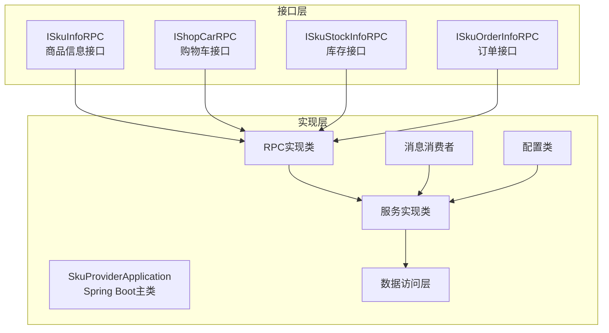
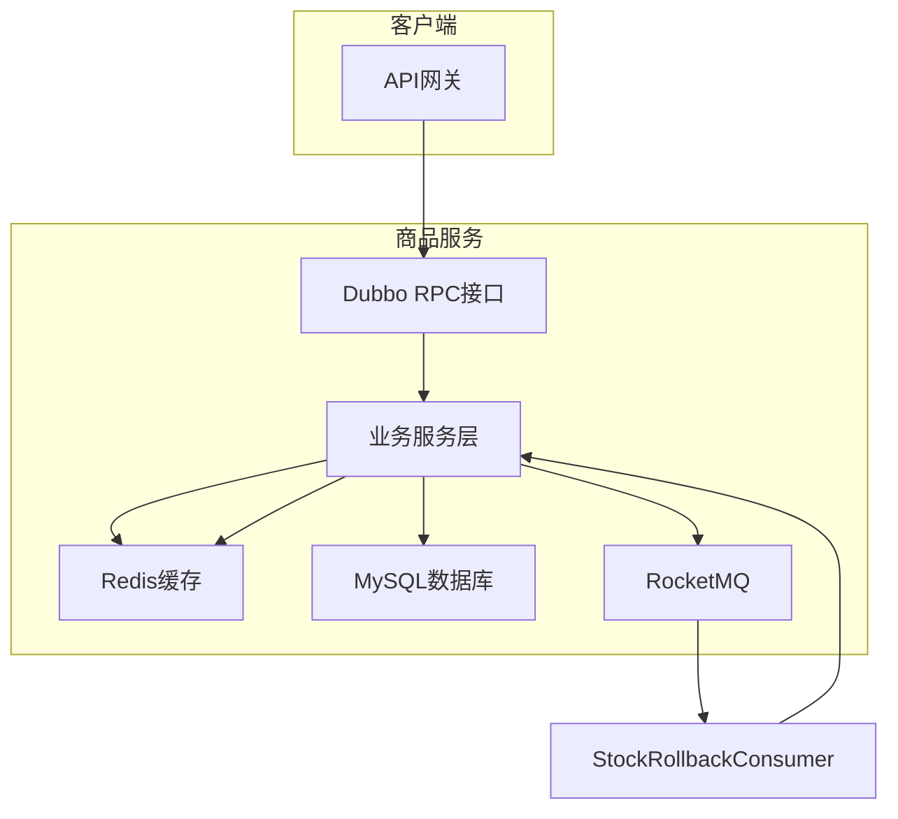
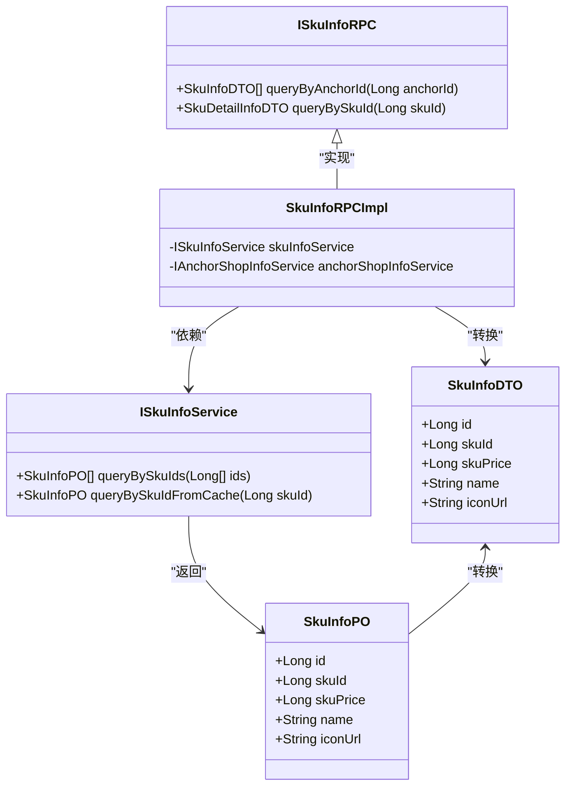
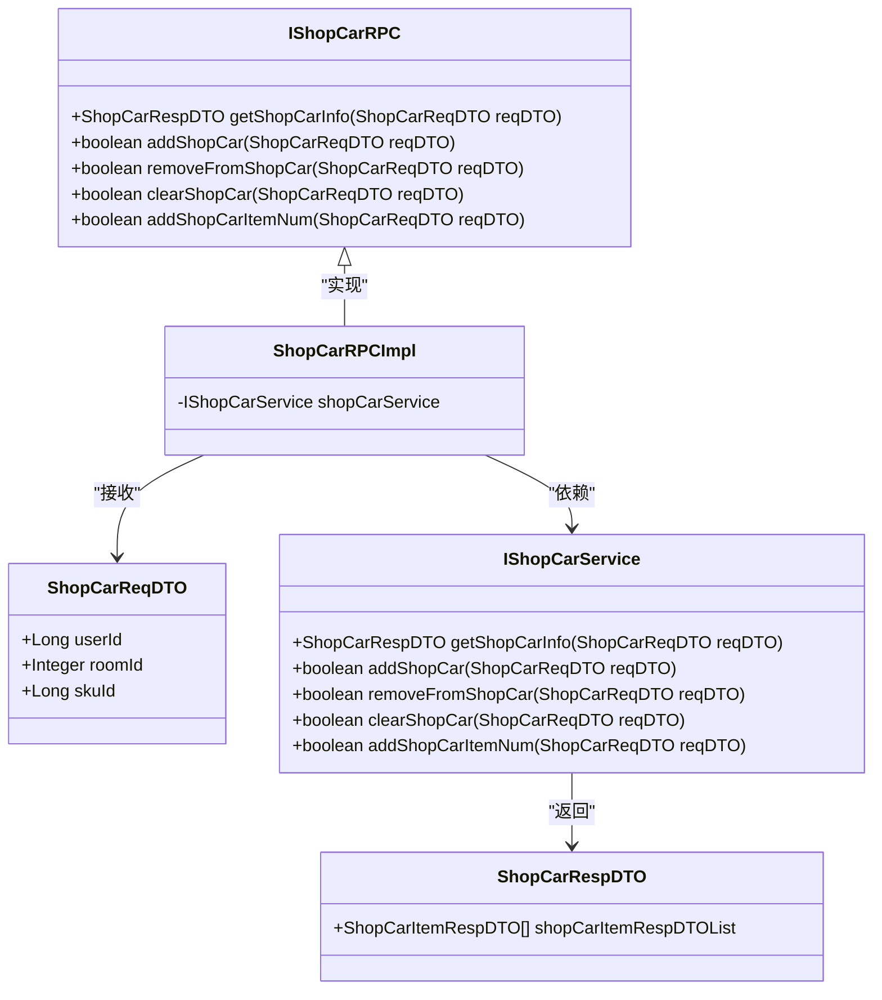
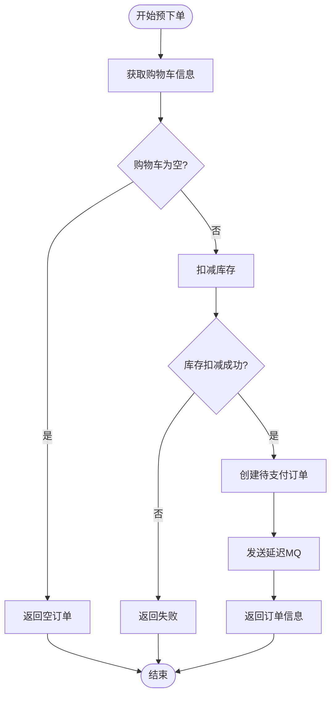
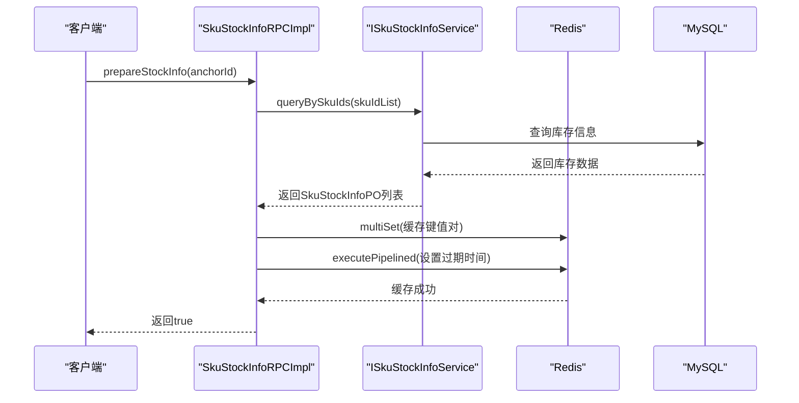

# 商品服务

<cite>
**本文档引用文件**  
- [ISkuInfoRPC.java](file://live-sku-interface/src/main/java/com/logilong/live/sku/interfaces/ISkuInfoRPC.java)
- [IShopCarRPC.java](file://live-sku-interface/src/main/java/com/logilong/live/sku/interfaces/IShopCarRPC.java)
- [ISkuStockInfoRPC.java](file://live-sku-interface/src/main/java/com/logilong/live/sku/interfaces/ISkuStockInfoRPC.java)
- [ISkuOrderInfoRPC.java](file://live-sku-interface/src/main/java/com/logilong/live/sku/interfaces/ISkuOrderInfoRPC.java)
- [SkuProviderApplication.java](file://live-sku-provider/src/main/java/com/logilong/live/sku/provider/SkuProviderApplication.java)
- [StockRollbackConsumer.java](file://live-sku-provider/src/main/java/com/logilong/live/sku/provider/consumer/StockRollbackConsumer.java)
- [RefreshSkuStockNumJob.java](file://live-sku-provider/src/main/java/com/logilong/live/sku/provider/config/RefreshSkuStockNumJob.java)
- [SkuInfoRPCImpl.java](file://live-sku-provider/src/main/java/com/logilong/live/sku/provider/rpc/SkuInfoRPCImpl.java)
- [ShopCarRPCImpl.java](file://live-sku-provider/src/main/java/com/logilong/live/sku/provider/rpc/ShopCarRPCImpl.java)
- [SkuStockInfoRPCImpl.java](file://live-sku-provider/src/main/java/com/logilong/live/sku/provider/rpc/SkuStockInfoRPCImpl.java)
- [SkuOrderInfoRPCImpl.java](file://live-sku-provider/src/main/java/com/logilong/live/sku/provider/rpc/SkuOrderInfoRPCImpl.java)
- [SkuInfoDTO.java](file://live-sku-interface/src/main/java/com/logilong/live/sku/dto/SkuInfoDTO.java)
- [ShopCarReqDTO.java](file://live-sku-interface/src/main/java/com/logilong/live/sku/dto/ShopCarReqDTO.java)
- [SkuStockInfoDTO.java](file://live-sku-interface/src/main/java/com/logilong/live/sku/dto/SkuStockInfoDTO.java)
</cite>

## 目录
1. [简介](#简介)
2. [项目结构](#项目结构)
3. [核心组件](#核心组件)
4. [架构概述](#架构概述)
5. [详细组件分析](#详细组件分析)
6. [依赖分析](#依赖分析)
7. [性能考量](#性能考量)
8. [故障排查指南](#故障排查指南)
9. [结论](#结论)

## 简介
商品服务是直播平台的核心模块之一，负责管理商品信息、购物车、订单准备和库存四大核心功能。该服务通过Dubbo RPC接口对外提供服务，集成MyBatis-Plus与Redis实现高效数据访问，并采用RocketMQ处理分布式事务场景下的库存回滚。服务设计充分考虑了秒杀、拼团等高并发场景的需求，通过Redis缓存预热、Lua脚本原子操作和定时任务同步等机制保障系统稳定性和数据一致性。

## 项目结构
商品服务采用典型的微服务架构，分为接口层（live-sku-interface）和实现层（live-sku-provider）。接口层定义了Dubbo RPC服务契约，实现层包含业务逻辑、数据访问和定时任务等组件。

**图示来源**
- [ISkuInfoRPC.java](file://live-sku-interface/src/main/java/com/logilong/live/sku/interfaces/ISkuInfoRPC.java)
- [IShopCarRPC.java](file://live-sku-interface/src/main/java/com/logilong/live/sku/interfaces/IShopCarRPC.java)
- [ISkuStockInfoRPC.java](file://live-sku-interface/src/main/java/com/logilong/live/sku/interfaces/ISkuStockInfoRPC.java)
- [ISkuOrderInfoRPC.java](file://live-sku-interface/src/main/java/com/logilong/live/sku/interfaces/ISkuOrderInfoRPC.java)
- [SkuProviderApplication.java](file://live-sku-provider/src/main/java/com/logilong/live/sku/provider/SkuProviderApplication.java)

**本节来源**
- [live-sku-interface](file://live-sku-interface)
- [live-sku-provider](file://live-sku-provider)

## 核心组件
商品服务的核心组件包括商品信息（SkuInfo）、购物车（ShopCar）、订单准备（PrepareOrder）与库存管理（SkuStockInfo）四大模块。这些模块通过Dubbo RPC接口暴露服务，由SkuProviderApplication统一启动和管理。服务采用MyBatis-Plus进行数据库操作，利用Redis实现高性能缓存，并通过RocketMQ处理异步消息和分布式事务。

**本节来源**
- [SkuProviderApplication.java](file://live-sku-provider/src/main/java/com/logilong/live/sku/provider/SkuProviderApplication.java)
- [ISkuInfoRPC.java](file://live-sku-interface/src/main/java/com/logilong/live/sku/interfaces/ISkuInfoRPC.java)
- [IShopCarRPC.java](file://live-sku-interface/src/main/java/com/logilong/live/sku/interfaces/IShopCarRPC.java)
- [ISkuStockInfoRPC.java](file://live-sku-interface/src/main/java/com/logilong/live/sku/interfaces/ISkuStockInfoRPC.java)
- [ISkuOrderInfoRPC.java](file://live-sku-interface/src/main/java/com/logilong/live/sku/interfaces/ISkuOrderInfoRPC.java)

## 架构概述
商品服务采用分层架构设计，自上而下分为接口层、业务逻辑层和数据访问层。服务通过Dubbo框架实现远程过程调用，使用Spring Boot作为基础框架，集成Nacos进行服务发现，Redis作为缓存中间件，MySQL作为持久化存储，RocketMQ处理异步消息。

**图示来源**
- [SkuProviderApplication.java](file://live-sku-provider/src/main/java/com/logilong/live/sku/provider/SkuProviderApplication.java)
- [SkuInfoRPCImpl.java](file://live-sku-provider/src/main/java/com/logilong/live/sku/provider/rpc/SkuInfoRPCImpl.java)
- [ShopCarRPCImpl.java](file://live-sku-provider/src/main/java/com/logilong/live/sku/provider/rpc/ShopCarRPCImpl.java)
- [SkuStockInfoRPCImpl.java](file://live-sku-provider/src/main/java/com/logilong/live/sku/provider/rpc/SkuStockInfoRPCImpl.java)
- [SkuOrderInfoRPCImpl.java](file://live-sku-provider/src/main/java/com/logilong/live/sku/provider/rpc/SkuOrderInfoRPCImpl.java)

## 详细组件分析

### 商品信息模块分析
商品信息模块负责管理商品的基本信息，包括价格、名称、图片等。该模块通过ISkuInfoRPC接口对外提供服务，支持根据主播ID查询商品列表和根据商品ID查询商品详情。

#### 对象关系图

**图示来源**
- [ISkuInfoRPC.java](file://live-sku-interface/src/main/java/com/logilong/live/sku/interfaces/ISkuInfoRPC.java)
- [SkuInfoRPCImpl.java](file://live-sku-provider/src/main/java/com/logilong/live/sku/provider/rpc/SkuInfoRPCImpl.java)
- [SkuInfoDTO.java](file://live-sku-interface/src/main/java/com/logilong/live/sku/dto/SkuInfoDTO.java)

**本节来源**
- [ISkuInfoRPC.java](file://live-sku-interface/src/main/java/com/logilong/live/sku/interfaces/ISkuInfoRPC.java)
- [SkuInfoRPCImpl.java](file://live-sku-provider/src/main/java/com/logilong/live/sku/provider/rpc/SkuInfoRPCImpl.java)
- [SkuInfoDTO.java](file://live-sku-interface/src/main/java/com/logilong/live/sku/dto/SkuInfoDTO.java)

### 购物车模块分析
购物车模块管理用户的购物车信息，支持添加、删除、修改商品数量和清空购物车等操作。该模块通过IShopCarRPC接口对外提供服务，由ShopCarRPCImpl实现具体逻辑。

#### 对象关系图

**图示来源**
- [IShopCarRPC.java](file://live-sku-interface/src/main/java/com/logilong/live/sku/interfaces/IShopCarRPC.java)
- [ShopCarRPCImpl.java](file://live-sku-provider/src/main/java/com/logilong/live/sku/provider/rpc/ShopCarRPCImpl.java)
- [ShopCarReqDTO.java](file://live-sku-interface/src/main/java/com/logilong/live/sku/dto/ShopCarReqDTO.java)

**本节来源**
- [IShopCarRPC.java](file://live-sku-interface/src/main/java/com/logilong/live/sku/interfaces/IShopCarRPC.java)
- [ShopCarRPCImpl.java](file://live-sku-provider/src/main/java/com/logilong/live/sku/provider/rpc/ShopCarRPCImpl.java)
- [ShopCarReqDTO.java](file://live-sku-interface/src/main/java/com/logilong/live/sku/dto/ShopCarReqDTO.java)

### 订单准备模块分析
订单准备模块处理预下单逻辑，包括库存扣减、订单创建和延迟消息发送。该模块通过ISkuOrderInfoRPC接口的prepareOrder方法实现，采用分布式事务机制确保数据一致性。

#### 流程图

**图示来源**
- [SkuOrderInfoRPCImpl.java](file://live-sku-provider/src/main/java/com/logilong/live/sku/provider/rpc/SkuOrderInfoRPCImpl.java)

**本节来源**
- [SkuOrderInfoRPCImpl.java](file://live-sku-provider/src/main/java/com/logilong/live/sku/provider/rpc/SkuOrderInfoRPCImpl.java)

### 库存管理模块分析
库存管理模块是商品服务的核心，负责库存的查询、扣减、回滚和同步。该模块通过ISkuStockInfoRPC接口提供服务，采用Redis缓存预热和定时任务同步机制，确保高并发场景下的性能和数据一致性。

#### 序列图

**图示来源**
- [SkuStockInfoRPCImpl.java](file://live-sku-provider/src/main/java/com/logilong/live/sku/provider/rpc/SkuStockInfoRPCImpl.java)
- [ISkuStockInfoRPC.java](file://live-sku-interface/src/main/java/com/logilong/live/sku/interfaces/ISkuStockInfoRPC.java)

**本节来源**
- [SkuStockInfoRPCImpl.java](file://live-sku-provider/src/main/java/com/logilong/live/sku/provider/rpc/SkuStockInfoRPCImpl.java)
- [ISkuStockInfoRPC.java](file://live-sku-interface/src/main/java/com/logilong/live/sku/interfaces/ISkuStockInfoRPC.java)

## 依赖分析
商品服务依赖于多个外部组件和内部服务，形成了复杂但清晰的依赖关系网络。服务通过Dubbo框架暴露RPC接口，依赖Redis进行缓存操作，使用RocketMQ处理异步消息，通过MyBatis-Plus访问MySQL数据库。

```mermaid
graph TD
SkuProviderApp["SkuProviderApplication"] --> Dubbo["@EnableDubbo"]
SkuProviderApp --> Nacos["@EnableDiscoveryClient"]
SkuProviderApp --> SpringBoot["@SpringBootApplication"]
SkuInfoRPCImpl --> ISkuInfoService
ShopCarRPCImpl --> IShopCarService
SkuStockInfoRPCImpl --> ISkuStockInfoService
SkuOrderInfoRPCImpl --> ISkuOrderInfoService
SkuOrderInfoRPCImpl --> ILiveCurrencyAccountRPC
SkuOrderInfoRPCImpl --> MQProducer
StockRollbackConsumer --> RocketMQConsumerProperties
StockRollbackConsumer --> ISkuStockInfoService
RefreshSkuStockNumJob --> ISkuStockInfoRPC
RefreshSkuStockNumJob --> IAnchorShopInfoService
RefreshSkuStockNumJob --> RedisTemplate
RefreshSkuStockNumJob --> SkuProviderCacheKeyBuilder
```

**图示来源**
- [SkuProviderApplication.java](file://live-sku-provider/src/main/java/com/logilong/live/sku/provider/SkuProviderApplication.java)
- [SkuInfoRPCImpl.java](file://live-sku-provider/src/main/java/com/logilong/live/sku/provider/rpc/SkuInfoRPCImpl.java)
- [ShopCarRPCImpl.java](file://live-sku-provider/src/main/java/com/logilong/live/sku/provider/rpc/ShopCarRPCImpl.java)
- [SkuStockInfoRPCImpl.java](file://live-sku-provider/src/main/java/com/logilong/live/sku/provider/rpc/SkuStockInfoRPCImpl.java)
- [SkuOrderInfoRPCImpl.java](file://live-sku-provider/src/main/java/com/logilong/live/sku/provider/rpc/SkuOrderInfoRPCImpl.java)
- [StockRollbackConsumer.java](file://live-sku-provider/src/main/java/com/logilong/live/sku/provider/consumer/StockRollbackConsumer.java)
- [RefreshSkuStockNumJob.java](file://live-sku-provider/src/main/java/com/logilong/live/sku/provider/config/RefreshSkuStockNumJob.java)

**本节来源**
- [SkuProviderApplication.java](file://live-sku-provider/src/main/java/com/logilong/live/sku/provider/SkuProviderApplication.java)
- [SkuInfoRPCImpl.java](file://live-sku-provider/src/main/java/com/logilong/live/sku/provider/rpc/SkuInfoRPCImpl.java)
- [ShopCarRPCImpl.java](file://live-sku-provider/src/main/java/com/logilong/live/sku/provider/rpc/ShopCarRPCImpl.java)
- [SkuStockInfoRPCImpl.java](file://live-sku-provider/src/main/java/com/logilong/live/sku/provider/rpc/SkuStockInfoRPCImpl.java)
- [SkuOrderInfoRPCImpl.java](file://live-sku-provider/src/main/java/com/logilong/live/sku/provider/rpc/SkuOrderInfoRPCImpl.java)
- [StockRollbackConsumer.java](file://live-sku-provider/src/main/java/com/logilong/live/sku/provider/consumer/StockRollbackConsumer.java)
- [RefreshSkuStockNumJob.java](file://live-sku-provider/src/main/java/com/logilong/live/sku/provider/config/RefreshSkuStockNumJob.java)

## 性能考量
商品服务在设计时充分考虑了高并发场景下的性能需求。通过Redis缓存预热机制，将商品库存信息从MySQL加载到Redis中，避免了高并发查询对数据库的直接冲击。库存扣减操作采用Lua脚本保证原子性，防止超卖问题。定时任务RefreshSkuStockNumJob通过分布式锁机制确保在集群环境下只有一个节点执行同步操作，避免了重复同步带来的性能浪费。对于秒杀、拼团等极端高并发场景，服务通过RocketMQ延迟消息实现库存回滚，既保证了事务的最终一致性，又避免了长时间持有数据库连接。

## 故障排查指南
当商品服务出现异常时，可按照以下步骤进行排查：
1. 检查SkuProviderApplication是否正常启动，确认Dubbo服务已注册到注册中心
2. 查看Redis连接是否正常，确认缓存预热任务prepareStockInfo是否成功执行
3. 检查RocketMQ生产者和消费者是否正常工作，特别是StockRollbackConsumer的消费情况
4. 查看定时任务RefreshSkuStockNumJob的日志，确认库存同步是否正常
5. 检查数据库连接池配置，确保在高并发场景下有足够的连接资源
6. 监控关键接口的响应时间和错误率，特别是库存扣减和订单创建接口

**本节来源**
- [SkuProviderApplication.java](file://live-sku-provider/src/main/java/com/logilong/live/sku/provider/SkuProviderApplication.java)
- [StockRollbackConsumer.java](file://live-sku-provider/src/main/java/com/logilong/live/sku/provider/consumer/StockRollbackConsumer.java)
- [RefreshSkuStockNumJob.java](file://live-sku-provider/src/main/java/com/logilong/live/sku/provider/config/RefreshSkuStockNumJob.java)

## 结论
商品服务通过合理的架构设计和技术创新，成功解决了直播电商平台在高并发场景下的核心挑战。服务采用Dubbo RPC实现服务化，利用Redis缓存提升性能，通过RocketMQ处理分布式事务，形成了一个高性能、高可用的系统。库存管理模块的预热、扣减、回滚和同步机制设计完善，能够有效应对秒杀、拼团等极端场景。未来可进一步优化的方向包括引入分库分表解决单表数据量过大的问题，以及采用更先进的分布式事务解决方案如Seata来简化事务管理。