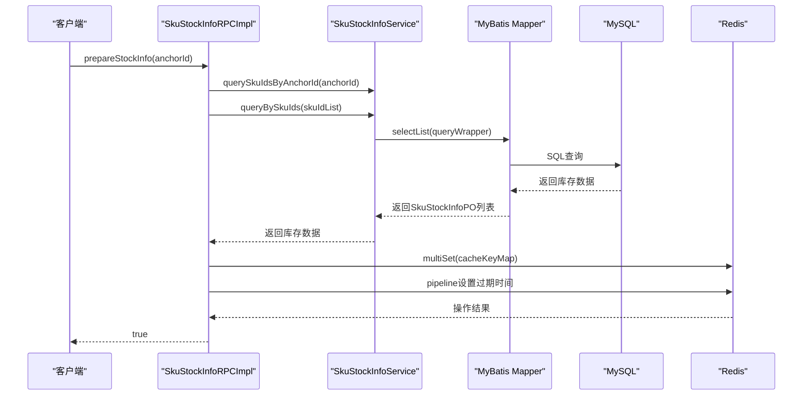
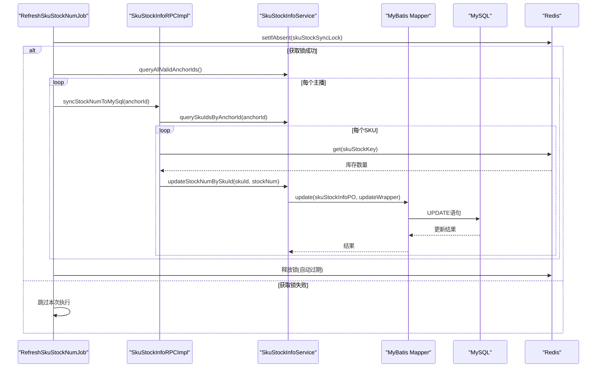
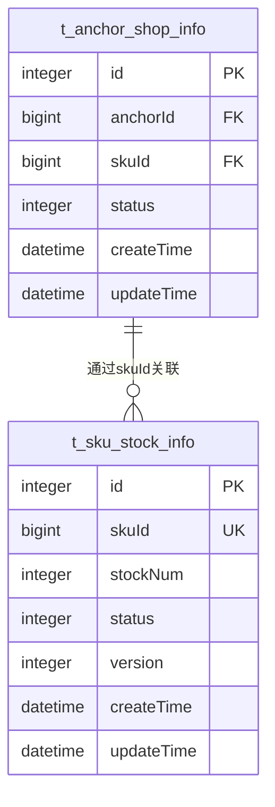
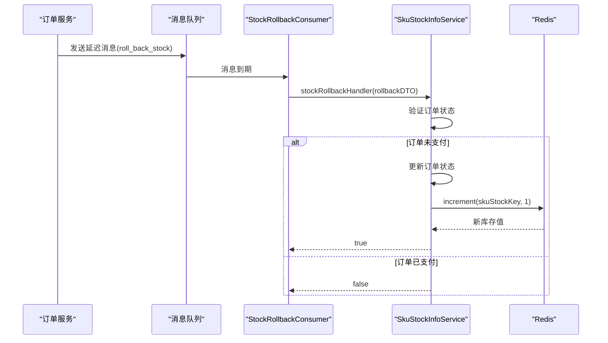

# 库存同步机制

<cite>
**本文档引用文件**  
- [ISkuStockInfoRPC.java](file://live-sku-interface/src/main/java/com/logilong/live/sku/interfaces/ISkuStockInfoRPC.java)
- [SkuStockInfoRPCImpl.java](file://live-sku-provider/src/main/java/com/logilong/live/sku/provider/rpc/SkuStockInfoRPCImpl.java)
- [SkuStockInfoServiceImpl.java](file://live-sku-provider/src/main/java/com/logilong/live/sku/provider/service/impl/SkuStockInfoServiceImpl.java)
- [RefreshSkuStockNumJob.java](file://live-sku-provider/src/main/java/com/logilong/live/sku/provider/config/RefreshSkuStockNumJob.java)
- [IAnchorShopInfoService.java](file://live-sku-provider/src/main/java/com/logilong/live/sku/provider/service/IAnchorShopInfoService.java)
- [AnchorShopInfoServiceImpl.java](file://live-sku-provider/src/main/java/com/logilong/live/sku/provider/service/impl/AnchorShopInfoServiceImpl.java)
- [AnchorShopInfoPO.java](file://live-sku-provider/src/main/java/com/logilong/live/sku/provider/dao/po/AnchorShopInfoPO.java)
- [SkuStockInfoPO.java](file://live-sku-provider/src/main/java/com/logilong/live/sku/provider/dao/po/SkuStockInfoPO.java)
- [StockRollbackConsumer.java](file://live-sku-provider/src/main/java/com/logilong/live/sku/provider/consumer/StockRollbackConsumer.java)
</cite>

## 目录
1. [库存数据双向同步机制概述](#库存数据双向同步机制概述)
2. [MySQL到Redis的库存预热机制](#mysql到redis的库存预热机制)
3. [Redis到MySQL的库存回写机制](#redis到mysql的库存回写机制)
4. [主播商品关联查询机制](#主播商品关联查询机制)
5. [库存回滚机制](#库存回滚机制)
6. [直播带货场景下的业务意义](#直播带货场景下的业务意义)

## 库存数据双向同步机制概述

本系统采用Redis与MySQL双写机制实现库存数据的高效管理。通过`prepareStockInfo`接口将MySQL中的库存数据批量预热至Redis缓存，利用Redis的高性能读写能力应对直播带货场景下的高并发访问。同时，通过`syncStockNumToMySql`定时任务将Redis中变更的库存数据回写到MySQL数据库，确保数据的最终一致性。

该双向同步机制在保证系统高性能的同时，也确保了数据的持久化和可靠性，是直播电商系统中应对高并发库存操作的核心设计。

**文档来源**
- [ISkuStockInfoRPC.java](file://live-sku-interface/src/main/java/com/logilong/live/sku/interfaces/ISkuStockInfoRPC.java)
- [SkuStockInfoRPCImpl.java](file://live-sku-provider/src/main/java/com/logilong/live/sku/provider/rpc/SkuStockInfoRPCImpl.java)

## MySQL到Redis的库存预热机制

`prepareStockInfo`接口负责将MySQL中的库存数据预热到Redis缓存中。该接口首先通过`IAnchorShopInfoService.querySkuIdsByAnchorId`方法获取指定主播关联的所有商品SKU ID列表，然后调用`ISkuStockInfoService.queryBySkuIds`批量查询这些商品的库存信息。

为了提升性能，系统采用了`multiSet`批量操作将库存数据写入Redis，并使用pipeline技术批量设置过期时间。具体实现中，首先将查询到的库存数据转换为`Map<String, Integer>`格式，其中key为通过`SkuProviderCacheKeyBuilder.buildSkuStock`生成的缓存键，value为库存数量。然后调用`redisTemplate.opsForValue().multiSet()`一次性写入所有数据，最后通过`redisTemplate.executePipelined()`执行pipeline操作，批量为所有缓存键设置1天的过期时间。

这种批量操作方式显著减少了网络往返次数，提高了预热效率，确保在直播开始前能够快速完成库存数据的加载。

**图示来源**
- [SkuStockInfoRPCImpl.java](file://live-sku-provider/src/main/java/com/logilong/live/sku/provider/rpc/SkuStockInfoRPCImpl.java#L60-L83)
- [SkuStockInfoServiceImpl.java](file://live-sku-provider/src/main/java/com/logilong/live/sku/provider/service/impl/SkuStockInfoServiceImpl.java#L69-L75)

## Redis到MySQL的库存回写机制

`syncStockNumToMySql`定时任务负责将Redis中变更的库存数据回写到MySQL数据库。该任务由`RefreshSkuStockNumJob`配置类中的`ScheduledThreadPoolExecutor`驱动，每隔1秒执行一次（首次延迟3秒）。

为避免在分布式部署环境下多个节点同时执行该任务，系统采用了分布式锁机制。任务执行前会尝试获取由`SkuProviderCacheKeyBuilder.buildSkuStockSyncLock()`生成的锁，只有获取锁成功的节点才能执行回写操作。

回写流程首先调用`IAnchorShopInfoService.queryAllValidAnchorIds()`获取所有有效主播ID，然后遍历每个主播，获取其关联的所有SKU ID，再通过`queryStockNum`从Redis中查询当前库存数量，最后调用`ISkuStockInfoService.updateStockNumBySkuId`将库存数据更新到MySQL数据库。

**图示来源**
- [RefreshSkuStockNumJob.java](file://live-sku-provider/src/main/java/com/logilong/live/sku/provider/config/RefreshSkuStockNumJob.java#L17-L65)
- [SkuStockInfoRPCImpl.java](file://live-sku-provider/src/main/java/com/logilong/live/sku/provider/rpc/SkuStockInfoRPCImpl.java#L92-L102)

## 主播商品关联查询机制

`AnchorShopInfoService.querySkuIdsByAnchorId`是库存同步机制中的关键数据源查询方法。该方法通过查询`t_anchor_shop_info`数据库表获取指定主播关联的所有商品SKU ID列表。

`t_anchor_shop_info`表是一个关联表，包含`anchorId`（主播ID）、`skuId`（商品SKU ID）和`status`（状态）字段。系统通过`IAnchorShopInfoMapper`使用MyBatis Plus的`LambdaQueryWrapper`构建查询条件，筛选出指定主播ID且状态为有效的记录，并仅选择`skuId`字段以提高查询效率。

该查询机制实现了主播与商品的灵活关联，支持一个主播带多个商品，也为库存预热和回写操作提供了精确的数据范围控制。

**图示来源**
- [AnchorShopInfoServiceImpl.java](file://live-sku-provider/src/main/java/com/logilong/live/sku/provider/service/impl/AnchorShopInfoServiceImpl.java#L20-L27)
- [AnchorShopInfoPO.java](file://live-sku-provider/src/main/java/com/logilong/live/sku/provider/dao/po/AnchorShopInfoPO.java)
- [SkuStockInfoPO.java](file://live-sku-provider/src/main/java/com/logilong/live/sku/provider/dao/po/SkuStockInfoPO.java)

## 库存回滚机制

系统通过消息队列实现了库存回滚机制，以处理订单超时未支付的情况。当订单创建后用户未在规定时间内完成支付，系统会发送一条延迟消息到`roll_back_stock`主题。

`StockRollbackConsumer`消费者监听该主题，接收到消息后调用`SkuStockInfoService.stockRollbackHandler`方法处理库存回滚。该方法首先验证订单状态，确保订单确实未支付，然后将订单状态更新为"已结束"，最后通过并行流（parallelStream）将库存增量操作（increment）批量写回Redis缓存。

库存回滚机制确保了在用户未完成支付的情况下，已扣减的库存能够及时返还，避免了库存长时间锁定导致的"超卖"问题。

**图示来源**
- [StockRollbackConsumer.java](file://live-sku-provider/src/main/java/com/logilong/live/sku/provider/consumer/StockRollbackConsumer.java)
- [SkuStockInfoServiceImpl.java](file://live-sku-provider/src/main/java/com/logilong/live/sku/provider/service/impl/SkuStockInfoServiceImpl.java#L133-L148)
- [SkuProviderTopicNames.java](file://live-common-interface/src/main/java/com/logilong/live/common/interfaces/topic/SkuProviderTopicNames.java#L9)

## 直播带货场景下的业务意义

库存同步机制在直播带货场景下具有重要的业务意义：

1. **应对突发流量**：通过将库存数据预热到Redis，系统能够以极低的延迟响应大量并发的库存查询请求，有效应对直播过程中可能出现的流量高峰。

2. **防止超卖**：系统采用Lua脚本在Redis中实现原子性的库存扣减操作，确保在高并发环境下不会出现超卖现象。同时，库存回滚机制保证了未支付订单的库存能够及时返还。

3. **数据一致性**：通过定时任务将Redis中的变更回写到MySQL，确保了缓存与数据库之间的最终一致性，即使在系统故障的情况下也能保证数据的持久化。

4. **性能优化**：批量操作（multiSet）和pipeline技术的应用显著提升了库存预热的性能，减少了网络开销，确保直播开始前能够快速完成数据加载。

5. **分布式支持**：通过分布式锁机制，确保在多节点部署环境下库存回写任务的正确执行，避免了数据重复写入的问题。

该机制充分考虑了直播电商场景的特殊需求，平衡了性能、一致性和可靠性，为高并发的直播带货活动提供了坚实的技术支撑。

**文档来源**
- [SkuStockInfoRPCImpl.java](file://live-sku-provider/src/main/java/com/logilong/live/sku/provider/rpc/SkuStockInfoRPCImpl.java)
- [RefreshSkuStockNumJob.java](file://live-sku-provider/src/main/java/com/logilong/live/sku/provider/config/RefreshSkuStockNumJob.java)
- [SkuStockInfoServiceImpl.java](file://live-sku-provider/src/main/java/com/logilong/live/sku/provider/service/impl/SkuStockInfoServiceImpl.java)