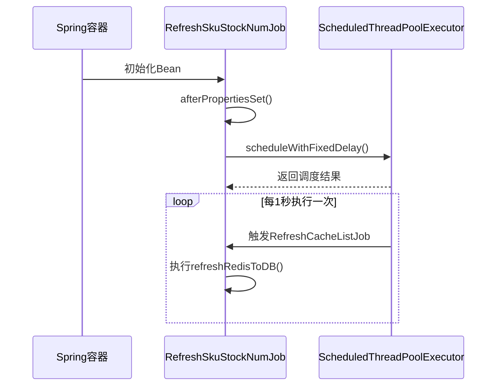
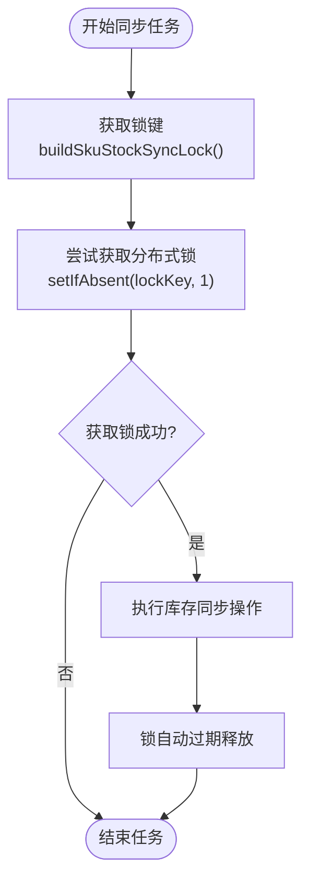
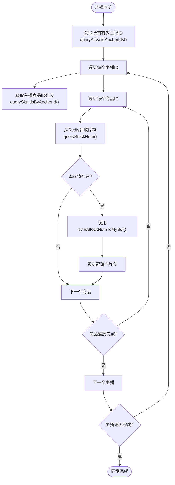
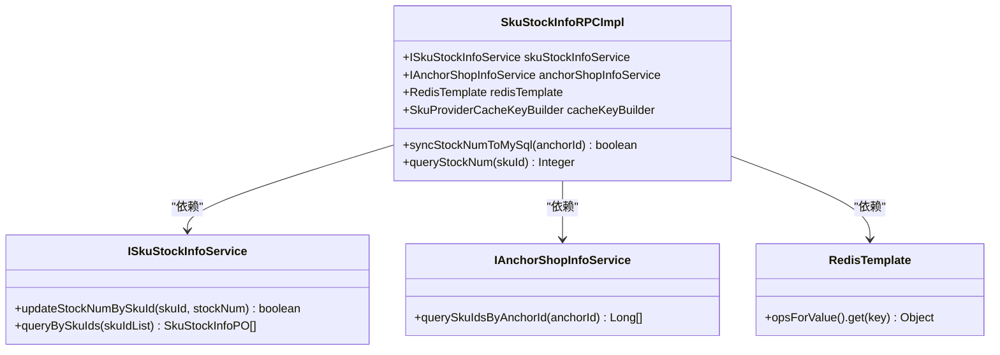
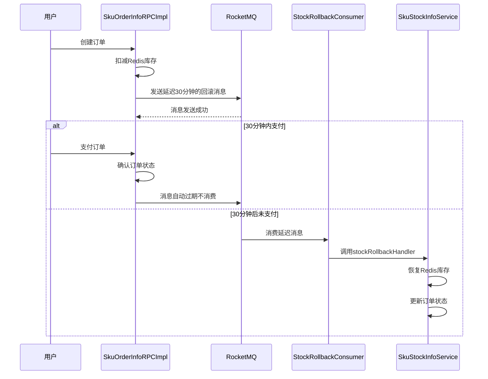

# 库存数据回写MySQL

<cite>
**本文档引用文件**   
- [RefreshSkuStockNumJob.java](file://live-sku-provider\src\main\java\com\logilong\live\sku\provider\config\RefreshSkuStockNumJob.java)
- [SkuStockInfoRPCImpl.java](file://live-sku-provider\src\main\java\com\logilong\live\sku\provider\rpc\SkuStockInfoRPCImpl.java)
- [SkuProviderCacheKeyBuilder.java](file://live-framework\live-framework-redis-starter\src\main\java\com\logilong\live\framework\redis\starter\key\SkuProviderCacheKeyBuilder.java)
- [StockRollbackConsumer.java](file://live-sku-provider\src\main\java\com\logilong\live\sku\provider\consumer\StockRollbackConsumer.java)
- [ISkuStockInfoRPC.java](file://live-sku-interface\src\main\java\com\logilong\live\sku\interfaces\ISkuStockInfoRPC.java)
- [SkuStockInfoServiceImpl.java](file://live-sku-provider\src\main\java\com\logilong\live\sku\provider\service\impl\SkuStockInfoServiceImpl.java)
</cite>

## 目录
1. [定时同步机制概述](#定时同步机制概述)
2. [定时任务初始化流程](#定时任务初始化流程)
3. [分布式锁实现机制](#分布式锁实现机制)
4. [库存同步执行流程](#库存同步执行流程)
5. [数据库更新实现逻辑](#数据库更新实现逻辑)
6. [数据一致性保障](#数据一致性保障)
7. [库存回滚机制](#库存回滚机制)

## 定时同步机制概述

库存数据从Redis回写到MySQL的定时同步机制是确保数据最终一致性的关键组件。该机制通过定时任务定期将Redis中缓存的库存数据同步到MySQL数据库中，防止因服务重启或缓存失效导致的数据丢失。系统采用分布式架构，因此在实现定时任务时必须考虑集群环境下任务的唯一执行问题。

该机制的核心是`RefreshSkuStockNumJob`类，它实现了Spring的`InitializingBean`接口，在应用启动后自动初始化定时任务。定时任务以固定频率触发`refreshRedisToDB`操作，通过分布式锁确保在多节点部署环境下只有一个实例能够执行同步操作。

**Section sources**
- [RefreshSkuStockNumJob.java](file://live-sku-provider\src\main\java\com\logilong\live\sku\provider\config\RefreshSkuStockNumJob.java#L17-L19)

## 定时任务初始化流程

定时任务的初始化通过`afterPropertiesSet`方法实现。当Spring容器完成Bean的属性设置后，会自动调用此方法。在`RefreshSkuStockNumJob`类中，`afterPropertiesSet`方法使用`ScheduledThreadPoolExecutor`创建了一个固定延迟的定时任务。

**Diagram sources**
- [RefreshSkuStockNumJob.java](file://live-sku-provider\src\main\java\com\logilong\live\sku\provider\config\RefreshSkuStockNumJob.java#L36-L40)

**Section sources**
- [RefreshSkuStockNumJob.java](file://live-sku-provider\src\main\java\com\logilong\live\sku\provider\config\RefreshSkuStockNumJob.java#L36-L40)

## 分布式锁实现机制

为确保在分布式部署环境下定时任务的唯一执行，系统实现了基于Redis的分布式锁机制。当多个服务实例同时运行时，如果没有分布式锁的保护，可能会导致同一任务被多个实例重复执行，造成数据库压力和数据不一致。

分布式锁的实现细节如下：
- 锁键通过`SkuProviderCacheKeyBuilder.buildSkuStockSyncLock`方法生成
- 使用Redis的`setIfAbsent`命令实现原子性锁获取
- 锁的有效期设置为10秒，防止死锁
- 利用Redis的自动过期机制实现锁的自动释放

**Diagram sources**
- [RefreshSkuStockNumJob.java](file://live-sku-provider\src\main\java\com\logilong\live\sku\provider\config\RefreshSkuStockNumJob.java#L56-L58)
- [SkuProviderCacheKeyBuilder.java](file://live-framework\live-framework-redis-starter\src\main\java\com\logilong\live\framework\redis\starter\key\SkuProviderCacheKeyBuilder.java#L26-L28)

**Section sources**
- [RefreshSkuStockNumJob.java](file://live-sku-provider\src\main\java\com\logilong\live\sku\provider\config\RefreshSkuStockNumJob.java#L56-L63)
- [SkuProviderCacheKeyBuilder.java](file://live-framework\live-framework-redis-starter\src\main\java\com\logilong\live\framework\redis\starter\key\SkuProviderCacheKeyBuilder.java#L26-L28)

## 库存同步执行流程

当定时任务成功获取分布式锁后，开始执行库存同步流程。该流程首先获取所有有效的主播ID，然后逐个调用`syncStockNumToMySql`接口同步库存变更。

**Diagram sources**
- [RefreshSkuStockNumJob.java](file://live-sku-provider\src\main\java\com\logilong\live\sku\provider\config\RefreshSkuStockNumJob.java#L59-L62)

**Section sources**
- [RefreshSkuStockNumJob.java](file://live-sku-provider\src\main\java\com\logilong\live\sku\provider\config\RefreshSkuStockNumJob.java#L59-L62)

## 数据库更新实现逻辑

`SkuStockInfoRPCImpl`类中的`syncStockNumToMySql`方法实现了从Redis到MySQL的库存同步逻辑。该方法首先通过主播ID获取其所有商品ID，然后逐个从Redis中读取最新库存值，并更新到数据库中。

具体实现步骤如下：
1. 通过`anchorShopInfoService.querySkuIdsByAnchorId`获取主播的所有商品ID
2. 遍历每个商品ID，调用`queryStockNum`方法从Redis获取库存值
3. 如果库存值存在，则调用`skuStockInfoService.updateStockNumBySkuId`更新数据库

**Diagram sources**
- [SkuStockInfoRPCImpl.java](file://live-sku-provider\src\main\java\com\logilong\live\sku\provider\rpc\SkuStockInfoRPCImpl.java#L93-L102)

**Section sources**
- [SkuStockInfoRPCImpl.java](file://live-sku-provider\src\main\java\com\logilong\live\sku\provider\rpc\SkuStockInfoRPCImpl.java#L93-L102)
- [ISkuStockInfoRPC.java](file://live-sku-interface\src\main\java\com\logilong\live\sku\interfaces\ISkuStockInfoRPC.java#L28-L30)

## 数据一致性保障

该机制在保证数据最终一致性方面发挥着重要作用。通过定时将Redis中的库存变更同步到MySQL，确保了即使在服务重启或缓存失效的情况下，库存数据也不会丢失。这种设计模式被称为"缓存与数据库双写"，是高并发系统中常见的数据一致性解决方案。

系统采用"先更新数据库，再删除缓存"或"先更新缓存，再异步更新数据库"的策略。在本案例中，采用了后者：先在Redis中扣减库存，然后通过定时任务将变更同步到数据库。这种策略的优点是响应速度快，缺点是存在短暂的数据不一致窗口。

为减少数据不一致的风险，系统设置了较短的同步间隔（1秒），确保数据尽快达到最终一致状态。同时，通过分布式锁防止了并发更新导致的数据错乱。

**Section sources**
- [RefreshSkuStockNumJob.java](file://live-sku-provider\src\main\java\com\logilong\live\sku\provider\config\RefreshSkuStockNumJob.java#L39)

## 库存回滚机制

在订单超时未支付等场景下，系统需要释放已扣减的库存。为此，系统实现了基于RocketMQ延迟消息的库存回滚机制。当创建订单后，系统会发送一条延迟30分钟的MQ消息，如果在这段时间内订单未支付，则消息被消费，触发库存回滚操作。

**Diagram sources**
- [StockRollbackConsumer.java](file://live-sku-provider\src\main\java\com\logilong\live\sku\provider\consumer\StockRollbackConsumer.java#L42-L46)
- [SkuStockInfoServiceImpl.java](file://live-sku-provider\src\main\java\com\logilong\live\sku\provider\service\impl\SkuStockInfoServiceImpl.java#L134-L148)

**Section sources**
- [StockRollbackConsumer.java](file://live-sku-provider\src\main\java\com\logilong\live\sku\provider\consumer\StockRollbackConsumer.java#L42-L46)
- [SkuStockInfoServiceImpl.java](file://live-sku-provider\src\main\java\com\logilong\live\sku\provider\service\impl\SkuStockInfoServiceImpl.java#L134-L148)