# 库存数据预热机制

<cite>
**本文档引用的文件**   
- [SkuStockInfoRPCImpl.java](file://live-sku-provider/src/main/java/com/logilong/live/sku/provider/rpc/SkuStockInfoRPCImpl.java)
- [SkuStockInfoServiceImpl.java](file://live-sku-provider/src/main/java/com/logilong/live/sku/provider/service/impl/SkuStockInfoServiceImpl.java)
- [IAnchorShopInfoService.java](file://live-sku-provider/src/main/java/com/logilong/live/sku/provider/service/IAnchorShopInfoService.java)
- [AnchorShopInfoServiceImpl.java](file://live-sku-provider/src/main/java/com/logilong/live/sku/provider/service/impl/AnchorShopInfoServiceImpl.java)
- [SkuProviderCacheKeyBuilder.java](file://live-framework/live-framework-redis-starter/src/main/java/com/logilong/live/framework/redis/starter/key/SkuProviderCacheKeyBuilder.java)
- [ISkuStockInfoRPC.java](file://live-sku-interface/src/main/java/com/logilong/live/sku/interfaces/ISkuStockInfoRPC.java)
- [RefreshSkuStockNumJob.java](file://live-sku-provider/src/main/java/com/logilong/live/sku/provider/config/RefreshSkuStockNumJob.java)
- [DecrStockNumBO.java](file://live-sku-provider/src/main/java/com/logilong/live/sku/provider/service/bo/DecrStockNumBO.java)
</cite>

## 目录
1. [引言](#引言)
2. [核心组件分析](#核心组件分析)
3. [库存预热流程](#库存预热流程)
4. [缓存优化策略](#缓存优化策略)
5. [异常处理与重试机制](#异常处理与重试机制)
6. [直播场景下的性能优势](#直播场景下的性能优势)
7. [数据转换与缓存键构建](#数据转换与缓存键构建)
8. [结论](#结论)

## 引言
在直播带货系统中，商品库存数据的快速访问对于用户体验至关重要。本系统通过实现库存数据预热机制，将MySQL数据库中的库存信息批量加载到Redis缓存中，以应对高并发访问场景。该机制通过`SkuStockInfoRPCImpl`类的`prepareStockInfo`方法实现，结合`IAnchorShopInfoService.querySkuIdsByAnchorId`获取主播关联的商品SKU列表，并从MySQL批量查询库存信息后写入Redis缓存。

## 核心组件分析

### SkuStockInfoRPCImpl类
`SkuStockInfoRPCImpl`类是库存服务的核心RPC实现类，负责处理库存相关的远程调用请求。该类实现了`ISkuStockInfoRPC`接口，提供了库存预热、查询和更新等关键功能。

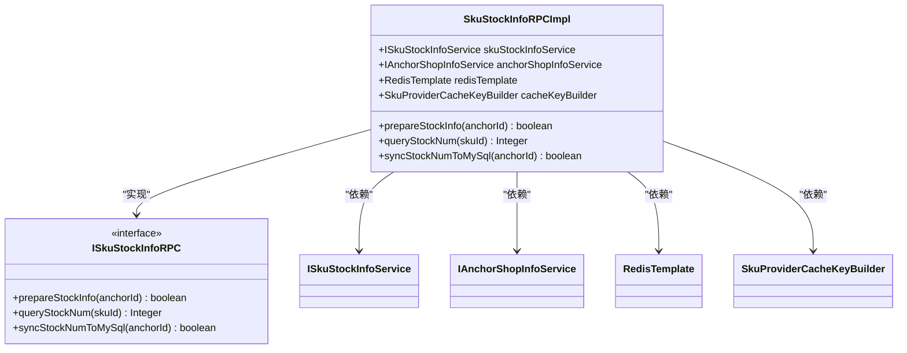

**图示来源**
- [SkuStockInfoRPCImpl.java](file://live-sku-provider/src/main/java/com/logilong/live/sku/provider/rpc/SkuStockInfoRPCImpl.java#L23-L103)
- [ISkuStockInfoRPC.java](file://live-sku-interface/src/main/java/com/logilong/live/sku/interfaces/ISkuStockInfoRPC.java#L5-L44)

**本节来源**
- [SkuStockInfoRPCImpl.java](file://live-sku-provider/src/main/java/com/logilong/live/sku/provider/rpc/SkuStockInfoRPCImpl.java#L1-L104)

### IAnchorShopInfoService接口
`IAnchorShopInfoService`接口定义了主播与商品关联信息的查询方法，是库存预热机制中获取商品SKU列表的关键组件。

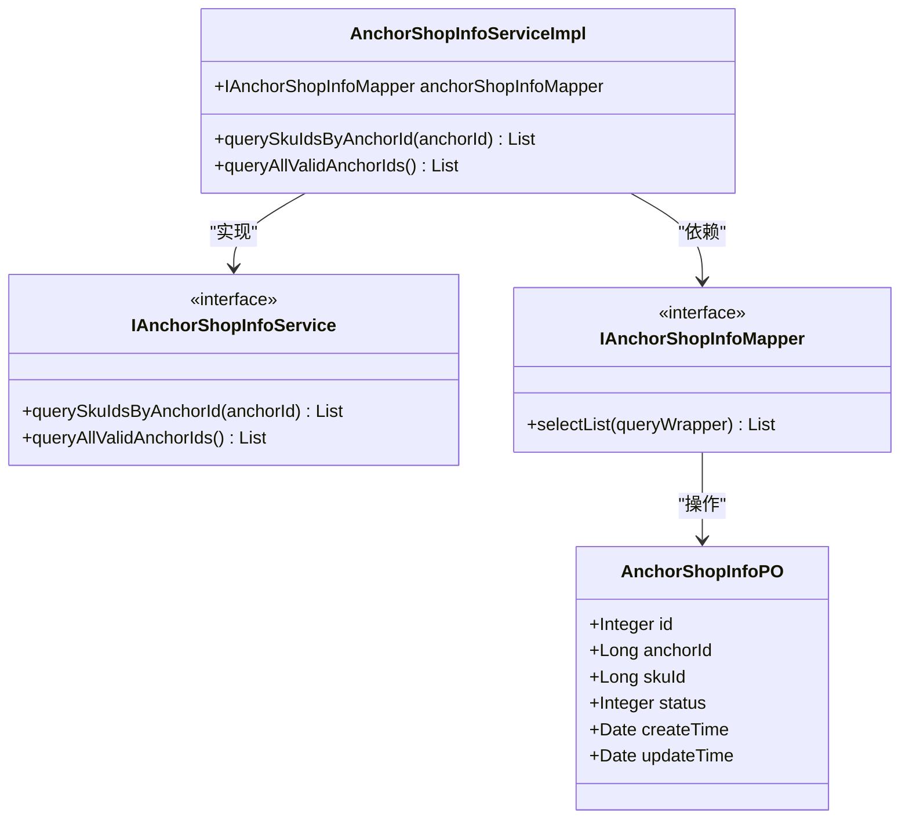

**图示来源**
- [IAnchorShopInfoService.java](file://live-sku-provider/src/main/java/com/logilong/live/sku/provider/service/IAnchorShopInfoService.java#L5-L16)
- [AnchorShopInfoServiceImpl.java](file://live-sku-provider/src/main/java/com/logilong/live/sku/provider/service/impl/AnchorShopInfoServiceImpl.java#L14-L35)
- [IAnchorShopInfoMapper.java](file://live-sku-provider/src/main/java/com/logilong/live/sku/provider/dao/mapper/IAnchorShopInfoMapper.java#L7-L9)
- [AnchorShopInfoPO.java](file://live-sku-provider/src/main/java/com/logilong/live/sku/provider/dao/po/AnchorShopInfoPO.java#L10-L20)

**本节来源**
- [IAnchorShopInfoService.java](file://live-sku-provider/src/main/java/com/logilong/live/sku/provider/service/IAnchorShopInfoService.java#L1-L17)
- [AnchorShopInfoServiceImpl.java](file://live-sku-provider/src/main/java/com/logilong/live/sku/provider/service/impl/AnchorShopInfoServiceImpl.java#L1-L36)

## 库存预热流程

### 预热方法执行流程
库存预热机制的核心是`SkuStockInfoRPCImpl.prepareStockInfo`方法，该方法通过以下步骤实现库存数据的预热：

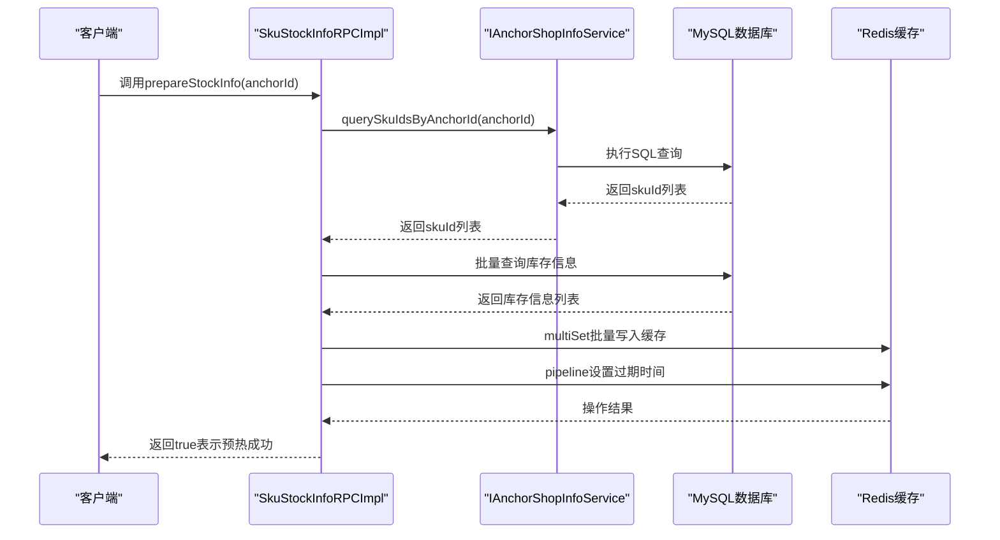

**图示来源**
- [SkuStockInfoRPCImpl.java](file://live-sku-provider/src/main/java/com/logilong/live/sku/provider/rpc/SkuStockInfoRPCImpl.java#L61-L82)
- [SkuStockInfoServiceImpl.java](file://live-sku-provider/src/main/java/com/logilong/live/sku/provider/service/impl/SkuStockInfoServiceImpl.java#L70-L75)

**本节来源**
- [SkuStockInfoRPCImpl.java](file://live-sku-provider/src/main/java/com/logilong/live/sku/provider/rpc/SkuStockInfoRPCImpl.java#L61-L82)

### 数据流分析
库存预热机制的数据流从主播ID开始，经过多个服务层和数据层，最终将数据写入Redis缓存。

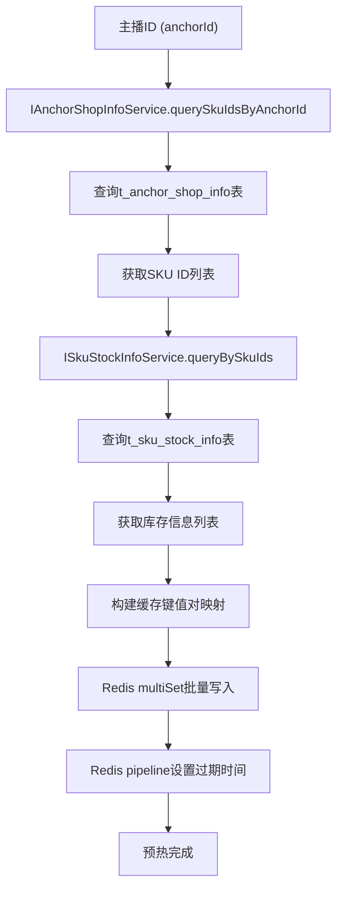

**图示来源**
- [SkuStockInfoRPCImpl.java](file://live-sku-provider/src/main/java/com/logilong/live/sku/provider/rpc/SkuStockInfoRPCImpl.java#L62-L72)
- [SkuStockInfoServiceImpl.java](file://live-sku-provider/src/main/java/com/logilong/live/sku/provider/service/impl/SkuStockInfoServiceImpl.java#L70-L75)
- [AnchorShopInfoServiceImpl.java](file://live-sku-provider/src/main/java/com/logilong/live/sku/provider/service/impl/AnchorShopInfoServiceImpl.java#L21-L27)

**本节来源**
- [SkuStockInfoRPCImpl.java](file://live-sku-provider/src/main/java/com/logilong/live/sku/provider/rpc/SkuStockInfoRPCImpl.java#L61-L82)

## 缓存优化策略

### multiSet批量写入性能优势
`multiSet`方法是Redis提供的批量写入操作，相比单个`set`操作具有显著的性能优势：

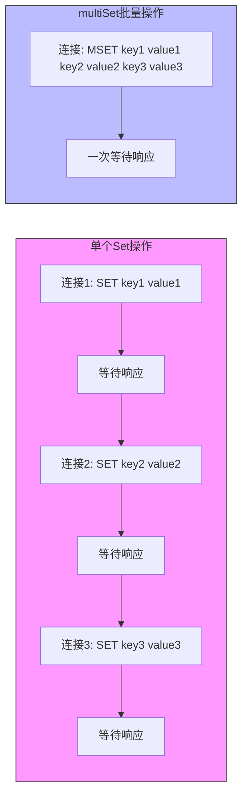

**图示来源**
- [SkuStockInfoRPCImpl.java](file://live-sku-provider/src/main/java/com/logilong/live/sku/provider/rpc/SkuStockInfoRPCImpl.java#L72)
- [UserServiceImpl.java](file://live-user-provider/src/main/java/com/logilong/live/user/provider/service/impl/UserServiceImpl.java#L131)

**本节来源**
- [SkuStockInfoRPCImpl.java](file://live-sku-provider/src/main/java/com/logilong/live/sku/provider/rpc/SkuStockInfoRPCImpl.java#L72)

### Pipeline批量设置过期时间
通过`executePipelined`方法使用Redis管道技术批量设置过期时间，避免了多次网络往返：

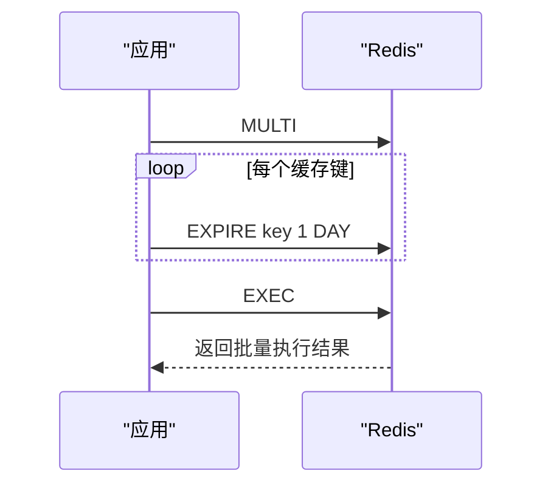

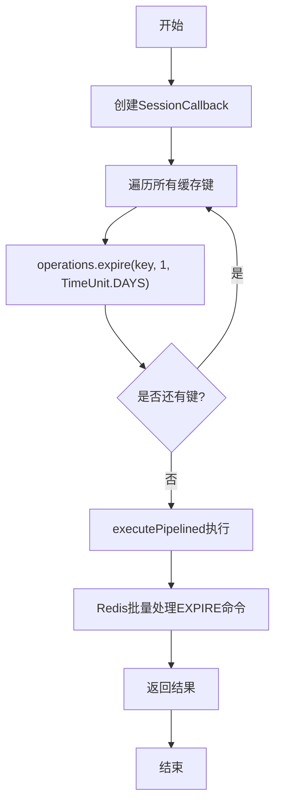

**图示来源**
- [SkuStockInfoRPCImpl.java](file://live-sku-provider/src/main/java/com/logilong/live/sku/provider/rpc/SkuStockInfoRPCImpl.java#L73-L81)
- [UserServiceImpl.java](file://live-user-provider/src/main/java/com/logilong/live/user/provider/service/impl/UserServiceImpl.java#L132-L136)

**本节来源**
- [SkuStockInfoRPCImpl.java](file://live-sku-provider/src/main/java/com/logilong/live/sku/provider/rpc/SkuStockInfoRPCImpl.java#L73-L81)

## 异常处理与重试机制

### 数据库操作重试机制
系统在更新库存时实现了重试机制，确保操作的可靠性：

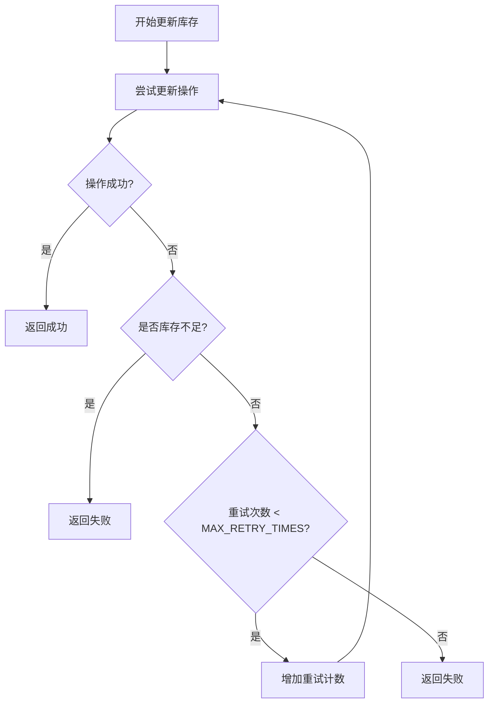

**图示来源**
- [SkuStockInfoRPCImpl.java](file://live-sku-provider/src/main/java/com/logilong/live/sku/provider/rpc/SkuStockInfoRPCImpl.java#L37-L47)
- [DecrStockNumBO.java](file://live-sku-provider/src/main/java/com/logilong/live/sku/provider/service/bo/DecrStockNumBO.java#L10-L17)

**本节来源**
- [SkuStockInfoRPCImpl.java](file://live-sku-provider/src/main/java/com/logilong/live/sku/provider/rpc/SkuStockInfoRPCImpl.java#L37-L47)

### 定时同步机制
系统通过定时任务定期将Redis中的库存数据同步回MySQL数据库，确保数据一致性：

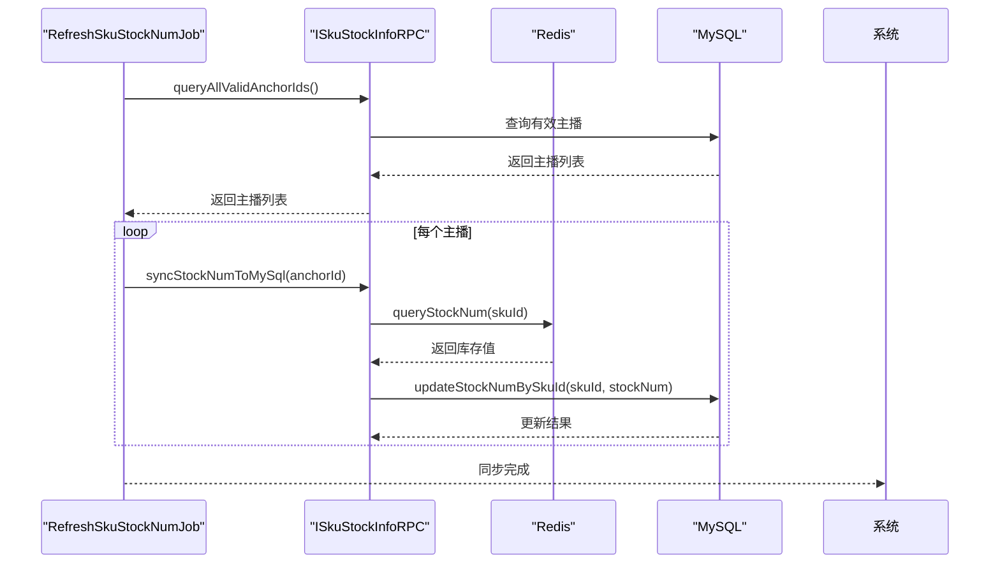

**图示来源**
- [RefreshSkuStockNumJob.java](file://live-sku-provider/src/main/java/com/logilong/live/sku/provider/config/RefreshSkuStockNumJob.java#L21-L37)
- [SkuStockInfoRPCImpl.java](file://live-sku-provider/src/main/java/com/logilong/live/sku/provider/rpc/SkuStockInfoRPCImpl.java#L93-L102)

**本节来源**
- [RefreshSkuStockNumJob.java](file://live-sku-provider/src/main/java/com/logilong/live/sku/provider/config/RefreshSkuStockNumJob.java#L21-L37)

## 直播场景下的性能优势

### 高并发访问应对策略
库存预热机制在直播带货场景下具有显著优势，能够有效应对高并发访问：

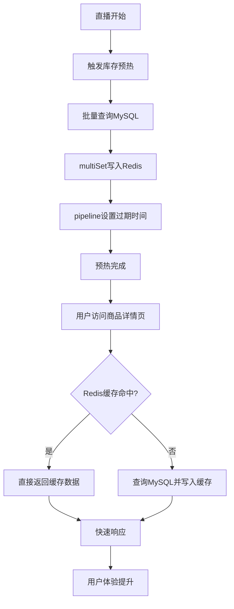

**图示来源**
- [SkuStockInfoRPCImpl.java](file://live-sku-provider/src/main/java/com/logilong/live/sku/provider/rpc/SkuStockInfoRPCImpl.java#L61-L82)
- [SkuStockInfoRPCImpl.java](file://live-sku-provider/src/main/java/com/logilong/live/sku/provider/rpc/SkuStockInfoRPCImpl.java#L86-L89)

**本节来源**
- [SkuStockInfoRPCImpl.java](file://live-sku-provider/src/main/java/com/logilong/live/sku/provider/rpc/SkuStockInfoRPCImpl.java#L61-L89)

### 数据库压力减轻
通过缓存预热机制，系统能够显著减少对数据库的直接访问压力：

```mermaid
erDiagram
USER ||--o{ REQUEST : "发起"
REQUEST }o--|| CACHE : "优先访问"
REQUEST }o--|| DATABASE : "降级访问"
CACHE ||--|| DATABASE : "定时同步"
class USER "用户"
class REQUEST "请求"
class CACHE "Redis缓存"
class DATABASE "MySQL数据库"
note right of CACHE
预热机制确保热点数据
提前加载到缓存中
end note
note right of DATABASE
只在缓存未命中时
或定时同步时访问
end note
```

**图示来源**
- [SkuStockInfoRPCImpl.java](file://live-sku-provider/src/main/java/com/logilong/live/sku/provider/rpc/SkuStockInfoRPCImpl.java#L61-L82)
- [RefreshSkuStockNumJob.java](file://live-sku-provider/src/main/java/com/logilong/live/sku/provider/config/RefreshSkuStockNumJob.java#L21-L37)

**本节来源**
- [SkuStockInfoRPCImpl.java](file://live-sku-provider/src/main/java/com/logilong/live/sku/provider/rpc/SkuStockInfoRPCImpl.java#L61-L82)

## 数据转换与缓存键构建

### 缓存键构建策略
系统使用`SkuProviderCacheKeyBuilder`类构建标准化的Redis缓存键：

```mermaid
classDiagram
class SkuProviderCacheKeyBuilder {
+buildSkuStock(skuId) String
+buildSkuOrderInfo(userId, roomId) String
+buildSkuDetail(skuId) String
}
class RedisKeyBuilder {
+getPrefix() String
+getSplitItem() String
}
SkuProviderCacheKeyBuilder --> RedisKeyBuilder : "继承"
note right of SkuProviderCacheKeyBuilder
缓存键格式 : prefix + type + splitItem + id
例如 : live : sku_stock : 12345
end note
```

**图示来源**
- [SkuProviderCacheKeyBuilder.java](file://live-framework/live-framework-redis-starter/src/main/java/com/logilong/live/framework/redis/starter/key/SkuProviderCacheKeyBuilder.java#L12-L41)

**本节来源**
- [SkuProviderCacheKeyBuilder.java](file://live-framework/live-framework-redis-starter/src/main/java/com/logilong/live/framework/redis/starter/key/SkuProviderCacheKeyBuilder.java#L12-L41)

### 数据转换流程
库存信息从数据库实体到缓存值的转换流程：

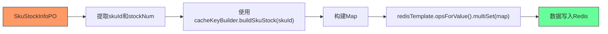

**图示来源**
- [SkuStockInfoRPCImpl.java](file://live-sku-provider/src/main/java/com/logilong/live/sku/provider/rpc/SkuStockInfoRPCImpl.java#L70-L72)
- [SkuProviderCacheKeyBuilder.java](file://live-framework/live-framework-redis-starter/src/main/java/com/logilong/live/framework/redis/starter/key/SkuProviderCacheKeyBuilder.java#L29-L31)

**本节来源**
- [SkuStockInfoRPCImpl.java](file://live-sku-provider/src/main/java/com/logilong/live/sku/provider/rpc/SkuStockInfoRPCImpl.java#L70-L72)

## 结论
库存数据预热机制通过`SkuStockInfoRPCImpl.prepareStockInfo`方法实现了高效的库存数据加载流程。该机制首先通过`IAnchorShopInfoService.querySkuIdsByAnchorId`获取主播关联的商品SKU列表，然后批量查询MySQL数据库中的库存信息。使用`multiSet`方法批量写入Redis缓存，相比单个写入操作大大减少了网络往返次数，提高了写入效率。通过`executePipelined`和`SessionCallback`实现的管道技术，能够批量设置缓存过期时间，进一步优化了性能。

在直播带货场景下，该机制能够有效应对高并发访问，将热点商品的库存数据提前加载到Redis缓存中，显著减少了数据库的直接访问压力，确保了商品详情页的快速加载。同时，系统通过定时任务定期将Redis中的库存变更同步回MySQL数据库，保证了数据的一致性。异常处理和重试机制确保了关键操作的可靠性，为直播带货业务提供了稳定的技术支持。