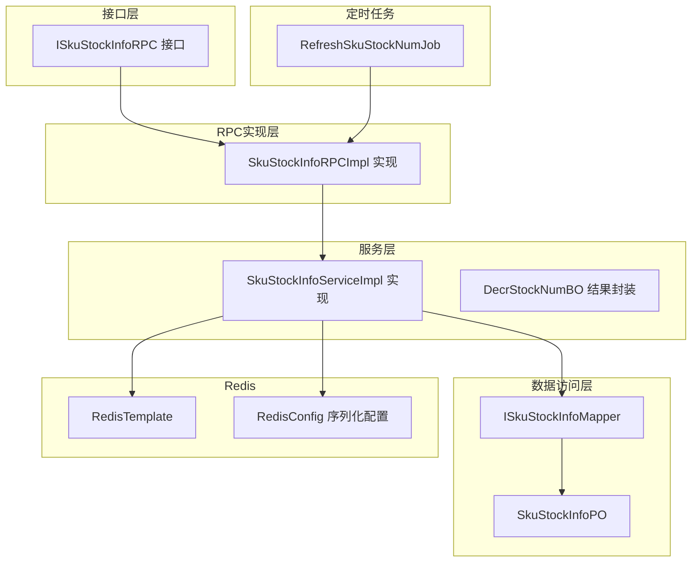
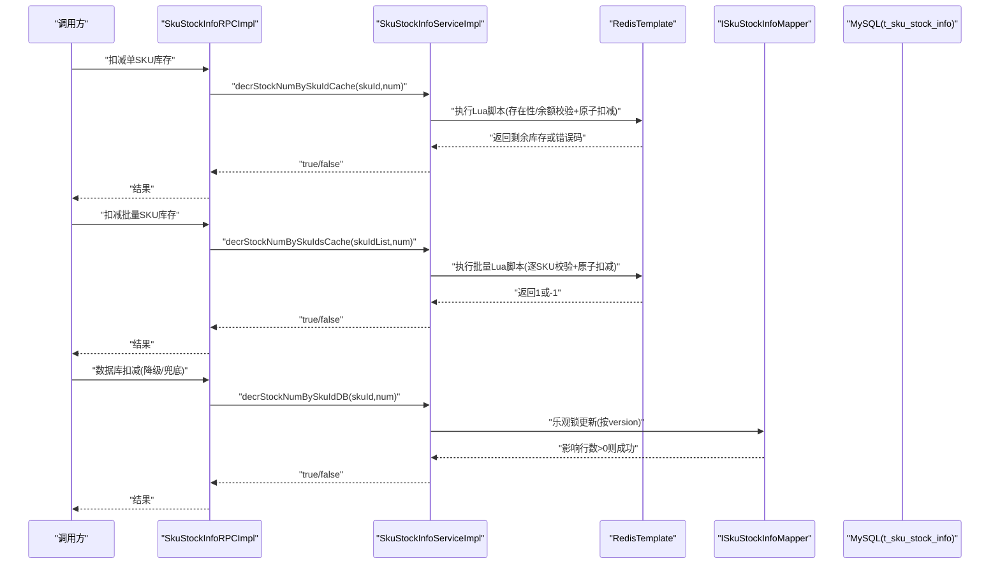
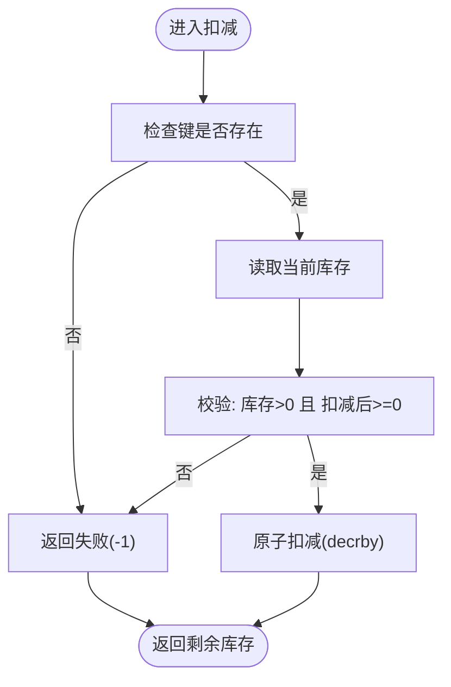
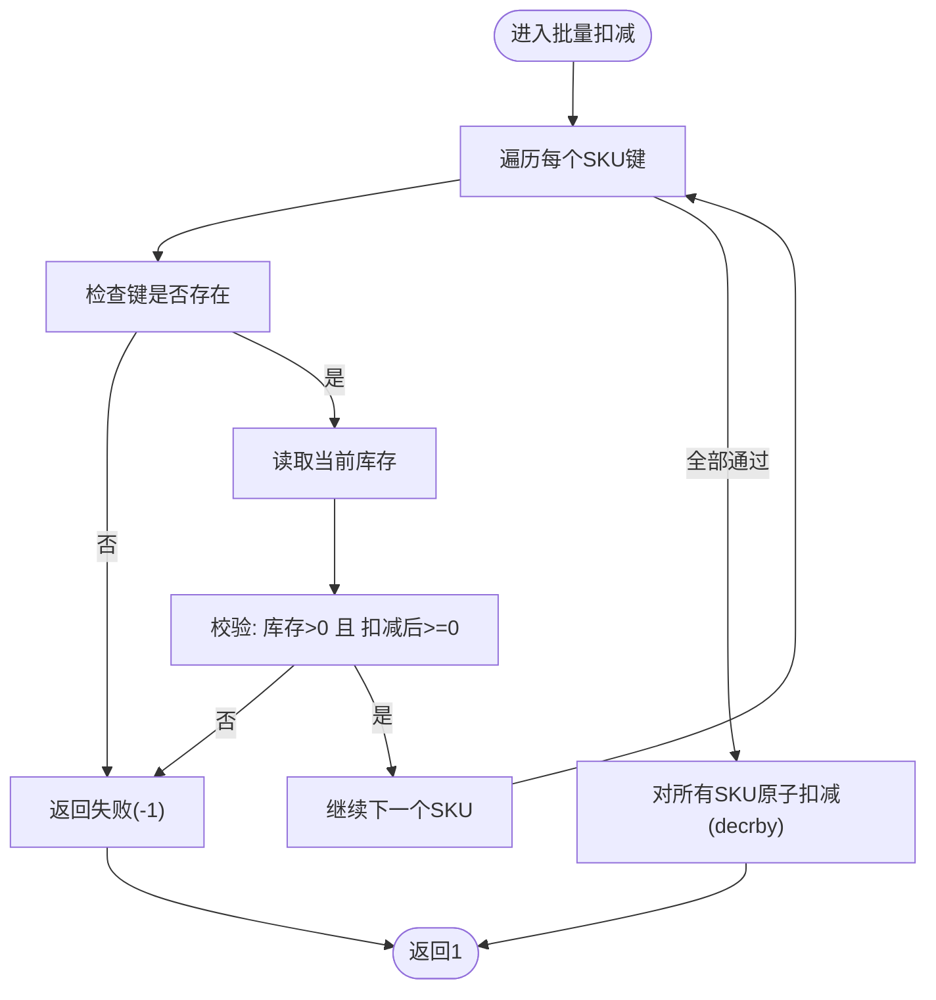
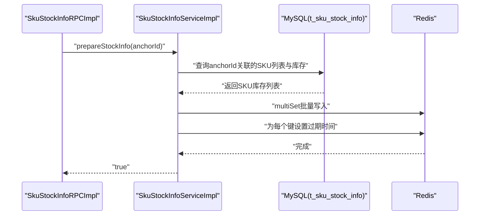
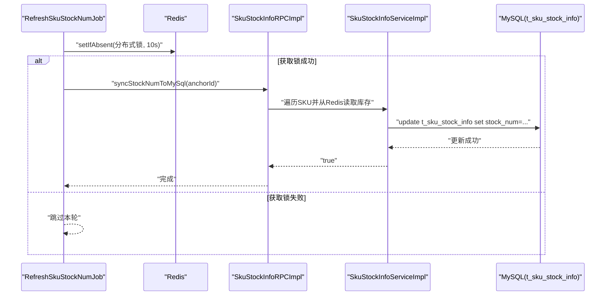
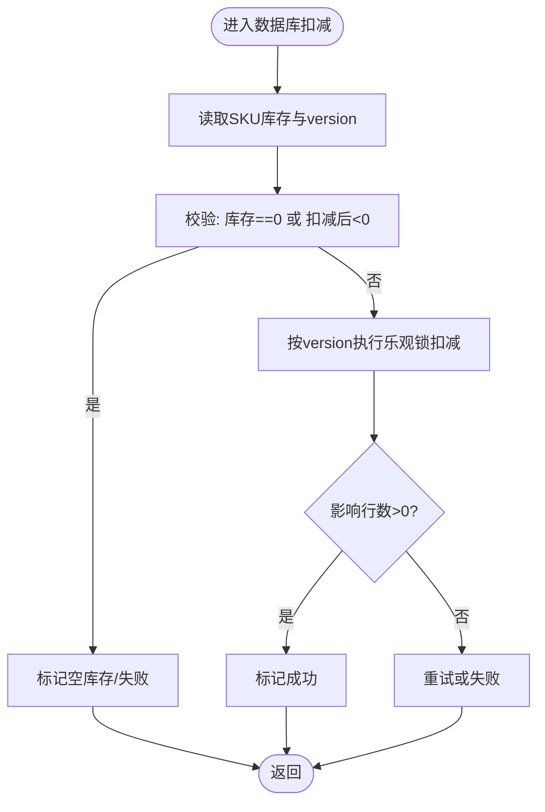
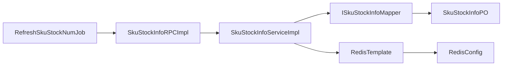

# 库存管理

<cite>
**本文引用的文件**
- [ISkuStockInfoRPC.java](file://live-sku-interface/src/main/java/com/logilong/live/sku/interfaces/ISkuStockInfoRPC.java)
- [SkuStockInfoRPCImpl.java](file://live-sku-provider/src/main/java/com/logilong/live/sku/provider/rpc/SkuStockInfoRPCImpl.java)
- [ISkuStockInfoService.java](file://live-sku-provider/src/main/java/com/logilong/live/sku/provider/service/ISkuStockInfoService.java)
- [SkuStockInfoServiceImpl.java](file://live-sku-provider/src/main/java/com/logilong/live/sku/provider/service/impl/SkuStockInfoServiceImpl.java)
- [ISkuStockInfoMapper.java](file://live-sku-provider/src/main/java/com/logilong/live/sku/provider/dao/mapper/ISkuStockInfoMapper.java)
- [SkuStockInfoPO.java](file://live-sku-provider/src/main/java/com/logilong/live/sku/provider/dao/po/SkuStockInfoPO.java)
- [RefreshSkuStockNumJob.java](file://live-sku-provider/src/main/java/com/logilong/live/sku/provider/config/RefreshSkuStockNumJob.java)
- [RedisConfig.java](file://live-framework/live-framework-redis-starter/src/main/java/com/logilong/live/framework/redis/starter/config/RedisConfig.java)
</cite>

## 目录
1. [简介](#简介)
2. [项目结构](#项目结构)
3. [核心组件](#核心组件)
4. [架构总览](#架构总览)
5. [详细组件分析](#详细组件分析)
6. [依赖关系分析](#依赖关系分析)
7. [性能考量](#性能考量)
8. [故障排查指南](#故障排查指南)
9. [结论](#结论)

## 简介
本文件围绕库存管理模块的高并发处理机制展开，重点解析以下内容：
- 基于Lua脚本的原子性库存扣减方案（单SKU与批量SKU），覆盖库存存在性检查、余额验证与原子扣减。
- prepareStockInfo接口如何实现库存数据从MySQL到Redis的预热加载。
- syncStockNumToMySql定时同步机制与分布式锁保障。
- decrStockNumBySkuIdDB方法中的数据库乐观锁（version字段）应用，确保库存一致性。

## 项目结构
库存相关能力主要分布在接口层、RPC实现层、服务层与数据访问层，并辅以Redis配置与定时同步任务：
- 接口层：定义对外暴露的库存RPC接口，包含预热、查询、扣减、同步等能力。
- RPC实现层：负责调用服务层具体实现，并对扣减失败进行重试控制。
- 服务层：实现具体的扣减逻辑（Lua脚本）、数据库扣减（含乐观锁）、回滚处理等。
- 数据访问层：MyBatis Mapper封装数据库更新语句，使用version字段实现乐观锁。
- 定时任务：周期性将Redis中的库存同步回MySQL，避免长时间离线导致的数据漂移。
- Redis配置：统一的RedisTemplate序列化策略，保证Lua脚本与键空间的兼容性。

图表来源
- [ISkuStockInfoRPC.java](file://live-sku-interface/src/main/java/com/logilong/live/sku/interfaces/ISkuStockInfoRPC.java#L1-L45)
- [SkuStockInfoRPCImpl.java](file://live-sku-provider/src/main/java/com/logilong/live/sku/provider/rpc/SkuStockInfoRPCImpl.java#L1-L103)
- [ISkuStockInfoService.java](file://live-sku-provider/src/main/java/com/logilong/live/sku/provider/service/ISkuStockInfoService.java#L1-L48)
- [SkuStockInfoServiceImpl.java](file://live-sku-provider/src/main/java/com/logilong/live/sku/provider/service/impl/SkuStockInfoServiceImpl.java#L1-L151)
- [ISkuStockInfoMapper.java](file://live-sku-provider/src/main/java/com/logilong/live/sku/provider/dao/mapper/ISkuStockInfoMapper.java#L1-L18)
- [SkuStockInfoPO.java](file://live-sku-provider/src/main/java/com/logilong/live/sku/provider/dao/po/SkuStockInfoPO.java#L1-L22)
- [RedisConfig.java](file://live-framework/live-framework-redis-starter/src/main/java/com/logilong/live/framework/redis/starter/config/RedisConfig.java#L1-L28)
- [RefreshSkuStockNumJob.java](file://live-sku-provider/src/main/java/com/logilong/live/sku/provider/config/RefreshSkuStockNumJob.java#L1-L66)

章节来源
- [ISkuStockInfoRPC.java](file://live-sku-interface/src/main/java/com/logilong/live/sku/interfaces/ISkuStockInfoRPC.java#L1-L45)
- [SkuStockInfoRPCImpl.java](file://live-sku-provider/src/main/java/com/logilong/live/sku/provider/rpc/SkuStockInfoRPCImpl.java#L1-L103)
- [ISkuStockInfoService.java](file://live-sku-provider/src/main/java/com/logilong/live/sku/provider/service/ISkuStockInfoService.java#L1-L48)
- [SkuStockInfoServiceImpl.java](file://live-sku-provider/src/main/java/com/logilong/live/sku/provider/service/impl/SkuStockInfoServiceImpl.java#L1-L151)
- [ISkuStockInfoMapper.java](file://live-sku-provider/src/main/java/com/logilong/live/sku/provider/dao/mapper/ISkuStockInfoMapper.java#L1-L18)
- [SkuStockInfoPO.java](file://live-sku-provider/src/main/java/com/logilong/live/sku/provider/dao/po/SkuStockInfoPO.java#L1-L22)
- [RedisConfig.java](file://live-framework/live-framework-redis-starter/src/main/java/com/logilong/live/framework/redis/starter/config/RedisConfig.java#L1-L28)
- [RefreshSkuStockNumJob.java](file://live-sku-provider/src/main/java/com/logilong/live/sku/provider/config/RefreshSkuStockNumJob.java#L1-L66)

## 核心组件
- 接口层ISkuStockInfoRPC：定义库存查询、预热、扣减、同步与更新等能力，明确扣减需使用Lua脚本。
- RPC实现SkuStockInfoRPCImpl：负责调用服务层并进行重试控制；提供prepareStockInfo、queryStockNum、syncStockNumToMySql等。
- 服务层ISkuStockInfoService与SkuStockInfoServiceImpl：实现单SKU与批量SKU的Lua扣减、数据库扣减（乐观锁）、库存回滚。
- 数据访问层ISkuStockInfoMapper：通过version字段实现乐观锁更新，确保并发安全。
- Redis配置RedisConfig：统一RedisTemplate序列化策略，保证Lua脚本与键空间的兼容性。
- 定时任务RefreshSkuStockNumJob：周期性将Redis库存同步回MySQL，使用分布式锁避免多节点重复执行。

章节来源
- [ISkuStockInfoRPC.java](file://live-sku-interface/src/main/java/com/logilong/live/sku/interfaces/ISkuStockInfoRPC.java#L1-L45)
- [SkuStockInfoRPCImpl.java](file://live-sku-provider/src/main/java/com/logilong/live/sku/provider/rpc/SkuStockInfoRPCImpl.java#L1-L103)
- [ISkuStockInfoService.java](file://live-sku-provider/src/main/java/com/logilong/live/sku/provider/service/ISkuStockInfoService.java#L1-L48)
- [SkuStockInfoServiceImpl.java](file://live-sku-provider/src/main/java/com/logilong/live/sku/provider/service/impl/SkuStockInfoServiceImpl.java#L1-L151)
- [ISkuStockInfoMapper.java](file://live-sku-provider/src/main/java/com/logilong/live/sku/provider/dao/mapper/ISkuStockInfoMapper.java#L1-L18)
- [RedisConfig.java](file://live-framework/live-framework-redis-starter/src/main/java/com/logilong/live/framework/redis/starter/config/RedisConfig.java#L1-L28)
- [RefreshSkuStockNumJob.java](file://live-sku-provider/src/main/java/com/logilong/live/sku/provider/config/RefreshSkuStockNumJob.java#L1-L66)

## 架构总览
库存管理采用“缓存优先+数据库兜底”的双通道策略：
- 高并发路径：优先走Redis，使用Lua脚本在服务端原子性完成库存存在性检查、余额验证与扣减。
- 一致性保障：数据库侧通过version字段的乐观锁，确保并发扣减不会出现超卖。
- 数据同步：定时任务将Redis中的库存回写MySQL，避免长时间离线导致的数据漂移。

图表来源
- [SkuStockInfoRPCImpl.java](file://live-sku-provider/src/main/java/com/logilong/live/sku/provider/rpc/SkuStockInfoRPCImpl.java#L1-L103)
- [SkuStockInfoServiceImpl.java](file://live-sku-provider/src/main/java/com/logilong/live/sku/provider/service/impl/SkuStockInfoServiceImpl.java#L1-L151)
- [ISkuStockInfoMapper.java](file://live-sku-provider/src/main/java/com/logilong/live/sku/provider/dao/mapper/ISkuStockInfoMapper.java#L1-L18)

## 详细组件分析

### 单SKU库存扣减（Lua原子性）
- 脚本逻辑要点
  - 存在性检查：若键不存在，直接返回失败。
  - 余额验证：仅当当前库存大于0且扣减后仍非负时才允许扣减。
  - 原子扣减：使用decrby一次性完成扣减，避免竞态。
- 执行流程
  - 由服务层构建Lua脚本与参数，通过RedisTemplate执行。
  - 返回值非负表示扣减成功，否则失败。
- 并发特性
  - Lua脚本在Redis服务端原子执行，天然避免竞态。
  - 适合高并发场景下的快速扣减。

图表来源
- [SkuStockInfoServiceImpl.java](file://live-sku-provider/src/main/java/com/logilong/live/sku/provider/service/impl/SkuStockInfoServiceImpl.java#L38-L59)
- [SkuStockInfoServiceImpl.java](file://live-sku-provider/src/main/java/com/logilong/live/sku/provider/service/impl/SkuStockInfoServiceImpl.java#L102-L113)

章节来源
- [SkuStockInfoServiceImpl.java](file://live-sku-provider/src/main/java/com/logilong/live/sku/provider/service/impl/SkuStockInfoServiceImpl.java#L38-L59)
- [SkuStockInfoServiceImpl.java](file://live-sku-provider/src/main/java/com/logilong/live/sku/provider/service/impl/SkuStockInfoServiceImpl.java#L102-L113)

### 批量SKU库存扣减（Lua原子性）
- 脚本逻辑要点
  - 逐SKU存在性检查与余额验证，任一SKU不满足即整体失败。
  - 全部SKU通过校验后，再进行原子扣减，保证事务性。
- 执行流程
  - 将多个SKU键作为KEYS传入，扣减数量与键数量作为参数。
  - Redis端先校验再扣减，保证原子性。
- 并发特性
  - 同样在Redis服务端原子执行，避免跨SKU的竞态。

图表来源
- [SkuStockInfoServiceImpl.java](file://live-sku-provider/src/main/java/com/logilong/live/sku/provider/service/impl/SkuStockInfoServiceImpl.java#L47-L59)
- [SkuStockInfoServiceImpl.java](file://live-sku-provider/src/main/java/com/logilong/live/sku/provider/service/impl/SkuStockInfoServiceImpl.java#L115-L130)

章节来源
- [SkuStockInfoServiceImpl.java](file://live-sku-provider/src/main/java/com/logilong/live/sku/provider/service/impl/SkuStockInfoServiceImpl.java#L47-L59)
- [SkuStockInfoServiceImpl.java](file://live-sku-provider/src/main/java/com/logilong/live/sku/provider/service/impl/SkuStockInfoServiceImpl.java#L115-L130)

### prepareStockInfo：库存预热加载（MySQL→Redis）
- 目标：将主播带货的商品库存从MySQL批量加载到Redis，减少热路径上的数据库压力。
- 流程
  - 查询主播关联的所有SKU。
  - 从MySQL读取库存信息，构造键值映射。
  - 使用RedisTemplate.multiSet批量写入，并为每个键设置过期时间。
- 性能与可靠性
  - 批量写入降低网络往返次数。
  - 过期时间确保缓存与DB之间的时间窗口内保持一致。

图表来源
- [SkuStockInfoRPCImpl.java](file://live-sku-provider/src/main/java/com/logilong/live/sku/provider/rpc/SkuStockInfoRPCImpl.java#L60-L83)
- [SkuStockInfoServiceImpl.java](file://live-sku-provider/src/main/java/com/logilong/live/sku/provider/service/impl/SkuStockInfoServiceImpl.java#L60-L75)

章节来源
- [SkuStockInfoRPCImpl.java](file://live-sku-provider/src/main/java/com/logilong/live/sku/provider/rpc/SkuStockInfoRPCImpl.java#L60-L83)
- [SkuStockInfoServiceImpl.java](file://live-sku-provider/src/main/java/com/logilong/live/sku/provider/service/impl/SkuStockInfoServiceImpl.java#L60-L75)

### syncStockNumToMySql：定时同步（Redis→MySQL）
- 目标：将Redis中的库存回写MySQL，避免长时间离线导致的数据漂移。
- 流程
  - 定时任务周期性触发，使用分布式锁避免多节点重复执行。
  - 遍历所有有效主播，逐SKU从Redis读取库存并更新MySQL。
- 分布式锁
  - 使用Redis的setIfAbsent(key, 1, TTL)实现短时互斥，确保同一时刻仅一个节点执行同步。

图表来源
- [RefreshSkuStockNumJob.java](file://live-sku-provider/src/main/java/com/logilong/live/sku/provider/config/RefreshSkuStockNumJob.java#L36-L65)
- [SkuStockInfoRPCImpl.java](file://live-sku-provider/src/main/java/com/logilong/live/sku/provider/rpc/SkuStockInfoRPCImpl.java#L92-L102)

章节来源
- [RefreshSkuStockNumJob.java](file://live-sku-provider/src/main/java/com/logilong/live/sku/provider/config/RefreshSkuStockNumJob.java#L36-L65)
- [SkuStockInfoRPCImpl.java](file://live-sku-provider/src/main/java/com/logilong/live/sku/provider/rpc/SkuStockInfoRPCImpl.java#L92-L102)

### decrStockNumBySkuIdDB：数据库乐观锁扣减
- 目标：在Redis不可用或扣减失败时，作为兜底方案进行数据库扣减。
- 乐观锁机制
  - SQL中限定skuId、version与库存条件，仅当版本号未被他人修改且库存充足时才扣减。
  - 成功返回影响行数>0，失败返回0或异常。
- 重试策略
  - RPC层对数据库扣减进行有限次重试，提升成功率。

图表来源
- [SkuStockInfoServiceImpl.java](file://live-sku-provider/src/main/java/com/logilong/live/sku/provider/service/impl/SkuStockInfoServiceImpl.java#L87-L100)
- [ISkuStockInfoMapper.java](file://live-sku-provider/src/main/java/com/logilong/live/sku/provider/dao/mapper/ISkuStockInfoMapper.java#L12-L17)
- [SkuStockInfoPO.java](file://live-sku-provider/src/main/java/com/logilong/live/sku/provider/dao/po/SkuStockInfoPO.java#L1-L22)
- [SkuStockInfoRPCImpl.java](file://live-sku-provider/src/main/java/com/logilong/live/sku/provider/rpc/SkuStockInfoRPCImpl.java#L36-L48)

章节来源
- [SkuStockInfoServiceImpl.java](file://live-sku-provider/src/main/java/com/logilong/live/sku/provider/service/impl/SkuStockInfoServiceImpl.java#L87-L100)
- [ISkuStockInfoMapper.java](file://live-sku-provider/src/main/java/com/logilong/live/sku/provider/dao/mapper/ISkuStockInfoMapper.java#L12-L17)
- [SkuStockInfoPO.java](file://live-sku-provider/src/main/java/com/logilong/live/sku/provider/dao/po/SkuStockInfoPO.java#L1-L22)
- [SkuStockInfoRPCImpl.java](file://live-sku-provider/src/main/java/com/logilong/live/sku/provider/rpc/SkuStockInfoRPCImpl.java#L36-L48)

## 依赖关系分析
- 组件耦合
  - RPC实现依赖服务层接口；服务层依赖Mapper与RedisTemplate。
  - Mapper依赖PO模型；Redis配置为服务层提供统一的RedisTemplate。
- 关键依赖链
  - decrStockNumBySkuIdCache → RedisTemplate.execute(Lua) → Redis
  - decrStockNumBySkuIdDB → ISkuStockInfoMapper → MySQL
  - syncStockNumToMySql → RedisTemplate + 分布式锁
- 潜在风险
  - Redis不可用时，扣减会降级到数据库，需关注数据库压力。
  - 批量扣减脚本在SKU数量较多时，Redis端遍历成本上升，建议控制批量规模。

图表来源
- [SkuStockInfoRPCImpl.java](file://live-sku-provider/src/main/java/com/logilong/live/sku/provider/rpc/SkuStockInfoRPCImpl.java#L1-L103)
- [SkuStockInfoServiceImpl.java](file://live-sku-provider/src/main/java/com/logilong/live/sku/provider/service/impl/SkuStockInfoServiceImpl.java#L1-L151)
- [ISkuStockInfoMapper.java](file://live-sku-provider/src/main/java/com/logilong/live/sku/provider/dao/mapper/ISkuStockInfoMapper.java#L1-L18)
- [SkuStockInfoPO.java](file://live-sku-provider/src/main/java/com/logilong/live/sku/provider/dao/po/SkuStockInfoPO.java#L1-L22)
- [RedisConfig.java](file://live-framework/live-framework-redis-starter/src/main/java/com/logilong/live/framework/redis/starter/config/RedisConfig.java#L1-L28)
- [RefreshSkuStockNumJob.java](file://live-sku-provider/src/main/java/com/logilong/live/sku/provider/config/RefreshSkuStockNumJob.java#L1-L66)

章节来源
- [SkuStockInfoRPCImpl.java](file://live-sku-provider/src/main/java/com/logilong/live/sku/provider/rpc/SkuStockInfoRPCImpl.java#L1-L103)
- [SkuStockInfoServiceImpl.java](file://live-sku-provider/src/main/java/com/logilong/live/sku/provider/service/impl/SkuStockInfoServiceImpl.java#L1-L151)
- [ISkuStockInfoMapper.java](file://live-sku-provider/src/main/java/com/logilong/live/sku/provider/dao/mapper/ISkuStockInfoMapper.java#L1-L18)
- [SkuStockInfoPO.java](file://live-sku-provider/src/main/java/com/logilong/live/sku/provider/dao/po/SkuStockInfoPO.java#L1-L22)
- [RedisConfig.java](file://live-framework/live-framework-redis-starter/src/main/java/com/logilong/live/framework/redis/starter/config/RedisConfig.java#L1-L28)
- [RefreshSkuStockNumJob.java](file://live-sku-provider/src/main/java/com/logilong/live/sku/provider/config/RefreshSkuStockNumJob.java#L1-L66)

## 性能考量
- Redis热点键
  - SKU键应具备良好的分布性，避免单点热点。
  - 可结合业务分片策略或前缀隔离，降低热点风险。
- 批量扣减规模
  - 批量Lua脚本在SKU数量较多时，遍历成本上升，建议限制批量大小。
- 重试与退避
  - 数据库扣减的重试次数有限，避免雪崩效应。
- 序列化与网络
  - RedisConfig已统一序列化策略，确保Lua脚本与键空间兼容，减少序列化开销。

## 故障排查指南
- 扣减失败
  - 若返回false，检查Redis是否可用、Lua脚本是否正确执行、SKU键是否存在。
  - 对于数据库扣减，确认version是否被他人修改，或库存不足。
- 同步异常
  - 定时任务未执行：检查分布式锁是否被其他节点持有，或任务调度器是否启动。
  - 同步结果不一致：核对Redis与MySQL的键命名规则与过期时间。
- 回滚处理
  - 订单状态非支付成功时可触发库存回滚，注意幂等性与并发安全。

章节来源
- [SkuStockInfoRPCImpl.java](file://live-sku-provider/src/main/java/com/logilong/live/sku/provider/rpc/SkuStockInfoRPCImpl.java#L36-L48)
- [SkuStockInfoServiceImpl.java](file://live-sku-provider/src/main/java/com/logilong/live/sku/provider/service/impl/SkuStockInfoServiceImpl.java#L132-L149)
- [RefreshSkuStockNumJob.java](file://live-sku-provider/src/main/java/com/logilong/live/sku/provider/config/RefreshSkuStockNumJob.java#L36-L65)

## 结论
该库存管理模块通过“Redis+Lua原子扣减+数据库乐观锁”的组合，实现了高并发下的强一致与高性能：
- 单SKU与批量SKU均采用Lua脚本在Redis端原子执行，避免超卖与竞态。
- prepareStockInfo预热加载显著降低热路径数据库压力。
- syncStockNumToMySql配合分布式锁，定期回写MySQL，保障最终一致性。
- decrStockNumBySkuIdDB提供可靠的数据库兜底，结合重试策略提升成功率。