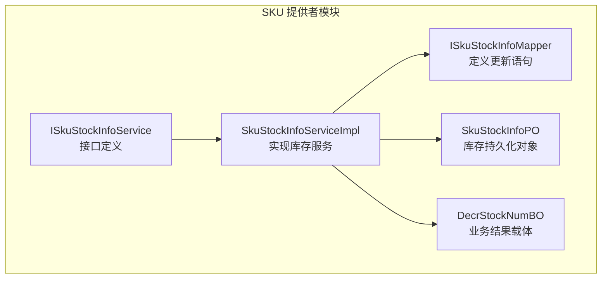
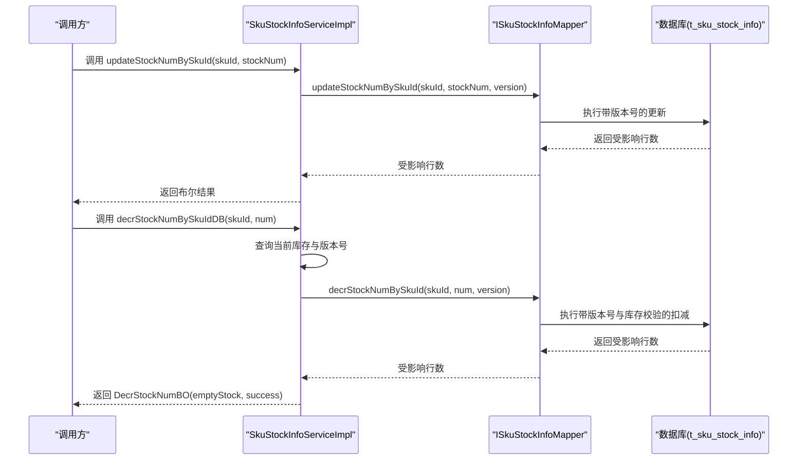
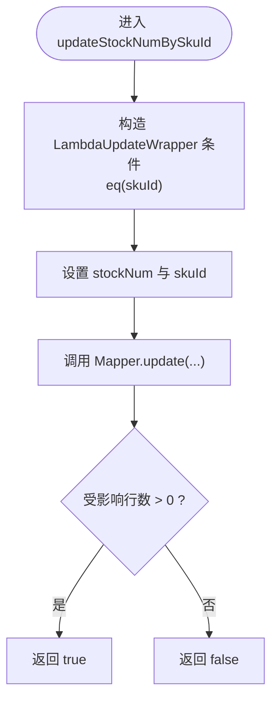
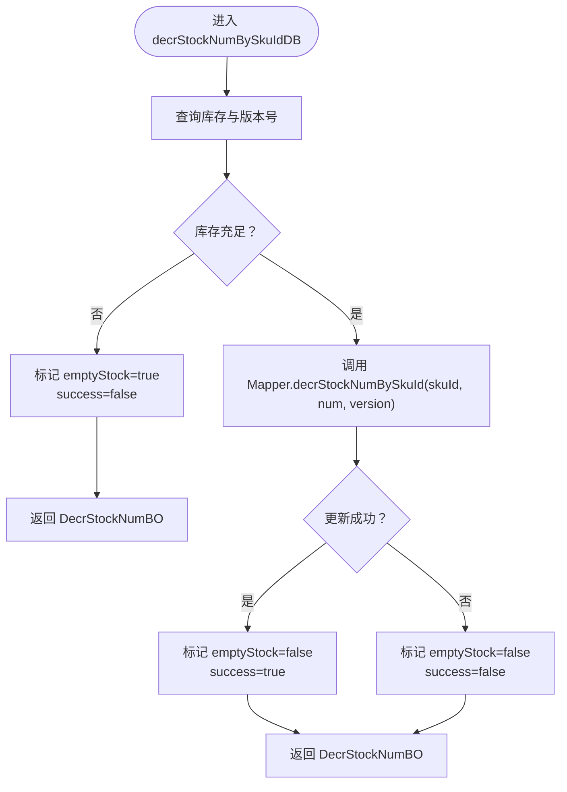
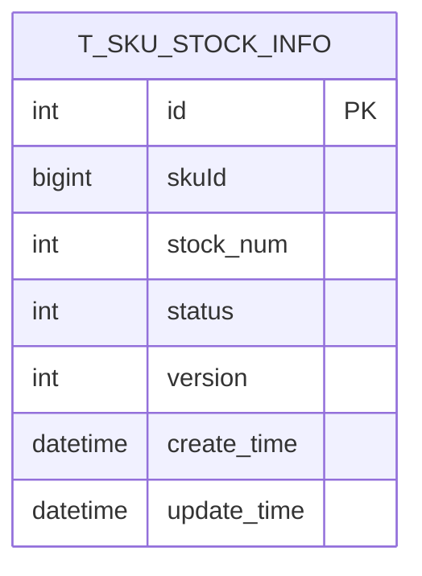
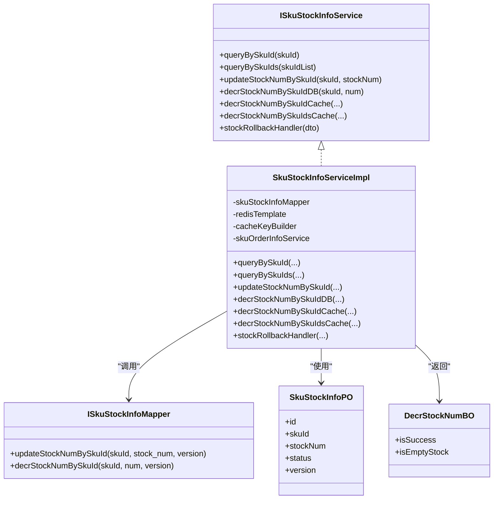

# 基于数据库的库存管理

<cite>
**本文引用的文件列表**
- [SkuStockInfoServiceImpl.java](file://live-sku-provider/src/main/java/com/logilong/live/sku/provider/service/impl/SkuStockInfoServiceImpl.java)
- [ISkuStockInfoMapper.java](file://live-sku-provider/src/main/java/com/logilong/live/sku/provider/dao/mapper/ISkuStockInfoMapper.java)
- [SkuStockInfoPO.java](file://live-sku-provider/src/main/java/com/logilong/live/sku/provider/dao/po/SkuStockInfoPO.java)
- [ISkuStockInfoService.java](file://live-sku-provider/src/main/java/com/logilong/live/sku/provider/service/ISkuStockInfoService.java)
- [DecrStockNumBO.java](file://live-sku-provider/src/main/java/com/logilong/live/sku/provider/service/bo/DecrStockNumBO.java)
</cite>

## 目录
1. [引言](#引言)
2. [项目结构](#项目结构)
3. [核心组件](#核心组件)
4. [架构总览](#架构总览)
5. [详细组件分析](#详细组件分析)
6. [依赖关系分析](#依赖关系分析)
7. [性能与并发特性](#性能与并发特性)
8. [故障排查指南](#故障排查指南)
9. [结论](#结论)

## 引言
本文件聚焦于数据库层面的库存管理机制，围绕 SkuStockInfoServiceImpl 中的 updateStockNumBySkuId 与 decrStockNumBySkuIdDB 两个方法展开，系统性解析以下内容：
- updateStockNumBySkuId 如何借助 MyBatis-Plus 的 LambdaUpdateWrapper 实现精准更新；
- 结合 ISkuStockInfoMapper 的 XML 映射语句说明 SQL 执行逻辑；
- decrStockNumBySkuIdDB 中基于版本号（version 字段）的乐观锁机制，确保并发更新时的数据一致性；
- DecrStockNumBO 对象作为业务结果载体，包含 emptyStock（库存是否为空）与 success（操作是否成功）两个关键状态字段，为上层调用提供精细化控制能力。

## 项目结构
本次分析涉及的模块与文件主要位于 live-sku-provider 子模块中，相关职责划分如下：
- 接口层：ISkuStockInfoService 定义库存服务对外能力；
- 实现层：SkuStockInfoServiceImpl 提供库存查询、更新与扣减等实现；
- 数据访问层：ISkuStockInfoMapper 定义库存表的更新语句；
- 持久化对象：SkuStockInfoPO 描述 t_sku_stock_info 表结构，包含版本号字段；
- 业务结果对象：DecrStockNumBO 用于承载扣减结果状态。

图表来源
- [SkuStockInfoServiceImpl.java](file://live-sku-provider/src/main/java/com/logilong/live/sku/provider/service/impl/SkuStockInfoServiceImpl.java#L1-L151)
- [ISkuStockInfoMapper.java](file://live-sku-provider/src/main/java/com/logilong/live/sku/provider/dao/mapper/ISkuStockInfoMapper.java#L1-L18)
- [SkuStockInfoPO.java](file://live-sku-provider/src/main/java/com/logilong/live/sku/provider/dao/po/SkuStockInfoPO.java#L1-L22)
- [ISkuStockInfoService.java](file://live-sku-provider/src/main/java/com/logilong/live/sku/provider/service/ISkuStockInfoService.java#L1-L49)
- [DecrStockNumBO.java](file://live-sku-provider/src/main/java/com/logilong/live/sku/provider/service/bo/DecrStockNumBO.java#L1-L17)

章节来源
- [SkuStockInfoServiceImpl.java](file://live-sku-provider/src/main/java/com/logilong/live/sku/provider/service/impl/SkuStockInfoServiceImpl.java#L1-L151)
- [ISkuStockInfoMapper.java](file://live-sku-provider/src/main/java/com/logilong/live/sku/provider/dao/mapper/ISkuStockInfoMapper.java#L1-L18)
- [SkuStockInfoPO.java](file://live-sku-provider/src/main/java/com/logilong/live/sku/provider/dao/po/SkuStockInfoPO.java#L1-L22)
- [ISkuStockInfoService.java](file://live-sku-provider/src/main/java/com/logilong/live/sku/provider/service/ISkuStockInfoService.java#L1-L49)
- [DecrStockNumBO.java](file://live-sku-provider/src/main/java/com/logilong/live/sku/provider/service/bo/DecrStockNumBO.java#L1-L17)

## 核心组件
- SkuStockInfoServiceImpl：实现库存查询、批量查询、数据库更新与扣减、缓存扣减、库存回滚等能力；其中 updateStockNumBySkuId 与 decrStockNumBySkuIdDB 是本次分析的重点。
- ISkuStockInfoMapper：定义库存表的更新语句，包括按版本号更新与按版本号扣减。
- SkuStockInfoPO：库存持久化对象，包含主键、skuId、stockNum、status、version 等字段。
- DecrStockNumBO：业务结果载体，返回 emptyStock 与 success 两个状态位，便于上层做精细化控制。

章节来源
- [SkuStockInfoServiceImpl.java](file://live-sku-provider/src/main/java/com/logilong/live/sku/provider/service/impl/SkuStockInfoServiceImpl.java#L1-L151)
- [ISkuStockInfoMapper.java](file://live-sku-provider/src/main/java/com/logilong/live/sku/provider/dao/mapper/ISkuStockInfoMapper.java#L1-L18)
- [SkuStockInfoPO.java](file://live-sku-provider/src/main/java/com/logilong/live/sku/provider/dao/po/SkuStockInfoPO.java#L1-L22)
- [DecrStockNumBO.java](file://live-sku-provider/src/main/java/com/logilong/live/sku/provider/service/bo/DecrStockNumBO.java#L1-L17)

## 架构总览
下图展示了库存服务在数据库层的调用链路与数据流向，重点体现 updateStockNumBySkuId 与 decrStockNumBySkuIdDB 的执行路径与乐观锁校验。

图表来源
- [SkuStockInfoServiceImpl.java](file://live-sku-provider/src/main/java/com/logilong/live/sku/provider/service/impl/SkuStockInfoServiceImpl.java#L77-L100)
- [ISkuStockInfoMapper.java](file://live-sku-provider/src/main/java/com/logilong/live/sku/provider/dao/mapper/ISkuStockInfoMapper.java#L11-L16)

## 详细组件分析

### updateStockNumBySkuId 方法：精准更新与 SQL 执行
- 实现要点
  - 使用 MyBatis-Plus 的 LambdaUpdateWrapper 构造条件，仅对 skuId 匹配的记录进行更新；
  - 将 stockNum 写入目标字段，同时保留 skuId 以满足更新条件；
  - 通过 Mapper 的 update 方法执行更新，返回受影响行数，大于 0 表示更新成功。
- SQL 执行逻辑
  - ISkuStockInfoMapper 中定义了带版本号的更新语句，确保只有当版本号匹配时才允许更新，避免并发覆盖；
  - 该方法不进行库存数量校验，仅执行赋值更新，适合外部已做前置校验或批量同步场景。
- 复杂度与性能
  - 条件更新复杂度 O(1)，命中索引（skuId）时更新开销低；
  - 版本号冲突会导致更新失败，需由上层重试或补偿。

图表来源
- [SkuStockInfoServiceImpl.java](file://live-sku-provider/src/main/java/com/logilong/live/sku/provider/service/impl/SkuStockInfoServiceImpl.java#L77-L85)
- [ISkuStockInfoMapper.java](file://live-sku-provider/src/main/java/com/logilong/live/sku/provider/dao/mapper/ISkuStockInfoMapper.java#L11-L13)

章节来源
- [SkuStockInfoServiceImpl.java](file://live-sku-provider/src/main/java/com/logilong/live/sku/provider/service/impl/SkuStockInfoServiceImpl.java#L77-L85)
- [ISkuStockInfoMapper.java](file://live-sku-provider/src/main/java/com/logilong/live/sku/provider/dao/mapper/ISkuStockInfoMapper.java#L11-L13)

### decrStockNumBySkuIdDB 方法：基于版本号的乐观锁扣减
- 实现要点
  - 先查询当前库存与版本号；
  - 在内存侧进行库存充足性校验（库存为 0 或不足则直接失败），避免无效数据库往返；
  - 调用 Mapper 的带版本号扣减方法，数据库层再次校验库存非负且版本号一致；
  - 将结果封装到 DecrStockNumBO：emptyStock 标记是否因缺货导致失败，success 标记数据库更新是否成功。
- 乐观锁机制
  - 版本号字段参与 WHERE 条件，确保“读-改-写”过程中未被其他事务修改；
  - 若版本号不一致，更新失败，上层可据此重试或回退。
- 业务结果载体 DecrStockNumBO
  - emptyStock：true 表示因库存不足或为 0 导致失败；
  - success：true 表示数据库层扣减成功（受版本号约束）。

图表来源
- [SkuStockInfoServiceImpl.java](file://live-sku-provider/src/main/java/com/logilong/live/sku/provider/service/impl/SkuStockInfoServiceImpl.java#L88-L100)
- [ISkuStockInfoMapper.java](file://live-sku-provider/src/main/java/com/logilong/live/sku/provider/dao/mapper/ISkuStockInfoMapper.java#L15-L16)
- [DecrStockNumBO.java](file://live-sku-provider/src/main/java/com/logilong/live/sku/provider/service/bo/DecrStockNumBO.java#L1-L17)

章节来源
- [SkuStockInfoServiceImpl.java](file://live-sku-provider/src/main/java/com/logilong/live/sku/provider/service/impl/SkuStockInfoServiceImpl.java#L88-L100)
- [ISkuStockInfoMapper.java](file://live-sku-provider/src/main/java/com/logilong/live/sku/provider/dao/mapper/ISkuStockInfoMapper.java#L15-L16)
- [DecrStockNumBO.java](file://live-sku-provider/src/main/java/com/logilong/live/sku/provider/service/bo/DecrStockNumBO.java#L1-L17)

### 数据模型与版本号字段
- SkuStockInfoPO
  - 表名：t_sku_stock_info；
  - 关键字段：skuId、stockNum、status、version；
  - 版本号用于乐观锁，防止并发覆盖。
- 乐观锁约束
  - 更新与扣减均要求 version 匹配；
  - 扣减还要求扣减后库存非负，双重保障一致性与正确性。

图表来源
- [SkuStockInfoPO.java](file://live-sku-provider/src/main/java/com/logilong/live/sku/provider/dao/po/SkuStockInfoPO.java#L1-L22)
- [ISkuStockInfoMapper.java](file://live-sku-provider/src/main/java/com/logilong/live/sku/provider/dao/mapper/ISkuStockInfoMapper.java#L11-L16)

章节来源
- [SkuStockInfoPO.java](file://live-sku-provider/src/main/java/com/logilong/live/sku/provider/dao/po/SkuStockInfoPO.java#L1-L22)
- [ISkuStockInfoMapper.java](file://live-sku-provider/src/main/java/com/logilong/live/sku/provider/dao/mapper/ISkuStockInfoMapper.java#L11-L16)

## 依赖关系分析
- 组件耦合
  - SkuStockInfoServiceImpl 依赖 ISkuStockInfoMapper 进行数据库更新；
  - 通过 SkuStockInfoPO 与数据库表结构对应，版本号字段贯穿更新与扣减流程；
  - DecrStockNumBO 作为返回值，向上游暴露业务状态。
- 外部依赖
  - MyBatis-Plus 提供 LambdaUpdateWrapper 与 Mapper 接口；
  - 数据库驱动负责执行带版本号的 UPDATE 语句。

图表来源
- [ISkuStockInfoService.java](file://live-sku-provider/src/main/java/com/logilong/live/sku/provider/service/ISkuStockInfoService.java#L1-L49)
- [SkuStockInfoServiceImpl.java](file://live-sku-provider/src/main/java/com/logilong/live/sku/provider/service/impl/SkuStockInfoServiceImpl.java#L1-L151)
- [ISkuStockInfoMapper.java](file://live-sku-provider/src/main/java/com/logilong/live/sku/provider/dao/mapper/ISkuStockInfoMapper.java#L1-L18)
- [SkuStockInfoPO.java](file://live-sku-provider/src/main/java/com/logilong/live/sku/provider/dao/po/SkuStockInfoPO.java#L1-L22)
- [DecrStockNumBO.java](file://live-sku-provider/src/main/java/com/logilong/live/sku/provider/service/bo/DecrStockNumBO.java#L1-L17)

章节来源
- [ISkuStockInfoService.java](file://live-sku-provider/src/main/java/com/logilong/live/sku/provider/service/ISkuStockInfoService.java#L1-L49)
- [SkuStockInfoServiceImpl.java](file://live-sku-provider/src/main/java/com/logilong/live/sku/provider/service/impl/SkuStockInfoServiceImpl.java#L1-L151)
- [ISkuStockInfoMapper.java](file://live-sku-provider/src/main/java/com/logilong/live/sku/provider/dao/mapper/ISkuStockInfoMapper.java#L1-L18)
- [SkuStockInfoPO.java](file://live-sku-provider/src/main/java/com/logilong/live/sku/provider/dao/po/SkuStockInfoPO.java#L1-L22)
- [DecrStockNumBO.java](file://live-sku-provider/src/main/java/com/logilong/live/sku/provider/service/bo/DecrStockNumBO.java#L1-L17)

## 性能与并发特性
- 并发一致性
  - 通过版本号实现乐观锁，避免丢失更新；
  - 数据库层二次校验库存非负，防止超卖。
- 性能特征
  - updateStockNumBySkuId 为单条记录更新，复杂度低；
  - decrStockNumBySkuIdDB 在内存侧提前短路（库存不足），减少无效数据库往返；
  - 若版本号冲突，建议上层采用指数退避重试策略，降低竞争峰值。
- 适用场景
  - 高并发下单扣减：优先使用 decrStockNumBySkuIdDB，结合上层幂等与重试；
  - 批量同步：使用 updateStockNumBySkuId，确保版本号一致。

[本节为通用性能讨论，无需列出具体文件来源]

## 故障排查指南
- 扣减失败但库存充足
  - 检查版本号是否被其他事务更新；确认 decrStockNumBySkuIdDB 是否传入了正确的版本号；
  - 观察 emptyStock 是否为 false，success 是否为 false，定位为版本冲突而非库存不足。
- 库存扣减后仍显示为 0
  - 确认数据库中 stock_num 是否存在负值风险；数据库层扣减语句已保证非负，若仍出现异常，检查上游是否绕过了 decrStockNumBySkuIdDB。
- 更新失败
  - updateStockNumBySkuId 返回 false 通常表示未匹配到记录或版本号不一致；检查 skuId 与版本号是否正确。
- 上层调用建议
  - 对于扣减失败，优先根据 DecrStockNumBO.emptyStock 判断是否应提示“售罄”，再根据 success 判断是否需要重试。

章节来源
- [SkuStockInfoServiceImpl.java](file://live-sku-provider/src/main/java/com/logilong/live/sku/provider/service/impl/SkuStockInfoServiceImpl.java#L88-L100)
- [ISkuStockInfoMapper.java](file://live-sku-provider/src/main/java/com/logilong/live/sku/provider/dao/mapper/ISkuStockInfoMapper.java#L11-L16)
- [DecrStockNumBO.java](file://live-sku-provider/src/main/java/com/logilong/live/sku/provider/service/bo/DecrStockNumBO.java#L1-L17)

## 结论
- updateStockNumBySkuId 通过 LambdaUpdateWrapper 精准构造更新条件，并结合版本号约束，确保并发安全与数据一致性；
- decrStockNumBySkuIdDB 在内存侧进行快速库存校验，随后在数据库层以版本号与库存非负双重条件完成扣减，配合 DecrStockNumBO 为上层提供“是否售罄”和“是否成功”的双状态反馈；
- 该设计在高并发场景下兼顾性能与一致性，适合直播电商等强并发库存扣减场景。

[本节为总结性内容，无需列出具体文件来源]