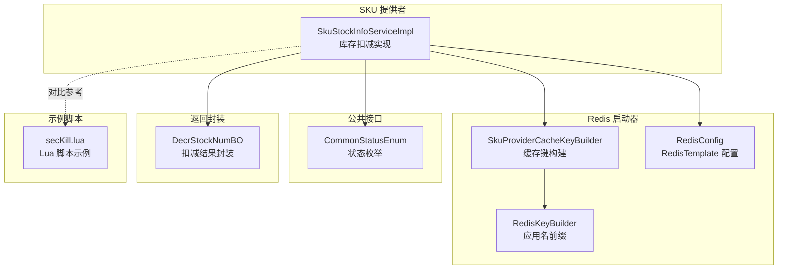
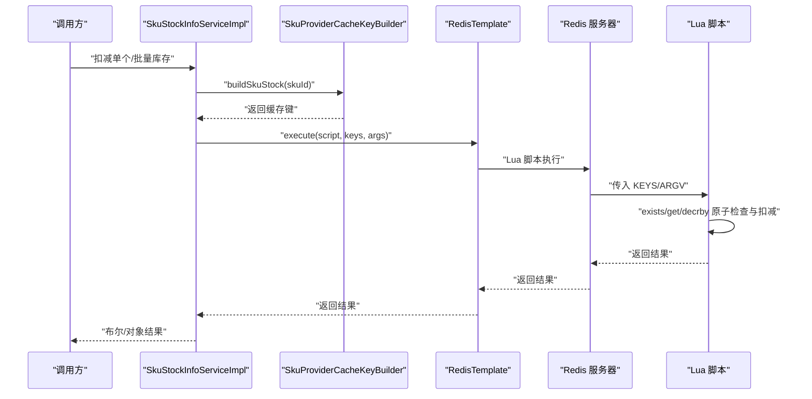
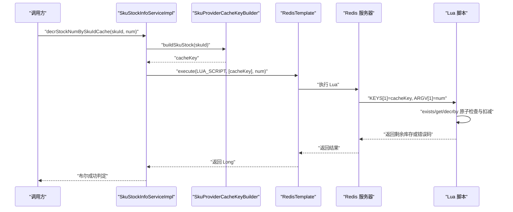
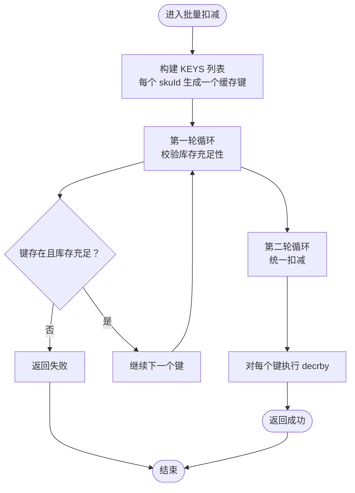
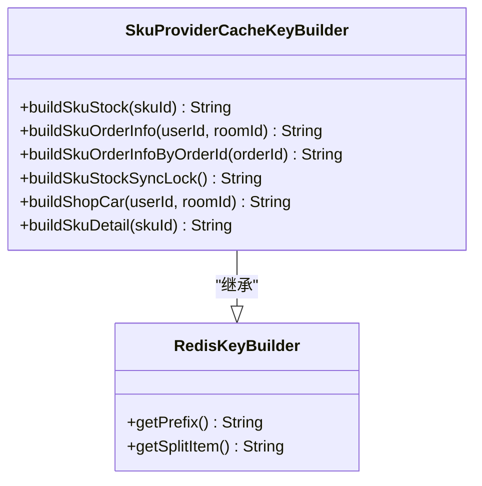
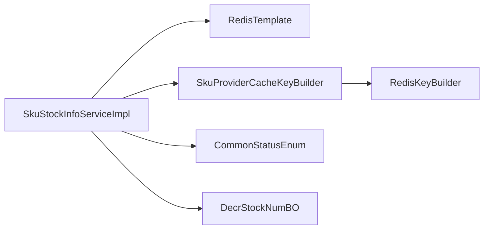

# 基于缓存的库存扣减

<cite>
**本文引用的文件列表**
- [SkuStockInfoServiceImpl.java](file://live-sku-provider/src/main/java/com/logilong/live/sku/provider/service/impl/SkuStockInfoServiceImpl.java)
- [SkuProviderCacheKeyBuilder.java](file://live-framework/redis-starter/src/main/java/com/logilong/live/framework/redis/starter/key/SkuProviderCacheKeyBuilder.java)
- [RedisKeyBuilder.java](file://live-framework/redis-starter/src/main/java/com/logilong/live/framework/redis/starter/key/RedisKeyBuilder.java)
- [RedisConfig.java](file://live-framework/redis-starter/src/main/java/com/logilong/live/framework/redis/starter/config/RedisConfig.java)
- [CommonStatusEnum.java](file://live-common-interface/src/main/java/com/logilong/live/common/interfaces/enums/CommonStatusEnum.java)
- [DecrStockNumBO.java](file://live-sku-provider/src/main/java/com/logilong/live/sku/provider/service/bo/DecrStockNumBO.java)
- [secKill.lua](file://live-gift-provider/src/main/resources/secKill.lua)
</cite>

## 目录
1. [引言](#引言)
2. [项目结构](#项目结构)
3. [核心组件](#核心组件)
4. [架构总览](#架构总览)
5. [详细组件分析](#详细组件分析)
6. [依赖关系分析](#依赖关系分析)
7. [性能考量](#性能考量)
8. [故障排查指南](#故障排查指南)
9. [结论](#结论)

## 引言
本文件围绕“基于Redis与Lua脚本实现的高并发库存扣减”展开，重点解析以下内容：
- SkuStockInfoServiceImpl 中的单个与批量库存扣减方法如何通过 RedisTemplate.execute 调用 Lua 脚本，实现原子性检查与扣减，避免超卖。
- Lua 脚本中 KEYS 与 ARGV 的参数传递方式，以及如何通过 redis.call('exists')、redis.call('get') 和 redis.call('decrby') 保证原子性。
- 结合 SkuProviderCacheKeyBuilder 的 buildSkuStock 方法，解释缓存键的生成规则及其在分布式环境下的唯一性保障。
- 批量扣减脚本的双重循环结构：第一轮校验所有商品库存是否充足，第二轮统一执行扣减，确保事务一致性。

## 项目结构
本次文档聚焦于库存扣减相关的关键代码位置：
- 业务服务实现：live-sku-provider 模块的 SkuStockInfoServiceImpl
- 缓存键构建：live-framework-redis-starter 模块的 SkuProviderCacheKeyBuilder 及其父类 RedisKeyBuilder
- Redis 客户端配置：live-framework-redis-starter 模块的 RedisConfig
- 公共状态枚举：live-common-interface 模块的 CommonStatusEnum
- 返回结果封装：live-sku-provider 模块的 DecrStockNumBO
- 示例 Lua 脚本：live-gift-provider 模块的 secKill.lua（用于对比参考）

图表来源
- [SkuStockInfoServiceImpl.java](file://live-sku-provider/src/main/java/com/logilong/live/sku/provider/service/impl/SkuStockInfoServiceImpl.java#L1-L151)
- [SkuProviderCacheKeyBuilder.java](file://live-framework/redis-starter/src/main/java/com/logilong/live/framework/redis/starter/key/SkuProviderCacheKeyBuilder.java#L1-L41)
- [RedisKeyBuilder.java](file://live-framework/redis-starter/src/main/java/com/logilong/live/framework/redis/starter/key/RedisKeyBuilder.java#L1-L22)
- [RedisConfig.java](file://live-framework/redis-starter/src/main/java/com/logilong/live/framework/redis/starter/config/RedisConfig.java#L1-L28)
- [CommonStatusEnum.java](file://live-common-interface/src/main/java/com/logilong/live/common/interfaces/enums/CommonStatusEnum.java#L1-L17)
- [DecrStockNumBO.java](file://live-sku-provider/src/main/java/com/logilong/live/sku/provider/service/bo/DecrStockNumBO.java#L1-L17)
- [secKill.lua](file://live-gift-provider/src/main/resources/secKill.lua#L1-L9)

章节来源
- [SkuStockInfoServiceImpl.java](file://live-sku-provider/src/main/java/com/logilong/live/sku/provider/service/impl/SkuStockInfoServiceImpl.java#L1-L151)
- [SkuProviderCacheKeyBuilder.java](file://live-framework/redis-starter/src/main/java/com/logilong/live/framework/redis/starter/key/SkuProviderCacheKeyBuilder.java#L1-L41)
- [RedisKeyBuilder.java](file://live-framework/redis-starter/src/main/java/com/logilong/live/framework/redis/starter/key/RedisKeyBuilder.java#L1-L22)
- [RedisConfig.java](file://live-framework/redis-starter/src/main/java/com/logilong/live/framework/redis/starter/config/RedisConfig.java#L1-L28)
- [CommonStatusEnum.java](file://live-common-interface/src/main/java/com/logilong/live/common/interfaces/enums/CommonStatusEnum.java#L1-L17)
- [DecrStockNumBO.java](file://live-sku-provider/src/main/java/com/logilong/live/sku/provider/service/bo/DecrStockNumBO.java#L1-L17)
- [secKill.lua](file://live-gift-provider/src/main/resources/secKill.lua#L1-L9)

## 核心组件
- SkuStockInfoServiceImpl：提供单个与批量库存扣减能力，内部通过 RedisTemplate.execute 调用 Lua 脚本，保证原子性。
- SkuProviderCacheKeyBuilder：负责生成 SKU 库存缓存键，确保分布式环境下键的唯一性。
- RedisKeyBuilder：提供应用名前缀与分隔符，统一缓存键命名规范。
- RedisConfig：配置 RedisTemplate 的序列化策略，确保键值类型正确。
- CommonStatusEnum：用于查询 SKU 库存时的状态过滤。
- DecrStockNumBO：封装单个扣减的结果与是否缺货状态。
- secKill.lua：作为库存扣减 Lua 脚本的参考示例，展示 KEYS/ARGV 的使用模式。

章节来源
- [SkuStockInfoServiceImpl.java](file://live-sku-provider/src/main/java/com/logilong/live/sku/provider/service/impl/SkuStockInfoServiceImpl.java#L1-L151)
- [SkuProviderCacheKeyBuilder.java](file://live-framework/redis-starter/src/main/java/com/logilong/live/framework/redis/starter/key/SkuProviderCacheKeyBuilder.java#L1-L41)
- [RedisKeyBuilder.java](file://live-framework/redis-starter/src/main/java/com/logilong/live/framework/redis/starter/key/RedisKeyBuilder.java#L1-L22)
- [RedisConfig.java](file://live-framework/redis-starter/src/main/java/com/logilong/live/framework/redis/starter/config/RedisConfig.java#L1-L28)
- [CommonStatusEnum.java](file://live-common-interface/src/main/java/com/logilong/live/common/interfaces/enums/CommonStatusEnum.java#L1-L17)
- [DecrStockNumBO.java](file://live-sku-provider/src/main/java/com/logilong/live/sku/provider/service/bo/DecrStockNumBO.java#L1-L17)
- [secKill.lua](file://live-gift-provider/src/main/resources/secKill.lua#L1-L9)

## 架构总览
下图展示了从服务层到 Redis 的调用链路，以及 Lua 脚本在 Redis 侧的原子执行流程。

图表来源
- [SkuStockInfoServiceImpl.java](file://live-sku-provider/src/main/java/com/logilong/live/sku/provider/service/impl/SkuStockInfoServiceImpl.java#L102-L130)
- [SkuProviderCacheKeyBuilder.java](file://live-framework/redis-starter/src/main/java/com/logilong/live/framework/redis/starter/key/SkuProviderCacheKeyBuilder.java#L29-L31)
- [RedisConfig.java](file://live-framework/redis-starter/src/main/java/com/logilong/live/framework/redis/starter/config/RedisConfig.java#L14-L26)

## 详细组件分析

### 单个库存扣减：decrStockNumBySkuIdCache
该方法通过 RedisTemplate.execute 调用单体 Lua 脚本，实现“存在即检查、不足即失败”的原子扣减逻辑。关键点如下：
- KEYS 参数：仅包含一个缓存键（由 buildSkuStock 生成）。
- ARGV 参数：包含扣减数量。
- 原子性保障：
  - 使用 redis.call('exists') 判断键是否存在；
  - 使用 redis.call('get') 获取当前库存；
  - 使用 redis.call('decrby') 执行扣减；
  - 整个过程在 Redis 侧原子执行，避免竞态条件导致超卖。

图表来源
- [SkuStockInfoServiceImpl.java](file://live-sku-provider/src/main/java/com/logilong/live/sku/provider/service/impl/SkuStockInfoServiceImpl.java#L102-L113)
- [SkuProviderCacheKeyBuilder.java](file://live-framework/redis-starter/src/main/java/com/logilong/live/framework/redis/starter/key/SkuProviderCacheKeyBuilder.java#L29-L31)

章节来源
- [SkuStockInfoServiceImpl.java](file://live-sku-provider/src/main/java/com/logilong/live/sku/provider/service/impl/SkuStockInfoServiceImpl.java#L102-L113)

### 批量库存扣减：decrStockNumBySkuIdsCache
该方法通过 RedisTemplate.execute 调用批量 Lua 脚本，采用“先校验后扣减”的双阶段设计，确保事务一致性：
- KEYS 参数：包含多个缓存键（每个 skuId 对应一个键）。
- ARGV 参数：包含扣减数量与键的数量。
- 双重循环结构：
  - 第一轮遍历 KEYS，逐个检查 redis.call('exists') 与 redis.call('get')，若任一库存不足则立即返回失败；
  - 第二轮遍历 KEYS，统一执行 redis.call('decrby')，确保全部扣减或全部不扣减。

图表来源
- [SkuStockInfoServiceImpl.java](file://live-sku-provider/src/main/java/com/logilong/live/sku/provider/service/impl/SkuStockInfoServiceImpl.java#L115-L129)

章节来源
- [SkuStockInfoServiceImpl.java](file://live-sku-provider/src/main/java/com/logilong/live/sku/provider/service/impl/SkuStockInfoServiceImpl.java#L115-L129)

### 缓存键生成与唯一性保障：buildSkuStock
- 键构成：应用名前缀 + 分隔符 + 固定标识 + 分隔符 + skuId。
- 前缀来源：RedisKeyBuilder.getPrefix() 由 spring.application.name 注入。
- 唯一性保障：
  - 不同应用实例通过不同的应用名前缀隔离；
  - 同一应用内通过固定标识区分库存键；
  - 通过 skuId 保证不同商品的键唯一。

图表来源
- [RedisKeyBuilder.java](file://live-framework/redis-starter/src/main/java/com/logilong/live/framework/redis/starter/key/RedisKeyBuilder.java#L1-L22)
- [SkuProviderCacheKeyBuilder.java](file://live-framework/redis-starter/src/main/java/com/logilong/live/framework/redis/starter/key/SkuProviderCacheKeyBuilder.java#L1-L41)

章节来源
- [RedisKeyBuilder.java](file://live-framework/redis-starter/src/main/java/com/logilong/live/framework/redis/starter/key/RedisKeyBuilder.java#L1-L22)
- [SkuProviderCacheKeyBuilder.java](file://live-framework/redis-starter/src/main/java/com/logilong/live/framework/redis/starter/key/SkuProviderCacheKeyBuilder.java#L1-L41)

### RedisTemplate 配置与序列化
- RedisTemplate 使用 StringRedisSerializer 作为键序列化器，确保键为字符串；
- 使用自定义 JSON 序列化器作为值序列化器，保证对象类型的存储与读取；
- 该配置与 Lua 脚本的字符串键/数值值交互相匹配，避免类型不一致导致的异常。

章节来源
- [RedisConfig.java](file://live-framework/redis-starter/src/main/java/com/logilong/live/framework/redis/starter/config/RedisConfig.java#L14-L26)

### 数据库回滚与最终一致性
- 当订单未支付或需要回滚时，服务会将对应 SKU 的缓存库存加回；
- 数据库层面的回滚与异步补偿通过业务流程控制，保证最终一致性。

章节来源
- [SkuStockInfoServiceImpl.java](file://live-sku-provider/src/main/java/com/logilong/live/sku/provider/service/impl/SkuStockInfoServiceImpl.java#L132-L149)

## 依赖关系分析
- SkuStockInfoServiceImpl 依赖：
  - RedisTemplate：执行 Lua 脚本；
  - SkuProviderCacheKeyBuilder：生成缓存键；
  - CommonStatusEnum：查询时的状态过滤；
  - DecrStockNumBO：返回单个扣减结果封装。
- SkuProviderCacheKeyBuilder 继承 RedisKeyBuilder，统一应用名前缀与分隔符。

图表来源
- [SkuStockInfoServiceImpl.java](file://live-sku-provider/src/main/java/com/logilong/live/sku/provider/service/impl/SkuStockInfoServiceImpl.java#L1-L151)
- [SkuProviderCacheKeyBuilder.java](file://live-framework/redis-starter/src/main/java/com/logilong/live/framework/redis/starter/key/SkuProviderCacheKeyBuilder.java#L1-L41)
- [RedisKeyBuilder.java](file://live-framework/redis-starter/src/main/java/com/logilong/live/framework/redis/starter/key/RedisKeyBuilder.java#L1-L22)
- [CommonStatusEnum.java](file://live-common-interface/src/main/java/com/logilong/live/common/interfaces/enums/CommonStatusEnum.java#L1-L17)
- [DecrStockNumBO.java](file://live-sku-provider/src/main/java/com/logilong/live/sku/provider/service/bo/DecrStockNumBO.java#L1-L17)

章节来源
- [SkuStockInfoServiceImpl.java](file://live-sku-provider/src/main/java/com/logilong/live/sku/provider/service/impl/SkuStockInfoServiceImpl.java#L1-L151)
- [SkuProviderCacheKeyBuilder.java](file://live-framework/redis-starter/src/main/java/com/logilong/live/framework/redis/starter/key/SkuProviderCacheKeyBuilder.java#L1-L41)
- [RedisKeyBuilder.java](file://live-framework/redis-starter/src/main/java/com/logilong/live/framework/redis/starter/key/RedisKeyBuilder.java#L1-L22)
- [CommonStatusEnum.java](file://live-common-interface/src/main/java/com/logilong/live/common/interfaces/enums/CommonStatusEnum.java#L1-L17)
- [DecrStockNumBO.java](file://live-sku-provider/src/main/java/com/logilong/live/sku/provider/service/bo/DecrStockNumBO.java#L1-L17)

## 性能考量
- 原子性与网络往返：
  - Lua 脚本在 Redis 侧执行，避免多次网络往返，显著降低延迟与竞态风险。
- 批量扣减优化：
  - 双重循环先校验再扣减，减少不必要的写放大；
  - 若任一商品库存不足，快速失败，避免部分扣减引发的数据不一致。
- 键空间管理：
  - 使用应用名前缀与固定标识，便于运维与清理；
  - SKU 库存键建议设置合理的过期时间，防止脏数据长期占用内存。
- 并发与锁：
  - 若存在极端高并发场景，可配合 SKU 级别的同步锁键（如 buildSkuStockSyncLock）进行额外保护，避免瞬时峰值冲击。

## 故障排查指南
- 扣减失败返回值：
  - 单个扣减：当库存不足或键不存在时，Lua 脚本返回负值；服务层将其转换为布尔失败。
  - 批量扣减：任一商品库存不足即整体失败。
- 常见问题定位：
  - 缓存键不一致：确认 buildSkuStock 生成的键与实际写入键一致；
  - 库存不足：检查 Redis 中对应键的值是否为正数；
  - 脚本参数：确认 KEYS 与 ARGV 的数量与顺序正确；
  - 回滚处理：若订单未支付，需确保缓存库存已恢复。
- 日志与监控：
  - 记录每次扣减前后的库存值；
  - 对批量扣减失败的 SKU 列表进行告警。

章节来源
- [SkuStockInfoServiceImpl.java](file://live-sku-provider/src/main/java/com/logilong/live/sku/provider/service/impl/SkuStockInfoServiceImpl.java#L102-L130)
- [SkuStockInfoServiceImpl.java](file://live-sku-provider/src/main/java/com/logilong/live/sku/provider/service/impl/SkuStockInfoServiceImpl.java#L132-L149)

## 结论
通过 Redis 与 Lua 脚本的组合，SkuStockInfoServiceImpl 实现了高并发场景下的原子性库存扣减：
- 单个扣减：利用 Lua 原子指令在 Redis 侧完成存在性检查与扣减，避免超卖。
- 批量扣减：采用“先校验后扣减”的双阶段设计，确保事务一致性。
- 缓存键：基于应用名前缀与固定标识，保证分布式环境下的唯一性与可维护性。
- 配置与封装：RedisTemplate 的合理配置与返回封装，提升了系统的稳定性与可读性。