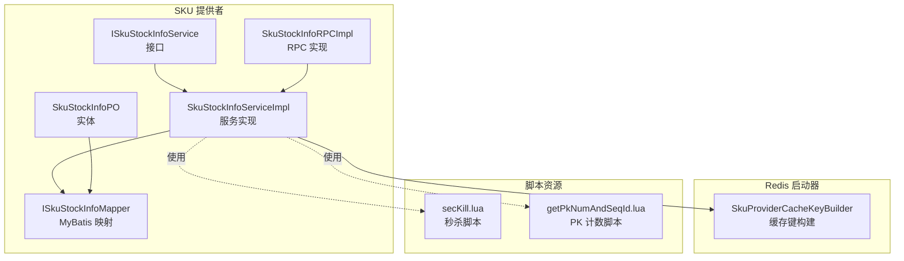
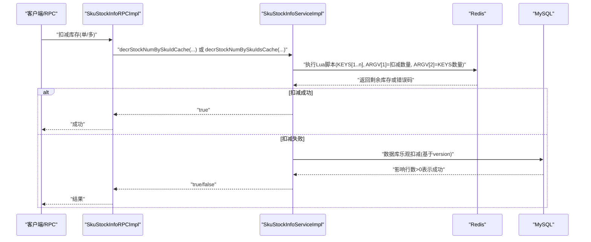
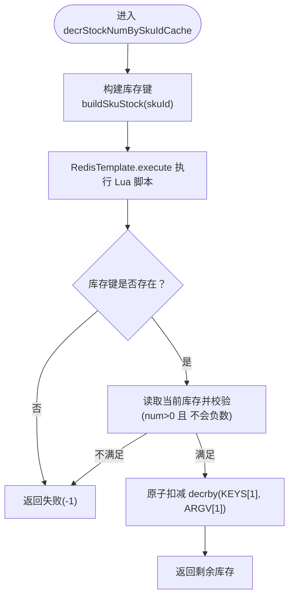
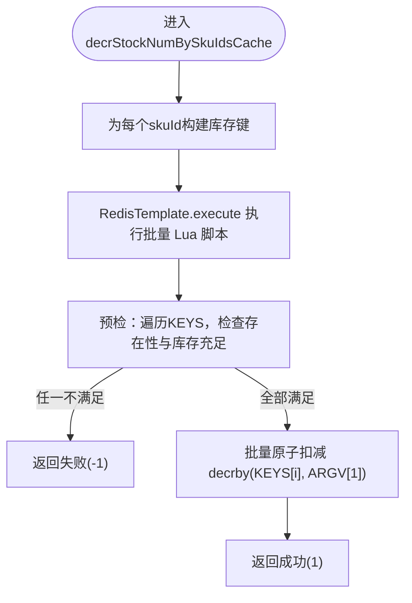
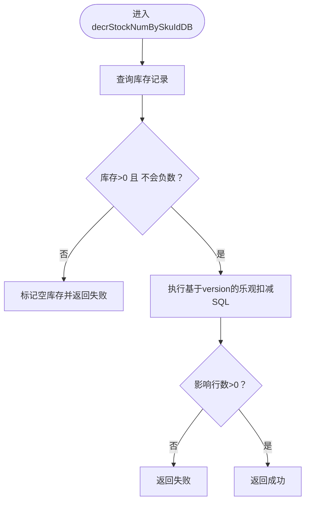
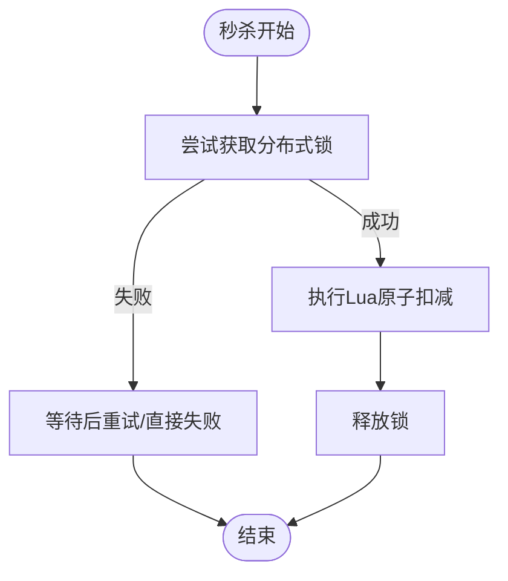
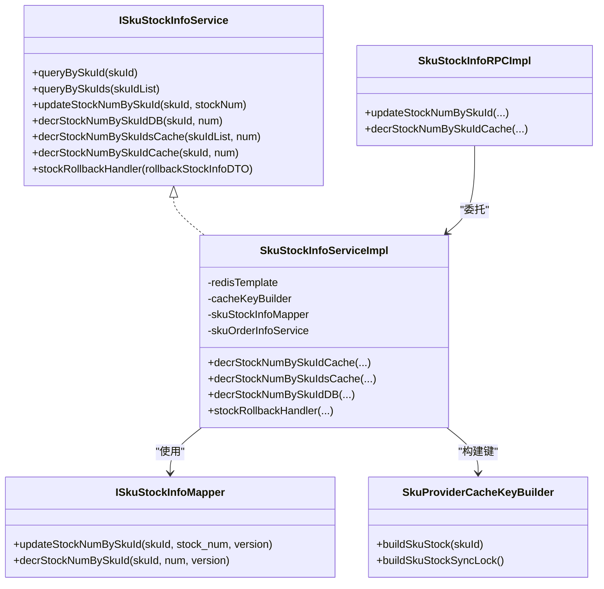

# 核心库存操作

<cite>
**本文引用的文件列表**
- [SkuStockInfoServiceImpl.java](file://live-sku-provider/src/main/java/com/logilong/live/sku/provider/service/impl/SkuStockInfoServiceImpl.java)
- [ISkuStockInfoService.java](file://live-sku-provider/src/main/java/com/logilong/live/sku/provider/service/ISkuStockInfoService.java)
- [ISkuStockInfoMapper.java](file://live-sku-provider/src/main/java/com/logilong/live/sku/provider/dao/mapper/ISkuStockInfoMapper.java)
- [SkuStockInfoRPCImpl.java](file://live-sku-provider/src/main/java/com/logilong/live/sku/provider/rpc/SkuStockInfoRPCImpl.java)
- [SkuProviderCacheKeyBuilder.java](file://live-framework/live-framework-redis-starter/src/main/java/com/logilong/live/framework/redis/starter/key/SkuProviderCacheKeyBuilder.java)
- [secKill.lua](file://live-gift-provider/src/main/resources/secKill.lua)
- [getPkNumAndSeqId.lua](file://live-gift-provider/src/main/resources/getPkNumAndSeqId.lua)
- [SkuStockInfoPO.java](file://live-sku-provider/src/main/java/com/logilong/live/sku/provider/dao/po/SkuStockInfoPO.java)
</cite>

## 目录
1. [引言](#引言)
2. [项目结构](#项目结构)
3. [核心组件](#核心组件)
4. [架构总览](#架构总览)
5. [详细组件分析](#详细组件分析)
6. [依赖关系分析](#依赖关系分析)
7. [性能考量](#性能考量)
8. [故障排查指南](#故障排查指南)
9. [结论](#结论)

## 引言
本文件围绕“基于Lua脚本的高并发库存扣减机制”展开，重点解析以下内容：
- 单商品库存扣减 decrStockNumBySkuIdCache 的 Lua 原子脚本实现
- 批量商品库存扣减 decrStockNumBySkuIdsCache 的 Lua 原子脚本实现
- 脚本参数 KEYS 和 ARGV 的传递方式、库存存在性检查、余额/库存验证与原子性扣减逻辑
- 结合 SkuStockInfoServiceImpl 中 RedisTemplate.execute 的调用，说明 Lua 脚本如何在 Redis 集群中保持原子性
- Redis 分布式锁在秒杀场景的应用思路（以 secKill.lua 为例）
- updateStockNumBySkuIdDB 方法中通过 version 字段实现的数据库乐观锁，确保缓存与数据库双写一致性

## 项目结构
本仓库包含多个模块，库存相关的核心代码集中在 live-sku-provider 模块，Redis 键构建工具位于 live-framework 模块，秒杀示例脚本位于 live-gift-provider 模块。

图表来源
- [SkuStockInfoServiceImpl.java](file://live-sku-provider/src/main/java/com/logilong/live/sku/provider/service/impl/SkuStockInfoServiceImpl.java#L1-L151)
- [ISkuStockInfoService.java](file://live-sku-provider/src/main/java/com/logilong/live/sku/provider/service/ISkuStockInfoService.java#L1-L48)
- [ISkuStockInfoMapper.java](file://live-sku-provider/src/main/java/com/logilong/live/sku/provider/dao/mapper/ISkuStockInfoMapper.java#L1-L18)
- [SkuStockInfoRPCImpl.java](file://live-sku-provider/src/main/java/com/logilong/live/sku/provider/rpc/SkuStockInfoRPCImpl.java#L1-L63)
- [SkuProviderCacheKeyBuilder.java](file://live-framework/live-framework-redis-starter/src/main/java/com/logilong/live/framework/redis/starter/key/SkuProviderCacheKeyBuilder.java#L1-L41)
- [secKill.lua](file://live-gift-provider/src/main/resources/secKill.lua#L1-L9)
- [getPkNumAndSeqId.lua](file://live-gift-provider/src/main/resources/getPkNumAndSeqId.lua#L1-L17)

章节来源
- [SkuStockInfoServiceImpl.java](file://live-sku-provider/src/main/java/com/logilong/live/sku/provider/service/impl/SkuStockInfoServiceImpl.java#L1-L151)
- [SkuProviderCacheKeyBuilder.java](file://live-framework/live-framework-redis-starter/src/main/java/com/logilong/live/framework/redis/starter/key/SkuProviderCacheKeyBuilder.java#L1-L41)

## 核心组件
- SkuStockInfoServiceImpl：提供库存查询、Redis 原子扣减、数据库乐观扣减、库存回滚等能力
- ISkuStockInfoService：定义库存相关服务接口
- ISkuStockInfoMapper：定义基于乐观锁的数据库更新语句
- SkuProviderCacheKeyBuilder：统一构建 Redis 缓存键，含库存同步锁键
- secKill.lua：秒杀场景的库存扣减脚本示例
- getSkuStockAndSeqId.lua：PK 场景计数脚本示例

章节来源
- [ISkuStockInfoService.java](file://live-sku-provider/src/main/java/com/logilong/live/sku/provider/service/ISkuStockInfoService.java#L1-L48)
- [SkuStockInfoServiceImpl.java](file://live-sku-provider/src/main/java/com/logilong/live/sku/provider/service/impl/SkuStockInfoServiceImpl.java#L1-L151)
- [ISkuStockInfoMapper.java](file://live-sku-provider/src/main/java/com/logilong/live/sku/provider/dao/mapper/ISkuStockInfoMapper.java#L1-L18)
- [SkuProviderCacheKeyBuilder.java](file://live-framework/live-framework-redis-starter/src/main/java/com/logilong/live/framework/redis/starter/key/SkuProviderCacheKeyBuilder.java#L1-L41)
- [secKill.lua](file://live-gift-provider/src/main/resources/secKill.lua#L1-L9)
- [getPkNumAndSeqId.lua](file://live-gift-provider/src/main/resources/getPkNumAndSeqId.lua#L1-L17)

## 架构总览
整体流程：
- 前端或 RPC 层调用库存服务
- 服务层先尝试 Redis 原子扣减（Lua 脚本）
- 若 Redis 扣减失败，再尝试数据库乐观扣减（基于 version）
- 成功后可触发后续流程（如订单状态变更、库存回滚等）

图表来源
- [SkuStockInfoRPCImpl.java](file://live-sku-provider/src/main/java/com/logilong/live/sku/provider/rpc/SkuStockInfoRPCImpl.java#L1-L63)
- [SkuStockInfoServiceImpl.java](file://live-sku-provider/src/main/java/com/logilong/live/sku/provider/service/impl/SkuStockInfoServiceImpl.java#L102-L130)
- [ISkuStockInfoMapper.java](file://live-sku-provider/src/main/java/com/logilong/live/sku/provider/dao/mapper/ISkuStockInfoMapper.java#L12-L17)

## 详细组件分析

### 单商品库存扣减：decrStockNumBySkuIdCache 与 Lua 原子脚本
- 调用入口：SkuStockInfoServiceImpl.decrStockNumBySkuIdCache
- 参数传递：
  - KEYS：仅一个元素，即库存键（由 SkuProviderCacheKeyBuilder.buildSkuStock(skuId) 生成）
  - ARGV：一个元素，扣减数量 num
- 脚本逻辑要点：
  - 存在性检查：若库存键存在则继续，否则返回失败
  - 余额/库存验证：当前库存必须大于 0 且扣减后仍非负
  - 原子性扣减：使用 decrby 原子递减
  - 返回值约定：成功返回剩余库存；失败返回 -1
- RedisTemplate.execute 行为：
  - 将 Lua 脚本与 KEYS/ARGV 绑定后一次性发送至 Redis
  - 脚本在 Redis 侧原子执行，避免竞态条件

图表来源
- [SkuStockInfoServiceImpl.java](file://live-sku-provider/src/main/java/com/logilong/live/sku/provider/service/impl/SkuStockInfoServiceImpl.java#L102-L113)
- [SkuProviderCacheKeyBuilder.java](file://live-framework/live-framework-redis-starter/src/main/java/com/logilong/live/framework/redis/starter/key/SkuProviderCacheKeyBuilder.java#L26-L31)
- [secKill.lua](file://live-gift-provider/src/main/resources/secKill.lua#L1-L9)

章节来源
- [SkuStockInfoServiceImpl.java](file://live-sku-provider/src/main/java/com/logilong/live/sku/provider/service/impl/SkuStockInfoServiceImpl.java#L102-L113)
- [SkuProviderCacheKeyBuilder.java](file://live-framework/live-framework-redis-starter/src/main/java/com/logilong/live/framework/redis/starter/key/SkuProviderCacheKeyBuilder.java#L26-L31)
- [secKill.lua](file://live-gift-provider/src/main/resources/secKill.lua#L1-L9)

### 批量商品库存扣减：decrStockNumBySkuIdsCache 与 Lua 原子脚本
- 调用入口：SkuStockInfoServiceImpl.decrStockNumBySkuIdsCache
- 参数传递：
  - KEYS：多个元素，每个元素对应一个库存键（按 skuId 列表逐个构建）
  - ARGV：两个元素，ARGV[1]=扣减数量，ARGV[2]=KEYS 数量
- 脚本逻辑要点：
  - 预检阶段：遍历所有 KEYS，若任一不存在或库存不足，立即返回失败
  - 原子扣减阶段：对所有 KEYS 逐一执行 decrby，保证整体原子性
  - 返回值约定：全部通过返回 1；任一失败返回 -1
- RedisTemplate.execute 行为：
  - 将批量 KEYS 与 ARGV 传入，脚本在 Redis 侧一次性原子执行

图表来源
- [SkuStockInfoServiceImpl.java](file://live-sku-provider/src/main/java/com/logilong/live/sku/provider/service/impl/SkuStockInfoServiceImpl.java#L115-L130)
- [SkuProviderCacheKeyBuilder.java](file://live-framework/live-framework-redis-starter/src/main/java/com/logilong/live/framework/redis/starter/key/SkuProviderCacheKeyBuilder.java#L26-L31)
- [SkuStockInfoServiceImpl.java](file://live-sku-provider/src/main/java/com/logilong/live/sku/provider/service/impl/SkuStockInfoServiceImpl.java#L47-L58)

章节来源
- [SkuStockInfoServiceImpl.java](file://live-sku-provider/src/main/java/com/logilong/live/sku/provider/service/impl/SkuStockInfoServiceImpl.java#L115-L130)
- [SkuStockInfoServiceImpl.java](file://live-sku-provider/src/main/java/com/logilong/live/sku/provider/service/impl/SkuStockInfoServiceImpl.java#L47-L58)
- [SkuProviderCacheKeyBuilder.java](file://live-framework/live-framework-redis-starter/src/main/java/com/logilong/live/framework/redis/starter/key/SkuProviderCacheKeyBuilder.java#L26-L31)

### 数据库乐观锁：updateStockNumBySkuIdDB 与 version 字段
- 调用入口：SkuStockInfoServiceImpl.decrStockNumBySkuIdDB
- 业务前置校验：若当前库存为 0 或扣减后将为负，直接标记为空库存并返回失败
- 乐观扣减：
  - SQL 使用 WHERE 条件包含 version 字段，确保只在版本未变化时更新
  - 成功返回影响行数 > 0，失败则不会更新
- 返回封装：通过 DecrStockNumBO 返回 emptyStock 与 success 标志，便于上层决策

图表来源
- [SkuStockInfoServiceImpl.java](file://live-sku-provider/src/main/java/com/logilong/live/sku/provider/service/impl/SkuStockInfoServiceImpl.java#L88-L100)
- [ISkuStockInfoMapper.java](file://live-sku-provider/src/main/java/com/logilong/live/sku/provider/dao/mapper/ISkuStockInfoMapper.java#L12-L17)
- [SkuStockInfoPO.java](file://live-sku-provider/src/main/java/com/logilong/live/sku/provider/dao/po/SkuStockInfoPO.java#L1-L21)

章节来源
- [SkuStockInfoServiceImpl.java](file://live-sku-provider/src/main/java/com/logilong/live/sku/provider/service/impl/SkuStockInfoServiceImpl.java#L88-L100)
- [ISkuStockInfoMapper.java](file://live-sku-provider/src/main/java/com/logilong/live/sku/provider/dao/mapper/ISkuStockInfoMapper.java#L12-L17)
- [SkuStockInfoPO.java](file://live-sku-provider/src/main/java/com/logilong/live/sku/provider/dao/po/SkuStockInfoPO.java#L1-L21)

### Redis 分布式锁在秒杀场景的应用思路
- 示例脚本：secKill.lua 展示了“存在性检查 + 余额/库存验证 + 原子扣减”的完整流程
- 锁的思路（概念性说明）：
  - 在扣减前先获取一个全局锁（例如基于 SET key value NX EX ttl）
  - 获取锁成功后再执行 Lua 原子扣减
  - 失败或异常时释放锁，避免死锁
- 注意事项：
  - 锁的 value 建议使用唯一标识，避免误删他人持有的锁
  - 锁过期时间应合理设置，防止业务执行时间波动导致的死锁
  - 释放锁时需校验 value，确保只释放自己的锁

图表来源
- [secKill.lua](file://live-gift-provider/src/main/resources/secKill.lua#L1-L9)

章节来源
- [secKill.lua](file://live-gift-provider/src/main/resources/secKill.lua#L1-L9)

### RPC 层与重试策略
- SkuStockInfoRPCImpl.updateStockNumBySkuId 对数据库扣减进行最多 N 次重试，提升成功率
- decrStockNumBySkuIdCache 直接走 Redis 原子扣减，无需重试

章节来源
- [SkuStockInfoRPCImpl.java](file://live-sku-provider/src/main/java/com/logilong/live/sku/provider/rpc/SkuStockInfoRPCImpl.java#L36-L48)

## 依赖关系分析

图表来源
- [ISkuStockInfoService.java](file://live-sku-provider/src/main/java/com/logilong/live/sku/provider/service/ISkuStockInfoService.java#L1-L48)
- [SkuStockInfoServiceImpl.java](file://live-sku-provider/src/main/java/com/logilong/live/sku/provider/service/impl/SkuStockInfoServiceImpl.java#L1-L151)
- [ISkuStockInfoMapper.java](file://live-sku-provider/src/main/java/com/logilong/live/sku/provider/dao/mapper/ISkuStockInfoMapper.java#L1-L18)
- [SkuProviderCacheKeyBuilder.java](file://live-framework/live-framework-redis-starter/src/main/java/com/logilong/live/framework/redis/starter/key/SkuProviderCacheKeyBuilder.java#L1-L41)
- [SkuStockInfoRPCImpl.java](file://live-sku-provider/src/main/java/com/logilong/live/sku/provider/rpc/SkuStockInfoRPCImpl.java#L1-L63)

章节来源
- [ISkuStockInfoService.java](file://live-sku-provider/src/main/java/com/logilong/live/sku/provider/service/ISkuStockInfoService.java#L1-L48)
- [SkuStockInfoServiceImpl.java](file://live-sku-provider/src/main/java/com/logilong/live/sku/provider/service/impl/SkuStockInfoServiceImpl.java#L1-L151)
- [ISkuStockInfoMapper.java](file://live-sku-provider/src/main/java/com/logilong/live/sku/provider/dao/mapper/ISkuStockInfoMapper.java#L1-L18)
- [SkuProviderCacheKeyBuilder.java](file://live-framework/live-framework-redis-starter/src/main/java/com/logilong/live/framework/redis/starter/key/SkuProviderCacheKeyBuilder.java#L1-L41)
- [SkuStockInfoRPCImpl.java](file://live-sku-provider/src/main/java/com/logilong/live/sku/provider/rpc/SkuStockInfoRPCImpl.java#L1-L63)

## 性能考量
- Lua 原子脚本减少网络往返与竞态风险，适合高并发场景
- 批量脚本一次提交多个 KEYS，降低多次往返开销
- RedisTemplate.execute 将脚本与参数打包发送，避免中间状态暴露
- 数据库乐观锁在极端情况下作为兜底，但需注意重试次数与延迟策略

## 故障排查指南
- Redis 原子扣减返回失败：
  - 检查 KEYS 是否正确构建（SKU 键是否已预热）
  - 检查 ARGV[1] 扣减数量是否为正数
  - 观察脚本返回值约定（-1 表示失败）
- 数据库乐观扣减失败：
  - 检查 version 是否与数据库一致
  - 检查库存是否为 0 或扣减后为负
  - 查看 SQL 影响行数是否为 0
- 秒杀场景锁问题：
  - 检查锁的 value 与过期时间设置
  - 确保异常路径也能释放锁
  - 避免长时间阻塞业务逻辑

章节来源
- [SkuStockInfoServiceImpl.java](file://live-sku-provider/src/main/java/com/logilong/live/sku/provider/service/impl/SkuStockInfoServiceImpl.java#L102-L130)
- [ISkuStockInfoMapper.java](file://live-sku-provider/src/main/java/com/logilong/live/sku/provider/dao/mapper/ISkuStockInfoMapper.java#L12-L17)
- [secKill.lua](file://live-gift-provider/src/main/resources/secKill.lua#L1-L9)

## 结论
- 通过 Lua 原子脚本，SkuStockInfoServiceImpl 在 Redis 层实现了高并发、低竞争的库存扣减
- 批量脚本进一步优化了多 SKU 场景的性能与一致性
- 数据库乐观锁作为兜底保障，配合 version 字段确保缓存与数据库双写一致性
- secKill.lua 提供了秒杀场景下分布式锁与原子扣减的参考实现思路
- 建议在生产环境中结合限流、重试与监控，持续优化扣减链路的稳定性与吞吐