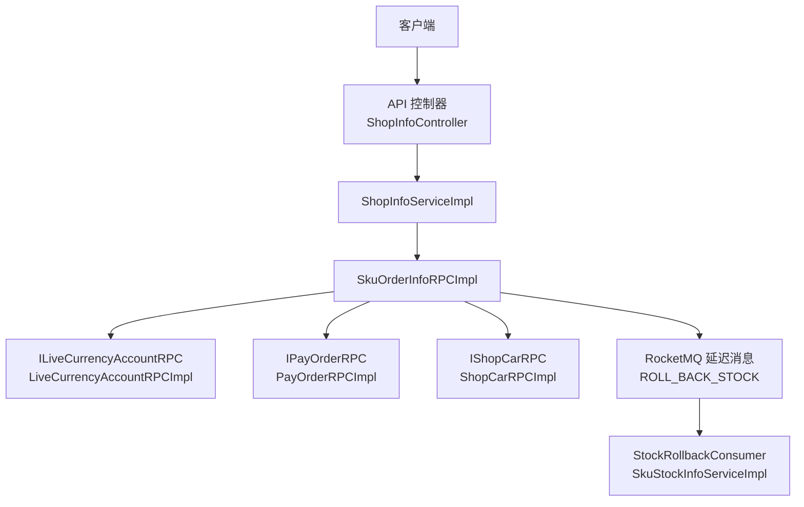
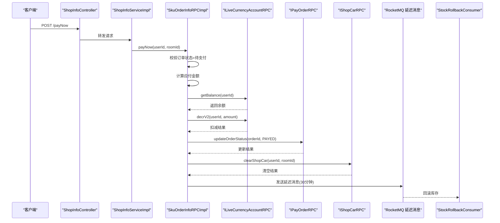
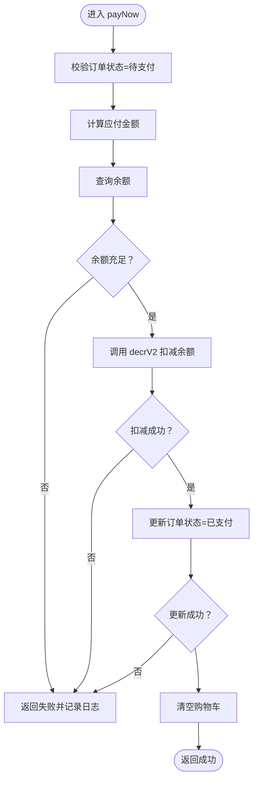
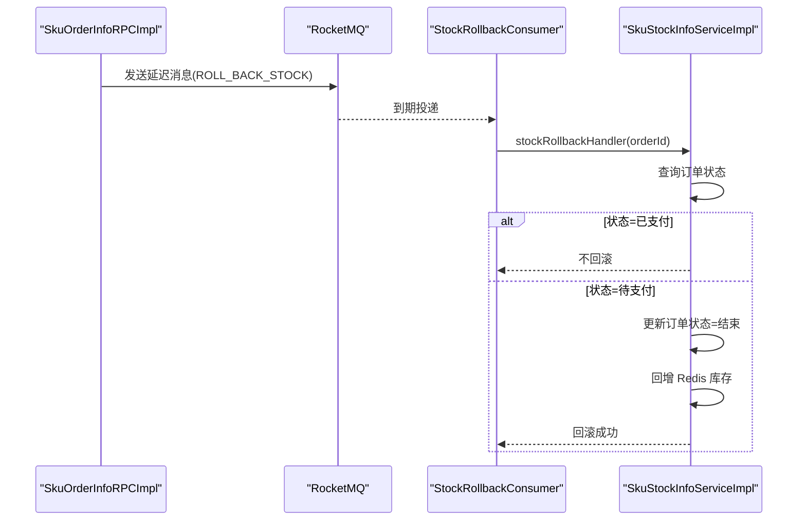
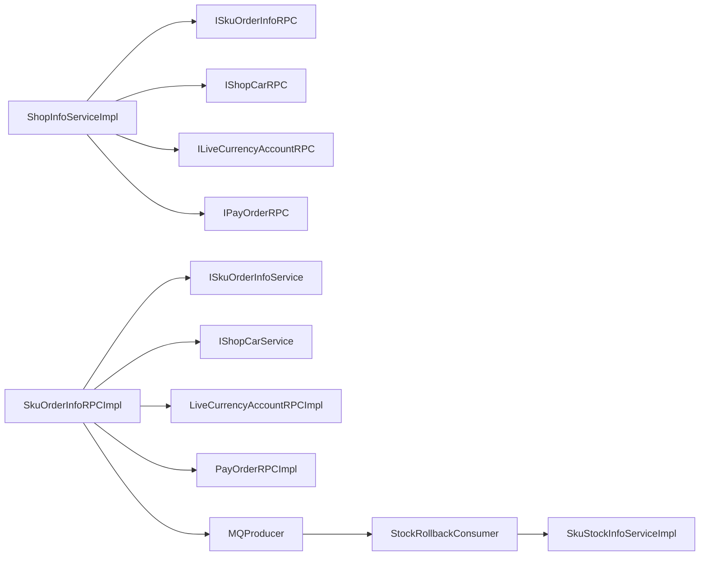

# 立即支付处理

<cite>
**本文引用的文件列表**
- [ShopInfoController.java](file://live-api/src/main/java/com/logilong/live/api/controller/ShopInfoController.java)
- [ShopInfoServiceImpl.java](file://live-api/src/main/java/com/logilong\live\api\service\impl\ShopInfoServiceImpl.java)
- [SkuOrderInfoRPCImpl.java](file://live-sku-provider/src/main/java/com/logilong\live\sku\provider\rpc\SkuOrderInfoRPCImpl.java)
- [ISkuOrderInfoRPC.java](file://live-sku-interface/src/main/java/com/logilong\live\sku\interfaces/ISkuOrderInfoRPC.java)
- [IShopCarRPC.java](file://live-sku-interface/src/main/java/com/logilong\live\sku\interfaces/IShopCarRPC.java)
- [ShopCarRPCImpl.java](file://live-sku-provider/src/main/java/com/logilong\live\sku\provider\rpc/ShopCarRPCImpl.java)
- [IShopCarService.java](file://live-sku-provider/src/main/java/com/logilong\live\sku\provider\service/IShopCarService.java)
- [ILiveCurrencyAccountRPC.java](file://live-bank-interface/src/main/java/com/logilong\live\bank\interfaces/ILiveCurrencyAccountRPC.java)
- [LiveCurrencyAccountRPCImpl.java](file://live-bank-provider/src/main/java/com/logilong\live\bank\provider\rpc/LiveCurrencyAccountRPCImpl.java)
- [ILiveCurrencyAccountService.java](file://live-bank-provider/src/main/java/com/logilong\live\bank\provider\service/ILiveCurrencyAccountService.java)
- [IPayOrderRPC.java](file://live-bank-interface/src/main/java/com/logilong\live\bank\interfaces/IPayOrderRPC.java)
- [PayOrderRPCImpl.java](file://live-bank-provider/src/main/java/com/logilong\live\bank\provider\rpc/PayOrderRPCImpl.java)
- [IPayOrderService.java](file://live-bank-provider/src/main/java/com/logilong\live\bank\provider\service/IPayOrderService.java)
- [PayOrderServiceImpl.java](file://live-bank-provider/src/main/java/com/logilong\live\bank\provider\service/impl/PayOrderServiceImpl.java)
- [SkuOrderInfoEnum.java](file://live-sku-interface/src/main/java/com/logilong\live\sku\constants/SkuOrderInfoEnum.java)
- [OrderStatusEnum.java](file://live-bank-interface/src/main/java/com/logilong\live\bank\constants/OrderStatusEnum.java)
- [StockRollbackConsumer.java](file://live-sku-provider/src/main/java/com/logilong\live\sku\provider\consumer/StockRollbackConsumer.java)
- [SkuStockInfoServiceImpl.java](file://live-sku-provider/src/main/java/com/logilong\live\sku\provider\service/impl/SkuStockInfoServiceImpl.java)
- [RollbackStockInfoDTO.java](file://live-sku-interface/src/main/java/com/logilong\live\sku\dto/RollbackStockInfoDTO.java)
- [GlobalExceptionHandler.java](file://live-framework\live-framework-web-starter\src\main\java\com\logilong\live\web\starter\error\GlobalExceptionHandler.java)
</cite>

## 目录
1. [简介](#简介)
2. [项目结构](#项目结构)
3. [核心组件](#核心组件)
4. [架构总览](#架构总览)
5. [详细组件分析](#详细组件分析)
6. [依赖关系分析](#依赖关系分析)
7. [性能考量](#性能考量)
8. [故障排查指南](#故障排查指南)
9. [结论](#结论)

## 简介
本文件围绕“立即支付”（payNow）流程，系统化梳理从订单状态校验、虚拟货币余额查询与扣减、订单状态更新、购物车清空到库存回滚的完整链路。重点覆盖：
- 订单状态必须为“待支付”的前置校验
- 余额查询与扣减（decrV2）的原子性与幂等性
- 订单状态更新与购物车清空的顺序一致性
- 异常传播与回滚策略（库存回滚、订单状态回写）
- 性能优化建议（缓存预热、索引优化）
- 典型错误日志定位与排查方法

## 项目结构
- API 层负责对外暴露 /payNow 接口，组装上下文并调用 SKU 侧 RPC
- SKU Provider 实现 payNow 的核心业务：校验订单状态、查询余额、扣减虚拟币、更新订单、清空购物车，并发送延迟 MQ 触发库存回滚
- 银行侧提供虚拟币账户 RPC 与订单 RPC，支撑余额与订单状态变更
- 框架层提供全局异常处理与限流拦截，保障稳定性

图表来源
- [ShopInfoController.java](file://live-api/src/main/java/com/logilong/live/api/controller/ShopInfoController.java#L71-L74)
- [ShopInfoServiceImpl.java](file://live-api/src/main/java/com/logilong\live\api\service\impl\ShopInfoServiceImpl.java#L109-L114)
- [SkuOrderInfoRPCImpl.java](file://live-sku-provider/src/main/java/com/logilong\live\sku\provider\rpc\SkuOrderInfoRPCImpl.java#L113-L159)
- [ILiveCurrencyAccountRPC.java](file://live-bank-interface/src/main/java/com/logilong\live\bank\interfaces/ILiveCurrencyAccountRPC.java#L1-L53)
- [LiveCurrencyAccountRPCImpl.java](file://live-bank-provider/src/main/java/com/logilong\live\bank\provider\rpc/LiveCurrencyAccountRPCImpl.java#L39-L60)
- [IPayOrderRPC.java](file://live-bank-interface/src/main/java/com/logilong\live\bank\interfaces/IPayOrderRPC.java#L1-L30)
- [PayOrderRPCImpl.java](file://live-bank-provider/src/main/java/com/logilong\live\bank\provider\rpc/PayOrderRPCImpl.java#L1-L36)
- [IShopCarRPC.java](file://live-sku-interface/src/main/java/com/logilong\live\sku\interfaces/IShopCarRPC.java#L1-L31)
- [ShopCarRPCImpl.java](file://live-sku-provider/src/main/java/com/logilong\live\sku\provider\rpc/ShopCarRPCImpl.java#L1-L41)
- [StockRollbackConsumer.java](file://live-sku-provider/src/main/java/com/logilong\live\sku\provider\consumer/StockRollbackConsumer.java#L31-L51)
- [SkuStockInfoServiceImpl.java](file://live-sku-provider/src/main/java/com/logilong\live\sku\provider\service/impl/SkuStockInfoServiceImpl.java#L132-L149)

章节来源
- [ShopInfoController.java](file://live-api/src/main/java/com/logilong/live/api/controller/ShopInfoController.java#L71-L74)
- [ShopInfoServiceImpl.java](file://live-api/src/main/java/com/logilong\live\api\service\impl\ShopInfoServiceImpl.java#L109-L114)

## 核心组件
- 支付入口控制器与服务
  - 控制器：暴露 /payNow 接口，转发到服务层
  - 服务：封装 payNow 调用，统一错误断言
- SKU 订单 RPC 实现
  - 校验订单状态（PREPARE_PAY）
  - 计算应付金额
  - 查询余额并扣减（decrV2）
  - 更新订单状态（PAYED）
  - 清空购物车
  - 发送延迟 MQ 触发库存回滚
- 虚拟币账户 RPC
  - 提供余额查询与扣减（含幂等的 decrV2）
- 订单 RPC
  - 提供订单状态更新能力
- 库存回滚消费者
  - 消费延迟 MQ，校验订单状态并回滚库存

章节来源
- [ShopInfoController.java](file://live-api/src/main/java/com/logilong/live/api/controller/ShopInfoController.java#L71-L74)
- [ShopInfoServiceImpl.java](file://live-api/src/main/java/com/logilong\live\api\service\impl\ShopInfoServiceImpl.java#L109-L114)
- [SkuOrderInfoRPCImpl.java](file://live-sku-provider/src/main/java/com/logilong\live\sku\provider\rpc\SkuOrderInfoRPCImpl.java#L113-L159)
- [ILiveCurrencyAccountRPC.java](file://live-bank-interface/src/main/java/com/logilong\live\bank\interfaces/ILiveCurrencyAccountRPC.java#L1-L53)
- [IPayOrderRPC.java](file://live-bank-interface/src/main/java/com/logilong\live\bank\interfaces/IPayOrderRPC.java#L1-L30)
- [IShopCarRPC.java](file://live-sku-interface/src/main/java/com/logilong\live\sku\interfaces/IShopCarRPC.java#L1-L31)
- [StockRollbackConsumer.java](file://live-sku-provider/src/main/java/com/logilong\live\sku\provider\consumer/StockRollbackConsumer.java#L31-L51)

## 架构总览
立即支付的整体调用序列如下：

图表来源
- [ShopInfoController.java](file://live-api/src/main/java/com/logilong/live/api/controller/ShopInfoController.java#L71-L74)
- [ShopInfoServiceImpl.java](file://live-api/src/main/java/com/logilong\live\api\service\impl\ShopInfoServiceImpl.java#L109-L114)
- [SkuOrderInfoRPCImpl.java](file://live-sku-provider/src/main/java/com/logilong\live\sku\provider\rpc\SkuOrderInfoRPCImpl.java#L113-L159)
- [ILiveCurrencyAccountRPC.java](file://live-bank-interface/src/main/java/com/logilong\live\bank\interfaces/ILiveCurrencyAccountRPC.java#L1-L53)
- [IPayOrderRPC.java](file://live-bank-interface/src/main/java/com/logilong\live\bank\interfaces/IPayOrderRPC.java#L1-L30)
- [IShopCarRPC.java](file://live-sku-interface/src/main/java/com/logilong\live\sku\interfaces/IShopCarRPC.java#L1-L31)
- [StockRollbackConsumer.java](file://live-sku-provider/src/main/java/com/logilong\live\sku\provider\consumer/StockRollbackConsumer.java#L31-L51)

## 详细组件分析

### 支付入口与服务编排
- 控制器将 /payNow 请求转交给服务层
- 服务层注入多个 RPC 接口，完成业务编排与错误断言
- payNow 最终委托给 SKU 的 payNow 实现

章节来源
- [ShopInfoController.java](file://live-api/src/main/java/com/logilong/live/api/controller/ShopInfoController.java#L71-L74)
- [ShopInfoServiceImpl.java](file://live-api/src/main/java/com/logilong\live\api\service\impl\ShopInfoServiceImpl.java#L109-L114)

### 订单状态校验与金额计算
- 通过用户与房间维度查询当前订单，要求状态为“待支付”
- 从订单记录中解析 SKU 列表，查询对应价格并累加得到应付金额

章节来源
- [SkuOrderInfoRPCImpl.java](file://live-sku-provider/src/main/java/com/logilong\live\sku\provider\rpc\SkuOrderInfoRPCImpl.java#L113-L125)
- [SkuOrderInfoEnum.java](file://live-sku-interface/src/main/java/com/logilong\live\sku\constants/SkuOrderInfoEnum.java#L1-L18)

### 余额查询与扣减（decrV2）
- 使用 ILiveCurrencyAccountRPC.getBalance 获取余额
- 使用 decrV2 执行扣减，返回布尔结果表示是否成功
- decrV2 语义为“余额充足才扣减，不足则不扣减”，天然具备幂等性与原子性

章节来源
- [ILiveCurrencyAccountRPC.java](file://live-bank-interface/src/main/java/com/logilong\live\bank\interfaces/ILiveCurrencyAccountRPC.java#L1-L53)
- [LiveCurrencyAccountRPCImpl.java](file://live-bank-provider/src/main/java/com/logilong\live\bank\provider\rpc/LiveCurrencyAccountRPCImpl.java#L39-L60)

### 订单状态更新（updateOrderStatus）
- 使用 IPayOrderRPC.updateOrderStatus 将订单状态置为“已支付”
- 该接口同时支持按主键与订单号更新，便于不同场景复用

章节来源
- [IPayOrderRPC.java](file://live-bank-interface/src/main/java/com/logilong\live\bank\interfaces/IPayOrderRPC.java#L1-L30)
- [PayOrderRPCImpl.java](file://live-bank-provider/src/main/java/com/logilong\live\bank\provider\rpc/PayOrderRPCImpl.java#L1-L36)
- [OrderStatusEnum.java](file://live-bank-interface/src/main/java/com/logilong\live\bank\constants/OrderStatusEnum.java#L1-L24)

### 购物车清空（clearShopCar）
- 在支付成功后，清理用户在该房间的购物车内容
- 清空结果记录到日志，便于问题定位

章节来源
- [IShopCarRPC.java](file://live-sku-interface/src/main/java/com/logilong\live\sku\interfaces/IShopCarRPC.java#L1-L31)
- [ShopCarRPCImpl.java](file://live-sku-provider/src/main/java/com/logilong\live\sku\provider\rpc/ShopCarRPCImpl.java#L1-L41)
- [SkuOrderInfoRPCImpl.java](file://live-sku-provider/src/main/java/com/logilong\live\sku\provider\rpc\SkuOrderInfoRPCImpl.java#L150-L157)

### 原子性与异常传播机制
- 支付成功链路采用“强顺序”：余额扣减 -> 订单状态更新 -> 购物车清空
- 任一步骤失败均记录日志并短路返回，避免部分成功导致的状态不一致
- 若订单状态更新失败，不会回滚余额；若余额扣减失败，不会更新订单状态
- 库存回滚通过 RocketMQ 延迟消息兜底：若支付未完成，延迟触发回滚，确保最终一致性

图表来源
- [SkuOrderInfoRPCImpl.java](file://live-sku-provider/src/main/java/com/logilong\live\sku\provider\rpc\SkuOrderInfoRPCImpl.java#L113-L159)

### 库存回滚与最终一致性
- 预下单阶段已将库存预扣减至 Redis 缓存
- 预下单成功后发送延迟 MQ（约 30 分钟），若订单仍处于“待支付”，触发回滚
- 回滚消费者收到消息后，检查订单状态，若非“已支付”，则将订单置为“结束”，并回增 Redis 库存

图表来源
- [SkuOrderInfoRPCImpl.java](file://live-sku-provider/src/main/java/com/logilong\live\sku\provider\rpc\SkuOrderInfoRPCImpl.java#L161-L180)
- [StockRollbackConsumer.java](file://live-sku-provider/src/main/java/com/logilong\live\sku\provider\consumer/StockRollbackConsumer.java#L31-L51)
- [SkuStockInfoServiceImpl.java](file://live-sku-provider/src/main/java/com/logilong\live\sku\provider\service/impl/SkuStockInfoServiceImpl.java#L132-L149)
- [RollbackStockInfoDTO.java](file://live-sku-interface/src/main/java/com/logilong\live\sku\dto/RollbackStockInfoDTO.java#L1-L16)

## 依赖关系分析
- API 层依赖 SKU 接口层与 RPC 层，通过 Dubbo 注入
- SKU Provider 内部依赖银行侧账户与订单 RPC，以及购物车 RPC
- 库存回滚依赖 RocketMQ 延迟消息与消费者

图表来源
- [ShopInfoServiceImpl.java](file://live-api/src/main/java/com/logilong\live\api\service\impl\ShopInfoServiceImpl.java#L30-L42)
- [SkuOrderInfoRPCImpl.java](file://live-sku-provider/src/main/java/com/logilong\live\sku\provider\rpc\SkuOrderInfoRPCImpl.java#L29-L45)
- [ShopCarRPCImpl.java](file://live-sku-provider/src/main/java/com/logilong\live\sku\provider\rpc/ShopCarRPCImpl.java#L1-L41)
- [LiveCurrencyAccountRPCImpl.java](file://live-bank-provider/src/main/java/com/logilong\live\bank\provider\rpc/LiveCurrencyAccountRPCImpl.java#L39-L60)
- [PayOrderRPCImpl.java](file://live-bank-provider/src/main/java/com/logilong\live\bank\provider\rpc/PayOrderRPCImpl.java#L1-L36)
- [StockRollbackConsumer.java](file://live-sku-provider/src/main/java/com/logilong\live\sku\provider\consumer/StockRollbackConsumer.java#L31-L51)

## 性能考量
- 缓存预热
  - 在预下单阶段，库存已预扣减到 Redis，可结合业务高峰提前预热热门 SKU 的库存缓存，降低瞬时压力
  - 参考：预扣减库存使用 Redis Lua 脚本保证原子性，避免超卖
- 数据库索引优化
  - 订单查询需按用户+房间维度快速定位“待支付”订单，建议在订单表上建立复合索引（用户ID、房间ID、状态）
  - 订单状态更新频繁，建议对状态字段建立索引，提升更新效率
- 并发与幂等
  - decrV2 已具备幂等特性，避免重复扣减
  - 购物车清空与订单状态更新均为单次写操作，复杂度低
- MQ 延迟消息
  - 使用 RocketMQ 延迟消息实现库存回滚，避免定时扫描带来的数据库压力

章节来源
- [SkuOrderInfoRPCImpl.java](file://live-sku-provider/src/main/java/com/logilong\live\sku\provider\rpc\SkuOrderInfoRPCImpl.java#L72-L96)
- [SkuStockInfoServiceImpl.java](file://live-sku-provider/src/main/java/com/logilong\live\sku\provider\service/impl/SkuStockInfoServiceImpl.java#L109-L130)

## 故障排查指南
- 常见错误与定位
  - 订单状态非“待支付”：检查预下单是否成功，确认订单状态是否被提前更新或回滚
  - 余额不足：核对 getBalance 返回值与应付金额计算逻辑
  - 扣减失败：关注 decrV2 返回值与日志，确认账户服务可用性
  - 订单更新失败：检查订单状态更新接口返回值与数据库连接情况
  - 购物车清空失败：检查购物车服务可用性与用户房间参数
  - 库存未回滚：检查延迟 MQ 是否投递成功，消费者是否启动并订阅主题
- 日志与异常处理
  - 全局异常处理器捕获所有未处理异常，返回系统异常提示
  - 业务断言在服务层抛出业务异常，统一由全局异常处理器输出业务错误码与消息
- 排查步骤建议
  - 步骤一：确认 /payNow 请求是否到达 API 层
  - 步骤二：查看 SKU payNow 日志，定位失败步骤
  - 步骤三：核对账户与订单服务日志，确认返回值
  - 步骤四：检查 RocketMQ 延迟消息投递与消费者日志
  - 步骤五：必要时人工补偿：手动调用订单状态更新或库存回滚

章节来源
- [ShopInfoServiceImpl.java](file://live-api/src/main/java/com/logilong\live\api\service\impl\ShopInfoServiceImpl.java#L109-L114)
- [SkuOrderInfoRPCImpl.java](file://live-sku-provider/src/main/java/com/logilong\live\sku\provider\rpc\SkuOrderInfoRPCImpl.java#L113-L159)
- [GlobalExceptionHandler.java](file://live-framework\live-framework-web-starter\src\main\java\com\logilong\live\web\starter\error\GlobalExceptionHandler.java#L1-L32)

## 结论
立即支付流程通过严格的前置校验、幂等的余额扣减、顺序化的状态更新与购物车清空，以及延迟 MQ 的库存回滚兜底，实现了高可靠与最终一致性的支付闭环。建议在高峰期前完成缓存预热与数据库索引优化，持续监控 MQ 投递与消费者运行状态，确保支付链路稳定高效。