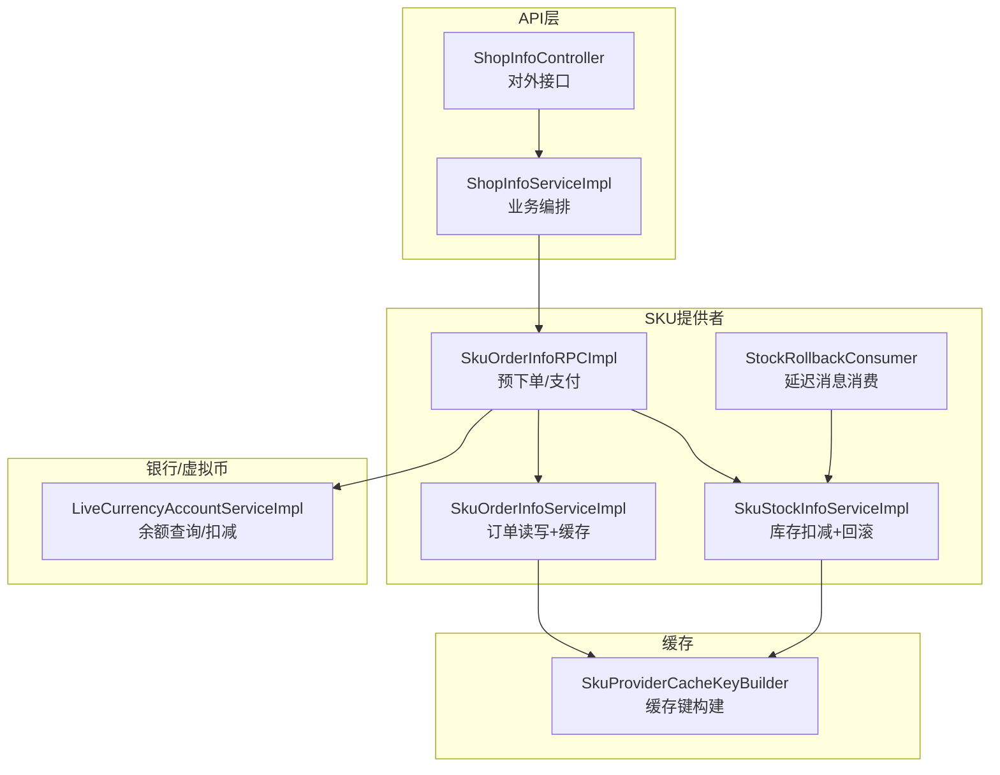
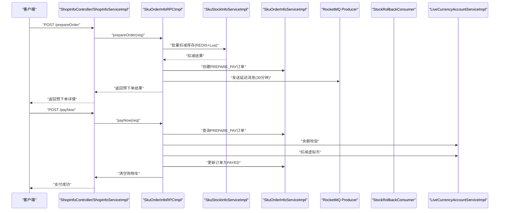
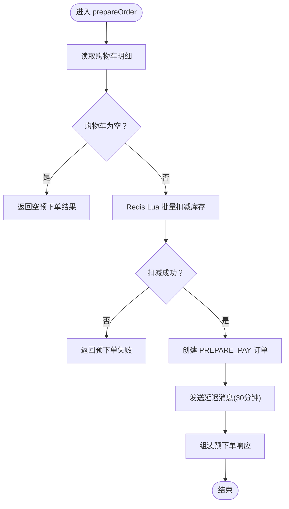
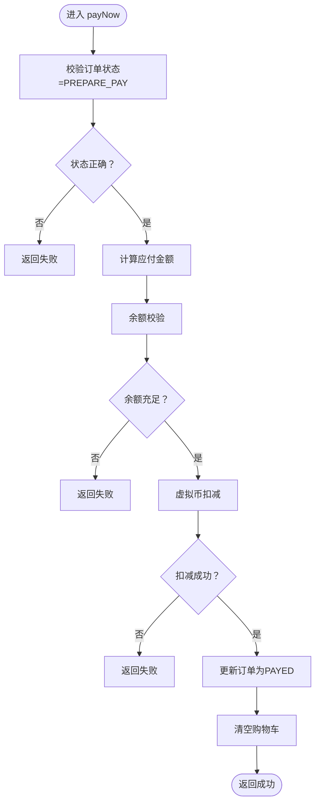
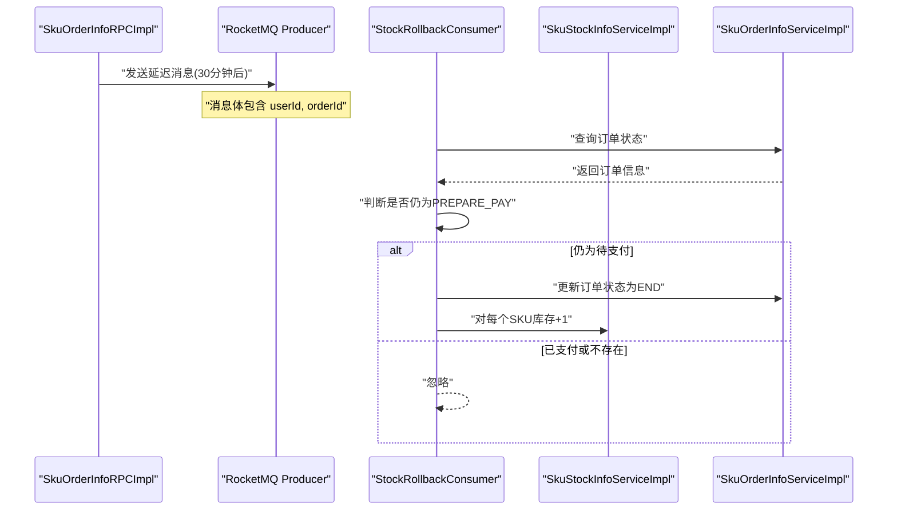
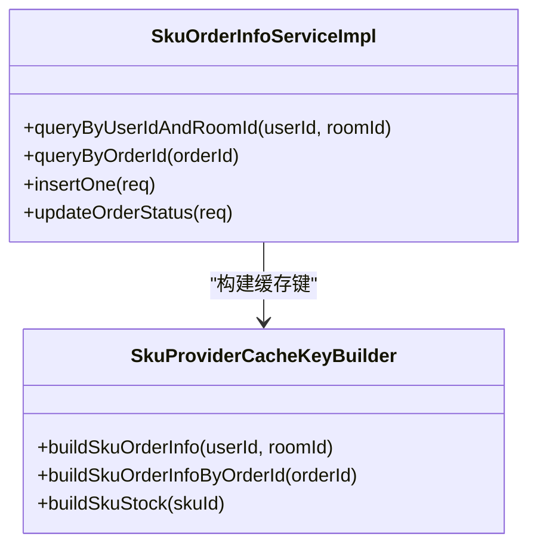
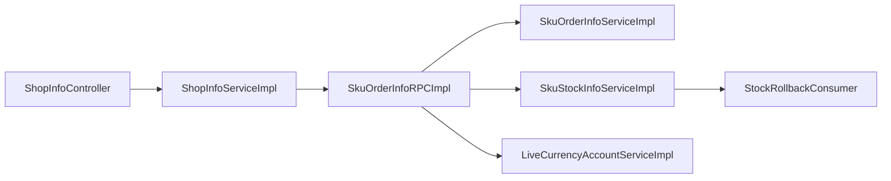

# 订单处理

<cite>
**本文引用的文件列表**
- [ShopInfoController.java](file://live-api/src/main/java/com/logilong/live/api/controller/ShopInfoController.java)
- [ShopInfoServiceImpl.java](file://live-api/src/main/java/com/logilong/live/api/service/impl/ShopInfoServiceImpl.java)
- [SkuOrderInfoRPCImpl.java](file://live-sku-provider/src/main/java/com/logilong/live/sku/provider/rpc/SkuOrderInfoRPCImpl.java)
- [SkuOrderInfoServiceImpl.java](file://live-sku-provider/src/main/java/com/logilong/live/sku/provider/service/impl/SkuOrderInfoServiceImpl.java)
- [SkuStockInfoServiceImpl.java](file://live-sku-provider/src/main/java/com/logilong/live/sku/provider/service/impl/SkuStockInfoServiceImpl.java)
- [StockRollbackConsumer.java](file://live-sku-provider/src/main/java/com/logilong/live/sku/provider/consumer/StockRollbackConsumer.java)
- [SkuProviderCacheKeyBuilder.java](file://live-framework/live-framework-redis-starter/src/main/java/com/logilong/live/framework/redis/starter/key/SkuProviderCacheKeyBuilder.java)
- [SkuOrderInfoEnum.java](file://live-sku-interface/src/main/java/com/logilong/live/stock/接口/订单处理/订单状态枚举.java)
- [LiveCurrencyAccountServiceImpl.java](file://live-bank-provider/src/main/java/com/logilong/live/bank/provider/service/impl/LiveCurrencyAccountServiceImpl.java)
- [ILiveCurrencyAccountRPC.java](file://live-bank-interface/src/main/java/com/logilong/live/bank/interfaces/ILiveCurrencyAccountRPC.java)
</cite>

## 目录
1. [简介](#简介)
2. [项目结构](#项目结构)
3. [核心组件](#核心组件)
4. [架构总览](#架构总览)
5. [详细组件分析](#详细组件分析)
6. [依赖关系分析](#依赖关系分析)
7. [性能考量](#性能考量)
8. [故障排查指南](#故障排查指南)
9. [结论](#结论)

## 简介
本文件系统化阐述从“预下单”到“支付”的完整订单处理链路，重点覆盖：
- 预下单阶段：购物车数据读取、库存批量扣减、订单创建、延迟消息发送（stockRollbackHandler）的事务性保障
- 支付阶段：虚拟币账户扣减、订单状态更新、购物车清空的业务逻辑，以及支付过程中的异常处理
- 缓存策略：Redis缓存键构建（buildSkuOrderInfo）与失效机制，确保数据实时性与一致性

## 项目结构
围绕订单处理的关键模块与职责如下：
- API网关层：ShopInfoController 提供对外接口，ShopInfoServiceImpl 调用 RPC 完成业务编排
- SKU提供者：SkuOrderInfoRPCImpl 实现预下单与支付；SkuOrderInfoServiceImpl、SkuStockInfoServiceImpl 提供订单与库存服务；StockRollbackConsumer 消费库存回滚延迟消息
- 银行/虚拟币：LiveCurrencyAccountServiceImpl 提供余额查询与扣减能力
- 缓存键：SkuProviderCacheKeyBuilder 统一构建订单与库存缓存键

图表来源
- [ShopInfoController.java](file://live-api/src/main/java/com/logilong/live/api/controller/ShopInfoController.java#L34-L75)
- [ShopInfoServiceImpl.java](file://live-api/src/main/java/com/logilong/live/api/service/impl/ShopInfoServiceImpl.java#L95-L114)
- [SkuOrderInfoRPCImpl.java](file://live-sku-provider/src/main/java/com/logilong/live/sku/provider/rpc/SkuOrderInfoRPCImpl.java#L62-L111)
- [SkuOrderInfoServiceImpl.java](file://live-sku-provider/src/main/java/com/logilong/live/sku/provider/service/impl/SkuOrderInfoServiceImpl.java#L30-L90)
- [SkuStockInfoServiceImpl.java](file://live-sku-provider/src/main/java/com/logilong/live/sku/provider/service/impl/SkuStockInfoServiceImpl.java#L1-L151)
- [StockRollbackConsumer.java](file://live-sku-provider/src/main/java/com/logilong/live/sku/provider/consumer/StockRollbackConsumer.java#L1-L51)
- [SkuProviderCacheKeyBuilder.java](file://live-framework/live-framework-redis-starter/src/main/java/com/logilong/live/framework/redis/starter/key/SkuProviderCacheKeyBuilder.java#L1-L41)

章节来源
- [ShopInfoController.java](file://live-api/src/main/java/com/logilong/live/api/controller/ShopInfoController.java#L34-L75)
- [ShopInfoServiceImpl.java](file://live-api/src/main/java/com/logilong/live/api/service/impl/ShopInfoServiceImpl.java#L95-L114)

## 核心组件
- 预下单 RPC：SkuOrderInfoRPCImpl.prepareOrder
  - 读取购物车、批量扣减库存、创建订单、发送延迟消息
- 支付 RPC：SkuOrderInfoRPCImpl.payNow
  - 校验订单状态、计算应付金额、虚拟币扣减、更新订单状态、清空购物车
- 订单服务：SkuOrderInfoServiceImpl
  - Redis 缓存订单信息（按用户+房间维度），并提供查询与更新
- 库存服务：SkuStockInfoServiceImpl
  - Redis Lua 批量扣减库存，失败即回滚；延迟消息触发库存回滚
- 回滚消费者：StockRollbackConsumer
  - 消费延迟消息，检查订单状态，执行库存回滚与订单状态变更
- 虚拟币账户：LiveCurrencyAccountServiceImpl
  - 余额查询与扣减，支持幂等与异步落库
- 缓存键构建：SkuProviderCacheKeyBuilder
  - 统一构建订单、库存、购物车等缓存键

章节来源
- [SkuOrderInfoRPCImpl.java](file://live-sku-provider/src/main/java/com/logilong/live/sku/provider/rpc/SkuOrderInfoRPCImpl.java#L62-L111)
- [SkuOrderInfoRPCImpl.java](file://live-sku-provider/src/main/java/com/logilong/live/sku/provider/rpc/SkuOrderInfoRPCImpl.java#L113-L180)
- [SkuOrderInfoServiceImpl.java](file://live-sku-provider/src/main/java/com/logilong/live/sku/provider/service/impl/SkuOrderInfoServiceImpl.java#L30-L90)
- [SkuStockInfoServiceImpl.java](file://live-sku-provider/src/main/java/com/logilong/live/sku/provider/service/impl/SkuStockInfoServiceImpl.java#L1-L151)
- [StockRollbackConsumer.java](file://live-sku-provider/src/main/java/com/logilong/live/sku/provider/consumer/StockRollbackConsumer.java#L1-L51)
- [LiveCurrencyAccountServiceImpl.java](file://live-bank-provider/src/main/java/com/logilong/live/bank/provider/service/impl/LiveCurrencyAccountServiceImpl.java#L118-L134)
- [SkuProviderCacheKeyBuilder.java](file://live-framework/live-framework-redis-starter/src/main/java/com/logilong/live/framework/redis/starter/key/SkuProviderCacheKeyBuilder.java#L1-L41)

## 架构总览
下面以序列图展示“预下单—支付”的端到端调用链路，突出事务性保障与缓存策略。

图表来源
- [ShopInfoController.java](file://live-api/src/main/java/com/logilong/live/api/controller/ShopInfoController.java#L61-L75)
- [ShopInfoServiceImpl.java](file://live-api/src/main/java/com/logilong/live/api/service/impl/ShopInfoServiceImpl.java#L95-L114)
- [SkuOrderInfoRPCImpl.java](file://live-sku-provider/src/main/java/com/logilong/live/sku/provider/rpc/SkuOrderInfoRPCImpl.java#L62-L111)
- [SkuOrderInfoRPCImpl.java](file://live-sku-provider/src/main/java/com/logilong/live/sku/provider/rpc/SkuOrderInfoRPCImpl.java#L113-L180)
- [SkuStockInfoServiceImpl.java](file://live-sku-provider/src/main/java/com/logilong/live/sku/provider/service/impl/SkuStockInfoServiceImpl.java#L102-L130)
- [SkuOrderInfoServiceImpl.java](file://live-sku-provider/src/main/java/com/logilong/live/sku/provider/service/impl/SkuOrderInfoServiceImpl.java#L30-L90)
- [StockRollbackConsumer.java](file://live-sku-provider/src/main/java/com/logilong/live/sku/provider/consumer/StockRollbackConsumer.java#L31-L51)
- [LiveCurrencyAccountServiceImpl.java](file://live-bank-provider/src/main/java/com/logilong/live/bank/provider/service/impl/LiveCurrencyAccountServiceImpl.java#L118-L134)

## 详细组件分析

### 预下单 prepareOrder 流程
- 购物车数据读取
  - 通过 ShopInfoServiceImpl 调用 ShopCarRPC 获取当前用户在房间内的购物车明细
- 库存批量扣减
  - 使用 Redis Lua 批量扣减，确保原子性与一致性，避免超卖
  - 若任一 SKU 扣减失败，整体预下单失败
- 订单创建
  - 创建 PREPARE_PAY 状态订单，持久化 SKU 列表
- 延迟消息发送
  - 发送延迟消息（30 分钟后），用于未支付订单的库存回滚
  - 消费端在到期后检查订单状态，若仍为待支付，则回滚库存并关闭订单

图表来源
- [SkuOrderInfoRPCImpl.java](file://live-sku-provider/src/main/java/com/logilong/live/sku/provider/rpc/SkuOrderInfoRPCImpl.java#L62-L111)
- [SkuStockInfoServiceImpl.java](file://live-sku-provider/src/main/java/com/logilong/live/sku/provider/service/impl/SkuStockInfoServiceImpl.java#L102-L130)
- [SkuOrderInfoServiceImpl.java](file://live-sku-provider/src/main/java/com/logilong/live/sku/provider/service/impl/SkuOrderInfoServiceImpl.java#L68-L77)
- [StockRollbackConsumer.java](file://live-sku-provider/src/main/java/com/logilong/live/sku/provider/consumer/StockRollbackConsumer.java#L31-L51)

章节来源
- [SkuOrderInfoRPCImpl.java](file://live-sku-provider/src/main/java/com/logilong/live/sku/provider/rpc/SkuOrderInfoRPCImpl.java#L62-L111)
- [SkuStockInfoServiceImpl.java](file://live-sku-provider/src/main/java/com/logilong/live/sku/provider/service/impl/SkuStockInfoServiceImpl.java#L102-L130)
- [SkuOrderInfoServiceImpl.java](file://live-sku-provider/src/main/java/com/logilong/live/sku/provider/service/impl/SkuOrderInfoServiceImpl.java#L68-L77)

### 支付 payNow 流程
- 订单状态校验
  - 仅允许 PREPARE_PAY 状态订单进入支付
- 金额计算
  - 依据订单中 SKU 列表查询价格并累加
- 虚拟币扣减
  - 先查询余额，再进行扣减
- 订单状态更新
  - 更新为 PAYED 状态
- 购物车清空
  - 清理当前房间的购物车
- 异常处理
  - 任一步骤失败均记录日志并返回失败

图表来源
- [SkuOrderInfoRPCImpl.java](file://live-sku-provider/src/main/java/com/logilong/live/sku/provider/rpc/SkuOrderInfoRPCImpl.java#L113-L180)
- [LiveCurrencyAccountServiceImpl.java](file://live-bank-provider/src/main/java/com/logilong/live/bank/provider/service/impl/LiveCurrencyAccountServiceImpl.java#L118-L134)
- [SkuOrderInfoServiceImpl.java](file://live-sku-provider/src/main/java/com/logilong/live/sku/provider/service/impl/SkuOrderInfoServiceImpl.java#L80-L90)

章节来源
- [SkuOrderInfoRPCImpl.java](file://live-sku-provider/src/main/java/com/logilong/live/sku/provider/rpc/SkuOrderInfoRPCImpl.java#L113-L180)
- [LiveCurrencyAccountServiceImpl.java](file://live-bank-provider/src/main/java/com/logilong/live/bank/provider/service/impl/LiveCurrencyAccountServiceImpl.java#L118-L134)
- [SkuOrderInfoServiceImpl.java](file://live-sku-provider/src/main/java/com/logilong/live/sku/provider/service/impl/SkuOrderInfoServiceImpl.java#L80-L90)

### 库存回滚与延迟消息
- 延迟消息发送
  - 预下单成功后发送延迟消息（delayTimeLevel 对应 30 分钟）
- 回滚条件
  - 消费端收到消息后查询订单状态，若仍为 PREPARE_PAY，则执行：
    - 更新订单状态为 END
    - 将对应 SKU 的 Redis 库存键值 +1
- 并发与一致性
  - 扣减使用 Redis Lua，保证原子性
  - 回滚仅在订单未支付且存在时生效

图表来源
- [SkuOrderInfoRPCImpl.java](file://live-sku-provider/src/main/java/com/logilong/live/sku/provider/rpc/SkuOrderInfoRPCImpl.java#L161-L180)
- [StockRollbackConsumer.java](file://live-sku-provider/src/main/java/com/logilong/live/sku/provider/consumer/StockRollbackConsumer.java#L31-L51)
- [SkuStockInfoServiceImpl.java](file://live-sku-provider/src/main/java/com/logilong/live/sku/provider/service/impl/SkuStockInfoServiceImpl.java#L132-L150)
- [SkuOrderInfoServiceImpl.java](file://live-sku-provider/src/main/java/com/logilong/live/sku/provider/service/impl/SkuOrderInfoServiceImpl.java#L52-L67)

章节来源
- [SkuOrderInfoRPCImpl.java](file://live-sku-provider/src/main/java/com/logilong/live/sku/provider/rpc/SkuOrderInfoRPCImpl.java#L161-L180)
- [StockRollbackConsumer.java](file://live-sku-provider/src/main/java/com/logilong/live/sku/provider/consumer/StockRollbackConsumer.java#L31-L51)
- [SkuStockInfoServiceImpl.java](file://live-sku-provider/src/main/java/com/logilong/live/sku/provider/service/impl/SkuStockInfoServiceImpl.java#L132-L150)

### Redis 缓存策略与失效
- 订单缓存键
  - buildSkuOrderInfo(userId, roomId)：按用户+房间维度缓存最近订单
  - buildSkuOrderInfoByOrderId(orderId)：按订单 ID 缓存订单详情
- 失效机制
  - 写入订单时，先将 SKU 列表转换为字符串存储
  - 更新订单状态后，删除对应用户+房间的缓存键，确保后续读取最新状态
- 库存缓存键
  - buildSkuStock(skuId)：用于库存扣减与回滚

图表来源
- [SkuProviderCacheKeyBuilder.java](file://live-framework/live-framework-redis-starter/src/main/java/com/logilong/live/framework/redis/starter/key/SkuProviderCacheKeyBuilder.java#L1-L41)
- [SkuOrderInfoServiceImpl.java](file://live-sku-provider/src/main/java/com/logilong/live/sku/provider/service/impl/SkuOrderInfoServiceImpl.java#L30-L90)

章节来源
- [SkuProviderCacheKeyBuilder.java](file://live-framework/live-framework-redis-starter/src/main/java/com/logilong/live/framework/redis/starter/key/SkuProviderCacheKeyBuilder.java#L1-L41)
- [SkuOrderInfoServiceImpl.java](file://live-sku-provider/src/main/java/com/logilong/live/sku/provider/service/impl/SkuOrderInfoServiceImpl.java#L30-L90)

## 依赖关系分析
- 控制器与服务
  - ShopInfoController 将请求转发至 ShopInfoServiceImpl
  - ShopInfoServiceImpl 通过 Dubbo 调用 SKU/RPC 接口
- SKU 提供者内部
  - SkuOrderInfoRPCImpl 依赖库存、订单、购物车、虚拟币、MQ 生产者
  - SkuOrderInfoServiceImpl 依赖订单 Mapper 与 RedisTemplate
  - SkuStockInfoServiceImpl 依赖库存 Mapper、RedisTemplate 与订单服务
  - StockRollbackConsumer 依赖 RocketMQ 消费配置与库存服务
- 银行/虚拟币
  - LiveCurrencyAccountServiceImpl 提供余额查询与扣减，支持异步落库

图表来源
- [ShopInfoController.java](file://live-api/src/main/java/com/logilong/live/api/controller/ShopInfoController.java#L61-L75)
- [ShopInfoServiceImpl.java](file://live-api/src/main/java/com/logilong/live/api/service/impl/ShopInfoServiceImpl.java#L95-L114)
- [SkuOrderInfoRPCImpl.java](file://live-sku-provider/src/main/java/com/logilong/live/sku/provider/rpc/SkuOrderInfoRPCImpl.java#L62-L111)
- [SkuOrderInfoServiceImpl.java](file://live-sku-provider/src/main/java/com/logilong/live/sku/provider/service/impl/SkuOrderInfoServiceImpl.java#L30-L90)
- [SkuStockInfoServiceImpl.java](file://live-sku-provider/src/main/java/com/logilong/live/sku/provider/service/impl/SkuStockInfoServiceImpl.java#L1-L151)
- [StockRollbackConsumer.java](file://live-sku-provider/src/main/java/com/logilong/live/sku/provider/consumer/StockRollbackConsumer.java#L1-L51)
- [LiveCurrencyAccountServiceImpl.java](file://live-bank-provider/src/main/java/com/logilong/live/bank/provider/service/impl/LiveCurrencyAccountServiceImpl.java#L118-L134)

章节来源
- [ShopInfoServiceImpl.java](file://live-api/src/main/java/com/logilong/live/api/service/impl/ShopInfoServiceImpl.java#L95-L114)
- [SkuOrderInfoRPCImpl.java](file://live-sku-provider/src/main/java/com/logilong/live/sku/provider/rpc/SkuOrderInfoRPCImpl.java#L62-L111)

## 性能考量
- Redis Lua 批量扣减库存，减少网络往返与超卖风险
- 订单缓存按用户+房间维度设置短 TTL，降低热点读压力
- 虚拟币余额查询优先命中 Redis，DB 层采用异步落库，提升吞吐
- 延迟消息回滚避免长事务与锁竞争，提高系统整体可用性

## 故障排查指南
- 预下单失败
  - 检查购物车是否为空
  - 检查 Redis 批量扣减返回值
  - 检查订单创建是否成功
- 支付失败
  - 检查订单状态是否仍为 PREPARE_PAY
  - 检查余额是否充足
  - 检查虚拟币扣减接口返回值
  - 检查订单状态更新与购物车清空是否成功
- 库存回滚未生效
  - 检查延迟消息是否发送成功
  - 检查回滚消费者是否启动并订阅主题
  - 检查订单状态是否已被更新为 PAYED

章节来源
- [SkuOrderInfoRPCImpl.java](file://live-sku-provider/src/main/java/com/logilong/live/sku/provider/rpc/SkuOrderInfoRPCImpl.java#L62-L111)
- [SkuOrderInfoRPCImpl.java](file://live-sku-provider/src/main/java/com/logilong/live/sku/provider/rpc/SkuOrderInfoRPCImpl.java#L113-L180)
- [StockRollbackConsumer.java](file://live-sku-provider/src/main/java/com/logilong/live/sku/provider/consumer/StockRollbackConsumer.java#L31-L51)

## 结论
本订单处理链路通过“Redis 批量扣减 + 延迟消息回滚 + 订单缓存 + 虚拟币异步落库”的组合，实现了高并发下的强一致与高可用。预下单阶段确保库存预占与订单原子创建，支付阶段通过余额校验与状态机控制保障交易安全，缓存策略与失效机制确保数据实时性与一致性。