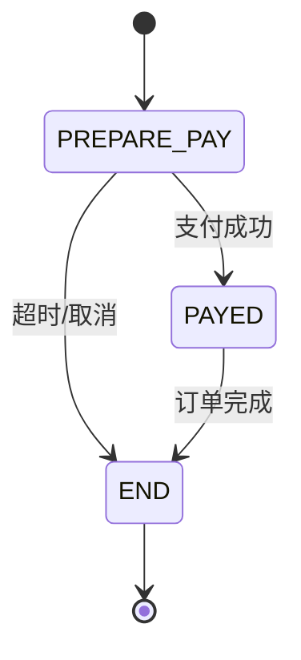
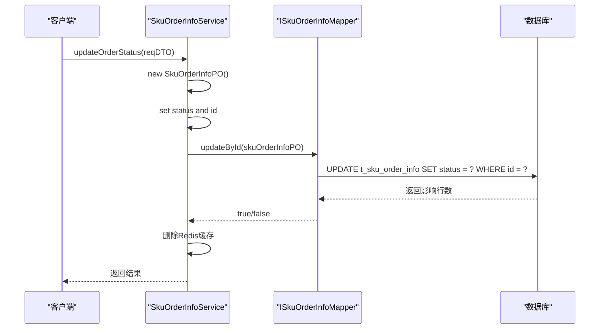
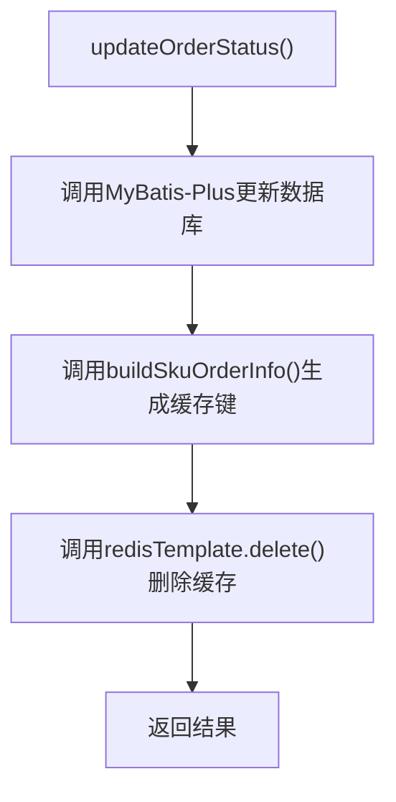
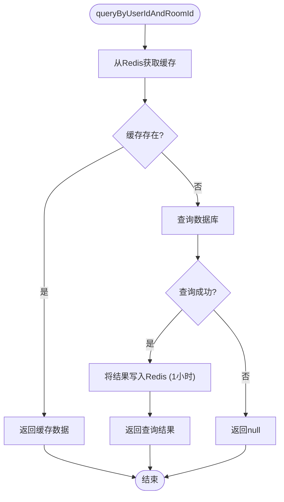

# 订单状态管理

<cite>
**本文档引用的文件**  
- [SkuOrderInfoEnum.java](file://live-sku-interface/src/main/java/com/logilong/live/sku/constants/SkuOrderInfoEnum.java)
- [ISkuOrderInfoService.java](file://live-sku-provider/src/main/java/com/logilong/live/sku/provider/service/ISkuOrderInfoService.java)
- [SkuOrderInfoServiceImpl.java](file://live-sku-provider/src/main/java/com/logilong/live/sku/provider/service/impl/SkuOrderInfoServiceImpl.java)
- [SkuOrderInfoPO.java](file://live-sku-provider/src/main/java/com/logilong/live/sku/provider/dao/po/SkuOrderInfoPO.java)
- [ISkuOrderInfoMapper.java](file://live-sku-provider/src/main/java/com/logilong/live/sku/provider/dao/mapper/ISkuOrderInfoMapper.java)
- [SkuProviderCacheKeyBuilder.java](file://live-framework/live-framework-redis-starter/src/main/java/com/logilong/live/framework/redis/starter/key/SkuProviderCacheKeyBuilder.java)
- [SkuOrderInfoReqDTO.java](file://live-sku-interface/src/main/java/com/logilong/live/sku/dto/SkuOrderInfoReqDTO.java)
- [SkuOrderInfoRespDTO.java](file://live-sku-interface/src/main/java/com/logilong/live/sku/dto/SkuOrderInfoRespDTO.java)
- [OrderStatusEnum.java](file://live-bank-interface/src/main/java/com/logilong/live/bank/constants/OrderStatusEnum.java)
- [PayOrderServiceImpl.java](file://live-bank-provider/src/main/java/com/logilong/live/bank/provider/service/impl/PayOrderServiceImpl.java)
</cite>

## 目录
1. [引言](#引言)
2. [订单状态生命周期](#订单状态生命周期)
3. [状态流转规则](#状态流转规则)
4. [状态更新机制](#状态更新机制)
5. [缓存一致性管理](#缓存一致性管理)
6. [状态机设计模式应用](#状态机设计模式应用)
7. [状态查询接口与缓存策略](#状态查询接口与缓存策略)
8. [结论](#结论)

## 引言
本文档全面解析直播平台中订单状态的生命周期管理机制。基于 `SkuOrderInfoEnum` 枚举定义，详细说明订单从预支付到已支付等状态的流转规则。分析 `updateOrderStatus` 方法如何通过 MyBatis-Plus 更新数据库记录，并在状态变更后主动删除 Redis 缓存以保证数据一致性。探讨状态机设计模式的应用，防止非法状态转换。同时提供状态查询接口的缓存命中策略与失效机制说明，包括缓存有效期（1小时）设置依据和性能影响评估。

## 订单状态生命周期
订单状态生命周期由 `SkuOrderInfoEnum` 枚举类定义，包含三个核心状态：预支付（PREPARE_PAY）、已支付（PAYED）和订单已关闭（END）。这些状态通过整型编码（0、1、2）标识，并附带描述性文本，确保状态语义清晰且易于调试。



**Diagram sources**
- [SkuOrderInfoEnum.java](file://live-sku-interface/src/main/java/com/logilong/live/sku/constants/SkuOrderInfoEnum.java#L11-L13)

**Section sources**
- [SkuOrderInfoEnum.java](file://live-sku-interface/src/main/java/com/logilong/live/sku/constants/SkuOrderInfoEnum.java#L10-L17)

## 状态流转规则
订单状态流转遵循严格的业务逻辑约束。初始状态为 `PREPARE_PAY`（待支付），表示订单已创建但尚未完成支付。当用户完成支付流程后，系统将状态更新为 `PAYED`（已支付），触发后续业务处理（如库存扣减、消息通知等）。若订单因超时未支付或用户主动取消，则状态变更为 `END`（订单已关闭）。

值得注意的是，系统中存在另一套订单状态定义 `OrderStatusEnum`，用于支付模块，包含“待支付”、“支付中”、“已支付”、“撤销”和“无效”五种状态。这表明订单状态管理在不同业务域（商品订单 vs 支付订单）中存在分层设计，支付状态更细化，而商品订单状态更侧重于交易结果。

**Section sources**
- [SkuOrderInfoEnum.java](file://live-sku-interface/src/main/java/com/logilong/live/sku/constants/SkuOrderInfoEnum.java#L11-L13)
- [OrderStatusEnum.java](file://live-bank-interface/src/main/java/com/logilong/live/bank/constants/OrderStatusEnum.java#L15-L19)

## 状态更新机制
订单状态的更新由 `SkuOrderInfoServiceImpl` 类中的 `updateOrderStatus` 方法实现。该方法接收 `SkuOrderInfoReqDTO` 对象作为参数，构造一个仅包含 `id` 和 `status` 字段的 `SkuOrderInfoPO` 实体对象，并通过 MyBatis-Plus 的 `updateById` 方法执行数据库更新。



**Diagram sources**
- [SkuOrderInfoServiceImpl.java](file://live-sku-provider/src/main/java/com/logilong/live/sku/provider/service/impl/SkuOrderInfoServiceImpl.java#L80-L88)
- [ISkuOrderInfoMapper.java](file://live-sku-provider/src/main/java/com/logilong/live/sku/provider/dao/mapper/ISkuOrderInfoMapper.java#L8-L9)

**Section sources**
- [SkuOrderInfoServiceImpl.java](file://live-sku-provider/src/main/java/com/logilong/live/sku/provider/service/impl/SkuOrderInfoServiceImpl.java#L80-L88)
- [ISkuOrderInfoService.java](file://live-sku-provider/src/main/java/com/logilong/live/sku/provider/service/ISkuOrderInfoService.java#L23-L23)

## 缓存一致性管理
为保证数据一致性，系统在更新订单状态后立即执行缓存删除操作。具体流程如下：
1.  调用 `cacheKeyBuilder.buildSkuOrderInfo(userId, roomId)` 方法，根据用户ID和房间ID生成对应的缓存键。
2.  使用 `redisTemplate.delete(cacheKey)` 方法，主动删除Redis中该订单的缓存数据。

此策略采用“更新后删除”（Cache-Aside）模式，确保下一次查询时会从数据库获取最新数据并重建缓存，从而避免脏读。该机制是维护高并发场景下数据准确性的关键。



**Diagram sources**
- [SkuOrderInfoServiceImpl.java](file://live-sku-provider/src/main/java/com/logilong/live/sku/provider/service/impl/SkuOrderInfoServiceImpl.java#L85-L87)
- [SkuProviderCacheKeyBuilder.java](file://live-framework/live-framework-redis-starter/src/main/java/com/logilong/live/framework/redis/starter/key/SkuProviderCacheKeyBuilder.java#L23-L24)

**Section sources**
- [SkuOrderInfoServiceImpl.java](file://live-sku-provider/src/main/java/com/logilong/live/sku/provider/service/impl/SkuOrderInfoServiceImpl.java#L85-L87)
- [SkuProviderCacheKeyBuilder.java](file://live-framework/live-framework-redis-starter/src/main/java/com/logilong/live/framework/redis/starter/key/SkuProviderCacheKeyBuilder.java#L23-L24)

## 状态机设计模式应用
尽管当前代码实现中未显式构建状态机，但其设计理念体现了状态机模式的核心思想。`SkuOrderInfoEnum` 枚举定义了所有合法状态，而 `updateOrderStatus` 方法的调用则代表状态转换。

然而，当前实现存在潜在风险：代码未对状态转换的合法性进行校验。例如，系统允许直接从任意状态更新到任意其他状态，这可能导致非法转换（如从“已关闭”状态回滚到“待支付”）。一个健壮的状态机设计应在 `updateOrderStatus` 方法内部加入校验逻辑，例如：

```java
// 伪代码示例
if (currentState == PREPARE_PAY && newState == PAYED) {
    // 允许转换
} else if (currentState == PREPARE_PAY && newState == END) {
    // 允许转换
} else {
    throw new IllegalStateException("非法状态转换");
}
```

**Section sources**
- [SkuOrderInfoEnum.java](file://live-sku-interface/src/main/java/com/logilong/live/sku/constants/SkuOrderInfoEnum.java#L11-L13)
- [SkuOrderInfoServiceImpl.java](file://live-sku-provider/src/main/java/com/logilong/live/sku/provider/service/impl/SkuOrderInfoServiceImpl.java#L80-L88)

## 状态查询接口与缓存策略
状态查询接口 `queryByUserIdAndRoomId` 采用了高效的缓存策略以提升性能：
1.  **缓存键生成**：使用 `SkuProviderCacheKeyBuilder.buildSkuOrderInfo(userId, roomId)` 方法生成唯一缓存键。
2.  **缓存命中**：首先尝试从 Redis 中获取数据。若缓存存在（命中），则直接返回反序列化后的 `SkuOrderInfoRespDTO` 对象，避免数据库查询。
3.  **缓存未命中**：若缓存不存在，则通过 `ISkuOrderInfoMapper` 查询数据库，并将结果存入 Redis。
4.  **缓存有效期**：设置缓存有效期为1小时（`TimeUnit.HOURS`）。此设置平衡了数据新鲜度与系统性能。对于订单状态这类变更不频繁的数据，1小时的过期时间可以显著降低数据库压力，同时保证用户在合理时间内看到更新。



**Diagram sources**
- [SkuOrderInfoServiceImpl.java](file://live-sku-provider/src/main/java/com/logilong/live/sku/provider/service/impl/SkuOrderInfoServiceImpl.java#L30-L49)
- [SkuProviderCacheKeyBuilder.java](file://live-framework/live-framework-redis-starter/src/main/java/com/logilong/live/framework/redis/starter/key/SkuProviderCacheKeyBuilder.java#L23-L24)

**Section sources**
- [SkuOrderInfoServiceImpl.java](file://live-sku-provider/src/main/java/com/logilong/live/sku/provider/service/impl/SkuOrderInfoServiceImpl.java#L30-L49)

## 结论
本系统通过 `SkuOrderInfoEnum` 枚举清晰定义了订单状态的生命周期，并通过 `SkuOrderInfoServiceImpl` 实现了状态的持久化更新。系统通过在状态更新后主动删除 Redis 缓存，有效保证了数据库与缓存之间的数据一致性。查询接口采用“缓存优先，数据库兜底”的策略，并设置1小时的缓存有效期，显著提升了系统性能。未来可引入显式的状态机校验机制，以防止非法的状态转换，进一步增强系统的健壮性和可靠性。