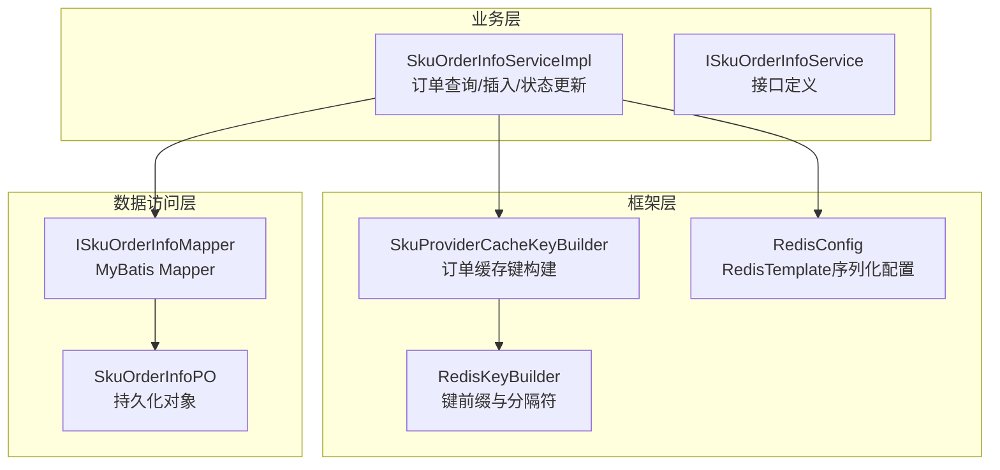
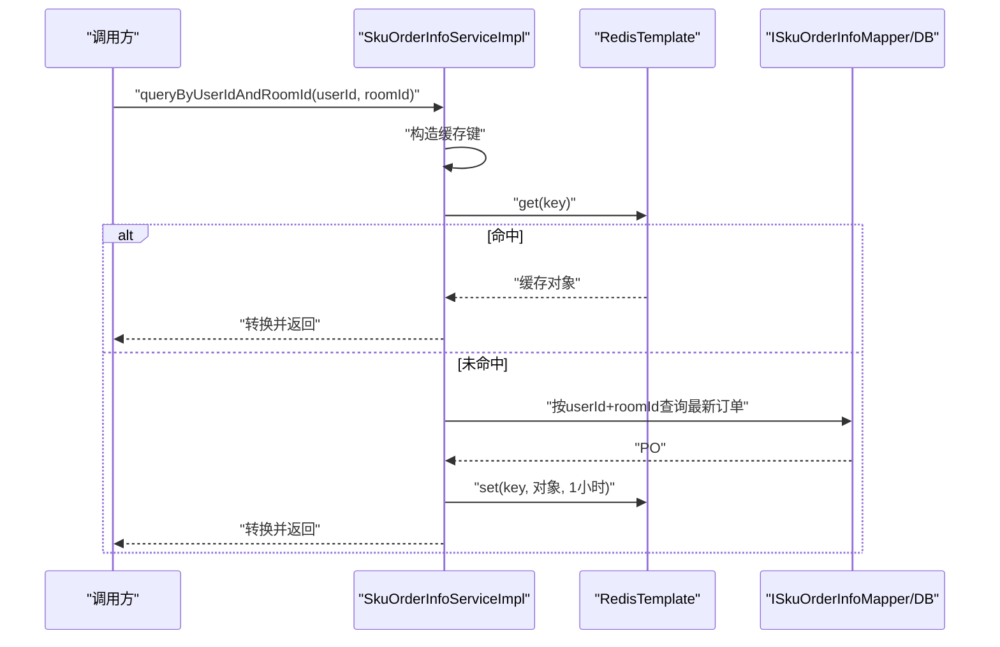
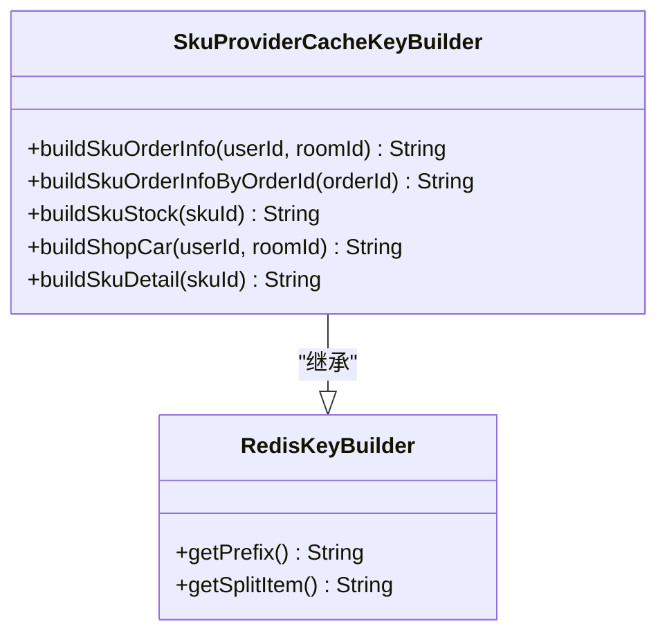
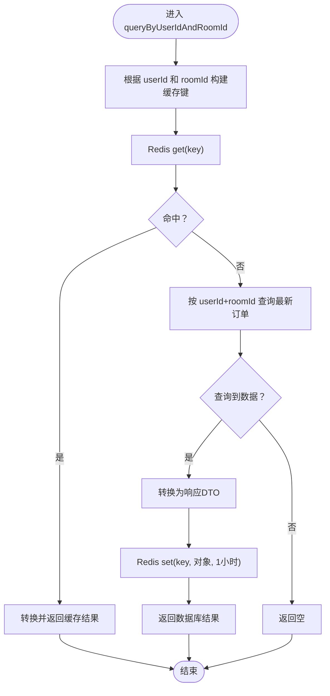
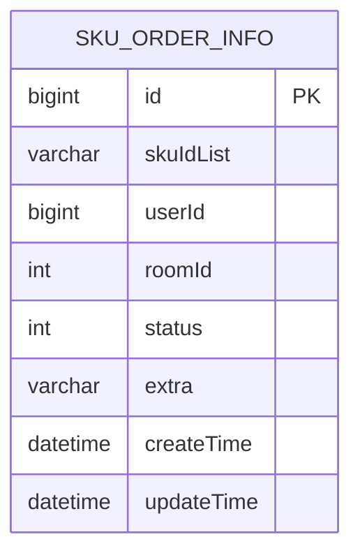
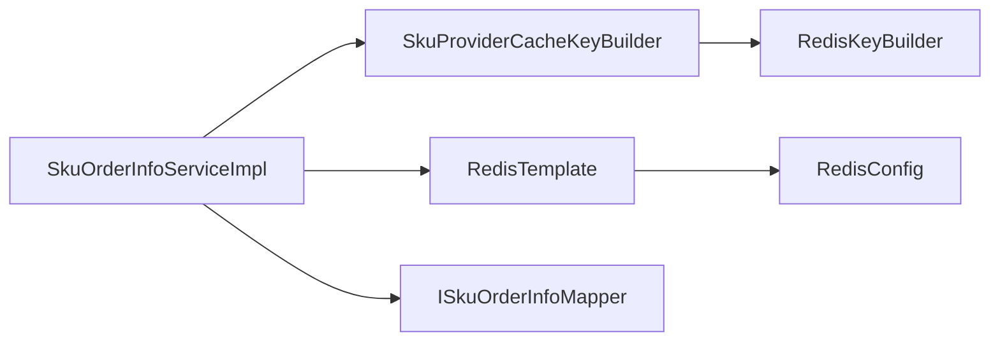

# 订单缓存策略

<cite>
**本文引用的文件列表**
- [SkuProviderCacheKeyBuilder.java](file://live-framework/live-framework-redis-starter/src/main/java/com/logilong/live/framework/redis/starter/key/SkuProviderCacheKeyBuilder.java)
- [RedisKeyBuilder.java](file://live-framework/live-framework-redis-starter/src/main/java/com/logilong/live/framework/redis/starter/key/RedisKeyBuilder.java)
- [RedisConfig.java](file://live-framework/live-framework-redis-starter/src/main/java/com/logilong/live/framework/redis/starter/config/RedisConfig.java)
- [SkuOrderInfoServiceImpl.java](file://live-sku-provider/src/main/java/com/logilong/live/sku/provider/service/impl/SkuOrderInfoServiceImpl.java)
- [ISkuOrderInfoService.java](file://live-sku-provider/src/main/java/com/logilong/live/sku/provider/service/ISkuOrderInfoService.java)
- [ISkuOrderInfoMapper.java](file://live-sku-provider/src/main/java/com/logilong/live/sku/provider/dao/mapper/ISkuOrderInfoMapper.java)
- [SkuOrderInfoPO.java](file://live-sku-provider/src/main/java/com/logilong/live/sku/provider/dao/po/SkuOrderInfoPO.java)
- [SkuOrderInfoReqDTO.java](file://live-sku-interface/src/main/java/com/logilong/live/sku/dto/SkuOrderInfoReqDTO.java)
- [SkuOrderInfoRespDTO.java](file://live-sku-interface/src/main/java/com/logilong/live/sku/dto/SkuOrderInfoRespDTO.java)
- [SkuOrderInfoEnum.java](file://live-sku-interface/src/main/java/com/logilong/live/sku/constants/SkuOrderInfoEnum.java)
</cite>

## 目录
1. [引言](#引言)
2. [项目结构](#项目结构)
3. [核心组件](#核心组件)
4. [架构总览](#架构总览)
5. [详细组件分析](#详细组件分析)
6. [依赖关系分析](#依赖关系分析)
7. [性能考量](#性能考量)
8. [故障排查指南](#故障排查指南)
9. [结论](#结论)

## 引言
本文件围绕订单信息的Redis缓存设计方案进行深入分析，重点说明以下内容：
- SkuProviderCacheKeyBuilder如何构建订单缓存键（buildSkuOrderInfo、buildSkuOrderInfoByOrderId）
- 缓存读取优先、数据库兜底的双写策略
- queryByUserIdAndRoomId方法中的缓存读取逻辑，包括缓存未命中时的数据库查询与结果回填机制
- 缓存更新策略：在订单状态变更时主动删除旧缓存而非更新，避免脏数据
- 缓存过期时间（1小时）对系统性能与一致性的权衡，并提出高并发场景下的缓存穿透、击穿、雪崩防护方案

## 项目结构
订单缓存相关代码分布在框架层的Redis Key构建器与业务层的SKU订单服务实现中，整体采用“键构建器 + 业务服务 + 数据访问层”的分层设计，职责清晰、耦合度低。

图表来源
- [SkuProviderCacheKeyBuilder.java](file://live-framework/live-framework-redis-starter/src/main/java/com/logilong/live/framework/redis/starter/key/SkuProviderCacheKeyBuilder.java#L1-L41)
- [RedisKeyBuilder.java](file://live-framework/live-framework-redis-starter/src/main/java/com/logilong/live/framework/redis/starter/key/RedisKeyBuilder.java#L1-L22)
- [RedisConfig.java](file://live-framework/live-framework-redis-starter/src/main/java/com/logilong/live/framework/redis/starter/config/RedisConfig.java#L1-L27)
- [SkuOrderInfoServiceImpl.java](file://live-sku-provider/src/main/java/com/logilong/live/sku/provider/service/impl/SkuOrderInfoServiceImpl.java#L1-L91)
- [ISkuOrderInfoService.java](file://live-sku-provider/src/main/java/com/logilong/live/sku/provider/service/ISkuOrderInfoService.java#L1-L27)
- [ISkuOrderInfoMapper.java](file://live-sku-provider/src/main/java/com/logilong/live/sku/provider/dao/mapper/ISkuOrderInfoMapper.java#L1-L10)
- [SkuOrderInfoPO.java](file://live-sku-provider/src/main/java/com/logilong/live/sku/provider/dao/po/SkuOrderInfoPO.java#L1-L27)

章节来源
- [SkuProviderCacheKeyBuilder.java](file://live-framework/live-framework-redis-starter/src/main/java/com/logilong/live/framework/redis/starter/key/SkuProviderCacheKeyBuilder.java#L1-L41)
- [SkuOrderInfoServiceImpl.java](file://live-sku-provider/src/main/java/com/logilong/live/sku/provider/service/impl/SkuOrderInfoServiceImpl.java#L1-L91)

## 核心组件
- 键构建器：提供统一的键前缀、分隔符与业务键生成方法，确保键空间隔离与可读性
- 业务服务：封装缓存读取优先、数据库兜底的查询流程；在订单状态变更时删除旧缓存
- 数据访问层：基于MyBatis的Mapper与PO，负责数据库读写

章节来源
- [SkuProviderCacheKeyBuilder.java](file://live-framework/live-framework-redis-starter/src/main/java/com/logilong/live/framework/redis/starter/key/SkuProviderCacheKeyBuilder.java#L1-L41)
- [SkuOrderInfoServiceImpl.java](file://live-sku-provider/src/main/java/com/logilong/live/sku/provider/service/impl/SkuOrderInfoServiceImpl.java#L1-L91)
- [ISkuOrderInfoMapper.java](file://live-sku-provider/src/main/java/com/logilong/live/sku/provider/dao/mapper/ISkuOrderInfoMapper.java#L1-L10)
- [SkuOrderInfoPO.java](file://live-sku-provider/src/main/java/com/logilong/live/sku/provider/dao/po/SkuOrderInfoPO.java#L1-L27)

## 架构总览
订单缓存的整体交互流程如下：客户端或上层服务调用业务服务，业务服务首先尝试从Redis读取，命中则直接返回；未命中则查询数据库并将结果写入Redis，随后返回。当订单状态发生变更时，业务服务删除对应用户+房间的旧缓存键，确保后续读取能从数据库刷新最新数据。

图表来源
- [SkuOrderInfoServiceImpl.java](file://live-sku-provider/src/main/java/com/logilong/live/sku/provider/service/impl/SkuOrderInfoServiceImpl.java#L30-L67)
- [ISkuOrderInfoMapper.java](file://live-sku-provider/src/main/java/com/logilong/live/sku/provider/dao/mapper/ISkuOrderInfoMapper.java#L1-L10)

## 详细组件分析

### 键构建器：SkuProviderCacheKeyBuilder
- 统一前缀与分隔符：通过父类RedisKeyBuilder提供应用名前缀与分隔符，确保键空间隔离
- 订单相关键：
  - 用户+房间维度：buildSkuOrderInfo(userId, roomId)
  - 订单ID维度：buildSkuOrderInfoByOrderId(orderId)
- 其他SKU相关键：库存、购物车、详情等，便于扩展统一管理

图表来源
- [RedisKeyBuilder.java](file://live-framework/live-framework-redis-starter/src/main/java/com/logilong/live/framework/redis/starter/key/RedisKeyBuilder.java#L1-L22)
- [SkuProviderCacheKeyBuilder.java](file://live-framework/live-framework-redis-starter/src/main/java/com/logilong/live/framework/redis/starter/key/SkuProviderCacheKeyBuilder.java#L1-L41)

章节来源
- [RedisKeyBuilder.java](file://live-framework/live-framework-redis-starter/src/main/java/com/logilong/live/framework/redis/starter/key/RedisKeyBuilder.java#L1-L22)
- [SkuProviderCacheKeyBuilder.java](file://live-framework/live-framework-redis-starter/src/main/java/com/logilong/live/framework/redis/starter/key/SkuProviderCacheKeyBuilder.java#L1-L41)

### 业务服务：SkuOrderInfoServiceImpl
- 缓存读取优先策略：
  - queryByUserIdAndRoomId：先查Redis，命中直接返回；未命中查库并回填Redis，过期时间1小时
  - queryByOrderId：同样遵循缓存优先策略
- 双写策略说明：
  - 写入：insertOne将请求转换为PO并入库
  - 更新：updateOrderStatus仅更新数据库状态，不直接更新缓存，而是删除旧缓存键，使下次读取从数据库刷新
- DTO/PO映射：使用通用转换工具进行对象转换

图表来源
- [SkuOrderInfoServiceImpl.java](file://live-sku-provider/src/main/java/com/logilong/live/sku/provider/service/impl/SkuOrderInfoServiceImpl.java#L30-L67)

章节来源
- [SkuOrderInfoServiceImpl.java](file://live-sku-provider/src/main/java/com/logilong/live/sku/provider/service/impl/SkuOrderInfoServiceImpl.java#L1-L91)
- [ISkuOrderInfoService.java](file://live-sku-provider/src/main/java/com/logilong/live/sku/provider/service/ISkuOrderInfoService.java#L1-L27)

### 数据模型与接口
- 接口定义：ISkuOrderInfoService提供查询、插入、状态更新与按订单ID查询的能力
- DTO/PO：SkuOrderInfoReqDTO/SkuOrderInfoRespDTO与SkuOrderInfoPO分别承载请求/响应与持久化对象
- 订单状态枚举：SkuOrderInfoEnum定义了待支付、已支付、已关闭等状态

图表来源
- [SkuOrderInfoPO.java](file://live-sku-provider/src/main/java/com/logilong/live/sku/provider/dao/po/SkuOrderInfoPO.java#L1-L27)
- [SkuOrderInfoReqDTO.java](file://live-sku-interface/src/main/java/com/logilong/live/sku/dto/SkuOrderInfoReqDTO.java#L1-L22)
- [SkuOrderInfoRespDTO.java](file://live-sku-interface/src/main/java/com/logilong/live/sku/dto/SkuOrderInfoRespDTO.java#L1-L31)
- [SkuOrderInfoEnum.java](file://live-sku-interface/src/main/java/com/logilong/live/sku/constants/SkuOrderInfoEnum.java#L1-L17)

章节来源
- [ISkuOrderInfoService.java](file://live-sku-provider/src/main/java/com/logilong/live/sku/provider/service/ISkuOrderInfoService.java#L1-L27)
- [SkuOrderInfoPO.java](file://live-sku-provider/src/main/java/com/logilong/live/sku/provider/dao/po/SkuOrderInfoPO.java#L1-L27)
- [SkuOrderInfoReqDTO.java](file://live-sku-interface/src/main/java/com/logilong/live/sku/dto/SkuOrderInfoReqDTO.java#L1-L22)
- [SkuOrderInfoRespDTO.java](file://live-sku-interface/src/main/java/com/logilong/live/sku/dto/SkuOrderInfoRespDTO.java#L1-L31)
- [SkuOrderInfoEnum.java](file://live-sku-interface/src/main/java/com/logilong/live/sku/constants/SkuOrderInfoEnum.java#L1-L17)

## 依赖关系分析
- 组件耦合：
  - 业务服务依赖键构建器与RedisTemplate，同时依赖Mapper进行数据库访问
  - 键构建器依赖RedisKeyBuilder提供的统一前缀与分隔符
- 外部依赖：
  - RedisTemplate序列化配置由RedisConfig提供，确保对象序列化一致性
- 循环依赖：
  - 无循环依赖，职责边界清晰

图表来源
- [SkuOrderInfoServiceImpl.java](file://live-sku-provider/src/main/java/com/logilong/live/sku/provider/service/impl/SkuOrderInfoServiceImpl.java#L1-L91)
- [SkuProviderCacheKeyBuilder.java](file://live-framework/live-framework-redis-starter/src/main/java/com/logilong/live/framework/redis/starter/key/SkuProviderCacheKeyBuilder.java#L1-L41)
- [RedisKeyBuilder.java](file://live-framework/live-framework-redis-starter/src/main/java/com/logilong/live/framework/redis/starter/key/RedisKeyBuilder.java#L1-L22)
- [RedisConfig.java](file://live-framework/live-framework-redis-starter/src/main/java/com/logilong/live/framework/redis/starter/config/RedisConfig.java#L1-L27)

章节来源
- [SkuOrderInfoServiceImpl.java](file://live-sku-provider/src/main/java/com/logilong/live/sku/provider/service/impl/SkuOrderInfoServiceImpl.java#L1-L91)
- [SkuProviderCacheKeyBuilder.java](file://live-framework/live-framework-redis-starter/src/main/java/com/logilong/live/framework/redis/starter/key/SkuProviderCacheKeyBuilder.java#L1-L41)
- [RedisConfig.java](file://live-framework/live-framework-redis-starter/src/main/java/com/logilong/live/framework/redis/starter/config/RedisConfig.java#L1-L27)

## 性能考量
- 缓存命中率与延迟：
  - 缓存读取优先显著降低数据库压力，提升查询延迟表现
  - 1小时过期时间在一致性与性能之间取得平衡：热点数据在有效期内重复命中，冷数据定期刷新
- 一致性策略：
  - 采用“更新即删除”策略，避免缓存与数据库的并发写冲突，减少脏读风险
  - 删除旧键后，下一次读取会触发数据库刷新，确保最终一致性
- 并发与一致性权衡：
  - 在高并发场景下，建议结合分布式锁或幂等设计，避免同一用户短时间内频繁触发数据库刷新
  - 对于极端高并发的“击穿/雪崩”，需配合穿透防护与随机过期策略

## 故障排查指南
- 缓存未命中但数据库存在：
  - 检查键构建是否正确（应用名前缀、分隔符、参数顺序）
  - 确认RedisTemplate序列化配置一致，避免反序列化失败导致返回null
- 订单状态更新后读取仍为旧值：
  - 确认updateOrderStatus是否调用了删除旧缓存键的逻辑
  - 检查是否存在多实例部署导致不同节点缓存不一致
- 缓存穿透/击穿/雪崩：
  - 穿透：对不存在的数据进行空值缓存（如返回null时写入短生命周期空对象）
  - 击穿：热点key过期时，使用互斥锁或单飞逻辑保护数据库
  - 雪崩：为批量key设置随机过期时间，避免集中过期

章节来源
- [SkuOrderInfoServiceImpl.java](file://live-sku-provider/src/main/java/com/logilong/live/sku/provider/service/impl/SkuOrderInfoServiceImpl.java#L30-L90)
- [RedisConfig.java](file://live-framework/live-framework-redis-starter/src/main/java/com/logilong/live/framework/redis/starter/config/RedisConfig.java#L1-L27)

## 结论
该订单缓存方案通过“键构建器 + 业务服务 + 数据访问层”的清晰分层，实现了缓存读取优先、数据库兜底的稳健策略。通过在订单状态变更时主动删除旧缓存，避免了缓存与数据库的并发写冲突，提升了系统的最终一致性。1小时的过期时间兼顾了性能与一致性；在高并发场景下，建议结合空值缓存、随机过期与互斥锁等手段进一步增强稳定性与可用性。