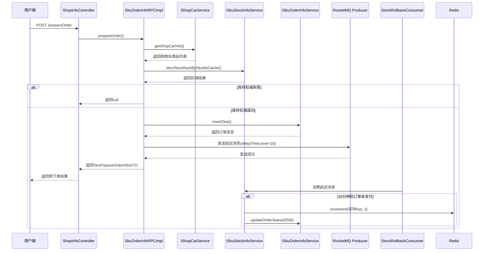

# 预下单流程

<cite>
**本文档引用文件**  
- [SkuOrderInfoRPCImpl.java](file://live-sku-provider\src\main\java\com\logilong\live\sku\provider\rpc\SkuOrderInfoRPCImpl.java)
- [SkuStockInfoServiceImpl.java](file://live-sku-provider\src\main\java\com\logilong\live\sku\provider\service\impl\SkuStockInfoServiceImpl.java)
- [ShopCarServiceImpl.java](file://live-sku-provider\src\main\java\com\logilong\live\sku\provider\service\impl\ShopCarServiceImpl.java)
- [ShopInfoServiceImpl.java](file://live-api\src\main\java\com\logilong\live\api\service\impl\ShopInfoServiceImpl.java)
- [StockRollbackConsumer.java](file://live-sku-provider\src\main\java\com\logilong\live\sku\provider\consumer\StockRollbackConsumer.java)
- [PrepareOrderVO.java](file://live-api\src\main\java\com\logilong\live\api\vo\PrepareOrderVO.java)
- [PrepareOrderReqDTO.java](file://live-sku-interface\src\main\java\com\logilong\live\sku\dto\PrepareOrderReqDTO.java)
- [SkuPrepareOrderInfoDTO.java](file://live-sku-interface\src\main\java\com\logilong\live\sku\dto\SkuPrepareOrderInfoDTO.java)
- [IShopCarService.java](file://live-sku-provider\src\main\java\com\logilong\live\sku\provider\service\IShopCarService.java)
- [ISkuStockInfoService.java](file://live-sku-provider\src\main\java\com\logilong\live\sku\provider\service\ISkuStockInfoService.java)
- [ISkuOrderInfoService.java](file://live-sku-provider\src\main\java\com\logilong\live\sku\provider\service\ISkuOrderInfoService.java)
</cite>

## 目录
1. [流程概述](#流程概述)
2. [核心组件与接口](#核心组件与接口)
3. [预下单流程实现机制](#预下单流程实现机制)
4. [库存扣减与事务保障](#库存扣减与事务保障)
5. [延迟消息与库存回滚](#延迟消息与库存回滚)
6. [调用时序图](#调用时序图)
7. [异常处理建议](#异常处理建议)

## 流程概述

预下单流程是直播电商平台中商品交易的核心前置环节，主要完成用户从购物车发起购买请求到订单创建前的准备操作。该流程通过分布式服务协作，实现购物车数据获取、库存预扣减、订单记录创建及超时回滚机制，确保在高并发场景下的数据一致性与用户体验。

**流程核心步骤**：
1. 用户发起预下单请求
2. 通过购物车服务获取用户购物车商品列表
3. 批量扣减商品库存（Redis缓存层面）
4. 创建预支付订单记录
5. 发送30分钟延迟消息用于超时回滚
6. 返回预下单响应DTO

**Section sources**
- [SkuOrderInfoRPCImpl.java](file://live-sku-provider\src\main\java\com\logilong\live\sku\provider\rpc\SkuOrderInfoRPCImpl.java#L63-L110)
- [PrepareOrderVO.java](file://live-api\src\main\java\com\logilong\live\api\vo\PrepareOrderVO.java#L1-L10)
- [PrepareOrderReqDTO.java](file://live-sku-interface\src\main\java\com\logilong\live\sku\dto\PrepareOrderReqDTO.java#L1-L17)

## 核心组件与接口

### 购物车服务（IShopCarService）
负责管理用户在直播间维度的购物车数据，基于Redis Hash结构实现，无需持久化存储。

**主要方法**：
- `getShopCarInfo()`：根据用户ID和直播间ID获取购物车详情
- `addShopCar()`：添加商品到购物车
- `clearShopCar()`：清空购物车

### 库存服务（ISkuStockInfoService）
负责商品库存的查询与扣减操作，采用Redis Lua脚本保证原子性，避免超卖。

**关键方法**：
- `decrStockNumBySkuIdsCache()`：批量扣减多个SKU的库存
- `stockRollbackHandler()`：处理库存回滚逻辑

### 订单服务（ISkuOrderInfoService）
负责订单的创建、查询与状态更新，通过MyBatis-Plus操作MySQL数据库。

**核心方法**：
- `insertOne()`：插入新的预支付订单
- `updateOrderStatus()`：更新订单状态

**Section sources**
- [IShopCarService.java](file://live-sku-provider\src\main\java\com\logilong\live\sku\provider\service\IShopCarService.java#L1-L33)
- [ISkuStockInfoService.java](file://live-sku-provider\src\main\java\com\logilong\live\sku\provider\service\ISkuStockInfoService.java#L1-L151)
- [ISkuOrderInfoService.java](file://live-sku-provider\src\main\java\com\logilong\live\sku\provider\service\ISkuOrderInfoService.java#L1-L27)

## 预下单流程实现机制

预下单流程由`SkuOrderInfoRPCImpl.prepareOrder()`方法驱动，完整实现路径如下：

1. **参数转换**：将`PrepareOrderReqDTO`转换为`ShopCarReqDTO`，用于后续购物车查询
2. **获取购物车数据**：调用`shopCarService.getShopCarInfo()`获取用户购物车中的商品列表
3. **提取SKU ID列表**：从购物车商品中提取所有SKU ID，用于批量库存操作
4. **库存预扣减**：调用`skuStockInfoService.decrStockNumBySkuIdsCache()`进行库存扣减
5. **创建订单**：若库存扣减成功，调用`skuOrderInfoService.insertOne()`创建预支付订单
6. **发送延迟消息**：调用`stockRollbackHandler()`发送30分钟延迟MQ消息
7. **构建响应DTO**：计算总价并封装`SkuPrepareOrderInfoDTO`返回给前端

**关键数据结构**：
- `SkuPrepareOrderInfoDTO`：包含总价格和商品明细列表
- `SkuPrepareOrderItemInfoDTO`：单个商品信息，包含数量和SKU详情

**Section sources**
- [SkuOrderInfoRPCImpl.java](file://live-sku-provider\src\main\java\com\logilong\live\sku\provider\rpc\SkuOrderInfoRPCImpl.java#L63-L110)
- [SkuPrepareOrderInfoDTO.java](file://live-sku-interface\src\main\java\com\logilong\live\sku\dto\SkuPrepareOrderInfoDTO.java#L1-L21)
- [SkuPrepareOrderItemInfoDTO.java](file://live-sku-interface\src\main\java\com\logilong\live\sku\dto\SkuPrepareOrderItemInfoDTO.java#L1-L22)

## 库存扣减与事务保障

### Redis Lua脚本保障原子性

库存扣减操作采用Redis Lua脚本实现原子性，避免高并发下的超卖问题。批量扣减的Lua脚本逻辑如下：

```lua
for i=1, ARGV[2] do
   if (redis.call('exists', KEYS[i]))~= 1 then return -1 end
   local currentStock=redis.call('get',KEYS[i])
   if (tonumber(currentStock)<=0 and tonumber(currentStock)-tonumber(ARGV[1])<0) then
       return -1
   end
end

for j=1,ARGV[2] do
   redis.call('decrby',KEYS[j],tonumber(ARGV[1]))
end
return 1
```

该脚本首先验证所有SKU的库存是否存在且充足，只有全部验证通过才执行批量扣减，确保操作的原子性。

### 分布式事务保障策略

由于涉及多个服务（购物车、库存、订单）和数据存储（Redis、MySQL），系统采用以下策略保障最终一致性：

1. **先扣库存后创单**：确保库存充足后再创建订单，避免订单创建后库存不足
2. **延迟消息补偿**：通过RocketMQ延迟消息实现超时回滚，作为最终一致性保障
3. **状态机控制**：订单状态严格遵循`PREPARE_PAY` → `PAYED`/`END`的流转，防止状态混乱

**Section sources**
- [SkuStockInfoServiceImpl.java](file://live-sku-provider\src\main\java\com\logilong\live\sku\provider\service\impl\SkuStockInfoServiceImpl.java#L47-L58)
- [SkuOrderInfoRPCImpl.java](file://live-sku-provider\src\main\java\com\logilong\live\sku\provider\rpc\SkuOrderInfoRPCImpl.java#L74-L75)

## 延迟消息与库存回滚

### 延迟消息发送机制

当预下单成功后，系统立即发送一条延迟30分钟的RocketMQ消息，用于处理订单超时场景：

```java
private void stockRollbackHandler(Long userId, Long orderId) {
    Message message = new Message();
    message.setTopic(SkuProviderTopicNames.ROLL_BACK_STOCK);
    RollbackStockInfoDTO rollbackStockInfoDTO = new RollbackStockInfoDTO();
    rollbackStockInfoDTO.setUserId(userId);
    rollbackStockInfoDTO.setOrderId(orderId);
    message.setBody(JSON.toJSONString(rollbackStockInfoDTO).getBytes());
    message.setDelayTimeLevel(16); // 30分钟延迟
    mqProducer.send(message);
}
```

**delayTimeLevel=16**对应RocketMQ的30分钟延迟级别（1s, 5s, 10s, 30s, 1m, 2m, ..., 30m）。

### 库存回滚消费者

`StockRollbackConsumer`监听`ROLL_BACK_STOCK`主题，处理延迟消息：

```java
mqPushConsumer.setMessageListener((MessageListenerConcurrently) (msgs, context) -> {
    RollbackStockInfoDTO rollbackStockInfoDTO = JSON.parseObject(
        new String(msgs.get(0).getBody()), 
        RollbackStockInfoDTO.class
    );
    skuStockInfoService.stockRollbackHandler(rollbackStockInfoDTO);
    return ConsumeConcurrentlyStatus.CONSUME_SUCCESS;
});
```

### 库存回滚逻辑

`stockRollbackHandler()`方法执行具体回滚操作：
1. 查询订单状态，若已支付则不回滚
2. 更新订单状态为"已结束"
3. 通过Redis `INCR`命令将库存逐个回滚

**Section sources**
- [SkuOrderInfoRPCImpl.java](file://live-sku-provider\src\main\java\com\logilong\live\sku\provider\rpc\SkuOrderInfoRPCImpl.java#L164-L178)
- [StockRollbackConsumer.java](file://live-sku-provider\src\main\java\com\logilong\live\sku\provider\consumer\StockRollbackConsumer.java#L1-L52)
- [SkuStockInfoServiceImpl.java](file://live-sku-provider\src\main\java\com\logilong\live\sku\provider\service\impl\SkuStockInfoServiceImpl.java#L133-L148)

## 调用时序图



**Diagram sources**
- [SkuOrderInfoRPCImpl.java](file://live-sku-provider\src\main\java\com\logilong\live\sku\provider\rpc\SkuOrderInfoRPCImpl.java#L63-L110)
- [ShopCarServiceImpl.java](file://live-sku-provider\src\main\java\com\logilong\live\sku\provider\service\impl\ShopCarServiceImpl.java#L64-L88)
- [SkuStockInfoServiceImpl.java](file://live-sku-provider\src\main\java\com\logilong\live\sku\provider\service\impl\SkuStockInfoServiceImpl.java#L116-L130)
- [StockRollbackConsumer.java](file://live-sku-provider\src\main\java\com\logilong\live\sku\provider\consumer\StockRollbackConsumer.java#L43-L47)

## 异常处理建议

### 库存扣减失败
- **原因**：商品库存不足或不存在
- **处理**：直接返回null，前端提示"库存不足"
- **优化**：在购物车展示时即进行库存校验，提前预警

### 订单创建失败
- **原因**：数据库插入异常
- **处理**：需立即调用库存回滚接口，避免库存锁定
- **优化**：实现补偿事务，定期扫描长时间处于`PREPARE_PAY`状态的订单

### 延迟消息发送失败
- **原因**：MQ服务不可用
- **处理**：抛出运行时异常，由调用方感知失败
- **优化**：增加本地事务表+定时任务补偿机制

### 消费者处理失败
- **原因**：库存回滚逻辑异常
- **处理**：RocketMQ会自动重试，最多16次
- **优化**：增加死信队列监控，人工介入处理

**Section sources**
- [SkuOrderInfoRPCImpl.java](file://live-sku-provider\src\main\java\com\logilong\live\sku\provider\rpc\SkuOrderInfoRPCImpl.java#L75-L76)
- [SkuStockInfoServiceImpl.java](file://live-sku-provider\src\main\java\com\logilong\live\sku\provider\service\impl\SkuStockInfoServiceImpl.java#L135-L136)
- [StockRollbackConsumer.java](file://live-sku-provider\src\main\java\com\logilong\live\sku\provider\consumer\StockRollbackConsumer.java#L46-L47)